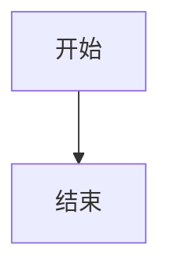
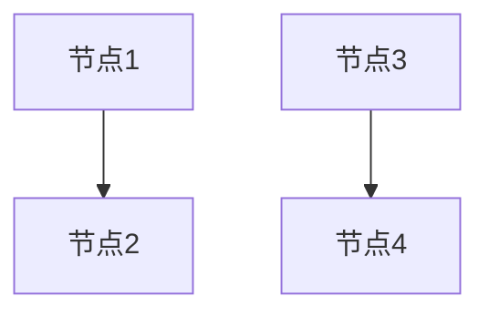
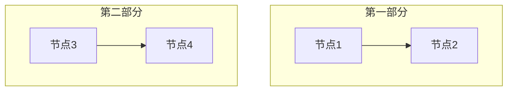
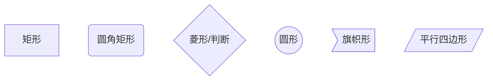
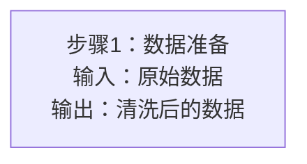
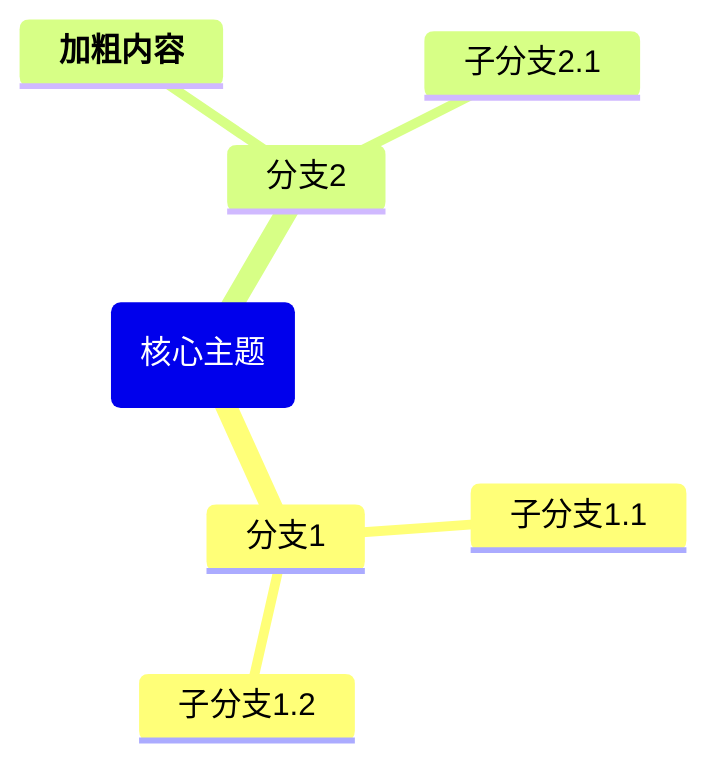
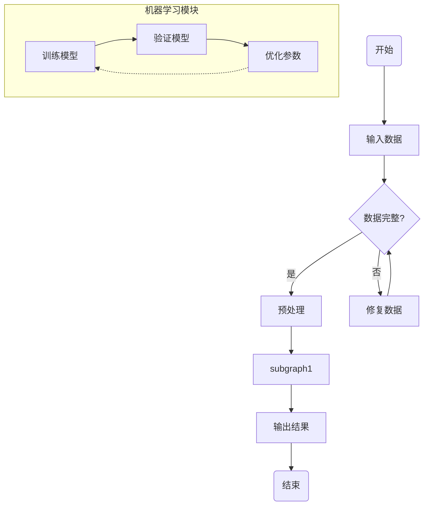

# Mermaid图规范

## 基本布局

### 必须使用 graph TB



**TB = Top to Bottom（从上到下）**

❌ 不要使用：
- `graph LR`（除非在subgraph内）
- `graph TD`（虽然等价于TB，但统一使用TB）
- `flowchart`（使用graph）

---

## 子图布局

### 子图内使用 direction LR

```mermaid
graph TB
    A[输入] --> B[处理]

    subgraph "数据处理模块"
        direction LR
        C[步骤1] --> D[步骤2] --> E[步骤3]
    end

    B --> C
    E --> F[输出]
end
```

**LR = Left to Right（从左到右）**

**原因**：子图中如果有箭头，横向排列更紧凑。

---

## 🚨 高危错误：使用 --- 分隔符

### 绝对禁止

```mermaid
graph TB
    A[节点1] --> B[节点2]
    ---                    # ❌ 禁止！
    C[节点3] --> D[节点4]
```

**后果**：`---`会被Markdown解析器误认为frontmatter分隔符，导致整个文档解析失败。

### 替代方案

如果需要分隔不同的部分，使用注释或子图：



或者：



---

## 子图标题

### 不要使用Markdown标记

```mermaid
graph TB
    subgraph "数据处理模块"    # ✅ 正确
        A --> B
    end

    subgraph "### 数据处理模块"  # ❌ 错误：Markdown标记
        A --> B
    end
```

---

## 列表格式

### 不要有空格

```mermaid
graph TB
    A["1.第一步<br/>2.第二步<br/>3.第三步"]    # ✅ 正确

    B["1. 第一步<br/>2. 第二步<br/>3. 第三步"]  # ❌ 错误：有空格
```

**原因**：`1. `会被识别为Unsupported Markdown，导致报错。

---

## 节点形状

### 常用形状



### 推荐用法

- **矩形**：普通步骤、数据
- **圆角矩形**：开始、结束
- **菱形**：判断、分支
- **圆形**：状态、特殊节点

---

## 箭头类型

### 实线箭头

```mermaid
graph TB
    A --> B    # 普通箭头
    C -->|标签| D    # 带标签箭头
```

### 虚线箭头

```mermaid
graph TB
    A -.-> B    # 虚线箭头
    C -.->|标签| D    # 带标签虚线箭头
```

### 粗箭头

```mermaid
graph TB
    A ==> B    # 粗箭头
    C ==>|标签| D    # 带标签粗箭头
```

---

## 节点标签

### 换行

使用`<br/>`换行：



### 特殊字符

需要转义或避免的字符：
- 不要用`"`（英文引号）在标签外
- 可以用`"`（中文引号）在标签内
- 避免用`---`

---

## 思维导图

### 基本格式



### 注意事项

1. **root必须用圆括号**：`root(标题)`
2. **加粗用`**`包裹**，不用`<b>`标签
3. **缩进表示层级**

---

## 复杂流程图示例



---

## 常见错误

### 1. 使用 --- 分隔符 ❌

```mermaid
graph TB
    A --> B
    ---         # 错误！
    C --> D
```

### 2. 子图标题有Markdown标记 ❌

```mermaid
graph TB
    subgraph "### 模块名称"  # 错误！
        A --> B
    end
```

### 3. 列表有空格 ❌

```mermaid
graph TB
    A["1. 第一项"]  # 错误！会报Unsupported Markdown
```

### 4. 多余的end ❌

```mermaid
graph TB
    subgraph "模块1"
        A --> B
    end
    C --> D
end  # 错误！多余的end
```

### 5. 在主图用LR布局 ❌

```mermaid
graph LR  # 错误！应该用TB
    A --> B --> C
```

---

## 检查方法

### 自动检查

使用`tools/check_blog_quality.py`会检测：
- 是否使用`graph TB`
- 是否有`---`分隔符
- 列表格式是否正确

### 手动检查

1. **检查布局**：搜索`graph`，确认都是`graph TB`
2. **检查分隔符**：搜索`---`，确认没有在mermaid中
3. **检查列表**：搜索`\d+\. `，确认没有空格

---

## 完整示例

### ❌ 错误示例

```mermaid
graph LR
    A[输入] --> B[处理]
    ---
    subgraph "### 核心模块"
        C["1. 步骤1"] --> D["2. 步骤2"]
    end
    B --> C
    D --> E[输出]
end
```

**错误**：
1. 使用了`graph LR`
2. 使用了`---`分隔符
3. 子图标题有Markdown标记
4. 列表有空格
5. 多余的`end`

### ✅ 正确示例

```mermaid
graph TB
    A[输入] --> B[处理]

    subgraph "核心模块"
        direction LR
        C["1.步骤1"] --> D["2.步骤2"]
    end

    B --> C
    D --> E[输出]
```

**正确**：
1. 使用`graph TB`
2. 无`---`分隔符
3. 子图标题无Markdown标记
4. 列表无空格
5. subgraph数量与end数量匹配
