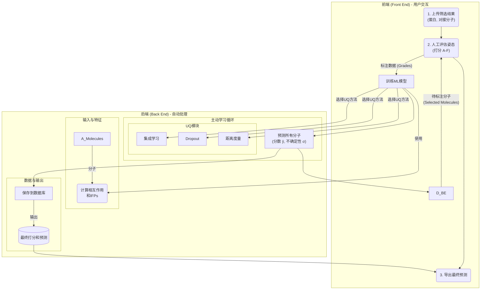

# AI陪你看靶点：Autoparty如何将"人工看Pose"的"祖传手艺"变成可传承的模型

## 本文信息

- **标题**: Autoparty: Machine Learning-Guided Visual Inspection of Molecular Docking Results
- **作者**: Laura Shub, Magdalena Korczynska, Duncan F. Muir, Fang-Yu Lin, Brendan W. Hall, Alan M. Mathiowetz, and Michael J. Keiser
- **单位**: University of California, San Francisco; Pfizer Research & Development
- **引用格式**: Shub, L., Korczynska, M., Muir, D. F., Lin, F.-Y., Hall, B. W., Mathiowetz, A. M., & Keiser, M. J. (2025). Autoparty: Machine Learning-Guided Visual Inspection of Molecular Docking Results. *Journal of Chemical Information and Modeling*, *65*, 7817-7826.

## 摘要

> 在虚拟药物筛选流程中，由人类专家对潜在药物化合物进行审查是至关重要的一环。然而，鉴于人类能够实际检查的分子数量相对于虚拟筛选的庞大规模而言极为有限，加速这一过程的需求日益迫切。此外，计算药物化学家在评估不同对接姿态时可能存在不一致，并且目前没有标准化的方法来记录这些注释。为了应对这些挑战，我们提出了Autoparty，一个容器化的工具。Autoparty利用本地化的主动学习技术进行药物发现，促进了“人在环路中”的模型训练，从而能够外推出人类的直觉判断。我们利用多种不确定性量化指标来向用户查询信息最丰富的样本进行模型训练，从而限制了所需的人类专家训练标签数量。收集到的注释会填充到一个持久且可导出的本地数据库中，以供广泛的下游应用。在一个真实的案例研究中，纳入Autoparty使得在193个经过实验测试的化合物中，命中率比单独使用形状相似性方法提高了40%。

## 背景

在计算机辅助药物设计（CADD）的广阔领域中，虚拟筛选（Virtual Screening, VS）是早期药物发现的基石。这个过程就像一个巨大的漏斗，从数十亿甚至更多的分子库开始，通过一系列计算步骤——库的准备、分子对接、打分和排序、聚类和过滤——逐步筛选，最终期望在漏斗的末端得到几十到一百个最有希望的候选分子进入实验验证。

然而，这个看似自动化的流程中存在一个关键的、近乎“手工作坊”式的瓶颈——**人工审查（Manual Inspection）**，也被药物化学家们戏称为“**挑分子派对（Hit Picking Parties）**”。由于对接程序使用的打分函数存在固有的局限性（源于生物物理的抽象和打分项权重的难题），计算出的高分分子中常常混杂着大量的假阳性。为了去伪存真，经验丰富的计算药物化学家必须亲自上阵，在三维软件中逐一检查排名靠前的分子的对接姿态（pose），评估其与靶点口袋的相互作用是否合理、构象是否稳定等。研究发现，经过专家审查挑选的分子，其后续实验的成功率和活性强度，通常都显著优于仅靠打分函数筛选的结果。

这个“人工审查”环节虽然效果显著，但其弊端也显而易见：

1. **可扩展性极差**：一个专家或团队能审查的分子数量极为有限（通常在1000个左右），这与动辄数十亿的分子库规模形成鲜明对比。大量有潜力的、但排名稍靠后的“假阴性”分子因此被永远地埋没。
2. **主观性和不一致性**：不同的专家可能会有不同的判断标准和偏好，甚至同一个专家在不同时间也可能做出不一致的评估。
3. **知识无法传承**：专家的“火眼金睛”是一种内隐的直觉和经验，很难被量化和记录下来，形成一套标准化的知识体系供他人学习或机器利用。

## 关键科学问题

本文旨在解决的核心科学问题是：如何**规模化、标准化并最终模型化**药物发现中至关重要但效率低下的“人工审查”环节？具体而言，能否开发一个工具，它不仅能记录专家的决策，还能通过机器学习**主动学习**专家的“直觉”，训练出一个能够模拟专家判断的模型，并利用这个模型去赋能更大规模的分子筛选，从而打破人工审查的瓶颈，提高药物发现的效率和成功率？

## 创新点

- **提出Autoparty工具**：开发了一个基于Python的容器化Web应用，首次将“人在环路中”的**主动学习（Active Learning, AL）**框架应用于对接结果的人工审查环节。
- **主动学习与不确定性量化**：模型并非被动学习，而是通过多种**不确定性量化（Uncertainty Quantification, UQ）**方法（如集成学习、Dropout、距离度量），主动挑选出对模型训练“信息量最大”（即模型最“拿不准”）的分子姿态，请求人类专家进行标注，从而用最少的专家标注数据训练出最有效的模型。
- **专家知识的捕获与复用**：所有的人工注释（打分）都被保存在一个**持久化、可导出的SQL数据库**中。这不仅为项目创建了一个可追溯的决策记录，更重要的是，积累的数据可用于训练一个能**模拟专家直觉**的机器学习模型，该模型可被应用于筛选更多的分子。
- **真实世界验证的显著效果**：在一个与辉瑞公司合作的前瞻性药物筛选项目中，使用Autoparty辅助决策，使得最终测试的化合物**命中率（hit rate）提升了40%**。

## 研究内容

### 核心方法：Autoparty工作流详解

Autoparty是一个集成了前端交互界面和后端机器学习引擎的完整系统。其核心思想是通过一个主动学习循环，让机器在与人类专家的互动中，逐步学会如何评估一个对接姿态的好坏。

**图1：虚拟筛选流程与主动学习概览。**

> a) 药物发现的“漏斗”展示了标准的筛选步骤以及剩余的分子数量（近似值），这激发了对确保有前景的分子进入实验测试的工具的需求。b) “人在环路中”的主动学习训练范式。起始数据集缺少许多真实标签。“神谕”（人类）最初为模型训练标记一个随机子集。初始模型为未标注的数据预测标签及其不确定性。“神谕”对选定的样本进行标注。此过程重复进行，直到达到标签配额或期望的准确度。

**图2：Autoparty工作流与用户交互示意图。**

> a) 用户与Autoparty的“前端”功能进行交互。这些功能包括上传初始筛选结果，导入可选的预先存在的注释，以及为新分子打分。用户还可以从数据库中导出所有现有的打分和预测。显示的分子是对接到AmpC β-内酰胺酶中的ZINC000000002896 (F)和ZINC000000058902 (A)。b) Autoparty的“后端”功能自动辅助“挑分子”过程。Autoparty在上传时计算每个蛋白-配体复合物的相互作用和LUNA相互作用指纹（IFPs）。Autoparty使用用户选择的架构和置信度评估程序来训练一个机器学习模型。可用选项包括集成学习（ensemble），其中使用各个模型之间的方差作为置信度的度量；dropout，它在随机“丢弃”神经网络权重的同时多次重新预测同一个样本以计算得分分布；以及距离（distance），它使用新样本与训练集中样本的拓扑相似性。后端还保存用户提供的打分，训练模型以预测人类标签，并根据采集函数对化合物进行排序。

**1. 输入表示：从3D结构到相互作用指纹 (IFP)**

- 当用户上传对接结果后，Autoparty的后端首先使用**LUNA**工具包计算每个蛋白-配体复合物的分子间相互作用，如氢键、疏水作用、范德华作用等。
- 随后，这些三维的相互作用信息被编码成一个固定长度的向量，即**相互作用指纹（Interaction Fingerprints, IFPs）**。与只编码分子自身化学结构的传统指纹不同，IFPs能够**同时捕捉配体和口袋界面的几何与生物物理特性**，这对于学习结合模式至关重要。

**2. 主动学习循环与模型训练**

- **初始阶段**：用户首先需要对少量（默认100个）由对接分数排序的分子进行打分（A-F）。
- **模型训练**：一旦收集到足够的初始标注，Autoparty就会在后端训练一个机器学习模型（默认为一个由3个独立神经网络组成的委员会模型）。该模型学习从IFP到人类专家打分的映射关系。
- **不确定性量化与分子选择**：训练好的模型会对库中所有未标注的分子进行预测，同时给出每个预测的**不确定性**。Autoparty提供了多种UQ方法：
  - **集成学习 (Ensemble)**：通过比较委员会中多个独立模型的预测差异来衡量不确定性。分歧越大，不确定性越高。
  - **Dropout**：在单个模型中，通过多次预测并随机“丢弃”部分神经元，根据预测结果的分布来计算不确定性。
  - **距离度量 (Distance)**：新样本与训练集中最近邻样本的距离被用作不确定性的代理。
- **“人在环路”**：系统根据**采集函数（acquisition function）**（例如，默认选择不确定性最高的分子）将新的、信息量最大的分子推送给用户进行标注。这个“标注-训练-预测-选择”的过程不断循环，直到达到预设的标注数量或模型收敛。

**3. 界面与功能**

- Autoparty提供了一个简洁的Web界面。用户可以在浏览器中直观地看到3D的蛋白-配体相互作用图，并给出A（非常好）、B（好）、C（一般）、D（差）、F（非常差）的评分。
- 模型仪表盘可以实时监控训练过程中的损失函数曲线和模型性能。

**图3：Autoparty网页界面。**

> a, 筛选上传界面。除了必需的蛋白质和单独的分子文件外，用户可以指定一个属性来对初始注释的分子进行排序。用户还可以为相互作用计算提供特定的LUNA配置。b, “挑分子”界面，用于人在环路的主动学习训练。当前分子及其计算出的蛋白质位点相互作用（钙依赖性蛋白激酶CDPK1，PDB ID: 3T3U）显示在可能分配的等级之上。右上角显示当前模式（注释 vs. 审查）和排序方法（分数、不确定性、分歧、随机），以及到其他操作（例如，筛选数据集选项）和模型训练面板的下拉菜单。c, 模型仪表盘，显示训练曲线（左）和模型在训练迭代中的准确率历史（右）。

### 实验结果与分析

**1. 回顾性案例研究：在UCSF公开数据集上的验证**

- 作者在两个公开的、包含大量对接结果和实验活性数据的大规模筛选项目（靶点为AmpC β-内酰胺酶和多巴胺D4受体）上，对Autoparty进行了回顾性验证。
- 为了模拟真实场景，他们**故意从训练集中排除了所有已知的活性分子及其结构类似物**。
- **结果（AmpC靶点）**：
  - 使用Autoparty预测的A或B等级作为额外过滤器，可以将**人工审查的命中率从21.7%提升到33.8%**。
  - 如果完全依赖Autoparty的预测（A或B级），在所有实验测试过的分子上，**命中率达到了37.4%，高于任何其他筛选方法**。
- **结果（D4靶点）**：
  - Autoparty的表现不如人工审查，但其命中率（18.9%）仍高于随机筛选（14.5%）。
  - 值得注意的是，对于对接分数很差的分子，Autoparty预测为A级的化合物仍然达到了**22%的命中率**，远高于该分数段的整体命中率（7.6%）。这有力地证明了**Autoparty有潜力从被传统方法忽略的低分区域“挖掘”出被埋没的活性分子**。

**图4：UCSF回顾性案例研究。**

> a,c AmpC和b,d D4靶点上，用户打分（蓝色）与Autoparty对实验测试分子的预测打分（粉色）的分布统计和混淆矩阵。e,f 化学空间的PCA可视化，显示了所有分子（灰色）、用户打分的分子（粉色）、高分分子（蓝色）和实验确认的活性分子（橙色）的分布。活性分子（橙色）及其结构相似的分子被主动地从Autoparty训练中排除。

**2. 前瞻性案例研究：与辉瑞公司的真实药物筛选项目合作**

- 这是对Autoparty最有力的验证。辉瑞的团队使用Autoparty辅助一个针对未公开靶点的虚拟筛选项目。
- 团队首先对72个化合物进行了人工标注，然后训练了一个Autoparty模型。
- **结果**：
  - 他们最终测试了193个由“其他方法”（高对接分数+形状互补性）筛选出的分子。
  - 在这193个分子中，如果只看“其他方法”的筛选结果，命中率（IC₅₀ < 30 μM）为7.4%。
  - 而如果只看Autoparty预测为A或B级的分子，**命中率则达到了10.4%，相比之下提升了40%**。
  - 更重要的是，在两种方法都推荐的分子中，命中率达到了10.8%，而Autoparty不推荐但其他方法推荐的分子，命中率仅为5.3%。这表明**Autoparty成功地扮演了“过滤器”的角色，剔除了大量假阳性**。

**图5：Autoparty前瞻性案例研究。**

> a) 用户分配的等级（蓝色）和Autoparty分配的等级（粉色）的计数。两种分布相似，尽管Autoparty将更高比例的化合物分配为C级，这可能对应于与获得注释的那些IFP不相似的IFP。值得注意的是，Autoparty没有分配F级，这表明模型无法从单个注释中学习到人类分配等级的模式。两种方法分配A级的比例相似，占人类注释的43%和预测等级的32%。b) Autoparty与其他方法选择的化合物和命中率的维恩图。两种方法都选择的分子，其命中率超过了任一单独选择方法的命中率。

## Q&A

- **Q1**: Autoparty是如何处理不同专家之间可能存在的打分不一致问题的？
- **A1**: Autoparty本身的设计并没有直接解决专家间的分歧，但它提供了一个框架来缓解这个问题。首先，所有的打分都被记录在数据库中，这使得团队可以追溯和讨论有争议的分子。其次，“Review”模式下的“Disagreement”排序功能会高亮出那些模型高置信度预测与人类专家先前标注不符的分子，促使专家重新审视和思考，有助于达成共识。长远来看，通过收集不同专家的标注，甚至可以训练能够反映特定专家偏好或团队共识的模型。
- **Q2**: 为什么选择相互作用指纹（IFPs）作为模型的输入，而不是更复杂的3D图神经网络？
- **A2**: 这是一个在模型复杂度和数据量之间的权衡。论文中提到，在**小数据集**的情况下，基于指纹的表示与更复杂的消息传递神经网络（如图神经网络）的性能相当。考虑到“人工审查”环节能产生的标注数据量非常有限（通常几百到一千个），使用计算高效且性能稳健的IFPs是一个非常务实和明智的选择。它能快速训练模型，并为主动学习循环提供及时的反馈。
- **Q3**: 主动学习中的“不确定性量化（UQ）”具体是如何帮助模型更快地学习的？
- **A3**: UQ的核心思想是让模型知道自己“不知道什么”。一个刚开始训练的模型可能对某些类型的分子（比如化学结构新颖或相互作用模式罕见）的打分非常“不确定”或“纠结”。主动学习策略正是利用这一点，优先将这些模型最“困惑”的分子推送给专家。专家对这些信息量最大的样本进行标注，能最高效地帮助模型填补知识盲区、修正错误认知，从而用最少的标注数据达到最好的学习效果，避免了在模型已经很“自信”的区域浪费专家宝贵的时间。
- **Q4**: Autoparty这个工具是否可以用于虚拟筛选之外的其他任务？
- **A4**: 是的，论文结尾提到了这一点。虽然Autoparty是为虚拟筛选的“人工审查”设计的，但其核心框架——**捕获人类对三维结构化数据的直觉判断**——具有更广泛的应用潜力。例如，用户可以不基于主观的“好坏”来打分，而是基于**实验测得的活性值**（如IC₅₀）进行分箱打分。这样，Autoparty就可以被用来训练一个定量的结构-活性关系（QSAR）模型，直接从对接姿态预测分子的活性区间。
- **Q5**: 这个工具是否能完全取代计算药物化学家？
- **A5**: 完全不能。恰恰相反，Autoparty的设计理念是**增强而非取代**人类专家。它是“人在环路中”的工具，其性能的上限取决于输入的人类专家知识的质量。专家的角色从一个重复性的体力劳动者（审查成百上千个分子），转变为一个**模型训练师和决策者**。专家通过标注少量关键分子来“教会”AI自己的判断逻辑，然后让AI去完成大规模的初步筛选，最后专家再对AI筛选出的精华进行最终定夺。它将专家从繁重的工作中解放出来，使其能专注于更具创造性的策略思考。

## 关键结论与批判性总结

### 核心结论

- **成功开发了Autoparty**，一个创新的、容器化的Web工具，通过“人在环路中”的主动学习，高效地训练机器学习模型来模拟和扩展计算药物化学家的专业直觉。
- **实现了对专家审查过程的规模化**，通过主动学习和不确定性量化，用最少的专家标注（几百个）训练出能有效筛选数千乃至数万个分子的模型。
- **建立了标准化的注释数据库**，将专家的隐性知识转化为持久、可复用的数字资产，为模型迭代和团队知识传承提供了基础。
- **在真实世界的前瞻性药物发现项目中得到验证**，与辉瑞公司合作的案例表明，使用Autoparty辅助筛选，可将**命中率有效提升40%**，并成功富集了高活性化合物。

### 批判性总结与展望

Autoparty是连接**人类专家直觉**与**机器计算规模**之间鸿沟的一次非常成功和巧妙的尝试。它没有试图用一个通用的、端到端的模型去解决复杂的药物发现问题，而是精准地切入了“人工审查”这个长期存在且公认的痛点，并提供了一个极为务实的解决方案。**其最大的贡献在于，它不仅是一个提效工具，更是一个知识捕获和传承的平台**，使得宝贵的专家经验不再是“一次性”的消耗品，而是可以被累积、学习和放大的数字资产。

**潜在的局限性**在于，模型的性能高度依赖于初始标注专家的水平和一致性。如果专家的判断本身存在偏差，模型也只会放大这种偏差。此外，目前使用的IFP虽然高效，但在捕捉复杂的变构效应或长程相互作用方面可能不如3D图神经网络等更前沿的模型。

**未来的发展方向**将非常广阔。首先，可以将更先进的表示学习方法（如等变图神经网络）整合到后端，以期在拥有更多数据后获得更高的预测精度。其次，可以将Autoparty的框架从对接后的筛选，扩展到药物设计的更多环节，例如基于生成模型产生分子的筛选、ADMET性质的预测等。最终，这类“人机协作”的工具将成为未来药物研发的标准配置，让科学家能够站在AI的肩膀上，更快、更准地发现新药。