# 结构片段一键移植：SiteMatcher如何把相互作用模式转成可设计的配体

## 本文信息

- **标题**: 用蛋白-配体相互作用模式驱动的结构设计服务器SiteMatcher
- **作者**: Dongliang Ke, Weiyu Zhou, Zhihan Zhang, Chengshan Jin, Yi Wu, Xiaolin Pan, Xingyu Wang, Xudong Xiao, Changge Ji
- 发表时间: 2025年11月24日
- **单位**: 华东师范大学上海分子治疗与新药开发工程研究中心；纽约大学上海-华师大计算化学联合中心，中国上海
- **引用格式**: Ke, D.; Zhou, W.; Zhang, Z.; Jin, C.; Wu, Y.; Pan, X.; Wang, X.; Xiao, X.; Ji, C. (2025). SiteMatcher: A Web Server for Structure-Based Drug Design Using Protein−Ligand Interaction Patterns. *J. Chem. Inf. Model.*, XXX(XX), 1-9. https://doi.org/10.1021/acs.jcim.5c02173
- **相关资源**: SiteMatcher 服务器 https://sitematcher.xundrug.cn；教程与示例：https://youtu.be/pImbw3rnlbs

## 摘要

> SiteMatcher 将PDB复合物拆解成单相互作用与双相互作用记录，再配以三维连接子库，形成可快速查询的片段-口袋匹配数据库。服务器提供Grow与Replace两种工作模式，自动识别待拓展向量、筛选结构与药效团约束、调用Smina优化新配体，并按p38α、Is-QC、KEAP1等真实案例展示 fragment grafting 与连接子拼接的全过程。**平均运行时间可在网页端实时完成结构设计**。

**SiteMatcher 就是一款有海量真实口袋模板的拼图软件**：你把自己的蛋白结构和一个初始小分子上传，它会自动告诉你口袋里还能贴什么片段、什么连接子（linker）合适、需要满足哪些氢键或电荷条件，并且在网页上即时拼出新分子并给出评分，省去了手工比对与反复导入导出的繁琐流程。

### 核心结论

- **模式库覆盖五类相互作用环境**：基于蛋白原子类型划分，可快速检索单、双相互作用模板。
- **连接子库预编码出口向量**：提前计算CAVEAT描述符，使片段与种子在三维空间自动对齐。
- **双模式交互串联Grow与Replace**：p38α、Is-QC、KEAP1三个案例均可在网页侧复现实验活性。
- **整体target success rate接近五成**，激酶可达72.7%，并能在近九万七千个生成分子中找回176个已知活性体。

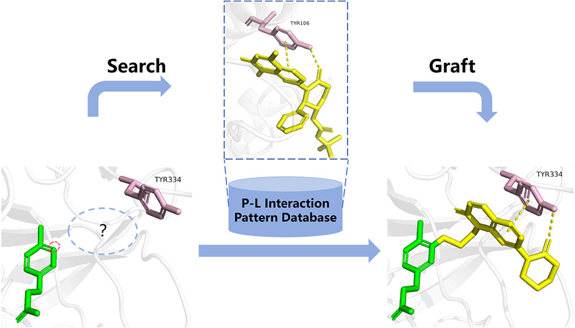

## 背景

**结构基础药物设计依赖海量蛋白-配体复合物来推断口袋偏好的作用模式**。
PDB累计结构突破24万，氢键、π-π堆叠与离子配对等局域模式已经证明能指导配体优化、执行生物电子同效取代，乃至跨靶点迁移学习。问题在于：这些模式以孤立晶体形式存在，化学家需要逐个复制粘贴，并手动调整坐标、化学键与药效团约束，效率极低。学术界出现sc-PDB-Frag、SubCav、PROLIX、PELIKAN、VAMMPIRE等工具，但它们要么停留在检索相互作用，要么输出需要大量手工编辑的碎片，尚未形成“输入蛋白+种子，输出候选分子”的闭环。

**片段生长、骨架替换、连接子设计等常规动作必须在一个界面里完成蛋白定位、向量筛选、片段筛选与结果可视化**，否则实时交互无法实现。如果缺乏一体化平台，药化科学家只能在多套软件间切换，交互成本远大于算法本身。

**现有流程的另一痛点是上下游脱节**：片段检索工具往往与Docking、评分、可视化系统分离，导致研究者需要导出多份文件并在不同软件间维护版本。任何一次参数调整都要重复整个流程，严重拖慢设计-验证迭代。

此外，**PDB结构质量参差不齐**，口袋中不必要的溶剂或金属离子、缺失的氢原子都会让片段匹配难以成功。一个可复用的平台必须建立严格的预处理规范，同时允许用户快速审阅并补充约束。

**SiteMatcher 通过统一预处理、片段模板库与交互式Grow/Replace**。
平台把“手工复制粘贴+反复导入导出”的痛点压缩成网页上90秒可完成的流程。

### 关键科学问题

**SiteMatcher 针对的核心难题是如何把PDB模板标准化并兼顾三维拼接**，既能按口袋化学环境检索，又能在三维空间中与任意种子分子对接。这要求系统同时解决三件事：

1. **复合物快速解构**，抽象出可复用的类似药效团片段。
2. **出口向量自动对齐**，让片段的几何与种子可生长键吻合，否则无法合成合理结构。
3. **前后台一体化**，在交互式网页中串联上传、选向量、选蛋白位点、设约束、拼接、打分的全流程。

### 创新点

- 五类蛋白原子+单/双相互作用模式：**把蛋白原子划分为氢键受体A、氢键供体D、芳香Aro、正电P、负电N五类，再组合出15种双相互作用类型**（分别对应Acceptor、Donor、Aromatic、Positive、Negative），实现模式化检索。
- **连接子库预编码出口向量**：通过CAVEAT描述出口向量几何关系，可在Grow或Replace过程中自动匹配适配的链长与折角。
- **可视化约束与多模式工作流**：Grow模式高亮所有可延伸向量，Replace模式列出可替换子结构，并允许对片段设置理化、官能团、环结构、必配位点等七大类参数。
- **真实靶点案例闭环**：p38α、Is-QC、KEAP1三个场景展示从模式检索、片段拼接到Smina优化、活性验证的闭环。

### 数据预处理与质量控制

- **严格预处理**：所有输入的PDB复合物都会先去除结晶剂、重复配体、超过5Å的孤立水分子，并补充缺失氢原子与合理的质子化状态，确保提取到的相互作用具有物理意义。
- 配体在非环单键处分割时，会检查碎片是否仍能与蛋白保持原相互作用；**若拆分后造成配体断裂或失去关键互作，则记录会被丢弃**。
- **几何参数全记录**：模式分类不仅依赖蛋白原子身份，还记录几何阈值（距离、角度），因此检索时可以加上允许的距离漂移或必须满足线性氢键角度等条件。
- **冗余控制**：数据库会定期剔除冗余记录（例如高度相似的片段在多个PDB中重复出现），并保留一次实例作为模板，以控制查询结果规模。

---

## 研究内容

### 术语快速索引

- **Grow 模式**：沿种子分子的生长向量添加新片段，系统自动列出可能的出口向量供选择。
- **Replace 模式**：替换种子分子的选定子结构或氢原子，保持主骨架不变，适合在Hinge区域做精细调优。
- **基原子**（base atom）：连接键两端的原子（记为$\text{b}_1$和$\text{b}_2$），是要拼接的两个分子片段的接合点。
- **指向原子**（target atom）：与基原子相邻的原子（记为$\text{t}_1$和$\text{t}_2$），用于定义基原子的空间方向，从而完整描述出口向量的三维几何。
- **出口向量**（exit vector）：片段或连接子可以向外延伸的方向，由基原子和指向原子定义的空间矢量。SiteMatcher借助CAVEAT四参数（基原子间距离、两个键角、一个二面角）判断两个出口向量（种子分子的和片段的）在三维空间中能否正确对接。
- **生长向量**（growth vector）：在Grow模式中，种子分子上可以添加新片段的位置和方向，本质上就是种子分子的出口向量。用户在界面看到的可延伸方向就是所有可用的生长向量。
- **必配位点**：用户勾选的蛋白原子集合，算法在搜索时强制片段与这些原子形成指定的距离/角度关系。

#### SiteMatcher 工作流

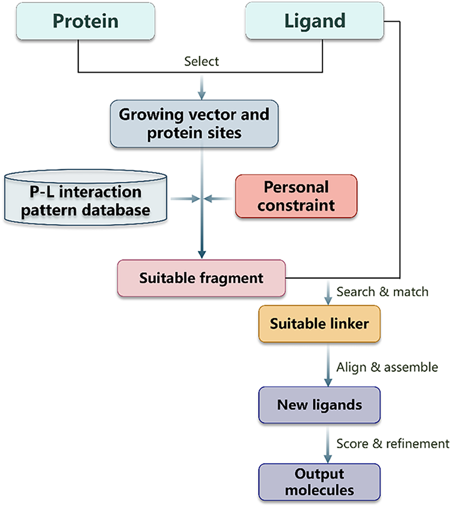

**图3：SiteMatcher 五步工作流** 从上传与模式选择开始，直至生成并打分配体，整合在网页界面中。

#### 方法实现细节

- **数据库与工作流完全基于Python实现**，AA-Score-Tool负责相互作用判定，RDKit用于片段化、坐标提取、合并种子与片段并绘制2D结构。
- **Smina 负责口袋内的快速几何优化与打分**，确保每个候选分子都能在原位评估。
- **MySQL+Node.js+React+NGL构成数据→服务→可视化的一体化架构**，保证检索与展示同时响应。
- **Grow 与 Replace 双模式覆盖延伸与替换两大工作流**，是药化最常用的两种操作。

#### 用户交互与约束系统

- **四个互联界面串起完整交互**：上传文件、挑选Grow/Replace位点、圈定蛋白原子、设定片段约束，每一步都有即时2D/3D提示。
- **约束面板覆盖七大类参数**：理化性质、官能团、杂原子、环信息、连接子、必配位点以及生成数量等，可叠加分子量<250、必须含咪唑、必须连接Met109 NH+CO这类复合条件。
- **Grow模式列出所有可延伸向量，Replace模式高亮可替换片段**，用户在2D骨架上点击即可避免误删关键药效团。
- **结果页一次性给出结构+Smina得分+片段来源**，还可在线检查3D复合物并下载SDF，便于Docking或MD继续验证。

#### 模式数据统计

- **氢键受体（A）与供体（D）合计约65%**，芳香（Aro）约18%，其余来自正电（P）与负电（N）位点，说明氢键仍是PDB复合物中的支配作用模式。
- **双相互作用中AD、DAro、AroP等氢键叠加芳香/电荷的组合最常见**，适合Hinge、芳香盒或π-阳离子口袋设计；PP、NN虽少却能覆盖金属配位/盐桥网络。
- **约70%的片段含≤12个重原子**，意味着数据库主要提供片段级模版而非完整药物，可与Grow/Replace流程天然适配。
- **数据库定期去冗余只保留代表性模板**，既防止重复片段轰炸结果，也确保搜索速度稳定。

### 连接子库与几何匹配

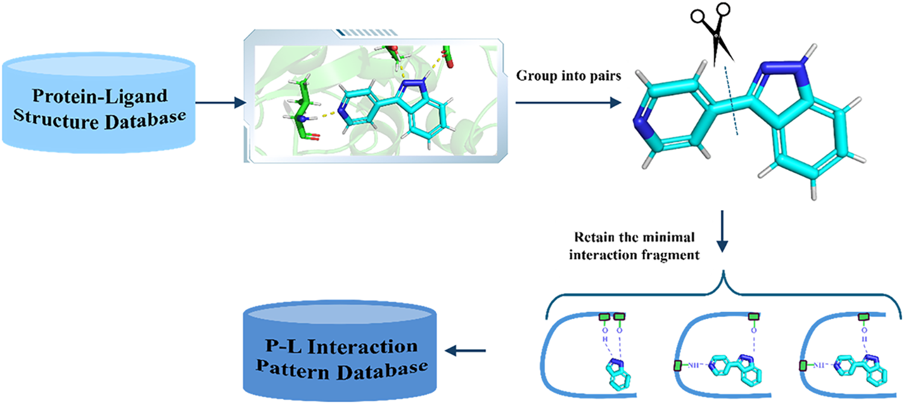

**图1：蛋白-配体相互作用模式数据库的构建流程** 包括类型识别、单/双相互作用枚举、片段裁剪以及记录三维坐标与原子属性。

- **CAVEAT 四参数让出口向量匹配变成数值过滤**，兼顾几何与化学属性，筛出的连接子能直接满足氢键或极性需求。
- **当片段与种子自然对齐时优先不加连接子**，只有几何偏差超阈才调用连接子库，避免产生难以合成的冗长结构。
- **Grow 模式的生长向量本质上就是出口向量**：对每一对**基原子**（连接键两端的原子）$\text{b}_1$、$\text{b}_2$及其**指向原子**（与基原子相邻、用于定义方向的原子）$\text{t}_1$、$\text{t}_2$，SiteMatcher记录$\lvert \text{b}_1-\text{b}_2 \rvert$（基原子间距离）、$\angle \text{t}_1\text{b}_1\text{b}_2$、$\angle \text{t}_2\text{b}_2\text{b}_1$（两个键角）和$\angle \text{t}_1\text{b}_1\text{b}_2\text{t}_2$（二面角）这四个CAVEAT几何量，从而把沿哪个键生长转化为严格的向量定义。
- **用户在界面里看到的所有可延伸方向，都是按上述四参量遍历得到的有效出口向量集合**；选择其一后，后续的片段摆放、链接子筛选与对齐都会强制遵守同一组几何约束，确保Grow过程与实际化学键方向完全一致。

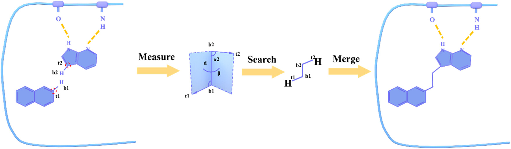

**图2：连接子出口向量的CAVEAT表示** 通过两个出口向量之间的距离、两个键角与一个二面角来描述，可快速检索空间兼容的连接子。

#### 连接子种类与拓扑

连接子覆盖纯碳链、含$\ce{O/N/S}$极性链、芳香桥及酰胺/脲/脲烷等多种拓扑类型，长度分布集中在2-3个键，也包含最长4个键的环状桥（例如哌嗪），**足以覆盖Is-QC这类远距离对接**。

#### Web界面操作

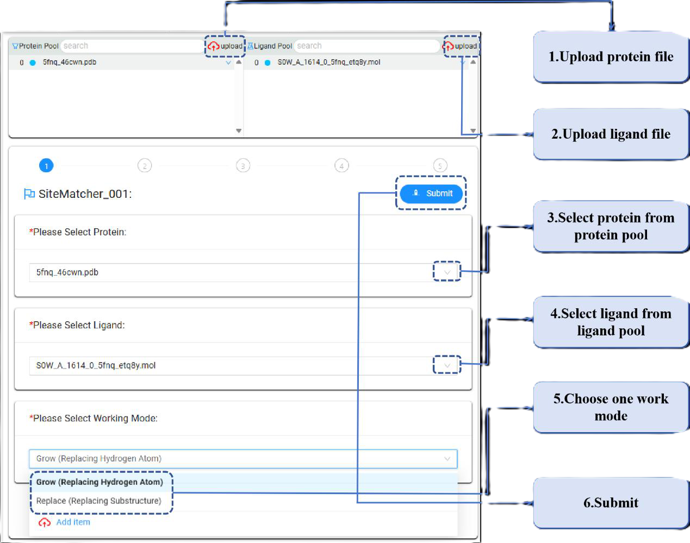

**图S1：输入页面可上传蛋白/配体、挑选设计模式并提交任务**

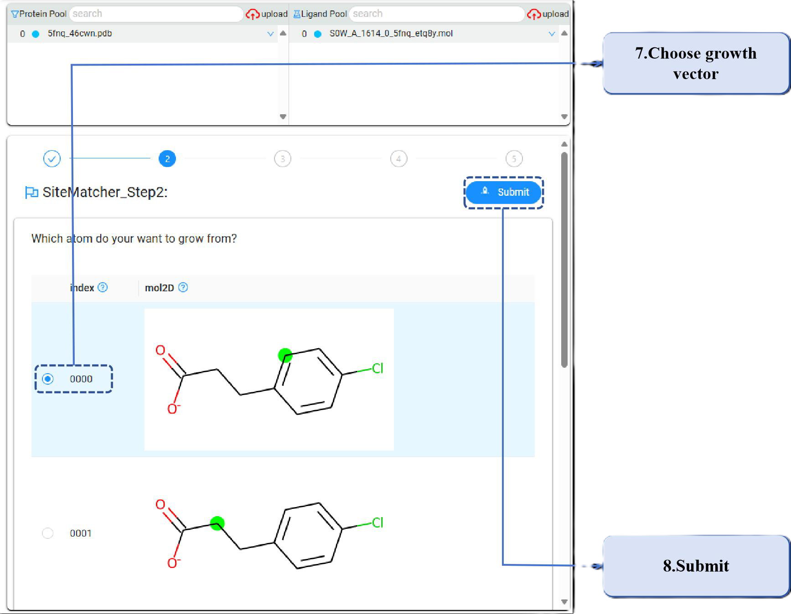

**图S2：第二页高亮可替换氢或子结构，便于定位种子上的操作位点**

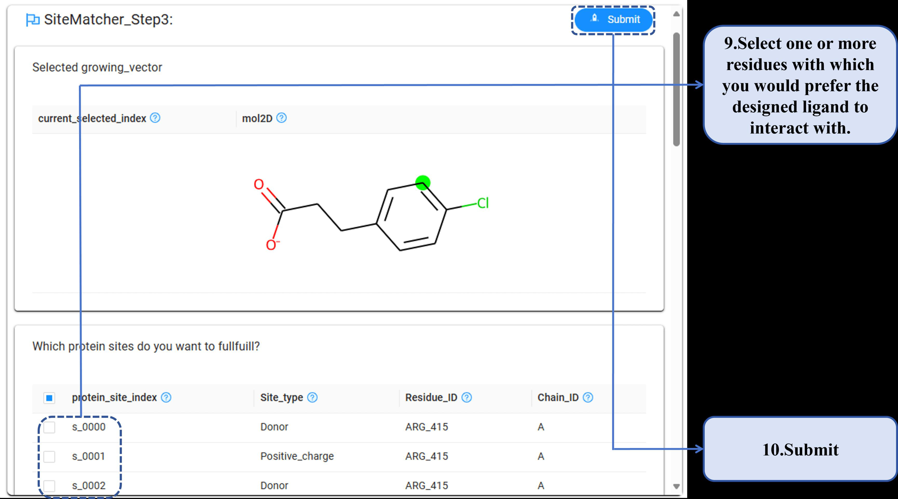

**图S3：第三页展示待互作的残基并允许逐一选择**

- **Figure S1-S7 给出上传→选向量→圈定口袋→设约束的全流程截图**，让新手按图索骥即可复现作者的参数组合。
- **结果页提供3Dview、download与任务摘要**（包含生成参数、运行时间、服务器打分），方便直接纳入项目记录。
- 系统支持“片段收藏夹”，用户可以把满意的模板保存下来，在其他靶点任务中直接复用，**逐步积累个人化知识库**。

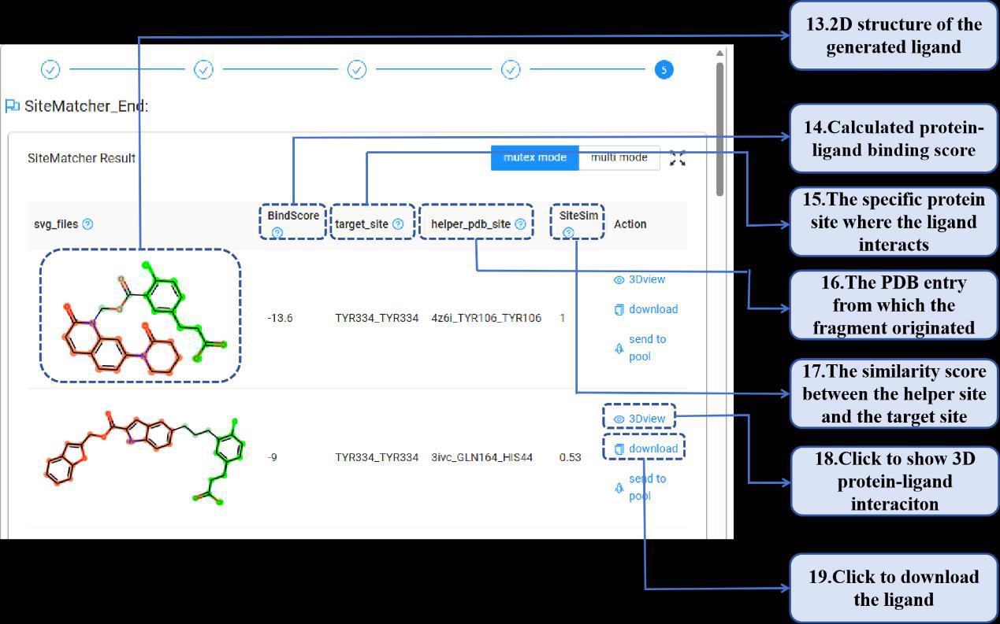

**图S6：结果页展示新配体、Smina分数、片段来源与下载按钮，便于后续验证**

#### 约束实践技巧

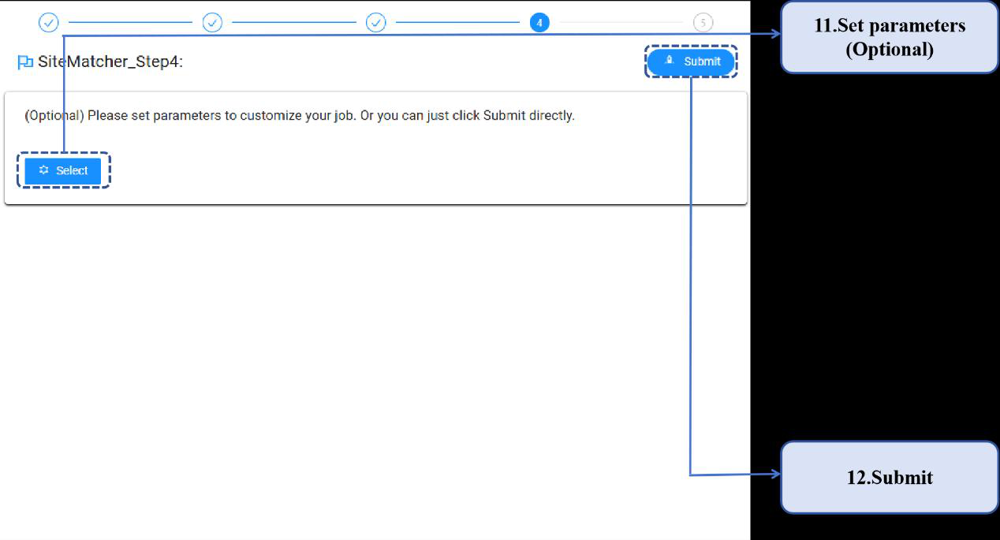

**图S4：复杂约束面板可同时设定理化、拓扑、官能团与必配位点**

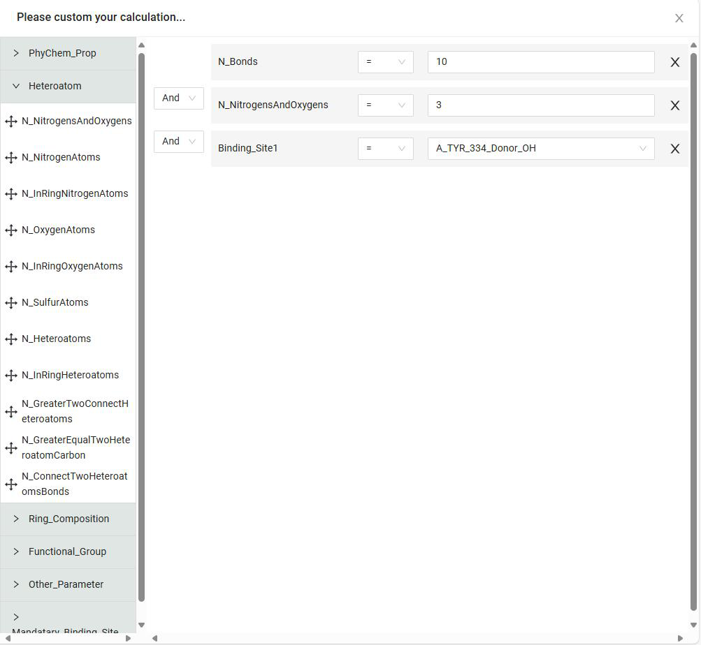

**图S5：参数设置页可保存模板并批量复用生成数量、过滤策略**

- **多维度官能团约束**：要求含咪唑环+芳香环+氢键供体时，可在官能团面板添加desired=咪唑和芳香环≥1，再在理化面板设定氢键供体数≥1；系统会自动筛掉不满足条件的片段。
- **Grow模式下可用必配位点锁定两个蛋白原子并单独设容忍度**，柔性口袋可把距离容忍度放宽到1-1.5Å以防过度收敛。
- **连接子长度上下限可独立设定**，例如只允许2-3键并启用芳香连接子偏好π-π扩展。
- **生成数量初值建议锁在100-200**，先观察趋势再扩大到500+以覆盖更大化学空间。
- **探索-收敛节奏**：若想快速探索化学空间，可先放宽理化参数（如MW<400、TPSA<120），确认口袋可容纳后再逐步收紧，避免生成数量过少。
- **必配位点建议控制在3-4个以内**，数量过多往往几何条件互相冲突；失败时可提高允许距离偏差重新匹配。
- **Replace模式想锁定核心骨架时启用固定此部分结构**并设置最大替换原子数，防止算法替换掉关键片段。
- **金属配位靶点需在官能团约束里强制包含咪唑/羧酸等配位基团**，再通过必配位点把金属附近原子指定出来，才能保留正确几何。

#### Benchmark 数据集

- **Benchmark来源广泛**：157个靶点来自BindingDB，涵盖GPCR、激酶、核受体、水解酶、离子通道、氧化还原酶六大类，配体共429,231条活性记录。
- **每个靶点都绑定至少一条PDB结构**，确保片段匹配与真实口袋对齐。
- **生成速度与靶点复杂度强相关**：激酶、核受体最顺畅；GPCR、离子通道因构象多变需要结合MD或柔性Docking。

#### 运行性能

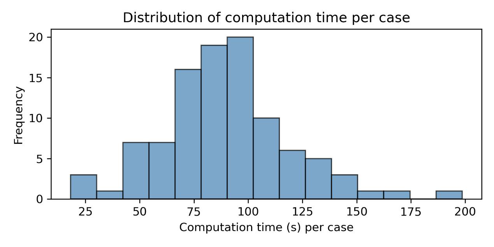

**图S8：100个任务的运行时间分布** 平均耗时约90秒（中位89.6秒），瓶颈在Smina与多姿态摆放；关闭Smina可把总耗时压到40秒左右。

- **后端默认支持8个并行任务**，数据库与工作流基于Python/MySQL，可轻松迁移到企业内网或云端。
- **输入结构超过5000原子时需提前裁剪口袋区域**，否则匹配时间与内存消耗都会飙升。

#### 数据可追溯

- **每条片段记录都写明PDB版本、链号、残基、原子与拆分位置**，输出分子附带片段ID+连接子ID组合便于追溯。
- **任务摘要与哈希值可让团队一键复现参数**，输入任务ID即可重新加载设置。
- **模式库半年更新一次并保留旧版本镜像**，方便在项目中保持版本一致性。

### 工作流程图示

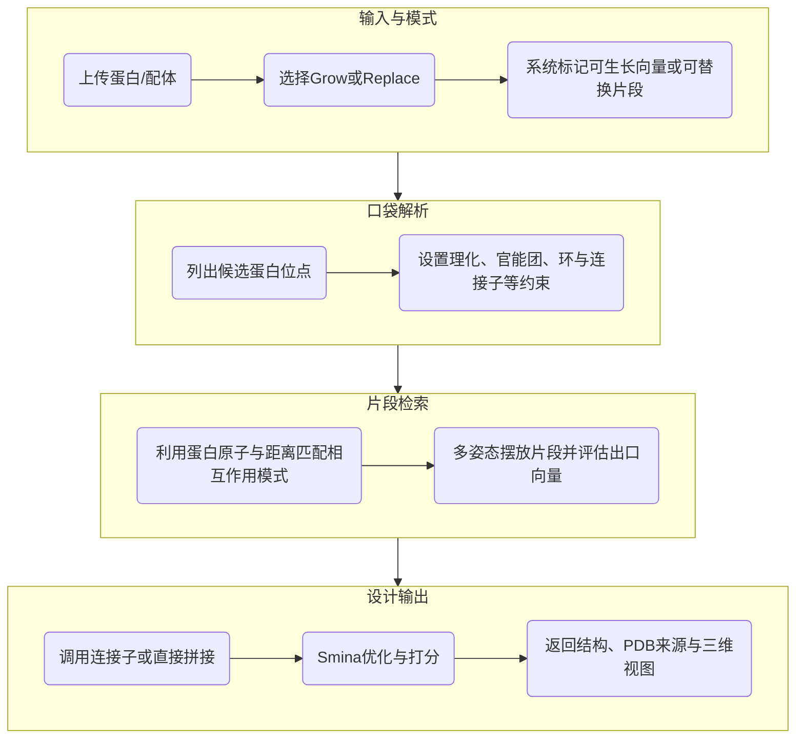

### 性能评估

**表1：SiteMatcher 在六大蛋白家族上的已知活性体回收情况**

| 蛋白家族 | 靶点数 | target success rate(%) | 找回活性配体数 | 生成分子数 | 数据集中已知活性数 |
| --- | --- | --- | --- | --- | --- |
| 核受体 | 14 | 50.0 | 17 | 5726 | 47246 |
| 激酶 | 44 | 72.7 | 88 | 29411 | 172239 |
| 水解酶 | 35 | 51.4 | 44 | 21128 | 82452 |
| GPCR | 30 | 16.6 | 7 | 18447 | 67568 |
| 离子通道 | 12 | 8.3 | 1 | 8383 | 24685 |
| 氧化还原酶 | 22 | 50.0 | 19 | 11588 | 35041 |
| 总计 | 157 | 47.1 | 176 | 94683 | 429231 |

- **如何量化活性体回收**：作者把BindingDB中的429,231条实验活性记录按靶点与共晶结构一一对应，**保证每个靶点至少有一个可上传给SiteMatcher的PDB复合物**，再在统一参数下生成94,683个候选分子。随后用规范化SMILES把这些候选与BindingDB活性体逐一比对，只要某个靶点的生成列表中出现至少一个已知活性分子，就判定该靶点命中。由此得出的**target success rate = 命中靶点数 ÷ 157**，反映的是SiteMatcher能否直接找回数据库里真实存在的活性化合物，而不是所谓先挖掉一块再训练的交叉验证流程。
- **评价指标为target success rate**：每个靶点只要找回至少一个BindingDB证实的活性配体即记成功。
- **激酶最易命中**（72.7%），GPCR与离子通道因可用口袋少且柔性大显著偏低。
- **整体target success rate接近五成**（47.1%），共找回176个已知活性配体。
- 生成的配体中，约12%满足所有自定义约束，提示合理设置筛选条件可以显著降低后续人工筛查的负担。
- 对未命中的靶点，主要问题在于结构前处理：若口袋内残留水分子/脂质或未补氢，Grow/Replace的几何匹配会失败，用户可先在外部工具中清理结构再上传。

#### 案例一：p38α激酶 Hinge 替换

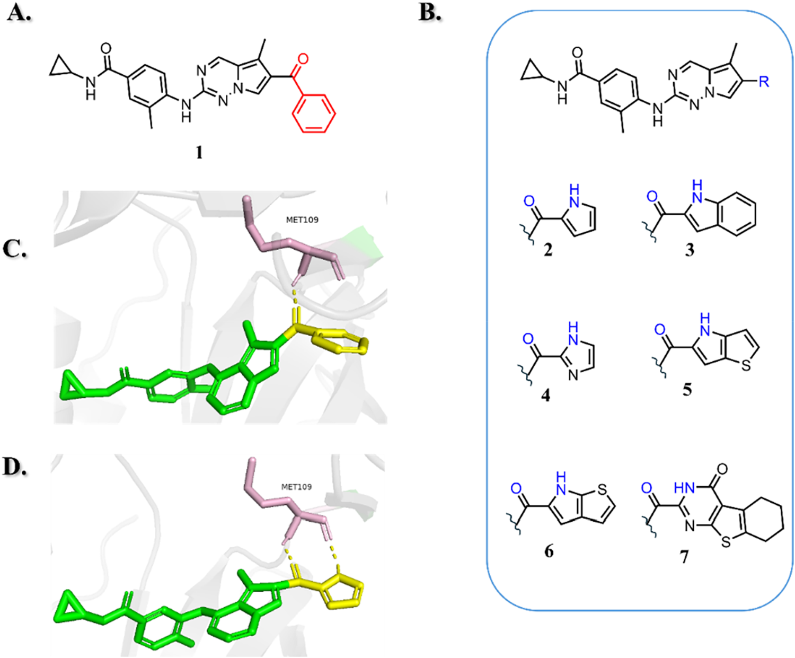

**图4：p38α 案例中，SiteMatcher 找到可替换苯甲酰的片段并重现实验活性**

- 以p38α-Compound 1共晶结构(PDB 3S4Q)为输入，采用Replace模式聚焦于与Met109主链形成双氢键的苯甲酰片段。
- **服务器识别出22个满足与Met109 NH、CO双氢键约束的片段**，自动提供与种子矢量兼容的连接子。
- 生成的Compound 2与文献中已证实具有强抑制活性的结构完全一致，**验证模式加连接子组合可直接回收真实Lead**。
- 所有候选都附带原PDB来源，使研究者可以快速核对片段化学合理性，并据此规划合成路线或二次优化。

#### 案例二：Is-QC 连接子驱动的双点配位

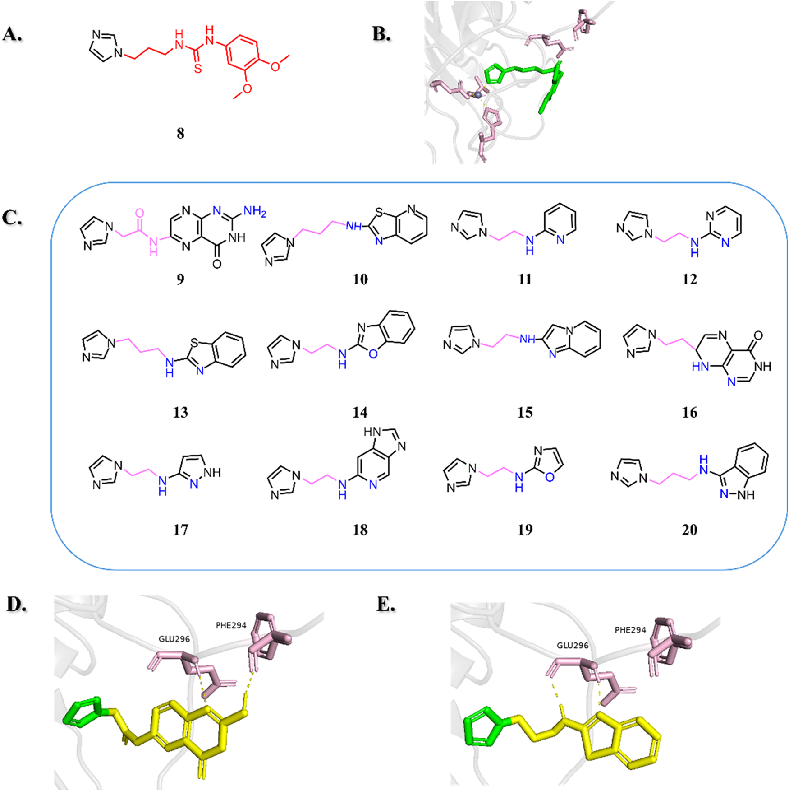

**图5：SiteMatcher 在Is-QC案例中通过连接子满足多点氢键约束**

- 输入Is-QC抑制剂PBD (PDB 4MHY)，保留与Zn配位的咪唑，选择GLU296主链CO/NH、PHE294主链CO为目标位点，并限定片段需含1-2个环。
- 因种子出口向量远离目标位点，**SiteMatcher 自动挑选长度2-3个键的连接子将片段与种子相连**，一次输出101个满足多点约束的方案。
- 12个代表性新配体显示多样的氢键与π-π堆叠模式，展示连接子库对复杂空间需求的适应性。
- 与人工策略相比，自动化流程可以穷举所有满足含环+氢键要求的模板，并用颜色高亮氢键供受体位置，帮助药化团队快速达成共识。

#### 案例三：KEAP1 Fragment Grow 策略

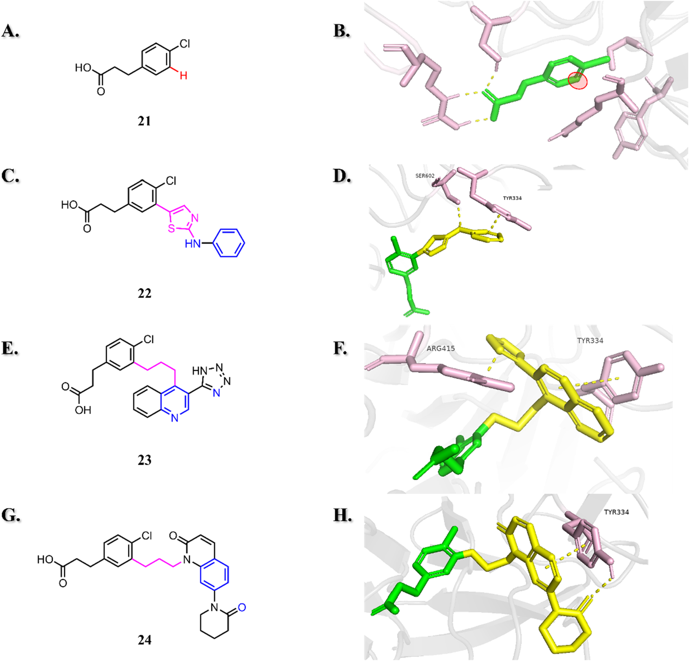

**图6：针对KEAP1片段S0W的Grow模式可探索多种π-π/氢键组合**

- 以S0W (PDB 5FNQ)为种子，Grow模式识别5个可延伸向量，并选定靠近Tyr334、Ser602、Arg415的向量。
- 用户指定新配体需与Tyr334芳环形成π-π堆叠，并可与Ser602 OG或Arg415 NE形成氢键。
- 服务器生成74个配体，代表性的22、23、24展示三种互补的相互作用组合，其中24直接复用了PDB 4Z6I中π-π+氢键双重与Tyr侧链作用的模板，**凸显模板复用带来的多样性**。

#### 案例延伸：其他靶点

- 虽然正文重点展示了激酶、酶与PPIs，作者在SI中还给出了**GPCR与核受体**的示例。由于GPCR口袋柔性大，使用者需要在Grow模式下增加长连接子、芳香堆叠这类约束，并结合多构象结构以提高成功率。
- 对**离子通道**等金属依赖靶点，上传结构时应保留关键金属离子并在必配位点中指明其配位原子，让算法可以识别金属-配体-蛋白三者的几何关系。
- 核受体案例显示SiteMatcher不仅能提供富极性的片段，也能快速搜寻疏水/芳香片段，适合用来替换长链尾部或增加π-π堆叠，从而调节选择性。

### Q&A

- **Q1**: 为什么要同时保留单相互作用和双相互作用记录？
  - **A1**: **单相互作用定位单个氢键/离子互补点**，而**双相互作用保证片段携带协同氢键或芳香+电荷组合**，让移植后的片段仍保持正确配向。
- **Q2**: 连接子数据库的CAVEAT描述符如何加速筛选？
  - **A2**: **预先计算四个CAVEAT几何参数**，查询时把种子与片段出口向量转成同一参数空间后做数值过滤，就能**跳过大量三维试拼**。
- **Q3**: 为什么GPCR与离子通道的成功率偏低？
  - **A3**: **GPCR与离子通道可用晶体结构少且口袋高度柔性**，匹配模式有限、配准偏差大，必须引入**更严格约束或更长连接子**才能提升命中率。
- **Q4**: 生成的分子是否立即可合成？
  - **A4**: **SiteMatcher 只负责结构互补与几何合理性**，未集成合成可行性过滤，仍需搭配**反应规划或合成可行性打分**来筛掉不可合成分子。
- **Q5**: 可以批量运行或脚本调用吗？
  - **A5**: **当前版本仅提供交互式网页**，但因底层完全开源，可下载Zenodo数据与脚本在内网**自建批量处理管线**。
- **Q6**: 如何在结果中筛选最值得跟进的候选？
  - **A6**: **用Smina打分+片段来源+自定义理化指标三维排序**，并利用服务器导出的CSV快速筛出最值得跟进的候选。

### 关键结论与批判性总结

- **潜在影响**
  - **SiteMatcher 把寻找相互作用模板→拼接→优化串成短流程**，为药化团队提供真实可用的碎片设计平台。
  - **数据库与连接子预处理让Grow/Replace实现网页级实时反馈**，项目会上即可验证结构假设。
- **局限与展望**
  - **模式库目前以氢键/π堆/盐桥为主**，疏水体积匹配、金属配位等高级相互作用仍待扩展。
  - **柔性口袋与长距离生长仍是短板**，需要结合MD或AI生成方法补足构象多样性。
  - **作者计划扩容相互作用类别、加入可合成性过滤并开放API**，以便批量脚本化使用。

### 讨论：成本、可扩展性与实验互证

- **GPCR与离子通道可结合MD或AlphaFold生成开放态结构**，再导入SiteMatcher寻找更契合的模板。
- **两步Grow/Replace可先做局部片段再迭代扩展**，逐轮把满足部分约束的片段当作新种子。
- **命中率低的靶点可导出失败案例做柔性Docking或MD**，再把新的口袋构象回灌，形成**SiteMatcher→柔性更新→SiteMatcher的闭环**。

#### 与下游流程的衔接

- **生成的SDF可以无缝导入MD、FEP或ADMET工具链**，PDB来源信息也让实验组能迅速查验参考结构。
- **若考虑可合成性，可把输出对接ASKCOS、Synthia等反应规划/合成可行性工具**，形成设计与可合成性联合筛选。
- **对离子通道等金属依赖靶点，上传前需保留关键水分子/金属并列入必配位点**，确保几何约束不会丢失。

#### 拓展应用

- **片段级筛选**：在FBDD流程中，可先用SiteMatcher快速识别能够补足现有片段的互作模板，再将最佳候选送去生物物理实验验证。
- **交叉靶点再利用**：相似口袋往往属于同一家族，SiteMatcher能够一眼看出片段最初来源的PDB靶点，便于挖掘交叉适用的化学骨架。
- **AI生成模型的过滤器**：可将生成式模型候选与SiteMatcher输出对比，只保留能在真实口袋中形成已知互作模式的分子，减少虚假阳性。
- **教育与培训**: 对于初入行的药化/计算学生，服务器提供的可视化界面是学习相互作用模式、理解Grow/Replace逻辑的直观教材。

站在更宏观的角度，SiteMatcher展示了如何把结构数据库、化学知识与现代Web开发结合成面向药化团队的实时工具。它既不是黑箱模型，也不是单一数据仓库，而更像一个可解释的碎片设计助手：每一步都能追溯到原始结构，每个结果都可立即在3D中核实。对想要压缩结构设计反馈周期的团队而言，这类工具将成为日常项目会上的标配。

> 小编锐评：感觉给药物化学家用比较合适，比较方便，根据经验建库做替换的操作。确实，未来连上ADMET之类的性质计算就更好了。

---

### 附录

#### 常见注意事项

- **上传结构前务必删除非必要配体、补氢并检查质子化状态**，否则Grow/Replace在几何匹配时会因为异常原子类型而失败。
- **若任务久未返回，可在设置里降低生成数量或暂时关闭Smina优化**，以排查是否是片段摆放阶段耗时过长。
- **输出分子若含稀有元素或非标准价态，需要在外部工具重新设定力场参数**后再进行Docking或MD。
- **需遵守知识产权策略的项目应优先使用来源明确的公共片段**，并在团队内建立审核流程。
- **共享任务时务必记录任务ID与参数导出文件**，确保不同成员可以复现相同设置。
- **命名输出分子时建议按靶点-日期-片段来源的方式统一**，避免后续实验记录混淆。

#### 实操建议与数据复用

- 浏览SiteMatcher官方教程（Figure S1-S7所示）以熟悉界面；建议先在Replace模式试运行单个约束，理解片段筛选逻辑后再叠加复杂条件。
- 服务器允许导出所有候选的CSV与SDF文件，包含片段/连接子来源、Smina打分、满足的约束条目等元数据，可直接导入ELN或数据库。
- Benchmark数据集托管在Zenodo，团队可离线复现作者的评估流程或训练自有模型。
- 若需私有部署，可与作者联系获取数据库读写脚本，在内网重建模式与连接子索引；需遵循PDB与BindingDB的版权条款。

#### 可调参数总览

- **理化性质**（Table S1）: 分子量、TPSA、FractionCSP3、重原子计数、氢键受体/供体数、可旋转键数、形式电荷绝对值、总键数。
- **官能团**（Table S2）: 采用SMARTS描述的必须/禁止官能团；特定氮、碳基团（芳香氮、三级胺、酰胺、硫酮、烷基卤化物等）的数量约束。
- **杂原子信息**（Table S3）: 如$\ce{N/O/S}$/卤素计数、是否包含金属配位原子等。
- **环组成**（Table S4）: 限制芳香环数量、环尺寸、是否含桥头位、是否允许稠环等。
- **连接子**（Table S5&S8）: 覆盖烷基链、芳香桥、胺/酰胺、脲、杂环、醚等，并提供可多选的长度范围。
- **必配位点**（Table S6）: 允许用户指定必需满足的蛋白原子组合，如Met109 NH+CO、Tyr334 phenyl等。
- **其他参数**（Table S7）: 包括生成配体数量上限、片段最小/最大原子数、是否强制保留原子电荷、是否执行重复过滤等。

#### 连接子示例（节选自Table S8，按长度排序）

| 连接子 | 拓扑长度 | 典型化学式 | 备注 |
| --- | --- | --- | --- |
| $\ce{CH2-CH2}$ | 2 | $\ce{-CH2-CH2-}$ | 最短柔性碳链，用于近距离拼接 |
| $\ce{O-CH2-O}$ | 2 | $\ce{-O-CH2-O-}$ | 适配需要极性桥的场景 |
| $\ce{CONH}$ | 2 | $\ce{-CO-NH-}$ | 提供氢键供体/受体双重角色 |
| $\ce{Ar-CH2-Ar}$ | 3 | $\ce{Ar-CH2-Ar}$ | 支持π-π堆叠拓展 |
| $\ce{N(CH3)-CH2-CO}$ | 3 | $\ce{N(CH3)-CH2-CO}$ | 兼具正电与极性 |
| $\ce{(CH2-CH2-NH)2}$ | 4 | $\ce{(CH2-CH2-NH)2}$ | 提供两个对置出口，常用于跨距链接 |
| Urea | 3 | $\ce{-NH-CO-NH-}$ | 适合双氢键桥接 |

#### 基准数据集 (Table S9)

- 每个条目包含PDB ID、配体ID、活性值（Ki/Kd/IC50）、参考文献。
- 数据在六大蛋白家族的详细分布见表1。

#### 使用建议

- 对柔性靶点，可在Grow模式中勾选更多蛋白位点并选择较长连接子，以弥补口袋塌陷导致的几何偏差。
- 如需保持关键配体片段，可用Replace模式、必配位点组合与“固定子结构”选项共同控制。
