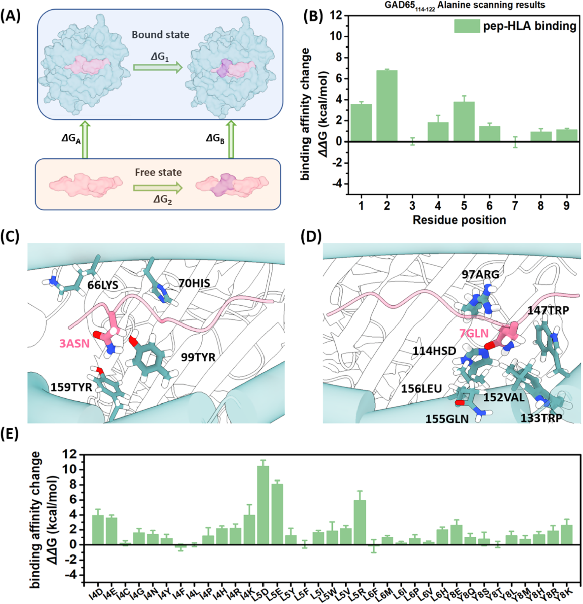
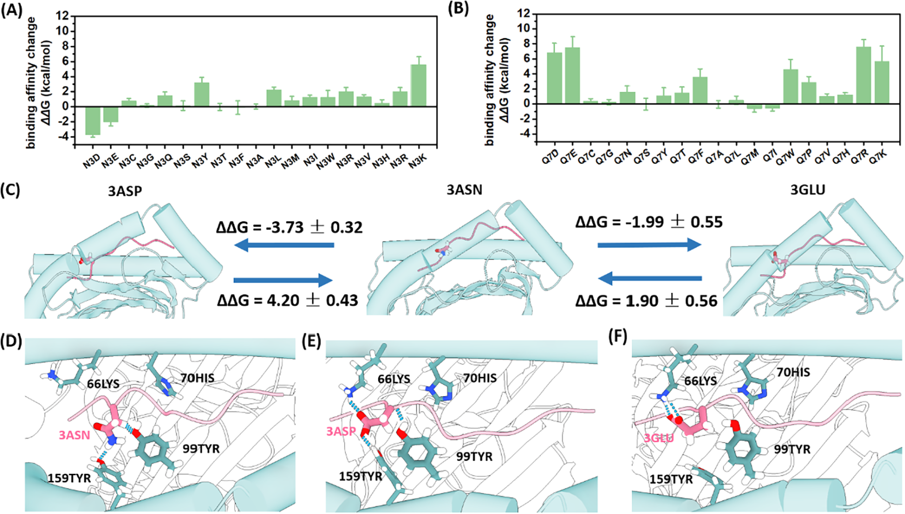
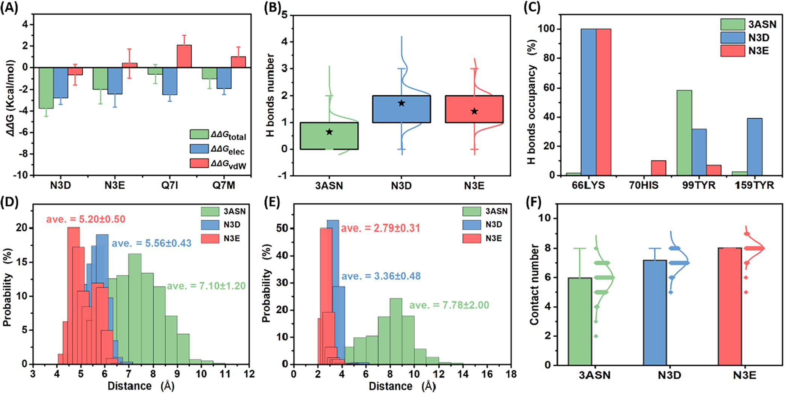
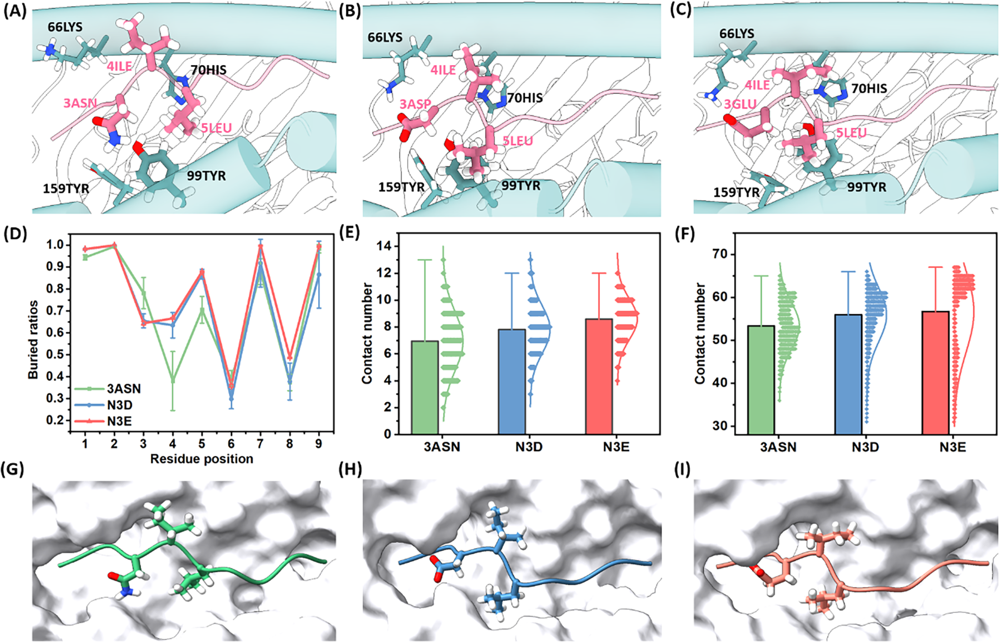
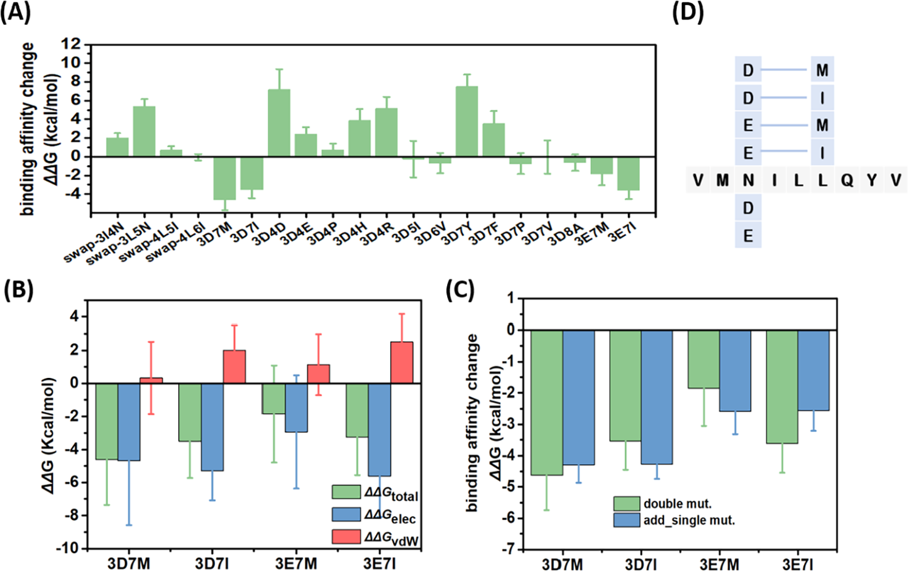

# 计算优化GAD65自身抗原肽段：为1型糖尿病免疫疗法设计疫苗候选物

## 本文信息

- **标题**：In Silico Optimization of GAD65114-122 Autoantigen for Potential Type 1 Diabetes Antigen-Specific Immunotherapy
- **作者**：Lei Fu, Kevin Chun Chan, Qinglu Zhong, Damiano Buratto, Song Wu, Ruhong Zhou
- **发表时间**：2025年7月14日投稿，2025年12月9日在线发表
- **单位**：浙江大学定量生物学中心（中国杭州）；深圳大学附属第三医院泌尿研究所（中国深圳）；浙江大学上海高等研究院（中国上海）；哥伦比亚大学化学系（美国纽约）
- **引用格式**：Fu, L., Chan, K. C., Zhong, Q., Buratto, D., Wu, S., & Zhou, R. (2025). In Silico Optimization of GAD65114-122 Autoantigen for Potential Type 1 Diabetes Antigen-Specific Immunotherapy. *J. Phys. Chem. B*, *129*, 12799−12810. https://doi.org/10.1021/acs.jpcb.5c04875

## 摘要

> 1型糖尿病是由针对胰岛β细胞抗原的自身反应性T细胞介导的自身免疫疾病，其中识别胰岛自身抗原的CD8+ T细胞发挥核心作用。在HLA-A\*02:01个体中，CD8+ T细胞对谷氨酸脱羧酶65（GAD65）的反应性集中在残基114−122区域（VMNILLQYV）。本研究设计了增强了人类白细胞抗原（HLA）结合能力的GAD65114-122模拟表位，作为潜在的1型糖尿病疫苗候选物。通过全原子分子动力学模拟和自由能微扰计算，评估了HLA-A\*02:01−GAD65114-122结合的单突变、双突变和交换突变效应。研究结果确定**位置3和位置7是增强亲和力的关键位点**。位置3倾向于负电荷残基天冬氨酸（N3D）和谷氨酸（N3E）而非天然的天冬酰胺，表明有利的静电相互作用；位置7则偏好中等大小的疏水残基蛋氨酸（Q7M）和异亮氨酸（Q7I）而非天然的谷氨酰胺，增强了结合稳定性。**位置3和7的双突变表现出整体加和甚至协同效应**，N3D_Q7M、N3D_Q7I、N3E_Q7M和N3E_Q7I双突变体被鉴定为强候选物，可用于进一步的T细胞激活实验验证。本工作为优化1型糖尿病抗原基础疫苗的设计提供了重要启示。

### 核心结论

- 通过丙氨酸扫描和全氨基酸突变筛选，确定**GAD65114-122肽段的位置3和位置7是优化HLA结合的关键靶点**
- 位置3突变为带负电荷的天冬氨酸（N3D，ΔΔG = −3.73 ± 0.32 kcal/mol）或谷氨酸（N3E，ΔΔG = −1.99 ± 0.55 kcal/mol）可显著增强HLA-A\*02:01结合
- 位置7突变为疏水性的异亮氨酸（Q7I，ΔΔG = −0.57 ± 0.35 kcal/mol）或蛋氨酸（Q7M，ΔΔG = −0.60 ± 0.48 kcal/mol）适度提升结合亲和力
- **双突变N3D_Q7M展现协同效应**（ΔΔG = −4.62 ± 1.12 kcal/mol），超过两个单突变的简单加和
- 鉴定出六个优化的自身抗原肽段（M1−M6）作为1型糖尿病免疫疗法的潜在疫苗候选物

## 背景

1型糖尿病（Type 1 Diabetes，T1D）是一种自身免疫性疾病，其特征是机体免疫系统攻击胰腺β细胞，导致胰岛素分泌功能丧失和血糖调节紊乱。尽管胰岛素替代疗法在过去一个世纪里将T1D从致命疾病转变为慢性病，但它并不能治愈疾病，且可能导致多种并发症。T1D的遗传易感性与人类白细胞抗原（HLA）基因密切相关，这进一步证明其自身免疫疾病的本质。

传统的免疫抑制疗法虽然能减轻自身免疫攻击，但其毒副作用限制了临床应用。近年来，**抗原特异性免疫疗法**作为一种更具选择性的治疗策略受到广泛关注。这种方法旨在通过特异性靶向自身反应性免疫细胞来诱导免疫耐受，从而抑制免疫系统对自身组织的攻击。然而，尽管已识别出多个触发β细胞破坏的T细胞自身抗原表位，这些自身反应性抗原的具体身份仍不完全清楚。

谷氨酸脱羧酶65（GAD65）是T1D中一个重要的自身抗原。HLA-A\*02:01限制性的十肽GAD65114-123（VMNILLQYVV）早已被证实能激活CD8+T细胞，后续研究进一步指出，其内部嵌套的九肽GAD65114-122（VMNILLQYV）在预测工具和结合实验中均表现出更强的HLA-A\*02:01亲和力。**深入分析GAD65114-122与HLA-A\*02:01的相互作用机制，有助于说明T1D的自身免疫识别过程并为抗原疫苗设计提供依据**。

### 创新点

- **首次对GAD65114-122自身抗原肽段进行系统的计算突变筛选**，结合分子动力学模拟和自由能微扰计算，精确评估每个残基对HLA结合的贡献
- **发现位置3带负电荷突变的静电增强机制**：通过与HLA-α链Lys66的新形成氢键和静电相互作用显著提升结合
- **发现位置7疏水性突变通过vdW和静电双重作用机制增强结合**，填补了原本不匹配的疏水口袋
- **首次发现GAD65自身抗原双突变的协同效应**，为多位点优化策略提供了实验依据
- 提出六个优化的抗原肽段序列（包括两个单突变和四个双突变）作为T1D免疫疗法的候选物，为后续实验验证奠定基础

## 研究内容

### 研究设计与工作流程

本研究采用计算生物物理学方法系统优化GAD65114-122自身抗原肽段，整体工作流程如图1所示。研究从T1D的免疫学背景出发，针对T细胞攻击β细胞导致胰岛素释放受损的病理过程，聚焦于HLA-抗原-TCR三元复合物中的HLA-抗原相互作用优化。

**图1：GAD65114-122自身抗原计算优化的综合表征流程**

- 左上方示意图展示T细胞攻击β细胞，影响胰岛素释放的过程
- HLA以红色插头表示，TCR以蓝色插头表示，自身抗原以红色圆圈表示，设计的新抗原以绿色圆圈表示
- 研究目标是优化新抗原设计
- 计算优化步骤包括：
  - **结构建模**（Modeling）：基于PDB 5FA3构建HLA-A\*02:01−GAD65114-122复合物初始结构
  - **分子动力学模拟**（Molecular Dynamic Simulation）：进行3×500 ns的MD模拟验证结构稳定性
  - **自由能微扰计算**（Free Energy Perturbation）：系统评估突变对结合自由能的影响，包括结合态和自由态的自由能变化
  - 候选物筛选（Potential Candidates）：根据ΔΔG值筛选出优化的抗原肽段序列

研究策略遵循“**结构-能量-功能**”的逻辑链条，首先通过MD模拟获得复合物的动态结构信息，识别关键相互作用位点；随后利用FEP计算定量评估突变效应；最终筛选出增强了HLA结合能力的优化抗原候选物。

### 方法详述

#### 分子动力学模拟

研究使用GROMACS软件包和CHARMM36全原子力场进行MD模拟。由于HLA-A\*02:01−GAD65114-122复合物晶体结构不可获得，研究团队从蛋白质数据库（PDB ID: 5FA3）获取相关结构，并使用VMD软件将肽段序列突变为GAD65114-122（VMNILLQYV）。

模拟参数设置如下：

- 水模型：TIP3P
- 离子浓度：0.15 M NaCl，用于中和系统并模拟生理盐浓度
- 能量最小化：20000步
- 平衡阶段：10 ns
- 生产运行：500 ns，时间步长2 fs
- 系综：NPT系综，温度310 K（人体生理温度），压力1 atm
- 温度控制：V-rescale恒温器
- 压力控制：Parrinello-Rahman恒压器
- 长程静电：PME（粒子网格Ewald）方法
- vdW相互作用：力切换函数，范围1.0−1.2 nm
- 氢键约束：LINCS算法

所有可滴定残基按生理pH值（约7.0）的标准质子化状态建模，肽段的N端和C端分别建模为带电形式（−NH3+和−COO−）。每个体系进行三次独立的500 ns模拟以确保结果的可重复性。

#### 自由能微扰计算

FEP方法是评估突变对结合自由能影响的金标准。由于直接计算绝对结合自由能在计算上非常昂贵，研究采用热力学循环计算相对结合自由能变化ΔΔG（图3A）。

FEP计算的基本公式为：

$$
\Delta G_i = -kT \ln \langle \exp(-\beta[V(\lambda + \Delta\lambda) - V(\lambda)]) \rangle_\lambda\\
\Delta G = \sum_i \Delta G_i
$$

其中$V(\lambda) = (1-\lambda)V_1 + \lambda V_2$，$V_1$和$V_2$分别代表野生型和突变体的势能。当λ从0变化到1时，系统从野生型转变为突变型。

FEP计算参数：本研究采用60个λ窗口、每个窗口600 ps采样，单次突变的结合态和自由态各需36 ns轨迹，并至少重复5次独立运行；综合计算量约为360 ns（36 ns × 5 replicas × 2 states），并使用软核势避免端点奇点。
为了深入理解突变效应的物理本质，研究还进行了**自由能分解分析**，将总结合自由能ΔΔG分解为van der Waals（vdW）和静电相互作用两个组分。需要注意的是，由于FEP公式的非线性性质，这种分解可能存在路径依赖性和小的耦合项，但仍能提供有价值的物理洞见。

### HLA-A\*02:01−GAD65114-122复合物的结构特征

研究首先对HLA-A\*02:01−GAD65114-122复合物进行了三次独立的500 ns MD模拟，以表征其结构稳定性和动态行为。

**图2：HLA-A\*02:01−GAD65114-122结构信息**

- A：500 ns分子动力学模拟后的HLA-A\*02:01−GAD65114-122复合物结构。左图为侧视图，右图为俯视图。GAD65114-122肽段以淡紫红色棒状显示，HLA以军校蓝卡通显示。肽段稳定地嵌入HLA结合沟槽中，呈现典型的延伸构象
- B：HLA-A\*02:01−GAD65114-122复合物分子动力学模拟后肽段的均方根偏差（RMSD）结果。三次独立模拟（trial1、trial2、trial3）的RMSD值在平衡后稳定在0.3−0.5 nm范围内，表明结构达到稳定状态。由于初始结构是通过手动突变而非晶体结构获得，这个RMSD范围是可接受的
- C：500 ns分子动力学模拟后HLA结合肽段残基的埋藏比例。**核心表位位置**（2、3、5、7和9）**与HLA保持广泛接触**，埋藏比例较高；而位置4、6和8更多暴露于溶剂或潜在的TCR识别界面，埋藏比例较低

结构分析发现GAD65114-122肽段的关键结合特征：**锚定残基定义了肽段的姿态，次锚定残基决定了免疫识别的精细调控**。

位置2的蛋氨酸（MET）和位置9的缬氨酸（VAL）作为**主要锚定残基**，牢固地将肽段固定在HLA分子上。位置3的天冬酰胺（ASN）、位置5的亮氨酸（LEU）和位置7的谷氨酰胺（GLN）与HLA分子上的相应口袋有显著相互作用，被识别为**次锚定或核心表位残基**。

埋藏表面积分析（图2C）进一步证实，核心表位位置（2、3、5、7和9）与HLA保持广泛接触，而位置4、6和8更多暴露于溶剂或潜在的TCR识别界面。**MD模拟发现，位置3、5和7可能是优化自身抗原的关键位点**。

值得注意的是，研究还检查了基于IEDB数据库和MHC Motif Atlas的HLA-A\*02:01结合9-mer肽段的氨基酸偏好性（图S2），结果显示非锚定位点的氨基酸分布相对均匀。这表明**传统的统计数据可能不足以指导这些区域的优化**，需要更精细的结构和能量分析。

### 丙氨酸扫描分析：识别关键优化位点

为了系统评估GAD65114-122表位中每个氨基酸对HLA结合的贡献，研究进行了全面的丙氨酸扫描突变分析。丙氨酸扫描是一种经典的突变策略，通过将每个残基逐一替换为丙氨酸（一种小的非极性氨基酸），可以评估该残基侧链对结合的具体贡献。

图3B展示了九个残基丙氨酸扫描的FEP结果，主要发现包括：

- **锚定残基的关键作用**：将位置2的蛋氨酸和位置9的缬氨酸突变为丙氨酸导致结合亲和力显著降低，ΔΔG值分别为6.81 ± 0.28 kcal/mol和1.12 ± 0.29 kcal/mol。这证实了它们作为主要锚定残基对维持肽段-HLA结合的重要性。
- **优化靶点的识别**：位置3（N3A）和位置7（Q7A）的丙氨酸突变对结合亲和力的影响可忽略不计，ΔΔG值分别为0.04 ± 0.32 kcal/mol和−0.04 ± 0.49 kcal/mol。**这些接近零的能量变化表明，这些位置的天然残基并非最优**，存在通过突变改善结合的潜力。

- **位置5的限制**：位置5的L5A突变导致显著的结合破坏（ΔΔG = 3.8 ± 0.56 kcal/mol），表明该位置的改变可能不利于肽段-HLA结合，因此不适合作为优化靶点。

**图3：丙氨酸扫描与单点相互作用分解**
- (A) FEP热力学循环设计，结合态与自由态的能量变化构成ΔΔG的来源
- (B) GAD65114-122丙氨酸扫描结果，突出M2A、V9A导致的亲和力崩塌及N3A、Q7A的可塑性
- (C) 3ASN位点与Lys66、His70、Tyr99、Tyr159形成的正电荷口袋相互作用示意
- (D) 7GLN位点与疏水口袋的互动，显示极性侧链与口袋性质不匹配
- (E) 位置4/5/6/8的经验性单突变FEP，佐证其他位点突变多为能量罚分

自由能分解分析为理解这些效应提供了更深入的物理图景。对于N3A和Q7A突变：

- N3A：ΔΔGvdW = −0.78 ± 0.95 kcal/mol， ΔΔGelec = 0.87 ± 0.59 kcal/mol。vdW和静电贡献相互抵消，净效应接近零
- Q7A：ΔΔGvdW = 2.93 ± 0.79 kcal/mol， ΔΔGelec = −2.73 ± 0.86 kcal/mol。vdW贡献不利（失去了侧链体积），但被有利的静电贡献部分补偿

这些结果为后续的优化策略提供了明确的指导：**位置3和位置7是理想的抗原肽段设计候选位点**。

### 单突变优化策略：位置3和位置7的全氨基酸扫描

基于丙氨酸扫描的洞见，研究对位置3和位置7进行了**全氨基酸**扫描，系统评估所有可能的天然氨基酸替换效应。

**图4：肽段位置3和7的FEP结果及突变后的结构信息**

- A：位置3全氨基酸扫描的单突变FEP结果。**N3D和N3E突变显著增强结合**（分别为天冬氨酸和谷氨酸），ΔΔG值分别为−3.73 ± 0.32和−1.99 ± 0.55 kcal/mol。大多数其他突变（如疏水性的N3F、N3M、N3W、N3I、N3Y）导致结合能力下降
- B：位置7全氨基酸扫描的单突变FEP结果。**Q7M和Q7I突变适度增强结合**（分别为蛋氨酸和异亮氨酸），ΔΔG值分别为−0.60 ± 0.48和−0.57 ± 0.35 kcal/mol。其他疏水残基如Q7L、Q7V也显示轻微改善
- C：N3D和N3E的正向和反向突变FEP结果验证。正向突变（N→D，N→E）显示负ΔΔG值（增强结合），反向突变（D→N，E→N）显示正ΔΔG值（削弱结合），两者大小相近但符号相反，证实了计算的一致性
- D：野生型3ASN残基与HLA-A\*02:01的相互作用。天冬酰胺侧链主要与Tyr99形成氢键
- E：N3D突变体与HLA-A\*02:01的相互作用。天冬氨酸的负电荷侧链更深入地嵌入HLA口袋，**与Lys66形成稳定的盐桥和氢键**，同时保持与Tyr99的相互作用
- F：N3E突变体与HLA-A\*02:01的相互作用。谷氨酸的负电荷侧链同样与Lys66形成强相互作用，但由于侧链更长，相互作用模式略有不同

#### 位置3的优化：静电互补性

位置3全氨基酸扫描的结果与结构环境高度一致。位置3的次锚定残基位于由HLA-α残基Lys66、His70、Tyr99和Tyr159形成的**带正电荷的芳香疏水口袋**中。引入负电荷的ASP或GLU可以与带正电荷的Lys66形成有利的静电相互作用和氢键，从而增强结合。

相反，全氨基酸扫描确认，在位置3引入疏水性或其他极性残基（如PHE、MET、TRP、ILE、TYR）会不利地影响结合亲和力，导致焓罚分。这证明**位置3对静电互补性最为有利**。

**图5：位置3（3ASN、N3D和N3E）与HLA-A\*02:01相互作用的详细分析**
- (A) N3D、N3E、Q7I和Q7M的自由能分解。**N3D与N3E的静电项占主导**
- (B) HLA与肽段位置3残基之间的氢键数量分布。突变后平均氢键数显著增加
- (C) HLA残基与肽段位置3残基之间的氢键占有率。野生型ASN主要与Tyr99形成氢键，而ASP可稳定地与Lys66形成氢键，偶尔与Tyr99和Tyr159形成氢键；GLU同样与Lys66形成稳定氢键
- (D) HLA中Lys66与肽段位置3残基之间的距离分布。ASN突变为ASP或GLU后距离缩短
- (E) HLA中Lys66的NZ原子与肽段位置3残基的O原子之间的距离分布。ASN突变为ASP或GLU后距离缩短
- (F) 肽段位置3与HLA-A\*02:01相互作用的接触原子数。突变后接触原子数增加

为了更深入地理解这些突变如何增强HLA结合，研究团队对N3D、N3E、Q7I和Q7M突变体进行了自由能分解分析（图5A）。结果表明，**位置3的N3D和N3E突变的结合增强主要由静电相互作用驱动**。这是因为位置3位于由带正电荷的Lys66形成的口袋中，引入的负电荷ASP或GLU能够与Lys66产生强烈的静电吸引。相比之下，位置7的Q7M和Q7I突变则同时受益于vdW和静电相互作用，尽管静电贡献仍占主导。

**氢键网络的重塑是位置3优化的关键机制**。图5B显示，突变为ASP或GLU后，位置3与HLA之间形成的平均氢键数显著增加。更重要的是，氢键占有率分析（图5C）揭示了氢键伙伴的转变：野生型ASN在位置3主要与Tyr99形成氢键，而突变为ASP后，能够与Lys66稳定形成氢键，并偶尔与Tyr99和Tyr159形成额外氢键。GLU突变同样能与Lys66形成稳定的氢键网络。MD模拟的氢键时间演化分析（图S4）进一步证实了这些氢键在整个模拟过程中的稳定存在。

这种氢键伙伴的转变伴随着**空间距离的显著缩短**。图5D和5E展示了Lys66与位置3残基之间的距离分布变化：ASN突变为ASP或GLU后，Lys66与位置3残基的整体距离以及Lys66的NZ原子与位置3残基的O原子之间的距离都明显缩短，使得两者之间的静电和氢键相互作用更加紧密。同时，位置3与HLA接触的原子数也相应增加（图5F），表明突变不仅优化了特定相互作用，还增加了整体界面的紧密程度。

这些指标共同表明，**带负电荷的ASP或GLU不仅实现局部静电互补，还重塑氢键网络与界面堆积，使位置3成为全局能量优化的杠杆点**。

为了验证这些观察结果，研究进行了反向突变（D3N和E3N）的FEP计算（图4C）。结果显示，反向突变破坏HLA结合的程度与正向突变增强结合的程度相似，进一步证明计算的可靠性（图S3）。

此外，研究对N3D和N3E变体进行了三次独立的500 ns MD模拟验证。野生型GAD65114-122和这些变体模拟后的结构快照（图4D−F）显示，**位置3的突变使肽段更接近HLA-α残基Lys66**，通过额外的静电相互作用增强了结合。

- **图6：位置3突变引发的3-5位构象与接触变化**
  - (A) 野生型3ASN（VMNILLQYV）与HLA-A\*02:01的结合构象，HLA为蓝色卡通、肽段为粉色卡通并突出3-5位残基
  - (B) N3D突变体（VMDILLQYV）在HLA-A\*02:01中的3-5位局部构象
  - (C) N3E突变体（VMEILLQYV）在HLA-A\*02:01中的3-5位局部构象
  - (D) 残基及整段肽的埋藏比例，突变后位置3、4、5以及整体肽段更深嵌入HLA结合沟槽
  - (E) 位置4、5与HLA接触原子数，N3D/N3E相较野生型显著增加
  - (F) 整段肽与HLA的接触原子数统计，突变体比野生型多出约2-3个接触原子
  - (G) 野生型3ASN的表面表示，肽段3-5位以球棍显示
  - (H) N3D的表面表示，展示突变后位置4、5更深嵌入结合口袋
  - (I) N3E的表面表示，同样显示位置4、5的埋藏度提升

前面的分析主要聚焦于突变位点本身的局部结构变化。然而，研究发现**位置3的突变不仅影响该位点，还对邻近的位置4和位置5产生显著的长程构象效应**。图6A-C对比了野生型3ASN、N3D和N3E突变体中位置3-5残基的分子结构。从结构叠加可以清晰看出，位置3突变为ASP或GLU后，诱导位置4和位置5的侧链向HLA结合沟槽内部偏折，产生了一种"连锁反应"式的构象调整。

这种构象变化带来了**整体埋藏度的显著提升**。图6D的埋藏比例统计显示，不仅位置3本身的埋藏度增加，位置4、5乃至整条肽段在突变后都更深地嵌入HLA结合沟槽。相应地，位置4和位置5与HLA的接触原子数也增加约1-3个（图6E,F），整条肽段与HLA的接触数同样提升。这表明**单个氨基酸的电荷改变能够通过构象耦合效应重塑邻近残基的堆积模式**，从而在更大范围内增加界面接触。

表面可视化对比（图6G-I）进一步证实了这一发现。将野生型3ASN、N3D和N3E突变体的肽段-HLA复合物以表面表示展示时，可以看到突变体中位置4和5的残基比野生型更深地埋入HLA，更加完全地填充结合口袋的空隙，从而增加肽段与HLA之间的接触面积。这些发现解释了为何N3D和N3E的ΔΔG值（分别为−3.73和−1.99 kcal/mol）**比单纯的局部静电贡献更大**——因为它们不仅优化了位置3的相互作用，还通过构象变化改善了整体的界面堆积。

#### 位置7的优化：疏水口袋填充

位置7的全氨基酸扫描发现，将谷氨酰胺突变为**中等大小的疏水残基**如异亮氨酸（Q7I，ΔΔG = −0.57 ± 0.35 kcal/mol）和蛋氨酸（Q7M，ΔΔG = −0.60 ± 0.48 kcal/mol）可以适度改善HLA结合。

结构分析表明，位置7的谷氨酰胺侧链与由色氨酸、亮氨酸和缬氨酸等HLA残基组成的**疏水口袋**相互作用。由于口袋的疏水性质和空间限制，极性的GLN残基可能不是最佳匹配。引入中等大小的疏水残基（如ILE或MET）可以更好地占据这个口袋，通过增强的van der Waals和疏水相互作用提升结合稳定性。

自由能分解分析支持这一解释，显示位置7的Q7I和Q7M突变**同时受益于vdW和静电相互作用**（图5A），尽管静电贡献仍然占主导地位。

### 双突变分析：加和与协同效应

在确认位置3和位置7是最具潜力的优化位点后，研究进一步评估了交换突变与双突变策略。

首先，位置3/4、3/5、4/5、4/6之间的交换突变被测试为“保守置换”方案。然而，**除I4L_L6I外，其余交换突变均削弱了HLA结合**，说明简单互换无法改善亲和力。

基于N3D/N3E与Q7I/Q7M的优势单突变，团队构建出4个双突变组合。这些组合的ΔΔG值展示出显著的额外能量收益：

- **N3D_Q7M**（3D7M）：ΔΔG = −4.62 ± 1.12 kcal/mol
- **N3D_Q7I**（3D7I）：ΔΔG = −3.54 ± 0.91 kcal/mol
- **N3E_Q7M**（3E7M）：ΔΔG = −1.85 ± 1.20 kcal/mol
- **N3E_Q7I**（3E7I）：ΔΔG = −3.61 ± 0.93 kcal/mol

**图7：双突变与交换突变的自由能评估**
- (A) ΔΔG总览显示，位置3/7双突变显著优于3/4或4/5的交换突变
- (B) 3D7M、3D7I、3E7M、3E7I的自由能分解，静电与vdW均有贡献，其中3D7M的静电项最突出
- (C) 比较双突变与其单突变ΔΔG之和，**3D7M与3E7I表现出正向协同效应**
- (D) 六个候选肽段（M1-M6）的序列与ΔΔG列表，为实验优先级提供参考

自由能分解结果表明，双突变的**增强效应由静电和vdW相互作用共同驱动**。与位置3的突变相呼应，3D7M中的静电项占主导；而位置7的疏水填充使vdW贡献更加显著。

值得注意的是，双突变并非纯加和。3D7M的ΔΔG比N3D+Q7M之和更负，3E7I亦呈现相似趋势，说明**局部电荷与疏水填充存在协同耦合**。然而，若单突变本身不利（如L6V、Q7P），则在位置3引入ASP可以抵消部分罚分，但并不会产生协同增益。

最终，研究筛选出两个单突变（M1、M2）和四个双突变（M3-M6）作为候选抗原肽段，见表1。

**表1：源自GAD65114-122的候选抗原肽段**

| 名称 | 序列 | ΔΔG (kcal/mol) |
|------|------|----------------|
| GAD65WT | VMNILLQYV | 0 |
| M1（N3D） | VMDILLQYV | −3.73 |
| M2（N3E） | VMEILLQYV | −1.99 |
| M3（N3D_Q7M） | VMDILLMYV | −4.62 |
| M4（N3D_Q7I） | VMDILLIYV | −3.54 |
| M5（N3E_Q7M） | VMEILLMYV | −1.85 |
| M6（N3E_Q7I） | VMEILLIYV | −3.61 |

这些序列均以最少的突变实现对HLA-A\*02:01的显著亲和力提升，为后续体外结合实验、T细胞激活测定和动物模型验证提供了明确路线。

## Q&A

### Q1：增强HLA亲和力是否会放大免疫激活风险？

增强HLA结合是否必然导致更强的免疫激活，是读者最关心的机制问题。作者提出的策略基于“**竞争性阻断**”机制，而非简单的免疫抑制：

- **竞争性阻断机制**：在T1D患者体内，天然的GAD65自身抗原被HLA-A\*02:01呈递给自身反应性CD8+ T细胞，触发对β细胞的免疫攻击。如果引入具有更高HLA结合亲和力的改良抗原（如M1−M6），这些改良抗原会与天然抗原竞争HLA结合位点。由于改良抗原结合更强，它们会**优先占据HLA分子**，从而减少天然抗原的呈递。
- **TCR识别的差异**：关键在于，虽然改良抗原与HLA的结合更强，但它们与TCR的相互作用可能发生改变（尤其是位置4、6、8等TCR接触位点未被突变）。这可能导致：
  - **降低的TCR亲和力**：如果改良抗原-HLA复合物与TCR的结合较弱，即使HLA上呈递的抗原数量不变，T细胞激活的强度也会降低。
  - **改变的信号强度**：中等亲和力的pMHC-TCR相互作用可能诱导T细胞耐受或无反应性（anergy），而非激活。
  - **诱导调节性T细胞**：在某些情况下，改良抗原可能选择性激活调节性T细胞（Tregs）而非效应T细胞。
- **剂量与持久性**：增强的HLA结合还意味着改良抗原在细胞表面的**展示时间更长**，这对于诱导免疫耐受（而非激活）非常重要。长时间、低强度的抗原刺激倾向于诱导T细胞耐受。

虽然所有六个候选物（M1−M6）都显示增强的HLA结合，但它们在实际免疫疗法应用中的**前景可能存在差异**，需要综合考虑多个因素：

- **结合亲和力的强度差异**：M3（N3D_Q7M）表现出最强的HLA结合增强（ΔΔG = −4.62 kcal/mol）并具有协同效应；M4、M6ΔΔG约为−3.5 kcal/mol；M2、M5增幅适度（约−2.0 kcal/mol）。
- **中等亲和力假说的启示**：近期研究（如Singhaviranon et al. 2025 *Nat. Immunol.*）指出中低亲和力T细胞在慢性疾病模型中更持久；高亲和力T细胞易耗竭。因此M2、M5可能在诱导耐受方面更有优势，而M3、M4更像“强力阻断剂”。
- **突变位点的免疫原性风险**：单突变M1、M2仅改变位置3，对TCR界面影响较小；双突变M3-M6同时改动位置3与7，可能显著改变TCR识别，存在诱发新免疫反应的风险。
- **抗原加工的考量**：引入天冬氨酸/谷氨酸可能改变抗原加工或蛋白酶切割模式；7位的疏水突变可能影响肽段在内质网的转运或装配效率。
- **实验验证的优先级建议**：可先验证单突变M1、M2，再评估协同效应最强的M3，以及免疫耐受潜力较好的M5、M6。

基于以上分析，建议的实验验证优先级为：

1. **M1（N3D）和M2（N3E）**：作为单突变，它们提供了最简洁的概念验证，且M1显示强HLA结合增强
2. **M3（N3D_Q7M）**：作为显示协同效应的最强结合候选物，值得探索其是否能实现最有效的竞争性阻断
3. **M5和M6**：作为适度增强的双突变，可能在诱导免疫耐受方面有独特优势

最终，**只有通过体外肽段-HLA结合实验、T细胞激活测定和体内动物模型才能真正确定这些候选物的治疗潜力**。计算预测为实验提供了理性的起点和优先级指导，但不能替代实验验证。

需要强调的是，本研究是纯计算预测，**实验验证（尤其是T细胞激活实验）对于确认这些改良抗原的实际免疫学效应非常重要**。作者在Discussion中也坦诚指出，HLA结合是T细胞识别的必要但非充分条件，抗原加工、表达水平和T细胞库组成等其他因素也会影响免疫原性。

### Q2：自由能分解的非加和性意味着什么？

这种非加和性是**FEP自由能分解的固有特征**，并不代表计算错误或不可靠，而是反映了分子系统的物理本质：

**非线性耦合项的存在**：在FEP计算中，总自由能变化$\Delta G$通过以下公式计算：

$$
\Delta G = -k_B T \ln \langle \exp(-\beta \Delta V) \rangle
$$

其中$\Delta V = \Delta V_\text{elec} + \Delta V_\text{vdW}$。由于指数函数的非线性性质，即使$\Delta V$可以分解为电荷和vdW组分，自由能$\Delta G$也**不能简单地分解为两个独立的加和项**：

$$
\Delta G \neq -k_B T \ln \langle \exp(-\beta \Delta V_\text{elec}) \rangle - k_B T \ln \langle \exp(-\beta \Delta V_\text{vdW}) \rangle
$$

**路径依赖性**：自由能分解还存在路径依赖性问题。先打开静电相互作用再打开vdW相互作用，与先打开vdW再打开静电，得到的分解结果可能不同。这是因为两种相互作用之间存在**交叉耦合**（cross-coupling）。

**本研究采用的分解方法**：作者在Methods部分明确说明，他们采用“在具有完全相互作用的同一系综中分别收集vdW和静电相互作用贡献”的直接分解方法：

$$
V(\lambda) = V(\lambda)_\text{elec} + V(\lambda)_\text{vdW}
$$

这种方法简单直观，但由于FEP公式的非线性性，会产生一个**小的耦合项**。作者在文中提到：“由于FEP公式的非线性性，这种方法可能存在小的耦合项，因为总结合自由能ΔΔG不能从两个组分简单加和”。

**如何正确使用分解结果**：尽管存在非加和性，自由能分解仍然提供了**有价值的物理洞见**：

- 分解结果的**相对大小和符号**可以指示哪种相互作用类型（静电vs. vdW）对结合变化的贡献更大
- 例如，N3D的ΔΔGelec = −2.80 kcal/mol远大于ΔΔGvdW = −0.64 kcal/mol，清楚地表明**静电相互作用是主导驱动力**
- 这种定性或半定量的分析对于理解分子机制已经足够

**文献中的共识**：自由能分解的非加和性是领域内公认的问题，已有多篇文献讨论（如作者引用的Mark & van Gunsteren 1994，Boresch & Karplus 1995，Bren et al. 2007）。尽管如此，**分解分析仍然是理解结合热力学的标准方法**，只要正确解释结果并意识到其局限性。

## 关键结论与批判性总结

### 主要影响

- **MD+FEP驱动的抗原优化流程被验证**：作者用建模、长程MD和FEP组合出一套可复制的T1D抗原理性设计路径，说明即便缺乏晶体结构也能通过计算锁定突变靶点
- **六个高亲和力候选肽段明确了核心机制**：Discussion指出N3D/N3E和Q7I/Q7M的静电与疏水互补是能量改进的根源，最终得到M1−M6六条ΔΔG显著下降的疫苗候选序列

### 局限性

- **仅有计算预测**：作者在Discussion明确表示尚无实验支撑，HLA结合提升需通过肽段合成、pMHC结合和T细胞功能实验来验证
- **缺乏TCR与抗原加工层面的分析**：当前模型只涉及HLA-肽段，未考虑TCR接触、抗原加工或呈递效率，无法判断改良肽是否会改变免疫识别

### 未来研究方向

- **推进实验验证**：Discussion强调下一步应进行pMHC结合实验、CD8+T细胞功能测定以及NOD模型验证，以确认候选肽能否诱导耐受或阻断
- **补充免疫链路建模**：作者建议未来要将TCR、抗原加工与呈递过程纳入建模，评估突变是否影响整体免疫识别和临床可行性
