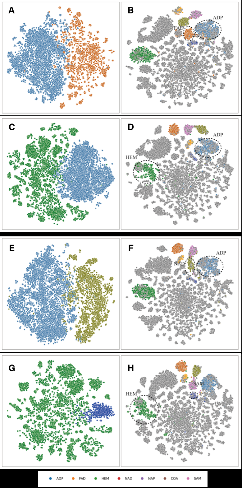
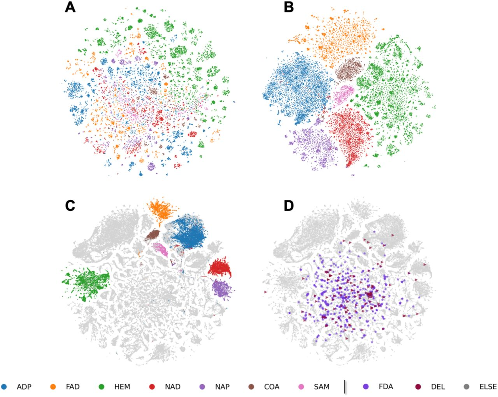
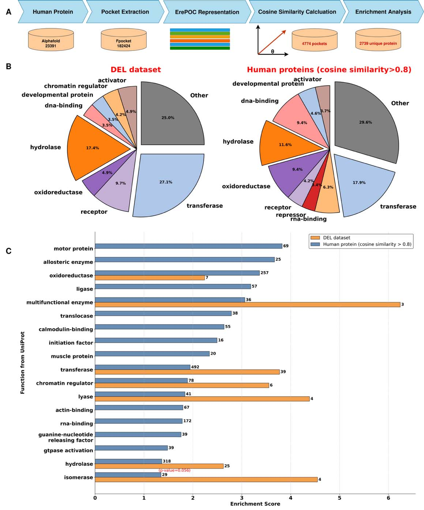
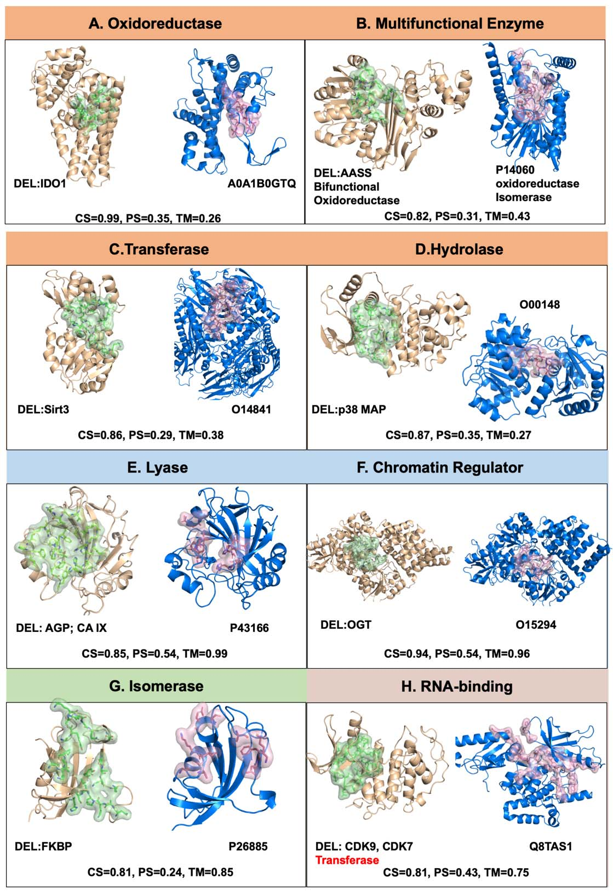

# ErePOC应用：人类蛋白质组的DEL适配性预测与验证（下篇）

> 本文是《对比学习破译DEL口袋模式》系列的第二篇，聚焦于ErePOC模型的性能评估和实际应用。第一篇介绍了DEL口袋特征分析和ErePOC方法原理。

## 研究内容（续）

#### 零样本与小样本学习性能评估

我们使用**零样本学习任务**评估了我们的模型，以比较从ESM-2嵌入导出的表征与通过ErePOC学习的表征的性能。

我们考虑了一个涉及**七种口袋类型的分类任务**，每种对应于唯一的配体类型：

| 配体类型 | 口袋数量 | 配体类型 | 口袋数量 |
| --- | --- | --- | --- |
| **ADP** | 9,531个 | **NAD** | 5,354个 |
| **FAD** | 6,367个 | **NADP（NAP）** | 3,997个 |
| **HEM** | 13,312个 | **COA** | 1,900个 |
| **SAM** | 1,228个 | | |

总共约**43,000个**从BioLiP2策划的结合口袋。

基于ESM-2和ErePOC表征，图4A和B分别展示了使用t-SNE的这七种结合口袋类型的聚类。结果清楚地表明，**对比学习框架**为不同的配体/口袋类型生成了**良好分离的簇**，有效地捕捉了结合口袋的**功能和配体特异性特征**。

> 相比之下，缺乏口袋特异性功能注释的ESM-2模型显示口袋类型之间的**分离有限**。这种比较突显了对比学习在产生用于功能口袋分类的**更精细和信息丰富的表征**方面的卓越性能。

为评估我们模型的鲁棒性，我们进行了**消融研究**，其中在对比学习之前从BioLiP2训练数据集中完全排除了**两种类型的结合口袋**。然后我们评估了模型对被排除的口袋类型进行分类的性能。

图S5展示了各种排除场景的t-SNE可视化，包括**ADP和FAD、HEM和ADP、ADP和NAD，以及HEM和SAM口袋**的排除场景。

**图S5：消融研究中排除口袋类型的t-SNE可视化**。该图展示了在不同口袋类型被排除后的模型性能，包括：
- **面板A-D**：ADP和NAD口袋排除场景，展示ESM-2（A、C）和ErePOC（B、D）的表征
- **面板E-H**：HEM和ADP口袋排除场景，展示ESM-2（E、G）和ErePOC（F、H）的表征
- **面板I-L**：ADP和NAD口袋排除场景的重复实验
- **面板M-P**：HEM和SAM口袋排除场景，展示ESM-2（M、O）和ErePOC（N、P）的表征

被排除的口袋类型包括ADP（n = 9,513）、NAD（n = 5,354）、HEM（n = 13,312）和SAM（n = 1,228）。

> 结果表明，即使对于从训练中排除的口袋，也能保持**很强的分类性能**。对比学习框架有效地区分了被移除的配体类型，突显了其基于功能和配体结合特征**概括和准确分类口袋的能力**。

**图4：BioLiP2数据集的ErePOC和ESM-2表征的t-SNE可视化**。
- **面板A-B**：展示使用ESM-2（A）和ErePOC（B）的7种配体结合口袋景观的可视化，包括ADP、FAD、HEM、NAD、NADP（NAP）、COA和SAM。每种颜色代表一种配体类型，点的聚集程度表示表征模型区分不同功能口袋的能力。
- **面板C**：展示使用ErePOC表征的BioLiP2数据集生成的全局口袋景观，实验确定的代谢物口袋组织成明显的局部区域。
- **面板D**：展示FDA-AD（紫色）和DEL（深灰色）数据集在BioLiP2口袋景观上的投影，显示它们在整个蛋白质空间中的广泛分布，而非局限于特定簇。

这种鲁棒性表明，模型利用训练期间注释的配体信息做出**可靠的预测**，即使特定配体类型从训练集中缺失。这强调了ErePOC在**捕捉和概括关键结合口袋特征**方面的有效性。

该方法通过分析来自BioLiP2数据集（**实验确定的结构**）和AlphaFill数据集（**将配体植入AF2预测结构**）的**ATP-、FAD-和HEM-结合口袋**得到进一步验证。

基于ESM-2特征的t-SNE聚类显示口袋类型之间的分离有限。相比之下，ErePOC表征揭示了来自两个数据集的结合相同配体的口袋之间的**大量重叠**，证明了ErePOC捕捉实验和预测蛋白质-配体复合物之间结构相似性的能力。

> 此外，使用从BioLiP2数据集中随机选择的500个口袋计算相关系数（如图S7所示）。Pearson相关分析显示，配体Tanimoto相似度与从ErePOC向量导出的口袋余弦相似度之间有**0.96的强相关性**，突显了ErePOC捕捉**有意义的口袋-配体相互作用**的禀赋。

此外，从**七种配体结合类型**中随机选择五个口袋来计算成对余弦相似度。图S8中的热图比较了使用**ESM-2嵌入、ErePOC向量和ErePOC转换后的t-SNE 2D投影**的相似度结果。

> 从ErePOC表征计算的余弦相似度**有效地区分了不同的口袋类型**，而ESM-2的区分能力有限。总之，ErePOC在**识别结合具有类似结构特征配体的口袋**方面非常熟练。

我们设计了另一个下游分类任务，涉及使用ESM-2和ErePOC表征的**小样本学习预测七种配体结合口袋类型**。为了独立测试，保留了**10%的靶点**，确保对模型性能的全面评估。

在这个小样本学习设置中，我们测试了四个模型：

- **ErePOC-NN**和**ErePOC-SVM**：使用从对比学习导出的口袋表征作为输入特征，分别与神经网络（NN）或支持向量机（SVM）分类器配对
- **ESM2-NN**和**ESM2-SVM**：依赖于直接来自ESM-2的嵌入，利用NN和SVM分类器

图S9比较了这些模型在测试数据集上的性能。ESM2-NN在分类七种配体结合口袋类型方面达到了**最高的整体准确率**（0.989），其次是ErePOC-NN（**0.986**）。我们注意到，使用MaSIF表征训练的MaSIF-ligand模型在同一任务上达到了0.74的准确率，尽管结果是在不同的测试集上获得的。

有趣的是，在评估具有**RBF核的SVM模型**的性能时，ESM2-SVM的准确率显著下降到**0.811**，而ErePOC-SVM保持了较高准确率**0.985**。

### 小样本学习模型性能对比

| 模型 | 准确率 | 分类器 | 核函数 | 关键特征 |
|------|--------|--------|--------|----------|
| **ESM2-NN** | 0.989 | 神经网络 | - | 最高整体准确率 |
| **ErePOC-NN** | 0.986 | 神经网络 | - | 接近最优性能 |
| **ErePOC-SVM** | 0.985 | 支持向量机 | RBF | 鲁棒性强，泛化能力好 |
| **ESM2-SVM** | 0.811 | 支持向量机 | RBF | 性能显著下降 |

> 这一显著差异强调了对比学习在生成用于功能口袋分类的**鲁棒表征**方面的优越性。它还突显了ErePOC**概括到多样化或以前未见过的口袋的能力**，而ESM-2的预训练特征在这个特定任务上似乎效果较差，没有进一步的微调。

### DEL口袋在实验和预测蛋白质景观中的聚类与表征

本研究的首要目标是探索整个蛋白质空间中**药物相关和先导结合口袋的分布**。使用ErePOC表征，我们将FDA-AD和DEL数据集投影到使用BioLiP2数据集生成的**综合口袋景观**上。

t-SNE可视化说明，**实验确定的代谢物口袋**组织成明显的局部区域，证明了ErePOC区分功能口袋的能力。此外，与批准药物分子结合的口袋（FDA-AD，图中紫色显示）在整个蛋白质空间中广泛分布，而不是局限于特定簇，突显了它们的多样性。图4D显示了DEL口袋（深灰色）和FDA-AD口袋的相似分布模式，它们散布在整个潜在空间中。这种空间一致性与之前的Fpocket分析一致——**DEL筛选可以进入大多数已知可成药口袋的空间**。

ErePOC表征将BioLiP2口袋空间划分为不同的模式，为**全局口袋景观**提供了关键见解。例如，与**SAM或HEM等天然配体**结合的口袋在DEL和FDA-AD化学空间中明显缺失，表明这些**紧密结合的、辅因子相关的口袋**可能不太适合常规DEL筛选。

为了进一步探索口袋景观中的DEL适配区域，我们基于余弦相似度在BioLiP2数据集中识别了每个DEL靶点的五个最近邻居。BioLiP2中共有**361个口袋**，称为DEL邻居，表现出**大于0.8的余弦相似度得分**。

使用Fpocket计算的这些DEL邻居的物理化学性质总结在图S13中。DEL邻居的平均口袋体积从**1612.84 Å3变化到2038.69 Å3**，相对于BioLiP2数据集中天然口袋的平均体积增加了约**26.4**%。

DEL邻居的平均α球数量从69.35变化到92.35，反映了**33.2**%的增加，表明更高的结构复杂性。此外，DEL邻居的平均局部疏水密度从**14.98**增加到**21.71**，增长**44.9**%，强调其更**显著的疏水性质**。

#### DEL邻居口袋的物化偏移概览

| 指标 | BioLiP2天然口袋均值 | DEL邻居均值 | 相对变化 |
| --- | --- | --- | --- |
| **口袋体积** | 1612.84 Å3 | 2038.69 Å3 | +26.4% |
| **α球数量** | 69.35 | 92.35 | +33.2% |
| **平均局部疏水密度** | 14.98 | 21.71 | +44.9% |

### 人类蛋白质组的DEL适配性预测

基于ErePOC对DEL口袋特征的深刻理解，我们进一步将其应用于预测**人类蛋白质组中适合DEL筛选的潜在靶点**。对AlphaFold预测的**23,391个人类蛋白质**进行了分析，使用Fpocket识别出**182,424个口袋**。

在应用过滤标准后，排除了体积小于800 Å3或pLDDT得分低于0.7的口袋。选择800 Å3阈值是基于先前研究建议500 Å3作为最小可成药口袋体积，加上我们观察到**DEL结合口袋明显更大**的观察结果。

然后使用**ErePOC嵌入**对这些口袋进行编码，并计算它们与**128个已知DEL口袋**的余弦相似度，为每个口袋分配最高相似度。

- 识别出**4,774个余弦相似度大于0.8的口袋**
- 在基于UniProt ID去除重复项后，预测出**2,739个独特的人类蛋白质**含有DEL兼容的口袋

总体预测工作流程如图5A所示。

**图5：预测适合DEL筛选的人类蛋白质靶点**。
- **面板A**：展示筛选流程，总共分析了AlphaFold预测的23,391个人类蛋白质。Fpocket识别出182,424个口袋，使用ErePOC嵌入进行表征。计算每个DEL口袋与人类口袋之间的余弦相似度，最高相似度得分作为最终得分。余弦相似度大于0.8的人类口袋被认为适合DEL筛选。使用超几何检验确定每个蛋白质的富集得分。
- **面板B**：展示预测含有适合DEL筛选口袋的人类蛋白质比例，与DEL和FDA-AD靶点进行比较。
- **面板C**：展示预测的人类蛋白质中p值小于0.05的富集得分分布，数值标签表示每个功能类别的蛋白质计数，括号中显示精确p值。

### 预测和已知DEL靶点的功能类别分布对比

| 功能类别 | 预测人类蛋白质 | 已知DEL靶点 | 已知FDA-AD靶点 |
|---------|--------------|------------|--------------|
| **转移酶** | 17.9% | 27.1% | 20.8% |
| **水解酶** | 11.6% | 17.4% | 18.1% |
| **氧化还原酶** | 9.4% | - | 14.8% |
| **DNA结合蛋白** | 9.4% | - | 7.3% |
| **受体** | - | 9.7% | 6.9% |

> **关键发现**：**转移酶、水解酶、氧化还原酶**在预测和已知数据集中都高度富集，表明这些酶类可能具有**灵活和可适应的结合口袋**，适合DEL筛选。

使用超几何检验计算每个蛋白质类别的富集得分，图5C描绘了p值小于0.05的蛋白质的富集得分分布。值得注意的是，包括**氧化还原酶、多功能酶、转移酶、染色质调节因子、裂解酶和异构酶**在内的几个类别，在DEL靶点集和预测人类蛋白质数据集中都显示出**1.36至6.24范围的富集得分**。

此外，在比较预测的**DEL-like口袋**与**FDA-AD-like口袋**时，两者呈现出不同的富集偏好：FDA-AD-like口袋更集中于**受体、离子通道和异构酶**等经典靶点家族，而DEL-like口袋更偏向**RNA结合蛋白、染色质调节因子和GTP酶激活剂**。这提示DEL筛选可能更适合探索**结构更复杂、口袋更柔性**的蛋白质家族，同时也反映了膜蛋白在DEL实验中的可操作性限制。

图S14展示了DEL口袋在人类蛋白质中的分布的t-SNE可视化，以及余弦相似度大于0.8的人类蛋白质口袋。与BioLiP2和AlphaFill数据集的发现一致，DEL口袋表现出**广泛和多样化的分布**。

值得注意的是，与DEL口袋密切相似的人类蛋白质口袋聚集成**三个不同的簇**。

然而，相当数量的DEL口袋在人类蛋白质中**缺乏高度相似的对应物**。这种差异可能由于AlphaFold2在预测准确蛋白质结构方面的局限性，或者Fpocket在识别结合口袋方面的潜在不准确性，两者都可能影响在整个人类蛋白质组中检测DEL样口袋的能力。

#### 全局和局部结构比较

**图6：预测和已知DEL靶点的全局和局部结构比较**。该图展示了对预测和已知DEL靶点中富集的蛋白质类别的全局和局部口袋结构比较的案例研究。使用ErePOC嵌入，计算了每个类别内结合口袋的余弦相似度得分，将具有高余弦相似度和同一蛋白质类别的口袋分组进行全局和局部结构比较。TM-align评估全局结构相似性（TM得分），PPS-align评估口袋级相似性（PS得分）。图中包含8个案例：

- **面板A-D**：氧化还原酶、多功能酶、转移酶和水解酶类别中的案例，在潜在表征空间中高相似，但全局和局部结构不相似
- **面板E-F**：裂解酶和染色质调节因子类别中的案例，在所有三个相似性指标上都高度一致
- **面板G-H**：异构酶和RNA结合蛋白类别中的案例，余弦相似度较高但局部口袋相似性中等或偏低

两个得分范围从0到1，较高值表示更相似的拓扑结构。具体而言，**PS得分大于0.46**表示口袋具有相似结构。

**氧化还原酶、多功能酶、转移酶和水解酶类别**中的四个代表性案例（图6A-D）在潜在表征空间中表现出高相似性，尽管在全局蛋白质和局部口袋结构上不相似。

> 这些案例表明，对比学习可能捕捉到结合口袋之间的**潜在功能或物理化学关系**，这些关系不能完全通过全局蛋白质折叠或局部几何相似性来解释。
> 
> 在早期的观察中已经报道了类似的发现，即结合相同配体（如ATP）的口袋表现出**相当大的几何多样性**，并且功能关联可以在不同的结构折叠中检测到。尽管需要进一步的实验证据来证实我们预测中的这些关系，但这些发现表明，基于嵌入的相似性可以提供传统结构比对方法的**信息补充**，并为未来的探索提供假设。

与上述案例相反，我们也识别出了在潜在口袋表征空间和全局及局部结构中都一致高相似性的实例。**裂解酶和染色质调节因子类别**中的两个示例（图6E-F）在所有三个相似性指标上都表现出**高度一致性**：余弦相似度（**0.85和0.94**）、TM得分（**0.99和0.96**）和PS得分（**0.54和0.54**）。

#### 图6案例的三指标对比表

| 面板与类别 | 余弦相似度（CS） | 口袋相似性（PS） | 全局相似性（TM） |
| --- | --- | --- | --- |
| **A 氧化还原酶** | 0.99 | 0.35 | 0.26 |
| **B 多功能酶** | 0.82 | 0.31 | 0.43 |
| **C 转移酶** | 0.86 | 0.29 | 0.38 |
| **D 水解酶** | 0.87 | 0.35 | 0.27 |
| **E 裂解酶** | 0.85 | 0.54 | 0.99 |
| **F 染色质调节因子** | 0.94 | 0.54 | 0.96 |
| **G 异构酶** | 0.81 | 0.24 | 0.85 |
| **H RNA结合蛋白** | 0.81 | 0.43 | 0.75 |

这些案例代表更传统的相似性情景，其中全局和局部结构对齐与功能相关。

**异构酶类别的FKBP2靶点**（图6G）与已知DEL靶点共享**0.85的TM得分**，表明强的全局结构相似性。然而，它们的口袋相似性得分仅为0.24，可能是由于结合口袋的**柔性延伸性质**，这严重限制了局部结构的刚体3D比对的有效性。尽管如此，ErePOC在口袋潜在空间中识别出**0.81的高余弦相似度**，合理地表明FKBP2也应该是一个可被DEL分子进入的靶点。

我们的分析不限于UniProt中注释的功能类别。例如，ErePOC识别出**RNA结合蛋白NOP56**（UniProt：Q8TAS1）和**SAM依赖甲基转移酶TrmD**（PDB：1UA2）之间潜在的配体结合相似性，尽管它们具有不同的经典生物学作用。

中等TM得分（**0.75**）表明共享Rossmann样折叠，而中等PS得分（**0.43**）表明局部口袋结构差异。然而，ErePOC识别出**0.81的高余弦相似度**，表明尽管缺乏明显的功能或结构关联，这两个口袋在潜在功能空间中是相似的。

> 这一观察意味着**靶向TrmD催化口袋的DEL衍生化学物质**可能具有与其他具有类似结构特征的**RNA修饰酶相互作用的能力**。

作为进一步验证，我们设计了一个针对**14个选定人类靶点的大规模计算机内DEL筛选实验**，以比较DEL富集家族与DEL中性家族的结合倾向差异。

六个靶点来自不同的DEL富集功能家族，并且口袋与已知DEL口袋的ErePOC余弦相似度**大于0.8**：

| 功能类别 | UniProt ID | 功能类别 | UniProt ID |
| --- | --- | --- | --- |
| **染色质调节因子** | O15294 | **裂解酶** | P43166 |
| **水解酶** | P03951 | **多功能酶** | P14060 |
| **异构酶** | P26885 | **RNA结合蛋白** | Q8TAS1 |

作为对照组，六个靶点来自**DEL中性家族**，同样包含与已知DEL口袋余弦相似度**大于0.8**的口袋：

| 功能类别 | UniProt ID | 功能类别 | UniProt ID |
| --- | --- | --- | --- |
| **信号转导抑制因子** | O14508 | **有丝分裂原** | Q9H706 |
| **延伸因子** | P43897 | **肌动蛋白封帽蛋白** | P47756 |
| **降压相关蛋白** | P68871 | **细胞周期蛋白** | Q5T5M9 |

另外加入MAT2A（P31153）和MAT2B（Q9NZL9）作为家族级案例研究。

虚拟筛选使用了一个公开的DEL虚拟库，约**280万**个分子，来自HitGen OpenDEL三轮反应库的**15个子库**，不包含DNA标签，代表off-bead合成的小分子化合物。

#### 虚拟筛选结果对比

| 指标 | DEL富集家族 | DEL中性家族 | 差异显著性 |
|------|------------|------------|-----------|
| **平均Z分数** | $-2.18$ | $-1.07$ | DEL富集家族更负 |
| **平均对接分数** | $-7.45~\mathrm{kcal\cdot mol^{-1}}$ | $-6.15~\mathrm{kcal\cdot mol^{-1}}$ | DEL富集家族更低 |
| **前1%化合物对接分数范围** | $-8.93$至$-11.96~\mathrm{kcal\cdot mol^{-1}}$ | $-5.49$至$-9.73~\mathrm{kcal\cdot mol^{-1}}$ | DEL富集家族显著更低 |
| **前1%化合物Z分数范围** | $-1.54$至$-3.73$ | $+0.95$至$-2.12$ | DEL富集家族更负 |

表格集中呈现平均Z分数、平均对接分数、前1%对接分数范围与前1% Z分数范围，清晰显示DEL富集家族靶点在虚拟筛选中的优势表现。  

> 这些差异在统计检验与Monte Carlo重采样中均保持显著，支持ErePOC识别的DEL富集口袋更适合DEL筛选。

---

## Q&A

- **Q1**：ErePOC使用KL散度作为对比学习的损失函数，这与传统的交叉熵损失或三元组损失（triplet loss）相比有什么优势？为什么选择KL散度来对齐配体相似度分布和口袋相似度分布？
- **A1**：KL散度在ErePOC中的应用具有独特的理论优势。**KL散度衡量两个概率分布之间的差异**，天然适合处理分布对齐问题。在ErePOC中，我们将配体相似度$Q(i)$和口袋相似度$P(i)$都建模为分布，而非单点相似度值，这使得模型能够学习更丰富的关系。

  与triplet loss相比，KL散度**不需要显式地定义正负样本对**，减少了超参数调优的复杂性。更重要的是，KL散度对**长尾分布更加鲁棒**，这在药物化学空间中尤为重要，因为某些配体类别（如ATP结合蛋白）样本量巨大，而其他类别样本稀少。

  交叉熵损失倾向于在类别不平衡时偏向多数类，而KL散度通过最小化整个分布的差异，能够更好地处理这种不平衡。实验结果表明，这种设计使得ErePOC在**零样本学习任务中表现出色**，即使某些配体类型完全从训练集中排除，模型仍能准确分类和聚类这些口袋。
- **Q2**：DEL口袋被识别为更大、更疏水的特征，这与传统药物发现的“Lipinski规则”中强调的极性表面积和氢键似乎矛盾。如何理解DEL分子的这种独特性质，以及对药物优化的启示是什么？
- **A2**：这是一个深刻的观察，实际上反映了**DEL筛选与传统药物发现处于药物发现流程的不同阶段**。DEL技术主要用于苗头化合物发现，而非先导化合物优化阶段。

  DEL分子受DNA标记连接和溶液化学的限制，倾向于含有疏水芳环和有限的可旋转键，这导致它们优先识别大而疏水的口袋，通过形状互补和疏水效应实现结合。本研究发现DEL分子具有：
  - 更低的水溶性（$\mathrm{LogS} = -6.49$ vs $-3.05$）
  - 更高的疏水性（$\mathrm{cLogP} = 3.42$ vs 1.44）

  然而，DEL分子并非最终的药物，它们是药物发现的起点。一旦通过DEL识别出苗头化合物，药物化学家会通过引入极性官能团、优化氢键网络来提高结合选择性和类药性，最终将偏向DEL的疏水口袋转化为更类药的平衡口袋。

  > **DEL的独特性质不是对Lipinski规则的违背，而是药物发现的早期策略**——通过最大化疏水接触来快速发现结合起点，然后在后续优化中引入极性相互作用。

- **Q3**：研究中选择0.8作为余弦相似度阈值的依据是什么？这个阈值在不同蛋白质家族中是否需要调整？假阳性和假阴性的主要来源是什么？
- **A3**：0.8的余弦相似度阈值是基于多个考虑的经验选择。
  - 首先，在BioLiP2数据集的分析中，研究者发现已知DEL靶点的五个最近邻居中，361个口袋的余弦相似度大于0.8，这些“DEL邻居”口袋的物理性质（体积、α球数量、疏水密度）显著大于一般BioLiP2口袋，与DEL口袋的特征一致，支持0.8作为功能相似性的合理阈值。
  - 其次，在小样本学习验证中，ErePOC-SVM模型达到**0.985的准确率**，表明模型在高相似度区域具有可靠的判别能力。
  - 然而，这个阈值在不同蛋白质家族中可能需要调整。例如，对于**G蛋白偶联受体**（GPCR）这类具有保守7次跨膜螺旋结构的蛋白家族，口袋相似度的基线分布可能不同，0.8可能过于严格或宽松。

  **假阳性的主要来源**包括：
  - AlphaFold2在预测柔性环区和无序区域时的不准确性
  - Fpocket对大而浅口袋的过度识别
  - 某些蛋白质在apo状态下与holo状态下的构象差异
  **假阴性**则可能由于：
  - 蛋白质翻译后修饰（如磷酸化、糖基化）未在结构中考虑
  - 别构调节位点的复杂性
  - 某些蛋白质需要特定辅因子或膜环境才能形成功能性口袋

本研究通过计算机内DEL筛选实验对14个人类靶点进行验证，显示DEL富集家族的对接Z分数与对接分数整体更有利，且在前1%化合物的对接分数范围上明显优于DEL中性家族，支持0.8阈值在靶点优先级排序上的实用性，但也说明在具体应用中仍需实验验证和可能的人工调整。

---

## 关键结论与批判性总结

本研究通过系统分析128个成功DEL筛选靶点的结合口袋特征，揭示了DEL口袋的独特物理化学性质，并开发了ErePOC模型用于功能感知的口袋表征。

**主要发现**包括DEL口袋显著大于常规配体口袋（平均体积3301.2 Å3 vs 2739.5 Å3），以疏水相互作用为主导（50.7% vs 32.5%），以及甲硫氨酸、酪氨酸、色氨酸和苯丙氨酸的显著富集。

ErePOC模型通过对比学习，在BioLiP2数据集的326,416个口袋-配体对上训练，实现了256维紧凑口袋表征，在下游分类任务中达到约98%量级的精确率。将ErePOC应用于人类蛋白质组预测，**识别出2,739个含有DEL兼容口袋的独特蛋白质，氧化还原酶、转移酶、水解酶等18个功能类别显著富集**，为DEL技术的靶点选择提供了系统性资源。

### 潜在影响

这项研究为DEL领域的靶点选择和优先级排序提供了首个系统性的计算框架。通过揭示DEL口袋的物理化学特征并提供人类蛋白质组的DEL适配性预测，ErePOC可以**帮助研究团队在启动DEL筛选项目之前评估靶点的可行性**，从而提高筛选成功率和资源利用效率。

**主要应用场景**包括：
- 为DEL技术的靶点选择提供系统性资源
- 共价抑制剂设计和蛋白-蛋白相互作用抑制剂开发
- 其他需要功能感知口袋表征的药物发现场景

该研究还展示了蛋白质语言模型（ESM-2）与结构数据结合的强大能力，为AI驱动的药物发现提供了方法论范例。

### 局限性

研究存在几个重要局限性：

> **核心局限性**：
> - **数据集规模限制**：DEL数据集相对较小（128个靶点），可能不足以捕捉DEL靶点空间的全貌
> - **3D信息缺失**：ErePOC缺乏口袋的3D几何和动力学信息，可能限制其对构象变化剧烈的口袋的表征能力
> - **阈值缺乏实验验证**：使用0.8的余弦相似度阈值缺乏大规模实验验证，假阳性和假阴性率仍有待评估
