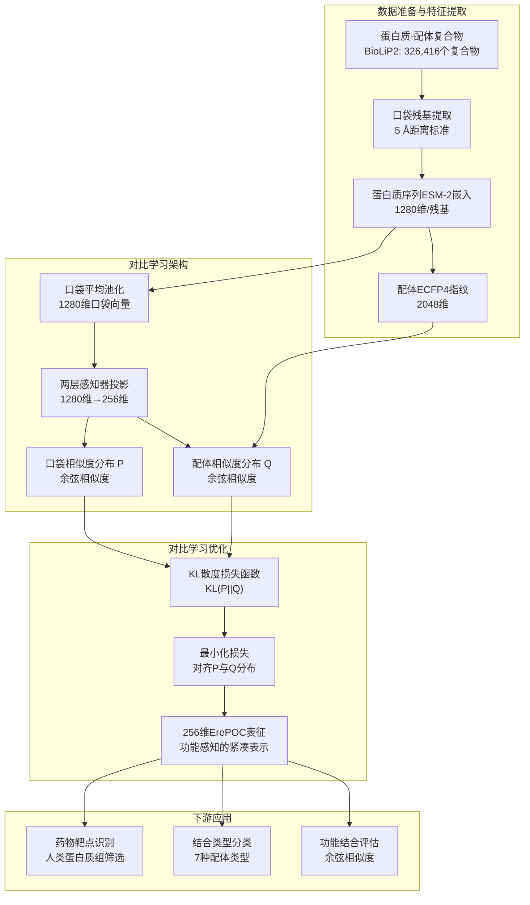
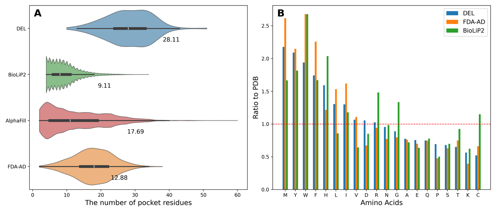
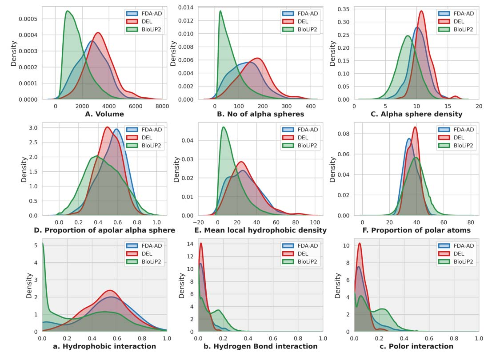
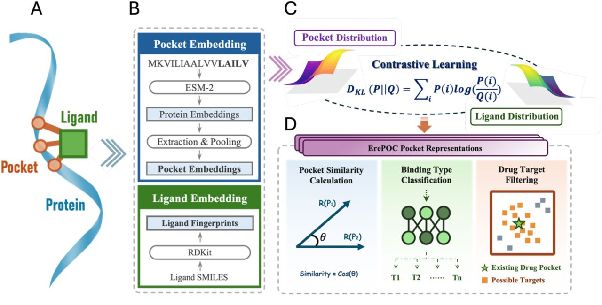

# 对比学习破译DEL口袋模式：从蛋白质语言模型到靶点预测（上篇）

## 本文信息
- **标题**：Deciphering DEL Pocket Patterns through Contrastive Learning
- **作者**：Wenyi Zhang, Yuxing Wang, Rui Zhan, Runtong Qian, Qi Hu, Jing Huang
- 发表时间：2026年2月（在线发表）
- 单位：西湖大学生命科学学院，西湖AI治疗实验室，中国杭州
- 引用格式：Zhang, W., Wang, Y., Zhan, R., Qian, R., Hu, Q., & Huang, J. (2026). Deciphering DEL pocket patterns through contrastive learning. *Nature Communications*. https://doi.org/10.1038/s41467-026-69663-y
- 代码与数据：[GitHub仓库](https://github.com/JingHuangLab/ErePOC)：https://github.com/JingHuangLab/ErePOC包含完整源代码和数据文件；
  - BioLiP2、AlphaFill和AF2预测的蛋白质结构数据分别来源于[BioLiP](https://zhanggroup.org/BioLiP/)：https://zhanggroup.org/BioLiP/、[AlphaFill](https://alphafill.eu/)：https://alphafill.eu/、[AlphaFold](https://alphafold.ebi.ac.uk/download)：https://alphafold.ebi.ac.uk/download

## 摘要
> DNA编码库（DEL）通过**分割池合成和DNA标记技术**，实现了针对蛋白质靶点的**数万亿分子规模的高通量筛选**。尽管DEL技术在药物发现中展现出巨大潜力，但**进入临床试验或成功上市的DEL衍生化合物仍然寥寥无几**。提高DEL筛选成功率的关键在于深入理解靶蛋白的定义性特征，特别是那些适合DEL筛选的结合口袋特征。然而，现有方法**在评估口袋柔性和功能相似性方面仍然存在显著局限**。本研究提出了**ErePOC**（Enhanced representation of POCkets），一种基于**ESM-2嵌入的对比学习口袋表征模型**，有效解决了这些挑战。ErePOC能够同时捕捉结合口袋的结构和功能特征，揭示DEL靶点之间的共同特征。通过整合**低维物理化学性质分析和高维ErePOC嵌入分析**，我们提供了DEL靶点空间的全面视图。在**下游分类任务中达到约98%的精确率**，ErePOC在口袋表征方面表现出卓越性能，进而**应用于预测适合DEL筛选的人类蛋白质**，在18个蛋白质类别中发现显著富集。

### 核心结论

- **DEL口袋的独特物理化学特征**：DEL结合口袋在大小和疏水性方面显著区别于常规配体结合口袋，平均体积为3301.2 Å3，比FDA-AD药物口袋大1.3倍，比BioLiP2常规配体口袋大1.2倍，且疏水相互作用占比高达50.7%
- **ErePOC模型的创新性**：基于ESM-2蛋白质语言模型和对比学习框架，从326,416个口袋-配体对中学习256维紧凑表示，通过KL散度损失函数对齐配体相似性与口袋相似性，在零样本（zero-shot）与小样本（few-shot）任务中取得约0.98量级的分类准确率
- **人类蛋白质组的DEL适配性预测**：对23,391个人类蛋白质的182,424个口袋进行筛选，识别出2,739个含有DEL兼容口袋的独特蛋白质，氧化还原酶、转移酶、水解酶等18个功能类别显著富集，为DEL技术在更广泛靶点上的应用提供了系统性的靶点优先级排序

## 背景

DNA编码库（DEL）技术代表了药物发现领域的一项革命性筛选平台，通过**分割池合成策略构建包含数十亿至万亿个化合物的超大组合库**，每个化合物都通过**独特的DNA条形码进行标记**。这些DNA标记的化合物随后根据其与特定靶蛋白的亲和力进行筛选，从而高通量地鉴定潜在的药物候选分子。DEL技术已在基于靶点的药物发现中贡献了大量Hit化合物，在**SARS-CoV-2 3CL蛋白酶、可溶性环氧化物水解酶、Autotaxin和受体相互作用丝氨酸/苏氨酸激酶1等抑制剂发现中取得了显著成功**。

尽管DEL技术具有高通量能力和经济优势，但**进入临床试验或成功上市的DEL衍生分子数量相对较低**，这在一定程度上反映了**我们对靶点可成药性，特别是与DEL分子相容的口袋特征的理解仍然不足**。

为克服这些障碍，人工智能与DEL筛选的整合工作逐渐涌现，大多数研究专注于如何从**高度噪声的筛选数据**中选择更有前景的Hit分子。然而，DEL分子具有由**溶液化学和DNA标签连接**的结构要求所约束的共同特征，这可能导致它们与靶蛋白口袋产生特定的相互作用模式。从能够结合DEL分子的蛋白质口袋特征角度出发，可以为DEL提供重要见解，从而提高药物发现活动的效率和成功率。

蛋白质语言模型已成为生物研究的强大工具，广泛应用于**蛋白质结构预测、性质预测、功能注释以及蛋白质设计和工程**等领域。

尽管取得了这些进展，但**专门为结合口袋——药物设计中的基本功能单元——设计的大规模语言模型仍然有限**。

- **MASIF**：主要依赖于学习蛋白质表面的化学和几何特征
- **Uni-Mol**：利用自监督掩码原子预测来学习口袋结构的表征
- **PocketAnchor**：通过在空间中采样锚点来表征口袋，用于下游口袋检测和结合亲和力预测任务

对比学习是一种**自监督表征学习技术**，模型通过训练区分相似和不相似的数据对，旨在学习**可泛化的特征表征**。

将这种技术与**预训练的大型蛋白质语言模型**（如ESM-2）相结合，可以利用语言模型中编码的进化信息实现**零样本（zero-shot）或小样本（few-shot）学习**。这种方法在DrugLAMP和PocketDTA等DTI预测方法中已得到有效应用。然而，用于结合口袋的**功能分类模型仍然相当缺失**。

当前口袋表征方法面临的关键挑战包括：**缺乏全面的口袋数据库**以及**结合口袋固有的结构柔性**，这对基于结构的模型构成了重大困难，限制了它们在**功能注释和分类**方面的有效性。

> 研究表明，**相同配体的结合口袋可能表现出显著的几何差异**（如ATP），而蛋白质的全局结构相似性并不总是对应于局部口袋结构的相似性。这些观察突显了当前口袋表征方法的局限性，特别是在**区分功能相似的口袋方面**。

近期研究强调，**精细的口袋表征**可以直接实现生物学发现。为应对这些挑战，需要一种**更定制的、功能驱动的口袋建模方法**，以推进结合口袋的理解和药物发现。

### 关键科学问题

本研究旨在解决以下核心科学问题：

- **DEL靶点口袋的识别特征**：DEL成功靶点的结合口袋在序列组成、物理化学性质和相互作用模式方面具有哪些区别于常规配体结合口袋的独特特征，这些特征如何影响DEL分子的筛选效率和Hit分子质量？
- **口袋功能相似性的准确度量**：如何克服传统3D结构比对方法在评估口袋相似性时的局限性，开发能够捕捉口袋功能相似性而不仅仅是几何相似性的计算方法，从而实现对结合口袋的准确功能分类？
- **人类蛋白质组的DEL适配性预测**：如何利用已知的DEL靶点口袋特征，在全人类蛋白质组范围内系统预测适合DEL筛选的潜在靶点，识别哪些蛋白质功能类别最可能含有DEL兼容的口袋，从而扩展DEL技术的应用范围？

### 创新点

本研究在理论、方法和应用层面实现了多项创新：

- **理论创新**：首次系统揭示了DEL靶点口袋的物理化学特征，发现DEL口袋显著大于常规配体口袋且以疏水相互作用为主导，为理解DEL分子的结合偏好和优化策略提供了理论基础
- **方法创新**：提出了ErePOC模型，将蛋白质语言模型（ESM-2）与对比学习相结合，通过KL散度损失函数对齐配体化学相似性与口袋表征相似性，实现了256维紧凑且功能感知的口袋表示，在零样本和小样本学习任务中显著优于传统ESM-2嵌入
- **应用创新**：将ErePOC应用于人类蛋白质组规模预测，从23,391个人类蛋白质中识别出2,739个含有DEL兼容口袋的蛋白质，系统揭示了18个显著富集的蛋白质功能类别，为DEL技术的靶点选择和优先级排序提供了全面的资源
---

## 研究内容

本研究旨在识别适合DEL筛选的蛋白质靶点的共享特征，特别关注**结合口袋作为分析的核心单元**。我们整合了多个数据源，包括BioLiP2和AlphaFill数据集，分别包含**实验和预测的配体-蛋白质复合物结构**，还精心策划了两个包含DEL分子和FDA批准药物复合物结构的数据集。

我们系统分析了**DEL、FDA-AD和BioLiP2数据集**中结合口袋的特征，重点关注**序列特征、物理化学性质和结合相互作用**。研究结构如下：
- 首先详细分析**DEL口袋模式**
- 介绍ErePOC模型的训练和验证用于表征**蛋白质口袋**
- 探索口袋景观聚类，比较**实验确定和计算预测的结构**
- 预测人类蛋白质中最可能富集于**DEL筛选的类别**
- 在全局和局部层面评估其**功能作用和结构相似性**

### DEL口袋的序列与物理化学特征分析

我们通过分析**口袋内氨基酸残基的分布**，比较了不同结构中的口袋大小。这些结构来源于四个类别：

| 数据集 | 口袋数量 | 描述 |
| --- | --- | --- |
| **BioLiP2数据库** | 326,416个 | 标注为常规配体（生物学相关小分子）的条目，使用网络服务器提供的实验注释结合残基定义 |
| **AlphaFill数据集** | 293,019个 | 包含计算预测的配体-蛋白质复合物结构 |
| **DEL数据集** | 128个 | 精心策划的包含报告由DEL筛选鉴定的配体 |
| **FDA-AD数据集** | 340个 | 包含具有实验确定复合物结构的FDA批准药物 |

对于AlphaFill、DEL和FDA-AD数据集，口袋通过包含距结合配体5 Å内的所有氨基酸残基来生成。为评估这种不一致性的影响，我们使用相同的**基于距离的标准**重新定义了BioLiP2口袋，并在这个统一定义下重复了所有分析。关键发现在不同定义下保持一致，表明我们的结论对**口袋定义的差异具有合理的鲁棒性**。

**图1：口袋大小分布和氨基酸频率分析**。面板A展示使用小提琴图显示四个数据集中口袋残基数量的分布，包括DEL、FDA-AD、BioLiP2和AlphaFill。每个小提琴的宽度代表分布的核密度，中心线表示中位数，数值标签表示每个数据集的平均口袋残基数。样本量分别为：BioLiP2（326,416个口袋）、AlphaFill（293,019个口袋）、DEL（128个口袋）和FDA-AD（340个口袋）。

如图1A所示，BioLiP2、AlphaFill、DEL和FDA-AD口袋中平均残基数分别为**12.5、12.5、28.1和16.1**。DEL和FDA-AD配体周围更多的残基数可能反映了它们**更大的分子尺寸和化学复杂性**。

面板B展示**DEL、BioLiP2、AlphaFill和FDA-AD数据集**中20种氨基酸的相对频率，通过它们在PDB中的相应频率进行归一化，突出显示不同数据集中**氨基酸组成的富集或缺失模式**。

本研究中DEL和FDA-AD配体的平均分子量分别为**560.5和310.9**，这些分子通常含有**卤素原子和其他庞大功能基团**，需要更空间延伸的结合环境。相比之下，常规配体及其口袋已经共同进化，实现了针对生物学需求而非最大结合的优化拟合。

合成药物分子通常通过**药物化学努力进行效力和选择性优化**，这通常导致比常规配体**更大且化学更复杂的支架**。它们通常靶向**更大、更柔性和动态的蛋白质口袋**，能够适应更广泛的相互作用范围。

> 我们分析了BioLiP2、DEL和FDA-AD数据集中结合口袋的氨基酸频率。为突出组成差异，我们计算了每种氨基酸相对于其在PDB中丰度的富集比例。如图1B所示，**甲硫氨酸、酪氨酸、色氨酸和苯丙氨酸是DEL数据集中四种最显著富集的氨基酸。**

这四种氨基酸在FDA-AD中也最富集，在药物结合口袋中出现的频率是**一般蛋白质中的两倍以上**。这些庞大的侧链可能为特定的分子结合提供**独特的口袋几何形状**，并为**疏水和芳香相互作用**提供锚点。

与BioLiP2相比，包括**甲硫氨酸和亮氨酸在内的疏水氨基酸**在DEL和FDA-AD中显著富集。相反，**半胱氨酸**在药物结合口袋中显示出显著较低的富集。我们注意到我们的分析排除了**共价药物分子**，这些分子主要与半胱氨酸的巯基反应。

> 总体而言，我们的分析揭示了DEL和FDA-AD口袋具有相似的氨基酸组成模式，使它们区别于结合常规配体的口袋。

### 三个数据集的口袋物理化学性质对比

我们使用**Fpocket分析了DEL、FDA-AD和BioLiP2数据集中口袋的生化和生物物理性质**。六个Fpocket描述符分为三个簇，以比较**口袋大小、疏水性和极性**。在口袋大小方面，DEL口袋最大，其次是BioLiP2和FDA-AD口袋。DEL口袋还包含更多的α球，而FDA-AD和BioLiP2较少。**DEL口袋的平均α球密度也更高**，表明DEL口袋通常更**开放与暴露**。

| 性质指标 | DEL口袋 | FDA-AD口袋 | BioLiP2口袋 |
|---------|---------|------------|-------------|
| **平均体积** | 3301.2 Å3 | 2534.1 Å3 | 2739.5 Å3 |
| **α球数量** | 164.3个 | 118.8个 | 106.6个 |
| **α球密度** | 11.0 Å | 10.0 Å | 10.5 Å |
| **非极性α球比例** | 50.8% | 53.9% | 46.2% |
| **极性原子比例** | 37.3% | 36.0% | 38.6% |

> **什么是α球？** α球（alpha sphere）是Fpocket算法用来描述蛋白质口袋几何特征的虚拟球体——就像用无数小球来填充洞穴以测量其大小和形状。α球数量反映口袋的空间容纳能力，α球密度反映口袋的开阔程度，非极性α球比例则反映口袋的疏水程度。

**图2：口袋物理化学性质和配体-口袋相互作用分析**。面板A-F展示使用Fpocket计算的口袋物理化学性质，包括体积、α球数量、α球密度、非极性α球比例、平均局部疏水密度和极性原子比例。这些描述符分为三个簇：口袋大小（体积和α球数量）、疏水性（非极性α球比例和平均局部疏水密度）和极性（极性原子比例）。

面板a-c展示使用**Arpeggio方法**分析的配体-口袋相互作用特征，重点关注**疏水相互作用、氢键和极性相互作用**。每个表示不同数据集中特定相互作用类型的比例，样本量在源数据中注明。

在疏水性方面，DEL和FDA-AD口袋显示出**更高的非极性α球比例和更大的平均局部疏水密度**。三种数据集的非极性α球比例各不相同。对于极性相互作用，分布相似。BioLiP2口袋中极性原子的比例最高（**38.6**%），其次是DEL（**37.3**%）和FDA-AD（**36.0**%）。

### 三种数据集的配体-口袋相互作用类型对比

我们进一步使用**Arpeggio方法**分析了口袋残基与配体之间的相互作用，发现了显著的差异模式：

| 相互作用类型 | DEL | FDA-AD | BioLiP2 | 趋势 |
|-------------|-----|--------|---------|------|
| **疏水相互作用** | 50.7% | 42.9% | 32.5% | DEL疏水性最强 |
| **极性相互作用** | 6.0% | 11.7% | 14.5% | 递增趋势 |
| **氢键相互作用** | 3.8% | 6.7% | 9.7% | DEL最少 |
| **离子相互作用** | 1.3% | 0.7% | 3.9% | BioLiP2最高 |

> 主要发现：**DEL结合主要由疏水效应驱动，氢键和极性相互作用显著较少**，反映了DEL化合物的早期预优化状态。DEL筛选得到的Hit分子**优先结合更大、更疏水的口袋**。

这些口袋中的扩展接触区域通过形状互补性增强结合，从而有利于疏水相互作用。这些特征提示了向药物样分子优化的潜在途径——通过平衡极性相互作用来提高结合特异性。

使用**Cliff's δ效应量**对关键口袋和口袋-配体相互作用特征进行统计分析，证实了**DEL口袋的独特性**。

> **什么是Cliff's δ效应量？** Cliff's δ是一种非参数效应量指标，用于衡量两个组之间差异的大小，不依赖数据分布假设。δ值范围为-1到1，绝对值越接近1表示差异越大，绝对值越接近0表示差异越小：δ < 0.147为微小效应，0.147 ≤ δ < 0.33为小效应，0.33 ≤ δ < 0.474为中等等效，δ ≥ 0.474为大效应。与p值不同，效应量不仅告诉我们差异是否统计显著，还告诉我们差异的实际大小。

### 口袋物理化学性质的Cliff's δ效应量分析

| 性质指标 | DEL vs FDA-AD | | DEL vs BioLiP2 | | 统计学意义 |
|----------|---------------|---------------|----------------|----|---------|
| **体积** | $\delta = 0.405$ | $p < 3.6 \times 10^{-11}$ | $\delta = 0.302$ | $p < 3.4 \times 10^{-9}$ | DEL口袋显著更大 |
| **α球数量** | $\delta = 0.409$ | $p < 3.6 \times 10^{-11}$ | $\delta = 0.321$ | $p < 3.4 \times 10^{-9}$ | 更复杂的口袋结构 |
| **α球密度** | $\delta = 0.395$ | $p < 3.6 \times 10^{-11}$ | $\delta = 0.201$ | $p < 3.4 \times 10^{-9}$ | 更开放与暴露 |

- **体积显著增大**：DEL口袋在三维空间中占据显著更大的体积，相比FDA-AD靶点和BioLiP2常规配体口袋，所有体积相关指标（体积、α球数量、α球密度）均达到极高的统计显著性（$p < 10^{-9}$），表明DEL口袋需要更大的空间来容纳其结合的配体
- **平衡的极性-非极性组成**：DEL口袋表现出平衡的极性-非极性组成，物理化学性质介于FDA-AD和BioLiP2之间，说明DEL口袋既保留了可成药性特征，又具有独特的疏水偏向

### 相互作用模式的Cliff's δ效应量分析

| 相互作用类型 | DEL vs FDA-AD | DEL vs BioLiP2 | 相互作用特征 |
|-------------|---------------|-----------------|-------------|
| **疏水相互作用** | $\delta = 0.122$ | $\delta = 0.378$ | DEL疏水性最强，且与BioLiP2差异更大 |
| **氢键相互作用** | $\delta = -0.150$ | $\delta = -0.392$ | DEL显著减少，与BioLiP2差异更明显 |
| **极性相互作用** | $\delta = -0.207$ | $\delta = -0.459$ | 递减趋势，DEL最少 |

- **疏水接触主导**：口袋-配体相互作用分析证实，DEL结合主要由**疏水接触主导**，正δ值表明DEL的疏水相互作用显著多于FDA-AD和BioLiP2
- **氢键和极性相互作用减少**：氢键和极性相互作用显著减少（δ值为负），表明DEL结合主要由疏水效应驱动，通过**最小但功能关键的极性锚定**来稳定，这种相互作用模式反映了DEL化合物的早期预优化状态，尚未像FDA批准药物那样进行充分的极性相互作用优化

主成分分析（PCA）进一步证实了这些模式，显示**DEL口袋在PCA空间中占据一个独特的区域**。PC1主要反映化学组成，包括**非极性/极性原子比例和相互作用类型**，而PC2主要由**结构大小描述符**主导，两者共同解释了约75%的方差。

### DEL分子与FDA批准药物的分子性质对比

口袋分析与使用**MOE获得的分子性质差异**一致，揭示了**DEL分子的独特性质**：

| 分子性质 | DEL分子 | FDA批准药物 | 差异倍数 |
|---------|---------|-----------|---------|
| **水溶性 (LogS)** | -6.49 | -3.05 | DEL更不溶 |
| **疏水性 (cLogP)** | 3.42 | 1.44 | DEL是FDA的2.4倍 |
| **平均分子量** | 560.5 | 310.9 | DEL更大 |

**关键发现**：DEL分子表现出**更低的水溶性**和**更高的疏水性**，这解释了为什么DEL分子优先结合更大、更疏水的口袋。虽然DEL口袋共享了FDA-AD靶点的整体可成药性特征，但它们表现出独特的物理化学偏向。

> **多特征融合的必要性**：没有单一特征或简单组合能够区分DEL与FDA-AD或一般蛋白质口袋，这可能是由于口袋结构的广泛变异性，强调需要开发更信息丰富的口袋表征方法。

### 为什么DEL口袋具有这些特征？

基于对原文的深入分析，DEL口袋表现出大尺寸和高疏水性的特征，其背后的原理可以从**分子约束、氨基酸偏好和结合模式**三个层面理解：

- **DEL分子的结构约束**：DEL分子受到**溶液化学反应条件**和**DNA标签连接的结构要求**双重约束，这使得DEL分子倾向于具有**共同的化学特征**，例如更疏水的骨架和有限的极性官能团，从而导致它们与靶蛋白口袋产生**独特的相互作用模式**，优先结合更大、更疏水的口袋
- **氨基酸富集的结构适应性**：甲硫氨酸、亮氨酸和缬氨酸等**疏水性氨基酸**在DEL口袋中显著富集，这并非偶然——这些氨基酸具有**更高的侧链柔性**，能够允许口袋适应其构象以**容纳多样化的配体形状**，这种构象灵活性是DEL分子能够成功结合的关键因素
- **形状互补性驱动**：DEL Hit分子的结合**更多依赖于口袋形状互补性**而非特异性氢键网络，这与DEL分子作为**早期发现阶段的苗头化合物**的定位一致——它们通过最大化疏水接触和形状匹配来实现初步结合，随后在药物优化阶段再引入更多的极性相互作用以提高结合选择性和类药性
- **分子性质的协同性**：DEL分子本身的物理化学性质与它们结合的口袋特征高度一致——DEL分子表现出**更低的水溶性**（LogS = -6.49）和**更高的疏水性**（cLogP = 3.42），这解释了为什么它们优先结合**更大、更疏水的口袋**，形成疏水—疏水的匹配模式

这种理解表明，DEL口袋的独特特征并非随机出现，而是**DEL技术固有的化学约束**与**靶点选择压力**共同演化的结果，反映了DEL筛选在药物发现流程中的**早期定位**——它旨在快速发现结合起点，而非直接生成高度优化的药物分子。

### ErePOC：基于对比学习的增强口袋表征

我们开发了**ErePOC**（Enhanced representation of POCkets），这是一个基于对比学习的口袋表征模型，在BioLiP2数据集的**326,416个口袋-配体对**上进行训练。ErePOC的核心思想是：**通过配体的化学相似性来学习口袋的功能相似性**。

> **对比学习的核心思想**：想象你在整理一个"锁匠铺"，有很多"锁"（蛋白质口袋）和"钥匙"（配体分子）。传统的ESM-2方法只观察锁的材质、大小、形状等物理特征，但不知道这些锁能被哪些钥匙打开。而ErePOC的对比学习方法不仅观察锁的物理特征，还通过**实际观察哪些锁能被相似的钥匙打开**来学习——如果锁A和锁B都能被相似的钥匙（比如都是ATP分子）打开，就把它们放在架子上相邻的位置。这样，即使你看到一把从未见过的新锁，只要它位于"ATP锁"密集的区域，你就知道它很可能也结合ATP，这就是**零样本学习**的核心思想。

#### 模型架构：从序列到口袋表征

**图3：ErePOC模型架构与训练流程**。该图展示了完整的ErePOC模型训练流程，包含三个核心步骤：
- **数据准备阶段**：从BioLiP2数据集中提取口袋残基，使用ESM-2对蛋白质序列进行编码生成1280维残基嵌入，并计算配体的ECFP4指纹
- **对比学习架构**：通过平均池化获得1280维口袋向量，经两层感知器投影至256维潜在空间，分别计算口袋相似度分布P和配体相似度分布Q
- **对比学习优化**：采用KL散度损失函数对齐P和Q分布，学习功能感知的256维紧凑口袋表征。下游应用包括功能结合评估、结合类型分类和药物靶点识别

ErePOC的训练流程包含三个核心步骤：

##### 步骤1：特征提取

- **口袋表征**：使用ESM-2对整个蛋白质序列进行编码，生成每个残基的1280维嵌入向量。对于口袋残基（配体5 Å范围内的残基），通过**平均池化**获得1280维的口袋级特征向量。这种方法确保**空间轮廓捕捉口袋内在的结构信息**
- **配体表征**：使用Morgan指纹（ECFP4）将配体编码为2048维的分子指纹

##### 步骤2：降维投影

- 将1280维口袋嵌入通过**两层感知器**（带GELU激活函数）投影到**256维潜在空间**
- 这个256维向量就是ErePOC的最终口袋表征

##### 步骤3：对比学习优化

对于训练集中的任意两个口袋$i$和$j$，ErePOC计算两种相似度：

- **口袋相似度** $P_{ij}$：口袋$i$和口袋$j$的256维表征$z_i$和$z_j$之间的余弦相似度

$$
P_{ij} = \text{CosineSimilarity}(z_i, z_j) = \frac{z_i \cdot z_j}{\|z_i\| \|z_j\|}
$$

- **配体相似度** $Q_{ij}$：口袋$i$结合的配体与口袋$j$结合的配体之间的余弦相似度（基于2048维Morgan指纹）

模型使用**KL散度损失函数**对齐这两个相似度分布：

$$
\mathcal{L} = \sum_i \sum_j P_{ij} \log \frac{P_{ij}}{Q_{ij}}
$$

> **KL散度的通俗理解**：训练过程中，模型不断调整口袋在潜在空间中的位置，使得地图$P$和地图$Q$尽可能一致。当KL散度最小时，说明模型学会了正确的排列方式：**结合相似配体的口袋被放在了一起**。

最终，ErePOC为每个口袋学习到一个**紧凑的256维表征**，有效捕捉结合位点之间的**细粒度相似性和关键区别**。这种表征不仅包含了口袋的物理化学特征，更重要的是，它反映了**口袋的功能特性**——即"这个口袋结合什么样的配体"。

通过在训练过程中最小化KL散度损失函数，ErePOC学习到一个**256维的潜在空间**，其中**口袋的位置由它们结合配体的化学性质决定**。与传统的交叉熵损失不同，KL散度能够更好地处理分布之间的差异，特别是在配体化学空间的高维和稀疏性质方面。这种功能感知的表征使得模型能够执行**零样本学习**：即使某些口袋类型在训练期间被完全排除，模型仍然能够基于它们结合配体的化学特征，**准确地将其分类和聚类**。

> 听起来还是比较粗糙的一个映射

下一篇将描述ErePOC模型的性能评估和实际应用。
