# 近290万化合物拆解出1.7万酰胺骨架，这张化学空间图谱如何指导多靶点药物设计

## 本文信息
- 标题：A Systematic Scaffold-Centric Atlas of Amide Chemical Space: Enabling Intentional Polypharmacology and Regiochemical-Aware Scaffold Hopping
- 作者：Shangde Liu, Bo Feng, Zhenyu Zhang, Tianlei Han, Hui Yu, Huabin Hu
- 发表期刊：Journal of Chemical Information and Modeling
- 发表时间：2026年（Received 2026年2月17日；Revised 2026年5月27日；Accepted 2026年5月28日）
- DOI：https://doi.org/10.1021/acs.jcim.6c00513
- 单位：中国大连理工大学中心医院与大连理工大学医学部药学院；中国扬州大学附属医院药学部；英国谢菲尔德大学信息学院
- 引用格式：Liu, S.; Feng, B.; Zhang, Z.; Han, T.; Yu, H.; Hu, H. A Systematic Scaffold-Centric Atlas of Amide Chemical Space: Enabling Intentional Polypharmacology and Regiochemical-Aware Scaffold Hopping. *Journal of Chemical Information and Modeling*. 2026. https://doi.org/10.1021/acs.jcim.6c00513
- 本文公开的核心资源是**C(=O)N骨架数据集和KNIME工作流**。所有识别出的C(=O)N骨架已存放在Zenodo，编号为`10.5281/zenodo.19878418`；该记录还包含用于BTK骨架跃迁示例的KNIME工作流。实际使用时，研究者可以按目标靶标筛选统一骨架和生长向量信息，用于替代专利空间中已有骨架、改善药物样性质，或做脱靶风险排查。

## 摘要
> 酰胺官能团是药物化学中最普遍存在的结构单元之一，但其在骨架层面的组织结构和转化意义至今仍未被系统性探索。本文提出了基于ChEMBL高置信度生物活性数据的、以骨架为中心的含酰胺化学空间全面图谱。关键创新在于我们引入了**统一C(=O)N骨架定义**，这是一种通过整合取代位点变异性并保留出口向量的计算策略，克服了传统骨架分解的结构“噪声”问题。从近290万个化合物数据集中，我们提炼出17,769个化学上不同的统一C(=O)N骨架，其中3,991个在高置信度生物活性分子中被识别。结构表征显示，这些骨架主要是**以环为核心的紧凑结构**，具有平衡的芳香性和适度的三维特性。靶标分析发现其在**激酶、表观遗传调控器和蛋白酶**中显著富集，其中一部分普遍存在的结构单元显示出显著的跨家族多靶向性。通过系统性绘制跨家族靶标景观，我们识别出共享的基于酰胺的模板，实现了用于双靶点化合物设计的“scaffold-merging”策略（如VEGFR2−PARP1），为传统药效团连接提供了化学上更高效的替代方案。该图谱的实用性通过BTK抑制剂的骨架跃迁案例研究得到验证，识别出能够保持基本结合几何特征的结构多样性非共价候选物。此外，15年时间序列分析证实了这些骨架在全球药物中的持续进化增长。总体而言，这项工作为**理性骨架优先级排序和生物等排替换**提供了定量分析，强调了C(=O)N骨架在药物发现中的结构多功能性和实用性。

### 核心结论
- **统一C(=O)N骨架定义**：通过整合取代位点变异性并保留出口向量，克服了传统骨架分解的结构噪声，从近290万个化合物中提炼出**17,769个化学上不同的C(=O)N骨架**
- **结构特征揭示**：这些骨架主要是**以环为核心的紧凑结构**，具有平衡的芳香性和适度的三维特性
- **靶标分布规律**：在**激酶、表观遗传调控器和蛋白酶**中显著富集，显示出跨家族多靶向性
- **双靶点设计策略**：通过识别共享酰胺模板实现“scaffold-merging”策略，为**传统药效团连接**提供化学上更高效的替代方案
- **骨架跃迁实用化**：通过BTK抑制剂案例验证，能够识别出**保持基本结合几何特征的结构多样性候选物**

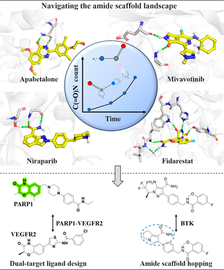

## 背景

### 酰胺基团的双重身份：最常见却最被忽视

酰胺基团在药物化学中占据着矛盾的地位：一方面，它是**药物化学中最普遍存在的结构单元之一**，另一方面，其在骨架层面的组织结构和系统意义却几乎从未被深入探索。这种矛盾源于一个根本性的方法论困境：传统的骨架分解方法（如Bemis-Murcko）在面对酰胺基团时会产生严重的结构“噪声”。

问题的核心在于酰胺基团的**双向连接特性**。当酰胺作为环的一部分时（如内酰胺），它是骨架核心；当作为侧链连接基团时，它又变成了“可去除”的连接桥。这种双重身份导致传统分解方法产生大量**实际上等价但形式上不同**的骨架表示，严重干扰了后续的化学空间分析。

### 传统骨架分解的局限性

传统的Bemis-Murcko骨架分解方法在面对含酰胺化合物时会遇到三个关键问题：

- **表示爆炸**：同一分子可能因为去除不同的侧链而得到多个“不同”的骨架表示
- **出口向量丢失**：传统方法关注骨架环系统，却忽略了取代位点的空间方向信息，而这正是药物设计中关键的“药效团”信息
- **化学意义模糊**：分解得到的骨架往往与药物化学家的直观理解不符，难以直接指导设计

这些局限使得基于传统骨架的化学空间分析在面对含酰胺化合物时，既**不能准确反映骨架的真实分布**，也**不能有效指导实际的药物设计工作**。

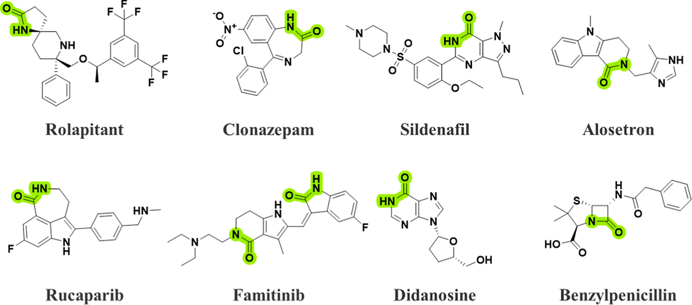

**图1：含C(=O)N基团的环状药物**。展示了包含环状C(=O)N基团的代表性临床阶段药物，涵盖多个治疗领域。绿色高亮显示环中的C(=O)N官能团。

### 为什么需要骨架层面的酰胺图谱

在药物发现实践中，骨架选择往往是决定项目成败的关键一步。一个好的骨架能够：

- **提供合适的出口向量**：让药效团在三维空间中正确定位
- **具备多靶点潜力**：通过骨架共享实现多靶点活性
- **支持化学修饰**：在保持核心性质的同时允许结构优化
- **具备成药性**：满足溶解度、代谢稳定性等ADME性质要求

对于含酰胺化合物而言，建立系统性的骨架图谱能够回答这些实际问题：哪些骨架最为普遍？哪些骨架具备多靶点潜力？如何在保持核心结合模式的同时实现骨架跃迁？

### 关键科学问题

1. 如何统一表示含酰胺骨架：克服传统分解方法的噪声问题，建立与药物化学直觉一致的骨架定义
2. 如何系统分析酰胺骨架空间：从大规模数据集中提炼骨架分布规律和结构特征
3. 如何识别多靶点骨架：找出能够同时作用于多个靶标家族的“共享骨架”，支持多靶点药物设计
4. 如何指导骨架跃迁实践：将图谱分析结果转化为具体的设计策略，特别是针对多靶点和选择性优化的场景

### 创新点

本研究的主要创新包括：

- **方法论创新**：提出统一C(=O)N骨架定义，通过保留出口向量和整合变异性，克服了传统骨架分解的结构噪声问题
- **数据规模创新**：从290万个化合物中系统提取1.7万个不同的酰胺骨架，构建了迄今最大规模的含酰胺化学空间图谱
- **应用策略创新**：提出scaffold-merging策略，为双靶点药物设计提供了比传统药效团连接更高效的替代方案
- **实用资源创新**：公开了完整C(=O)N骨架数据集和KNIME工作流，支持药物化学家进行骨架跃迁和生物等排替换

## 研究内容

### 核心创新：统一C(=O)N骨架定义

本研究的关键创新在于提出了统一C(=O)N骨架定义。**核心思想**是将酰胺基团从可变侧链中“提升”为骨架核心的一部分，从而克服传统分解方法的结构噪声问题。

**传统方法的困境**：传统骨架分解方法在面对含酰胺化合物时，会因为不同的取代模式而产生大量“实际上相似但形式上不同”的骨架表示。例如，具有相似取代模式的分子可能被分类为四个不同的实体（A）和三个不同的实体（B）。这种“人为的骨架计数膨胀”产生了严重的结构噪声。

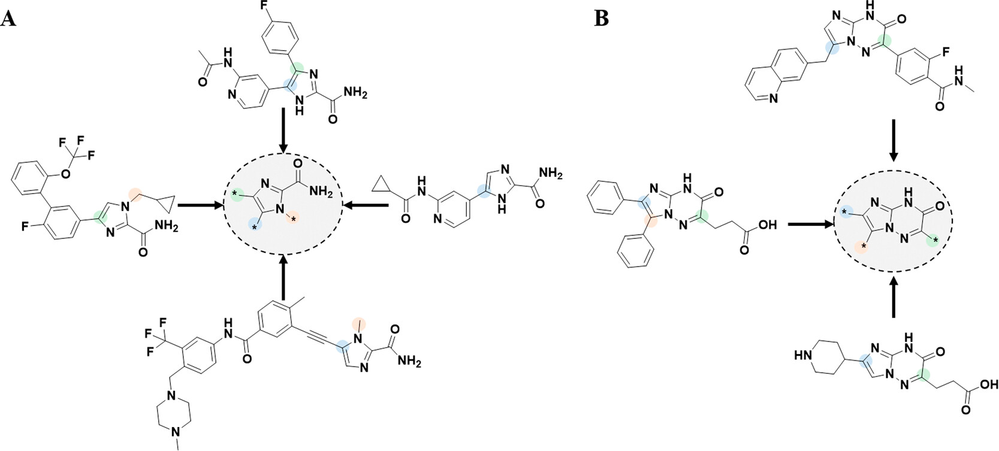

**图2：统一C(=O)N骨架提取策略**。展示了A、B两组代表性化合物。A组包含4个分子共享相同环状核心但取代模式不同；B组包含3个分子同样共享核心环但取代模式不同。

> **通俗理解：房子的装修与核心结构**
>
> 想象你在设计房子。传统方法就像记录“带蓝色窗帘的房子”和“带红色窗帘的房子”时，把它们当成两种不同的房子。但统一C(=O)N定义的思路是：**窗帘只是装修，核心结构才是房子**。
>
> 具体到分子世界，想象一个含酰胺的六元环骨架：
> - **生长向量**：环上某些位置可以“长出”不同的取代基，这些可生长的位置就是“生长向量”
> - **虚拟原子（*）**：在去除侧链时留下的“标记”，告诉我们这里曾经连接过什么，以及连接的方向
> - **统一表示**：不管你在这些生长点上接了什么基团，只要核心骨架相同，就归为同一个“统一骨架”
>

#### 实现方法详解

1. **化合物切割与片段化**：对每个化合物，**切割所有环外单键**，但**保留直接连接到环系统的伯酰胺**（$\ce{-C(=O)NH2}$）。具体来说：

   - **环内酰胺（内酰胺）**：酰胺基在环内，整个环都保留
   - **环外伯酰胺**：$\ce{-C(=O)NH2}$直接连在环上，酰胺键本身保留，但-$\ce{NH2}$外的其他侧链被切割
   - **环外仲酰胺、叔酰胺**：常作为柔性连接桥，会被切割掉，因为它们会人为夸大骨架多样性

   得到的片段经过过滤，只保留至少含有一个环的片段（环数≥1）。
2. **C(=O)N功能基团识别**：在含环片段中**明确搜索酰胺功能基团**，只保留含有酰胺结构单元的片段作为C(=O)N骨架，系统识别三类结构：

   - **Ring-linked primary amides**（环连伯酰胺）：酰胺基直接连在环上，常作为末端极性锚点
   - **Lactams**（内酰胺）：酰胺基在脂肪环内，如吡咯烷酮、哌啶酮
   - **Conjugated cyclic C(=O)N systems**（共轭环状C(=O)N系统）：融入芳香或杂芳环系统
3. **排除相关基团**：为确保**结构均一性**，排除相关功能基团如imides（$\ce{R-C(=O)-N(-R')-C(=O)-R''}$）、ureas（$\ce{R-NH-C(=O)-NH-R'}$）和carbamates（$\ce{R-NH-C(=O)-O-R'}$）。这些基团化学性质与典型酰胺不同（只能单个酰胺键是吧？）。
4. **得到名义C(=O)N骨架**：经过上述步骤，从93,061个化合物中得到**8609个名义C(=O)N骨架**。不是传统骨架，否则图2分子外面那些苯环什么的可能也算，就不能归到同一个骨架了。
5. **统一骨架定义**：将所有探索的生长向量映射到单个父骨架，在切割位点保留虚拟原子（*），同一核心骨架不管取代模式如何都归为一个统一骨架。
6. **结果验证**：从8609个压缩为3991个，**减少53.6%冗余**，有效消除“人为的骨架计数膨胀”。

### 数据集构建：从290万化合物到1.7万骨架

本研究有两层数据来源。第一层是**高置信度生物活性数据**，用于靶标分析和药理学图谱；第二层是**完整ChEMBL化学空间**，用于全局骨架数量和时间趋势分析。

**高置信度活性数据**：来自ChEMBL 36。作者先保留人源单蛋白靶标、BAO single protein format，并只使用$K_i$、$K_d$、$IC_{50}$这三类定量活性；带有“>”或“∼”等近似限定符的记录被排除，只保留精确“=”记录。

- **活性阈值设定**：化合物活性需优于10 μM；同一化合物-靶标有多条记录时，保留最大效力值作为最终注释。
- **结构标准化**：使用canSARchem流程进行盐和小组分去除、互变异构归一化和电荷中和。
- **靶标标准化**：蛋白靶标映射到UniProt ID，再按UniProt family classification归入蛋白家族。

高置信度部分最终包含**432,383个不重复生物活性化合物**、**3843个蛋白靶标**和**635,282条活性注释**。经RDKit片段化后，研究在**93,061个化合物**中识别出C(=O)N相关骨架，说明约**21.5**%的高置信度活性化合物至少包含一个C(=O)N骨架。

另一层全局分析不再局限于活性注释，而是扩展到完整ChEMBL库。本文摘要称从近290万个化合物数据集中提炼出**17,769个化学上不同的统一C(=O)N骨架**。所以，3991对应“高置信度生物活性子集”，17,769对应“更完整的ChEMBL化学空间”。

### 结构特征：紧凑、环主导、三维平衡

对高置信度生物活性子集中的3991个统一C(=O)N骨架，作者进一步做了电子和物理化学描述符分析，揭示了三个关键特征：

- 紧凑性和环主导：大多数酰胺骨架都是**以环系统为核心的紧凑结构**。这反映了药物化学的一个基本现实：为了获得足够的结合亲和力和选择性，化合物需要提供明确的“结合框架”，而环系统正是提供这种框架的最佳结构形式。
- 芳香性平衡：酰胺骨架显示出**平衡的芳香性分布**，既不是过度芳香化（可能导致溶解度和代谢问题），也不是过度脂肪化（可能缺乏足够的结合力）。这种平衡反映了天然产物和药物分子的优化结果：**结合力与成药性的最佳平衡点**。
- 三维特性：与传统认知不同，酰胺骨架并非都是“平面的”。相当一部分骨架表现出**适度的三维特性**，这来自于饱和环系统的引入和非平面取代模式。这种三维特性为**选择性和药效团空间布局**提供了结构基础。

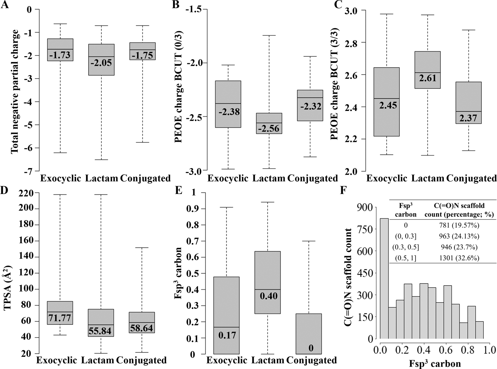

**图3：精选C(=O)N骨架库的电子和物理化学性质空间定量分析**。面板（A−E）显示了关键分子描述符的分布，包括总负偏电荷、BCUT_PEOE_0、BCUT_PEOE_3（BCUT类型的PEOE偏电荷描述符：邻接和距离矩阵）、拓扑极性表面积（TPSA）和sp3杂化碳的分数（Fsp3）。在这些箱线图中，内部水平线标记中位数（标有数值）。面板（F）通过骨架尺寸（环数）和芳香性类别补充了这些分析。

### 靶标分布：激酶主导的多靶标富集

> 靶标分析揭示了酰胺骨架在药理学空间中的强烈偏好。通过分析前30个靶标（每个靶标至少与80个不同的C(=O)N骨架相关），研究发现激酶占主导地位，构成前30个靶标的50%（15个），其次是肽酶（5个靶标）和组蛋白去乙酰化酶（4个靶标）。

- **激酶**：这是酰胺骨架最为富集的靶标家族，在前30个靶标中占15个。BTK表现出最高的酰胺结构多样性，具有168个不同的C(=O)N骨架。酰胺基团在激酶抑制剂中扮演着多重角色，既可以作为铰链区的氢键结合单元，也可以作为溶剂暴露区域的极性锚定基团
- **肽酶和蛋白酶**：包括丝氨酸蛋白酶、半胱氨酸蛋白酶、蛋白酶体等，在前30个靶标中占5个。在蛋白酶抑制剂中，酰胺骨架往往直接参与活性位点的识别和结合
- **表观遗传调控器**：包括组蛋白去乙酰化酶（HDAC）、DNA甲基转移酶、溴结构域蛋白等。酰胺骨架在这些靶标中的富集反映了表观遗传药物需要精确的空间定位和特定的氢键网络

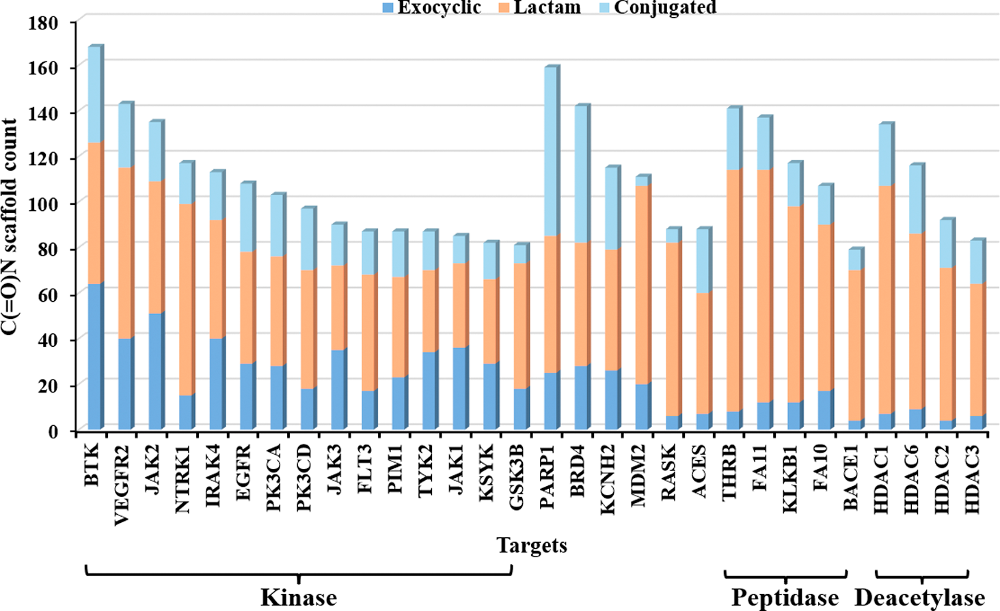

**图4：C(=O)N骨架在高代表性靶标中的分布**。展示了具有最大C(=O)N骨架数量的前30个蛋白靶标。BTK（布鲁顿酪氨酸激酶）表现出最高的酰胺结构多样性，具有168个不同的C(=O)N骨架。图中不同颜色代表不同的靶标家族。

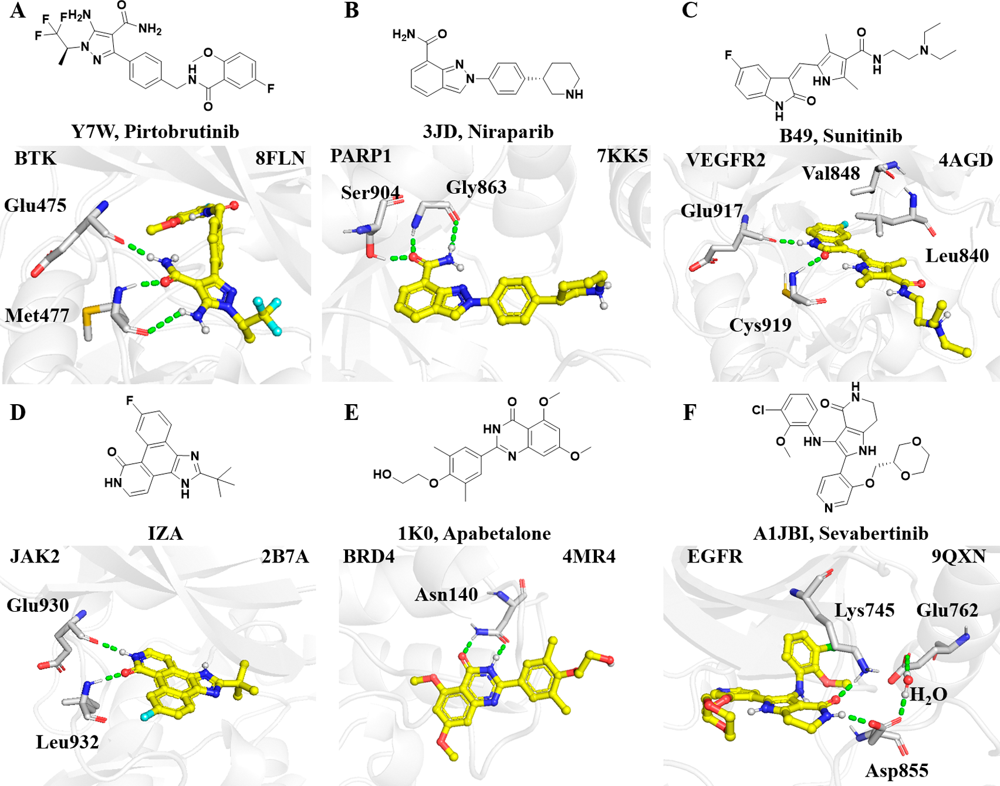

**图5：实验蛋白-配体复合物中C(=O)N骨架介导识别的结构基础**。代表性共晶结构展示了C(=O)N骨架如何在不同靶标类别中贡献结合亲和力。配体碳原子和关键口袋残基分别用黄色和灰色表示，绿色虚线表示关键极性相互作用，主要是氢键。图中覆盖激酶（A、C、D、F）、转移酶（B）和表观遗传调控器（E）。

> 这张图把统计图谱拉回到真实结构：酰胺不是只在数据库里频繁出现，而是常常以氢键锚点、构象约束或连接方向控制单元的形式，直接参与蛋白口袋识别。

### 多靶点骨架：跨家族活性的结构基础

本研究最有价值的发现之一是识别出一批表现出**显著跨家族多靶向性**的酰胺骨架。这些骨架能够同时作用于多个不同靶标家族，为多靶点药物设计提供了**结构共享的基础**。

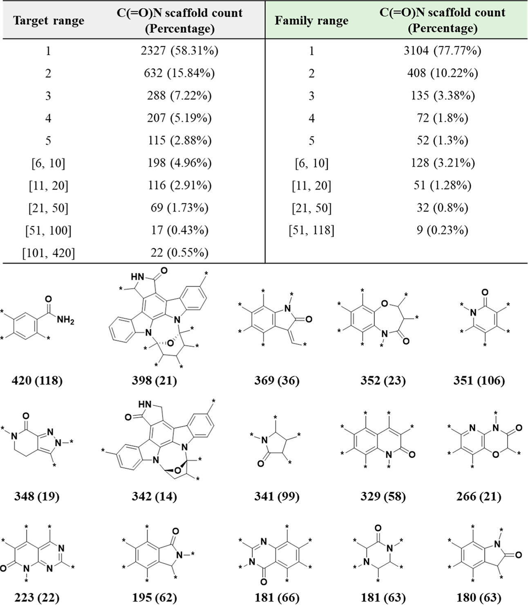

**图6：C(=O)N骨架的靶标和家族覆盖度**。上面：C(=O)N骨架在个别靶标（左上）和靶标家族（右上）的普适性分析。下面：15个最频繁在不同靶标中观察到的C(=O)N骨架。对于每个骨架，相关靶标的数量显示在化学结构下方，括号中指示相应的靶标家族数量。

**多靶点骨架的结构特征**：

- **适度的尺寸**：大多数多靶点骨架都是中等大小（2-3个环系统），既提供了足够的结合表面积，又不至于过大而导致成药性问题
- **平衡的极性**：酰胺基团提供了**恰到好处的极性和氢键能力**，能够适应不同靶标的结合环境
- **柔性的出口向量**：这些骨架的取代位点通常允许**多种药效团连接方式**，支持针对不同靶标的结构优化

研究深入分析了几个表现出跨家族活性的骨架。在VEGFR2-PARP1双靶点案例中，识别出`benzo[b][1,4]oxazin-3(4H)-ones`和`2H-indazole-7-carboxamides`作为共享骨架。这些骨架的优势在于：它们提供了理想的低分子量起点，能够同时满足两个靶标的结合要求，具有良好的药物样性质。

> 小编锐评：有没有可能只是激酶类药物数据更多？能不能做归一化？另外，是否也应该分析无活性分子？有些骨架可能同时出现在有活性和无活性的分子中，差异也许来自侧链，但这样简单地衡量“该骨架适合该靶点”不太精确。

### 骨架流行度和特权性：区分“常见”与“真正富集”

仅看出现频率会把常用合成砌块误认为特权骨架。为此，作者用富集因子（Enrichment Factor，EF）分析区分“合成流行度”和“生物学特权性”：EF定义为某骨架在特定靶标活性集中的频率，相对于其在整个高置信度ChEMBL数据集中的背景频率。

为保证统计可靠性，3991个骨架进一步筛选为**至少关联10个化合物、且至少出现在两个独立ChEMBL文档中的664个骨架**。

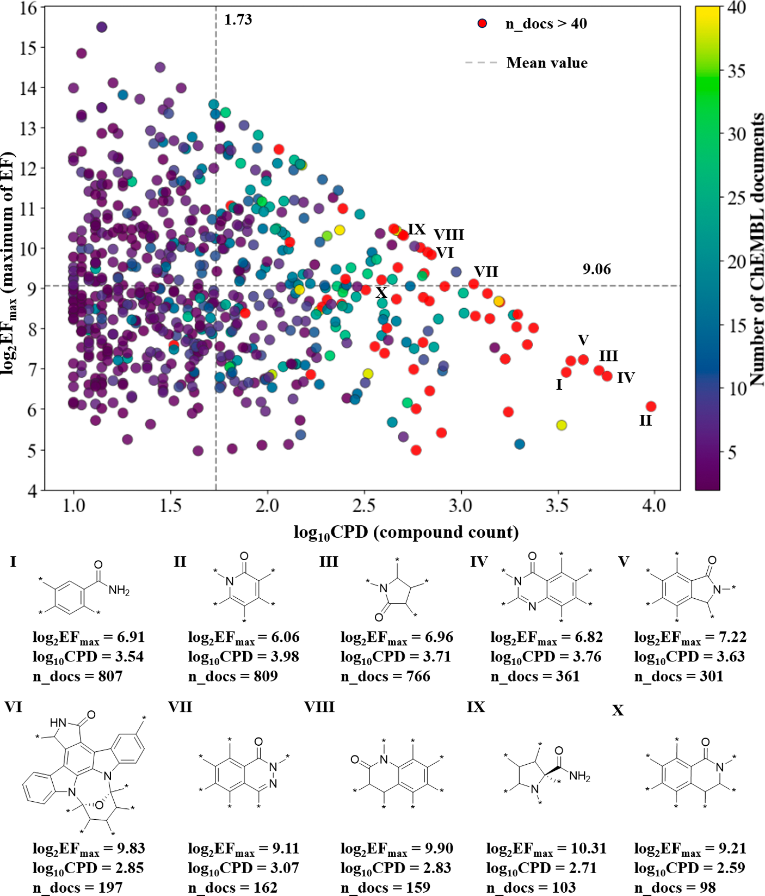

**图7：C(=O)N骨架在化学空间中的流行度与特权性关系**。横轴是流行度，即总化合物数的$\log_{10}$缩放；纵轴是特权性，即最大富集因子EFmax的$\log_2$缩放。颜色表示关联ChEMBL文档数量，红色高亮表示证据较强的骨架（n_docs ≥40）。虚线将空间分成四个功能象限：低右象限是高化合物数但低富集的“流行度陷阱”，高左和高右象限则包含更具靶标特异性的特权骨架。

### Scaffold-Merging：双靶点设计的新策略

基于对跨家族骨架的系统识别，研究提出了“scaffold-merging”策略作为双靶点药物设计的新方法。这一策略的核心思想是：与其通过连接两个独立药效团来实现双靶点活性（传统方法），不如直接使用**已经被多个靶标验证过的共享骨架**作为起点。

**Scaffold-Merging与传统药效团连接**：传统双靶点设计往往采用“药效团连接”策略：设计一个分子包含两个独立药效团，通过柔性连接桥分别作用于两个靶标。这种方法的缺点在于：**分子量大、合成复杂、且两个药效团可能相互干扰**。

> Scaffold-Merging策略的核心优势：从共享骨架出发，**天然保证了两个靶标的结合兼容性**。当两个靶标都“接受”同一个骨架时，说明这个骨架已经满足了两者的基本几何和化学要求，后续的修饰只需要**微调选择性**即可。

#### **VEGFR2−PARP1双靶点案例**

研究详细分析了VEGFR2（血管内皮生长因子受体）和PARP1（聚ADP核糖聚合酶）的双靶点设计。通过靶标图谱分析，作者识别出几个在两个靶标中都存在的共享酰胺骨架，并用已有活性化合物说明这些骨架如何作为双靶点设计的紧凑起点。

重要的是，本文强调的不是简单“拼凑”两个药效团，而是从**单个共享骨架的多靶点潜力**出发。这样的起点通常更紧凑，也更容易维持药物样性质。

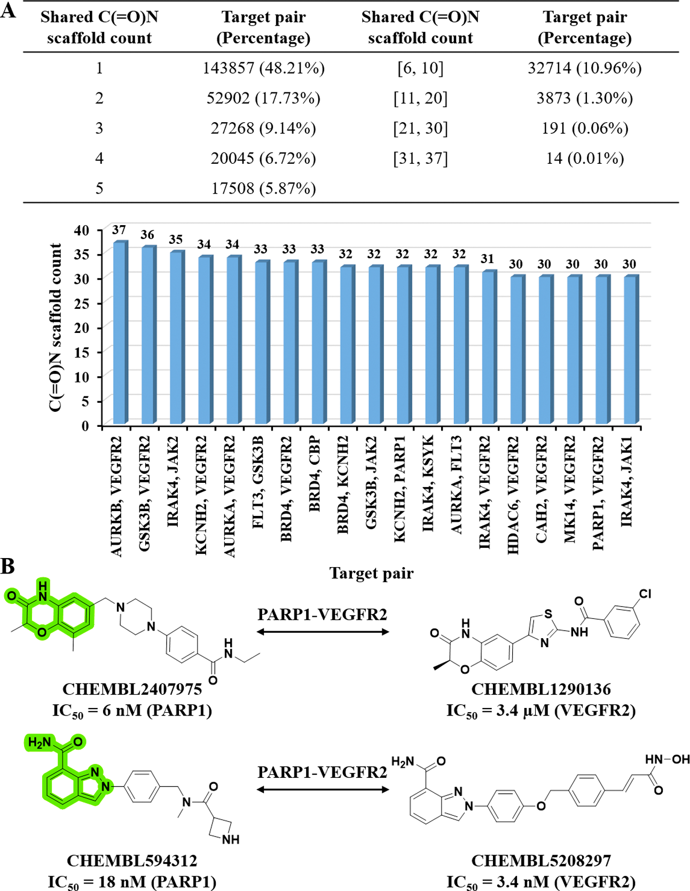

**图8：共享C(=O)N骨架和双靶点设计启示**。（A）共享C(=O)N骨架化学空间的统计概况。上面板说明统一C(=O)N骨架在靶标对之间共享的分布频率，下面板识别共享30个不同C(=O)N骨架的高连接性靶标对。（B）PARP1-VEGFR2双抑制剂的理性设计案例。绿色高亮显示共享C(=O)N骨架，每个活性化合物均给出ChEMBL ID和报道效力。

### 骨架跃迁案例：BTK抑制剂的优化路径

为了验证该图谱的实用性，研究进行了**BTK（布鲁顿酪氨酸激酶）抑制剂的骨架跃迁案例研究**。BTK是治疗血液肿瘤的重要靶标，研究选择pirtobrutinib作为参考化合物，这是首个获批的非共价BTK抑制剂。

- **骨架跃迁策略**：研究系统性地替换pirtobrutinib中的5-氨基吡唑-4-甲酰胺部分，用图谱中的C(=O)N骨架进行替换，随后通过分子对接进行优先排序。
- **筛选与验证**：本文流程从17,769个C(=O)N骨架出发，先排除已知BTK抑制剂中的骨架，再保留至少含有一个芳香原子的骨架，得到**10,990个独特骨架**。这些骨架替换pirtobrutinib中的5-aminopyrazole-4-carboxamide片段，并枚举多生长向量产生的区域异构体，得到32,843个虚拟化合物；按分子量不超过500 Da过滤后，留下**13,494个化合物**用于对接。

以pirtobrutinib晶体姿态为参照，其对接评分为$-10.7\ \mathrm{kcal/mol}$。共有**268个化合物**获得更优对接评分，作者随后通过人工检查关键铰链残基Met477和Glu475的氢键保留情况，选出6个代表性化合物。需要注意，本文明确提醒：**对接分数只是优先排序指标，不能证明真实生化活性**。

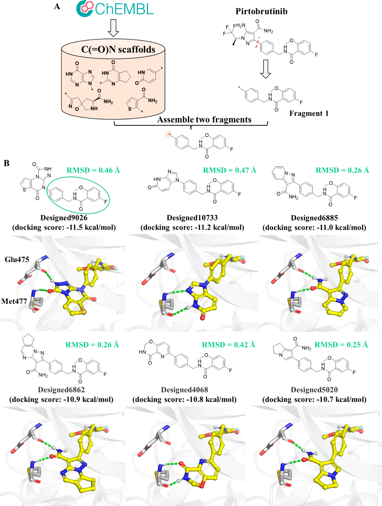

**图11：BTK非共价抑制剂设计中的C(=O)N骨架跃迁**。（A）将pirtobrutinib的5-aminopyrazole-4-carboxamide部分系统性替换为ChEMBL 36中的C(=O)N骨架，生成13,494个独特化合物并用于对接优先排序。（B）六个代表性候选物的对接姿态。配体碳原子和关键结合口袋残基分别用黄色和灰色显示，绿色虚线表示关键极性相互作用，主要是氢键。所有候选物的Fragment 1相对pirtobrutinib晶体构象的RMSD均小于0.5 Å。

### 时间趋势分析：15年进化轨迹

为了理解酰胺骨架的演化规律，研究进行了**15年时间趋势分析**，采样了大约5年间隔的ChEMBL数据库版本（版本3、20、27、36）。分析揭示了重要趋势：

- **持续增长**：C(=O)N骨架集经历了稳定和持续的增长，过去15年中所有C(=O)N类别的骨架数量都翻了三倍，反映了其持久的化学多功能性
- **加速多样化**：骨架的多样性和复杂度不断增加，从简单的单环系统发展到复杂的多环和桥环系统

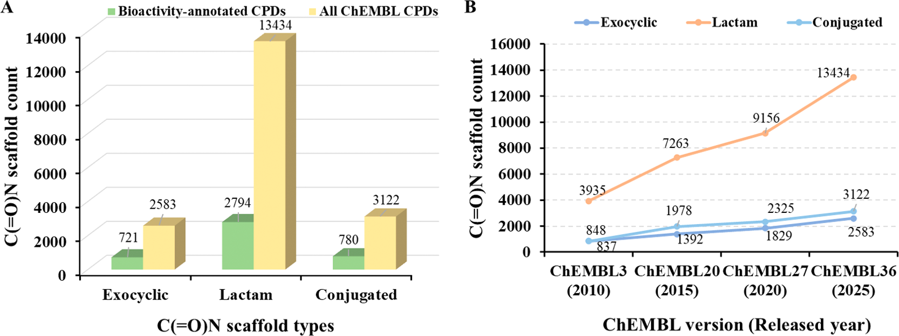

**图10：过去15年C(=O)N骨架的全球分布和时间增长**。（A）从完整数据集和高置信度生物活性数据得出的C(=O)N骨架统计对比。（B）散点图展示过去15年药物化学中探索的C(=O)N骨架扩展，以约5年间隔分析。ChEMBL版本3、20、27和36被纳入分析。注意，一个骨架可能属于多个类别，因此可以在多个类别中重复出现。

全局分析识别出**17,769个统一C(=O)N骨架**，比高置信度活性子集多4倍以上。其中lactams有13,434个，conjugated amides有3122个。时间序列显示，自2010年4月ChEMBL3以来，exocyclic C(=O)N骨架从837增加到2583；lactams从3935增加到13,434；conjugated amides从848增加到3122。

### 临床候选和药物中的C(=O)N骨架

为了评估转化潜力，作者还把数据集与ChEMBL中的已批准药物和临床阶段候选物交叉比对，识别出**535个独特C(=O)N骨架**，分布在**1531个药物或临床相关化合物**中。

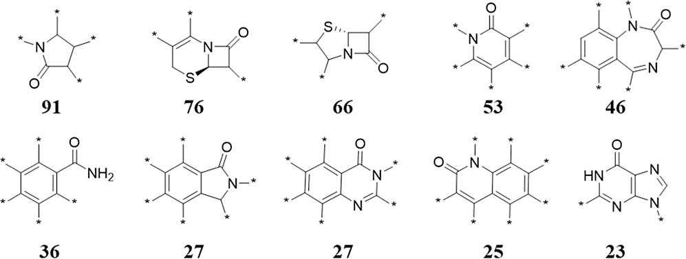

**图9：药物或临床候选化合物中C(=O)N骨架的分布**。展示已批准或临床阶段化合物中最频繁出现的10个C(=O)N骨架，每个骨架下方显示相关药物或药物相关化合物数量。Pyrrolidin-2-one是最常见的药物相关骨架之一，例如nirmatrelvir；β-lactam cephalosporins如ceftazidime也非常突出。

## 关键结论与批判性总结

### 主要影响

- **提供了系统性的骨架选择工具**：药物化学家在启动新项目时，可以查询该图谱了解特定靶标家族中哪些骨架已被“验证”，哪些骨架具有多靶点潜力
- **为多靶点药物设计提供了新思路**：scaffold-merging策略相比传统药效团连接更加高效，有潜力成为多靶点药物设计的标准方法
- **实现了骨架跃迁的结构化指导**：图谱不仅提供候选骨架列表，还给出了每个骨架的靶标分布和结构特征，支持理性设计决策

### 局限性

- **数据来源限制**：基于ChEMBL数据库，可能遗漏了**专利数据和内部数据**，导致骨架分布不够全面
- **活性数据不平衡**：激酶和表观遗传调控器的数据远多于其他靶标家族，可能导致富集分析的偏差
- **计算简化**：统一C(=O)N定义虽然解决了传统方法的噪声问题，但仍可能**遗漏一些复杂的化学情况**（如互变异构、动态构象变化）

### 未来方向

- **扩展到其他官能团骨架**：建立脲基、硫脲、酯基等其他常见药物motif的系统图谱
- **整合更丰富的数据源**：纳入专利数据库、内部筛选数据，构建更全面的骨架图谱
- **开发AI驱动的骨架推荐**：基于图谱数据训练机器学习模型，实现针对特定靶标的骨架预测和推荐
- **实验验证共享骨架**：对识别出的多靶点骨架进行系统的实验验证，确认其跨家族活性的普适性

总体而言，这项工作为**理性骨架优先级排序和生物等排替换**提供了定量基础，强调了C(=O)N骨架在药物发现中的结构多功能性和实用性。它不仅是学术研究，更是**药物化学家的实用工具**。
