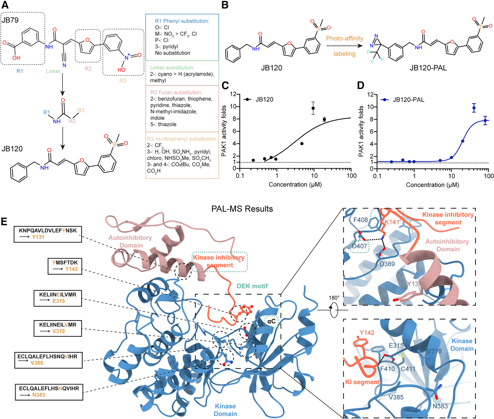
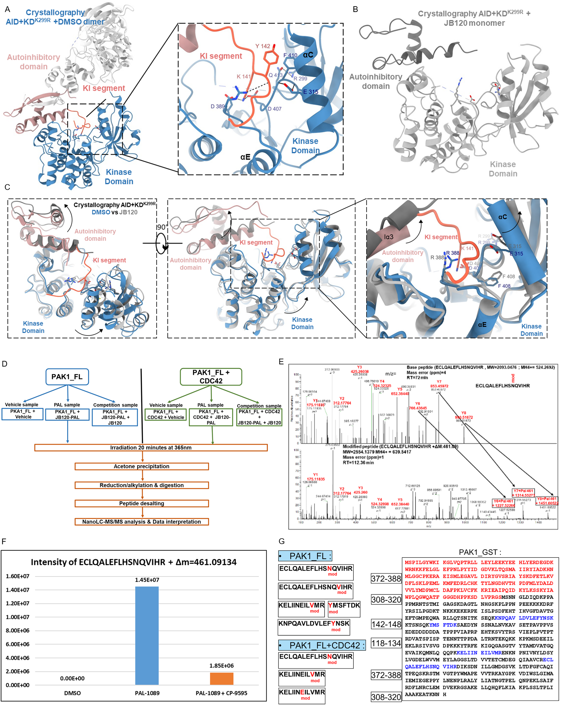
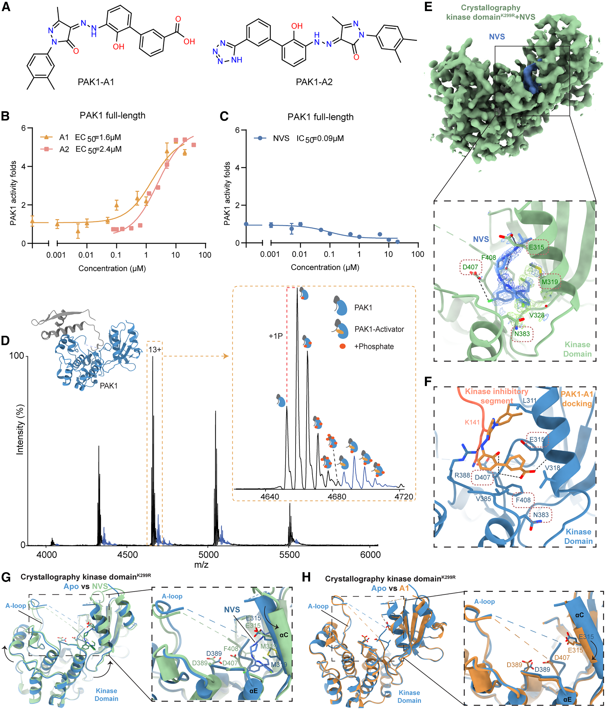
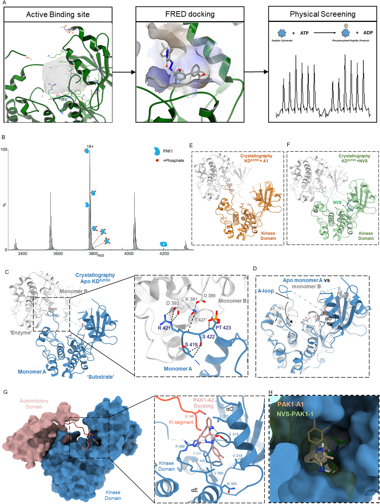
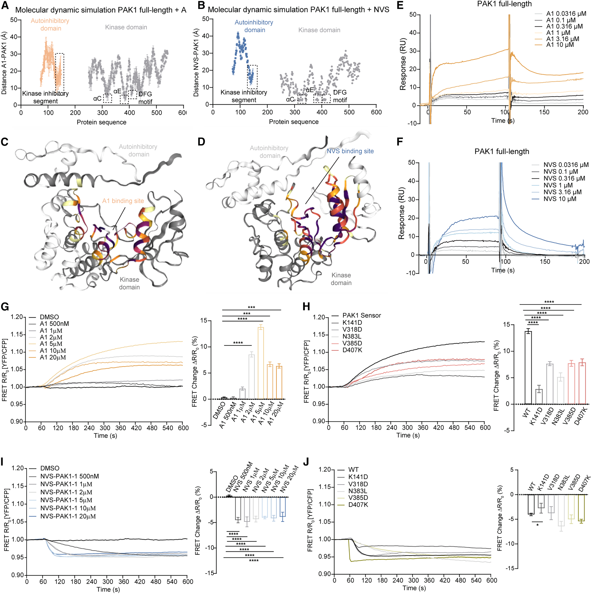
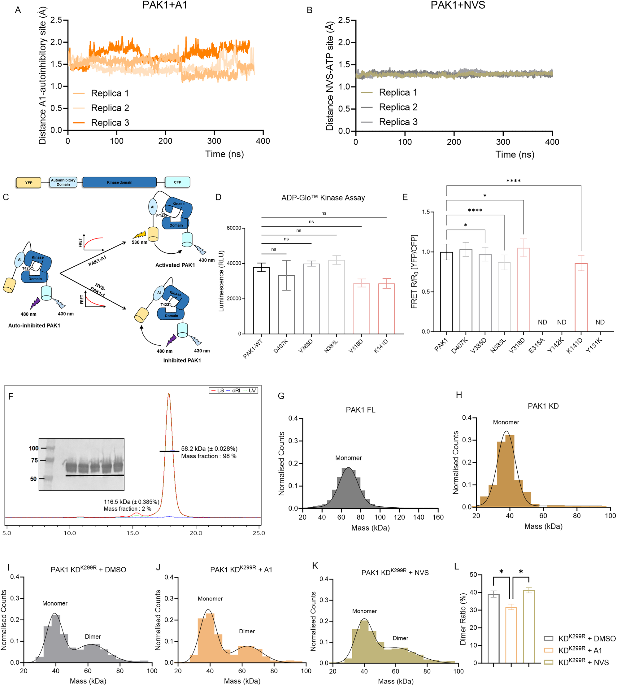
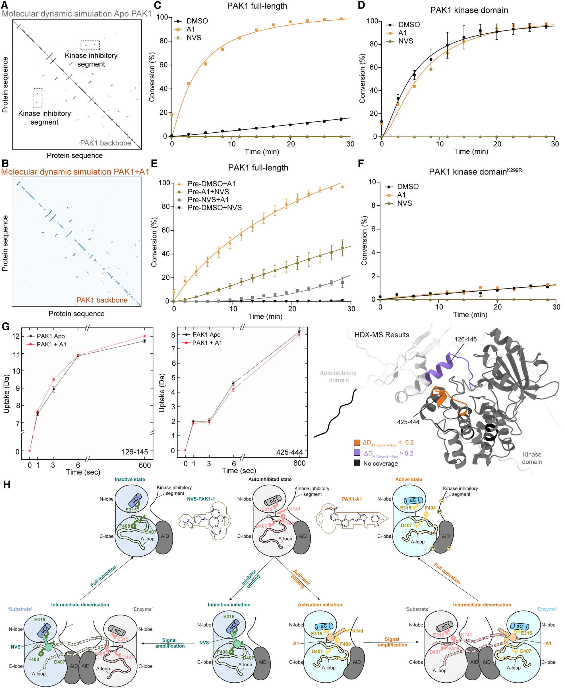

## 本文信息

- **标题**：治疗性PAK1变构激活剂的理性发现
- **作者**：He, Y.； Bae, J.S.H.; Nowak, E.; ...; Kukura, P.; Schofield, C.J.； Lei， M.（通讯）
- **发表期刊**：Cell
- 发表时间：2026年5月28日
- 卷期页码：Volume 189, Pages 3444-3464
- DOI：[https://doi.org/10.1016/j.cell.2026.03.008](https://doi.org/10.1016/j.cell.2026.03.008)
- 单位：英国牛津大学药理学系、英国牛津大学化学系、英国牛津大学结构基因组学联盟、德国法兰克福歌德大学药物化学研究所等
- 引用格式：He， Y., Bae, J.S.H., Nowak, E., ... Lei, M.（2026）。Rational discovery of therapeutic PAK1 allosteric activators. *Cell*, *189*, 3444-3464. [https://doi.org/10.1016/j.cell.2026.03.008](https://doi.org/10.1016/j.cell.2026.03.008)

更多内容详见上篇。

## 研究内容

### 结果2：JB系列化合物作为首批小苗头

#### SAR优化

**承接问题**：JB79的活性（EC50约3.63 μM，约3倍激活）和选择性已经证明了概念，但能否通过结构-活性关系（SAR）优化得到更强的小分子？

- **SAR策略**：如图2A，将JB79分解为三个关键药效团进行系统优化——**R1**（m-carboxyphenyl，间位羧基苯基）、**R3**（m-aniline，间位苯胺）、以及连接这两个基团的**linker**
- **合成规模**：共合成**63个类似物**，其中21个能激活PAK1，**JB120活性最强**（EC50约5 μM，Cdc42存在下约10倍激活）
- **关键发现**：
  - **R1基团优化**：para位有强吸电子基团（如羧基）时激活效果最强；羧基比酯基（COOR）激活效果更好
  - **R3基团优化**：硝基不是关键，但考虑到毒性可以替换；卤素取代显示ortho和para位比meta位更有利
  - **Linker优化**：延长一个亚甲基（methylene）可增强激活效果
  - **核心基团替换**：测试了5种不同的核心基团（R2，acrylonitrile核心）来替代，同时保持类似的药效性质

> **小编锐评**：从最终结果看，JB120及JB系列这些SAR优化出来的分子其实**都没被用在后续的药物开发中**——真正被用于体内实验和治疗的是PAK1-A1，这是从完全不同的虚拟筛选路线得到的。**如果只是概念验证，是否有必要投入这么大精力做SAR优化**？如果是纯药物发现项目，这种“费了半天劲最后不用这些分子”的SAR优化可能不太划算，小编只能认为是JB79在下一步实验效果不太好，虽然作者没说。

##### PAL-MS实验流程详解

**PAL、PAL-MS是什么**：PAL = Photo-Affinity Labeling（光亲和标记），核心是在小分子上装一个光敏基团（本文用的是diazirine），紫外光照射下它会变成高活性卡宾，能和相邻的几乎任何氨基酸形成共价键，把小分子“焊死”在蛋白上。

物理上diazirine能碰到的潜在交联残基其实相当多，所以PAL-MS报告的“关键残基”（如本文的Tyr131、Tyr142、Glu315等）**不是“所有diazirine碰到的残基”**——而是**经过两个过滤器筛出来的**：①质谱定量显示**高度富集**（修饰肽段信号强）；②加入过量未标记的母体化合物JB120竞争后，**信号显著降低**。满足这两个条件的位点才是**特异性的配体结合位点**，其余随机交联的位点会被滤掉。

1. **探针合成**：基于SAR结果合成多个PAL探针，如图2B所示
2. **探针验证**：用RapidFire-MS激酶活性实验确保引入光激活基团后分子的结合亲和力和功能没有显著改变
3. **结合反应**：全长PAK1（0.5 μM）与JB120-PAL和DMSO对照预孵育3小时
4. **竞争实验**：同时加入过量的母体化合物JB120作为竞争物——这一步是关键！只有当JB120-PAL的修饰信号在加入竞争物后显著降低，才能确认这些残基是**特异性的配体结合位点**，而不是随机共价交联的假阳性
5. **UV交联**：365 nm紫外照射20分钟，diazirine基团活化为高活性卡宾，与周围氨基酸共价结合
6. **蛋白质组学分析**：丙酮沉淀蛋白、酶切肽段、NanoLC-MS/MS分析、MaxQuant软件处理
7. **质谱解读**：检测带有ΔM质量位移（461.09 kDa，对应JB120-PAL）的修饰肽段；定量蛋白质组学分析揭示4个修饰肽段、5个特定残基高度富集；加入JB120竞争后这些修饰肽段丰度显著降低，证实是特异性结合位点而非随机共价交联

##### 结果

**图2：PAL-MS识别JB120结合PAK1的关键残基——从SAR优化到PAL探针设计，精确定位DEK位点**

- **图2A：SAR优化过程**。为了定义JB79化学结构与生物活性的关系，作者进行了结构-活性关系（SAR）分析。SAR识别出三个关键基团：**R1**（m-carboxyphenyl）、**R2**（furan）、**R3**（m-nitrophenyl），以及连接这些基团的linker。将这三个基团用各种化学修饰替换，共合成**63个类似物，其中21个能激活PAK1，JB120活性最强**。
- **图2B：PAL探针设计**。基于SAR研究的新见解，设计了JB120的PAL探针JB120-PAL，在JB120的**para位标记diazirine基团**，从而定位小分子的真实结合区域。作者还合成了JB120-PAL-2（在**meta位**标记diazirine）和JB120-PAL-3，并在RapidFire-MS激酶活性实验中验证了这些探针的结合亲和力和功能没有显著改变
- **图2C-D：探针功能验证**。JB120和JB120-PAL仍能激活PAK1，说明引入光交联基团后分子功能没有完全坏掉，是合格的PAL探针
- **图2E：PAL-MS定位DEK位点**。PAL-MS识别出的关键残基包括**Tyr131、Tyr142、Glu315、Asn383、Val318、Val385**，作者把它们命名的调控区域称为“**DEK motif**”（DFG-Glu315-KIS，组成见结果2开头）。PAL探针交联的**关键残基正好位于激酶结构域和自抑制结构域之间的界面**——这正是PAK1活性自抑制调控的地方

> **结果2的核心结论**：这些数据collectively支持了一个模型——**JB120通过干扰激酶抑制结构域来破坏自抑制调控，从而激活PAK1**。作者不仅找到了能激活PAK1的小分子JB79，还通过SAR和PAL-MS证明，这类小分子确实在围绕PAK1自抑制释放位点发挥作用，精确定位了DEK motif的关键残基。JB系列化合物作为有价值的化学工具，在识别和表征自抑制释放位点方面发挥了重要作用。

**补充图S2：PAL-MS识别PAK1激活剂结合的关键残基**

- **图S2A**：PAK1自抑制结构域与激酶结构域K299R复合物晶体结构概览（不对称二聚体）
- **图S2B**：JB120浸泡的PAK1 cis-autoinhibited晶体结构
- **图S2C**：DMSO对照（粉红色自抑制域+深蓝色激酶域）与JB120浸泡（灰色）的叠加重视图
- **图S2D**：PAL-MS实验流程示意图
- **图S2E**：代表性质谱图显示JB120-PAL结合肽段的质量位移
- **图S2F**：定量蛋白质组学分析ΔM质量位移（461.09 kDa），竞争实验后显著降低
- **图S2G**：质量位移肽段与PAK1序列比对，关键残基用红色标注

### 小编的Discussion：AlphaFold2预测与PAL-MS验证的逻辑问题

> 对比图1C和图2E，JB系列化合物对接的结合位点和PAL-MS鉴定的有明显差异！
>
> 理想的验证链条应该是：①复合物预测（结构解析或准确预测，包括具体残基）→②筛选苗头→③实验定位结合位点→④验证预测与实验一致。但本文有个关键缺口——**AlphaFold2预测的PAP结合位点具体包含哪些残基，原文从未列出**，方法部分只笼统说“at the PAP binding site, predicted by AlphaFold2”。
>
> 小编的猜测：**最自然的解释是AlphaFold2预测的位置偏了**（真实位点就是KIS天然结合在激酶结构域的位置，PAP设计初衷是模仿KIS理应落在类似位置），所以PAL-MS用JB120-PAL探针把位点纠正回来。

#### 原文明确说明的事实

- **PAL-MS用JB120-PAL探针识别出6个关键残基** Tyr131、Tyr142、Glu315、Asn383、Val318、Val385，正好位于激酶结构域和自抑制结构域之间的界面（图2E、S2G）。原文称这些残基定义了一个**包含DFG motif、αC螺旋Glu315和KIS的DEK motif**——即KIS天然结合与激酶结构域相互作用的区域
- **两波筛选用了不同位点**：第一波用AlphaFold2预测的PAP位点，第二波改用PAL-MS精炼位点（Make_Receptor基于PAL-MS残基定义）——**第二波位点经过实验精炼，原理上更可靠**
- **MD模拟预测PAK1-A1结合残基Lys141、Glu315、Arg388、Phe408**（DEK位点疏水相互作用），**与PAL-MS位点一致**——计算层面的内部自洽

#### 但故事线是否成立？（小编的判断）

- **第一波筛选用AlphaFold2预测位点可能有偏差**，但PAL-MS用JB120-PAL探针把位点纠正回真实KIS结合区域
- **第二波筛选用PAL-MS精炼后的正确位点找到PAK1-A1**，MD预测与PAL-MS一致、与抑制剂DFG位点部分重叠——计算层面内部自洽
- **MD模拟为PAK1-A1提供计算结构证据**：400 ns模拟预测PAK1-A1结合残基Lys141/Glu315/Arg388/Phe408与PAL-MS位点高度一致，证实同一组残基参与PAK1-A1结合
- **功能验证是真实的**：ISO心肌细胞、Ang II+TAC小鼠、Actc1 E99K遗传性HCM小鼠三种模型都显示PAK1-A1改善心脏肥厚，动物疗效已把PAK1-A1从“概念验证”推到“候选药物”层级
- **整体上成立**：筛选位点的小偏差不影响后续逻辑链，PAL-MS纠正后的第二波筛选+MD+HDX-MS+动物实验构成完整证据闭环

### 结果3：PAK1-A1 = Eltrombopag，老药新发现的惊喜

**承接问题**：SAR优化得到的JB120 EC50约5 μM（Cdc42存在下），活性和药代都还不够理想。既然PAL-MS已经精确定位了DEK位点，能否用这个精炼后的位点做新一轮虚拟筛选，得到更可成药的分子？

#### 基于PAL-MS精炼的第二次虚拟筛选（图3、图S3）

在PAL-MS精炼DEK位点后，本文进行了第二次虚拟筛选，这次筛选与结果2的首次筛选不同：

> **为什么要分两波筛选，不能直接用DrugBank？**
>
> 保守观点：理想情况是“直接拿激活分子→找位点→筛选类似物”，但第一波筛选前我们**既没有激活分子，也没有精确位点**。更关键的是，**激活剂的位点不能用抑制剂位点来推测**——激活和抑制是两种不同的构象调控机制，位点可能部分重叠但功能完全不同。这一重叠是PAL-MS实验后的**后验发现**（图2E显示激活剂与抑制剂共享部分残基），而非筛选前的预设。
>
> 第一波ZINC15的200万lead-like筛选承担了双重任务：①**概念验证**——证明“自抑制界面可被小分子占据”；②**位点精炼**——通过PAL-MS把AlphaFold2预测的粗糙位点变成精确的6个残基。这里背后的假设是：在新的质谱结果里鉴定出的关键残基处结合的配体是有成为激活剂的潜力的。作者未明确说JB系列效果不好，应该还可以，概念验证这个理由可能足够了。
>
> 激进观点：如上一篇Discussion中的猜测，第二次筛选才是正确的位点

- **筛选对象**：DrugBank的6,252个已上市/实验性药物（包括ZINC15的FDA-approved drugs 1,615个）
- **蛋白结构**：使用PDB 1F3M单体结构，但**移除了激酶抑制结构域**（aa 136-149）。原因是：KIS在自抑制状态下占据ATP活性位点，移除KIS可确保其不会阻挡新配体接近激酶结构域内的DEK变构位点
- **对接前是否补全1F3M缺失残基**：原文**未明确报告**。PDBFixer只在MD前处理里用过（mutate residues to canonical UniProt sequence + repair missing loops），对接时是否同样处理不清晰
- **位点生成**：使用OpenEye的Make_Receptor工具，基于PAL-MS识别的6个关键残基（Tyr131/Tyr142/Glu315/Asn383/Val318/Val385）生成精炼的活性结合位点
- **配体准备**：用Omega2（4.1.2.0版本，OpenEye）创建多构象结构数据库
- **对接软件**：FRED（OpenEye，OpenEye Scientific Software），**刚性对接**（rigid docking），不考虑蛋白质侧链柔性
- **打分函数**：Chemgauss4，使用默认参数
- **物理筛选**：选取排名前25的化合物进行RapidFire-MS体外激酶活性测试，得到5个苗头化合物

这次基于PAL-MS精炼位点的筛选成功发现了PAK1-A1（Eltrombopag）和PAK1-A2（TPO agonist 138）。

#### 体外激酶活性测试

**图3：PAK1-A1/PAK1-A2的发现、结合与初步构象证据**

- **图3A**：PAK1-A1（Eltrombopag）和PAK1-A2（TPO agonist 138）的化学结构
- **图3B**：PAK1-A1和PAK1-A2对PAK1活性的剂量效应曲线，说明二者都能直接增强PAK1活性
- **图3C**：NVS-PAK1-1作为PAK1变构抑制剂对照，显示同一类变构位点可以被“激活剂”和“抑制剂”以相反方式利用
- **图3D**：native MS显示PAK1-A1与全长PAK1直接结合，结合化学计量比为1:1
- **图3E**：NVS-PAK1-1与**PAK1激酶域K299R**的co-crystal结构（蓝色配体+绿色蛋白），显示其结合在**变构DFG-out位点**，涉及gatekeeper Met344、αC螺旋的Glu315、DFG motif的Asp407和Phe408四个关键残基
  - **为什么用K299R而非WT**：Lys299是激酶催化位点的关键残基，K299R（kinase-dead）突变让激酶**失活且构象稳定**——没有自磷酸化的动态变化，更容易形成规则晶体
  - **与图3H的对照**：同一组晶体条件下抑制剂能稳定结合、激活剂不能，这是构象柔性差异的间接证据
- **图3F**：分子对接预测的PAK1-A1结合模式，与DEK位点的Lys141、Glu315、Arg388、Phe408相互作用。图中KIS的位置是示意性的，显示其被PAK1-A1推开后的空间状态。**红色标注的残基是激活剂和抑制剂共有的结合位点残基**（Glu315、Asn383、Asp407、Phe408）——这是piano-finger-like机制的结构基础：**同一组残基，激活剂和抑制剂都能用**
- **图3G**：apo态（本文解析的K299R的晶体结构）与NVS-PAK1-1结合态的构象对比，抑制剂诱导**小叶旋转+αC螺旋外移+DFG motif 180°翻转**，稳定DFG-out无活性构象（“锁住”姿态）
- **图3H**：apo态与PAK1-A1浸泡实验的构象对比，**没检测到配体密度、也没明显构象变化**，激酶仍处于DFG-in状态，只有相对apo的微小αC螺旋位移。这个负面证据暗示PAK1-A1诱导的**开放、柔性构象不利于晶体堆积**——PAK1-A1的精确结合姿态因此只能依赖分子对接、native MS、FRET和MD模拟间接推断

> **小编锐评**：
>
> - **对接软件用的是rigid docking**（刚性对接），不考虑蛋白质侧链柔性，**初始受体结构用的是自抑制态吗**？activation loop都折进去了。反正非柔性对接还不能调整。
> - 理论上更稳妥的做法：用多种构象对接，或多构象ensemble docking，但本文未说明这么做。实际上还是很难凭空预测别构小分子会让激酶处于激活还是抑制态，AI可能区分不了这么精细的区别，只是记忆。
>
> 这种初始结构+刚性对接的组合，更适合作“可能结合姿态”和**后续MD模拟的起点**。结果4-5提供了部分正交证据来补偿对接可信度，能**初步支持“PAK1-A1作用于DEK位点”这个结论**。

**补充图S3：PAK1小分子激活剂的开发过程（图3补充）**

- **图S3A**：基于PAL-MS精炼位点的计算-物理筛选pipeline：Make Receptor生成口袋→FREDD对接ZINC15 FDA-approved库→RapidFire-MS活性验证
- **图S3B**：全长PAK1的native MS谱图，显示多达**5种磷酸化状态**（非磷酸化及1-5个磷酸化形式，质量60,471-61,193 Da）
- **图S3C**：PAK1激酶域K299R的不对称二聚体晶体结构概览和细节
- **图S3D**：两个K299R单体的叠加，单体B（灰色）的N叶相对单体A（蓝色）绕激酶长轴旋转约**20°**，activation loop构象差异显著
- **图S3E-F**：K299R浸泡PAK1-A1（E）和与NVS-PAK1-1共晶（F）的不对称二聚体结构
- **图S3G**：PAK1-A2与DEK位点的预测相互作用模式（粉色配体）
- **图S3H**：PAK1-A1（橙色）和NVS-PAK1-1（绿色）在重叠结合位点的细节对比，**红色标注的残基是两类配体共享的结合位点残基**（Glu315、Asn383、Asp407、Phe408），抑制剂结合位置更朝里

| 化合物    | 化学本质  | EC50/IC50  | 激活倍数    | 选择性  | 特殊性质    |
| -------------- | ------------------------------------- | -------------------------------------------------- | --------------------- | ------------------------------ | ---------------------------------- |
| **JB120** | JB79的SAR优化类似物 | EC50约5 μM（Cdc42存在下）| 约10倍（Cdc42存在下） | -  | 活性比JB79更强，用于PAL-MS探针设计 |
| **PAK1-A1**    | Eltrombopag（FDA已批准TPO受体激动剂） | $\mathrm{EC}_{50} = 1.6 \pm 0.23~\mu\mathrm{M}$    | 约3-5倍| 选择性激活PAK1，对PAK2/3无激活 | FDA已批准，人体安全性数据充分 |
| **PAK1-A2**    | TPO agonist 138| $\mathrm{EC}_{50} = 2.575 \pm 0.094~\mu\mathrm{M}$ | 约3倍  | 选择性激活PAK1，对PAK2/3无激活 | 溶解度≥50 mM，适合慢性口服给药|
| **NVS-PAK1-1** | 已知PAK1变构抑制剂（阴性对照）   | IC50 = 0.089 $\mu\mathrm{M}$  | 抑制| -  | 与激活剂结合同一位点但驱动相反构象 |

在选择性方面，PAK1-A1和PAK1-A2都**选择性激活PAK1，对PAK2和PAK3无明显激活活性**，这一结论由独立的放射性$^{33}$P磷酸转移实验交叉验证。

> **批判性视角**：Eltrombopag在PAK1上EC50约1.6 $\mu\mathrm{M}$，远高于其作为TPO激动剂的药代窗口（其EC50约1.6 $\mu\mathrm{M}$ vs TPO激动剂的nM级）。重新定位需要解决选择性（PAK1 vs TPO/c-Mpl）和剂量学问题，但论文未深入讨论这一关键的“老药新用困境”。

**天然质谱分析**显示，PAK1-A1能够直接结合到全长PAK1蛋白上，结合化学计量比为1:1，与全长PAK1的所有磷酸化状态（包括非磷酸化和单/多磷酸化形式）都能结合。竞争性实验表明，过量的PAP或JB79能够竞争性抑制PAK1-A1的结合，证明PAK1-A1**作用于与PAP和JB79相同的DEK位点**。

### 结果4：激活剂与抑制剂重叠在DEK位点，诱导相反构象

**承接问题**：结合位点到底在哪里？是不是真的和PAP、JB79作用在同一个“自抑制释放位点”？前面PAL-MS已经定位了DEK位点的核心残基（图2E），结果4用分子动力学、FRET生物传感器、点突变四类手段，回答“结合后构象怎么变”。

#### 分子动力学模拟

MD模拟用于理解两类配体在DEK位点中的结合姿态差异。

- **模拟设置**：OpenMM + NVIDIA Quadro RTX 6000 GPUs，蛋白用AMBER FF14SB力场，配体用GAFF力场，TIP3P水模型
- **初始结构**：PAK1-A1体系使用AutoDock Vina对接到全长PAK1（PDB: 1F3M，含autoinhibitory domain的apo structure），取最佳对接构象；NVS-PAK1-1体系使用PAK1激酶域K299R与NVS-PAK1-1的共晶结构
- **模拟流程**：最小化→加热到298 K→平衡→400 ns生产运行（3次独立重复）
- **自由能计算**：使用MM/GBSA方法，从400 ns轨迹提取结构，运行30个重复的5 ns平衡轨迹，用AmberTools的MMPBSA.py程序计算

#### FRET生物传感器实验

为了实时观察PAK1的构象变化，本文使用了Maria Carla Parrini实验室赠送的PAK1-FRET生物传感器Pakabi。这个传感器的结构是：**YFP-spacer-PAK1（aa 65-545）-spacer-CFP**——N端融合黄色荧光蛋白（YFP）作为受体、C端融合青色荧光蛋白（CFP）作为给体，如补充图S4C。

**关键结构位置关系**：DEK位点（配体结合位点）位于PAK1（aa 65-545）片段内部，包含KIS（aa 136-149）、Glu315（αC螺旋）、Asn383/Val385、DFG motif（Asp407-Phe408-Gly409）等关键残基。当配体结合到DEK位点并诱导构象变化时，PAK1的N端（靠近KIS）和C端（靠近激酶C叶）的相对位置发生改变——**YFP和CFP的距离随之改变，FRET效率就改变**。

实验流程：将PAK1-FRET质粒转染到CHO细胞，24小时后做单细胞FRET成像。激光激发CFP（480 nm），检测双发射（535 nm），计算YFP/CFP比值作为FRET比值。先记录1分钟基线，然后加入不同浓度的PAK1-A1或NVS-PAK1-1，持续记录FRET比值变化。数据经过背景校正、漂移校正、归一化（ΔFRET(%)，加药前设为0%）。

> **为什么这个实验能说明结论**：FRET效率与距离的六次方成反比（**距离越近，FRET越高**）。同一个CHO细胞表达的同一个PAK1-FRET传感器，如果对不同配体产生方向相反的FRET响应，就直接表明两类配体诱导了不同的构象变化（详见图4G/I描述）。

**图4：激活剂和抑制剂诱导PAK1发生不同的构象变化（MD + SPR + FRET + 点突变）**

- **图4A-B**：MD模拟中配体到PAK1各残基的距离分布——PAK1-A1（A）和NVS-PAK1-1（B）。两类配体在DEK位点内的接触“重心”不同：

| 配体   | 紧贴区域  | 平衡距离 | 作用机制  |
| ------------------------ | ------------------- | -------- | ------------------------------------------ |
| **PAK1-A1**（激活剂）    | KIS（激酶抑制片段） | 约1.6 Å  | 紧贴DEK位点，推开自抑制实现激活  |
| **NVS-PAK1-1**（抑制剂） | DFG motif | 约1 Å    | 与DFG motif强相互作用，稳定DFG-out实现抑制 |

- **图4C-D**：参与配体结合的关键残基按“配体-残基平衡距离”着色。图C显示PAK1-A1接触的关键残基，图D显示NVS-PAK1-1接触的关键残基——**两者接触残基集合部分重叠**，与PAL-MS定位的DEK位点一致
- **图4E-F**：SPR（三次独立实验）——PAK1-A1（E）和NVS-PAK1-1（F）以浓度依赖方式结合全长PAK1，**稳态表观$K_D$分别在约1-4 μM和0.2-0.8 μM的低微摩尔范围**，与激酶活性EC50/IC50值一致

> 小编锐评：
>
> - 图4A-B，接触图的结构应该是从MD轨迹来的，但原文没详细说明这个“接触”的定义（比如距离阈值4/5/6 Å？接触频率？）。可能是配体质心相对DEK/DFG的RMSD或平均平衡距离，但Methods没写，定量解读很有限。
> - 图4C-D，推测深紫/暗色更远，橙黄/浅色相对更近，灰白是背景结构或未重点标出的残基吧，确实没说。。

- **图4G/I：FRET响应——上升=变近、下降=变远**。同一个传感器对两类配体产生方向相反的响应：

| 配体 | 图标注 | FRET变化 | 最大幅度 | YFP-CFP距离 | 构象解读|
| -------------- | ------ | -------- | -------------------------- | ----------- | ---------------------- |
| **PAK1-A1**    | 图4G   | 显著上升 | +13.8%   | 变近   | N端C端靠近，构象更紧凑 |
| **NVS-PAK1-1** | 图4I   | 下降| 振幅在500 nM-20 μM范围不变 | 变远   | N端C端远离，构象更开放 |

- **图4H/J：点突变（性质相反的氨基酸）验证关键残基**。
  - 基于PAL-MS识别的6个关键残基+MD模拟补充的2个残基（Lys141/Asp407），共引入8个突变体。其中Y131K/Y142K/E315A三个突变体在CHO细胞中无法表达或致死（提示对PAK1基本功能关键）
  - **突变掉是为了验证结合位点，不结合时应该与WT有显著差异**。图4H（PAK1-A1）：这5个突变体的FRET变化和结合动力学都显著降低；图4J（NVS-PAK1-1）：K141D突变同样削弱NVS-PAK1-1诱导的构象变化。
  - 说明K141D对激活剂和抑制剂都关键；而其他4个残基（V318D、N383L、V385D、D407K）主要影响激活剂PAK1-A1

**补充图S4：小分子调节PAK1全局构象变化（图4补充）**

- **图S4A-B**：MD模拟显示PAK1-A1（A）和NVS-PAK1-1（B）到**结合位点中心**的预测距离随时间变化（图注描述为to the center of the binding sites，原文methods未说明该中心的具体计算方式），距离平稳维持在低值说明两类配体都能紧密稳定地占据该位点中心——这是它们能够相互竞争性结合的结构基础
- **图S4C**：PAK1-FRET生物传感器示意图，PAK1的C端融合供体CFP，N端融合YFP，用于图4G-I的细胞内构象实时监测
- **图S4D**：WT PAK1-FRET传感器与剩余5个可表达突变体（K141D/V318D/N383L/V385D/D407K）的激酶活性测定。蛋白在CHO细胞表达后用anti-YFP抗体和A/G beads免疫沉淀，再用ADP-Glo检测活性，结果显示这些可检测构建体与WT相比**无统计学差异，说明突变对FRET的影响来自“配体结合差异”而非“激酶本身活性改变”**
- **图S4E**：突变体PAK1-FRET的静态FRET比值归一化。Y131K、Y142K、E315A构建体无法表达或导致CHO细胞死亡，其余突变体的基线FRET变化用于解释图4H-J中的构象读数
- **图S4F-G**：全长PAK1的凝胶过滤和质量光度分析显示，溶液中**全长PAK1以单体为主**，仅有约2%的二聚体峰
- **图S4H-I**：活性PAK1激酶结构域主要为单体，而失活的K299R激酶结构域同时出现单体和二聚体，为后续比较配体对二聚化状态的影响提供基线
- **图S4J-L**：在K299R激酶结构域体系中，PAK1-A1处理相较DMSO可降低二聚体比例，提示激活剂结合会诱导构象变化并促进二聚体解离；NVS-PAK1-1对二聚化比例**没有显著影响**

### 结果5：Piano-Finger-Like调控机制

**承接问题**：激活剂和抑制剂结合在同一个DEK位点（Glu315、Asn383、Asp407、Phe408重叠），为什么效果截然相反？

> **整体结论**：四组证据从静态结构（接触图）、活性动力学、竞争结合、动态暴露（HDX-MS）四个角度共同回答“PAK1-A1怎么把自抑制撬开”——结果是“推开KIS而非锁住DFG”的差异化姿态，正是琴键-琴弦式调控机制的实验支撑

**图5：PAK1-A1对自抑制机制的干扰**

- **图5A-B：接触图揭示KIS被推开**
  - **方法逻辑**：基于MD模拟轨迹计算蛋白内各结构域间的原子距离，生成接触图
  - **接触差异**：apo态全长PAK1（A）中激酶抑制结构域紧贴蛋白骨架；PAK1-A1结合后（B），KIS区域的接触模式改变，远离激酶结构域——**自抑制界面被破坏**
  - **推开 vs 锁住的姿态差**：PAK1-A1与Lys141、Phe408形成疏水相互作用，与Glu315、Arg388、Asp407形成氢键，占据激酶抑制片段原本的位置（距DEK位点约1.6 Å），**将KIS从催化结构域推开**；NVS-PAK1-1则以约1 Å紧密相互作用稳定DFG-out。
  - 原文**没有专门解释 “piano-finger-like” 这个比喻的词源**，推测是：共享的调控残基像同一组琴弦，被不同小分子按下时触发截然不同的构象响应
- **图5C-D：活性动力学显示推开=激活**
  - **全长PAK1 vs 孤立激酶域**：全长PAK1本身自磷酸化弱（5C），加入PAK1-A1活性谱**与孤立激酶结构域（缺少自抑制干扰）相当**（5D）——说明PAK1-A1把全长PAK1“重置”到与去自抑制态一致的高活性状态。**NVS-PAK1-1始终抑制**（5C、5D）
  - **自抑制结构域依赖性**：去掉自抑制结构域后PAK1-A1激活效应消失（与图S1E的JB79结果一致），但NVS-PAK1-1仍能抑制——**两类配体结合同一位点却对自抑制结构域的依赖截然相反**
  - **伴随的构象变化**：PAK1-A1结合后，αC螺旋向ATP结合位点移动（激酶激活的典型特征）；NVS-PAK1-1则稳定αC螺旋在外位。PAK1-A1结合后，PAK1从自抑制的二聚体状态转变为活性的单体状态
- **图5E：竞争性结合显示调控元件重叠但不同**。PAK1-A1加到NVS-PAK1-1预处理过的PAK1中，先保持抑制后活性恢复；反之先PAK1-A1再加NVS-PAK1-1动力学被减慢——**这种“先入为主”行为直接支持琴键-琴弦式机制**：激活剂和抑制剂调节的是重叠但不同的调控元件
- **图5F：K299R失活突变体上的动力学**。PAK1-A1和NVS-PAK1-1在K299R失活背景下的对照，进一步排除小分子本身对反应的影响
- **图5G：HDX-MS动态暴露直接“看到”KIS被置换**。
  - 图中在AlphaFold2预测的PAK1结构上高亮显示氘摄取变化显著的肽段：**橙色表示ΔD bound-apo < −0.2（氘摄取降低，构象变紧凑/保护增加）**，紫色表示ΔD bound-apo > 0.2（相反）
  - 以Da差值>0.2 Da且p<0.05为显著性阈值：PAK1-A1结合后**激酶结构域肽段425-444氘摄取显著降低**（橙色，构象变紧凑）；
  - **自抑制结构域肽段126-145（含KIS）氘摄取显著增加**（紫色，构象灵活性增加/被置换）。αC螺旋肽段289-317的ΔD约-0.19 Da刚好低于0.2 Da阈值但趋势一致。
  - HDX-MS结果与MD模拟预测的结合界面高度一致
- **图5H：构象集合示意图，“key-and-lock”模型机制总结**。DFG motif作为锁芯：
  - **激活剂**：占据亚口袋阻止激酶抑制片段重新进入激酶结构域→解锁活性
  - 激酶抑制片段撤出 → activation loop释放 → Thr423自磷酸化 → 瞬时二聚交互 → trans-autophosphorylation →多位点磷酸化防止回退
  - **抑制剂**：占据相邻亚口袋朝向小叶β-sheet阻断ATP进入→锁定无活性态
  - 直观看到PAK1-A1诱导的构象与NVS-PAK1-1诱导的构象在DEK位点上方向相反

> **图5的逻辑收尾**：A-B静态接触图 + C-D/F活性动力学 + E竞争性结合 + G动态暴露（HDX-MS）四组证据按“静态→活性→竞争→动态”递进，层层支撑差异化姿态结论。
>
> **琴键-琴弦式机制的核心启示**：同一位点的微小差异就能决定激活还是抑制——这一点对设计选择性靶向特定激酶状态的变构调节剂有直接指导意义。

---

更多内容请期待下篇。
