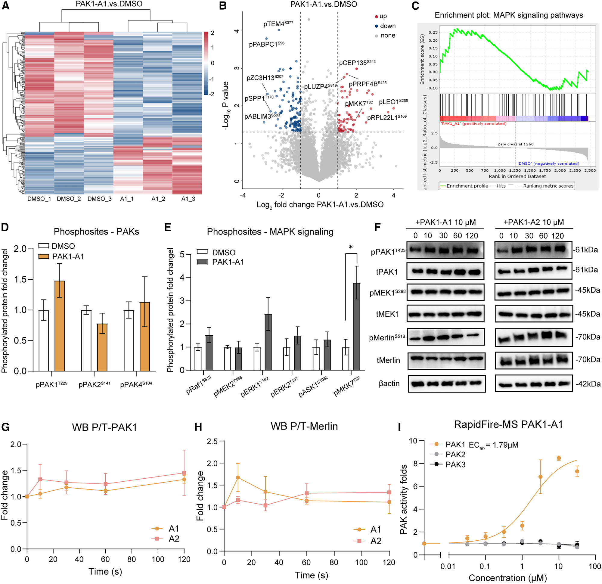
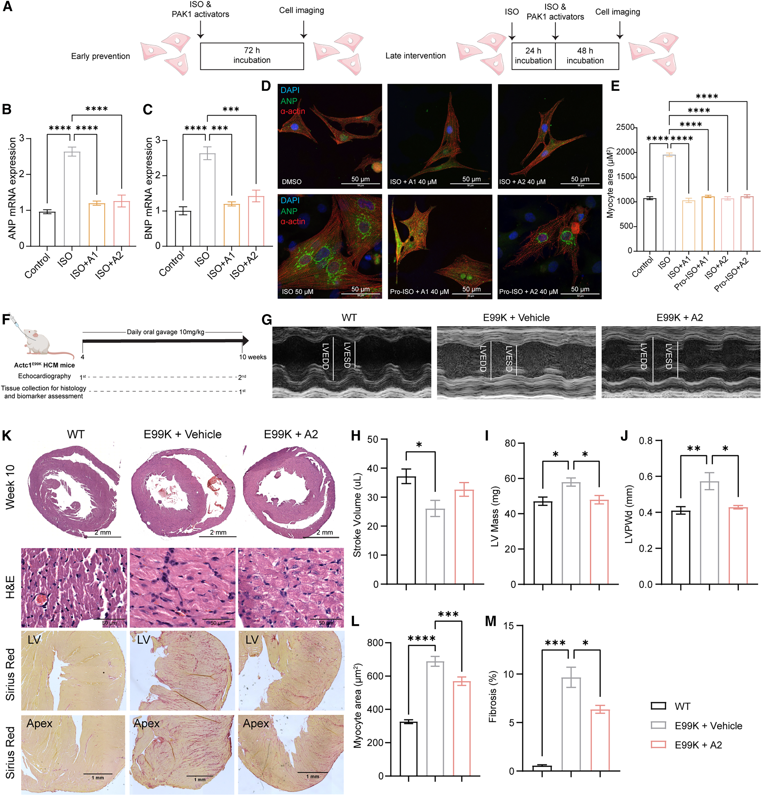
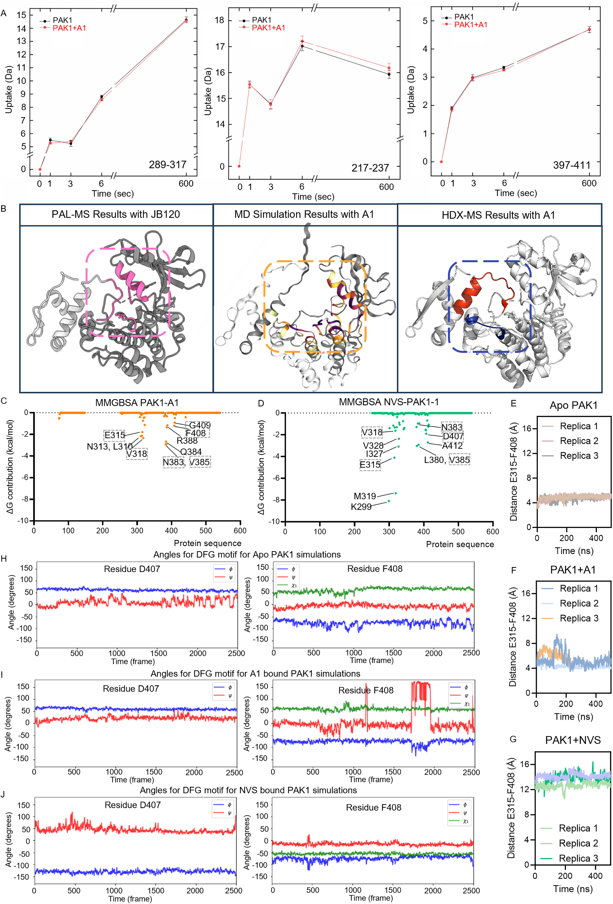

## 本文信息

- **标题**：治疗性PAK1变构激活剂的理性发现
- **作者**：He, Y.； Bae, J.S.H.; Nowak, E.; ...; Kukura, P.; Schofield, C.J.； Lei， M.（通讯）
- **发表期刊**：Cell
- 发表时间：2026年5月28日
- 卷期页码：Volume 189, Pages 3444-3464
- DOI：[https://doi.org/10.1016/j.cell.2026.03.008](https://doi.org/10.1016/j.cell.2026.03.008)
- 单位：英国牛津大学药理学系、英国牛津大学化学系、英国牛津大学结构基因组学联盟、德国法兰克福歌德大学药物化学研究所等
- 引用格式：He， Y., Bae, J.S.H., Nowak, E., ... Lei, M.（2026）。Rational discovery of therapeutic PAK1 allosteric activators. *Cell*, *189*, 3444-3464. [https://doi.org/10.1016/j.cell.2026.03.008](https://doi.org/10.1016/j.cell.2026.03.008)

更多内容详见上篇。

## 研究内容

### 结果3：PAK1-A1 = Eltrombopag，老药新发现的惊喜

**承接问题**：SAR优化得到的JB120 EC50约5 μM（Cdc42存在下），活性和药代都还不够理想。既然PAL-MS已经精确定位了DEK位点，能否用这个精炼后的位点做新一轮虚拟筛选，得到更可成药的分子？

#### 基于PAL-MS精炼的第二次虚拟筛选（图3、图S3）

在PAL-MS精炼DEK位点后，本文进行了第二次虚拟筛选，这次筛选与结果2的首次筛选不同：

> **为什么要分两波筛选，不能直接用DrugBank？**
>
> 保守观点：理想情况是“直接拿激活分子→找位点→筛选类似物”，但第一波筛选前我们**既没有激活分子，也没有精确位点**。更关键的是，**激活剂的位点不能用抑制剂位点来推测**——激活和抑制是两种不同的构象调控机制，位点可能部分重叠但功能完全不同。这一重叠是PAL-MS实验后的**后验发现**（图2E显示激活剂与抑制剂共享部分残基），而非筛选前的预设。
>
> 第一波ZINC15的200万lead-like筛选承担了双重任务：①**概念验证**——证明”自抑制界面可被小分子占据”；②**位点精炼**——通过PAL-MS把AlphaFold2预测的粗糙位点变成精确的6个残基。这里背后的假设是：在新的质谱结果里鉴定出的关键残基处结合的配体是有成为激活剂的潜力的。作者未明确说JB系列效果不好，应该还可以，概念验证这个理由可能足够了。
>
> 激进观点：如上一篇Discussion中的猜测，第二次筛选才是正确的位点

- **筛选对象**：DrugBank的6,252个已上市/实验性药物（包括ZINC15的FDA-approved drugs 1,615个）
- **蛋白结构**：使用PDB 1F3M单体结构，但**移除了激酶抑制结构域**（aa 136-149），因为PAL-MS结果证实激酶抑制结构域会占据活性位点，移除后可确保其不会阻碍PAK1激酶结构域内活性结合位点的可用性
- **位点生成**：使用OpenEye的Make_Receptor工具，利用PAL-MS分析识别的关键结构元素生成精炼的活性结合位点。**对接工具**：FRED（OpenEye）
- **物理筛选**：选取排名前25的化合物进行RapidFire-MS体外激酶活性测试，得到5个苗头

这次基于PAL-MS精炼位点的筛选成功发现了PAK1-A1（Eltrombopag）和PAK1-A2（TPO agonist 138）。Eltrombopag——FDA已批准用于治疗免疫性血小板减少症（ITP）的血小板生成素（TPO）受体激动剂，商品名Promacta。这一“老药新发现”具有重要的临床意义：

- **安全性已知**：Eltrombopag已经通过了广泛的临床试验，**已有较充分的人体安全性数据**
- **快速转化**：可以**借用既有安全性数据缩短早期评估路径**，直接进入PAK1相关心血管疾病的临床试验
- **多靶点机制**：Eltrombopag可能**通过激活PAK1产生心血管保护作用**，这为其在心血管领域的应用提供了新的理论基础

#### 体外激酶活性测试

**图3：PAK1-A1/PAK1-A2的发现、结合与初步构象证据**
- **图3A**：PAK1-A1（Eltrombopag）和PAK1-A2（TPO agonist 138）的化学结构
- **图3B**：PAK1-A1和PAK1-A2对PAK1活性的剂量效应曲线，说明二者都能直接增强PAK1活性
- **图3C**：NVS-PAK1-1作为PAK1变构抑制剂对照，显示同一类变构位点可以被“激活剂”和“抑制剂”以相反方式利用
- **图3D**：native MS显示PAK1-A1与全长PAK1直接结合，结合化学计量比为1:1
- **图3E**：NVS-PAK1-1与**PAK1激酶域K299R**的co-crystal结构（蓝色配体+绿色蛋白），显示其结合在**变构DFG-out位点**，涉及gatekeeper Met344、αC螺旋的Glu315、DFG motif的Asp407和Phe408四个关键残基
  - **为什么用K299R而非WT**：Lys299是激酶催化位点的关键残基，K299R（kinase-dead）突变让激酶**失活且构象稳定**——没有自磷酸化的动态变化，更容易形成规则晶体
  - **与图3H的对照**：同一组晶体条件下抑制剂能稳定结合、激活剂不能，这是构象柔性差异的间接证据
- **图3F**：分子对接预测的PAK1-A1结合模式，与DEK位点的Lys141、Glu315、Arg388、Phe408相互作用。图中KIS的位置是示意性的，显示其被PAK1-A1推开后的空间状态。**红色标注的残基是激活剂和抑制剂共有的结合位点残基**（Glu315、Asn383、Asp407、Phe408）——这是piano-finger-like机制的结构基础：**同一组残基，激活剂和抑制剂都能用**
- **图3G**：apo态与NVS-PAK1-1结合态的构象对比，抑制剂诱导**小叶旋转+αC螺旋外移+DFG motif 180°翻转**，稳定DFG-out无活性构象（“锁住”姿态）
- **图3H**：apo态与PAK1-A1浸泡实验的构象对比，**没检测到配体密度、也没明显构象变化**，激酶仍处于DFG-in状态，只有相对apo的微小αC螺旋位移。这个负面证据暗示PAK1-A1诱导的**开放、柔性构象不利于晶体堆积**——PAK1-A1的精确结合姿态因此只能依赖分子对接、native MS、FRET和MD模拟间接推断

**补充图S3：图3的结构细节补充**——为图3E-H补充晶体学和对接姿态的细节证据
- **图S3A**：PAL-MS精炼位点后的虚拟筛选pipeline，展示从PAP结合位点定义到 DrugBank/FDA-approved库筛选得到PAK1-A1/A2的完整流程
- **图S3B**：全长PAK1的native MS谱图，显示多达**5种磷酸化状态**（不同磷酸化形式的PAK1共存）
- **图S3C**：PAK1激酶域K299R的不对称二聚体晶体结构，两个单体的N叶存在约**20°旋转**，说明二聚体的不对称性
- **图S3D**：PAK1-A2在DEK位点的分子对接姿态，预测其结合模式
- **图S3E**：PAK1-A1与NVS-PAK1-1在重叠结合位点的细节视图对比，红色标注为两类配体共享的残基（Glu315、Asn383、Asp407、Phe408）

---

| 化合物 | 化学本质 | EC50/IC50 | 激活倍数 | 选择性 | 特殊性质 |
| --- | --- | --- | --- | --- | --- |
| **PAK1-A1** | Eltrombopag（FDA已批准TPO受体激动剂） | EC$_{50} = 1.6 \pm 0.23~\mu\mathrm{M}$ | 约3-5倍 | 选择性激活PAK1，对PAK2/3无激活 | 安全性数据现成，可快速转化 |
| **PAK1-A2** | TPO agonist 138 | EC$_{50} = 2.575 \pm 0.094~\mu\mathrm{M}$ | 约3倍 | 选择性激活PAK1，对PAK2/3无激活 | 溶解度≥50 mM，适合慢性口服给药 |
| **JB120** | JB79的SAR优化类似物 | EC50约5 μM（Cdc42存在下） | 约10倍（Cdc42存在下） | - | 活性比JB79更强，用于PAL-MS探针设计 |
| **NVS-PAK1-1** | 已知PAK1变构抑制剂（阴性对照） | IC50 = 0.089 $\mu\mathrm{M}$ | 抑制 | - | 与激活剂结合同一位点但驱动相反构象 |

在选择性方面，PAK1-A1和PAK1-A2都**选择性激活PAK1，对PAK2和PAK3无明显激活活性**，这一结论由独立的放射性$^{33}$P磷酸转移实验交叉验证。

> **批判性视角**：Eltrombopag在PAK1上EC50约1.6 $\mu\mathrm{M}$，远高于其作为TPO激动剂的药代窗口（其EC50约1.6 $\mu\mathrm{M}$ vs TPO激动剂的nM级）。重新定位需要解决选择性（PAK1 vs TPO/c-Mpl）和剂量学问题，但论文未深入讨论这一关键的“老药新用困境”。

**天然质谱分析**显示，PAK1-A1能够直接结合到全长PAK1蛋白上，结合化学计量比为1:1，与全长PAK1的所有磷酸化状态（包括非磷酸化和单/多磷酸化形式）都能结合。竞争性实验表明，过量的PAP或JB79能够竞争性抑制PAK1-A1的结合，证明PAK1-A1**作用于与PAP和JB79相同的DEK位点**。

### 结果4：构象变化的全面验证

**承接问题**：PAK1-A1=Eltrombopag这一发现令人惊讶，但它的结合位点到底在哪里？是不是真的和PAP、JB79作用在同一个“自抑制释放位点”？前面PAL-MS已经定位了DEK位点的核心残基（图2E），结果4用分子动力学、FRET生物传感器、点突变四类手段，回答“结合后构象怎么变”。

**整体结论**：400 ns分子动力学（3次重复）+ MM/GBSA能量分解+SPR+FRET+点突变四类证据证明——**PAK1-A1和NVS-PAK1-1虽结合在重叠的DEK位点，但驱动PAK1进入方向相反的构象**

#### 分子动力学模拟

MD模拟用于理解两类配体在DEK位点中的结合姿态差异。

- **模拟设置**：OpenMM + NVIDIA Quadro RTX 6000 GPUs，蛋白用AMBER FF14SB力场，配体用GAFF力场，TIP3P水模型。初始结构来自NVS-PAK1-1与PAK1激酶结构域K299R共晶（PDB 1F3M）+ PAK1-A1的AutoDock Vina对接
- **模拟流程**：最小化→加热到298 K→平衡→400 ns生产运行（3次独立重复）
- **自由能计算**：使用MM/GBSA方法，从400 ns轨迹提取结构，运行30个重复的5 ns平衡轨迹，用AmberTools的MMPBSA.py程序计算

#### FRET生物传感器实验

为了实时观察PAK1的构象变化，本文使用了Maria Carla Parrini实验室赠送的PAK1-FRET生物传感器Pakabi。这个传感器的结构是：**YFP-spacer-PAK1(aa 65-545)-spacer-CFP**——N端融合黄色荧光蛋白（YFP）作为受体、C端融合青色荧光蛋白（CFP）作为给体。

**关键结构位置关系**：DEK位点（配体结合位点）位于PAK1(aa 65-545)片段内部，包含KIS(aa 136-149)、Glu315(αC螺旋)、Asn383/Val385、DFG motif(Asp407-Phe408-Gly409)等关键残基。当配体结合到DEK位点并诱导构象变化时，PAK1的N端（靠近KIS）和C端（靠近激酶C叶）的相对位置发生改变——**YFP和CFP的距离随之改变，FRET效率就改变**。

实验流程：将PAK1-FRET质粒转染到CHO细胞，24小时后做单细胞FRET成像。激光激发CFP（480 nm），检测双发射（535 nm），计算YFP/CFP比值作为FRET比值。先记录1分钟基线，然后加入不同浓度的PAK1-A1或NVS-PAK1-1，持续记录FRET比值变化。数据经过背景校正、漂移校正、归一化（ΔFRET(%)，加药前设为0%）。

**为什么这个实验能说明结论**：FRET效率与距离的六次方成反比（**距离越近，FRET越高**）。同一个CHO细胞表达的同一个PAK1-FRET传感器，如果对不同配体产生方向相反的FRET响应，就直接表明两类配体诱导了不同的构象变化：
- PAK1-A1让FRET上升13.8% → YFP和CFP距离**变近** → N端C端靠近
- NVS-PAK1-1让FRET下降 → YFP和CFP距离**变远** → N端C端远离（原文描述为“open, inactive kinase conformation”）

#### 结果

**图4：激活剂和抑制剂诱导PAK1发生不同的构象变化（MD + SPR + FRET + 点突变）**

- **图4A-B**：MD模拟中配体到PAK1各残基的距离分布——PAK1-A1（A）和NVS-PAK1-1（B）。**关键定量**：PAK1-A1与KIS的平衡距离约**1.6 Å**（紧贴KIS，通过推开自抑制实现激活），NVS-PAK1-1与DFG motif的距离约**1 Å**（紧贴DFG，通过稳定DFG-out实现抑制）——两类配体在DEK位点内的接触“重心”不同
- **图4C-D**：参与配体结合的关键残基按“配体-残基平衡距离”着色。图C显示PAK1-A1接触的关键残基，图D显示NVS-PAK1-1接触的关键残基——**两者接触残基集合部分重叠**，与PAL-MS定位的DEK位点一致
- **图4E-F**：SPR传感器图（三次独立实验）——PAK1-A1（E）和NVS-PAK1-1（F）以浓度依赖方式结合全长PAK1，**稳态表观$K_D$分别在约1-4 μM和0.2-0.8 μM的低微摩尔范围**，与激酶活性EC50/IC50值一致
- **图4G/I：FRET响应**。图4G（PAK1-A1）：FRET比值显著上升，**最大幅度Δ13.8%**；图4I（NVS-PAK1-1）：FRET比值下降，振幅在500 nM至20 μM浓度范围内不变但动力学呈剂量依赖。同一个传感器**对两类配体产生方向相反的响应**
- **图4H/J：点突变（性质相反的氨基酸）验证关键残基**。
  - PAL-MS识别的6个残基中，Y131K/Y142K/E315A三个突变体在CHO细胞中无法表达或致死（提示对PAK1基本功能关键）；
  - 剩余5个突变体（K141D/V318D/N383L/V385D/D407K）的激酶活性与WT无统计学差异（ADP-Glo测定，图S4D）——**说明突变对FRET的影响来自“配体结合差异”而非“激酶活性改变”**
  - 图4H（PAK1-A1）：这5个突变体的FRET变化和结合动力学都显著降低
  - 图4J（NVS-PAK1-1）：K141D突变同样削弱NVS-PAK1-1诱导的构象变化，说明K141D对激活剂和抑制剂都关键；而其他4个残基（V318D、N383L、V385D、D407K）主要影响激活剂PAK1-A1

**补充图S4：小分子调节PAK1全局构象变化（图4补充）**

- **图S4A-B**：MD模拟显示PAK1-A1（A）和NVS-PAK1-1（B）到**结合位点中心**的预测距离随时间变化（图注描述为to the center of the binding sites，原文methods未说明该中心的具体计算方式），距离平稳维持在低值说明两类配体都能紧密稳定地占据该位点中心——这是它们能够相互竞争性结合的结构基础
- **图S4C**：PAK1-FRET生物传感器示意图，PAK1的C端融合供体CFP，N端融合YFP，用于图4G-I的细胞内构象实时监测
- **图S4D**：WT PAK1-FRET传感器与突变体的激酶活性测定。蛋白在CHO细胞表达后用anti-YFP抗体和A/G beads免疫沉淀，再用ADP-Glo检测活性，结果显示这些可检测构建体与WT相比**无统计学差异**
- **图S4E**：突变体PAK1-FRET的静态FRET比值归一化。Y131K、Y142K、E315A构建体无法表达或导致CHO细胞死亡，其余突变体的基线FRET变化用于解释图4H-J中的构象读数
- **图S4F-G**：全长PAK1的凝胶过滤和质量光度分析显示，溶液中**全长PAK1以单体为主**，仅有约2%的二聚体峰
- **图S4H-I**：活性PAK1激酶结构域主要为单体，而失活的K299R激酶结构域同时出现单体和二聚体，为后续比较配体对二聚化状态的影响提供基线
- **图S4J-L**：在K299R激酶结构域体系中，PAK1-A1处理相较DMSO可降低二聚体比例，提示激活剂结合会诱导构象变化并促进二聚体解离；NVS-PAK1-1对二聚化比例**没有显著影响**

### 结果5：Piano-Finger-Like调控机制

**承接问题**：激活剂和抑制剂结合在同一个DEK位点（Glu315、Asn383、Asp407、Phe408重叠），为什么效果截然相反？

**整体结论**：四组证据从静态结构（接触图）、活性动力学、竞争结合、动态暴露（HDX-MS）四个角度共同回答“PAK1-A1怎么把自抑制撬开”——结果是“推开KIS而非锁住DFG”的差异化姿态，正是琴键-琴弦式调控机制的实验支撑

**图5：PAK1-A1对自抑制机制的干扰**

- **图5A-B：接触图揭示KIS被推开**
  - **方法逻辑**：基于MD模拟轨迹计算蛋白内各结构域间的原子距离，用颜色/线条表示接触强度
  - **接触差异**：apo态全长PAK1（A）中激酶抑制结构域紧贴蛋白骨架（密集接触）；PAK1-A1结合后（B），KIS区域的接触模式改变，远离激酶结构域——**自抑制界面被破坏**
  - **推开 vs 锁住的姿态差**：PAK1-A1与Lys141、Phe408形成疏水相互作用，与Glu315、Arg388、Asp407形成氢键，占据激酶抑制片段原本的位置（距DEK位点约1.6 Å），**将KIS从催化结构域推开**；NVS-PAK1-1则以约1 Å紧密相互作用稳定DFG-out。这两种姿态正是琴键-琴弦式（Piano-Finger-Like）机制的结构基础——共享的调控残基像同一组琴弦，被不同小分子按下时触发截然不同的构象响应
- **图5C-D：活性动力学显示推开=激活**
  - **全长PAK1 vs 孤立激酶域**：全长PAK1本身自磷酸化弱（5C），加入PAK1-A1活性谱**与孤立激酶结构域（缺少自抑制干扰）相当**（5D）——说明PAK1-A1把全长PAK1“重置”到与去自抑制态一致的高活性状态。**NVS-PAK1-1始终抑制**（5C、5D）
  - **自抑制结构域依赖性**：去掉自抑制结构域后PAK1-A1激活效应消失（与图S1E的JB79结果一致），但NVS-PAK1-1仍能抑制——**两类配体结合同一位点却对自抑制结构域的依赖截然相反**
  - **伴随的构象变化**：PAK1-A1结合后，αC螺旋向ATP结合位点移动（激酶激活的典型特征）；NVS-PAK1-1则稳定αC螺旋在外位。PAK1-A1结合后，PAK1从自抑制的二聚体状态转变为活性的单体状态
- **图5E：竞争性结合显示调控元件重叠但不同**。PAK1-A1加到NVS-PAK1-1预处理过的PAK1中，先保持抑制后活性恢复；反之先PAK1-A1再加NVS-PAK1-1动力学被减慢——**这种“先入为主”行为直接支持琴键-琴弦式机制**：激活剂和抑制剂调节的是重叠但不同的调控元件
- **图5F：K299R失活突变体上的动力学**。PAK1-A1和NVS-PAK1-1在K299R失活背景下的对照，进一步排除激酶活性本身的差异对结合的干扰
- **图5G：HDX-MS动态暴露直接“看到”KIS被置换**。
  - 以Da差值>0.2 Da且p<0.05为显著性阈值：PAK1-A1结合后**激酶结构域肽段425-444氘摄取显著降低**（构象变紧凑）；
  - **自抑制结构域肽段126-145（含KIS）氘摄取显著增加**（构象灵活性增加/被置换）。αC螺旋肽段289-317的ΔD约-0.19 Da刚好低于0.2 Da阈值但趋势一致。
  - HDX-MS结果与MD模拟预测的结合界面高度一致
- **图5H：构象集合示意图**。把apo态、NVS-PAK1-1结合态、PAK1-A1结合态的构象分布放在一起对比——**直观看到PAK1-A1诱导的构象与NVS-PAK1-1诱导的构象在DEK位点上方向相反**

> **图5的逻辑收尾**：A-B静态接触图 + C-D/F活性动力学 + E竞争性结合 + G动态暴露（HDX-MS）四组证据按“静态→活性→竞争→动态”递进，层层支撑差异化姿态结论。
> 
> **琴键-琴弦式机制的核心启示**：同一位点的微小差异就能决定激活还是抑制——这一点对设计选择性靶向特定激酶状态的变构调节剂有直接指导意义。

### 结果6：细胞磷酸化蛋白组验证PAK1-A1选择性激活PAK1

**承接问题**：体外激酶活性、native MS、MD模拟、HDX-MS都做了，但在**真实的细胞环境**里，PAK1-A1能否激活下游信号？能否产生与PAK1基因功能一致的下游效应？

方法：给H9C2心肌细胞样细胞加PAK1-A1，然后和DMSO对照组比较，看看全细胞哪些磷酸化位点变了。

**整体结论**：磷酸化蛋白组学（一次实验给出2,609个蛋白、8,864个磷酸化位点的相对定量）+KEGG通路富集+PAK亚型选择性验证三层证据，**核心发现是PAK1-T229磷酸化约1.5倍、MKK7显著上调3.8倍、MAPK通路整体富集、PAK2/PAK3/PAK4无显著变化**，这就把“细胞激活”和“PAK1选择性”两个关键性质同时验证了。

> **磷酸化蛋白组学是什么**：把细胞裂解、酶解成肽段，富集带磷酸基团的肽段，质谱定量全细胞所有磷酸化位点的丰度变化。一次实验能给出几千个位点的相对定量，对照组和处理组的差异位点富集到哪条信号通路就能直接读出来。

**图6：PAK1激活剂在细胞中激活PAK1依赖性信号通路**

- **图6A-B：磷酸化蛋白组全景**
  - **整体变化**：PAK1-A1（10 μM，1小时，DMSO对照，n=3）处理H9C2细胞后，**260个磷酸化位点发生显著变化（>2倍，校正后p<0.05）——其中80个上调、180个下调**。热图（6A）显示上调（红色）和下调（蓝色）位点的全局分布，火山图（6B）显示每个位点的统计显著性与倍数变化
  - **下调位点**：**180个下调位点中包含ARHGEF17/TEM4、ABLIM3、SPP1等细胞骨架/黏附相关蛋白**（提示PAK1激活能抑制促纤维化与促炎信号）
  - **上调位点**：**80个上调位点富集到RNA加工、翻译、细胞骨架支持相关蛋白**（LEO1、PRPF4B、RPL22L1等），这些位点此前未被直接关联到PAK1——**说明PAK1-A1不只是已有靶点的“再激活”，还揭示了PAK1信号的新下游**
- **图6C：MAPK通路显著富集**。KEGG富集分析显示差异磷酸化蛋白**显著富集到MAPK信号通路**——把“哪个通路在跑”的问题从单基因层面提升到通路层面
- **图6D：PAK亚型选择性的蛋白组学证据**。在panel中可检测到的PAK家族成员中，**PAK1-T229磷酸化约升高1.5倍**（与PAK1活性增强一致），而**PAK2-S141和PAK4-S104均无可观变化**——这是“PAK1选择性”在蛋白组学层面的独立交叉印证
- **图6E：MAPK两条分支的具体定量**
  - **RAF-MEK-ERK分支**：ERK1磷酸化约升高2.5倍但未达统计学显著（p≥0.05，趋势一致但强度有限）
  - **JNK分支**：MKK7磷酸化显著上调约3.8倍（p<0.05）——MKK7是JNK分支的核心激酶、文献已证实是心脏PAK1的下游效应子，**这一显著上调把“PAK1→MKK7→JNK→心脏保护”这条已知通路在细胞里完整复现出来**
- **图6F-H：时间动力学与下游底物**
  - **PAK1自身磷酸化动力学**：H9C2细胞用PAK1-A1或PAK1-A2（10 μM）处理0-120分钟，免疫印迹（6F）显示**pThr423-PAK1在2小时达到约1.5倍升高**（6G），与磷酸化蛋白组一致
  - **下游底物Merlin的瞬时响应**：**pSer518-Merlin在10分钟瞬时升高后回到基线**（6H）——Merlin是已知PAK1底物，**10分钟的瞬时激活提示PAK1-A1优先调动“早期底物”而非持续磷酸化**
  - **分支偏好验证**：MEK1磷酸化未观察到显著变化（图S6A）——**说明PAK1下游存在分支偏好**
- **图6I：PAK亚型选择性的独立活性验证**。RapidFire-MS活性测定中，PAK1-A1和PAK1-A2**选择性激活全长PAK1，对PAK2和PAK3无可检测活性**——与图6D的蛋白组学证据相互呼应

> **图6的逻辑收尾**：磷酸化蛋白组（全景+通路富集+亚型选择）+ 时间动力学免疫印迹 + 独立RapidFire-MS活性验证三层证据按“广度→深度→选择性”递进，层层支撑细胞激活与选择性结论——也是从“试管激活”到“细胞通路激活”的关键跨越。

#### 关键定量结果（细胞水平）

| 指标 | 处理 | 变化幅度 | 显著性 | 解读 |
| --- | --- | --- | --- | --- |
| 全细胞显著变化磷酸化位点 | 10 μM PAK1-A1，1小时 | 2,609个 | 变化>2倍，校正p<0.05 | 大量信号通路被调动 |
| MKK7磷酸化（JNK分支） | 10 μM PAK1-A1 | 约3.8倍 | p<0.05（显著） | PAK1下游经典靶点 |
| ERK1磷酸化（ERK分支） | 10 μM PAK1-A1 | 约2.5倍 | 未达统计学显著 | 趋势一致但强度有限 |
| pThr423-PAK1（自磷酸化） | 10 μM PAK1-A1或A2，2小时 | 约1.5倍 | 显著 | PAK1本身被激活 |
| pSer518-Merlin（下游底物） | 10 μM PAK1-A1 | 10分钟瞬时上调 | 显著 | 已知PAK1底物被磷酸化 |
| PAK2磷酸化 | 10 μM PAK1-A1 | 无显著变化 | — | 选择性 |
| PAK4磷酸化 | 10 μM PAK1-A1 | 无显著变化 | — | 选择性 |

### 结果7：心脏肥厚模型中的治疗效果

**承接问题**：细胞中激活MAPK通路是机制层面的证据，但**真正决定临床转化潜力的是体内疾病模型**。PAK1激活剂能否在真实的心脏肥厚中逆转病理？

**整体结论**：体外心肌细胞（ISO诱导）+ 体内HCM小鼠（Actc1 E99K转基因）两类模型，按“分子标志物→细胞形态→心脏功能→组织病理”四个层面递进，回答“PAK1激活剂能否在真实疾病中逆转病理”——**核心结论是：PAK1-A1/A2不仅预防肥厚、还能逆转已建立的肥厚；不仅改善细胞标志物、还能改善心功能和病理重塑**

#### 三种互补的疾病模型

| 模型 | 病理含义 | 给药分子/途径/剂量/周期 | 关键读值 | PAK1 KO验证？ |
| --- | --- | --- | --- | --- |
| **ISO新生小鼠心肌细胞** | β肾上腺素能过度激活的体外模型 | PAK1-A1或A2，40 μM，1小时预处理或24小时后给药 | ANP/BNP mRNA下降，心肌细胞面积缩小 | —（细胞实验） |
| **Ang II输注小鼠** | 获得性心脏肥厚 | PAP（肽段），10 mg/kg/天，腹腔注射，4周 | LV壁厚度、LV质量、纤维化面积减少 | **是**（KO后保护消失） |
| **TAC（主动脉缩窄）小鼠** | 压力超载引起的心脏肥厚 | JB79，10 mg/kg/天，腹腔注射，2周 | IVSd、LVPWd、LV质量降低，射血分数保留 | — |
| **Actc1E99K转基因小鼠** | 遗传性肥厚型心肌病（HCM） | PAK1-A2，10 mg/kg/天，口服灌胃，6周 | 心搏量、射血分数、心输出量增加；心肌细胞横截面积、纤维化降低；ER应激（ATF6、CHOP下调）减轻 | — |

#### 多个疾病模型共同支持转化潜力

**图7：PAK1激活剂在心肌细胞和心脏肥厚模型中的治疗效果**

- **图7A：两种干预时机设计**。新生大鼠心肌细胞用**ISO（50 μM）**诱导β肾上腺素能过度激活的病理肥厚。
  - PAK1激活剂（40 μM）以两种时机给药：（1）**早期预防——与ISO共处理**；
  - （2）**晚期干预——ISO处理后24小时再给药**（此时肥厚已经形成）——**这种“24小时回补”设计是临床转化最看重的“能否逆转已建立病理”的问题**，比单纯预防更有说服力

- **图7B-C：分子标志物层面**。RT-qPCR定量（n=3-4）显示，**PAK1-A1和PAK1-A2都显著降低ISO诱导的ANP和BNP mRNA上调**——这是心脏肥厚的经典分子标志物
- **图7D-E：细胞形态层面**。α-肌动蛋白免疫染色的代表性图像（D）和心肌细胞面积定量（E，n=200-300）显示，**两种激活剂都显著缩小ISO诱导的心肌细胞面积**——而且**晚期干预（24小时给药）也能逆转已建立的心肌细胞肥大**
- **图7F：HCM小鼠口服给药方案**。Actc1 E99K转基因HCM小鼠（这是遗传性肥厚型心肌病的经典模型）**每天口服灌胃PAK1-A2（10 mg/kg），持续6周**后做超声心动图分析——这个时长在慢性病临床前评估中较有说服力
- **图7G-J：心脏功能层面**。超声心动图（G）及心搏量（H）、LV质量（I）、LVPW厚度（J）的定量（n=5）显示，**PAK1-A2治疗后HCM小鼠的心搏量恢复、LV质量下降、LVPW厚度减小**——心功能从“病理状态”往“接近正常”方向回归
- **图7K-M：组织病理层面**。心脏组织学染色代表性图像（K）及心肌细胞横截面积（L）和纤维化面积（M）的定量显示，**PAK1-A2同时逆转心肌细胞肥大和间质纤维化**——这是HCM病理重塑的两个核心指标

> **最关键的临床启示是“温和激活足以治病”**：细胞内PAK1活性仅~1.5倍（远低于纯化蛋白上的激活倍数）就能产生显著抗肥厚效应，**说明临床转化中稳定、温和、可控的增强就足够产生治疗效果**。
>
> **图7的逻辑收尾**：分子标志物（7B-C）→ 细胞形态（7D-E）→ 心脏功能（7G-J）→ 组织病理（7K-M）四层证据按“分子→细胞→器官→组织”递进，层层支撑逆转病理结论。

但需注意，本文的KO验证**仅在PAP肽段+Ang II模型中完成**，小分子PAK1-A1/A2的体内效果未在PAK1 KO小鼠中独立验证——这是转化链条上的一处遗漏（见局限性章节）。

#### 为什么E99K用PAK1-A2而不是PAK1-A1

PAK1-A1（Eltrombopag）虽然活性更强，但它在DMSO中溶解度只有18.83 mM，且药代动力学性质不适合6周慢性口服给药。PAK1-A2虽然在体外活性略低，但溶解度≥50 mM（小分子可成药的关键），CLint只有18.5 μL/min/mg、半衰期74.8 min——是真正的“成药性”化合物。E99K的6周治疗在慢性病里不算长，需要能稳定持续给药的分子。

PAK1-A2治疗减轻了内质网（ER）应激——ATF6、CHOP下调，IRE-1磷酸化和XBP1激活上调——表明PAK1激活剂还通过**逆转不适应性的ER应激信号**来发挥治疗作用。这条机制是文献里相对独立的另一条HCM致病通路，PAK1激活剂能同时干预机械应力、神经体液激活和ER应激三个层面。

#### 特异性验证的范围

本文的KO验证**仅在PAP的Ang II模型中完成**——PAP的保护效应在PAK1敲除小鼠（PAK1CKO）中完全消失，且PAK1CKO小鼠慢性Ang II灌注后心脏肥厚反而加重。这一结果表明PAP的心脏保护作用确实由PAK1介导。**但PAK1-A1/A2的小分子体内效果未在PAK1 KO小鼠中独立验证**——这是从肽段到小分子转化链条上的一处遗漏，需要后续用PAK1条件敲除小鼠补充验证。

> - **致癌风险未评估**：E99K模型6周改善心功能，但HCM是慢性病，**长期激活PAK1的致癌风险**（PAK1本身是促癌基因）未评估——这是限制其临床转化的关键未知数
> - **DEK位点优势**：PAK1-A1作用于**PAK1特异的DEK位点而非保守的ATP结合口袋**，其脱靶效应可能低于传统ATP竞争性调节剂。在体组织学分析显示，PAK1-A1/A2治疗组心脏组织中**PAK1的磷酸化水平显著升高，纤维化程度显著降低**

### 设计策略的普适性验证

为了验证这种肽段引导策略是否可以推广到其他具有自抑制结构的激酶靶点，本文选取了蛋白激酶A（PKA）进行探索。PKA由调节亚基和催化亚基组成，在静息状态下，**调节亚基的抑制结构域与催化亚基紧密结合，形成无活性的全酶复合物**。

本文设计了来源于PKA调节亚基RIα抑制结构域的肽段Pα1、Pα2和Pα3，其中**Pα2能够增强PKA的活性**。基于Pα2-PKA复合物的结构模型，本文识别了PKA的自抑制释放位点，并通过虚拟筛选发现了PKA激活剂Cpd1和Cpd2。

体外实验表明，**Cpd1和Cpd2能够浓度依赖性地增强PKA的活性**，Cpd1（conivaptan）EC50约为**1.53 μM**，Cpd2（bemcentinib）EC50约为**6.43 μM**。**当去除PKA的调节亚基后，激活作用消失**，表明这些化合物通过破坏自抑制相互作用来激活PKA。FRET生物传感器实验显示，Cpd1和Cpd2处理能够诱导PKAR4传感器的FRET比值时间依赖性增加。

这些结果表明，本文提出的**肽段引导策略具有一定普适性**。该策略的成功应用依赖于：激酶具有明确的自抑制结构域、自抑制结构域的序列信息已知、自抑制释放位点存在可被小分子靶向的口袋、以及结构生物学和计算方法的整合。

### 未在正文展示的补充图概览

下表汇总正文未单独展示的补充图（图S3、S6、S7）的核心内容和结论，以便读者快速了解这些图提供了哪些证据：

| 补充图   | 关联正文 | 核心内容                                                     | 主要结论                                                     |
| -------- | -------- | ------------------------------------------------------------ | ------------------------------------------------------------ |
| **图S3** | 图3      | PAL-MS精炼位点后的虚拟筛选pipeline；全长PAK1 native MS（多达5种磷酸化状态）；PAK1激酶域K299R的不对称二聚体晶体（两单体N叶约20°旋转）；PAK1-A2在DEK位点的对接姿态；PAK1-A1与NVS-PAK1-1重叠结合位点的细节视图 | 为图3E-H补充晶体学和对接姿态的细节证据；明确PAK1-A1/A2与抑制剂在重叠位点上的相互作用模式 |
| **图S6** | 图6      | 放射性33PanQinase实验测PAK1-A1对PAK1-3的选择性；PAK1-A2对PAK1 vs PAK2/PAK3的RapidFire-MS剂量响应；PKA策略验证（Pα1-3肽段筛选、Cpd1/Cpd2剂量响应、AKAR4 FRET时间曲线） | （1）PAK1选择性由独立放射性实验交叉证实；（2）肽段引导策略在PKA上可推广，得到EC50约1.53 μM的Cpd1和约6.43 μM的Cpd2 |
| **图S7** | 图7      | Ang II+PAP+PAK1CKO三组对比（KO中PAP效应消失）；TAC+JB79小鼠超声和Masson三色染色；E99K HCM小鼠口服PAK1-A2的心重/体重比、心功能参数；E99K心脏组织ER应激标志物免疫印迹 | （A-C）完成遗传学证伪——PAP保护效应在PAK1CKO中消失；（D-K）JB79在压力超载模型独立有效；（L-Q+R）PAK1-A2在遗传性HCM有效，且伴随ER应激通路缓解 |

**补充图S5：HDX-MS和MD揭示PAK1-A1的结合位点与作用机制（结果5补充）**
- **图S5A**：HDX-MS选定肽段的氘摄取曲线。激酶结构域289-317肽段交换减少（$\Delta D_{\mathrm{A1-bound}-\mathrm{apo}} \approx -0.19$，6 s），柔性环217-237肽段交换增加（约0.19，6 s和600 s），397-411肽段无明显差异——这说明PAK1-A1结合后的构象变化具有**区域选择性**
- **图S5B**：比较PAL-MS（JB120探针）、MD预测和HDX-MS验证得到的PAK1激活剂结合区域，结论是**结合位点位于激酶结构域与自抑制结构域的界面**。KIS相关肽段126-145的显著暴露属于图5G的HDX-MS主结果，不应写成图S5B本身的内容
- **图S5C-D**：MM/GBSA自由能分解分别识别PAK1-A1（C）和NVS-PAK1-1（D）结合全长PAK1时的关键残基，灰色标注表示两类配体共享的接触残基。关键差异是PAK1-A1对kinase inhibitory segment（aa 136-149）区域有显著的能量贡献，说明它结合变构位点（DEK位点）并通过构象变化影响KIS区域，而NVS-PAK1-1主要结合DFG motif——这解释了两者为什么占据重叠位点却产生相反功能
- **图S5E-J**：MD模拟进一步比较apo PAK1、PAK1-A1结合态和NVS-PAK1-1结合态。图S5E-G追踪αC螺旋Glu315与activation loop上Phe408的距离，图S5H-J分析DFG motif（D407-F408-G409）的扭转角，核心是说明**同一DEK区域内不同配体姿态会导向激活或抑制**

## 关键结论与批判性总结

### 核心创新定性

**将自抑制域自身作为变构探针，确立了利用内源抑制肽段定位激酶自抑制释放界面的通用范式**——打破了激酶靶向只能从活性位点或纯构象筛选出发的旧约束，把以毒攻毒的反向思路变成了系统方法。

### 主要影响

- **学术影响**：本文提出的肽段引导策略为激酶激活剂的理性发现提供了**从自抑制机制出发的新理论框架**。传统激酶药物开发主要聚焦于抑制剂，而本文证明**通过靶向自抑制释放位点可以实现高选择性的激酶激活**，这为激酶生物学和药物化学开辟了新的研究方向。
  - 按证据强度分层，核心骨架证据包括PAP肽段激活PAK1的发现、PAL-MS定位DEK位点、虚拟筛选得到PAK1-A1/A2；肌肉交叉印证证据包括FRET构象变化、HDX-MS动态暴露、磷酸化蛋白组（MAPK通路激活）、心肌细胞信号验证；首饰求新炫技证据为PKA策略可迁移性验证（RIα肽段也找到激活剂）；体力活展示工作量证据包括SAR合成63个类似物、跨PAK1/2/3亚型选择性panel、三种动物模型
- **方法学影响**：本文建立的整合肽段设计、计算筛选、PAL-MS定位、结构生物学和药理学验证的激酶激活剂发现流程，为其他具有自抑制结构的蛋白靶点的激活剂开发提供了**可借鉴的肽段引导方法学模板**。特别是将来源于自抑制结构域的肽段作为分子指南的创新思维，值得在其他药物设计问题中推广
- **临床转化潜力**：PAK1激活剂在心脏肥厚模型中展现出的**心脏肥厚改善效果和短期耐受性**，为其进一步的临床前开发和临床试验提供了坚实基础。如果能够成功转化，**将为PAK1介导的心血管疾病提供新的治疗选择**

### 局限性

- **口服生物利用度的限制**：目前发现的PAK1激活剂（如PAK1-A1和PAK1-A2）主要通过注射给药，口服生物利用度较低。这限制了其临床应用的便利性，未来需要通过结构优化来改善药代动力学特性。Eltrombopag（PAK1-A1）在PAK1上的EC50远高于其作为TPO激动剂的药代窗口（nM级），重新定位需要解决选择性（PAK1 vs TPO/c-Mpl）和剂量学问题，但论文未深入讨论
- **选择性的进一步验证**：虽然PAK1激活剂对PAK1/PAK2/PAK3亚型表现出选择性，但**未做kinome-wide profiling**，对非Group I PAKs或下游激酶的脱靶风险未排除，更大规模激酶谱上的脱靶效应仍需进一步评估
- **长期安全性的担忧**：PAK1在多种组织中都有表达，**长期激活PAK1可能带来潜在的风险**，特别是PAK1本身是促癌基因，长期使用可能存在致癌风险。虽然短期实验显示PAK1激活剂耐受性良好，但长期使用的安全性仍需进一步评估
- **作用机制的复杂性**：PAK1的调控网络非常复杂，涉及多个上游调节因子和下游底物。**PAK1激活剂在复杂生物体系中的长期效应和潜在副作用仍需深入研究**

### 未来方向

- **实验层面补充**：kinome-wide选择性panel、co-crystal或cryo-EM解析PAK1-A1/PAK1动态复合物以填补结构证据空缺、长期（>6月）慢性毒性尤其肿瘤监测以评估致癌风险
- **理论层面补充**：PAK1-A1在TPO受体和PAK1之间浓度依赖的occupancy模型以解决老药新用困境、激活幅度与下游底物磷酸化的非线性关系以论证小分子激活天花板
- **临床转化补充**：Eltrombopag在心脏患者中的真实血药浓度-激酶占有率验证、HCM基因型分层（仅E99K一个Actc1突变不够，需更多基因型）、与mavacamten等现有HCM药物的联用或替代定位
- **先导化合物优化**：PAK1-A1和PAK1-A2目前虽然具有良好的活性，**但在药代动力学特性方面仍有优化空间**，特别是口服生物利用度和代谢稳定性。基于PAK1-A1与PAK1的结合模式进行结构优化，有望获得活性更强、性质更优的临床候选分子
- **作用机制的深入解析**：利用**长时间尺度的分子动力学模拟和单分子荧光技术**，进一步解析PAK1激活剂如何影响PAK1的构象动态和活化过程。PAK1激活剂结合后，PAK1的构象熵如何变化？DEK位点的动态特征是什么？这些问题的回答将为设计更强效的激活剂提供理论指导
- **拓展至其他靶点**：应用该策略于更多具有自抑制结构的激酶（如AKT、SRC等）和具有类似调控机制的其他蛋白家族，验证其普适性并拓展应用范围。基于本文建立的筛选标准，对整个激酶组进行系统性分析，识别出最有可能适用于该策略的靶点
- **联合治疗策略**：探索PAK1激活剂与其他心血管药物的联合应用，评估协同效应和最佳联合方案。初步研究显示，**PAK1激活剂与ACE抑制剂联用时可能具有协同效应**
- **临床转化研究**：推进PAK1激活剂的进一步临床前开发，包括毒性评估、药代动力学优化、制剂开发等，为临床试验奠定基础
