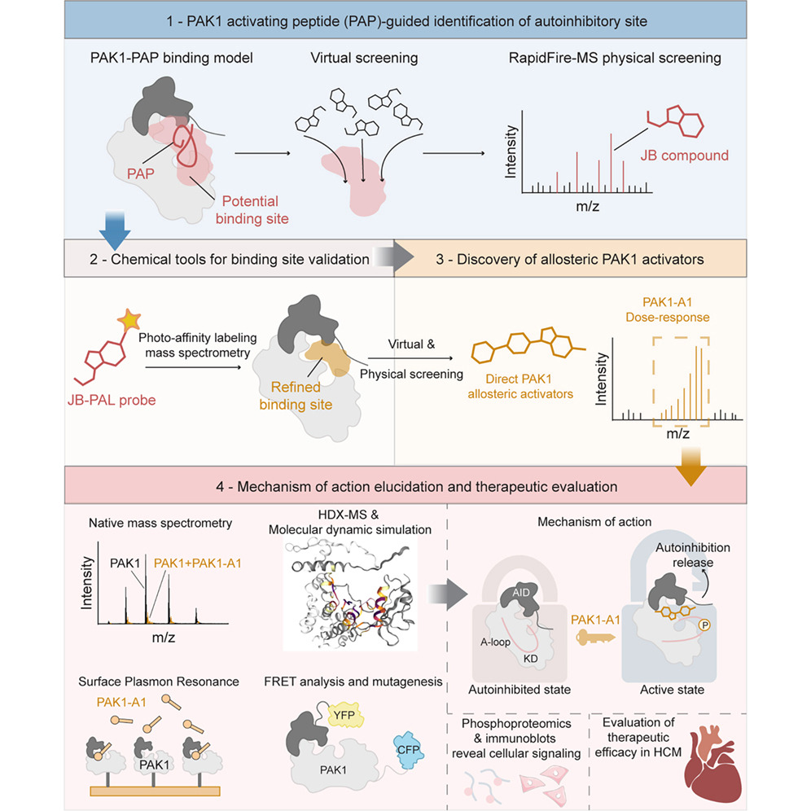
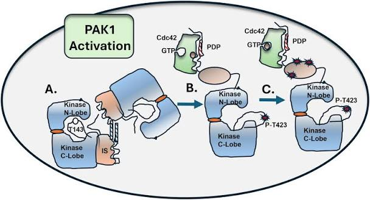
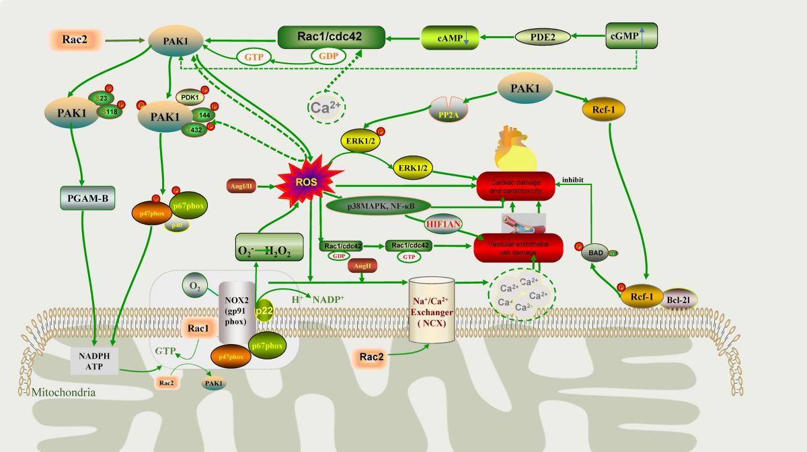
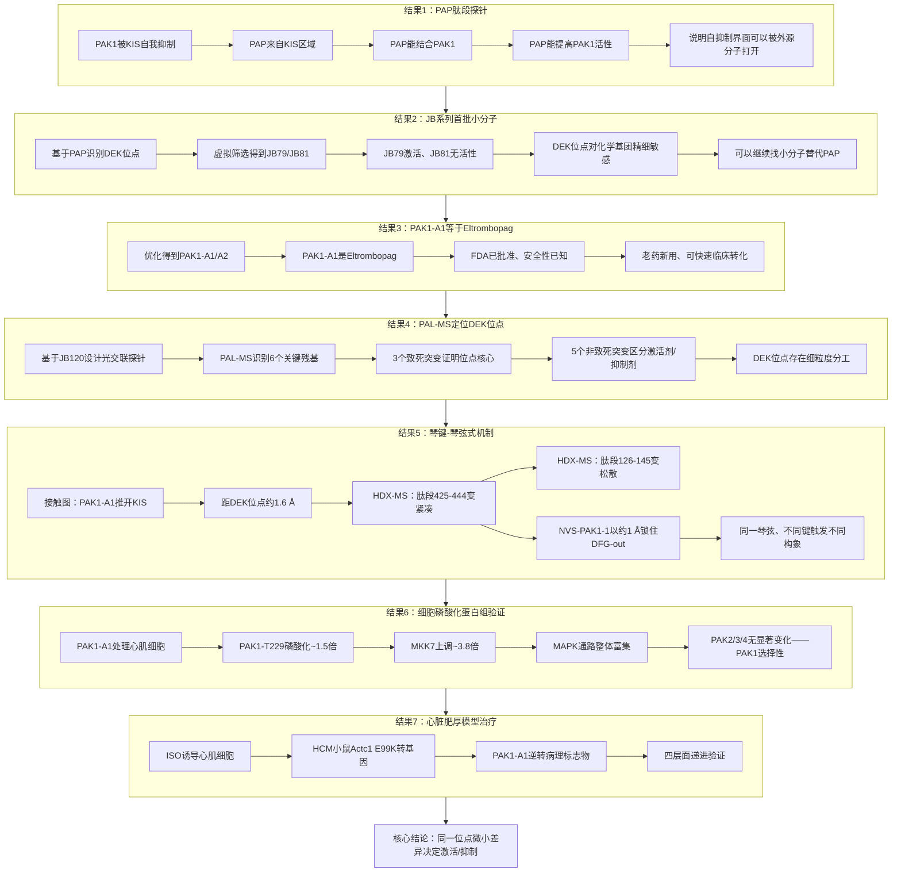
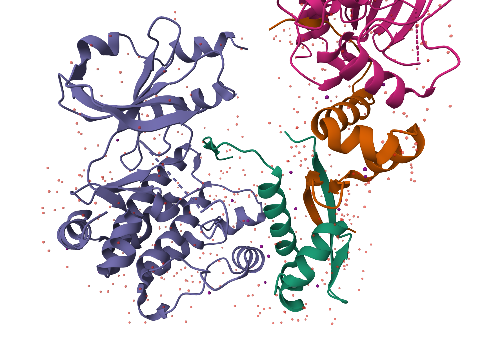
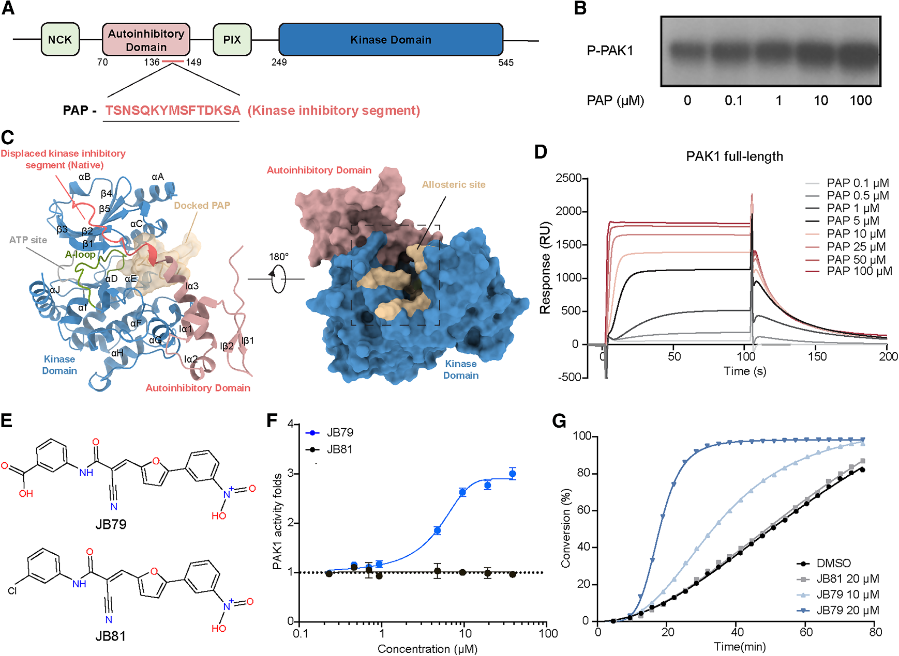
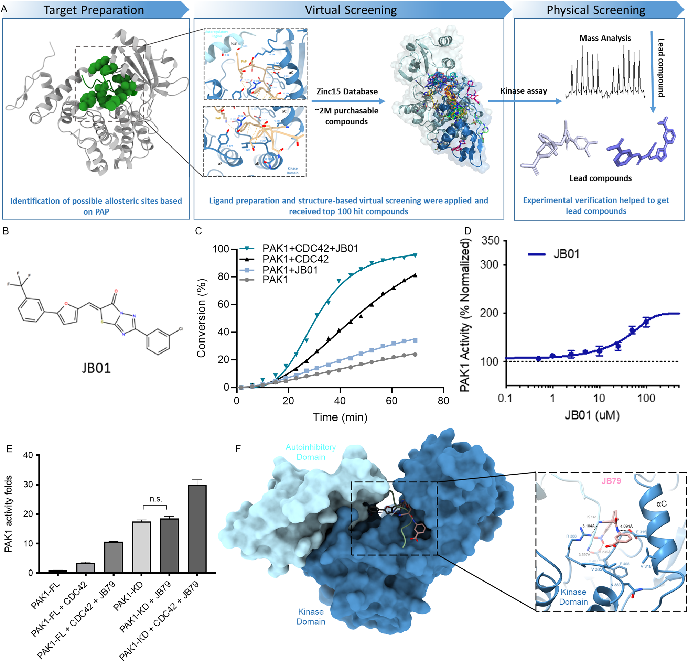

# 肽段引导策略发现PAK1变构激活剂

## 本文信息

- **标题**：治疗性PAK1变构激活剂的理性发现
- **作者**：He, Y.; Bae, J.S.H.; Nowak, E.; ...; Kukura, P.; Schofield, C.J.; Lei, M.（通讯）
- **发表期刊**：Cell
- 发表时间：2026年5月28日
- 卷期页码：Volume 189, Pages 3444-3464
- DOI：[https://doi.org/10.1016/j.cell.2026.03.008](https://doi.org/10.1016/j.cell.2026.03.008)
- 单位：英国牛津大学药理学系、英国牛津大学化学系、英国牛津大学结构基因组学联盟、德国法兰克福歌德大学药物化学研究所等
- 引用格式：He, Y., Bae, J.S.H., Nowak, E., ... Lei, M.（2026）。Rational discovery of therapeutic PAK1 allosteric activators. *Cell*, *189*, 3444-3464. [https://doi.org/10.1016/j.cell.2026.03.008](https://doi.org/10.1016/j.cell.2026.03.008)

### 作者介绍

**雷鸣教授**（Ming Lei）是牛津大学药理系Professor of Physiology and Pharmacology，也是Cardiac Signalling Group（https://www.pharm.ox.ac.uk/research/groups/lei-group ）的负责人。**课题组长期关注心脏电生理功能及其信号调控，尤其是PAK1在心脏保护、心律失常和心脏肥厚中的作用**。该组此前已经将Pak1确立为心脏疾病治疗的潜在新靶点，并开展了基于结构的PAK1激活剂理性设计工作。

## 摘要

> 激酶激活剂具有重要的治疗潜力，但其开发具有挑战性且鲜有成功。本文报道了利用理性的肽段引导策略发现心脏稳态关键调节因子**p21-活化激酶-1**（PAK1）的直接小分子激活剂。靶向PAK1的自抑制调控，本文识别出位于自调控区与激酶结构域之间的**一个此前未被识别的自抑制释放位点**。后续的高通量筛选和药物化学优化产生了具有**微摩尔级活性与亚型选择性的变构激活剂**。结构学和机制分析表明，这些激活剂通过破坏自抑制调控、促进向活性构象的局部和全局转换来发挥作用。在心脏细胞中确认了PAK1信号得到增强，并且在体研究显示**在遗传性和获得性心脏肥厚中均具有治疗效果**。综上，这些发现确立了**理性调控激酶自抑制机制可用于发现治疗性激酶激活剂**。

### 核心结论

- **肽段引导定位DEK位点**：用PAP肽段作为分子探针，把PAK1自抑制界面变成可被小分子靶向的口袋
- **首批小分子激活剂**：从ZINC15/DrugBank中筛选得到JB系列和PAK1-A1（EC$_{50} = 1.6 \pm 0.23~\mu\mathrm{M}$）、PAK1-A2（EC$_{50} = 2.575 \pm 0.094~\mu\mathrm{M}$）
- **PAK1-A1就是Eltrombopag**：FDA已批准上市的TPO受体激动剂，安全性数据现成
- **动物模型三种疾病都有改善**：ISO心肌细胞、Ang II+TAC小鼠、E99K遗传性HCM小鼠
- **PKA验证肽段引导策略可推广**：在PKA上同样找到激活剂Cpd1/Cpd2

## 背景

蛋白激酶占人类基因组的约1.7%，通过磷酸化修饰底物活性来调控细胞内信号转导，在细胞功能和疾病中起重要作用。尽管激酶抑制剂在癌症和免疫失调领域开发较多，但治疗性激酶激活剂在心血管、代谢、神经保护和再生医学领域的成功案例有限。

已有的激酶激活剂实例说明了其治疗潜力。二甲双胍通过**间接激活AMPK并产生代谢获益**（AMP-activated protein kinase），在糖尿病、心血管疾病和癌症治疗中显示获益。其他**直接AMPK激活剂A-769662和O304**也在代谢和心脏疾病治疗中显示潜力。近期的**PI3Kα激活剂1938用于心脏保护和神经再生**。

但尽管近年来有一些成功，只有有限的蛋白激酶被成功靶向，反映了激酶激活剂开发的挑战——包括**难以定义特定的靶向位点**，这强调了需要新的策略方法。**识别激酶的关键调控位点**可以促进激活剂的开发，并为调控激酶活性提供有价值的生物学见解。

> 激酶抑制剂和激活剂的根本差异：激酶抑制剂靶向**高度保守的激酶结构域**，而激酶激活剂则需要深入理解**每个激酶自身的调控机制**。绝大多数激酶的变构口袋要么不存在，要么结构未知。PAK1的自抑制结构域序列已知，**自抑制释放位点在物理上应该存在**，问题只是“有没有小分子能占上去”。

PAK1是Group I PAKs的成员，属于丝氨酸/苏氨酸蛋白激酶家族，在维持细胞稳态和代谢中起关键作用，增强心肌细胞对压力的适应性。

- PAK1包含N端自抑制结构域（aa 67-150）和激酶结构域（aa 249-545），**静息状态下PAK1以无活性的同源二聚体存在**——N端的p21-binding domain（PBD；aa 70-113）含**Cdc42/Rac-interactive binding（CRIB；aa 75-90）模序**，通过与对侧单体的β-strands配对维系二聚体；KIS（aa 136-149）则缠在催化口袋上挡住ATP和底物入口。
- 生理激活时，**Rac/Cdc42结合CRIB模序触发二聚体解离+激酶结构域暴露**，然后Thr423在activation loop上发生自磷酸化，PAK1进入完全活性状态。
  - **传统路径**：通过Cdc42-PBD结合触发二聚体解离和激酶结构域暴露
  - **小分子路径**：本文的小分子激活剂走的是另一条路——**绕开Cdc42-PBD，结合在N叶/C叶之间的变构位点间接把KIS推开**，是非生理性的变构激活
  - **DEK位点组成**：这个变构位点后来被命名为**DEK位点**（DFG-Glu315-KIS），由三段关键元件组成：**DFG motif**（Asp407-Phe408-Gly409，activation loop起点的经典构象开关）、**αC螺旋上的Glu315**（参与稳定激活态盐桥网络）、以及**KIS**（kinase inhibitory segment，aa 136-149）
  - **关键残基**：PAL-MS实验进一步识别出该位点的关键残基包括Tyr131、Tyr142、Glu315、Asn383、Val318、Val385

> PAK1在心血管与肿瘤中的不同角色：**肿瘤里PAK1过激活，是促癌基因**，所以药企花了几十年做PAK1抑制剂。**心脏里PAK1活性要适度维持**——PAK1敲除小鼠在压力超载下心脏肥厚反而更严重，PAK1激活剂才符合心脏治疗的需求。

PAK1在心脏里的作用可以理解成一个**压力状态下的信号调节器**，不是简单让细胞“长大”或“变强”。本文并不是凭空说“激活PAK1能治心脏肥厚”，而是接在一个已有的心脏保护通路背景上。相关综述可见：[The p21-activated kinase 1 signalling pathway in cardiac disease](https://pmc.ncbi.nlm.nih.gov/articles/PMC5867015/)和[PAK1 is a novel cardiac protective signaling molecule](https://www.pharm.ox.ac.uk/publications/605381)，雷鸣教授都有参与。如果把它拆成“从分子到表型”的链条，大概是这样：

- **第一步，解除自抑制**：Cdc42/Rac1让KIS离开催化口袋，PAK1完成Thr423自磷酸化，进入可工作的活性状态
- **第二步，调节磷酸化平衡**：活化PAK1会影响PP2A等磷酸酶和多条激酶支路（PP2A→钙处理、MKK4/7-JNK→抗肥厚、SRF-SERCA2a→钙回收、Smad3/F-box32-calcineurin→转录调控），让心肌细胞里的磷酸化水平不要长期偏向“应激过强”的方向
- **第三步，稳住钙处理和收缩节律**：PP2A相关通路会影响钙处理蛋白和肌丝蛋白的磷酸化状态，减少钙瞬变紊乱和电生理不稳定，表型上对应心律更稳定、兴奋-收缩耦联更正常
- **第四步，压低肥厚转录程序**：PAK1-JNK等支路可抑制NFAT/calcineurin相关的病理性肥厚转录，并通过SERCA2a等节点维持钙回收能力，表型上对应ANP/BNP下降、心肌细胞面积减小、室壁增厚和纤维化减轻
- **第五步，落到器官层面**：这些分子和细胞层面的变化合起来，才表现为压力超载或遗传性HCM模型中左室质量、室壁厚度、纤维化和心功能指标的改善

过去十年的研究（包括本文作者团队的工作）通过遗传学方法和通路激动剂（如FTY720）证明了PAK1激活在治疗病理肥厚、心衰、缺血性心脏病和相关室性心律失常的治疗潜力。**本文作者之前的研究也展示了一个生物活性PAK1激活肽段（PAP）能诱导PAK1激活并减少病理肥厚**，但这个肽段作用的精确分子机制仍未定义。

### 创新点

- **策略创新**：提出了利用**来源于自抑制结构域的肽段作为分子指南**来识别激酶自抑制释放位点的“肽段引导”策略，并通过PAK1和PKA两个独立靶点验证了其可行性——**把理性调控激酶自抑制机制确立为可用于更广范围激酶激活剂发现的潜在策略**
- **机制创新**：揭示了PAK1自抑制释放位点的变构调节机制，证明小分子可以**通过结合该位点来破坏自抑制相互作用**，从而激活PAK1
- **方法创新**：整合了**肽段设计、计算筛选、PAL-MS定位、结构生物学和药理学验证**等多学科方法，建立了从靶点识别到先导化合物优化的完整激酶激活剂发现流程
- **应用创新**：发现的PAK1激活剂不仅具有显著的体外激活活性，更在心脏肥厚模型中展现出治疗效果。特别是**PAK1-A1被鉴定为Eltrombopag**，为心血管疾病治疗提供了可快速转化的候选药物

## 研究内容

### 逻辑主线：七个结果如何支撑一个结论

这一节的七个结果按“**探针→筛选→优化→机制→细胞→在体**”的递进链条排布，每一步回答上一个步骤留下的开放问题：

- **结果1**（探针/骨架）：能不能用PAP肽段证明自抑制界面可被外源分子占据？
- **结果2**（首批苗头/骨架）：小分子能不能模拟PAP？SAR的精密度能达到什么程度？
- **结果3**（命中优化/骨架）：能不能进一步提升活性并得到可成药的分子？
- **结果4**（位点/肌肉）：激活剂结合到PAK1的哪里？是不是真的和PAP、JB79作用在同一界面？
- **结果5**（机制/核心）：为什么结合在同一个位点，激活剂和抑制剂却驱动相反的构象？
- **结果6**（细胞证据/肌肉）：在真实的细胞环境中，PAK1-A1能否激活PAK1依赖的信号？
- **结果7**（动物模型/体力活）：在体疾病模型上是否真有效？

按证据强度重新归类：**骨架**是结果1+2+3，没有它们就没有**自抑制释放位点+激活剂**这条主线；**肌肉**是结果4+5+6，提供机制和细胞层级的交叉验证——结果5的琴键-琴弦式机制给整个故事画了句号，说明**同一位点也能分别触发激活/抑制**这一变构调节的普遍原理；**体力活**是结果7的多模型动物验证，增加可信度但本身不构成机制创新。

### 方法：自抑制位点的鉴定

- **PAK1在静息状态下处于自抑制状态**——其激酶抑制结构域中的**激酶抑制片段**（kinase inhibitory segment，KIS，aa 136-149）紧紧缠在催化口袋上，挡住了ATP和底物的入口，阻止PAK1工作。KIS中的关键残基Lys141与催化环Asp389、激活环Asp407形成氢键，物理性地占据ATP口袋，阻断αC螺旋Glu315与Lys299的盐桥形成——这就是“变构占位+活性位点占据”的双重抑制机制。

**PDB 1F3M显示的PAK1自抑制结构（绿色：自抑制结构域，KIS位于末端；紫色：激酶结构域；橙色：不对称单体）**。从图可清晰看到KIS（自抑制结构域末端的红色片段）硬塞进ATP口袋（activation loop区域），活性中心部分序列因柔性未解析出电子密度——这是典型的自抑制构象。而C-terminal位于左下中部，接上PAP只能往后走了。

- **PAP的设计思路**：本文直接拿KIS这段序列做了一条短肽，命名为PAK1 Activating Peptide（PAP）。**PAP序列为TSNSQKYMSFTDKSA（14个氨基酸）**，来源于PAK1的激酶抑制结构域。PAP和KIS序列几乎一致，原本的KIS缠在催化口袋上，加PAP进去后，PAP结合在自抑制结构域与激酶结构域之间的变构位点，通过构象变化**把内源KIS从催化口袋上推开**，破坏自抑制，让PAK1重新可以工作。
- PAP-PAK1复合物结构通过AlphaFold2建模得到：将PAP序列接在PAK1全长序列（UniProt: Q13153，545 aa）的C端，输入AlphaFold2预测，得到PAP结合在N叶/C叶之间的变构位点、KIS被推开的复合物模型

> **小编锐评**：AlphaFold2建模的**两个不确定性**。
>
> - **第一**：建模方式是**人工融合蛋白**。AlphaFold2训练的是天然蛋白折叠，预测的只是这条人为序列最稳定的折叠方式，**不代表真实的PAP-PAK1结合模式。我个人认为这是错误的**，最起码应该用multimer！
> - **第二**：图1C中的几何关系需要仔细看——PAP（浅棕色）结合在N叶/C叶之间的裂缝背面，属于变构位点；KIS（珊瑚红）原本插入activation loop的活性中心。**两者不在同一个位置，PAP通过占据变构位点间接把KIS推开**，而不是直接和KIS抢同一个位置。这个推开是AlphaFold2预测的结果（没有实验结构验证），到底是真实机制还是碰巧预测对了，读者需要谨慎解读

- **结合发生在哪里**：自抑制结构域和激酶结构域之间那个缝里——论文随后把这条缝命名为**自抑制释放位点**。PAP实际扮演的是这个口袋的**先导探针**，用来试探这个位点能不能被外源分子占据

### 结果1：肽段PAP作为探针识别自抑制释放位点

**承接问题**：能否证明PAK1的自抑制界面是外源分子可占据的？这是一切后续工作的概念前提。

**图1：生物活性肽段引导识别PAK1自抑制释放位点**

- **整体结论**：用PAP肽段证明**PAK1自抑制界面可以被外源分子直接占据并激活PAK1**——这是“肽段引导策略”的第一个概念证据
- **图1A**：PAP的氨基酸序列，**直接来源于PAK1自抑制结构域KIS（aa 136-149）**——本质是KIS的“克隆体”
- **图1B**：PAP对PAK1活性的剂量依赖性激活曲线，**证明肽段能直接激活PAK1**
- **图1C**：AlphaFold2预测的PAP-PAK1复合物结构——**PAP（浅棕）结合在N叶/C叶之间的裂缝，在那个active site的背后的，完全跟活性中心没有接触**，把内源KIS（珊瑚红）从催化位点置换出去；预测结果同时定义了用于后续小分子筛选的变构位点
- **图1D**：SPR传感器图（三次独立实验）——PAP以浓度依赖方式直接结合全长PAK1，**稳态$K_D = 2.69 \pm 1.21~\mu\mathrm{M}$**，与激活曲线的有效浓度一致
- **图1E**：JB79（激活剂，EC50=3.63±0.29 μM，约3倍激活）和JB81（结构对照）的化学结构——**两者结构几乎一致，仅苯环上meta位由羧酸换成氯**；羧酸氢键是DEK位点识别的关键
- **图1F**：RapidFire-MS剂量响应曲线，JB79浓度依赖激活、JB81无响应——**SAR精密度证据**：DEK位点对单个基团替换敏感
- **图1G**：时间依赖性动力学曲线，JB79激活随时间持续、JB81无响应

把PAP加到PAK1蛋白里，PAK1的活性随PAP浓度上升而上升（图1B）。SPR直接读出PAP与PAK1有浓度依赖的结合（图1D，$K_D$在低微摩尔水平——属于“能稳定占位又不会赖着不走”的中等亲和力）。在PAK1自抑制状态下，KIS结构域占据催化结构域的活性位点，阻止ATP和底物结合。AlphaFold2预测显示，PAP结合在N叶/C叶之间的变构位点，通过构象变化**将内源KIS从催化结构域上推开**，从而暴露ATP结合位点和Thr423自磷酸化位点。这一构象变化的本质是：**αC螺旋上Glu315与Lys299之间的离子对被打断**，activation loop发生转折，最终导致PAK1被激活。

> **核心机制总结（变构占位视角）**：自抑制结构域的作用机制本身就是**变构抑制**（allosteric inhibition）——它占据的是位于自抑制结构域和激酶结构域之间的变构位点，而非直接堵在ATP位点上。但KIS（aa 136-149）这个具体片段同时**插入激酶N叶/C叶之间的活性中心裂缝**，通过Lys141与催化环Asp389、激活环Asp407形成氢键，从变构位点“伸出爪子”抓住ATP口袋内的关键残基，物理性地阻止ATP结合。
>
> **所以两者其实是一回事**：KIS从变构口袋伸出、深入活性中心，变构占位+活性位点占据**是同一个动作的两面**。后续筛选的小分子激活剂（JB系列、PAK1-A1/A2）占据同样的变构位点，把KIS从活性中心顶出去——这就是后续所有工作的起点——既然肽段能做到，找一种能做同样事的小分子就有了方向。

### 结果2：JB系列化合物作为首批小苗头

**承接问题**：PAP证明了“自抑制界面可以被外源分子占住”，但PAP本身是一条肽段——**进到身体里几分钟就被消化掉，没法成药**。能不能做一种小分子，结构比PAP简单得多，但还能像PAP一样激活PAK1？另外，小分子的化学结构只要动一个基团，活性就可能完全反转——这种“精密度”到底有多高，能不能利用起来？

> **肽段引导策略**的直观理解：PAK1的自抑制就像一把锁——内源KIS是锁芯，PAP是一把外源钥匙。PAP插进去，把内源KIS挤出来，锁就被打开了。但PAP本身**作为肽段药物存在稳定性差、口服生物利用度低的问题**，因此本文的核心目标是**找到能模拟PAP功能的小分子**——这就是后续的JB系列化合物和PAK1-A1、PAK1-A2激活剂。

#### 筛选步骤

虚拟筛选流程基于PAP-PAK1复合物结构，本文识别了一个关键的自抑制释放位点。DEK位点**位于自抑制结构域与激酶结构域之间的变构调控区**，在PAK1自抑制状态下，KIS把αC螺旋“卡”在远离ATP位点的位置；小分子结合到DEK位点后，会**把KIS从催化口袋推开**，让αC螺旋向内摆回激活位——这一动作不需要经过Rac/Cdc42-PBD路径，是真正的“非生理激活”。

1. **位点定义与准备**：使用PDB ID 1F3M（去除不对称单体，**保留激酶抑制结构域**）作为受体结构，针对AlphaFold2预测的PAP结合位点进行筛选
2. **虚拟文库筛选**：使用ICM-VLS程序（Molsoft L.L.C.开发的虚拟筛选工具，https://molsoft.com/vls.html）对ZINC15数据库中的约200万个lead-like分子进行筛选，选取排名前100的化合物进行物理筛选
3. **物理筛选验证**：使用RapidFire-MS体外激酶活性检测方法测试前100化合物，最终得到18个初始激活剂苗头，其中**JB01和JB79**活性最优。注意JB01和JB79是两个独立的筛选苗头，不是SAR关系；JB81才是JB79的结构对照（仅在meta位取代基不同）

> **RapidFire-MS如何读出激酶活性**：把化合物和PAK1蛋白、底物肽、ATP在384孔板里孵育几分钟，让激酶把底物磷酸化，然后用RapidFire-MS（一种快速固相萃取-质谱）直接读出**磷酸化底物/总底物**的比例作为活性读值。比传统ADP-Glo快、比放射性$^{33}$P便宜，适合做千~万级筛选。这里的MS只是检测产物，只是快速分离+质谱定量的技术组合。

**补充图S1：PAK1激活剂的筛选流程与早期苗头JB01**

- **图S1A**：计算筛选和物理筛选相结合的完整pipeline——从PAP结合构象出发定义位点，到ICM-VLS（Molsoft L.L.C.虚拟筛选软件）对ZINC15 lead-like库虚拟筛选，再到RapidFire-MS物理筛选
- **图S1B**：JB01的化学结构。JB01和JB79都是从虚拟筛选中独立得到的两个早期苗头化合物，均能激活PAK1
- **图S1C**：JB01与PAK1的剂量效应曲线
- **图S1D**：JB01在Cdc42存在下的协同激活效应
- **图S1E**：JB79对不同PAK1结构域构建的激活效果对比——全长PAK1（full-length）vs 仅激酶结构域（kinase domain only）
- **图S1F**：分子对接预测的JB79与DEK位点的相互作用模式

##### 关键发现

1. **结构-活性关系的精妙对照（图1E）**：
   1. 图1E展示的JB79和JB81是近乎完美的对照——两者结构几乎相同，仅在酰胺基团相邻苯环的meta位取代基上有差异（具体化学结构见图1E），但功能却完全相反：JB79能够激活PAK1，JB81完全失去活性。
   2. 这一对照直接证明了**自抑制释放位点对化学基团的精细识别能力**——羧酸基团能与DEK位点形成关键氢键，是激活所必需的；换成氯原子则氢键消失，活性随之消失。
   3. 图1F的剂量响应曲线进一步量化这一对照：JB79呈现完整的激活曲线，JB81在测试浓度范围内无响应；图1G的动力学曲线显示JB79激活是时间依赖的、可持续的，不是瞬时扰动
2. **激活机制的直接证据（图S1E）**：
   1. JB79对不同PAK1结构域构建的激活效果对比显示，对于**全长PAK1，JB79与Cdc42分别从不同路径解除自抑制，产生协同效应**。
   2. JB79只能激活含激酶抑制结构域的全长PAK1，对孤立的激酶结构域没有激活作用——如果没有激酶结构域可被“推开”，小分子就无法发挥作用。这直接证明了**JB79的激活作用依赖于与激酶抑制结构域的相互作用**。
   3. Cdc42本应该对孤立的激酶结构域提升效果有限（看图感觉不是的，我认为存疑。。）？
3. JB79仅约3倍激活，在Cdc42存在下激活效应显著增强（Cdc42本身是已知的PAK1激活因子）。这引发一个问题：相比内源Cdc42/Rac1的生理激活程度，**小分子激活的“天花板”在哪里**？是否足以在体产生治疗效果？论文未给出occupancy分析和剂量-效应曲线的完整论证。

#### SAR优化

**承接问题**：JB79的活性（EC50约3.63 μM，约3倍激活）和选择性已经证明了概念，但能否通过结构-活性关系（SAR）优化得到更强的小分子？

- **SAR策略**：如图2A，将JB79分解为三个关键药效团进行系统优化——**R1**（m-carboxyphenyl，间位羧基苯基）、**R3**（m-aniline，间位苯胺）、以及连接这两个基团的**linker**
- **合成规模**：共合成**63个类似物**，其中21个能激活PAK1，**JB120活性最强**（EC50约5 μM，Cdc42存在下约10倍激活）
- **关键发现**：
  - **R1基团优化**：para位有强吸电子基团（如羧基）时激活效果最强；羧基比酯基（COOR）激活效果更好
  - **R3基团优化**：硝基不是关键，但考虑到毒性可以替换；卤素取代显示ortho和para位比meta位更有利
  - **Linker优化**：延长一个亚甲基（methylene）可增强激活效果
  - **核心基团替换**：测试了5种不同的核心基团（R2，acrylonitrile核心）来替代，同时保持类似的药效性质

> **小编锐评**：从最终结果看，JB120及JB系列这些SAR优化出来的分子其实**都没被用在后续的药物开发中**——真正被用于体内实验和治疗的是PAK1-A1，这是从完全不同的虚拟筛选路线得到的。**如果只是概念验证，是否有必要投入这么大精力做SAR优化**？
>
> 可能的解释是：①JB120的主要价值是**作为PAL-MS探针而非药物候选**，所以药代优化不是首要目标；②SAR数据本身提供了**DEK位点对化学基团精细敏感的结构信息**，为后续理解激活剂-蛋白相互作用打下了基础。但如果是纯药物发现项目，这种“费了半天劲最后不用这些分子”的SAR优化可能不太划算。

##### PAL-MS实验流程详解

**PAL、PAL-MS是什么**：PAL = Photo-Affinity Labeling（光亲和标记），核心是在小分子上装一个光敏基团（本文用的是diazirine），紫外光照射下它会变成高活性卡宾，能和相邻的几乎任何氨基酸形成共价键，把小分子“焊死”在蛋白上。

物理上diazirine能碰到的潜在交联残基其实相当多，所以PAL-MS报告的“关键残基”（如本文的Tyr131、Tyr142、Glu315等）**不是“所有diazirine碰到的残基”**——而是**经过两个过滤器筛出来的**：①质谱定量显示**高度富集**（修饰肽段信号强）；②加入过量未标记的母体化合物JB120竞争后，**信号显著降低**。满足这两个条件的位点才是**特异性的配体结合位点**，其余随机交联的位点会被滤掉。

1. **探针合成**：基于SAR结果合成多个PAL探针，如图2B所示
2. **探针验证**：用RapidFire-MS激酶活性实验确保引入光激活基团后分子的结合亲和力和功能没有显著改变
3. **结合反应**：全长PAK1（0.5 μM）与JB120-PAL和DMSO对照预孵育3小时
4. **竞争实验**：同时加入过量的母体化合物JB120作为竞争物——这一步是关键！只有当JB120-PAL的修饰信号在加入竞争物后显著降低，才能确认这些残基是**特异性的配体结合位点**，而不是随机共价交联的假阳性
5. **UV交联**：365 nm紫外照射20分钟，diazirine基团活化为高活性卡宾，与周围氨基酸共价结合
6. **蛋白质组学分析**：丙酮沉淀蛋白、酶切肽段、NanoLC-MS/MS分析、MaxQuant软件处理
7. **质谱解读**：检测带有ΔM质量位移（461.09 kDa，对应JB120-PAL）的修饰肽段；定量蛋白质组学分析揭示4个修饰肽段、5个特定残基高度富集；加入JB120竞争后这些修饰肽段丰度显著降低，证实是特异性结合位点而非随机共价交联

##### 结果

**图2：PAL-MS识别JB120结合PAK1的关键残基——从SAR优化到PAL探针设计，精确定位DEK位点**

- **图2A：SAR优化过程**。为了定义JB79化学结构与生物活性的关系，作者进行了结构-活性关系（SAR）分析。SAR识别出三个关键基团：**R1**（m-carboxyphenyl）、**R2**（furan）、**R3**（m-nitrophenyl），以及连接这些基团的linker。将这三个基团用各种化学修饰替换，共合成**63个类似物，其中21个能激活PAK1，JB120活性最强**。
- **图2B：PAL探针设计**。基于SAR研究的新见解，设计了JB120的PAL探针JB120-PAL，在JB120的**para位标记diazirine基团**，从而定位小分子的真实结合区域。作者还合成了JB120-PAL-2（在**meta位**标记diazirine）和JB120-PAL-3，并在RapidFire-MS激酶活性实验中验证了这些探针的结合亲和力和功能没有显著改变
- **图2C-D：探针功能验证**。JB120和JB120-PAL仍能激活PAK1，说明引入光交联基团后分子功能没有完全坏掉，是合格的PAL探针
- **图2E：PAL-MS定位DEK位点**。PAL-MS识别出的关键残基包括**Tyr131、Tyr142、Glu315、Asn383、Val318、Val385**，作者把它们命名的调控区域称为“**DEK motif**”（DFG-Glu315-KIS，组成见结果2开头）。PAL探针交联的**关键残基正好位于激酶结构域和自抑制结构域之间的界面**——这正是PAK1活性自抑制调控的地方

> **结果2的核心结论**：这些数据collectively支持了一个模型——**JB120通过干扰激酶抑制结构域来破坏自抑制调控，从而激活PAK1**。作者不仅找到了能激活PAK1的小分子JB79，还通过SAR和PAL-MS证明，这类小分子确实在围绕PAK1自抑制释放位点发挥作用，精确定位了DEK motif的关键残基。JB系列化合物作为有价值的化学工具，在识别和表征自抑制释放位点方面发挥了重要作用。

**补充图S2：PAL-MS识别PAK1激活剂结合的关键残基**

- **图S2A**：PAK1自抑制结构域与激酶结构域复合物的晶体结构
- **图S2B**：PAL-MS实验流程示意图
- **图S2C-E**：PAK1激活剂结合位点的详细结构视图

### 我的Discussion：AlphaFold2预测与PAL-MS验证的逻辑链条问题

理想的验证链条应该是：①**复合物预测**（含具体残基）→②**筛选苗头**→③**实验定位结合位点**→④**验证预测与实验一致**。但本文有个关键缺口——**AlphaFold2预测的PAP结合位点具体包含哪些残基，原文从未列出**，方法部分只笼统说“at the PAP binding site, predicted by AlphaFold2”。**最自然的解释是AlphaFold2预测的位置偏了**（真实位点就是KIS天然结合在激酶结构域的位置，PAP设计初衷是模仿KIS理应落在类似位置），所以PAL-MS用JB120-PAL探针把位点纠正回来——这也是我对“为什么PAL-MS探针是JB120-PAL而不是JB79-PAL”的理解。

#### 事实（原文明确说明的）

- **PAL-MS用JB120-PAL探针识别出6个关键残基** Tyr131、Tyr142、Glu315、Asn383、Val318、Val385，正好位于激酶结构域和自抑制结构域之间的界面（结果4图2E、S2G）
- **两波筛选用了不同位点**：第一波用AlphaFold2预测的PAP位点（“at the PAP binding site, predicted by AlphaFold2”），第二波改用PAL-MS精炼位点（Make_Receptor基于PAL-MS残基定义）——**第二波原理上更正**
- **MD模拟预测PAK1-A1结合残基Lys141、Glu315、Arg388、Phe408**（DEK位点疏水相互作用），**与PAL-MS位点一致**（原文line 510-514）——计算层面的内部自洽
- **PAK1-A1浸泡实验未检测到配体密度**（结果4图注）——X-ray这条路走不通
- **HDX-MS证实DEK位点发生构象变化**：肽段425-444变紧凑、肽段126-145变松散（结果5）

#### 推测（小编的猜测）

- **JB79的“误打误撞”**：第一波从200万化合物里筛出JB79，原文只有“Predicted interaction”图（图1F），没有任何PAL-MS或共晶实验定位，唯一跟JB79直接相关的是RapidFire-MS活性曲线（功能验证而非位点验证）。**JB79的真实位点原文没说清**——可能碰巧结合在真实KIS位点附近，也可能落在AlphaFold2预测的偏移位点上，这是SAR优化前提是否成立的悬疑点
- **MD为PAK1-A1提供部分计算结构证据**：PAK1-A1来自第二波DrugBank筛选本身就用PAL-MS精炼位点，MD预测的Lys141/Glu315/Arg388/Phe408与PAL-MS位点内部自洽，与抑制剂NVS-PAK1-1的DFG位点部分重叠且方向相反——不是单一证据孤证。**但仍需注意**：MD是计算不是实验，400 ns采样可能未覆盖完整构象空间、Vina打分有已知偏差、浸泡实验失败使X-ray走不通、PAL-MS测的是JB120-PAL（acrylonitrile-aryl骨架）不是PAK1-A1（Eltrombopag thiazole-aryl-hydrazide骨架）

#### 深层问题（逻辑gap）

- **JB79的位点无直接实验证据**：只有计算“Predicted interaction”，PAL-MS探针是JB120-PAL不是JB79-PAL——**所以我们不知道JB79是否真的结合在DEK位点**，SAR优化的前提存疑
- **PAK1-A1没有X-ray/cryo-EM结构**：浸泡未检测到配体密度，MD残基是计算预测，化学交联质谱或HDX-MS对PAK1-A1本身也未见报道。PAL-MS测的是JB120不是PAK1-A1——化学骨架不同，结合细节不能直接套用
- **MD不能独立验证位点**：能给出热力学合理性和内部一致性，但**最终仍需实验验证**（如对Lys141/Glu315/Arg388/Phe408做点突变，或HDX-MS、CXMS化学交联质谱、$\ce{^19F}$-NMR等独立方法交叉验证）
- **Eltrombopag的TPO受体安全性不能外推到PAK1**：TPO受体是transmembrane cytokine receptor，**结合位点与PAK1的DEK位点完全无关**，不能从已知靶点推断PAK1的脱靶效应或组织分布

#### 但故事线是否成立？（小编的判断）

- **PAK1-A1证据强度比之前认为的更高**：MD给出具体残基预测且与PAL-MS内部自洽，与抑制剂DFG位点部分重叠方向相反——构成**计算层面的内部自洽**，但仍非实验证据
- **JB79故事线有未闭合gap**：“Predicted interaction”不是位点验证，PAL-MS是JB120不是JB79，“误打误撞”是猜测。最直接的闭合办法是**做JB79-PAL探针+同样的PAL-MS实验**，看识别残基是否与JB120-PAL一致
- **整体证据链**（5环，每环有计算/生化证据但无复合物晶体）：①PAL-MS定位DEK位点 → ②第二波筛选用精炼位点从DrugBank找到PAK1-A1 → ③MD验证PAK1-A1结合在DEK位点且与PAL-MS一致 → ④HDX-MS证实DEK位点区域构象变化 → ⑤PAK1-A1与抑制剂共享关键残基但驱动相反构象
- **治疗效应是真实的，本文最硬证据**：ISO心肌细胞、Ang II+TAC小鼠、Actc1 E99K遗传性HCM小鼠三种模型都显示PAK1-A1改善心脏肥厚——**功能验证比结构验证更重要**，动物疗效已把PAK1-A1从“概念验证”推到“候选药物”层级
- **仍需补强**：①JB79的真实位点实验证据（JB79-PAL + PAL-MS）；②PAK1-A1的独立实验定位（mutagenesis验证Lys141/Glu315/Arg388/Phe408，或CXMS）；③PAK1-A1在DEK位点的完整结构生物学证据（cryo-EM或共晶条件优化）

---

更多内容请期待下篇。
