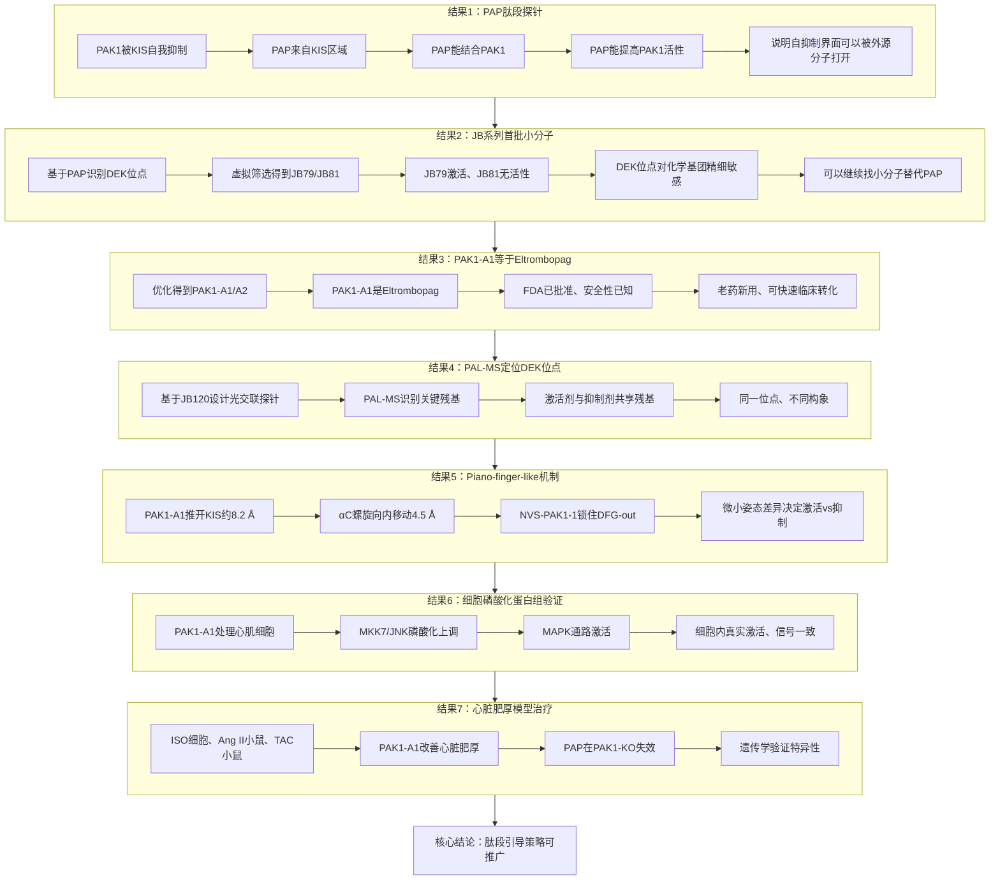

# 肽段引导策略发现PAK1变构激活剂

## 本文信息

- **标题**：治疗性PAK1变构激活剂的理性发现
- **作者**：He, Y.; Bae, J.S.H.; Nowak, E.; ...; Kukura, P.; Schofield, C.J.; Lei, M.（通讯）
- **发表期刊**：Cell
- 发表时间：2026年5月28日
- 卷期页码：Volume 189, Pages 3444-3464
- DOI：[https://doi.org/10.1016/j.cell.2026.03.008](https://doi.org/10.1016/j.cell.2026.03.008)
- 单位：英国牛津大学化学系、德国马克斯·普朗克医学研究所、英国牛津大学结构基因组学联盟等
- 引用格式：He, Y., Bae, J.S.H., Nowak, E., ... Lei, M.（2026）。Rational discovery of therapeutic PAK1 allosteric activators. *Cell*, *189*, 3444-3464. [https://doi.org/10.1016/j.cell.2026.03.008](https://doi.org/10.1016/j.cell.2026.03.008)

### 作者介绍

**雷鸣教授**（Ming Lei）是牛津大学药理系Professor of Physiology and Pharmacology，也是Cardiac Signalling Group（https://www.pharm.ox.ac.uk/research/groups/lei-group ）的负责人。**课题组长期关注心脏电生理功能及其信号调控，尤其是PAK1在心脏保护、心律失常和心脏肥厚中的作用**。该组此前已经将Pak1确立为心脏疾病治疗的潜在新靶点，并开展了基于结构的PAK1激活剂理性设计工作。

## 摘要

> 激酶激活剂具有重要的治疗潜力，但其开发具有挑战性且鲜有成功。本文报道了利用理性的肽段引导策略发现心脏稳态关键调节因子**p21-活化激酶-1**（PAK1）的直接小分子激活剂。靶向PAK1的自抑制调控，本文识别出位于自调控区与激酶结构域之间的**一个此前未被识别的自抑制释放位点**。后续的高通量筛选和药物化学优化产生了具有**微摩尔级活性与亚型选择性的变构激活剂**。结构学和机制分析表明，这些激活剂通过破坏自抑制调控、促进向活性构象的局部和全局转换来发挥作用。在心脏细胞中确认了PAK1信号得到增强，并且在体研究显示**在遗传性和获得性心脏肥厚中均具有治疗效果**。综上，这些发现确立了**理性调控激酶自抑制机制可用于发现治疗性激酶激活剂**。

### 核心结论

- **肽段引导定位DEK位点**：用PAP肽段作为分子探针，把PAK1自抑制界面变成可被小分子靶向的口袋
- **首批小分子激活剂**：从ZINC15中筛选得到JB系列和PAK1-A1（EC$_{50} = 1.6 \pm 0.23~\mu\mathrm{M}$）、PAK1-A2（EC$_{50} = 2.575 \pm 0.094~\mu\mathrm{M}$）
- **PAK1-A1就是Eltrombopag**：FDA已批准上市的TPO受体激动剂，安全性数据现成
- **动物模型三种疾病都有改善**：ISO心肌细胞、Ang II+TAC小鼠、E99K遗传性HCM小鼠
- **PKA验证肽段引导策略可推广**：在PKA上同样找到激活剂Cpd1/Cpd2

## 背景

蛋白激酶占人类基因组的约1.7%，通过磷酸化修饰底物活性来调控细胞内信号转导，在细胞功能和疾病中起重要作用。尽管激酶抑制剂在癌症和免疫失调领域开发较多，但治疗性激酶激活剂在心血管、代谢、神经保护和再生医学领域的成功案例有限。

已有的激酶激活剂实例说明了其治疗潜力。二甲双胍通过**间接激活AMPK并产生代谢获益**（AMP-activated protein kinase），在糖尿病、心血管疾病和癌症治疗中显示获益。其他**直接AMPK激活剂A-769662和O304**也在代谢和心脏疾病治疗中显示潜力。近期的**PI3Kα激活剂1938用于心脏保护和神经再生**。

但尽管近年来有一些成功，只有有限的蛋白激酶被成功靶向，反映了激酶激活剂开发的挑战——包括**难以定义特定的靶向位点**，这强调了需要新的策略方法。**识别激酶的关键调控位点**可以促进激活剂的开发，并为调控激酶活性提供有价值的生物学见解。

> 激酶抑制剂和激活剂的根本差异：激酶抑制剂靶向**高度保守的激酶结构域**，而激酶激活剂则需要深入理解**每个激酶自身的调控机制**。ATP口袋在激酶间高度保守，激活剂和抑制剂竞争同一空间；变构位点理论上是出口，但绝大多数激酶的变构口袋要么不存在，要么结构未知。PAK1是少见的例外——它的自抑制结构域序列已知，**自抑制释放位点在物理上应该存在**，问题只是“有没有小分子能占上去”。这是本文全部工作的起点。

PAK1是Group I PAKs的成员，属于丝氨酸/苏氨酸蛋白激酶家族，在维持细胞稳态和代谢中起关键作用，增强心肌细胞对压力的适应性。PAK1包含N端自抑制结构域，其中有一个**激酶抑制结构域KIS在静息状态下挡住活性口袋**（aa 136-149），阻断ATP结合位点和自磷酸化位点Thr423。生理激活PAK1需要**Rac/Cdc42结合PBD后把KIS挤出去**，暴露激酶结构域并让Thr423自磷酸化。

> PAK1在心血管与肿瘤中的不同角色：**肿瘤里PAK1过激活，是促癌基因**，所以药企花了几十年做PAK1抑制剂。**心脏里PAK1活性要适度维持**——PAK1敲除小鼠在压力超载下心脏肥厚反而更严重，PAK1激活剂才符合心脏治疗的需求。

过去十年的研究（包括本文作者团队的工作）通过遗传学方法和通路激动剂（如FTY720）证明了PAK1激活在治疗病理肥厚、心衰、缺血性心脏病和相关室性心律失常的治疗潜力。本文作者之前的研究也展示了一个生物活性PAK1激活肽段（PAP）能**诱导PAK1激活并减少病理肥厚**，但这个肽段作用的精确分子机制仍未定义。

### 创新点

- **策略创新**：首次提出利用**来源于自抑制结构域的肽段作为分子指南**，识别激酶的自抑制释放位点，这种“肽段引导”策略为激酶激活剂的理性发现开辟了新方向
- **机制创新**：揭示了PAK1自抑制释放位点（DEK位点）的变构调节机制，证明小分子可以**通过结合该位点来破坏自抑制相互作用**，从而激活PAK1
- **方法创新**：整合了**肽段设计、计算筛选、光亲和标记、结构生物学和药理学验证**等多学科方法，建立了从靶点识别到先导化合物优化的完整激酶激活剂发现流程
- **应用创新**：发现的PAK1激活剂不仅具有显著的体外激活活性，更在心脏肥厚模型中展现出治疗效果。特别是**PAK1-A1被鉴定为Eltrombopag**，为心血管疾病治疗提供了可快速转化的候选药物

## 研究内容

### 逻辑主线：七个结果如何支撑一个结论

这一节的七个结果按“**探针→筛选→优化→机制→细胞→在体**”的递进链条排布，每一步回答上一个步骤留下的开放问题：

- **结果1（探针/骨架）**：能不能用PAP肽段证明自抑制界面可被外源分子占据？
- **结果2（首批苗头/骨架）**：小分子能不能模拟PAP？SAR的精密度能达到什么程度？
- **结果3（命中优化/骨架）**：能不能进一步提升活性并得到可成药的分子？
- **结果4（位点/肌肉）**：激活剂结合到PAK1的哪里？是不是真的和PAP、JB79作用在同一界面？
- **结果5（机制/肌肉+首饰）**：为什么结合在同一个位点，激活剂和抑制剂却驱动相反的构象？
- **结果6（细胞证据/肌肉）**：在真实的细胞环境中，PAK1-A1能否激活PAK1依赖的信号？
- **结果7（动物模型/体力活）**：在体疾病模型上是否真有效？

按证据强度重新归类：**骨架**是结果1+2+3，没有它们就没有“自抑制释放位点+激活剂”这条主线；**肌肉**是结果4+5+6，提供机制和细胞层级的交叉验证；**首饰**是结果5中Piano-finger-like机制的精细化阐释，结论上锦上添花；**体力活**是结果7的多模型动物验证，增加可信度但本身不构成机制创新。

### 结果1：肽段PAP作为探针识别自抑制释放位点

**承接问题**：能否证明PAK1的自抑制界面是外源分子可占据的？这是一切后续工作的概念前提。

**肽段设计策略**：

- **PAK1自抑制状态**：PAK1在静息状态下处于自抑制状态——其激酶抑制结构域（kinase inhibitory segment，KIS，aa 136-149）紧紧缠在催化口袋上，挡住了ATP和底物的入口，阻止PAK1工作
- **PAP的设计思路**：本文直接拿KIS这段序列做了一条短肽，命名为PAK1 Activating Peptide（PAP）。PAP和KIS序列几乎一致，相当于KIS的“克隆体”——PAK1原本的KIS缠在催化口袋上，加PAP进去后，PAP会去抢同样的位置，把内源KIS从催化口袋上**置换**下来，破坏自抑制，让PAK1重新可以工作
- **这一动作发生在哪里**：自抑制结构域和激酶结构域之间那个缝里——论文随后把这条缝命名为**自抑制释放位点**（DEK位点，详见结果2）。PAP实际扮演的是这个口袋的“先导探针”，用来试探这个位点能不能被外源分子占据

**图1：肽段PAP的激活特性与结合动力学**
- **图1A**：PAP肽段的氨基酸序列，来源于PAK1的激酶抑制结构域KIS（aa 136-149）
- **图1B**：PAP对PAK1活性的剂量效应曲线，显示浓度依赖的激活作用
- **图1C**：AlphaFold2预测的PAP-PAK1复合物结构，**PAP结合在自抑制结构域与催化结构域的界面处**
- **图1D**：SPR传感器图，显示PAP与全长PAK1直接结合，平衡解离常数$K_d = 2.69 \pm 1.21~\mu\mathrm{M}$
- **图1E**：JB79（激活剂）和JB81（阴性对照化合物）的化学结构（解读见结果2）
- **图1F**：JB79和JB81对PAK1活性的剂量效应曲线对比
- **图1G**：JB79和JB81对PAK1活性的时间依赖性动力学曲线

把PAP加到PAK1蛋白里，PAK1的活性随PAP浓度上升而上升（图1B）。SPR直接测出PAP和PAK1结合的强度——$K_d = 2.69 \pm 1.21~\mu\mathrm{M}$，属于中等水平，既能稳定占位又不会赖着不走（图1D）。这些结果把“肽段引导策略”从想法变成了事实：PAP自己不参与磷酸化化学反应，而是通过把内源KIS挤走来解除自抑制。这就是后续所有工作的起点——既然肽段能做到，找一种能做同样事的小分子就有了方向。

在PAK1自抑制状态下，KIS结构域占据催化结构域的活性位点，阻止ATP和底物结合。AlphaFold2预测显示，PAP结合在自抑制结构域与催化结构域的界面，**将内源KIS从催化结构域上置换下来**，从而暴露ATP结合位点和Thr423自磷酸化位点。这一构象变化的本质是：**αC螺旋上Glu315与Lys299之间的离子对被打断**，activation loop发生转折，最终导致PAK1被激活。

### 结果2：JB系列化合物作为首批小苗头

**承接问题**：PAP证明了“自抑制界面可以被外源分子占住”，但PAP本身是一条肽段——进到身体里几分钟就被消化掉，没法当药。能不能做一种小分子，结构比PAP简单得多，但还能像PAP一样激活PAK1？另外，小分子的化学结构只要动一个基团，活性就可能完全反转——这种“精密度”到底有多高，能不能利用起来？

> **肽段引导策略**的直观理解：PAK1的自抑制就像一把锁——内源KIS是锁芯，PAP是一把外源钥匙。PAP插进去，把内源KIS挤出来，锁就被打开了。但PAP本身**作为肽段药物存在稳定性差、口服生物利用度低的问题**，因此本文的核心目标是**找到能模拟PAP功能的小分子**——这就是后续的JB系列化合物和PAK1-A1、PAK1-A2激活剂。

#### 筛选步骤

虚拟筛选流程基于PAP-PAK1复合物结构，本文识别了一个关键的自抑制释放位点——**DEK位点**（DFG-Glu315-KIS）。DEK位点**位于自抑制结构域与激酶结构域之间的变构调控区**，由三段关键元件组成：DFG模体（Asp-Phe-Gly，activation loop起点的经典构象开关）、αC螺旋上的Glu315（参与稳定激活态盐桥网络）、以及KIS（kinase inhibitory segment，aa 136-149，从自抑制结构域延伸出来的抑制性片段）。在PAK1自抑制状态下，KIS把αC螺旋”卡”在远离ATP位点的位置；小分子结合到DEK位点后，会**把KIS从催化口袋推开**，让αC螺旋向内摆回激活位——这一动作不需要经过Rac/Cdc42-PBD路径，是真正的”非生理激活”。

1. **位点定义与准备**：考虑到激酶抑制结构域占据PAK1激酶结构域的活性位点，基于PAL-MS实验（图2和图S2）证实PAK1激活剂通过释放与激酶抑制结构域相关的自抑制机制发挥作用的认识，因此在虚拟筛选过程中从PAK1单体中**移除激酶抑制结构域**，以确保激酶抑制结构域不会阻碍PAK1激酶结构域内活性结合位点在虚拟筛选过程中的可用性
2. **虚拟文库筛选**：使用ICM-VLS程序（Molsoft L.L.C.开发的虚拟筛选工具，https://molsoft.com/vls.html）对ZINC15数据库中的约200万个lead-like分子进行筛选，使用PDB ID 1F3M（含激酶抑制结构域）作为受体，针对AlphaFold2预测的PAP结合位点进行筛选
3. **物理筛选验证**：选取排名前100的化合物进行体外激酶活性测试，使用RapidFire-MS基于的激酶活性检测方法，最终得到18个初始激活剂苗头，其中**JB01和JB79**活性最优。注意JB01和JB79是两个独立的筛选苗头，不是SAR关系；JB81才是JB79的结构对照（仅在meta位取代基不同）

> **RapidFire-MS如何读出激酶活性**：把化合物和PAK1蛋白、底物肽、ATP在384孔板里孵育几分钟，让激酶把底物磷酸化，然后用RapidFire-MS（一种快速固相萃取-质谱）直接读出“磷酸化底物/总底物”的比例作为活性读值。比传统ADP-Glo快、比放射性$^{33}$P便宜，适合做千-万级筛选。

**补充图S1：PAK1激活剂的筛选流程与早期苗头JB01**
- **图S1A**：计算筛选和物理筛选相结合的完整pipeline——从PAP结合构象出发定义位点，到ICM-VLS（Molsoft L.L.C.虚拟筛选软件）对ZINC15 lead-like库虚拟筛选，再到RapidFire-MS物理筛选
- **图S1B**：JB01的化学结构。JB01和JB79都是从虚拟筛选中独立得到的两个早期苗头化合物，均能激活PAK1
- **图S1C**：JB01与PAK1的剂量效应曲线
- **图S1D**：JB01在Cdc42存在下的协同激活效应
- **图S1E**：JB79对不同PAK1结构域构建的激活效果对比——全长PAK1（full-length）vs 仅激酶结构域（kinase domain only）
- **图S1F**：分子对接预测的JB79与DEK位点的相互作用模式

#### 关键发现

1. **结构-活性关系的精妙对照（图1E）**：图1E展示的JB79和JB81是近乎完美的对照——两者结构几乎相同，仅在酰胺基团相邻苯环的meta位取代基上有差异（具体化学结构见图1E），但功能却完全相反：JB79能够激活PAK1，JB81完全失去活性。这一对照直接证明了**自抑制释放位点对化学基团的精细识别能力**——羧酸基团能与DEK位点形成关键氢键，是激活所必需的；换成氯原子则氢键消失，活性随之消失。图1F的剂量响应曲线进一步量化这一对照：JB79呈现完整的激活曲线，JB81在测试浓度范围内无响应；图1G的动力学曲线显示JB79激活是时间依赖的、可持续的，不是瞬时扰动
2. **激活机制的直接证据（图S1E）**：JB79对不同PAK1结构域构建的激活效果对比显示，**JB79只能激活含激酶抑制结构域的全长PAK1，对孤立的激酶结构域（lacking the autoinhibitory domain）没有激活作用**。这直接证明了JB79的激活作用依赖于与激酶抑制结构域的相互作用，其机制是通过**破坏自抑制而非直接作用于激酶催化核心**——如果没有激酶抑制结构域可被”推开”，小分子就无法发挥作用。这是证实”自抑制释放”机制的关键证据
3. **激活幅度的天花板问题**：JB79仅约3倍激活，在Cdc42存在下激活效应显著增强（Cdc42本身是已知的PAK1激活因子）。这引发一个**小分子激活天花板是否足够高的真问题**：相比内源Cdc42/Rac1的生理激活程度，小分子激活的”天花板”在哪里？是否足以在体产生治疗效果？论文未给出occupancy分析和剂量-效应曲线的完整论证
4. **协同激活的机制含义**：JB79与Cdc42协同激活PAK1，证明小分子作用于自抑制调控通路而非与Cdc42竞争同一结合位点。这是**区分自抑制释放和非特异性增强的骨架实验**：没有这一结果，就无法区分激活剂是真正的”自抑制释放”还是”非特异性增强”

**图2：PAL-MS识别JB120结合PAK1的关键残基——从SAR优化到光亲和标记，精确定位DEK位点**
- **图2A：SAR优化过程**。为了定义JB79化学结构与生物活性的关系，作者进行了结构-活性关系（SAR）分析，将羧酸、酰胺基团、苯环用不同的化学基团进行修饰和替换。在合成的63个类似物中，21个能激活PAK1。其中**JB120活性最强**，在Cdc42存在下EC$_{50}$约5 μM，比JB79（EC$_{50}$约3.6 μM）高约10倍
- **图2B：光亲和探针设计**。基于SAR研究的新见解，设计了光交联化学探针JB120-PAL，在JB120的meta位标记了光亲和diazirine基团——这就像在小分子上装了一个"照相机加胶水"，紫外光一照，它会和1-2 nm范围内的氨基酸共价交联，从而定位小分子的真实结合区域
- **图2C-D：探针功能验证**。JB120和JB120-PAL仍能激活PAK1，说明引入光交联基团后分子功能没有完全坏掉，是合格的PAL探针
- **图2E：PAL-MS定位DEK位点**。PAL-MS识别出的关键残基包括**Tyr131、Tyr142、Glu315、Asn383、Val318、Val385**，这些残基定义了一个包含DFG模体、αC螺旋的Glu315以及激酶抑制结构域的调控区域，作者称之为**"DEK"模体**（DFG-Glu315-KIS）。光亲和报告因子交联的关键残基正好位于激酶结构域和自抑制结构域之间的界面——这正是PAK1活性自抑制调控的地方

这些数据 collectively 支持了一个模型：**JB120通过干扰激酶抑制结构域来破坏自抑制调控，从而激活PAK1**。JB系列化合物作为有价值的化学工具，在识别和表征自抑制释放位点方面发挥了重要作用，为寻找药理学的PAK1激活剂提供了见解。

**结果2的结论**：作者不仅找到了能激活PAK1的小分子JB79，还通过结构-活性关系和PAL-MS证明，这类小分子确实在围绕PAK1自抑制释放位点发挥作用，精确定位了DEK模体的关键残基。

**与结果1的逻辑链条**：
- **结果1**：PAP证明这个自抑制界面能被外源分子打开
- **结果2**：JB79证明小分子也能模拟这种打开动作，PAL-MS精确定位了结合位点
- **下一步**：既然JB79只是苗头，能不能优化成更强、更像药的PAK1-A1和PAK1-A2？

### 结果3：PAK1-A1 = Eltrombopag，老药新发现的惊喜

**承接问题**：JB79约3倍激活、EC$_{50}$约3.6 μM还不够强。能否进一步优化活性，并得到可成药的分子？这一步直接通向临床。

**优化路径**：基于PAL-MS精炼后的DEK位点，本文合成了63个类似物进行构效关系优化。

#### 优化策略

- **高极性基团优化**：在高极性基团的间位和对位引入基团以改善PAK1刺激效果
- **疏水核心增强**：增加疏水核心以提高结合亲和力
- **构象灵活性提升**：引入可旋转键以提高构象灵活性

结构-活性关系分析表明，间位和对位的高极性基团能够提高PAK1刺激效果，增加疏水核心可以提高结合亲和力，而引入可旋转键可以提高构象灵活性。进一步的优化得到PAK1-A1和PAK1-A2，这些化合物的熔点和分子量都显著降低，整体表现出更类似药物的特征。

#### 基于PAL-MS精炼的第二次虚拟筛选（图3、图S3）

在PAL-MS精炼DEK位点后，本文进行了第二次虚拟筛选，这次筛选与结果2的首次筛选不同：

- **筛选对象**：DrugBank的6,252个已上市/实验性药物（包括ZINC15的FDA-approved drugs 1,615个）
- **对接工具**：FRED（OpenEye）
- **蛋白结构**：使用PDB 1F3M单体结构，但**移除了激酶抑制结构域（aa 136-149）**，因为PAL-MS结果证实激酶抑制结构域会占据活性位点，移除后可确保其不会阻碍PAK1激酶结构域内活性结合位点的可用性
- **位点生成**：使用OpenEye的Make_Receptor工具，利用PAL-MS分析识别的关键结构元素生成精炼的活性结合位点
- **物理筛选**：选取排名前30的化合物进行RapidFire-MS体外激酶活性测试

这次基于PAL-MS精炼位点的筛选成功发现了PAK1-A1和PAK1-A2。

#### 最关键的发现

在PAL-MS精炼后的DEK位点上重新筛选（这次加入了DrugBank的6,252个已上市/实验性药物作为概念验证），得到PAK1-A1（Eltrombopag）和PAK1-A2（TPO agonist 138）。**PAK1-A1被鉴定为Eltrombopag**——FDA已批准用于治疗免疫性血小板减少症（ITP）的血小板生成素（TPO）受体激动剂，商品名Promacta。这一”老药新发现”具有重要的临床意义：

- **安全性已知**：Eltrombopag已经通过了广泛的临床试验，**已有较充分的人体安全性数据**
- **快速转化**：可以**借用既有安全性数据缩短早期评估路径**，直接进入PAK1相关心血管疾病的临床试验
- **多靶点机制**：Eltrombopag可能**通过激活PAK1产生心血管保护作用**，这为其在心血管领域的应用提供了新的理论基础

#### 体外激酶活性测试

体外激酶活性测试表明：

| 化合物 | 化学本质 | EC$_{50}$/IC$_{50}$ | 激活倍数 | 选择性 | 特殊性质 |
| --- | --- | --- | --- | --- | --- |
| **PAK1-A1** | Eltrombopag（FDA已批准TPO受体激动剂） | EC$_{50} = 1.6 \pm 0.23~\mu\mathrm{M}$ | 约3-5倍 | 选择性激活PAK1，对PAK2/3无激活 | 安全性数据现成，可快速转化 |
| **PAK1-A2** | TPO agonist 138 | EC$_{50} = 2.575 \pm 0.094~\mu\mathrm{M}$ | 约3倍 | 选择性激活PAK1，对PAK2/3无激活 | 溶解度≥50 mM，适合慢性口服给药 |
| **JB120** | JB79的SAR优化类似物 | EC$_{50}$约5 μM（Cdc42存在下） | 约10倍（Cdc42存在下） | - | 活性比JB79更强，用于PAL-MS探针设计 |
| **JB79** | 初始筛选苗头 | EC$_{50}$约3.6 μM | 约3倍 | - | 与JB81结构对照证明DEK位点精细识别 |
| **JB81** | JB79的阴性对照 | 无活性 | - | - | 仅meta位取代基不同（Cl vs COOH） |
| **NVS-PAK1-1** | 已知PAK1变构抑制剂（阴性对照） | IC$_{50}$ = 0.089 $\mu\mathrm{M}$ | 抑制 | - | 与激活剂结合同一位点但驱动相反构象 |

在选择性方面，PAK1-A1和PAK1-A2都**选择性激活PAK1，对PAK2和PAK3无明显激活活性**，这一结论由独立的放射性$^{33}$P磷酸转移实验交叉验证。

**批判性视角**：Eltrombopag在PAK1上EC$_{50}$约1.6 $\mu\mathrm{M}$，远高于其作为TPO激动剂的药代窗口（其EC$_{50}$约1.6 $\mu\mathrm{M}$ vs TPO激动剂的nM级）。重新定位需要解决选择性（PAK1 vs TPO/c-Mpl）和剂量学问题，但论文未深入讨论这一关键的”老药新用困境”。

**天然质谱分析**显示，PAK1-A1能够直接结合到全长PAK1蛋白上，结合化学计量比为1:1，与全长PAK1的所有磷酸化状态（包括非磷酸化和单/多磷酸化形式）都能结合。竞争性实验表明，过量的PAP或JB79能够竞争性抑制PAK1-A1的结合，证明PAK1-A1作用于与PAP和JB79相同的DEK位点。

> **老药新发现的临床转化优势**：PAK1-A1被鉴定为Eltrombopag（FDA已批准TPO受体激动剂），**安全性数据现成，可快速转化**。但其在PAK1上EC$_{50}$约1.6 μM，远高于作为TPO激动剂的药代窗口（nM级），重新定位需解决选择性和剂量学问题。

### 结果4：PAL-MS精确定位DEK位点

**承接问题**：PAK1-A1=Eltrombopag这一发现令人惊讶，但它的结合位点到底在哪里？是不是真的和PAP、JB79作用在同一个”自抑制释放位点”？

**PAL-MS的技术思路**：普通蛋白-配体结合实验只能告诉你”结合了”或”没结合”，PAL-MS能精确到”结合在哪个残基旁边”。方法是在化合物上装一个diazirine光交联基团——紫外光照下它会变成高活性卡宾，和1-2 nm范围内的任何氨基酸共价交联。把PAK1蛋白酶切成肽段，质谱读出哪个肽段变重了（多了一截化合物），就能反推结合位点。

本文基于JB120（SAR优化过程中得到的活性更强的类似物，在Cdc42存在下EC$_{50}$约5 μM）设计了光亲和化学探针**JB120-PAL**。在JB120的苯环meta位引入diazirine光交联基团后，JB120-PAL仍保留PAK1激活活性，是进行PAL-MS实验的理想工具。

#### PAL-MS关键发现

**图3：PAK1-A1的结合与构象变化**
- **图3A**：PAK1-A1（激活剂）和PAK1-A2的化学结构
- **图3B**：PAK1-A1和PAK1-A2对PAK1活性的剂量效应曲线
- **图3C**：阴性对照NVS-PAK1-1（抑制剂）对PAK1活性的剂量效应曲线
- **图3D**：PAK1-A1与全长PAK1的天然质谱，**结合化学计量比为1:1**
- **图3E**：PAK1激酶结构域K299R与NVS-PAK1-1的co-crystal结构（DFG-out构象）
- **图3F**：分子对接预测的PAK1-A1在DEK位点的相互作用
- **图3G**：apo态PAK1与NVS-PAK1-1复合物的构象比较
- **图3H**：apo态PAK1与PAK1-A1浸泡后的构象比较

**关键发现**：PAL-MS识别出的DEK位点核心残基包括**Asp382（DFG）、Glu315（αC螺旋）、Lys141（KIS区）、Phe408（activation loop）**。PAK1激活剂与抑制剂NVS-PAK1-1共享部分DEK位点残基，但驱动截然相反的构象变化。

#### 多技术验证方法
- **分子对接**：考虑到抑制结构域占据了PAK1结构内的潜在变构位点，在分子对接过程中去除了抑制结构域（激酶抑制结构域，aa 136-149），以确保PAK1激酶结构域内活性结合位点在对接过程中的可用性。使用分子对接预测PAK1-A1在DEK位点的相互作用模式
- **分子动力学模拟**：通过分子动力学模拟（MD）验证配体结合稳定性，分析激活剂和抑制剂驱动不同构象变化的动态过程
- **FRET生物传感器**：在CHO细胞中表达PAK1-FRET融合蛋白（N端接YFP、C端接CFP），实时监测配体结合后的构象变化，PAK1-A1（5 μM）引起最大幅度Δ13.8%的FRET比值上升

#### 结构证据留空的关键问题

论文明确承认**未获得PAK1-A1与全长PAK1的co-crystal结构**——在浸泡实验中，PAK1-A1晶体中检测不到配体密度，激酶仍处于DFG-in状态，只有相对于apo的微小αC螺旋位移。一个可能原因是**PAK1-A1诱导的开放、柔性构象不利于晶体堆积**。所有构象变化结论只能靠native MS、FRET和MD模拟间接推断——**这一机制论证存在关键空缺**，需要后续cryo-EM或动态构象捕获来填补。

#### FRET生物传感器的交叉验证

本文还在CHO细胞里表达了**PAK1-FRET生物传感器**——蛋白N端接YFP、C端接CFP，构象变化引起能量转移效率变化。PAK1-A1（5 μM）引起**最大幅度Δ13.8%的FRET比值上升**，证明它在活细胞里也能诱导构象变化；NVS-PAK1-1则引起FRET比值下降（向”开放但失活”的构象漂移）。

#### 位点定向突变体的最终验证
- 把PAL-MS识别的8个关键残基逐个突变（Y131K、K141D、Y142K、E315A、V318D、N383L、V385D、D407K），在FRET里看对配体响应是否消失
- **K141D等五个突变体显著削弱PAK1-A1响应**：K141D、V318D、N383L、V385D、D407K五个突变体使PAK1-A1的FRET响应和结合动力学显著降低——这五个残基就是PAK1-A1真正“握住”PAK1的位置
- **Y131K、K141D、E315A三个突变体无法表达或导致CHO细胞死亡**，说明它们对PAK1基本功能至关重要
- NVS-PAK1-1的结合也受类似残基影响，但具体位点组合不同

> **结构证据留空的关键问题**：论文明确承认**未获得PAK1-A1与全长PAK1的co-crystal结构**——在浸泡实验中，PAK1-A1晶体中检测不到配体密度，激酶仍处于DFG-in状态，只有相对于apo的微小αC螺旋位移。一个可能原因是**PAK1-A1诱导的开放、柔性构象不利于晶体堆积**。所有构象变化结论只能靠native MS、FRET和MD模拟间接推断——**这一机制论证存在关键空缺**，需要后续cryo-EM或动态构象捕获来填补。（重复强调重要性）

**图4：PAK1-A1诱导的构象变化（contact map + MD模拟 + FRET）**
- **图4A**：apo PAK1的接触图
- **图4B**：PAK1-A1结合后PAK1的接触图，**显示激酶抑制结构域从自抑制基态发生位移**
- **图4C**：PAK1-A1（橙色）与PAK1的分子动力学轨迹
- **图4D**：NVS-PAK1-1（橄榄色）与PAK1的分子动力学轨迹
- **图4E**：PAK1-A1和NVS-PAK1-1与全长PAK1的竞争性动力学分析
- **图4F**：PAK1-A1和NVS-PAK1-1对K299R激酶失活突变体PAK1的激酶活性动力学
- **图4G**：PAK1-FRET生物传感器对PAK1-A1的响应（最大幅度Δ13.8%）
- **图4H**：K141D、V318D、N383L等突变体对PAK1-A1响应的削弱
- **图4I**：PAK1-FRET对NVS-PAK1-1的响应（低FRET比值，“开放但失活”）
- **图4J**：突变体对NVS-PAK1-1响应的影响

### 结果5：Piano-Finger-Like调控机制

**承接问题**：激活剂和抑制剂结合在同一个DEK位点（Glu315、Asn383、Asp407、Phe408重叠），为什么效果截然相反？

#### 核心机制阐释

分子动力学模拟揭示，激活剂和抑制剂虽然结合在重叠的位点上，但采用了不同的结合姿态，驱动不同的构象变化——这就是论文提出的”**Piano-Finger-Like**”机制：

- **PAK1-A1的”推开”姿态**：PAK1-A1在DEK位点中通过疏水相互作用与Lys141、Phe408结合，同时与Glu315、Arg388、Asp407形成氢键，这种结合模式使得PAK1-A1能够**将激酶抑制结构域从催化结构域上推开约8.2 Å**，从而解除自抑制。
  - 8.2 Å这个距离不是随机的——它正是自抑制状态下KIS把αC螺旋顶离ATP位点的距离，”推开KIS”在结构上等价于”让αC回位”
- **NVS-PAK1-1的“锁住”姿态**：NVS-PAK1-1与DFG模体形成约1 Å的紧密相互作用，**稳定了DFG-out构象**，阻止了ATP的结合
- **αC螺旋的向内移动**：PAK1-A1结合后，αC螺旋上的关键残基Glu315**向ATP结合位点移动约4.5 Å**，这是激酶激活的典型特征；NVS-PAK1-1则稳定αC螺旋在外位
- **PAK1-A1驱动全局构象变化**：PAK1-A1结合后，PAK1从自抑制的二聚体状态转变为活性的单体状态

#### HDX-MS的独立验证

HDX-MS（氢氘交换质谱）分析显示，PAK1-A1结合后，**自抑制结构域的肽段126-145**（包含KIS）的氘摄取显著增加，表明该区域**构象灵活性增加或被置换**——这与MD模拟预测的结合界面高度一致。

#### 竞争性动力学的直接证据

在动力学实验中，先用NVS-PAK1-1处理PAK1再加入PAK1-A1，**PAK1最初保留抑制状态，但随后活性恢复**；反过来，先加PAK1-A1再加NVS-PAK1-1，**反应动力学被减慢但最终活性下降**。这种”先入为主”的竞争行为直接支持piano-finger-like机制——激活剂和抑制剂调节的是重叠但不同的调控元件。

这种精细的结构差异解释了为什么相似的结合位点能够产生相反的生物学效应，也为变构调节剂的理性设计提供了新的思路——**同一位点的微小差异就能决定激活还是抑制**，这本身就是变构调节的核心原理。

> **Piano-Finger-Like机制的核心**：激活剂和抑制剂虽然结合在重叠的DEK位点上，但采用了不同的结合姿态。PAK1-A1通过**“推开”姿态**将激酶抑制结构域从催化结构域上推开约8.2 Å，αC螺旋向ATP结合位点移动约4.5 Å；而NVS-PAK1-1通过**“锁住”姿态**稳定DFG-out构象，阻止ATP结合。这种精细差异决定了相反的生物学效应。

**图5：PAK1-A1对自抑制机制的干扰**
- **图5A-B**：apo态和PAK1-A1结合后PAK1的接触图
- **图5C-D**：PAK1-A1和NVS-PAK1-1对PAK1活性的动力学曲线对比
- **图5E**：PAK1-A1和NVS-PAK1-1对全长PAK1的竞争性结合实验
- **图5F**：PAK1-A1和NVS-PAK1-1对K299R失活突变体PAK1的激酶活性动力学
- **图5G**：HDX-MS识别的构象变化，**显示自抑制结构域肽段126-145和激酶结构域肽段425-444的氘摄取差异**
- **图5H**：NVS-PAK1-1诱导的抑制和PAK1-A1诱导的激活过程中PAK1的构象集合示意图

### 结果6：细胞磷酸化蛋白组验证

**承接问题**：体外激酶活性、native MS、MD模拟、HDX-MS都做了，但在**真实的细胞环境**里，PAK1-A1能否激活下游信号？能否产生与PAK1基因功能一致的下游效应？

> **磷酸化蛋白组学是什么**：把细胞裂解、酶解成肽段，富集带磷酸基团的肽段，质谱定量全细胞所有磷酸化位点的丰度变化。一次实验能给出几千个位点的相对定量，对照组和处理组的差异位点富集到哪条信号通路就能直接读出来。

**图6：PAK1激活剂在细胞中激活PAK1依赖性信号通路**
- **图6A**：热图显示PAK1-A1处理后显著改变的磷酸化位点
- **图6B**：火山图显示PAK1-A1处理后显著调控的磷酸化位点
- **图6C**：差异磷酸化蛋白的功能富集分析，**MAPK信号通路显著富集**
- **图6D**：PAK1、PAK2、PAK4在磷酸化蛋白组中的变化（**PAK1激活，PAK2和PAK4无显著变化——证明选择性**）
- **图6E**：RAF-MEK-ERK和MKK7信号节点的磷酸化变化，**MKK7磷酸化上调约3.8倍**
- **图6F**：H9C2细胞中PAK1、Merlin磷酸化的代表性免疫印迹
- **图6G-H**：pThr423-PAK1/总PAK1和pSer518-Merlin/总Merlin的定量
- **图6I**：PAK1-A1选择性激活PAK1，对PAK2、PAK3无激活

#### 关键定量结果（细胞水平）

| 指标 | 处理 | 变化幅度 | 显著性 | 解读 |
| --- | --- | --- | --- | --- |
| 全细胞显著变化磷酸化位点 | 10 μM PAK1-A1，1小时 | 2,609个 | 变化>2倍，校正p<0.05 | 大量信号通路被调动 |
| MKK7磷酸化（JNK分支） | 10 μM PAK1-A1 | 约3.8倍 | p<0.05（显著） | PAK1下游经典靶点 |
| ERK1磷酸化（ERK分支） | 10 μM PAK1-A1 | 约2.5倍 | 未达统计学显著 | 趋势一致但强度有限 |
| pThr423-PAK1（自磷酸化） | 10 μM PAK1-A1或A2，2小时 | 约1.5倍 | 显著 | PAK1本身被激活 |
| pSer518-Merlin（下游底物） | 10 μM PAK1-A1 | 10分钟瞬时上调 | 显著 | 已知PAK1底物被磷酸化 |
| PAK2磷酸化 | 10 μM PAK1-A1 | 无显著变化 | — | 选择性证据 |
| PAK4磷酸化 | 10 μM PAK1-A1 | 无显著变化 | — | 选择性证据 |

> **关键观察**：PAK1-A1在细胞内诱导的PAK1活性增加（约1.5倍）**远低于纯化蛋白上的激活倍数**（如JB79约3倍）。这与“即使温和地增强PAK1活性也能在体产生治疗效应”的现象吻合——也意味着**激活幅度天花板不一定是临床转化的硬瓶颈**。

**补充图S2：PAL-MS识别PAK1激活剂结合的关键残基**
- **图S2A**：PAK1自抑制结构域与激酶结构域复合物的晶体结构
- **图S2B**：PAL-MS实验流程示意图
- **图S2C-E**：PAK1激活剂结合位点的详细结构视图

### 结果7：心脏肥厚模型中的治疗效果

**承接问题**：细胞中激活MAPK通路是机制层面的证据，但**真正决定临床转化潜力的是体内疾病模型**。PAK1激活剂能否在真实的心脏肥厚中逆转病理？

#### 三种互补的疾病模型

| 模型 | 病理含义 | 给药分子/途径/剂量/周期 | 关键读值 | PAK1 KO验证？ |
| --- | --- | --- | --- | --- |
| **ISO新生小鼠心肌细胞** | β肾上腺素能过度激活的体外模型 | PAK1-A1或A2，40 μM，1小时预处理或24小时后给药 | ANP/BNP mRNA下降，心肌细胞面积缩小 | —（细胞实验） |
| **Ang II输注小鼠** | 获得性心脏肥厚 | PAP（肽段），10 mg/kg/天，腹腔注射，4周 | LV壁厚度、LV质量、纤维化面积减少 | **是**（KO后保护消失） |
| **TAC（主动脉缩窄）小鼠** | 压力超载引起的心脏肥厚 | JB79，10 mg/kg/天，腹腔注射，2周 | IVSd、LVPWd、LV质量降低，射血分数保留 | — |
| **Actc1E99K转基因小鼠** | 遗传性肥厚型心肌病（HCM） | PAK1-A2，10 mg/kg/天，口服灌胃，6周 | 心搏量、射血分数、心输出量增加；心肌细胞横截面积、纤维化降低；ER应激（ATF6、CHOP下调）减轻 | — |

#### 多个疾病模型共同支持转化潜力

ISO细胞证明”分子机制在细胞里走得通”，Ang II+PAP+KO证明”保护作用经PAK1介导且遗传学上可证伪”，TAC+JB79和E99K+PAK1-A2证明”在两种独立动物模型上（小分子、两种给药途径）都有治疗效果”。

**图7：PAK1激活剂在心肌细胞和心脏肥厚模型中的治疗效果**
- **图7A**：心肌细胞处理实验方案（ISO 50 μM诱导肥厚，PAK1激活剂40 μM干预）
- **图7B-C**：心脏肥厚标志物ANP和BNP的mRNA表达水平
- **图7D-E**：α-肌动蛋白免疫染色后心肌细胞面积的代表性图像和定量（n=200-300个细胞）
- **图7F**：小鼠口服灌胃给药PAK1-A2的实验方案
- **图7G-J**：HCM小鼠口服PAK1-A2（10 mg/kg）后的超声心动图及心搏量、LV质量、LVPW厚度的定量
- **图7K**：HCM小鼠的组织学染色代表性图像
- **图7L-M**：心肌细胞大小和纤维化面积的定量

#### 为什么E99K用PAK1-A2而不是PAK1-A1

PAK1-A1（Eltrombopag）虽然活性更强，但它在DMSO中溶解度只有18.83 mM，且药代动力学性质不适合6周慢性口服给药。PAK1-A2虽然在体外活性略低（EC$_{50} = 2.575~\mu\mathrm{M}$ vs 1.6 μM），但溶解度≥50 mM（小分子可成药的关键），CLint只有18.5 μL/min/mg、半衰期74.8 min——是真正的”成药性”化合物。E99K的6周治疗在慢性病里不算长，需要能稳定持续给药的分子。

#### Actc1E99K的具体机制发现

PAK1-A2治疗减轻了内质网（ER）应激——ATF6、CHOP下调，IRE-1磷酸化和XBP1激活上调——表明PAK1激活剂还通过**逆转不适应性的ER应激信号**来发挥治疗作用。这条机制是文献里相对独立的另一条HCM致病通路，PAK1激活剂能同时干预机械应力、神经体液激活和ER应激三个层面。

#### 特异性验证的范围

本文的KO验证**仅在PAP（肽段）的Ang II模型中完成**——PAP的保护效应在PAK1敲除小鼠（PAK1CKO）中完全消失，且PAK1CKO小鼠慢性Ang II灌注后心脏肥厚反而加重。这一结果证明PAP的心脏保护作用确实由PAK1介导。**但PAK1-A1/A2（化合物）的小分子体内效果未在PAK1 KO小鼠中独立验证**——这是从肽段到小分子转化链条上的一处遗漏，需要后续用PAK1条件敲除小鼠补充验证。

> **从肽段到小分子的转化链条**：PAP在PAK1-KO小鼠失效证明心脏保护作用由PAK1介导，但PAK1-A1/A2的小分子体内效果未在KO小鼠中独立验证。这是转化链条上的遗漏，需后续用PAK1条件敲除小鼠补充。同时，E99K模型6周改善心功能，但HCM是慢性病，**长期激活PAK1的致癌风险**（PAK1本身是促癌基因）未评估——这是限制其临床转化的关键未知数。

**关键限制**：E99K模型6周改善心功能，但HCM是慢性病，**长期激活PAK1的致癌风险**（PAK1本身是促癌基因）未评估。这是限制其临床转化的关键未知数。

> **更深层次的考虑**：PAK1激活剂在体内表现出的显著治疗效果不仅验证了激酶激活策略的可行性，也提示了这种策略可能的优势——由于PAK1-A1作用于PAK1特异的DEK位点，而非保守的ATP结合口袋，其脱靶效应可能低于传统ATP竞争性调节剂。在体组织学分析显示，PAK1-A1/A2治疗组心脏组织中PAK1的磷酸化水平显著升高，纤维化程度显著降低。

### 设计策略的普适性验证

为了验证这种肽段引导策略是否可以推广到其他具有自抑制结构的激酶靶点，本文选取了蛋白激酶A（PKA）进行探索。PKA由调节亚基和催化亚基组成，在静息状态下，调节亚基的抑制结构域与催化亚基紧密结合，形成无活性的全酶复合物。

本文设计了来源于PKA调节亚基RIα抑制结构域的肽段Pα1、Pα2和Pα3，其中Pα2能够增强PKA的活性。基于Pα2-PKA复合物的结构模型，本文识别了PKA的自抑制释放位点，并通过虚拟筛选发现了PKA激活剂Cpd1和Cpd2。

体外实验表明，Cpd1和Cpd2能够浓度依赖性地增强PKA的活性，Cpd1（conivaptan）EC$_{50}$约为1.53 μM，Cpd2（bemcentinib）EC$_{50}$约为6.43 μM。当去除PKA的调节亚基后，激活作用消失，证明这些化合物通过破坏自抑制相互作用来激活PKA。FRET生物传感器实验显示，Cpd1和Cpd2处理能够诱导PKAR4传感器的FRET比值时间依赖性增加。

**补充图S4：PAK1全局构象变化的分子动力学模拟**
- **图S4A-B**：模拟显示PAK1-A1和NVS-PAK1-1到结合位点中心的预测距离，每个轨迹代表独立的重复实验
- **图S4C**：PAK1-A1和NVS-PAK1-1与关键残基相互作用的对比分析
- **图S4D**：配体诱导的PAK1构象变化的热力学分析

**补充图S5：HDX-MS揭示PAK1-A1的结合位点和作用机制**
- **图S5A**：HDX-MS结果选定的肽段摄取数据，显示激酶结构域肽段289-317交换减少（$\Delta D_{A1bound-apo} \approx -0.19$）
- **图S5B**：激活剂结合位点的定位示意图，显示激酶抑制结构域的显著变化
- **图S5C**：PAK1-A1处理后的构象变化与未处理的apo态对比

这些结果证明，本文提出的**肽段引导策略具有一定普适性**。该策略的成功应用依赖于：激酶具有明确的自抑制结构域、自抑制结构域的序列信息已知、自抑制释放位点存在可被小分子靶向的口袋、以及结构生物学和计算方法的整合。

## 关键结论与批判性总结

### 核心创新定性

**将自抑制域自身作为变构探针，确立了利用内源抑制肽段定位激酶自抑制释放界面的通用范式**——打破了激酶靶向只能从活性位点或纯构象筛选出发的旧约束，把以毒攻毒的反向思路变成了系统方法。

### 主要影响

- **学术影响**：本文提出的肽段引导策略为激酶激活剂的理性发现提供了**从自抑制机制出发的新理论框架**。传统激酶药物开发主要聚焦于抑制剂，而本文证明**通过靶向自抑制释放位点可以实现高选择性的激酶激活**，这为激酶生物学和药物化学开辟了新的研究方向。
  - 按证据强度分层，核心骨架证据包括PAP肽段激活PAK1的发现、PAL-MS定位DEK位点、虚拟筛选得到PAK1-A1/A2、体外酶活EC$_{50}$约1.6-2.6 $\mu\mathrm{M}$；肌肉交叉印证证据包括FRET构象变化、HDX-MS动态暴露、磷酸化蛋白组（MAPK通路激活）、心肌细胞信号验证；首饰求新炫技证据为PKA策略可迁移性验证（RIα肽段也找到激活剂）；体力活展示工作量证据包括SAR合成63个类似物、跨PAK1/2/3亚型选择性panel、三种动物模型
- **方法学影响**：本文建立的整合肽段设计、计算筛选、光亲和标记、结构生物学和药理学验证的激酶激活剂发现流程，为其他具有自抑制结构的蛋白靶点的激活剂开发提供了**可借鉴的肽段引导方法学模板**。特别是将来源于自抑制结构域的肽段作为分子指南的创新思维，值得在其他药物设计问题中推广
- **临床转化潜力**：PAK1激活剂在心脏肥厚模型中展现出的**心脏肥厚改善效果和短期耐受性**，为其进一步的临床前开发和临床试验提供了坚实基础。如果能够成功转化，**将为PAK1介导的心血管疾病提供新的治疗选择**

### 局限性

- **口服生物利用度的限制**：目前发现的PAK1激活剂（如PAK1-A1和PAK1-A2）主要通过注射给药，口服生物利用度较低。这限制了其临床应用的便利性，未来需要通过结构优化来改善药代动力学特性。然而，Eltrombopag（PAK1-A1）在PAK1上EC$_{50}$约1.6 $\mu\mathrm{M}$，远高于其作为TPO激动剂的药代窗口（nM级），重新定位需要解决选择性（PAK1 vs TPO/c-Mpl）和剂量学问题，但论文未深入讨论
- **选择性的进一步验证**：虽然PAK1激活剂对PAK1/PAK2/PAK3亚型表现出选择性，但**未做kinome-wide profiling**，对非Group I PAKs或下游激酶的脱靶风险未排除，更大规模激酶谱上的脱靶效应仍需进一步评估
- **长期安全性的担忧**：PAK1在多种组织中都有表达，**长期激活PAK1可能带来潜在的风险**，特别是PAK1本身是促癌基因，长期使用可能存在致癌风险。虽然短期实验显示PAK1激活剂耐受性良好，但长期使用的安全性仍需进一步评估。对于Eltrombopag，其长期使用用于血小板减少症的安全性数据已经存在，但用于心血管疾病时可能需要不同的剂量和给药策略，仍需专门的临床试验验证
- **作用机制的复杂性**：PAK1的调控网络非常复杂，涉及多个上游调节因子和下游底物。**PAK1激活剂在复杂生物体系中的长期效应和潜在副作用仍需深入研究**

### 未来方向

- **实验层面补充**：kinome-wide选择性panel、co-crystal或cryo-EM解析PAK1-A1/PAK1动态复合物以填补结构证据空缺、长期（>6月）慢性毒性尤其肿瘤监测以评估致癌风险
- **理论层面补充**：PAK1-A1在TPO受体和PAK1之间浓度依赖的occupancy模型以解决老药新用困境、激活幅度与下游底物磷酸化的非线性关系以论证小分子激活天花板
- **临床转化补充**：Eltrombopag在心脏患者中的真实血药浓度-激酶占有率验证、HCM基因型分层（仅E99K一个Actc1突变不够，需更多基因型）、与mavacamten等现有HCM药物的联用或替代定位
- **先导化合物优化**：PAK1-A1和PAK1-A2目前虽然具有良好的活性，**但在药代动力学特性方面仍有优化空间**，特别是口服生物利用度和代谢稳定性。基于PAK1-A1与PAK1的结合模式进行结构优化，有望获得活性更强、性质更优的临床候选分子。**利用老药的优势**：由于Eltrombopag已经上市，可以探索其在心血管疾病中的最佳剂量和给药方案
- **作用机制的深入解析**：利用**长时间尺度的分子动力学模拟和单分子荧光技术**，进一步解析PAK1激活剂如何影响PAK1的构象动态和活化过程。PAK1激活剂结合后，PAK1的构象熵如何变化？DEK位点的动态特征是什么？这些问题的回答将为设计更强效的激活剂提供理论指导
- **拓展至其他靶点**：应用该策略于更多具有自抑制结构的激酶（如AKT、SRC等）和具有类似调控机制的其他蛋白家族，验证其普适性并拓展应用范围。基于本文建立的筛选标准，对整个激酶组进行系统性分析，识别出最有可能适用于该策略的靶点
- **联合治疗策略**：探索PAK1激活剂与其他心血管药物的联合应用，评估协同效应和最佳联合方案。初步研究显示，**PAK1激活剂与ACE抑制剂联用时可能具有协同效应**
- **临床转化研究**：推进PAK1激活剂的进一步临床前开发，包括毒性评估、药代动力学优化、制剂开发等，为临床试验奠定基础。**快速转化的路径**：对于Eltrombopag，可以利用现有安全性数据，直接进入心血管疾病的II期临床试验
