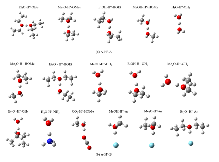
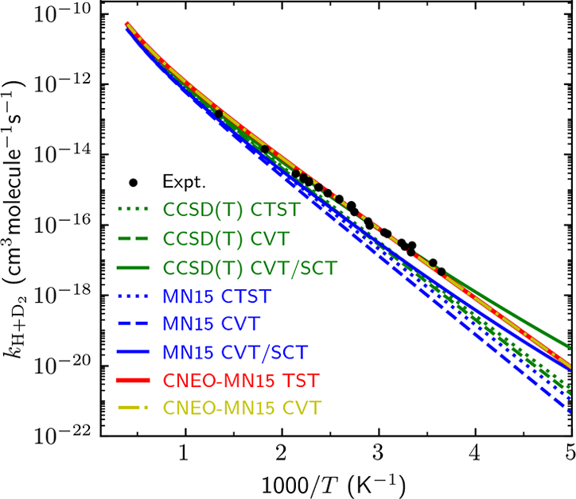
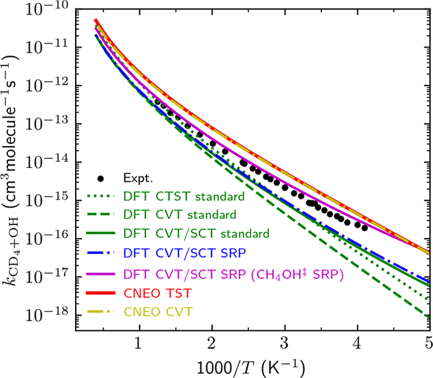
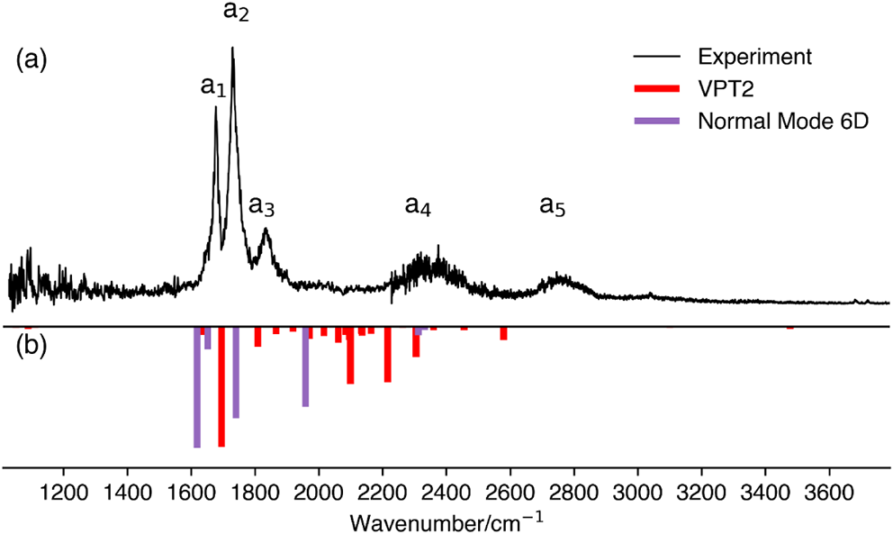
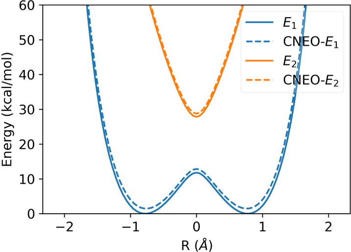

# 威斯康星大学麦迪逊分校Yang Yang 研究组工作总结：CNEO理论及其应用

## 基本信息

**Yang Yang**（杨阳）
- **单位**：University of Wisconsin-Madison
  - Theoretical Chemistry Institute
  - Department of Chemistry
- **邮箱**：yyang222@wisc.edu
- **研究领域**：理论化学、多组分量子化学、核量子效应、质子转移反应
- **核心贡献**：开发约束核电子轨道（Constrained Nuclear-Electronic Orbital, CNEO）理论

2026年2月17日，美国斯隆基金会（Alfred P. Sloan Foundation）公布2026年度斯隆研究奖（Sloan Research Fellowships）获奖名单，共126位青年科学家当选。该奖项被誉为"诺奖风向标"，自1955年设立以来，已有59位获奖者后续获得诺贝尔奖，72位获得美国国家科学奖章，17位获得数学界"诺贝尔奖"菲尔兹奖。

每位获奖者将获得7.5万美元奖金，用于在未来两年内支持其研究工作。获奖者覆盖7个领域：化学、计算机科学、地球系统科学、经济学、数学、神经科学和物理学。

化学学科获奖者中包括多位华人学者：
- **Yang Yang**（威斯康星大学麦迪逊分校）：研究理论化学与核量子效应，开发的CNEO（约束核电子轨道）理论为氢相关过程提供了高效准确的理论方法
- **Yayuan Liu**（约翰斯·霍普金斯大学）：专注于电化学和能源存储材料研究
- **Tina Wang**（威斯康星大学麦迪逊分校）：专长于蛋白质工程与定向进化

---

## 核心贡献：CNEO理论框架

### 理论背景与动机

在传统量子化学方法中，基于Born-Oppenheimer近似，原子核通常被当作经典粒子处理。然而，这一近似在处理轻原子核（特别是氢）时面临严重挑战：

**核量子效应**（Nuclear Quantum Effects, NQEs）包括：
- **零点能**（Zero-Point Energy, ZPE）：即使在绝对零度，量子核仍具有振动能
- **量子离域化**（Quantum Delocalization）：核不再位于固定位置，而是以概率分布存在
- **量子隧穿**（Quantum Tunneling）：粒子可以穿越经典力学禁止的势垒

这些效应在氢键、质子转移、酶催化等过程中起关键作用。例如：
- 水中的反常高质子迁移率
- 酶中的低势垒氢键（Low-Barrier Hydrogen Bonds, LBHBs）
- 氢原子转移反应中的显著动力学同位素效应（Kinetic Isotope Effects, KIEs）

### CNEO的核心思想

CNEO理论基于一个关键的物理洞察：**虽然量子核具有类似于电子的空间离域化密度分布，但它们的密度分布要局域得多**。基于这一物理事实，CNEO通过**用量子波函数描述某些核（如质子）**，并**用核期望位置表示这些核的经典位置**，然后在Lagrangian中**引入约束条件固定核的期望位置**，最终通过**最小化包含约束的总能量**得到CNEO能量曲面。

这使得CNEO能够**同时描述核的量子性和经典性**，**生成包含核量子效应的有效势能面**，同时**保持与传统电子结构方法相当的计算效率**。

### 数学表述

在多组分量子化学框架下，CNEO的能量函数为：

$$
E_{\text{CNEO}} = \langle \Psi_{\text{elec}} \Psi_{\text{nuc}} | \hat{H} | \Psi_{\text{elec}} \Psi_{\text{nuc}} \rangle
$$

其中：
- $\Psi_{\text{elec}}$ 是电子波函数
- $\Psi_{\text{nuc}}$ 是选定量子核（通常是质子）的波函数
- $\hat{H}$ 是多组分Hamiltonian

**约束条件**：固定量子核的期望位置
$$
\langle \Psi_{\text{nuc}} | \hat{\mathbf{R}}_p | \Psi_{\text{nuc}} \rangle = \mathbf{R}_p^0
$$

**Lagrangian**：
$$
\mathcal{L} = E_{\text{CNEO}} - \sum_p \lambda_p \left( \langle \Psi_{\text{nuc}} | \hat{\mathbf{R}}_p | \Psi_{\text{nuc}} \rangle - \mathbf{R}_p^0 \right)
$$

通过变分原理求解，得到包含核量子效应的有效势能面。

---

## 主要研究方向与成果

### 1. CNEO-DFT：理论基础与实现

Yang Yang课题组开发了CNEO-DFT的**解析能量梯度和Hessian**，使得在包含核量子效应的能量曲面上**进行结构优化**、**准确预测振动频率**（特别是涉及氢原子的模式）以及**进行CNEO分子动力学模拟**成为可能。

#### 计算特点

| 特性 | 说明 |
|------|------|
| **计算成本** | 与传统DFT同量级，额外开销通常小于20% |
| **量子核处理** | 仅对选定质子进行量子化，其余原子核保持经典处理 |
| **实现与软件** | 共享质子体系采用修改版PySCF；QM/MM分子动力学由GROMACS完成 |

#### 性能表现

在一系列分子的振动频率计算中，CNEO-DFT显著优于传统DFT：

**测试系统**以共享质子体系为主，包含11个[A·H⁺·B]型复合物与5个[A·H⁺·A]型复合物（共16个）。

**测试结果**显示CNEO-DFT在质子转移振动模式上显著优于传统DFT，且是否加入电子-质子相关泛函会明显影响精度：

| 体系 | DFT MAE | CNEO/no-epc MAE | CNEO/epc17-2 MAE | CNEO/epc17-1 MAE |
|------|---------|----------------|-----------------|----------------|
| [A·H⁺·B] | 452 $\mathrm{cm^{-1}}$ | 123 $\mathrm{cm^{-1}}$ | 139 $\mathrm{cm^{-1}}$ | 443 $\mathrm{cm^{-1}}$ |
| [A·H⁺·A] | 170 $\mathrm{cm^{-1}}$ | 56 $\mathrm{cm^{-1}}$ | 42 $\mathrm{cm^{-1}}$ | 166 $\mathrm{cm^{-1}}$ |

---

### 2. 质子转移反应的应用

#### 共享质子系统（Shared-Proton Systems）

**研究对象**涵盖11种[A·H⁺·B]型二元复合物：
- 包括Zundel离子（$\ce{H2O}$·H⁺·$\ce{H2O}$，即$\ce{H5O2+}$）
- 以及其他体系（A、B = $\ce{NH3}$、$\ce{CO2}$、Ar、MeOH、EtOH、Me₂O、Et₂O等）

**关键发现**表明CNEO-DFT在**质子转移模式（PTM）频率预测**方面显著改善，能够同时处理对称与非对称共享质子体系。

以$\ce{H2O–H+–NH3}$为例，实验光谱中PTM峰位在2649 $\mathrm{cm^{-1}}$，CNEO-DFT（no-epc与epc17-2）能够准确捕捉该峰位，而传统DFT与epc17-1明显高估该频率。对于[A·H⁺·A]型体系，PTM频带主要集中在600–1100 $\mathrm{cm^{-1}}$范围内，CNEO-DFT（no-epc或epc17-2）的平均误差约50 $\mathrm{cm^{-1}}$，而DFT与epc17-1的误差通常超过150 $\mathrm{cm^{-1}}$。

#### 双质子转移：甲酸二聚体（Formic Acid Dimer, FAD）

**研究方法**包括CNEO-MD模拟、机器学习辅助自由能面构建以及通量–侧相关函数计算透射系数。

**关键结果**（单位来自原文表格，速率为$\mathrm{ps^{-1}}$）：

| 指标 | DFT（200 K） | CNEO-DFT（200 K） | DFT（400 K） | CNEO-DFT（400 K） |
|------|-------------|------------------|-------------|------------------|
| **自由能垒** | 8.77 $\mathrm{kcal/mol}$ | 3.51 $\mathrm{kcal/mol}$ | 9.75 $\mathrm{kcal/mol}$ | 3.82 $\mathrm{kcal/mol}$ |
| **TST速率** | $8.83\times10^{-9}$ | 0.0044 | $1.37\times10^{-4}$ | 0.23 |
| **校正速率** | $7.18\times10^{-9}$ | 0.0034 | $1.03\times10^{-4}$ | 0.15 |

此外，静态势垒从8.20 $\mathrm{kcal/mol}$（DFT）降至2.70 $\mathrm{kcal/mol}$（CNEO-DFT）。CNEO-DFT显著降低了有效势垒并提高速率，同时由于量子离域化导致的再交叉效应更明显，需要通过通量–侧相关函数修正。

#### 2.3 氢原子转移反应：CNEO-TST

**研究对象**：
- $\ce{D + H2 -> DH + H}$与$\ce{H + D2 -> HD + D}$  
- $\ce{CH4 + OH -> CH3 + H2O}$与$\ce{CD4 + OH -> CD3 + HDO}$

**方法创新**：CNEO过渡态理论（CNEO-TST）
- 使用CNEO最小化能量面（包含ZPE和浅隧穿效应）
- 结合传统TST框架计算速率常数

**性能比较**（以$\ce{CH4 + OH}$为例，Arrhenius活化能$E_a$，单位为$\mathrm{kcal/mol}$）：

| 300 K | 实验 | DFT-CTST（标准因子） | CNEO-TST | CNEO-TST（epc17-2） |
|-------|------|----------------------|----------|---------------------|
| $E_a$ | 3.7 | 5.0 | 4.2 | 3.9 |

下图给出$\ce{H + D2 -> HD + D}$反应的Arrhenius曲线，展示CNEO‑TST与CNEO‑CVT在宽温区内对实验速率的跟踪效果。

**动力学同位素效应**（KIE）：
- 在$\ce{CH4 + OH}$与$\ce{CD4 + OH}$体系中，CNEO-TST在不做经验缩放的情况下即可给出与实验较接近的KIE，但仍有轻微低估
- 传统CTST在该体系中表现良好主要依赖误差抵消，难以保证可迁移性

下图为$\ce{CD4 + OH -> CD3 + HDO}$反应速率常数对比，用于评估同位素反应的动力学表现。

**计算成本**：
- 依托CNEO-DFT构造能量面，整体开销与传统DFT-TST同量级
- 相比路径积分方法更经济，适合批量反应速率评估

---

### 3. CNEO-QM/MM：走向复杂系统

#### 方法设计

**嵌入方案**采用静电嵌入，QM区用CNEO-DFT处理并包含关键质子，MM区用经典力场处理环境，QM区的电子密度受MM区点电荷影响。

**总能量表达式**为：
$$
E_{\text{total}} = E_{\text{CNEO-QM}} + E_{\text{MM}} + E_{\text{QM/MM}}^{\text{inter}}
$$

其中 $E_{\text{QM/MM}}^{\text{inter}}$ 包括QM区与MM区的静电相互作用、范德华相互作用以及边界处理（如link atoms）。

#### 应用案例

**谷氨酸-谷氨酸盐复合物**模拟了酶中的低势垒氢键。**关键发现**：
- 在水相几何优化中，DFT QM/MM预测$\ce{O-H}=1.05$ Å、$\ce{O...H}=1.45$ Å、$\ce{O...O}=2.49$ Å，质子明显偏向一侧；
- CNEO-DFT QM/MM预测$\ce{O-H}=1.17$ Å、$\ce{O...H}=1.29$ Å、$\ce{O...O}=2.45$ Å，质子更接近等距共享（两侧差约0.12 Å）；
- 动力学模拟中，CNEO-DFT QM/MM显示更频繁的质子转移，体现核量子离域化效应的增强。

**物理意义**在于核量子效应使质子**更易离域**，低势垒氢键更趋向共享态，且溶剂化对几何的影响在CNEO框架下更为温和。

---

### 4. 周期性CNEO-DFT：扩展系统

将CNEO理论扩展到周期性边界条件：
- **方法实现**基于CP2K的Gaussian‑augmented plane wave（GAPW）框架，同时处理电子与量子核，量子核作为局域可区分粒子处理。
- **应用示例**包括Pt(111)表面氢吸附与二维面内运动熵的计算，展示核量子效应在表面吸附与热力学性质中的作用。

---

### 5. 光谱学应用

在红外光谱预测方面，**研究对象**包括$\ce{OH-(H2O)2}$与$\ce{OH-(H2O)3}$水合团簇，CNEO-DFT谐振动与CNEO-MD可直接对比实验峰位并给出未解析峰的指认：

| 体系 | 实验峰位（$\mathrm{cm^{-1}}$） | CNEO谐振动（$\mathrm{cm^{-1}}$） | CNEO‑MD 300 K（$\mathrm{cm^{-1}}$） | 备注 |
|------|-------------------------------|----------------------------------|------------------------------------|------|
| $\ce{OH-(H2O)2}$ | 1669、1730、1819、2310、2731 | 1614、1627、1920、2207 | 1635、1820、2044、2213、2447 | a4、a5峰被赋值为与IHB伸缩相关的组合/泛频峰，a3仍存在不确定性 |
| $\ce{OH-(H2O)3}$ | 1680、1848、2063/2140、2586、2842（肩峰） | 1638.5、1638.7、2470、2471、2717 | 1629、2014、2533 | a2、a3在谐振动中缺失，CNEO‑MD提示其为组合带并呈温度展宽 |

下图为$\ce{OH-(H2O)2}$实验谱与VPT2、NM‑6D理论结果的对比。

**应用价值**体现在作为实验光谱解析的理论工具、鉴别氢键网络结构以及研究溶剂化动力学。

---

### 6. 电子-质子相关泛函评估

#### 研究背景

在多组分DFT中，除了经典的电子-电子相关泛函，还需要**电子-质子相关泛函**来准确描述电子与量子质子间的关联。

#### 测试的泛函

1. **epc17-1**：早期的电子-质子相关泛函
2. **epc17-2**：改进版本

#### 评估结果

在共享质子体系的PTM频率预测中，epc泛函对精度影响显著：

| 体系 | DFT MAE | CNEO/no-epc MAE | CNEO/epc17-2 MAE | CNEO/epc17-1 MAE |
|------|---------|----------------|-----------------|----------------|
| [A·H⁺·B] | 452 $\mathrm{cm^{-1}}$ | 123 $\mathrm{cm^{-1}}$ | 139 $\mathrm{cm^{-1}}$ | 443 $\mathrm{cm^{-1}}$ |
| [A·H⁺·A] | 170 $\mathrm{cm^{-1}}$ | 56 $\mathrm{cm^{-1}}$ | 42 $\mathrm{cm^{-1}}$ | 166 $\mathrm{cm^{-1}}$ |

#### 建议

**当前最佳实践**：
> 在更准确的电子-质子相关泛函开发之前，推荐使用**不含电子-质子相关泛函的CNEO-DFT**进行振动光谱计算。

**未来方向**：
- 开发新的电子-质子相关泛函
- 系统评估不同体系的epc重要性
- 探索体系依赖的相关泛函

---

## 方法学比较

### 与其他核量子效应方法的对比

| 方法 | 准确性 | 计算成本 | 系统大小 | 优点 | 缺点 |
|------|--------|----------|----------|------|------|
| **路径积分分子动力学**（PIMD） | 很高 | 极高 | ~100原子 | 包含全部NQEs | 计算成本极高，难以应用于大系统 |
| **环聚合物分子动力学**（RPMD） | 高 | 高 | ~200原子 | 准确描述速率 | 仍较昂贵 |
| **多组分波函数方法**（NEO） | 高 | 高 | ~50原子 | 全量子处理 | 假设量子核瞬间响应经典核运动 |
| **半经典轨迹方法** | 中等 | 中等 | ~500原子 | 包含隧穿 | 近似较多 |
| **变分过渡态理论+多维隧穿**（CVT/SCT） | 高 | 中等 | 不限 | 准确描述速率 | 需预先知道反应路径 |
| **传统DFT** | 低（对氢） | 低 | 不限 | 快速 | 忽略NQEs |
| **CNEO-DFT** | 高 | 低 | 不限 | **优点**：包含核离域化，成本与传统DFT相当|**缺点**：浅隧穿近似，不包含深层隧穿 |

### CNEO的独特优势

CNEO具有四大独特优势：

- **量子-经典耦合**：量子核（质子、氕子）用波函数描述，经典核（重原子）用点电荷描述，具有根据需要选择量子核的灵活性
- **有效势能面**：包含零点能和浅隧穿效应，可直接用于传统动力学方法，避免了路径积分的巨大计算成本
- **多尺度建模**：易于与QM/MM、机器学习及增强采样结合
- **软件生态兼容**：可集成到现有量子化学包，使用熟悉的DFT泛函和基组，学习成本低

---

## 应用领域与案例

### 1. 共享质子与氢键体系

共享质子复合物的PTM频率与红外光谱是CNEO最重要的验证场景之一，涵盖[A·H⁺·B]与[A·H⁺·A]体系，系统性对比实验峰位与理论谱图。

### 2. 溶剂化与QM/MM

CNEO-QM/MM在水相中研究了酚–水复合物与谷氨酸–谷氨酸盐复合物，量化溶剂化与核量子离域化对氢键几何与质子位置的影响，并通过分子动力学展示更频繁的质子转移行为。

### 3. 反应动力学

在甲酸二聚体双质子转移中，CNEO-MD通过自由能面与通量–侧相关函数得到校正速率；在$\ce{CH4 + OH}$与同位素反应中，CNEO-TST给出与实验接近的活化能与KIE。

### 4. 光谱学

CNEO-DFT与CNEO-MD用于$\ce{OH-(H2O)2}$和$\ce{OH-(H2O)3}$红外谱线指认，补全实验中未明确的峰位归属，并解释温度展宽效应。

### 5. 周期性与凝聚相

周期性CNEO-DFT方法为凝聚态核量子效应提供了可扩展框架，可用于质子导体与固体氢键网络等系统的结构与振动性质研究。

## 当前挑战与解决方案

### 挑战1：深层隧穿效应

**问题描述**：CNEO主要包含浅隧穿，对深层隧穿描述不足。浅隧穿指的是隧穿能量仅略低于有效势垒顶部的隧穿，而深层隧穿涉及能量远低于势垒顶部的隧穿过程，后者在某些低温反应中可能起重要作用。

**可能的解决方案**：
- 结合**Wigner隧穿校正**来补充深层隧穿贡献
- 与**瞬子（Instanton）理论**结合以获得更准确的隧穿速率
- 开发更精确的核量子态展开方法来扩展CNEO的隧穿描述能力

### 挑战2：电子-质子相关

**问题描述**：在多组分DFT中，除了经典的电子-电子相关泛函，还需要**电子-质子相关泛函**来准确描述电子与量子质子间的关联。现有epc泛函性能有限。

**研究进展**：
- epc17-1：在两类共享质子体系中都接近传统DFT表现，误差较大
- epc17-2：精度与no-epc接近，部分体系略有优势
- no-epc：整体最稳定，且更易收敛

**未来方向**：
- 开发机器学习辅助泛函
- 构建体系依赖的相关泛函
- 从高精度量子化学数据学习更准确的电子-质子关联形式

### 挑战3：大系统应用

**问题描述**：全量子处理的计算成本随量子核数快速增加，限制了CNEO在超大系统中的应用。

**应对策略**：
- **选择性量子化**：只对关键质子（如参与质子转移或氢键的质子）进行量子处理，而将其他质子视为经典粒子
- **分层方法**：核心区用CNEO处理，外层区用经典力场处理
- **机器学习势**：训练ML势以替代昂贵的CNEO计算，实现高效的大系统模拟

### 挑战4：激发态与时间演化

**当前局限**：CNEO主要处理基态性质。

**扩展方向**：
- 开发**CNEO-TDDFT**（含时密度泛函理论）以处理激发态质子转移
- 构建**非绝热CNEO动力学**方法来研究非绝热过程
- 应用CNEO于**超快光谱过程模拟**，如泵浦-探针光谱和二维光谱的理论解析

在Shin–Metiu模型上，CNEO‑Ehrenfest与CNEO‑FSSH通过冻结核CNEO有效势能面引入核量子离域化效应，用于评估非绝热动力学中的透射与布居行为。

## 对领域的影响与意义

### 科学价值

1. **填补空白**：CNEO位于传统DFT（忽略NQEs）与全量子动力学（昂贵）之间，提供了**性价比最优**的解决方案，使大系统中包含核量子效应成为可能
2. **理论创新**：提出了量子-经典耦合的新范式，巧妙应用约束优化方法，构建了可扩展的多组分框架
3. **方法统一**：将静态和动态性质研究统一在一个框架下，兼容多种电子结构方法，并易于与多尺度建模结合

### 实际应用价值

1. **药物设计**：CNEO能够准确预测药物-靶标结合自由能，深入理解酶催化机制，并指导药物分子的结构优化，特别适用于涉及质子转移和氢键的药物设计项目
2. **催化科学**：CNEO可用于设计高效催化剂、优化反应条件以及降低能耗，通过准确描述催化循环中的质子转移步骤来揭示催化机理
3. **能源技术**：CNEO可应用于燃料电池膜材料优化、氢存储材料设计以及人工光合作用系统的研究
4. **环境化学**：CNEO有助于大气化学反应建模、污染物降解路径预测以及碳循环过程的理解

---

## 代表性论文列表

以下条目均已与本地PDF核对。

### 理论方法发展

1. **CNEO‑MD方法**：Chen, Z.; Yang, Y. *J. Phys. Chem. Lett.* **2023**, 14, 279-286. DOI：10.1021/acs.jpclett.2c02905
2. **周期性CNEO‑DFT**：Chen, Z.; Yang, Y. *J. Chem. Theory Comput.* **2025**, 21, 7865-7877. DOI：10.1021/acs.jctc.5c00837

### 应用：质子转移

3. **共享质子系统**：Yang, Y.; Zhang, Y.; Yang, Y.; Xu, X. *J. Chem. Phys.*（已接收稿，2024）DOI：10.1063/5.0243086
4. **双质子转移**：Zhang, Y.; Liu, Z.; Yang, Y. *J. Chem. Theory Comput.* **2025**, 21, 5400-5408. DOI：10.1021/acs.jctc.5c00532
5. **CNEO‑TST**：Chen, Z.; Zheng, J.; Truhlar, D. G.; Yang, Y. *J. Chem. Theory Comput.* **2025**, 21, 590-604. DOI：10.1021/acs.jctc.4c01521

### 应用：多尺度建模

6. **CNEO‑QM/MM**：Zhao, X.; Chen, Z.; Yang, Y. *J. Chem. Phys.*（已接收稿）DOI：10.1063/5.0226271

### 应用：非绝热动力学

7. **非绝热动力学**：Liu, Z.; Chen, Z.; Yang, Y. *J. Phys. Chem. Lett.* **2025**, 16, 6559-6569. DOI：10.1021/acs.jpclett.5c01020

### 应用：光谱学

8. **水合团簇红外光谱**：Liu, Z.; Wang, Y.; Zhang, Y.; Yang, N.; Yang, Y. *J. Phys. Chem. A* **2025**, 129, 9883-9894. DOI：10.1021/acs.jpca.5c04334
