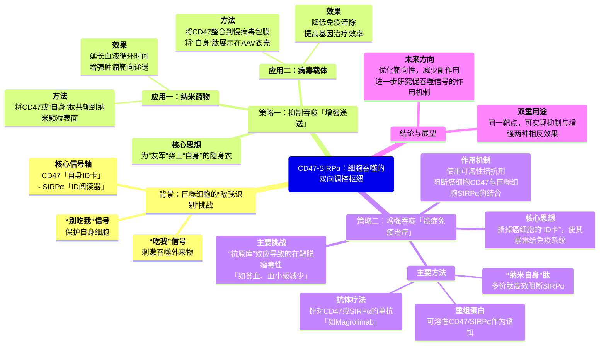

# **『"别吃我" vs "吃我"』：细胞世界的攻防战，CD47肽的双重妙用**

## **本文基本信息**

- **标题**：Suppressing or Enhancing Macrophage Engulfment through the Use of CD47 and Related Peptides (通过使用CD47及其相关肽抑制或增强巨噬细胞的吞噬作用)
- **期刊**：Bioconjugate Chemistry
- **Citation**: *Bioconjugate Chem.* 2022, 33, 1989-1995
- Corresponding Author: Dennis E. Discher 
  - Biophysical Engineering Laboratories and Bioengineering Graduate Group, University of Pennsylvania, Philadelphia, Pennsylvania 19104, United States
  - orcid.org/0000-0001-6163-2229; Email: discher@seas.upenn.edu

## **摘要**

外来颗粒和微生物在体内会被巨噬细胞迅速清除，尽管许多关键的摄取机制仍不清楚。“自身”细胞表达CD47，它作为巨噬细胞上SIRPα的抗吞噬配体发挥作用，特别是当促吞噬配体（如抗体）同时展示时。在此，我们综述了CD47及相关的“自身”肽作为巨噬细胞摄取的调节剂。与CD47或源自其SIRPα结合位点的肽共轭的纳米颗粒，**可以在体外和体内抑制巨噬细胞的吞噬摄取**，在展示CD47的病毒上也发现了类似的现象。因此，作为有效载荷的药物、染料和基因对靶细胞的递送效率得以提高。另一方面，**癌细胞表达的CD47使其能够逃避巨噬细胞和免疫监视**。这推动了针对CD47-SIRPα的可溶性拮抗剂的开发，从临床上的阻断性抗体到临床前模型中的合生肽。因此，**CD47及其肽正在成为具有双重用途的、抗击疾病的吞噬作用调节剂**。

## 引言

吞噬作用是一种古老而基础的细胞过程，指的是对一个目标的吞食行为。对于变形虫而言，细菌和真菌是其吞噬的目标，这个过程几乎不需要或完全不需要辨别。然而，在动物体内，诸如巨噬细胞之类的吞噬细胞必须**识别、攻击并优先吞噬“异己”目标，同时避免伤害健康的“自身”细胞**。这些先天性免疫吞噬细胞是宿主抵御各种大小入侵微生物的第一道防线。

吞噬作用由**“吃我”信号**所激发，这些信号会启动肌动蛋白细胞骨架的重塑，从而驱动巨噬细胞伸出突起以包裹——并随后内化和摧毁——一个“异己”目标。**相关的驱动因素范围广泛**，从高度特异性的生物分子相互作用物（如蛋白质-蛋白质相互作用），到特异性较低的表面效应物（如电荷、吸附的物质、配体模式），再到物理化学特征（如刚度、形状）。与这些“吃我”通路相对的，是能够抑制巨噬细胞摄取的“别吃我”信号分子。这篇简要综述将聚焦于通过调控特定的**“别吃我”信号轴——CD47-SIRPα**——来调节巨噬细胞对纳米颗粒、病毒和癌细胞清除方面的最新进展。

## 巨噬细胞检查点，CD47-SIRPα

**“自身标记”蛋白CD47是一种普遍表达的整合膜蛋白，它通过与巨噬细胞受体SIRPα相互作用来抑制吞噬摄取**。尽管CD24与Siglec-10之间的相互作用可能是另一个潜在的巨噬细胞检查点，但CD47-SIRPα相互作用在许多高等动物中的研究更为透彻且更为保守。对巨噬细胞摄取的抑制作用涉及SIRPα胞质区的**免疫受体酪氨酸基抑制基序（ITIM）**的磷酸化，并激活**磷酸酶SHP-1和SHP-2**。

CD47与SIRPα之间的结合相互作用倾向于是物种甚至是品系特异性的，但也存在一些显著的交叉相互作用，例如人的CD47可以与NOD小鼠和猪的SIRPα结合，而猪的CD47也能与人的SIRPα结合。因此，这种受体-配体相互作用的抑制效应是由蛋白质的序列和结构决定的。

巨噬细胞高效清除体内循环异物的能力，常常**阻碍了基于纳米颗粒的药物递送**，无处不在的巨噬细胞的摄取作用使得药物难以到达预期的靶点，例如癌细胞。这催生了**利用CD47来使固体颗粒和病毒更具耐受性，并增加纳米药物和基因靶向递送效率**的想法。与此相辅相成的一个目标是**拮抗CD47-SIRPα轴以增强吞噬作用**，其中，基于抗体的阻断正迅速成为癌症免疫疗法中一个具有临床意义的新增手段，而小分子抑制性肽段的设计也带来了新的可能性。

xxxxxxxx

**图1：“自身标记”CD47抑制巨噬细胞的吞噬作用**

血清蛋白，如血液中的IgG抗体，会吸附到“外来”颗粒表面或与之特异性结合，刺激吞噬作用。然而，如果巨噬细胞表面的SIRPα与其配体CD47（表达在包括红细胞在内的“自身”细胞上）结合，这种吞噬摄取就会被抑制。

## 展示CD47和“自身”肽的纳米颗粒通过延迟清除来增强递送

静脉注射的纳米颗粒具有在所有组织和病灶部位循环的潜在优势。然而不幸的是，这类被注射的纳米颗粒通常在**数分钟到数小时内就被单核吞噬细胞系统（MPS）清除**，特别是肝脏和脾脏中的巨噬细胞。作为对比，新鲜的红细胞（RBCs）在输注后可以循环数周甚至更长时间，但最终同样会被巨噬细胞清除，尤其是在脾脏中。

巨噬细胞识别并清除一个纳米颗粒的具体机制尚不完全清楚。已知的是，**血液中的血清蛋白会物理吸附并积聚在所有表面，形成一个“蛋白质冠”**，这个冠可以与吞噬细胞的受体作用。其中最显著的是**免疫球蛋白G（IgG）**，它可以结合并激活巨噬细胞的Fc受体（FcRs）。这个过程通常被称为**调理作用（opsonization）**，它代表了生物材料领域长期以来的描述：纯净的化学物质在体内几乎总会被“污染”。**聚乙二醇化（PEGylation）是延长纳米颗粒循环的经典方法**，它倾向于延迟蛋白质在表面的物理吸附，但清除过程仅仅是被推迟了。

调理作用会导致与巨噬细胞的相互作用，但细胞与材料的相互作用还会受到物理性质的进一步调节，例如**刚度、尺寸和曲率（形状）**，这些都已被证明是影响巨噬细胞清除纳米颗粒的因素。由于巨噬细胞的摄取，纳米颗粒的循环半衰期较短，这一局限性为**修饰它们以使其更像“自身”**提供了机会（如图2所示）。

将CD47的胞外域（约100个氨基酸）通过生物素化连接到涂有抗生物素蛋白的、细胞大小的聚苯乙烯微球上，**足以在微球被抗生物素蛋白IgG调理后，抑制其被吞噬**。重要的是，**CD47对缺少IgG的微球没有影响**。微球实验的成功鼓励了后续的纳米微珠研究，并推动了一种相关的、由21个氨基酸组成的“自身”肽的合成。

体内测试表明，**CD47和“自身”肽都能通过延迟脾脏巨噬细胞的清除，来增加纳米微珠在小鼠体内的循环半衰期，从而极大地增强了肿瘤成像和药物在肿瘤部位的递送效率**。随后，一个独立的实验室将“自身”肽连接到氧化石墨烯纳米片上，报告了相似的结果，并得出结论：“自身”肽比PEGylation更有效。其他实验室的研究也表明，用重组CD47或“自身”肽对纳米材料进行功能化，通常能**延长循环时间、抑制清除并改善治疗效果**。

另一项应用将“自身”肽连接到纳米脂质体上，与对照组纳米脂质体不同，研究者发现它们能够**饱和并“钝化”肝脏巨噬细胞**，从而增加了后续注射的其他纳米颗粒的循环时间和功效。在这些不同的纳米颗粒上，血清中起调理作用的IgG的沉积是否在结果中扮演了角色，通常尚不明确。尽管如此，各项研究都凸显了将CD47或更短的“自身”肽偶联到各种纳米材料上在多种应用中的实用价值。

xxxxxxxxxx

**图2：CD47肽延长循环并增加靶向递送**

载药纳米颗粒（左）和携带基因的慢病毒（右）由于被吞噬细胞摄取，其疗效有限。将CD47及相关的“自身”肽连接到纳米颗粒和病毒表面，它们可以与巨噬细胞上的SIRPα结合，帮助将其识别为“自身”，从而延长循环时间并增强靶向递送。

## 展示“自身”信号的病毒能够抑制吞噬作用并增强基因递送

基于病毒的基因递送已广泛用于临床，例如疫苗（如新冠病毒的刺突蛋白）和细胞的离体工程改造（如CAR-T细胞）。在静脉注射以实现靶向基因递送的尝试中，**慢病毒（Lentivirus）**和**腺相关病毒（AAV）**载体最为常见，但巨噬细胞同样会被激活以清除这些“天然的纳米颗粒”，这可能导致病毒诱导的炎症反应。许多团队尝试通过偶联合成聚合物来抑制单核吞噬细胞系统（MPS）介导的病毒清除，以期最小化调理作用；然而，这类修饰的空间位阻会妨碍病毒与目标靶点结合所必需的关键蛋白质相互作用。

慢病毒通常是在细胞系胞吐后收获的，因此，通过适当改造的细胞系**过表达膜蛋白CD47**，原则上可以产生展示CD47的慢病毒。已有两项独立研究确实成功生成了**CD47-慢病毒**，并证实其能减少与巨噬细胞的相互作用并改善基因递送效果。

- **第一项研究**用对照组或CD47-慢病毒递送红色荧光蛋白（RFP）到分化的人类巨噬细胞培养物中，结果显示：

  1. CD47-慢病毒的转导效率比对照组低约3倍。
  2. 表达SIRPα的A549肺腺癌细胞**优先被CD47-慢病毒转导**。（不是抑制吗？）

  后一个结果表明，SIRPα充当了CD47介导的附着和感染的“停靠受体”。在体内也观察到了相似结果：在A549肿瘤中，使用CD47-慢病毒的转基因表达水平更高，而肝脏和脾脏巨噬细胞中的表达则相对于对照组显著降低。研究还通过基于抗体的SIRPα相互作用抑制实验来验证其特异性。

- **第二项研究**利用人源CD47来提高慢病毒在肝脏基因转移的效率。在确定了肝脏巨噬细胞会清除静脉注射的慢病毒后，研究发现**CD47-慢病毒增加了对肝细胞的基因转移，同时减少了对巨噬细胞的转移**。这些实验在两种小鼠模型中进行：一种是能表达与人源CD47结合的SIRPα的NOD小鼠，另一种是亲和力较弱的C57BL/6小鼠。结果显示，**CD47-慢病毒在C57BL/6小鼠中的清除率更高**。其安全性和有效性在与人类CD47和SIRPα序列同源性更高的非人灵长类动物中得到了进一步证实。

这些研究表明，**展示CD47能够保护像慢病毒这样的有膜病毒免受巨噬细胞的清除，从而增强基因转移疗法的功效**。与慢病毒类似，在临床上具有重要意义的腺相关病毒载体（AAV）上展示“自身”肽，在体外也导致了AAV的吞噬易感性降低。由于AAV没有膜包被，研究人员将“自身”肽直接引入AAV2的衣壳蛋白中，并用甘氨酸-丝氨酸接头（linker）连接以确保衣壳稳定并最小化病毒滴度的损失。这种插入对转导效率几乎没有影响，但与对照组AAV2相比，**在人类巨噬细胞中，病毒的摄取量降低了多达10倍**。当用抗SIRPα抗体进行阻断后，这种差异再次消失。

AAV的尺寸仅为20纳米，而慢病毒约为100纳米。鉴于CD47-SIRPα是吞噬摄取的特异性抑制剂，而非内吞作用的抑制剂，迄今为止CD47偶联病毒的研究结果，共同凸显了**巨噬细胞对纳米颗粒进行吞噬的高效性**。在细胞生物学文献中，吞噬作用常被认为仅与较大的实体（颗粒、凋亡细胞或微生物）相关，但早期对尺寸差异巨大的颗粒进行的实验，并未充分考虑到颗粒浮力的差异和其他尺寸效应。如果很少有小颗粒沉降，那么被摄取的自然就少。然而，浮力在体内并不重要。在上述纳米颗粒和病毒的研究中，肝脏和脾脏中的巨噬细胞之所以突出，是因为这些巨噬细胞排列在这些组织的血管壁上，从而能够直接、即时地接触到静脉注射的颗粒。尽管如此，巨噬细胞仍然存在于所有组织中，并且通常是肿瘤或穿刺/损伤部位等病灶处的主要细胞类型。摄取途径对于最终结果也很重要：例如，**吞噬体（phagosomes）比内涵体（endosomes）对货物的氧化和破坏性更强**。所有这些因素都对数十亿剂作为疫苗注射的病毒（例如，强生或牛津-阿斯利康新冠疫苗中由腺病毒递送的DNA）具有深远影响。

## 可溶性CD47-SIRPα拮抗剂增强吞噬作用

CD47在细胞表面普遍表达，但早在几十年前，人们不仅记录了CD47在卵巢癌中的过表达，而且在CD47序列被测定之前，用于肿瘤成像的抗体靶向最终也被证明能抑制吞噬作用。随后，针对其他癌症的CD47抗体靶向研究也相继展开，并有证据表明在人类肿瘤异种移植模型中存在治疗窗口，尽管最初尚不清楚这种IgG是抑制了吞噬作用，还是激活了FcR驱动的吞噬作用，或是两者兼有。

此外，一项关于在同系小鼠肿瘤模型中使用抗小鼠CD47治疗的研究，在后来的重复性验证中显示，抗CD47单药治疗**没有任何抗肿瘤效果的迹象，反而显示出贫血副作用**。这种单药治疗的负面结果在很大程度上也反映在了临床抗癌实践中，并且这与CD47基因敲除小鼠几乎正常（仅有极小缺陷且无明显贫血）的事实似乎是一致的。后一项由免疫学实验室得出的观察结果，一度引起了血液学家们对CD47所谓“自身标记”功能的极大怀疑。

与单药治疗形成对比的是，**将拮抗CD47-SIRPα巨噬细胞检查点与一个“吃我”信号相结合的策略展现出了巨大的潜力**，并催生了对可溶性拮抗剂研究的爆炸性增长。这些拮抗剂的范围从临床上的各种IgG设计和重组蛋白，到小分子肽，它们都作为可能的药物，对多种血液和实体恶性肿瘤显示出不同程度的疗效。

目前最先进的抗CD47疗法是一种名为**magrolimab**（或Hu5f9-G4）的人源化IgG4单克隆抗体，它能结合CD47并抑制其与SIRPα的结合，但由于IgG4与巨噬细胞FcR的亲和力较弱，因此不会主动激活巨噬细胞。然而，**CD47在体内几乎所有细胞上的表达构成了一个“抗原库”（antigen sink），导致magrolimab等CD47靶向抑制剂的非特异性结合，从而引发了不可避免的在靶毒性，例如贫血和血小板减少症**。为解决这一安全问题，正在进行的努力包括开发对CD47具有强结合力但对人红细胞亲和力低的纳米抗体。

靶向SIRPα受体可能更为安全，因为其表达更具限制性，尽管SIRPα的表达不仅限于髓系细胞，也延伸到了如上皮细胞等其他细胞。一些研究确实表明，**抗SIRPα阻断与抗CD47同样有效，但能维持安全的血液学指标**。一项工程化巨噬细胞的研究进一步证明，将SIRPα阻断与用肿瘤靶向IgG预激活FcR相结合，在缩小已形成的肿瘤方面是有效的。

最近，研究人员基于CD47上与SIRPα结合的β-发夹环结构，开发出了**多价的8个氨基酸组成的“纳米自身”（nano-Self）拮抗剂**。这些肽的变体能够有效阻断CD47-SIRPα的相互作用，并在低至5 nM的浓度下，增强人类巨噬细胞对经抗体调理的人红白血病细胞的内化。同一项研究中的其他观察结果，进一步证实了巨噬细胞上的CD47能与同一细胞上的SIRPα发生顺式相互作用，传递一种自抑制信号，这与早前的观察结果一致。

然而，并非所有将可溶性CD47多肽添加到培养的巨噬细胞中的研究都显示出吞噬作用的增强。奇怪的是，一项早期的研究报告称，用细菌表达的人源CD47蛋白，在体外反而**降低了**小鼠巨噬细胞对胶体乳液的吞噬作用。后续其他团队的研究表明，CD47的相互作用能力需要一种细菌所缺乏的翻译后N-末端修饰才能得到改善，并且特定的人-鼠CD47-SIRPα相互作用本身就特别弱，此外，可能还需要对目标进行IgG调理才能揭示出CD47-SIRPα阻断的效果。所有这些仍然是该领域未来发展中需要重点考虑的因素。

**图3：用于免疫治疗的SIRPα-CD47可溶性拮抗剂**

肿瘤细胞表达巨噬细胞检查点CD47以抑制吞噬作用。单独的IgG抗体调理作用因CD47的“别吃我”信号而不足以引发有效的吞噬。但多种策略可以拮抗这种抑制。目前至少有三种免疫治疗策略正在临床前和临床研究中进行：抗CD47或抗SIRPα的抗体、作为抑制剂的可溶性蛋白版本，以及相关的“自身”肽拮抗剂。小分子（绿色三角）最终可能被开发出来抑制CD47的转录，但仍需要一个“吃我”信号。

## 结论

**SIRPα-CD47轴正成为一个在递送和治疗等多种应用中越来越有吸引力的靶点**。展示CD47或相关肽段的纳米颗粒和病毒被巨噬细胞识别为“自身”，从而延迟了这些颗粒的吞噬，延长了循环时间，并增加了染料、药物和基因的靶向递送。未来需要进一步的研究来理解这些纳米颗粒和病毒上的促吞噬信号（即调理作用和蛋白质冠的形成）。

与此同时，旨在增强吞噬作用（特别是对癌细胞的吞噬）的可溶性拮ក抗剂正在持续开发和探索中，这**展示了该研究领域发展的双重用途**。在全身性注射拮抗剂（如抗CD47 IgG）后，限制其脱靶效应仍然是挑战。至少有一项近期的有趣尝试是使用纳米颗粒来同时阻断CD47并调理癌细胞，但这当然要求纳米颗粒既能躲避巨噬细胞，又能接触到肿瘤细胞。小尺寸有助于渗透到实体瘤中，而最近合成的一种紧凑的环状“纳米自身”肽已被证明能在体外增强原代巨噬细胞对经单抗靶向的黑色素瘤的吞噬，为体内的疗效测试奠定了基础。

## CD47-SIRPα信号轴的双向应用策略对比

| **对比维度**         | **策略一：增强递送 (模拟“别吃我”信号)**                      | **策略二：增强吞噬 (阻断“别吃我”信号)**                      |
| -------------------- | ------------------------------------------------------------ | ------------------------------------------------------------ |
| **核心思想**         | 为药物/基因载体穿上**“自身”隐身衣**，使其逃避免疫系统清除。  | 撕掉癌细胞的**“自身”伪装**，使其暴露给免疫系统攻击。         |
| **关键分子工具**     | **CD47蛋白**或其衍生的**“自身”肽**，直接偶联在纳米载体（如纳米颗粒、病毒）表面。 | **可溶性拮抗剂**，如：抗CD47/SIRPα抗体 (Magrolimab)；重组蛋白/“纳米自身”拮抗肽 |
| **作用机制**         | 载体表面的“自身”肽**激活**巨噬细胞SIRPα的抑制性信号通路，从而**抑制**对载体的吞噬作用。 | 拮抗剂**阻断**癌细胞CD47与巨噬细胞SIRPα的结合，从而**解除**对癌细胞吞噬作用的抑制。 |
| **主要应用领域**     | **纳米药物递送**(延长循环，增强肿瘤靶向) **基因治疗**(保护病毒载体，提高转导效率) | **癌症免疫治疗**(特别是与“吃我”信号药物联用，治疗血液瘤和实体瘤) |
| **主要挑战与副作用** | 需确保修饰不影响载体自身的功能；蛋白质冠等其他清除机制的影响尚不明确。 | 严重的**在靶脱瘤毒性 (on-target, off-tumor toxicity)**因健康细胞（尤其是红细胞）也表达CD47，导致**贫血、血小板减少**等副作用。 |