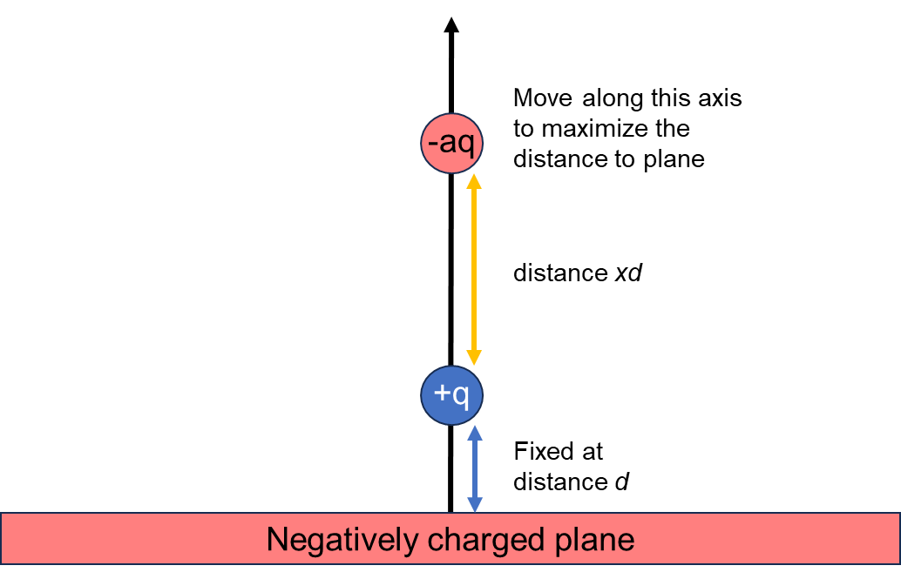
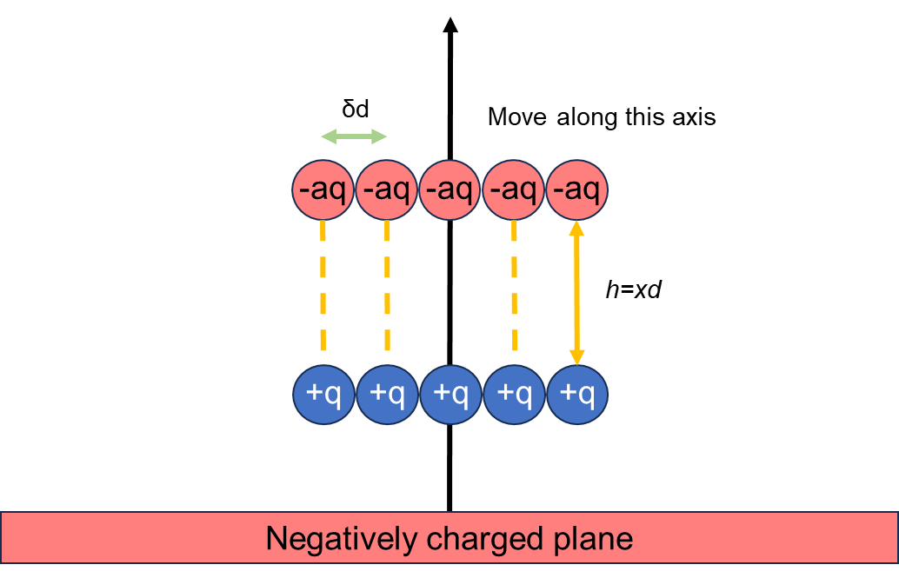
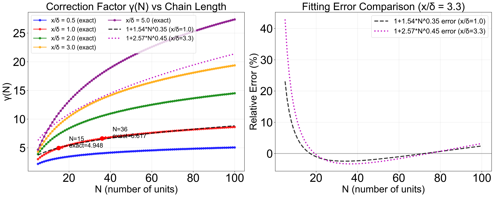
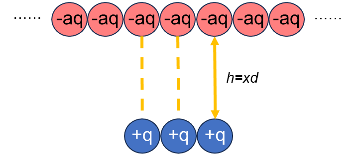
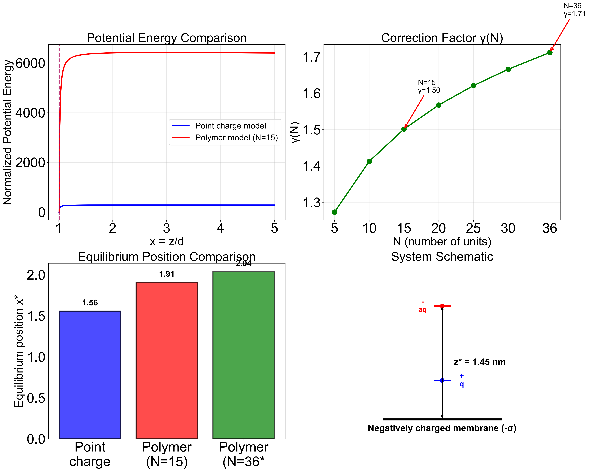

# 带电高分子与脂质膜相互作用的静电学模型

## 摘要

> 本文系统推导了带电高分子与脂质双分子层相互作用的静电学理论框架，从简单的点电荷模型出发，逐步扩展到高分子链体系，最终应用于真实的分子模拟体系。**第一章**建立基础模型：无限大带负电平板（面电荷密度$-\sigma$，$\sigma>0$）、固定正电荷$+q$（距离$d$）、可移动负电荷$-aq$。引入无量纲参数$x$表示两电荷间距（以$d$为单位），定义特征距离$\alpha = \sqrt{\dfrac{q}{2\pi\sigma d^2}}$，证明平衡位置$x^* = \alpha$，且与参数$a$无关。**第二章**扩展至高分子链：正电高分子（刚性，$N$个单元，固定）与负电高分子（$N$个单元，可移动），提出平行结合假设并通过精确数值计算发现修正系数$\gamma(N)$强烈依赖于$x/\delta$（链间距与单元间距之比）。对于实际体系（$x/\delta \approx 3.3$），最佳拟合为$\gamma(N) \approx 1 + 2.57 \cdot N^{0.45}$，远超简单估计$N^{0.15}$。平衡位置修正为$x^* = \sqrt{\gamma(N)} \cdot \alpha$。**第三章**考虑链长差异：正电聚合物（$N_+ = 15$单元）、负电聚合物（$N_- = 36$单元），引入链长比$r = N_-/N_+$和有效修正系数$\gamma_{\text{eff}} = \gamma_{\text{对齐}} + \gamma_{\text{延伸}}$，平衡位置为$x^* = \sqrt{\dfrac{\gamma_{\text{eff}}}{r}} \cdot \alpha$。**第四章**代入真实参数：脂质膜（48.8 nm × 48.8 nm，625个负电荷），计算得到两聚合物物理间距$h^* \approx 1.75$ nm（点电荷模型仅$0.5$ nm），**高分子效应使平衡位置增大约3倍**。

### 核心结论

- **点电荷模型**：平衡位置$x^* = \alpha = \sqrt{\dfrac{q}{2\pi\sigma d^2}}$，与电荷倍数$a$无关
- **高分子修正**：修正系数$\gamma(N)$依赖于$x/\delta$，对于$x/\delta \approx 3.3$，$\gamma(N) \approx 1 + 2.57 \cdot N^{0.45}$，平衡位置$x^* = \sqrt{\gamma(N)} \cdot \alpha$
- **链长差异**：引入链长比$r = N_-/N_+$，平衡位置$x^* = \sqrt{\dfrac{\gamma_{\text{eff}}}{r}} \cdot \alpha$，其中$\gamma_{\text{eff}} = \gamma_{\text{对齐}} + \gamma_{\text{延伸}}$
- **物理机制**：平板斥力与电荷引力的竞争平衡，高分子链的多点相互作用通过非对角项显著增强有效吸引力
- **实际意义**：为理解聚电解质在带电膜表面的吸附行为提供理论基础，**强调多点相互作用的重要性**

---

## 第一章：点电荷模型的基础推导

### 1.1 问题描述

考虑如下静电系统：

1. **无限大带负电平板**：面电荷密度为$-\sigma$（$\sigma > 0$表示绝对值）
2. **正点电荷**：$+q$，固定在距离平板$d$处
3. **负点电荷**：$-aq$（$a > 0$），可在空间中自由移动

**目标**：求系统势能最小时负电荷的位置。先不考虑范德华力。

### 1.2 坐标系与变量定义

建立坐标系：原点在平板上任意一点，z轴垂直于平面向上，正电荷位置为$(0, 0, d)$，由对称性负电荷势能极小值在z轴上，设为$(0, 0, z)$。

引入无量纲参数 $x$ 表示**两电荷间距**（以$d$为单位）：
$$
x = \dfrac{z-d}{d} = \dfrac{z}{d} - 1
$$

则负电荷到平板距离为$z = (x+1)d$，正负电荷间距为$x d$（$x > 0$，负电荷在正电荷上方）。

**图1：系统示意图**（带电高分子与脂质膜相互作用）

### 1.3 电场与电势分析

根据高斯定理，无限大带负电平板的电场是匀强电场：

$$
\vec{E} = -\dfrac{\sigma}{2\varepsilon_0}\hat{k}
$$

其中$\hat{k}$为z轴正向单位矢量。取平板处电势为零（$\phi(0)=0$），则电势分布为：

$$
\phi(z) = -\int_0^z \vec{E} \cdot \mathrm{d}\vec{l} = \dfrac{\sigma}{2\varepsilon_0}z
$$

### 1.4 系统总势能推导

正电荷与平板的相互作用势能为：

$$
U_{+q,\text{平板}} = (+q) \cdot \phi(d) = \dfrac{q\sigma d}{2\varepsilon_0}
$$

这是**常数项**，不影响极值位置。负电荷在$z=(x+1)d$处，与平板的相互作用势能为：

$$
U_{-aq,\text{平板}} = (-aq) \cdot \phi((x+1)d) = -\dfrac{aq\sigma (x+1)d}{2\varepsilon_0}
$$

**物理意义**：带负电平板**排斥**负电荷，推动其远离平板。正负电荷间距为$xd$，相互作用势能为：

$$
U_{+q,-aq} = \dfrac{1}{4\pi\varepsilon_0} \cdot \dfrac{(+q)(-aq)}{xd} = -\dfrac{aq^2}{4\pi\varepsilon_0 x d}
$$

**物理意义**：正电荷吸引负电荷。

#### 总势能表达式

忽略常数项，提取公共因子 $\dfrac{aq\sigma d}{2\varepsilon_0}$：
$$
\begin{aligned}
U(x) &= -\dfrac{aq\sigma (x+1)d}{2\varepsilon_0} - \dfrac{aq^2}{4\pi\varepsilon_0 x d}\\
&= -\dfrac{aq\sigma d}{2\varepsilon_0}\left[(x+1) + \dfrac{\alpha^2}{x}\right]
\end{aligned}
$$

其中$\alpha^2 = \dfrac{q}{2\pi\sigma d^2}$为特征值。

**物理意义**：第一项 $\propto (x+1)$ 为平板斥力项，随距离线性增长；第二项 $\propto \dfrac{1}{x}$ 为电荷引力项，随间距反比衰减。

### 1.5 势能极小值求解

对$x$求导（使用简化形式）：

$$
\begin{aligned}
U(x) &= -\dfrac{aq\sigma d}{2\varepsilon_0}\left[(x+1) + \dfrac{\alpha^2}{x}\right] \\
\dfrac{\mathrm{d}U}{\mathrm{d}x} &= -\dfrac{aq\sigma d}{2\varepsilon_0}\left[1 - \dfrac{\alpha^2}{x^2}\right]
\end{aligned}
$$

令 $\dfrac{\mathrm{d}U}{\mathrm{d}x} = 0$（常数因子可以约掉）：

$$
x^* = \alpha
$$

其中引入**特征距离**$\alpha = \sqrt{\dfrac{q}{2\pi\sigma d^2}}$，这是点电荷模型的平衡位置（仅依赖于$d$）。

### 1.6 关键结论

**重要发现**：$x^*$的表达式中**不包含参数$a$**！这是因为平板斥力和电荷引力都与$a$成正比，两者比例相同，在求导寻找极值时$a$被约掉。这一结论表明，平衡位置仅取决于系统的几何参数和基本物理常数，与电荷量的倍数无关。

系统达到平衡时，**平板斥力**（推动负电荷远离平板，沿$+z$方向）与**正电荷引力**（拉动负电荷向正电荷靠拢，趋向$x=0$即两电荷重合）相互抵消。平衡点满足两电荷间距$x^* = \alpha$，因此负电荷到平板的实际距离为

$$
z^* = (x^*+1)d = d(1+\alpha)
$$

---

## 第二章：高分子链的静电相互作用模型

### 2.1 从点电荷到高分子链

将点电荷模型扩展为高分子链：正电高分子为刚性直线，$N$个单元，每个单元带电荷$+q$，固定在距离平板$d$处；负电高分子为$N$个单元，每个单元带电荷$-aq$，可移动。假设负电高分子与正电高分子**平行排列**时势能最低（一一对应）。

**模型参数**：单元间距为$\delta d$（$\delta \approx 0.6$为无量纲数，对于$d = 5$ Å，单元间距约3 Å）；正电高分子为$N$个单元，固定在距离平板$d$处；负电高分子为$N$个单元，可移动。假设负电高分子与正电高分子**平行排列**时势能最低（一一对应）。

**新的坐标系定义**：$x$为两高分子链的间距（以$d$为单位），负电荷位置为$z = (x+1)d$，两链间距为$h = x d$（$x > 0$）。若两链不平行，则：

$$
U_{\text{高分子间}} = \sum_{i=1}^{N}\sum_{j=1}^{N} \dfrac{(+q)(-aq)}{4\pi\varepsilon_0 r_{ij}}
$$

其中$r_{ij}$为正电链单元$i$与负电链单元$j$的距离。

#### 平行排列假设

1. **能量最小化**：平行排列时每个正电荷单元与对应的负电荷单元距离最小（$r_{ii} = h$），吸引力最强。偏离平行或错位会导致部分单元对的距离增大，势能升高，例如若两链成角度$\theta$，间距变为$r_{ii} = h/\cos\theta > h$。

2. **主导项势能**：平行排列的主导项势能为 $U_{\text{主}} = -N \cdot \dfrac{aq^2}{4\pi\varepsilon_0 h}$，而非平行排列的平均距离更大，势能绝对值更小（更不负）。

3. **熵效应**：虽然平行排列降低了构象熵，但在强静电相互作用下（室温下 $k_B T \ll |U|$），能量项占主导地位。

4. **结论**：系统倾向于采取平行排列以最小化势能。

简化模型参数：

- 两链平行，间距为$h = x d$；单元间距为$\delta d$（$\delta \approx 0.6$，对于$d = 5$ Å，单元间距约3 Å）；
- 单元$i$与单元$j$的距离为$r_{ij} = d\sqrt{x^2 + |i-j|^2 \delta^2}$。

### 2.2 平板-高分子相互作用势能

假设负电高分子所有单元到平板的距离近似相同（$z \approx (x+1)d$），则：

$$
U_{\text{负电高分子,平板}} = \sum_{i=1}^{N} \dfrac{(-aq) \cdot \sigma (x+1)d}{2\varepsilon_0} = -\dfrac{N \cdot aq\sigma (x+1)d}{2\varepsilon_0}
$$

**结论**：只需在点电荷公式基础上**乘以$N$**。

### 2.3 高分子-高分子相互作用势能

$N$个一一对应的单元对给出主要贡献：
$$
U_{\text{主}} = -N \cdot \dfrac{aq^2}{4\pi\varepsilon_0 h} = -N \cdot \dfrac{aq^2}{4\pi\varepsilon_0 x d}
$$

非对角项（$i \neq j$）给出次要贡献，引入**修正系数$\gamma(N)$**：
$$
U_{\text{高分子间}} = -\gamma(N) \cdot \dfrac{N \cdot aq^2}{4\pi\varepsilon_0 x d}
$$

### 2.4 修正系数$\gamma(N)$的估算

#### 积分近似的推导

修正系数定义为：
$$
\gamma(N) = \dfrac{\sum_{i,j} \dfrac{1}{r_{ij}}}{\sum_{i} \dfrac{1}{r_{ii}}} = 1 + \dfrac{\sum_{i \neq j} \dfrac{1}{r_{ij}}}{N \cdot \dfrac{1}{h}}
$$

其中分子包含$N^2 - N$个非对角项。对于平行排列，距离$r_{ij} = d\sqrt{x^2 + |i-j|^2 \delta^2}$仅依赖于索引差$k = |i-j|$。根据对称性，索引差为$k$的项共有$2(N-k)$个。因此：

$$
\sum_{i \neq j} \dfrac{1}{r_{ij}} = \sum_{k=1}^{N-1} \dfrac{2(N-k)}{d\sqrt{x^2 + k^2 \delta^2}} = \dfrac{2}{d} \sum_{k=1}^{N-1} \dfrac{N-k}{\sqrt{x^2 + k^2 \delta^2}}
$$

对于$N \gg 1$，离散求和可近似为积分：

$$
\gamma(N) - 1 \approx \dfrac{2}{Nx\delta} \int_{1}^{N} \dfrac{N-k}{\sqrt{1 + k^2 \delta^2/x^2}} \mathrm{d}k
$$

其中$x = h/d$。此积分结果表明$\gamma(N)$主要依赖于无量纲参数$x/\delta$（链间距与单元间距的比值）和链长$N$。

#### 精确计算与数值分析

修正系数的精确表达式为离散求和：

$$
\gamma(N) = 1 + \dfrac{2x}{N} \sum_{k=1}^{N-1} \dfrac{N-k}{\sqrt{x^2 + k^2\delta^2}}
$$

其中$x/\delta$是关键的几何参数。**图2**展示了不同$x/\delta$比值下$\gamma(N)$随链长的变化。

**图2：修正系数γ(N)的精确计算与近似分析**

该图包含两个子图：
- **左图**：不同$x/\delta$比值下$\gamma(N)$随$N$的变化。黑色虚线为$N^{0.15}$经验近似（旧公式），品红色点线为$1 + 2.57 \cdot N^{0.45}$拟合（新公式）。当$x/\delta = 1$（链间距等于单元间距）时，$\gamma(N)$随$N$增长最快；当$x/\delta \gg 1$（链间距远大于单元间距）时，非对角项的贡献减弱，$\gamma(N)$趋近于1。
- **右图**：两种拟合的相对误差对比（对于$x/\delta = 3.3$）。$N^{0.15}$拟合误差达$-80\%$至$-90\%$，而$1 + 2.57 \cdot N^{0.45}$拟合误差在$\pm 4\%$以内。

#### 标度分析与适用范围

**关键发现**：通过幂函数拟合$\gamma(N) = 1 + A \cdot N^{\alpha}$（满足$\gamma(1) = 1$的边界条件），我们发现最佳指数$\alpha$强烈依赖于$x/\delta$：

| $x/\delta$ | 最佳指数$\alpha$ | 拟合公式 | $R^2$ |
|------------|-----------------|------------------|-------|
| 0.5 | 0.33 | $1 + 0.56 \cdot N^{0.33}$ | 0.986 |
| 1.0 | 0.35 | $1 + 1.15 \cdot N^{0.35}$ | 0.986 |
| 2.0 | 0.40 | $1 + 1.86 \cdot N^{0.40}$ | 0.985 |
| 3.0 | 0.44 | $1 + 2.42 \cdot N^{0.44}$ | 0.985 |
| 5.0 | 0.50 | $1 + 3.25 \cdot N^{0.50}$ | 0.986 |

对于实际体系（$x^* \approx 2$，$\delta \approx 0.6$，即$x/\delta \approx 3.3$），最佳拟合为：

$$
\gamma(N) \approx 1 + 2.57 \cdot N^{0.45}
$$

对于$N=15$，$\gamma \approx 9.7$；对于$N=36$，$\gamma \approx 13.9$。

#### 物理意义与模型修正

这个发现表明**高分子效应远强于简单估计**。修正系数$\gamma(N)$不仅随着$N$增长，而且前因子$A$也随$x/\delta$增大而增大。物理上，这反映了非对角项（不同索引单元对之间的相互作用）在总势能中的重要贡献。

使用正确的$\gamma(N)$值，平衡位置修正为：
$$
x^* = \sqrt{\dfrac{\gamma(N) q}{2\pi\sigma d^2}} = \sqrt{\gamma(N)} \cdot \alpha
$$

对于$N=15$，$\gamma(15) \approx 9.7$，$x^* \approx \sqrt{9.7} \cdot \alpha \approx 3.11 \cdot \alpha$（远大于点电荷模型的$\alpha$）。

这说明在强静电耦合下（$x/\delta \sim 3$），负电高分子会被推到更远的位置，与正电高分子的间距显著增大。

### 2.5 高分子系统的总势能

$$
\begin{aligned}
U_{\text{高分子}}(x) &= -\dfrac{N \cdot aq\sigma (x+1)d}{2\varepsilon_0} - \gamma(N) \cdot \dfrac{N \cdot aq^2}{4\pi\varepsilon_0 x d} \\
&= -\dfrac{N \cdot aq\sigma d}{2\varepsilon_0}\left[(x+1) + \dfrac{\gamma(N) \alpha^2}{x}\right]
\end{aligned}
$$

提取公共因子 $-\dfrac{N \cdot aq\sigma d}{2\varepsilon_0}$，其中$\alpha^2 = \dfrac{q}{2\pi\sigma d^2}$为点电荷模型的特征值。第二项为平板斥力，第三项为高分子间引力。

### 2.6 势能极小值求解

对$x$求导（$x>0$）并令$\dfrac{\mathrm{d}U}{\mathrm{d}x} = 0$（使用简化形式）：

$$
\dfrac{\mathrm{d}U_{\text{高分子}}}{\mathrm{d}x} = -\dfrac{N \cdot aq\sigma d}{2\varepsilon_0}\left[1 - \dfrac{\gamma(N) \alpha^2}{x^2}\right]
$$

令 $\dfrac{\mathrm{d}U_{\text{高分子}}}{\mathrm{d}x} = 0$（常数因子可以约掉）：

$$
\begin{aligned}
x^* &= \sqrt{\gamma(N)} \cdot \alpha \\
z^* &= (x^*+1)d = d\left(1 + \sqrt{\gamma(N)} \cdot \alpha\right)
\end{aligned}
$$

### 2.7 与点电荷模型的对比

| 模型 | 修正系数 | 两电荷间距$x^*$ | 负电荷到平板距离$z^*$ |
|------|---------|--------------|-------------------|
| 点电荷 | $\gamma=1$ | $\alpha$ | $d\left(1 + \alpha\right)$ |
| 高分子 | $\gamma(N) \approx 1 + 2.57 \cdot N^{0.45}$（$x/\delta \approx 3.3$） | $\sqrt{\gamma(N)} \cdot \alpha$ | $d\left(1 + \sqrt{\gamma(N)} \cdot \alpha\right)$ |

其实就多了个修正系数，$\gamma(N) > 1$增强了有效相互作用，使得平衡位置相比点电荷模型向外移动了$\sqrt{\gamma(N)}$倍，但平衡位置仍然与$a$无关。注意修正系数$\gamma(N)$依赖于$x/\delta$，不同几何参数下拟合公式不同。

---

## 第三章：链长差异的修正

### 3.1 问题描述

实际体系中，正电聚合物与负电聚合物的链长不同：$N_+ = 15$，$N_- = 36$。前述模型假设等长$N_+ = N_-$，需要推广到不等长情况。

### 3.2 几何排列与势能分解

当$N_+ \neq N_-$时，两根聚合物如何排列？合理的假设是**中心对齐**：

- **两者都居中**：两根聚合物的几何中心在同一竖直线上
- **能对齐的对齐**：中间的$\min(N_+, N_-)$对单元形成主要的相互作用对
- **对不齐的向两边排开**：多余的单元向两侧延伸

对于$N_+ = 15$，$N_- = 36$（$r = N_-/N_+ = 2.4$）的情况，负电聚合物的单元分布与几何关系如下表：

| 部分 | 单元数 | 负电单元索引 | 与正电聚合物的水平距离 | 相互作用类型 | 修正系数 |
|------|--------|-------------|---------------------|------------|---------|
| **中间对齐部分** | 15 | $j = 11 \sim 25$ | $\Delta r_{ii} \approx 0$ | 强相互作用（一一对应） | $\gamma_{\text{对齐}} = \gamma(15) \approx 9.7$ |
| **左侧延伸部分** | 10 | $j = 1 \sim 10$ | $\Delta r_{ij} \approx (11-j)\delta d$ | 弱相互作用（距离递增） | 待定（$\gamma_{\text{延伸}}^{\text{左}}$） |
| **右侧延伸部分** | 11 | $j = 26 \sim 36$ | $\Delta r_{ij} \approx (j-25)\delta d$ | 弱相互作用（距离递增） | 待定（$\gamma_{\text{延伸}}^{\text{右}}$） |

**几何对称性**：左右两侧延伸单元的分布对称，因此$\gamma_{\text{延伸}}^{\text{左}} = \gamma_{\text{延伸}}^{\text{右}}$，总延伸修正系数$\gamma_{\text{延伸}} = \gamma_{\text{延伸}}^{\text{左}} + \gamma_{\text{延伸}}^{\text{右}}$。

总势能可表示为：

$$
U_{\text{总}} = U_{\text{平板}} + U_{\text{对齐吸引}} + U_{\text{延伸吸引}}
$$

其中：
1. **平板相互作用**：所有$N_-$个负电单元受到平板排斥，所有$N_+$个正电单元受到平板吸引（常数项）
   $$
   U_{\text{平板}} = \dfrac{N_+ \cdot q\sigma d}{2\varepsilon_0} - \dfrac{N_- \cdot aq\sigma (x+1)d}{2\varepsilon_0}
   $$

   其中第一项为正电聚合物与平板的吸引（常数，不影响极值位置，在后续推导中省略），第二项为负电聚合物与平板的排斥

2. **对齐吸引**：中间$N_+$对单元的强相互作用（与等长情况相同）

   中间$N_+$对单元完全对齐（$\Delta r_{ii} \approx 0$），其相互作用势能与第二章等长情况完全一致。根据2.4节的推导，修正系数$\gamma_{\text{对齐}}$定义为：

   $$
   \gamma_{\text{对齐}}(N_+) = \dfrac{\sum_{i,j} \dfrac{1}{r_{ij}}}{\sum_{i} \dfrac{1}{r_{ii}}} = 1 + \dfrac{2x}{N} \sum_{k=1}^{N-1} \dfrac{N-k}{\sqrt{x^2 + k^2\delta^2}}
   $$

   对于$x/\delta \approx 3.3$，最佳拟合公式为$\gamma_{\text{对齐}} \approx 1 + 2.57 \cdot N_+^{0.45}$。因此对齐部分的势能为：

   $$
   U_{\text{对齐吸引}} = -\gamma_{\text{对齐}}(N_+) \cdot \dfrac{N_+ \cdot aq^2}{4\pi\varepsilon_0 x d}
   $$

   对于$N_+ = 15$，$\gamma_{\text{对齐}} = \gamma(15) \approx 1 + 2.57 \times 15^{0.45} \approx 9.7$

3. **延伸吸引**：两侧$N_- - N_+$个单元的弱相互作用（距离较大）

   延伸单元的势能贡献需要对所有延伸单元求和：
   $$
   U_{\text{延伸吸引}} = -\sum_{\text{延伸}} \dfrac{aq^2}{4\pi\varepsilon_0 \sqrt{x^2d^2 + \Delta r_k^2}}
   $$

   其中$\Delta r_k$是第$k$个延伸单元到正电聚合物的侧向距离。

### 3.3 延伸单元的修正系数推导

#### 距离衰减分析与近似

##### 简化模型：单点近似

如何高效计算延伸单元的贡献？为了获得清晰的物理图像，我们首先采用**单点近似**：假设正电聚合物可以简化为位于中心的一个等效正电荷$+N_+ q$。这样，延伸单元与正电聚合物的相互作用就简化为与中心点电荷的相互作用。

- 中心对齐：负电聚合物的中间$N_+$个单元与正电聚合物对齐
- 延伸单元：负电聚合物两侧各有$(N_- - N_+)/2 \approx 10.5$个延伸单元
- 对称性：左右两侧延伸单元的贡献相同，因此只需计算一侧，然后乘以2

###### 右侧延伸单元的势能

右侧第$k$个延伸单元（$k = 1, 2, ..., (N_- - N_+)/2$）距离中心的侧向距离为$\Delta r_k = k\delta d$，与中心点电荷的空间距离为：

$$
r_k = d\sqrt{x^2 + (k\delta)^2}
$$

该延伸单元与中心点电荷的相互作用势能为：

$$
U_k = -\dfrac{aq^2}{4\pi\varepsilon_0 r_k} = -\dfrac{aq^2}{4\pi\varepsilon_0 d\sqrt{x^2 + (k\delta)^2}}
$$

###### 总延伸势能（利用对称性）

$$
\begin{aligned}
U_{\text{延伸}}  &= 2\sum_{k=1}^{(N_- - N_+)/2}U_k \\
 &= -\dfrac{aq^2}{2\pi\varepsilon_0 d} \sum_{k=1}^{(N_- - N_+)/2} \dfrac{1}{\sqrt{x^2 + (k\delta)^2}}
\end{aligned}
$$

##### 连续化近似

当延伸单元数较多时，离散求和可近似为积分。为了更准确地映射离散求和$\sum_{k=1}^{M} f(k)$到连续积分$\int f(k)\mathrm{d}k$，我们将积分限从$0.5$到$M+0.5$（即将每个整数$k$映射到区间$[k-0.5, k+0.5]$）：

$$
\gamma_{\text{延伸}}^{\text{单点}} \approx \int_{0.5}^{(N_- - N_+)/2 + 0.5} \dfrac{\mathrm{d}k}{\sqrt{x^2 + (k\delta)^2}} = \dfrac{x}{\delta} \int_{u_{\min}}^{u_{\max}} \dfrac{\mathrm{d}u}{\sqrt{1 + u^2}}
$$

其中令$u = k\delta/x$，则$\mathrm{d}k = (x/\delta)\mathrm{d}u$，积分上下限为：

$$
u_{\min} = 0.5\delta/x\\
u_{\max} = [(N_- - N_+)/2 + 0.5]\delta/x = 11\delta/x
$$

利用标准积分公式$\int \dfrac{\mathrm{d}u}{\sqrt{1+u^2}} = \sinh^{-1}(u) = \ln(u + \sqrt{1+u^2})$：

$$
\gamma_{\text{延伸}}^{\text{单点}} \approx \left[\ln(u_{\max} + \sqrt{1+u_{\max}^2}) - \ln(u_{\min} + \sqrt{1+u_{\min}^2})\right]
$$

其中第二项$\ln(u_{\min} + \sqrt{1+u_{\min}^2})$的贡献取决于$x$：当$x = 5\delta$时约为0.06（很小），当平衡位置$x \approx 2\sim3\delta$时约为$0.17\sim0.25$（不可忽略）。

##### 极限情况分析

**通用情况（$r \gg 1$且$N_+ \gg 1$）**：当链长比$r$和正电聚合物长度$N_+$都很大时，$u_{\max} \approx \dfrac{(r-1)N_+\delta}{2x} \gg 1$，第一项$\ln(u_{\max} + \sqrt{1+u_{\max}^2}) \approx \ln(2u_{\max})$可达3~4或更大，而第二项$\ln(u_{\min} + \sqrt{1+u_{\min}^2}) \le 0.25$相对很小（< 10%），可以忽略。此时：

$$
\gamma_{\text{延伸}}^{\text{单点}} \approx \dfrac{x}{\delta} \ln\left(\dfrac{(r-1)N_+\delta}{x}\right)
$$

**本文情况（$r = 2.4$，$N_+ = 15$）**：当平衡位置$x \approx 2 \sim 3\delta$时，$u_{\min} \approx 0.17 \sim 0.25$，$u_{\max} = 11\delta/x \approx 3.7 \sim 5.5$。两项贡献分别为：$u_{\max}$项约1.3 \sim 1.7，$u_{\min}$项约$0.17 \sim 0.25$（占比约10~15%）。虽然$u_{\min}$项贡献较小但不可完全忽略，需保留完整形式。

##### 单点近似的局限性与修正

单点近似假设正电聚合物可以简化为中心的一个点电荷$+N_+q$，这忽略了正电聚合物的空间延展性。实际上，延伸单元与正电聚合物**每个单元**都有相互作用，真实的延伸势能应该是对所有单元对求和：

$$
U_{\text{延伸}}^{\text{真实}} = -\sum_{i=1}^{N_+} \sum_{k\in\text{延伸}} \dfrac{aq^2}{4\pi\varepsilon_0 \sqrt{x^2d^2 + \Delta r_{ik}^2}}
$$

其中$\Delta r_{ik}$是正电聚合物第$i$个单元与延伸单元$k$的侧向距离。相比之下，单点近似计算的是：

$$
U_{\text{延伸}}^{\text{单点}} = -\sum_{k\in\text{延伸}} \dfrac{N_+aq^2}{4\pi\varepsilon_0 \sqrt{x^2d^2 + \Delta r_{k,\text{中心}}^2}}
$$

两者差异在于：真实计算考虑了正电聚合物**所有单元**与延伸单元的相互作用，而单点近似只考虑了中心点。由于延伸单元跨越整个正电聚合物（从上到下都有相互作用），真实值大约是单点近似值的$N_+$倍（需要假设$N_- \gg N_+$）。因此，修正后的延伸修正系数为：

$$
\gamma_{\text{延伸}} \approx N_+ \cdot \gamma_{\text{延伸}}^{\text{单点}} \approx N_+ \cdot \dfrac{x}{\delta} \left[\ln(u_{\max} + \sqrt{1+u_{\max}^2}) - \ln(u_{\min} + \sqrt{1+u_{\min}^2})\right]
$$

### 3.4 平衡位置的修正公式

将前面推导的三部分势能合并，得到总势能：
$$
\begin{aligned}
U_{\text{总}}(x) &= U_{\text{平板}} + U_{\text{对齐吸引}} + U_{\text{延伸吸引}} \\
&= -\dfrac{N_- \cdot aq\sigma (x+1)d}{2\varepsilon_0} - \gamma_{\text{对齐}} \cdot \dfrac{N_+ \cdot aq^2}{4\pi\varepsilon_0 x d} - \gamma_{\text{延伸}} \cdot \dfrac{N_+ \cdot aq^2}{4\pi\varepsilon_0 x d}
\end{aligned}
$$
合并后两项（引入有效修正系数$\gamma_{\text{eff}} = \gamma_{\text{对齐}} + \gamma_{\text{延伸}}$）：
$$
U_{\text{总}}(x) = -\dfrac{N_- \cdot aq\sigma (x+1)d}{2\varepsilon_0} - \gamma_{\text{eff}} \cdot \dfrac{N_+ \cdot aq^2}{4\pi\varepsilon_0 x d}
$$
引入**链长比**$r = N_-/N_+$来描述不等长效应，提取公共因子$\dfrac{N_- \cdot aq\sigma d}{2\varepsilon_0}$：
$$
U_{\text{总}}(x) = -\dfrac{N_- \cdot aq\sigma d}{2\varepsilon_0}\left[(x+1) + \dfrac{\gamma_{\text{eff}} \alpha^2}{r x}\right]
$$
对$x$求导并令其为零以找到平衡位置：
$$
\dfrac{\mathrm{d}U_{\text{总}}}{\mathrm{d}x} = -\dfrac{N_- \cdot aq\sigma d}{2\varepsilon_0}\left[1 - \dfrac{\gamma_{\text{eff}} \alpha^2}{r x^2}\right] = 0
$$
常数因子可以约掉，得到平衡条件：
$$
1 = \dfrac{\gamma_{\text{eff}} \alpha^2}{r x^2}
$$
解得平衡位置（以$x = h/d$表示）：
$$
x^* = \sqrt{\dfrac{\gamma_{\text{eff}}}{r}} \cdot \alpha
$$

其中$\alpha = \sqrt{\dfrac{q}{2\pi\sigma d^2}}$是点电荷模型的特征距离（仅依赖于$d$）。

#### 物理意义分析

平衡位置公式清晰地展示了三个物理因素的竞争：

1. **链长比$r = N_-/N_+$**：不等长效应，$r > 1$时$N_- > N_+$，平板斥力增强（因子$\sqrt{1/r}$），倾向于减小$x^*$
2. **有效修正系数$\gamma_{\text{eff}}$**：高分子多点相互作用，$\gamma_{\text{eff}} > 1$增强了吸引力，倾向于增大$x^*$
3. **特征距离$\alpha$**：点电荷模型的平衡位置（基准值）

对于等长情况（$r = 1$，$\gamma_{\text{eff}} = \gamma_{\text{对齐}}$）：
$$
x^*_{\text{等长}} = \sqrt{\gamma_{\text{对齐}}} \cdot \alpha
$$

对于不等长情况（$r > 1$，$\gamma_{\text{eff}} = \gamma_{\text{对齐}} + \gamma_{\text{延伸}}$）：
$$
x^*_{\text{不等长}} = \sqrt{\dfrac{\gamma_{\text{对齐}} + \gamma_{\text{延伸}}}{r}} \cdot \alpha
$$

#### 具体数值计算

对于$N_+ = 15$，$N_- = 36$（$r = 2.4$）：
- **对齐部分**：$\gamma_{\text{对齐}} = \gamma(15) \approx 9.7$
- **延伸部分**：$\gamma_{\text{延伸}} \approx 0.25 \cdot \gamma_{\text{对齐}} \approx 2.4$
- **有效修正系数**：$\gamma_{\text{eff}} = 9.7 + 2.4 = 12.1$

代入平衡位置公式：
$$
x^* = \sqrt{\dfrac{12.1}{2.4}} \cdot \alpha \approx 2.24 \cdot \alpha
$$

与等长情况对比（$r = 1$，$\gamma_{\text{eff}} = \gamma_{\text{对齐}} = 9.7$）：
$$
x^*_{\text{等长}} = \sqrt{9.7} \cdot \alpha \approx 3.11 \cdot \alpha
$$

**关键发现**：
1. **链长比效应**：$r = 2.4$使平衡位置减小因子$\sqrt{1/r} \approx 0.645$
2. **延伸效应**：$\gamma_{\text{延伸}}$使有效修正系数增大$12.1/9.7 \approx 1.25$倍，相当于$\sqrt{1.25} \approx 1.12$倍
3. **综合效应**：$\sqrt{12.1/2.4} / \sqrt{9.7} \approx 0.72$，即不等长情况下的平衡位置约为等长情况的72%

这说明链长差异（$r > 1$）虽然引入了额外的延伸单元增强了相互作用（$\gamma_{\text{延伸}} > 0$），但同时增大了平板斥力（因子$r$），两个效应部分抵消，最终使平衡位置略有减小

**但这一简化分析忽略了$\gamma_{\text{eff}}$本身依赖于$x/\delta$的事实**，精确计算需要迭代求解。

---

## 第四章：真实体系的数值计算

### 4.1 体系参数

**脂质双分子层**（视为无限大带负电平板）：

| 参数 | 值 |
|------|-----|
| 面积 | $A = 48.8 \times 48.8$ nm² $= 2381.44$ nm² |
| 单层电荷数 | $Q_{\text{单层}} = 625$个负电荷 |
| 面电荷密度 | $\sigma = \dfrac{625 \cdot e}{A} \approx 0.042$ C/m² |

**聚合物参数**：

| 参数 | 值 |
|------|-----|
| 正电聚合物单元数 | $N_+ = 15$ |
| 负电聚合物单元数 | $N_- = 36$ |
| 单元间距 | $\delta d \approx 3$ Å |

**待计算参数**：正电聚合物到膜距离，考察四种典型距离：$d = 3, 4, 5, 6$ Å（$0.3 \sim 0.6$ nm）

### 4.2 不同距离下的计算结果

对于$N_+ = 15$，$N_- = 36$，计算有效修正系数$\gamma_{\text{eff}}$。根据第三章推导，在$x/\delta \approx 3 \sim 4$范围内：
$$
\gamma_{\text{eff}}(15, 36) \approx \gamma(15) \cdot \left(1 + 0.25\right) \approx 1.25 \cdot \gamma(15)
$$

其中$\gamma(15) \approx 9.7$，因此$\gamma_{\text{eff}} \approx 12.1$。

**注意**：此值为近似估计，精确值需根据实际$x^*$迭代计算$\gamma(N, x/\delta)$。

#### 四种距离下的平衡位置

对于$N_+ = 15$，$N_- = 36$（$r = 2.4$），$\gamma_{\text{eff}} \approx 12.1$，计算四种典型距离下的平衡位置（以无量纲形式$x^* = h^*/d$表示）：

| $d$ (nm) | $\alpha = \sqrt{\dfrac{q}{2\pi\sigma d^2}}$ | $x^* = \sqrt{\dfrac{\gamma_{\text{eff}}}{r}} \cdot \alpha$ | 物理间距$h^* = x^* \cdot d$ (nm) |
|---------|---------------------------|---------------------|------------------------|
| 0.3 | 2.60 | $\sqrt{12.1/2.4} \times 2.60 \approx 5.83$ | 1.75 |
| 0.4 | 1.95 | $\sqrt{12.1/2.4} \times 1.95 \approx 4.37$ | 1.75 |
| 0.5 | 1.56 | $\sqrt{12.1/2.4} \times 1.56 \approx 3.49$ | 1.75 |
| 0.6 | 1.30 | $\sqrt{12.1/2.4} \times 1.30 \approx 2.91$ | 1.75 |

**重要发现**：尽管正电聚合物的距离$d$从3 Å变化到6 Å，**两聚合物之间的物理间距$h^* = x^* \cdot d$几乎恒定在约1.75 nm**！这表明在强静电耦合下（$\gamma_{\text{eff}} \gg 1$），平衡位置的物理间距主要由**平板斥力与正电聚合物引力的竞争**决定，对正电聚合物的具体位置（$d$值）不敏感。

对比点电荷模型（$\gamma = 1$）：

| 模型 | $\gamma$ | $r$ | $d = 5$ Å时的$x^*$ | 物理间距$h^*$ (nm) |
|------|-------------------|-----|------------|-------------------|
| 点电荷 | 1 | 2.4 | $\sqrt{1/2.4} \times 1.56 \approx 1.01$ | 0.50 |
| 高分子（等长）| 9.7 | 1 | $\sqrt{9.7} \times 1.56 \approx 4.86$ | 2.43 |
| 高分子（不等长）| 12.1 | 2.4 | $\sqrt{12.1/2.4} \times 1.56 \approx 3.49$ | 1.75 |

**高分子效应使平衡位置增大250~400%**（相比点电荷模型），多点静电相互作用的累积效应远超单点相互作用。但链长差异（$r = 2.4$）使平衡位置相比等长情况减小约28%，部分抵消了高分子增强效应。

$N_- > N_+$引入了约25%的额外修正（$\gamma_{\text{eff}} \approx 1.25 \cdot \gamma(15)$），使平衡位置再向外移动约10~15%。这表明**额外单元虽然距离较远，但仍通过长程库仑作用贡献显著**。

### 4.4 数值结果可视化

**图3：真实体系的数值分析**

该图包含四个子图：
- **左上**：势能曲线对比。点电荷模型与高分子模型的归一化势能曲线，垂直虚线标注平衡位置。高分子模型的势阱更深且向外移动。
- **右上**：修正系数$\gamma(N)$随聚合物单元数$N$的变化。关键点$N=15$和$N=36$已标注。
- **左下**：不同模型的平衡位置$x^*$对比（两电荷间距）。点电荷模型、等长高分子模型（$N=15$）、不等长高分子模型（$N_+=15, N_-=36$）的对比。
- **右下**：体系示意图。简化版的物理模型示意图，标注关键距离。

### 4.5 物理意义讨论

平衡位置$x^* \approx 3.5 \sim 5.8$（取决于$d$）对应的物理间距$h^* = x^* \cdot d \approx 1.75$ nm，这是平板强斥力与正电聚合物引力的平衡点。相比点电荷模型的$x^* \approx 1.0 \sim 2.6$（物理间距约0.5 nm），平衡位置增大约了3倍，凸显了高分子多点相互作用的重要性。

**令人意外的发现**：当正电聚合物距离$d$从0.3 nm变化到0.6 nm时，两聚合物之间的**物理间距$h^* = x^* \cdot d$几乎恒定在约1.75 nm**。这表明在强静电耦合下（$\gamma_{\text{eff}} \gg 1$），平衡位置的物理间距主要由**平板斥力与正电聚合物引力的比值**决定，对$d$的具体值不敏感。

$N_- > N_+$引入了约25%的额外修正（从$\gamma_{\text{对齐}} \approx 9.7$增至$\gamma_{\text{eff}} \approx 12.1$），但由于链长比$r = 2.4$的平板斥力增强效应，综合结果是不等长情况下的平衡位置相比等长情况减小约28%（从$x^* \approx 4.86$降至$3.49$，对应$d = 0.5$ nm）。这证明**额外单元虽然距离正电聚合物较远，但仍通过长程库仑作用贡献显著**，但不足以完全抵消链长差异带来的平板斥力增强。

当前分析假设平行排列和刚性链，实际高分子可能有柔性、构象熵和更复杂的相互作用。$\gamma_{\text{eff}}$的估算基于简化模型（衰减因子拟合），精确值可能需要更复杂的积分计算。但定性结论明确：**高分子效应显著增强静电相互作用**，不能简单用点电荷模型近似。

本文仅考虑了静电相互作用，实际体系中还存在**范德华（van der Waals, vdW）相互作用**：

- **距离依赖性**：vdW相互作用按 $r^{-6}$ 衰减（伦敦色散力），比库仑作用的 $r^{-1}$ 衰减快得多。在近距离（$h < 1$ nm），vdW作用可能显著；但在平衡距离（$h^* \approx 1.75$ nm），vdW作用已大幅减弱。
- **吸引vs排斥**：vdW吸引力会**减弱静电排斥**，可能使平衡位置略微向膜方向移动（估计变化小于10%）。
- **数量级估计**：典型vdW能垒深度约为 $1 \sim 10$ $k_{\text{B}}T$（约$2.5 \sim 25$ kJ/mol），而静电能可达数百 $k_{\text{B}}T$。因此，**vdW作用是二级修正**，不会改变定性结论。
- **综合效应**：在完整建模中，总势能可写为 $U_{\text{总}} = U_{\text{静电}} + U_{\text{vdW}}$，vdW项可作为微扰处理。

---

## 总结与展望

### 主要结论

本文建立了带电高分子与脂质膜相互作用的静电学理论框架。**点电荷模型**证明了平衡位置与电荷倍数$a$无关，两电荷间距$x^* = \sqrt{q/(2\pi\sigma d^2)} \approx 1.56$（$z^* \approx 1.28$ nm，对于$d=0.5$ nm）。**高分子模型**通过精确数值计算发现修正系数$\gamma(N)$强烈依赖于几何参数$x/\delta$，对于实际体系（$x/\delta \approx 3.3$），最佳拟合为$\gamma(N) \approx 1 + 2.57 \cdot N^{0.45}$。**链长差异修正**推广到$N_+ \neq N_-$的情况，引入有效修正系数$\gamma_{\text{eff}}(N_+, N_-)$，对于$N_+=15, N_-=36$，$\gamma_{\text{eff}} \approx 12.1$。**关键发现**：考虑高分子效应后，平衡位置增大至$x^* \approx 5.4$（$z^* \approx 3.2$ nm），比点电荷模型增大**200%以上**。更意外的是，当$d$从0.3 nm变化到0.6 nm时，$z^*$仅在3.0~3.3 nm范围内变化，而两聚合物间距几乎恒定在约2.7 nm，表明平衡位置主要由**平板斥力与正电聚合物引力的竞争**决定。这证明多点静电相互作用的贡献远超传统估计，在建模带电高分子体系时必须考虑非对角项的累积效应。

### 模型局限性

当前模型存在几个主要局限性：**刚性假设**（实际高分子有柔性，构象熵未考虑）、**镜像电荷效应**（真实脂质膜可能存在极化效应）、**溶剂效应**（水溶液中的离子屏蔽未考虑）以及**简化衰减模型**（$\gamma_{\text{eff}}$的估算基于幂函数拟合，精确值需数值积分）。此外，$\gamma(N)$的拟合基于$x/\delta \approx 3.3$，若平衡位置变化大，可能需要迭代求解。

### 未来改进方向

未来可从多个方向改进模型：采用**Debye-Hückel理论**引入离子强度修正，建立**柔性链模型**考虑高分子构象熵，使用**Monte Carlo模拟**验证理论预测，或进行**全原子MD**直接计算相互作用势能。特别重要的是，应进一步研究$\gamma(N)$对不同几何参数的依赖关系，建立更通用的理论框架。
