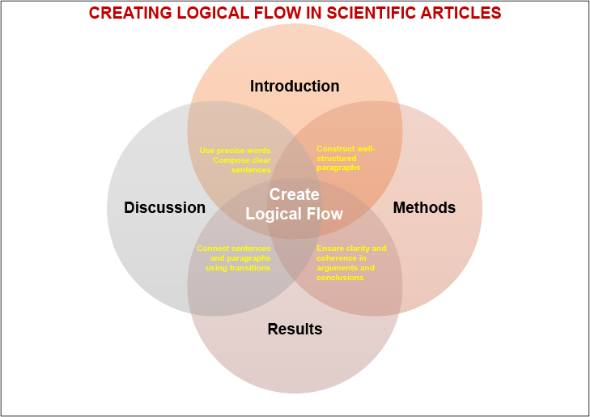
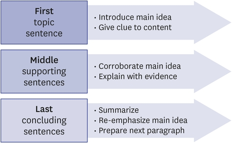
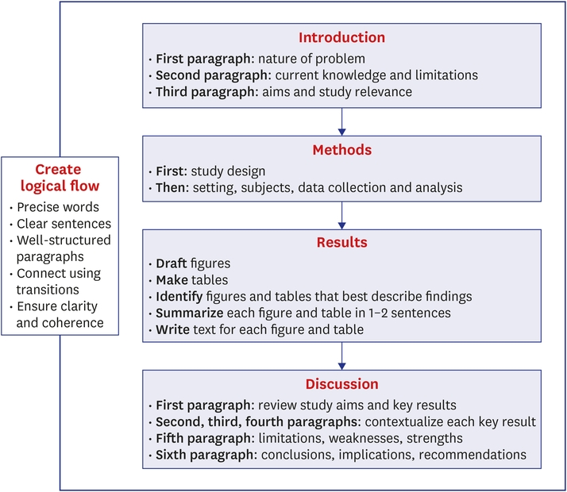

# 科学论文的逻辑流如何建立：从词句段落到 IMRAD 结构

## 本文信息

- **标题**：撰写科学论文时如何建立逻辑流
- **作者**：Edward Barroga, Glafera Janet Matanguihan
- **发表期刊**：Journal of Korean Medical Science
- **发表时间**：2021 年 10 月 18 日
- **DOI**：https://doi.org/10.3346/jkms.2021.36.e275

## 摘要

> 关于如何写科学论文，已有大量指南发表。许多书籍和文章都详细说明了如何提出研究问题、开展文献检索或设计研究方案。然而，关于如何在科学论文写作中建立逻辑流的指南仍然较少。**逻辑流是实现思想、句子、段落和内容平滑而有序推进的关键**，它能把文章导向一个有说服力的结论。本文提供了撰写科学论文正文和主要章节时建立逻辑流的指南。第一步是为整篇文章创建草稿提纲。提纲完成后，再将其发展为一篇单一、连贯、能够合乎逻辑地解释研究的文章。正文中的逻辑流可以通过使用准确简洁的词语、写出清晰的句子，以及连接结构良好的段落来建立。**过渡表达的使用能够连接句子和段落**，从而在呈现学术论证和结论时保证清晰性和连贯性。科学论文主要章节中的逻辑流，则需要在引言、方法、结果和讨论中按顺序呈现整篇文章的完整故事，突出每个章节中最重要的要点，并将这些要点全部连接到研究的主要目的。

**关键词**：Logical Flow；Scientific Writing；Scientific Article；Transitions；Coherence；Clarity

## 引言

科学论文中的逻辑流可以通过练习和学习来培养、打磨。虽然作者在保持内容清晰和组织有序时可能会感到压力很大，但关于如何在科学论文中实现清晰和简洁，已有一些可参考的指南。持续追踪想法，并用清晰、简洁的方式写作，将使读者受益。**由无关文本和跳跃式想法组成的杂乱内容很难理解**。此外，组织混乱的内容会把读者的注意力从科学论文的主要目标或核心焦点上转移开。

一篇写得好的科学论文，需要作者同时具备内容掌握能力和专门的写作技能，将术语、语言、事实和想法编织成高度连贯的信息，并避免重复表达。**清晰而有逻辑的写作，能够有效传播高质量的原始数据及其分析**。

关于科学论文写作的指南已经很多，其中常常包括如何提出研究问题、进行文献检索或设计研究方案的具体说明。然而，仍然需要更多期刊文章来详细说明科学写作中实现逻辑流的连续步骤，并提供已发表论文中的例子。**本文旨在提供具体指南**，帮助作者在撰写科学论文正文和主要章节时建立并维持逻辑流。为说明关键点，本文提供了来自医疗健康领域同行评议科学论文的例子。

## 缺乏写作流畅性的表现

缺乏流畅性的写作，通常没有逻辑论证或结构。它包含别扭的措辞和脱节的句子，无法有效引向下一个合乎逻辑的想法。句子可能是碎片化的、机械的、重复的或夸张的，并且在时态和语言使用上不一致。**缺少过渡会造成短语或段落脱节**，使文本几乎没有连续感。文章会从一个话题跳到另一个话题，也无法提供通往有效结论的证据。

写作流畅性差，会削弱科学论文的统一性和实质内容。读者将无法充分理解研究发现。由于无法理解文章的核心信息，他们可能无法体验作者所描述的现象或事件。通常，这种无法理解源于作者未能传达有说服力的结论和新颖性。**写作流畅性差会造成作者与读者之间的脱节感**，也可能源于作者对内容掌握不足以及写作技能薄弱。

薄弱写作的迹象可能包括：使用缩略或随意用语，不恰当的搭配，不合法或冗余的文本，冗长且难以理解的句子，不合逻辑的论证，名词化，以及不恰当的 hedges。因此，**在撰写科学论文时实现清晰性和逻辑流，是一项必须掌握且值得认真对待的关键技能**。

## 在科学写作中强调逻辑流

逻辑流是思想、句子和段落平滑而有序的推进，没有歧义，也没有过度使用过渡表达。即使作者使用多样化的语言、词序和句子长度，**文体、语气、视角和时态也应保持一致**。

逻辑流使读者能够快速、轻松地理解思想。任何作者的目标都应是以一致、连贯的方式呈现思想，不打断写作流，使读者能够与这些思想建立连接。**要实现可信的论证和稳健的结论**，就需要对研究的内部逻辑有详细理解，并逐步呈现思想和内容之间的逻辑组织与连接。

## 在论文正文中建立逻辑流

在正文中建立逻辑流，需要使用简洁的词语、清晰的句子和结构良好的段落。为保持整体连贯性，句子和段落还应通过适当的过渡表达连接起来。**这样才能形成稳健的论证，并导向合乎逻辑的结论**。

### 使用简洁的词语

要做到简洁，作者应选择简短但含义完整的词语，以最有效地传达研究发现。**写作中的简洁意味着删去冗余词语或夸大的想法**，直接呈现信息，从而保持读者兴趣。使用正确术语或专业词汇，即特定学科术语，一般学术词汇，以及更正式而非口语化的词语，有助于简洁写作。当面对多个表达选项时，应选择最能传达短语含义的词。选择准确词语可以保证文本清晰，避免多余表达。

### 表 1：常见短语、简化形式与写作示例

| 冗长表达 | 简化形式 | 写作示例 |
| --- | --- | --- |
| After the operation | Postoperatively | The patient was in pain postoperatively. |
| A large number of | Many | Many students were tested for the virus. |
| A number of | Several | Several participants dropped out of the study. |
| Are in agreement | Agree | These results agree with previous findings. |
| Are indicative of | Indicate | The pathological findings indicate metastasis. |
| Are found to be | Are | The newly developed drugs are effective. |
| At a rapid rate | Rapidly | The infection is spreading rapidly. |
| At present | Now | A new therapeutic approach is being tested now. |
| At the present time | Presently | Presently, reports on this topic are scarce. |
| As a matter of fact | In fact | In fact, a recent study supports our findings. |
| Because of the fact that | Because | Because he received the vaccine, he recovered. |
| Before the operation | Preoperatively | Ultrasound was performed preoperatively. |
| By means of | By | The tumor was diagnosed by radiography. |
| For the purpose of | For | The intervention was conducted for education. |
| Have the ability to | Can | Students can plan their own presentations. |
| It is possible that | Possibly | Possibly, there was bias in participant selection. |
| In spite of the fact that | Although | Although the drug is under trial, it was administered to the patient. |
| In the final analysis | Finally | Finally, TBL was more effective than lecturing. |
| In the event that | If | If apoptosis is induced, the drug is effective. |
| In order to | To | Randomization was performed to avoid bias. |
| In case of | For | For the control group, the placebo was given. |
| In the future | Soon | Follow-up studies will be conducted soon. |
| It appears that | Apparently | Apparently, the sample size was small. |
| Prior to | Before | Patient consent was obtained before the study. |
| The majority of | Most | Most of the patients were early adolescents. |
| With reference to | Regarding | Regarding author ID, ORCID was used. |
| With the exception of | Except | All cell types were stained except fibroblasts. |

### 写出清晰的句子

句子的清晰性决定了论文的可读性和可理解性。要写出清晰句子，应聚焦一个主题。在不牺牲清晰度的前提下，删除冗余内容，并尽量减少句子中间的插入性碎片，例如 which、that、although、where 和 when。**少用修饰语**，例如 very、basically、generally、specifically，也要避免不必要的 that、who 和 which 从句。

建议改变句子类型、长度和开头方式。写出并列结构的句子，并将表达相同想法的句子合并。可以通过使用代词、重复关键词、插入过渡词或短语来把句子中的想法连接起来，例如 therefore、however 或 consequently。**重点内容可以用简短的陈述句突出**，句子最大长度建议为 20–25 个词，或最多三行。

## Box 1：将冗长或不清晰句子改得更短、更清楚的例子

### Respiratory medicine
- **原句**: A 55-year-old woman was admitted in a hospital complaining of experiencing 10 minutes of chest pain after smoking a cigarette.
- **更短、更清楚的句子**: A 55-year-old woman was admitted for chest pain she felt for 10 minutes after smoking.

### Cardiology
- **原句**: The coronary spasm is specifically an important differential diagnosis of the causes of the chest pain in patients.
- **更短、更清楚的句子**: Coronary spasm is an important differential diagnosis of chest pain.

### Oncology
- **原句**: Our progress of chemotherapy to the treatment of unresectable colorectal cancer has provided many patients with a prolonged survival period.
- **更短、更清楚的句子**: Progress in chemotherapy for unresectable colorectal cancer has prolonged patient survival.

### Pathology
- **原句**: The histological types were distributed and classified as adenocarcinoma in 51 cases, squamous cell carcinoma in 24 cases, large cell carcinoma in 15 cases, and carcinoid in 10 cases.
- **更短、更清楚的句子**: The histological types were adenocarcinoma（n = 51）, squamous cell carcinoma（n = 24）, large cell carcinoma（n = 15）, and carcinoid（n = 10）.

### Genetics
- **原句**: An abnormal noradrenaline transporter gene has been reported by other studies in a part of the disease, and the pathological conditions based in genetic abnormality are being suspected.
- **更短、更清楚的句子**: An abnormal noradrenaline transporter gene reportedly plays a role in the disease pathogenesis, thus genetic abnormality is suspected.

### Nursing (1)
- **原句**: Among the factors which have effects on quality of life, the positive factors were Spousal Support and the negative factors were Distress and infertility period, and of those factors, the most influential negative factor on quality of life was Distress.
- **更短、更清楚的句子**: Among factors affecting quality of life, the positive factor was spousal support and the negative factors were distress and infertility period, with distress being the strongest factor.

### Nursing (2)
- **原句**: A social support has been specifically described as having the very function of buffering life when there is a stressfull life events and is related to promoting our very well-being.
- **更短、更清楚的句子**: Social support has a buffering function against stressful life events and promotes our well-being.

### Science/medicine (1)
- **原句**: It is a method that is often carried out.
- **更短、更清楚的句子**: This method is often performed.

### Science/medicine (2)
- **原句**: This is a procedure that is recommended by the FDA.
- **更短、更清楚的句子**: This procedure is recommended by the FDA.

### Science/medicine (3)
- **原句**: These data are preliminary in nature.
- **更短、更清楚的句子**: These data are preliminary.

### 构建结构良好的段落

构建结构良好的段落，需要聚焦每段的主要思想，并确保该思想具有**统一性、连贯性和基于证据的解释**。

- 段落第一句是主题句。它引入段落的主要思想，并提示段落内容及其解释方式。**写得好的主题句包含具体断言**。它为连接段落中的支撑性思想建立框架。
- 段落中间的句子支持主题句中的主要思想。**这些句子提供解释、定义、评论、证据和例子**，用来说明重要观点。
- 段落最后一句总结中间句子的信息。它重新强调主题句，**并充当通向下一段的过渡句**。

写段落时，应写事实，避免冗长的泛泛而谈。最好将句子控制在约 20 个词，并使所有句子都与主要思想相关。每个句子都应从前一句自然推进，同时保持与主题句的连接。**应遵循“一段一个思想”原则**，并基于演绎推理构建段落。为了实现线性逻辑，使用某种句式模式可能会有帮助，因为文本的一个重要特征就是论证的线性流动：前一句的主题会成为后一句的话题。

总体来看，段落中的成功流动取决于选择统一的思想来支持每段的主要思想，然后在段落之间建立有效连接。**段落中的这种顺序会构建出具有逻辑流的有说服力论证**。

**图1：结构良好段落的构建**。展示段落的三层结构：主题句引入主要思想,中间句提供证据支持,最后一句总结并为下一段过渡。

| 段落位置 | 功能 |
| --- | --- |
| 第一句主题句 | 引入主要思想；提示内容 |
| 中间支撑句 | 支持主要思想；用证据进行解释 |
| 最后总结句 | 总结；重新强调主要思想；为下一段做准备 |

### 使用过渡表达连接句子和段落

过渡表达是连接连续句子或段落的词、短语或句子，能让读者跟随信息的逻辑流。**根据过渡表达如何建立逻辑流，可以从语言形式、作用和功能三个大类来理解它们**。

从语言形式看，Philbrook 将过渡表达分为过渡词、过渡句和过渡段。下面给出概述，并提供已发表论文中的例子。**过渡词表示每个思想之间的关系**，例如 additionally、as well as、conversely、otherwise。

## Box 2：已发表论文中过渡词的例子

**原文 (English)**:

> “One of the most worrying features of COVID-19 is a phenomenon known as the 'cytokine storm', which is a rapid overreaction of the immune system. Additionally, coagulation abnormalities, thrombocytopenia and digestive symptoms, including anorexia, vomiting, and diarrhea, are often observed in critically ill patients with COVID-19.”

> “We described the effectiveness of the measured indices and their potential bias, as well as the scientific methods used in this field.”

> “While obesity has advantages in cold environments, conversely, it hinders heat dissipation, making obese individuals more susceptible to heat stress than lean individuals.”

> “In several situations, remote physiotherapy may be an appropriate form of primary care, including early management of acute pain that otherwise might become chronic pain.”

**中文翻译**：

> COVID-19 最令人担忧的特征之一，是被称为细胞因子风暴的现象，即免疫系统的快速过度反应。此外，在重症 COVID-19 患者中也常观察到凝血异常、血小板减少，以及厌食、呕吐和腹泻等消化症状。

> 我们描述了测量指标的有效性及其潜在偏倚，以及该领域使用的科学方法。

> 虽然肥胖在寒冷条件下具有优势，但相反，它会阻碍散热，使肥胖者比瘦人更容易受到热应激影响。

> 有几种情况下，远程物理治疗可能成为合适的初级护理形式，包括急性疼痛的早期管理，否则急性疼痛可能发展为慢性疼痛。

过渡句连接一个段落和另一个段落。这些句子会提到前一段的话题，并在前一话题和下一话题之间建立连接。

## Box 3：过渡句示例，乳腺癌领域

**原文 (English)**:

First paragraph topic sentence: “HER2 is also overexpressed in other types of cancer besides breast cancer. In patients with HER2-amplified esophageal adenocarcinomas, heterogeneous HER2 amplification was observed in 17%, and the presence of HER2 heterogeneity was independently associated with worse disease-specific survival and overall survival (OS).”

Second paragraph transitional sentence: “However, it remains unknown why HER2 heterogeneity is associated with malignant potential. Molecular profiling classified breast cancer into 6 intrinsic subtypes. Estrogen receptor/progesterone receptor/HER2 positivity on IHC staining is thought to surrogate the intrinsic subtypes. However, different intrinsic subtypes are mixed in HER2-positive breast cancer, that is, 51% showed HER2-enriched type, 28% showed luminal type, and 21% showed the typical intrinsic subtypes for triple negative breast cancer such as basal type, claudin-low type, and normal-like type. This suggests that the triple negative features are present in some HER2-positive breast cancers, which may be associated with the malignant potential. In the present study, mice injected with heterogeneous-HER2 cells (HER2-60) showed a shorter survival than mice injected with triple negative cells (231-Luc). Taken together, the interaction between HER2-positive cells and HER2-negative cells appear to accelerate the malignant potential.”

**中文翻译**：

第一段的主题句谈论 HER2，并聚焦 HER2 异质性：

> HER2 也在乳腺癌以外的其他癌症类型中过表达。在 HER2 扩增的食管腺癌患者中，17% 可观察到异质性 HER2 扩增，并且 HER2 异质性的存在与更差的疾病特异性生存和总体生存独立相关。

第二段的过渡句将第一段连接到第二段：

> 然而，为什么 HER2 异质性与恶性潜能相关仍然未知。分子分型将乳腺癌分为 6 种内在亚型。免疫组化染色中的雌激素受体、孕激素受体和 HER2 阳性被认为可以替代内在亚型。然而，在 HER2 阳性乳腺癌中，不同内在亚型混合存在，也就是说，51% 表现为 HER2-enriched 型，28% 表现为 luminal 型，21% 表现为三阴性乳腺癌典型内在亚型，例如 basal 型、claudin-low 型和 normal-like 型。这提示三阴性特征存在于部分 HER2 阳性乳腺癌中，可能与恶性潜能相关。在本研究中，注射异质性 HER2 细胞（HER2-60）的小鼠，比注射三阴性细胞（231-Luc）的小鼠生存期更短。综上，HER2 阳性细胞和 HER2 阴性细胞之间的相互作用似乎会加速恶性潜能。

> HER2 也在乳腺癌以外的其他癌症类型中过表达。在 HER2 扩增的食管腺癌患者中，17% 可观察到异质性 HER2 扩增，并且 HER2 异质性的存在与更差的疾病特异性生存和总体生存独立相关。

第二段的过渡句将第一段连接到第二段：它提到第一段主题 HER2 异质性，并建立与下一主题 HER2 异质性和恶性潜能之间关系的连接。

> 然而，为什么 HER2 异质性与恶性潜能相关仍然未知。分子分型将乳腺癌分为 6 种内在亚型。免疫组化染色中的雌激素受体、孕激素受体和 HER2 阳性被认为可以替代内在亚型。然而，在 HER2 阳性乳腺癌中，不同内在亚型混合存在，也就是说，51% 表现为 HER2-enriched 型，28% 表现为 luminal 型，21% 表现为三阴性乳腺癌典型内在亚型，例如 basal 型、claudin-low 型和 normal-like 型。这提示三阴性特征存在于部分 HER2 阳性乳腺癌中，可能与恶性潜能相关。在本研究中，注射异质性 HER2 细胞（HER2-60）的小鼠，比注射三阴性细胞（231-Luc）的小鼠生存期更短。综上，HER2 阳性细胞和 HER2 阴性细胞之间的相互作用似乎会加速恶性潜能。

## Box 4：过渡句示例，心脏外科领域

**原文 (English)**:

First paragraph topic sentence focuses on cardiac tumors and composition (underlined):

> “Primary cardiac tumors are rare; 75% of them are benign neoplasms, which may occur at any age and in any part of the heart. In particular, hemangiomas account for 5% to 10% of these benign tumors.”

Second paragraph transitional sentence connects first paragraph to second paragraph by mentioning cardiac tumors, then elaborates that this patient's cardiac tumor was a benign hemangioma, and further discusses hemangiomas (underlined):

> “In the patient described here, the cardiac tumor was initially thought to be a malignant metastatic tumor because of his history of lung metastasis from rectal cancer, which was treated by surgical resection. However, we definitively diagnosed the cardiac tumor as a benign cardiac hemangioma by histopathologic examination. Most hemangiomas are relatively small subendocardial nodules (2.0 to 3.5 cm), which may be mostly solitary. In our patient, however, the tumor was a continuous bilocular mass whose length reached up to 4.85 cm.”

**中文翻译**：

第一段的主题句聚焦心脏肿瘤及其组成：

> 原发性心脏肿瘤罕见；其中 75% 为良性肿瘤，可发生于任何年龄和心脏任何部位。尤其是，血管瘤占这些良性肿瘤的 5% 至 10%。

第二段的过渡句通过提及心脏肿瘤连接第一段和第二段，随后详细说明该患者的心脏肿瘤为良性血管瘤，并进一步讨论血管瘤：

> 本例患者的心脏肿瘤最初被认为是恶性转移性肿瘤，因为他有直肠癌肺转移病史，并接受过手术切除。然而，我们通过组织病理学检查最终将该心脏肿瘤诊断为良性心脏血管瘤。大多数血管瘤是相对较小的心内膜下结节，直径 2.0 至 3.5 cm，并且多为孤立性病变。然而在本例患者中，肿瘤是连续的双房性肿块，长度达到 4.85 cm。

过渡段作为引导性段落，用来描述大章节，并将读者带入新信息。

## Box 5：过渡段示例，胃肠病学领域

**原文 (English)**:

The first paragraph acts as a transitional paragraph, introducing the topic EUS-FNA and emphasizing the importance of acquiring large amount of core tissue and its histological assessment:

> “EUS-FNA with cytology has been used as a safe and accurate procedure for establishing a pathological diagnosis of intraluminal or extraluminal lesions since the first report by Vilmann et al. in 1992. Although the high accuracy of EUS-FNA with cytology has been reported, it remains imperfect because of the limited pathological evaluation. Recently, the acquisition of a large amount of core tissue and its histological assessment has become increasingly important to further improve the diagnostic yield of EUS-FNA and to establish an accurate diagnosis with fewer FNA passes.”

**中文翻译**：

第一段作为过渡段，引入主题 EUS-FNA，并强调获得大量 core tissue 及其组织学评估的重要性：

> 自 Vilmann 等人在 1992 年首次报告以来，细胞学 EUS-FNA 已被用作一种安全而准确的方法，用于建立腔内或腔外病变的病理诊断。虽然已有研究报告了细胞学 EUS-FNA 的高准确性，但由于病理评估有限，它仍不完美。近年来，获得大量 core tissue 并进行组织学评估变得越来越重要，这有助于进一步提高 EUS-FNA 的诊断率，并用更少 FNA passes 建立准确诊断。

后续段落依次说明获得大量组织学 core tissue 的几个优势：

- 第一，能够进行 macroscopic on site evaluation（MOSE）。
- 第二，在胰腺实性肿块 EUS-FNA 中，大量 core tissue 有助于病理学家作出肿瘤病理诊断。
- 第三，大量 core tissue 不仅支持苏木精-伊红染色，也支持额外的免疫组化、流式细胞术或细胞遗传学评估。
- 第四，随着分子靶向治疗和分子标志物评估的发展，足量组织可能支持基于个体化分子 profiling 的个性化治疗。

从作用看，Wordvice 将过渡表达分为四类：添加型、转折型、因果型和顺序型。

添加型过渡表示加入新信息，例如 furthermore、in addition to；突出信息，例如 particularly、to illustrate；指代某事，例如 regarding、with regards to；显示相似性，例如 similarly、in the same way；以及澄清重要信息，例如 specifically、this means that。

## Box 6：添加型过渡示例

**原文 (English)**:

> “Inflammatory markers have been proposed as prognostic markers for the development of type 2 diabetes and its complications. Furthermore, modulation of inflammatory processes may provide future therapeutic strategies for type 2 diabetes.”

**中文翻译**：

> 炎症标志物已被提出作为 2 型糖尿病及其并发症发展的预后标志物。此外，调节炎症过程可能为 2 型糖尿病提供未来治疗策略。

转折型过渡通过对比和显示差异来区分事实、论点和其他信息，例如 however、on the other hand；区分或强调要点，例如 primarily、most importantly；让步，例如 nevertheless、in spite of；否定某个论点或断言，例如 regardless of、at any rate；以及表示替代方案，例如 instead of、at least。

## Box 7：转折型过渡示例

**原文 (English)**:

> “Evidence on the relationship between temperature during pregnancy and spontaneous abortion in humans is limited. Most importantly, the literature lacks causal estimates and also lacks studies on early pregnancy loss.”

**中文翻译**：

> 关于妊娠期间温度与人类胚胎死亡之间关系的证据有限。最重要的是，文献缺少因果估计，也缺少关于早期妊娠丢失的研究。

因果型过渡表示原因或理由，例如 since、owing to；解释条件，例如 unless、in the event that；显示影响或结果，例如 therefore、as a result；表示目的，例如 to、for the purpose；以及强调情境的重要性，例如 otherwise、under these circumstances。这类过渡表达通常用于建立重要观点之后，或用于探讨假设性关系。

## Box 8：因果型过渡示例

**原文 (English)**:

> “Due to advances in surgical techniques, immunosuppression, and antimicrobial prophylaxis, transplantation has become common, and patient and graft outcomes are excellent.”

**中文翻译**：

> 由于外科技术、免疫抑制和抗菌预防方面的进步，移植已经变得常见，并且患者和移植物结局优良。

顺序型过渡通过数字组织信息，例如 firstly、first of all；表示思想或行动的延续，例如 subsequently、after this；指代前文信息，例如 summarizing、as mentioned above；表示离题，例如 incidentally、returning to the subject；以及作出结论，例如 overall、in conclusion。顺序型过渡能够创建结构，帮助读者理解方法、结果和分析的逻辑发展。

## Box 9：顺序型过渡示例

**原文 (English)**:

> “Serine/threonine protein phosphatase activity assay was employed to monitor PPs activity. Subsequently, flow cytometry was used to monitor chemokine levels in plasma samples from cognitively impaired individuals.”

**中文翻译**：

> 采用丝氨酸/苏氨酸蛋白磷酸酶活性检测来监测 PPs 活性。随后，使用流式细胞术监测认知障碍个体血浆样本中的趋化因子水平。

从功能看，过渡表达可以用于表达一致或强化，例如 also、in the same way、likewise；表达替代方案或相反证据，例如 in contrast、on the contrary、in reality、although、instead、rather；呈现影响或后果，例如 as a result、for this reason、thus、consequently、therefore、accordingly；引入例子或强调重要性，例如 for example、for instance、to demonstrate、as an illustration、notably、namely、indeed、certainly、such as、in fact；作出结论、总结或重述观点，例如 all things considered、as shown、given these points、in short、to summarize、in essence、altogether、to sum up、in any case、ultimately；以及进行 hedging，例如 possibly、this suggests、it may seem、perhaps、we may conclude。

## Box 10：按功能使用过渡表达的示例

**原文 (English)**:

> “The elderly population and age-related diseases are increasing. In reality, aging research is technically difficult to conduct because it requires aged animals, and maintaining these animals requires significant effort and is expensive.”

**中文翻译**：

> 老年人口和年龄相关疾病正在增加。相反，衰老研究在技术上很难开展，因为它们需要老年动物，而维持这些动物需要大量努力且成本高昂。

总的来说，过渡表达可以连接思想、句子和段落，并建立逻辑连接，从而帮助传递论证、呈现信息，并增强连贯性和流畅度。

### 确保稳健论证以实现逻辑连接

有效的过渡表达能够为思想和论证提供连接、清晰性和逻辑流。然而，**过渡表达本身不能替代思想和内容**。首先，思想必须通过清晰句子和结构良好段落，以简单、有序的方式建立起来。之后，才应使用适当过渡表达来连接单个句子和连续段落，并展示它们之间的关系。

在使用过渡表达充分发展句子和段落之后，还需要整合每个段落的主题句、证据线索和其他属性，确保论证在文本中合乎逻辑地推进。这意味着要清楚陈述 thesis statement，并用经过充分分析的证据支持它。**它还意味着作者需要参与科学写作的整个智力过程**，包括合乎逻辑的讨论、探索、解释、反思、总结和综合。

### 保持整体连贯性

科学论文中的连贯性意味着词语、从句、句子和段落彼此之间，以及它们与文章主题之间，都具有清楚关系。**当思想准确而有逻辑地流动时，连贯性就能实现**。

科学论文必须同时保持逻辑连贯性和词汇连贯性。逻辑连贯性通过有序安排主要思想及其支撑细节来实现。词汇连贯性则通过恰当使用词语来帮助读者沿着文章走向主要信息。连贯性可以通过重复关键词来维持，也可以在引入当前段落之前，先指向前一段的主要思想。

## 在整篇论文及主要章节中建立逻辑流

在论文正文中建立逻辑流之后，下一步是在主要章节中建立逻辑流，从而呈现整篇文章的完整故事。**这些主要章节包括引言、方法、结果和讨论，即 IMRAD 结构**，并且要避免语言错误。重点在于最重要的要点，以及这些要点呈现的顺序。关于顺序，可以将修辞 move-step 模型应用于实证研究论文，以建立逻辑流。

### 建立引言部分

引言部分描述研究如何增加新知识，并回应一个重要问题。**可以通过三个段落在引言中建立逻辑流**：

- 第一段描述所要解决问题的范围、性质或规模
- 第二段清楚说明为什么更好地理解这个问题有用，包括当前知识和既往研究的局限
- 第三段陈述研究目的，并简要说明本研究为科学知识基础增加了什么

### 构建方法部分

方法部分提供必要信息，使读者在拥有相同数据时能够重现分析。为了在方法部分建立逻辑流，应准确描述与研究目标或目的相关的数据是如何收集、组织和分析的。**先描述研究设计，然后描述研究场景、研究对象、数据收集方法，最后描述数据分析**。不要在方法部分写入部分结果。

### 描述结果部分

为了有逻辑地描述结果部分，可以先绘制图件，以显示数据趋势或关系；再制作表格，以展示具体数据点。使用这些图表作为描述主要结局的支撑证据。接着，识别最能描述研究发现的图和表。然后，为每个图和表写一句总结。之后，按照顺序讨论每个图表，并为每个图表写一个简短结论。**结果的详细解释应放在讨论部分**。呈现数据时，应保持高效和逻辑性，重点关注这些数据如何与研究主要目的或目标相关。

### 组织讨论部分

**讨论部分是科学论文的基石**。撰写讨论部分时，应准确、简洁，避免歧义。作者应统一思想，清楚传达研究的主要信息。讨论应简洁，但不应牺牲逻辑和清晰性。为了实现逻辑流，讨论部分可以写成四到六个段落。

第一段简要重述研究目的或目标。然后突出关键结果，重点说明这些结果如何回应研究目标。

第二、第三和第四段分别将每个关键结果与相关文献置于具体语境中。解释关键结果时，应强调其独特性、有用性和相关性。随后扩展解释，评估这些新数据现在能够实现什么，或者它们填补了既有知识中的哪个空白。最后，通过说明本研究如何补充文献来框定结果。讨论每个关键结果时，应遵循方法和结果部分中的相同顺序。

第五段说明方法、结果或稿件组织中的局限。然后列出研究的优势和不足。最后，描述未来研究的需求，并提供相关视角。

第六段陈述研究的结论和影响。然后针对仍然存在的空白提出进一步研究建议。最后，对所需改变提出建议。

### 在整篇文章中建立逻辑流

为了在整篇文章中建立逻辑流和可读性，应写出短小、简单、清楚、简洁且连贯的句子。选择关键词和过渡表达，并将其放在正确位置，以建立句子之间和段落之间的连接。**作者还需要注意开头部分、结尾部分和中间支撑部分之间的逻辑相互关系**。这意味着，段落中的第一句主题句、中间句和最后一句应在逻辑上相互连接；整篇文章中的开头段落、中间段落和结尾段落也应在逻辑上彼此关联。

### 图 2：在科学论文及其主要章节中建立逻辑流

**图2：在科学论文及其主要章节中建立逻辑流**。展示IMRAD结构（引言、方法、结果、讨论）各章节如何建立逻辑流,形成完整叙事链条。

| 章节 | 建立逻辑流的要点 |
| --- | --- |
| Introduction | 第一段：问题性质；第二段：当前知识和局限；第三段：研究目的和研究相关性 |
| Methods | 先写研究设计；然后写研究场景、研究对象、数据收集和分析 |
| Results | 先绘图；再制表；识别最能描述发现的图表；用 1–2 句总结每个图表；为每个图表写文本 |
| Discussion | 第一段：回顾研究目的和关键结果；第二至第四段：分别为每个关键结果建立语境；第五段：局限、不足、优势；第六段：结论、影响和建议 |
| Create logical flow | 使用准确词语、清晰句子、结构良好的段落；用过渡表达连接；确保清晰性和连贯性 |

## 结论

**建立逻辑流是科学论文写作中至关重要、但经常被忽视的组成部分**。科学论文正文和主要章节中的逻辑流，能够以清晰而有深度的方式呈现关键结果和整篇文章的完整故事。它使读者能够快速、轻松地把握文章的关键信息，并促进思想之间有价值的交流。
