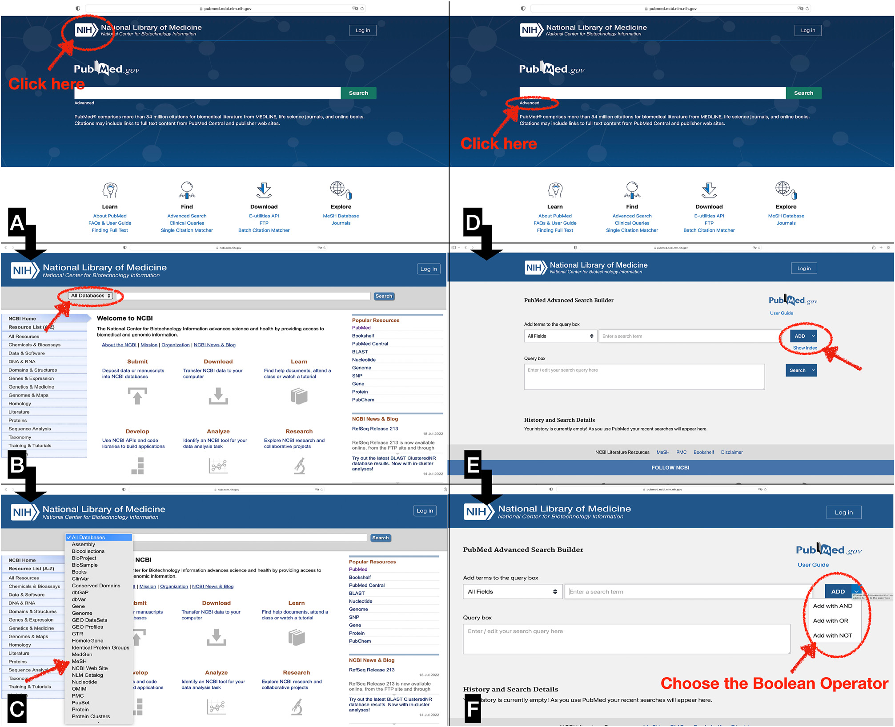
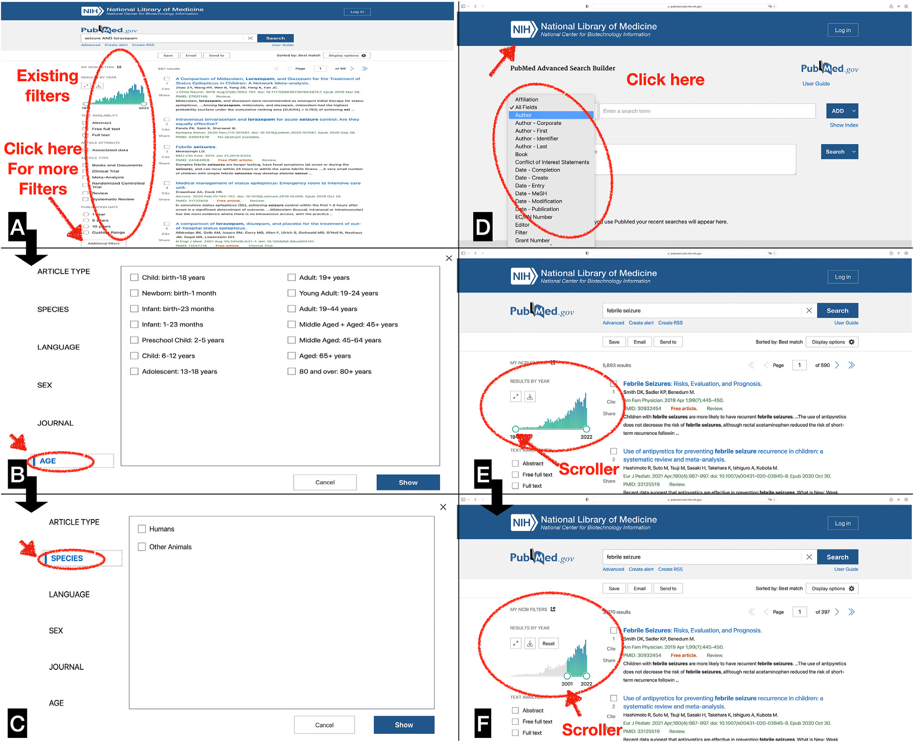

# 怎么一步步找到可靠证据？文献检索的系统化入门指南

## 本文信息

- **标题**：文献检索：面对未知的简单规则
- **作者**：Ruchika Jha, Vishal Sondhi, Biju Vasudevan
- **发表期刊**：Medical Journal Armed Forces India
- **发表时间**：2022 年 8 月 30 日在线发表
- **DOI**：https://doi.org/10.1016/j.mjafi.2022.07.009

## 摘要

文献检索构成了多数患者管理临床决策的基础，也是所有床旁研究和实验室研究的起点。尽管文献检索是所有医学专业人员和研究者工具箱中的必要工具，但它仍然是一项挑战，常常导致挫败感，并浪费时间和资源。本文旨在为信息检索者提供一份**初学者指南**，介绍如何在基于网络的数据库中按步骤开展文献检索。

## 引言

David Sackett 及其在 McMaster University 的同事将循证医学（Evidence Based Medicine，EBM）定义为**最佳研究证据、临床专业知识和患者价值观的整合**。虽然这一概念形成于 20 世纪 80 年代，但其定义和思想至今仍在指导多数临床医生和研究者。

文献检索是对已发表资料进行系统、周密且组织良好的搜索，目的是识别某一特定主题上的高质量研究。开展文献检索的原因可能不同，既可以是根据循证医学进行临床决策，也可以是为相关课题开展进一步研究。**一次设计良好的文献检索**可以拓宽知识基础，支持对研究进行批判性评价，也可以用来指导原创研究设计，以及撰写学位论文中的文献综述。**高效完成的文献检索，是任何优秀研究项目的基石**。

在当代技术高度发展的环境中，可检索的文献范围极其庞大。信息来源取决于多种因素，包括形式是纸质还是电子、是否付费、访问权限等。

- **一手来源**：专家新证据、结论和建议的原始发表形式，例如发表在同行评议期刊中的病例报告、随机对照试验等。
- **二手来源**：系统综述文章，其中来自一手来源的材料被推断和评价。
- **三手来源**：汇编一手或二手来源信息的集合，例如参考书。

文献显示，实践和利用循证医学主要存在三个障碍。**多数研究者缺乏开展文献综述的知识**；**许多人提到没有足够时间寻找最佳可用证据**；**最佳可用证据本身可能较弱**。本文试图解决第一个问题，介绍一种基于网络数据库开展文献检索的系统化、分步方法，从构建全面的检索问题，到实际检索数据库。

## 第一步：提出正确的问题

开展任何文献检索的核心，是**定义检索问题**。这一点非常重要，因为问题的性质和需求类型将决定检索过程。

例如，与某种疾病、障碍或药物相关的临床问题，可以在 Medscape、UpToDate 或 DynaMed 等来源中查找。

Medscape：[Medscape](https://www.medscape.com)：https://www.medscape.com

UpToDate：[UpToDate](https://www.uptodate.com)：https://www.uptodate.com

DynaMed：[DynaMed](https://www.dynamed.com)：https://www.dynamed.com

然而，如果上述数据库无法回答临床问题，或者正在开展一个研究项目，就可能需要更全面的文献检索。这类详细检索通常会在 **PubMed、Embase、CINAHL、PsycINFO 或 Web of Science** 等数据库中进行。

在开展文献检索之前，应先把问题用文字表达成一个问题，也就是研究问题。然后，应将这个问题拆解为组成部分或概念，并按照 **PICO（T）格式**组织起来。PICO（T）是构建研究问题的一种实用方法。

接下来，需要研究问题中的每个组成部分，并列出**所有可能相关的词、不同拼写和同义词**。这些在语义和词汇上相近的词，可以通过与同事头脑风暴，或者从书籍、DynaMed、UpToDate 或 PubMed Clinical Queries 中获取初步信息来识别。**这些关键词将构成文献检索的基础**。

### 表 1：按照 PICO（T）格式构建研究问题

| PICO（T）组成部分 | 说明 |
| --- | --- |
| P，Population | 指研究人群或将被纳入研究的受试者 |
| I，Intervention | 指将施用于研究人群并被研究其影响的特定干预，例如检查或治疗方式 |
| C，Control | 指用于比较干预后结局差异的参照组 |
| O，Outcome | 指预先定义的结局，用来衡量干预的有效性 |
| T，Time | 指数据收集的持续时间 |

## 第二步：确定合适的数据库

**文献检索资源可以分为搜索引擎和数据库**。搜索引擎是一种程序，会根据用户指定的关键词和字符，在数据库中搜索并识别对应项目。数据库则用于检索相关的已发表学术资源。**由于数据库中的信息通常经过同行评议，因此获得的信息更可能相关且可靠**。

### 表 2：用于文献检索的电子数据库

| 数据库 | 网址 | 说明 |
| --- | --- | --- |
| PubMed / MEDLINE | [PubMed](https://www.nlm.nih.gov/pubmed)：https://www.nlm.nih.gov/pubmed | PubMed 由 National Library of Medicine（NLM）、National Institute of Health（NIH）托管，包含来自 MEDLINE、生命科学期刊和在线书籍的 3400 余万条生物医学文献引用。MEDLINE 是 NLM 的书目数据库，包含来自 5600 多种期刊的 2900 余万条参考文献，可通过 PubMed 和 Ovid 等网站访问。 |
| EMBASE | [EMBASE](http://www.elsevier.com/online-tools/embase)：http://www.elsevier.com/online-tools/embase | EMBASE 是已发表生物医学和药理学文献的书目数据库，由 Elsevier 拥有和运营，包含 1947 年至今来自 8500 多种现行期刊的 3200 余万条记录。该数据库只能通过订阅访问。 |
| Cochrane Library | [Cochrane Library](https://www.cochranelibrary.com)：https://www.cochranelibrary.com | Cochrane Database of Systematic Reviews 是医疗卫生系统综述的主要数据库，包含 5000 余篇医疗卫生系统综述，是医疗服务提供者、决策者和研究者的重要信息来源。 |
| SCOPUS | [Scopus](https://www.scopus.com)：https://www.scopus.com | Scopus 是 Elsevier 的摘要与引文数据库，覆盖生命科学、社会科学、物理科学和健康科学领域的丛书、期刊和行业期刊。 |
| CINAHL | [CINAHL](https://www.cinahl.com)：https://www.cinahl.com | CINAHL 收录护理和相关健康领域的核心文献，包括护理期刊和相关出版物。 |
| Web of Science | [Web of Science](https://www.webofscience.com)：https://www.webofscience.com | Web of Science 是一个付费访问平台，可访问来自多个科学学科的 1.71 亿余条记录，包括会议论文集和图书。 |
| TRIP database | [TRIP Database](https://www.tripdatabase.com)：https://www.tripdatabase.com | TRIP 于 1997 年作为医学搜索引擎推出，重点关注循证医学内容。该网站提供研究、综合证据、概要和系统中的当前最佳证据。 |

## 第三步：为不同数据库制定检索策略

每个数据库在文献检索时都有自己的特点，虽然这些特点之间会有重叠。下面概述常用数据库的检索策略。

## 在 PubMed 中开展文献检索

理解 PubMed 搜索引擎的若干概念，可以提高检索质量。

### 1. Medical Subject Headings

Medical Subject Headings 通常称为 **MeSH**。简单说，MeSH 是一个有助于文献检索的主题词表。不同术语会被识别出来，并归入一个统一的主题词，也就是 **MeSH heading** 或 **descriptor**。因此，**在检索中使用 MeSH 词时，某个术语的各种同义词会自动包含在检索式中**。

例如，在文献中，COVID-19 感染这一概念有多种表述方式：COVID-19、novel coronavirus infection、corona virus、nCoV、2019 novel corona virus 和 SARS-CoV-2。**如果使用 MeSH 词进行检索，研究者就能找到关于这一主题的文章，而无论文中具体使用了哪个词描述这一概念**。

这一点之所以可行，是因为期刊中的每篇文章和书籍中的每一章在被 PubMed 索引时，都会被标注 **5–15 个最具体的 MeSH 主题词**。Subheadings 也称 qualifiers，会附加在 heading 后，用来描述概念的某个特定方面。Supplementary concept records 包括方案和罕见病术语，可使检索更具体。Publication characteristics 则定义被索引出版物的类型，也就是出版物格式，或研究的某些方面，例如研究设计。

MeSH heading 被组织成一棵树，包含 **16 个主分支**，每个主分支下又有多层子分支，每个 heading 在层级结构中都有自己的位置。当用户在 PubMed 搜索栏输入一个词时，PubMed 会尝试将其映射到一个或多个 MeSH 概念，并自动把对应 MeSH 词加入原始检索式。

不过，**仅使用 MeSH 检索是不够的**，因为 MeSH 词是人工分配给文章的。这个过程需要时间，因此**最新文章尚未分配 MeSH 词**。如果只使用 MeSH 检索，这些最新文章就不会出现在结果中。MeSH 检索可以直接从 MeSH 页面进行，也可以从 PubMed 首页进入 MeSH 搜索。

MeSH：[MeSH Database](https://www.ncbi.nlm.nih.gov/mesh/)：https://www.ncbi.nlm.nih.gov/mesh/

### 2. Boolean operators

Boolean algebra，或 Boolean logic，是通过 **AND、OR 和 NOT 这些 Boolean operators** 将检索词组合起来的过程。这些词作为 Boolean operators 使用，并且**总是大写**。使用 Boolean operators 可以帮助研究者细化检索标准。

- **AND**：只会检索同时包含所有组合词的文章。例如，seizure AND lorazepam 只会返回同时涉及 seizure 和 lorazepam 的文章。
- **OR**：扩大检索范围，返回包含任意一个组合词的文献。例如，seizure OR lorazepam 会检索包含 seizure 的项目、包含 lorazepam 的项目，以及同时包含二者的项目。OR 也适合用于连接同义词，例如 seizure OR febrile seizure OR epilepsy。
- **NOT**：限制检索，排除所有包含某个特定检索词的结果。例如，seizure NOT lorazepam 会返回包含 seizure 的文章，但排除提到 lorazepam 的文章。**NOT 应谨慎使用**，因为它可能排除有用文章。

### 3. 关键词

关键词用于描述想法或概念，可以是单个词，也可以是短语。作者描述某个概念的方式，常常与检索者搜索该概念时使用的词不同。**因此，识别意义相近的词非常重要**。

关键词可以通过浏览 **MeSH 中列出的 entry terms**、浏览文章中的术语，以及进行少量预检索来生成。例如，在检索 seizure 这一关键词时，可以加入替代词 convulsions。

此外，如果希望在 PubMed 中检索某个特定短语，也就是词语按确切顺序出现，应使用英文双引号。这会关闭 PubMed 的自动词项映射功能，并确保这些词被作为整体一起检索。例如，**检索 gene therapy 会检索 gene AND therapy；而检索 “gene therapy” 则会检索按这一顺序出现的 gene therapy**。

### 4. Truncation

在 PubMed 中，可以使用**星号 `*` 检索词形变化**。PubMed 会检索以词根开头的词。例如，检索 `child*` 时，也会检索 child、childhood、children 等。

### 5. Wildcards

通配符通过在检索词中间插入 `?` 起作用。**这允许检索在通配符位置包含一个额外字符的词；不包含额外字符的词也会被检索到**。这对于检索美式英语和英式英语拼写差异尤其有用。例如，`behavio?r` 会返回 behaviour 和 behavior。

### 6. Filters

PubMed 内置筛选器可以缩小结果范围。**常用筛选器包括文章类型**，例如 clinical trial、meta-analysis、systematic review 等；发表日期；研究对象是人类还是其他动物；文章语言；纳入年龄组等。

### 7. Search fields

**Search field tags** 指定需要搜索的数据库字段。不同 search field tags 可包括**作者单位 affiliation**、**文章标识符 article identifier**，例如 DOI、**作者标识符 author identifier**，例如 ORCID、**完成日期 completion date** 等。

PubMed 检索还会遇到一些特殊场景。例如，如果想快速找到某篇特定文章，可以使用 **PubMed ID（PMID）** 或文章标题。也可以通过输入作者姓氏加姓名首字母或名字，找到某位作者发表的文献。

如果检索时得到太多结果，可以使用筛选器限制为近期文章，或按研究类型限制，例如 clinical trial，也可以使用更窄的检索词。相反，如果结果太少，可以通过检查相关文章题名和摘要中的词语、分配的 MeSH 词，并把这些词加入检索策略来扩大检索；也可以在 MeSH 层级中上移一级，或者搜索其他数据库。**检索完成后，可以预先创建 My NCBI 账号，并在 PubMed 中保存检索**。

**图1：PubMed 检索涉及的不同步骤**。该图按 A/B/C 和 D/E/F 的顺序阅读。A 图中，研究者浏览 PubMed 首页；B 图中，用户点击 NIH 进入下一页；C 图中，用户点击 All databases 并滚动到 MeSH，输入词语生成相关 MeSH 词。D 至 F 图展示 Boolean operators 的使用：用户既可以在搜索栏中输入关键词并用大写 AND、OR、NOT 组合，也可以点击 Advanced，在新页面中通过滚动 ADD 功能选择 Boolean operators。

PubMed：[PubMed](https://pubmed.ncbi.nlm.nih.gov)：https://pubmed.ncbi.nlm.nih.gov

**图2：PubMed 中 filters 的使用**。A 至 C 图展示筛选器的使用。筛选器以列的形式位于检索页面左侧，点击 Additional filters 后会打开新框，用户可选择不同筛选器，例如特定年龄组或特定人类研究。D 图展示其他可用检索策略，例如作者、书籍、编辑等。E 和 F 图展示时间筛选器的使用：检索 febrile seizure 会产生 5800 多条结果，将结果筛选为 2001 至 2022 年，输出可减少到接近 4000 条。

**表 3：PubMed 检索步骤**

| 步骤 | 说明 | 示例 |
| --- | --- | --- |
| 1 | 构建相关研究问题 | 抗生素对咽喉痛管理是否有效？PICO 格式：Patients，咽喉痛个体；Intervention，抗生素给药；Control，未接受抗生素；Outcome，减轻症状的有效性 |
| 2 | 识别概念及相关关键词 | 概念 1：抗生素；概念 2：咽喉痛 |
| 2a | 识别概念 | 概念 1：antibiotics；概念 2：sore throat |
| 2b | 识别每个概念相关关键词 | antibiotics 相关词包括 antibiotic OR anti-bacterial agents OR antimicrobial agents；sore throat 相关词包括 Pharyngitis OR Nasopharyngitis OR Tonsillitis OR “inflamed throat” |
| 3 | 准备 PubMed 检索 | 为每个概念加入 MeSH 词，加入 Boolean operators、truncations 和多词短语引号 |
| 3a | 为每个概念加入 MeSH 词 | antibiotics 的 MeSH 词为 “anti-bacterial agents”[MeSH Terms]；sore throat 的 MeSH 词为 “pharyngitis”[MeSH Terms] |
| 3b | 加入 Boolean operators、truncations，并给多词短语加英文双引号 | 概念 1 示例：antibiotic* OR “anti-bacterial agent*”；概念 2 示例：Pharyngit* OR Nasopharyngit* OR rhinopharyngi* OR Tonsillit* OR “inflamed tonsil*” |
| 3c | 合并每个概念的关键词和 MeSH 词 | 概念 1：antibiotic* OR “anti-bacterial agent*” OR “anti-bacterial agents”[MeSH Terms]；概念 2：Pharyngit* OR nasopharyngitis OR rhinopharyngitis OR tonsillitis OR “inflamed throat” OR “inflamed tonsils” OR “infected throat” OR “infected tonsils” OR “sore throat” OR “pharyngitis”[MeSH Terms] |
| 3d | 先分别检索单个概念，再用 AND 合并两个概念 | （antibiotic* OR “anti-bacterial agent*” OR “anti-bacterial agents”[MeSH Terms]）AND pharyngitis OR nasopharyngitis OR rhinopharyngitis OR tonsillitis OR “inflamed throat” OR “inflamed tonsils” OR “infected throat” OR “infected tonsils” OR “sore throat” OR “pharyngitis”[MeSH Terms] |

### 表 4：PubMed 检索策略示例

| 步骤 | 内容 |
| --- | --- |
| Step 1 | 构建研究问题：抗生素对咽喉痛管理是否有效？PICO 格式：Patients，咽喉痛个体；Intervention，抗生素给药；Control，未接受抗生素；Outcome，减轻症状的有效性 |
| Step 2 | 构建研究问题相关概念和关键词。概念 1：antibiotics；概念 2：sore throat |
| Step 3a | 添加 MeSH 词。概念 1：antibiotics 的 MeSH 词为 “anti-bacterial agents”[MeSH Terms]。概念 2：sore throat 的 MeSH 词为 “pharyngitis”[MeSH Terms] |
| Step 3b | 加入 Boolean operators、truncations，并给多词短语加英文双引号。对于 antibiotics，可形成包含 antibiotic*、azithromycin*、clarithromycin*、macrolid*、cephalosporin*、amoxicillin*、fluoroquinolon*、penicillin* 等词的 OR 检索式。对于 sore throat，可形成包含 Pharyngitis、nasopharyngitis、tonsillitis、“inflamed throat”、“infected throat”、“sore throat”等词的 OR 检索式 |
| Step 4 | 执行检索。#1 为抗生素相关检索式，得到 1,007,017 条结果；#2 为咽喉痛相关检索式，得到 50,676 条结果；#3 为 #1 AND #2，得到 11,338 条结果 |

## 在 EMBASE 中开展文献检索

EMBASE 的文献检索与 PubMed 使用相似概念，但有一些变化。

### 1. Keywords 和 Emtree

关键词的检索方式与 PubMed 类似；关键词可以是单词，也可以是短语，短语用英文双引号检索。EMBASE 中的 **Emtree** 替代了 PubMed 中的 MeSH 术语。与 MeSH 一样，Emtree 词会分配给文章，用标准化方式描述其内容。进入 EMBASE 的文章会被自动分配 Emtree 词，即通过算法分配。随后，这些 Emtree 词会由 EMBASE 索引人员人工检查和修正。

### 2. Explode 和 no explode

**Explode** 命令 `/exp` 会检索主 heading 下所有 subject headings，并返回列有这些 subject heading、subheadings 或组合的所有结果。**No explode** 命令 `/de` 只检索指定词本身，不检索其下级 heading。**Major focus** 命令 `/mj` 只会把选择的 Emtree 词作为主要术语进行检索。

例如，`"diabetes mellitus"/de` **只会查找以 diabetes mellitus 编入索引的记录**，而不会查找 diabetic complication 或 diabetic obesity 等。

### 3. Field tags

**Field tags** 会把检索限制在文章的特定部分，例如题名或摘要。字段限制位于 Advanced Search 页面中的 fields 链接下。默认设置是 all fields，但输入检索词后，如果点击其中一个限制，例如 Abstract: ab，它会被加入 search builder。常见命令包括 ti（Title）、ab（Abstract）、au（Author）、ad（Author Address/Affiliation）和 jt（Journal Title）。

### 4. Truncation 和 wildcard

截词符号 `*` 和通配符号 `?` 及其应用，与 PubMed 相同。

### 5. Proximity searching

EMBASE 允许使用 proximity operators 检索彼此相隔一定词数内的术语。邻近检索有两种类型：**NEAR/n** 和 **NEXT/n**。

- **NEAR/n**：检索两个术语在指定词数内相互接近的情况，**不限制方向**。例如，`Therapy NEAR/5 sleep` 会查找 therapy 在 sleep 前后 5 个词以内的情况。
- **NEXT/n**：检索两个术语在指定词数内相互接近、且顺序与输入顺序一致的情况。例如，`therapy NEXT/5 sleep` 可以找到 therapy for improved sleep，但不会找到 sleep therapy。

### 6. Boolean operators

与 PubMed 一样，Boolean operators，即 AND、OR 和 NOT，可用于组合检索词。

一般来说，EMBASE 是第二常用的检索数据库。**在 PubMed 中识别出的关键词和 MeSH 词，在 EMBASE 中也会以相似方式发挥作用**。不过，如果在 EMBASE 中识别出其他可用关键词，也应将其加入 PubMed 和其他数据库检索中。

## 在 Web of Science 中开展文献检索

**Web of Science 提供一组数据库访问入口**。这些数据库包括 **Web of Science Core Collection** 和 **BIOSIS Citation Index**。Web of Science Core Collection 包括所有学术学科的学术期刊文章信息、科学技术会议论文集信息，以及部分科学、社会科学和人文图书中的图书章节参考信息。BIOSIS Citation Index 则结合了 Biological Abstracts 和 Biological Abstracts Reports, Reviews and Meetings 两个数据库，覆盖生命科学中的临床前和实验研究。

检索关键词时，应在搜索框中输入关键词，同时确保下拉菜单选择 **Topic**。随后，按前文所述使用 Boolean operators 组合检索词。通配符和截词符号也与 PubMed 和 Embase 类似。

此外，可以使用 proximity search 功能，即命令 **NEAR/x**，检索彼此接近但并非精确短语的词。例如，`sleep NEAR/5 therapy` 会找到 sleep therapy、therapy of sleep、therapy for improved sleep 等。`/x` 表示两个关键词之间允许出现多少个其他词；在这个例子中是 5 个。**只使用 NEAR 时，会被视为 NEAR/15**。词的先后顺序没有影响。

## 第四步：保存检索结果

文献检索可能很费力，并且可能需要几天才能完成。因此，**必须在检索过程中保存搜索结果**。上面提到的大多数数据库都允许保存检索。例如，PubMed 中创建免费的 NCBI 账号对公众开放，并允许用户保存既往检索。

检索到的文献可以下载下来，以便逐篇阅读。**参考文献管理软件**是组织、存储和共享参考文献的有力工具，也能在创建参考文献列表时节省时间。可用于管理检索文献的软件既有免费版本，例如 Mendeley、Zotero，也有商业授权版本，例如 EndNote、RefWorks。

## 结论

本文提供了开展文献检索的一种**系统化分步方法**。PubMed 检索策略示例在表 4 中进行了详细展示。本文并不声称覆盖所有细节；许多细微技巧需要在亲自检索过程中学习。**本文旨在帮助初学者快速入门，并概述这个看似具有挑战性、但并没有那么难进入的领域**。
