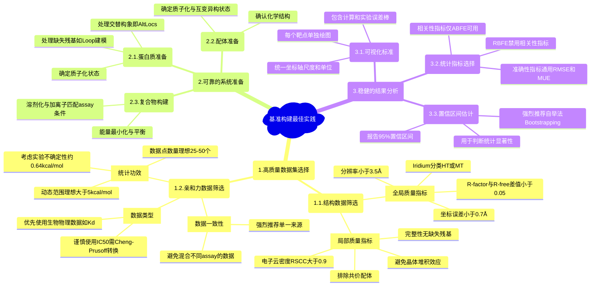

# 【OpenFE】蛋白质-配体结合自由能计算基准构建的最佳实践

## 本文信息

  - **标题**：构建、准备和评估蛋白质-配体结合亲和力基准的最佳实践
  - **作者**：David F. Hahn, Christopher I. Bayly, Melissa L. Boby, 等
  - **发表时间**：2022年8月30日
  - **单位**：Janssen Research & Development (比利时), OpenEye Scientific Software (美国), Memorial Sloan Kettering Cancer Center (美国) 等
  - **引用格式**：Hahn, D. F., Bayly, C. I., Boby, M. L., Macdonald, H. E. B., Chodera, J. D., Gapsys, V., Mey, A. S. J. S., Mobley, D. L., Perez Benito, L., Schindler, C. E. M., Tresadern, G., & Warren, G. L. (2022). Best Practices for Constructing, Preparing, and Evaluating Protein-Ligand Binding Affinity Benchmarks. *Living Journal of Computational Molecular Science*, *4*(1), 1497. [https://doi.org/10.33011/livecoms.4.1.1497](https://doi.org/10.33011/livecoms.4.1.1497)
  - **源代码与数据集**：
      - **LiveCoMS 文档**：[https://github.com/openforcefield/protein-ligand-benchmark-livecoms](https://github.com/openforcefield/protein-ligand-benchmark-livecoms)
      - **基准数据集 (protein-ligand-benchmark)**：[https://github.com/openforcefield/protein-ligand-benchmark](https://github.com/openforcefield/protein-ligand-benchmark)
      - **分析工具包 (arsenic)**：[https://github.com/openforcefield/openff-arsenic](https://github.com/openforcefield/openff-arsenic)

-----

## 摘要

> 自由能计算正迅速成为结构辅助药物发现项目中不可或缺的工具。随着新方法、力场和实现方案的不断发展，在真实世界系统上评估其准确性（即**基准测试**）变得至关重要。这不仅为用户提供了在方法适用领域内预期的准确性评估，也为开发者评估新方法学的潜在影响提供了途径。然而，构建一个高质量的基准集——包含精心准备的高质量体系及相应的实验测量数据——是确保计算结果能真实反映预期性能的关键。迄今为止，整个领域尚未采用一个共同的标准化基准，现有的基准报告存在数据质量差、统计功效有限和分析方法有缺陷等诸多问题，这些都可能导致基准测试结果无法准确预测真实世界的性能。本文旨在解决这些问题，提出了三大指导方针：（1）**筛选实验数据**以建立有意义的基准集；（2）按照**最佳实践准备基准输入文件**，以促进其广泛应用；（3）对预测结果进行**统计学稳健分析**，以便在不同方法和力场之间进行有意义的比较。我们还提供了一个**经过筛选、版本化、开源的标准化基准集**（protein-ligand-benchmark）和一个用于实施标准化最佳实践评估的**开源工具包**（arsenic），供社区作为标准化评估工具使用。

-----

## 背景

在计算机辅助药物发现（CADD）领域，定量预测蛋白质-配体结合亲和力是一项核心任务。准确的亲和力预测能够显著加速药物发现的临床前阶段，通过优先合成那些有望提高或维持活性的化合物，从而节约大量时间和研发成本。在众多计算方法中，基于分子模拟的炼金术自由能计算（Alchemical Free Energy Calculations），特别是相对结合自由能（RBFE）和绝对结合自由能（ABFE）计算，已成为最有前途的工具之一。

尽管炼金术自由能计算在理论上非常严谨，并且在许多研究中取得了令人鼓舞的成功（例如，在一些精心挑选的体系上，Schrödinger的FEP+预测的平均无符号误差小于1.2 kcal/mol），但该领域长期以来面临着一个严峻的挑战：**缺乏统一、高质量的基准（benchmark）和标准化的评估流程**。研究人员在开发或验证新方法时，往往使用各自挑选的数据集，这些数据集的质量参差不齐，实验数据来源各异，结构准备过程不透明，分析方法也五花八门。这导致了不同研究之间的结果难以直接比较，方法的真实性能被高估或低估，最终阻碍了整个领域的健康发展。

现有的基准测试实践普遍存在以下问题：

1.  **实验数据质量问题**：混合使用来自不同实验室、不同检测方法（assay）的活性数据；未能排除超出检测限的数据点；忽略实验误差。
2.  **结构数据问题**：使用低分辨率或存在明显错误的晶体结构；对蛋白质和配体的准备（如质子化状态、互变异构体、缺失环区处理）缺乏统一标准和详细记录。
3.  **统计分析缺陷**：数据集规模太小，统计功效不足；动态范围（dynamic range）过窄，导致相关性指标虚高；对相对自由能计算结果使用不恰当的统计指标（如R²），其结果会因计算方向的任意选择而改变。

这些问题共同导致了一个困境：我们很难确定一个计算方法的失败究竟是源于方法本身的缺陷，还是因为所使用的基准数据质量太差。因此，建立一套关于如何构建、准备和评估蛋白质-配体结合亲和力基准的"最佳实践"指南，并提供一个遵循这些指南的、开放的、标准化的基准集，对于推动自由能计算乃至整个药物发现领域的发展都至关重要。

## 关键科学问题

本文旨在系统性地解决以下核心科学问题：

**如何构建一个科学上严谨、统计上可靠、且能被社区广泛接受的蛋白质-配体结合亲和力计算基准，并建立一套标准化的评估流程？**

这个问题可以分解为三个子问题：

1.  **数据筛选的标准是什么？** 如何从海量的实验数据中筛选出高质量的结构数据和活性数据，以确保基准的"金标准"是可靠的？
2.  **系统准备的最佳实践是什么？** 如何以一种可复现、标准化的方式处理蛋白质和配体结构，为分子模拟生成高质量的输入文件，最大限度地减少人为操作引入的偏差？
3.  **结果评估的正确方法是什么？** 应该使用哪些统计指标来公正地评估计算方法的性能？如何正确地解释这些指标，并进行置信区间估计，以避免得出错误的结论？

## 创新点

  - **首次系统性地提出了基准构建的全流程最佳实践指南**：涵盖了从实验数据筛选、结构准备、模拟设置到最终统计分析的每一个关键环节。
  - **区分了"验证"、"基准测试"和"应用"**：清晰地界定了这三个概念，强调了基准测试应使用高质量、接近真实世界应用但经过充分研究的系统。
  - **提供了具体的、可操作的数据质量评估标准**：针对结构数据（如分辨率、R-free、坐标误差、电子云密度）和活性数据（如单一来源、动态范围、数据点数量）给出了量化建议。
  - **发布了开源、版本化的基准集和分析工具**：提供了`protein-ligand-benchmark`数据集和`arsenic`分析工具包，为社区提供了一套立即可用的标准化资源，促进了研究的可复现性和可比性。
  - **强调了统计分析的严谨性**：详细阐述了不同统计指标的适用场景和局限性，特别是指出了对相对自由能使用相关性统计的谬误，并提倡使用**自举法（Bootstrapping）**来估计置信区间。

-----

## 研究内容

本文的核心内容并非提出一种新的计算方法，而是为整个领域建立一套"游戏规则"。作者将构建一个高质量基准的过程分解为数据选择、系统准备和结果分析三个主要阶段，并为每个阶段提供了详细的指导方针。



该图清晰地界定了在计算方法评估中常被混淆的三个核心概念：验证（Validation）、应用（Application）和基准测试（Benchmarking）。**验证**侧重于在理想化的小体系（toy systems）上对方法进行严格测试，其优点是能够实现完全收敛且易于排查问题，但缺点是脱离了真实世界的复杂性。**应用**则是指在实际的药物研发等项目中使用该方法，它直面真实世界的挑战，但结果的好坏可能受到数据质量、体系适用性等多重未知因素的影响。而**基准测试**则作为两者的桥梁，它使用经过精心筛选、具有高质量实验数据的真实世界体系，旨在评估一个方法在"理想化的真实世界"中的性能上限，从而为该方法在常规"应用"中的表现提供一个可靠的预期。

**图1：本指南中使用的验证（Validation）、应用（Application）和基准测试（Benchmarking）定义的图示。** 对于每个术语，其定义、在方法评估方面的优点（绿色）和潜在缺点（红色）分别在三个面板中列出。验证（左上面板）使用的系统能够确信地收敛，预期结果已知，且潜在问题被充分理解。应用（左下面板）则使用真实世界系统，并使方法能够在感兴趣的真实世界应用中得到持续评估。基准测试（右面板）通过旨在评估真实世界应用相对于实验的准确性，在实验数据质量不受限制且已知方法在其适用领域内应用的案例中，桥接了验证和应用。

### 阶段一：高质量数据集的选择 (Dataset Selection)

构建一个可靠基准的第一步是确保输入的数据本身是高质量的。这包括蛋白质结构数据和配体结合亲和力数据。

**图2：五个不同靶点的配体对（A, B），每对配体用于一个靶点，其结构差异在模拟中可能具有挑战性。(A) Eg5：电荷变化，(B) SHP2：电荷移动，(C) PDE10：连接子变化，(D) HIF2a：环的生成，(E) CDK8：环的大小变化。**

#### 1. 蛋白质结构数据的筛选 (Structural Data)

自由能计算对初始结构的质量极为敏感。作者建议使用多重标准来评估和筛选PDB数据库中的晶体结构。

  - **全局质量指标**:
      - **分辨率 (Resolution)**: 传统上被用作首要标准，但它只提供了理论极限，并不能完全反映模型的质量。建议与其他指标结合使用，例如分辨率优于 3.5 Å。
      - **R-factor 和 R-free ($R_{free}$)**: $R_{free}$ 是评估模型是否过拟合的关键指标。通常，$R_{free}$ 与R-factor的差值应小于0.05。
      - **坐标误差 (Coordinate Error)**: 这是评估模型精度和质量的最佳方式之一，可以通过 **密度精度指数 (DPI)** 计算得出。一个高质量结构的坐标误差应小于 0.7 Å。
      - **Iridium 分类**: OpenEye提出的一个综合评分系统，将结构分为高可信 (HT)、中等可信 (MT) 和不可信 (NT) 三类。**基准集应至少选用MT级别的结构，理想情况下为HT**。该分类基于一系列标准进行评分，但本文未详述具体指标，而是引用了其原始文献。

**图3：PDB结构验证报告百分位得分面板，对比Jnk1靶点的两个结构（2GMX和3ELJ）。(A) 2GMX是一个相对于PDB中所有相似分辨率结构而言排名较差的结构。(B) 相比之下，3ELJ与PDB中相似分辨率或所有结构相比，质量相当或更好。**

  - **局部（活性位点）质量指标**:
      - **完整性**: 活性位点附近（例如配体原子6-8 Å范围内）不应有缺失的残基或侧链原子。
      - **电子云密度**: 配体的电子云密度应至少覆盖其90%的原子中心（例如，真实空间相关系数RSCC \> 0.90）。密度差（Fo-Fc map）中不应有无法解释的大块正或负密度。
      - **晶体堆积效应**: 应检查是否有来自相邻晶胞的原子与配体或活性位点发生相互作用，这可能会影响其天然构象。
      - **共价配体**: 应避免使用共价结合的配体，因为其模拟处理更为复杂，超出了标准基准的范畴。

**图4：使用X射线晶体结构时遇到的常见挑战示例。(A) PDB ID 4PV0在活性位点显示出较差的电子云密度（3σ水平）。(B) 推荐的同一蛋白的结构PDB ID 4PX6则对整个loop具有完整的密度（3σ水平）。(C) PDB ID 5E89显示出较差的配体密度。(D) PDB ID 1SNC的配体与邻近单元的残基K70和K71（蓝色）有晶体接触，直接与配体相互作用，可能影响其在溶液环境中的结合模式。(E) PDB ID 3ZOV有两个备选的侧链构象。(F) 在PDB ID 5HNB中，有一个赋形剂（甲酸）直接与配体相互作用。**

**图5：使用X射线晶体结构进行配体建模时遇到的挑战示例。(A) 在PDB ID 3FLY中，存在显著的差异密度，可能表明配体构象建模不正确。(B) 建议的同一蛋白的备选结构PDB ID 6SFI没有差异密度。(C) PDB ID 2ZFF在结合口袋中显示出无法解释的电子密度（差异图，中心底部，青色）。**

#### 2. 实验结合亲和力数据的筛选 (Experimental Binding Affinity Data)

实验数据是评判计算结果的"金标准"，其自身的质量直接决定了基准测试的上限。

  - **数据一致性**: **强烈推荐使用单一来源的数据**（如同一篇论文或同一个专利）。从业者可能倾向于将所有可用的测量数据（例如从ChEMBL查询得到的数据）拼凑在一起，以构建一个统计功效足够的数据集，但这种做法通常应该被抵制。因为不同实验室的检测条件或方案可能不具有可比性，例如，这些差异可能源于底物浓度、所用的蛋白质构建体、孵育时间或缓冲液的组成，而且这些细节在报道的实验方法中可能没有被充分记录。这些因素会引入难以量化的系统性偏差，导致基准的"金标准"本身变得不可靠。

**图6：实验不确定性可能在0.64 kcal/mol量级。该图比较了COVID moonshot项目中365个分子通过两种不同方法测定的结合亲和力。在一个assay中预测会结合但在另一个assay中无活性的分子以蓝色显示。两种方法之间的RMSE为0.64 kcal/mol。**

  - **数据类型**：

      - 理想情况下应使用生物物理方法直接测定的解离常数，如 $K_d$ (来自ITC, SPR等)。
      - 由于生物物理数据稀少，通常不得不使用功能性assay测得的半数抑制浓度 $IC_{50}$。此时，需要通过 **Cheng-Prusoff方程** 将其转换为抑制常数 $K_i$，并假设 $K_i \approx K_d$。对于相对自由能计算，**由于体系内偏移是系统性的，可以直接比较 $\Delta\Delta G$ 与由 $IC_{50}$ 算出的相对能量差。**

    $$
    K_i = \frac{IC_{50}}{1 + \frac{[S]}{K_m}}
    $$
    
  - **统计功效 (Statistical Power)**：

      - **数据点数量**：为获得具有较小置信区间的稳健统计结果，**推荐数据集大小在25到50个配体之间**。
      - **动态范围 (Dynamic Range)**：数据集的活性范围要足够宽，才能有效地区分不同方法的性能。考虑到典型的实验误差，**推荐的动态范围至少为 $3.0 \mathrm{kcal/mol}$，理想情况下大于 $5.0 \mathrm{kcal/mol}$**。过窄的动态范围会导致 $R^2$ 等指标的上限（$R^2_{max}$）很低，使得方法之间的比较失去意义。

> 统计功效（statistical power）是指， 在假设检验中， 当原假设错误时， 接受正确的备择假设的概率。

    #### 公式的通俗解释

    一个数据集理论上能达到的最高 $R^2$ 值 ($R^2_{max}$) 受其自身的数据质量限制。它由数据点的离散程度（亲和力标准差 $\sigma(\text{affinity})$）和实验测量的不确定性（测量误差标准差 $\sigma(\text{measurement error})$）共同决定。

    $$
    R^2_{max} = 1 - \frac{\sigma(\text{measurement error})^2}{\sigma(\text{affinity})^2}
    $$
    这个公式告诉我们，如果实验误差相对于数据本身的分布范围过大，那么即使是完美的预测模型，其 $R^2$ 也无法达到1。

**图7：实验不确定性越大，给定 $R^2_{max}$ 所需的亲和力范围就越大。该图展示了 $R^2_{max}$ 如何受亲和力标准差 $\sigma(\text{affinity})$ 和测量误差标准差 $\sigma(\text{measurement error})$ 的限制。**

  - **实验不确定性**：应尽可能获取并报告实验测量误差。若无，可参考文献中报道的典型重现性误差，约为 $0.64 \mathrm{kcal/mol}$。对于相对自由能的比较，两个独立测量的误差会进行传递，总误差为 $\sqrt{\sigma_{1}^{2}+\sigma_{2}^{2}}$。

**图8：数据集越大，性能统计的不确定性越小。(A) Kendall $\tau$ 和 (B) RMSE 的置信区间随数据集大小N的变化。(C-E) 展示了一个N=10的特例，说明即使误差棒重叠，通过成对的自举分析也可能发现统计学上的显著差异。**

基于以上标准，作者评估了多个先前研究中常用的数据集，并将其质量进行了标注。

**表1：对提议的基准集中结构和活性实验数据质量的评估。**
该表详细列出了多个靶点（如BACE, CDK2, Jnk1等）所使用的PDB结构及其质量指标（Iridium分类和分数、DPI），并推荐了更高质量的备选结构。同时，它也列出了每个靶点配体集的信息，包括配体数量(N)、动态范围(DR)和模拟的RMSE，并用颜色编码（深绿、浅绿、红）标注了质量等级。例如，Jnk1使用的`2GMX`结构被评为NT（不可信），而推荐的备选结构`3ELJ`则质量更高。BACE_P2的动态范围仅为0.8 kcal/mol，质量为"低"。

### 阶段二：可靠的系统准备 (Structure Preparation)

将筛选出的实验结构转化为可用于模拟的计算模型是充满挑战的一步，任何疏忽都可能导致计算失败。

```mermaid
graph TD
    subgraph "输入"
        direction LR
        A["<b>蛋白质X射线结构</b><br/>(PDB)"]
        B["<b>配体化学结构</b><br/>(SMILES/SDF)"]
    end

### 阶段二：可靠的系统准备 (Structure Preparation)

系统准备包括蛋白质准备、配体准备和复合物构建三个主要步骤。

### 阶段三：稳健的结果分析 (Analysis)

#### 1. 统计指标的选择

- **准确性指标**: RMSE和MUE适用于所有类型的自由能计算。
- **相关性指标**: $R^2$, Kendall等仅适用于ABFE，不推荐用于RBFE。

#### 2. 置信区间估计

应使用自举法（Bootstrapping）来估计统计量的不确定性，报告95%置信区间。

-----

## 关键结论

- **基准测试的成败始于数据质量**：必须采用严格的标准来筛选实验结构和活性数据。
- **标准化系统准备至关重要**：蛋白质和配体的准备过程必须谨慎、可复现。
- **统计分析必须严谨**：应优先使用准确性指标，所有统计量都必须附带置信区间。
- **社区合作是未来方向**：作者通过发布开源工具和基准集，呆呐社区共同参与。