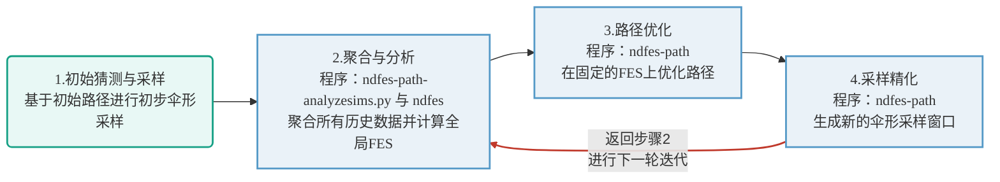
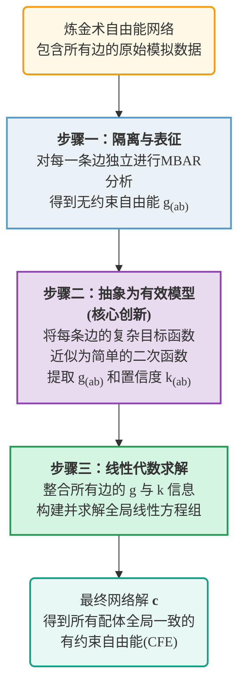

# FE-ToolKit：一个用于分析高维自由能表面和炼金术自由能网络的多功能软件套件

## 📖 本文基本信息

### 摘要

自由能模拟在酶设计、药物发现和生物分子工程等多种生物学应用中发挥着关键作用 。要表征复杂酶促反应机理背后的高维自由能表面，需要通过伞形采样或弦方法模拟进行广泛的采样 。准确地对大型配体库的靶标结合自由能进行排序，则依赖于组织成热力学网络的全面炼金术自由能计算 。这些方法的预测准确性取决于强大且可扩展的工具，用于进行全网络数据分析并从异构模拟数据中提取物理性质 。**在这里，我们介绍了FE-ToolKit，一个多功能的软件套件，用于自动分析自由能表面、最小自由能路径和炼金术自由能网络（热力学图）** 。

### 引用信息

> Giese, T. J., Snyder, R., Piskulich, Z., Barletta, G. P., Zhang, S., McCarthy, E., Ekesan, Ş., & York, D. M. (2025). FE-ToolKit: A Versatile Software Suite for Analysis of High-Dimensional Free Energy Surfaces and Alchemical Free Energy Networks. *Journal of Chemical Information and Modeling, 65*(17), 5273–5279.  https://doi.org/10.1021/acs.jcim.5c00554

## 引言

在现代计算化学与生物物理学领域，自由能计算是理解和预测分子识别、反应机理及构象动力学等核心科学问题的基石。然而，这些计算本身面临着巨大的挑战，主要源于分子构象空间的广阔性以及对稳健统计方法和严格误差分析的内在需求。为应对这些挑战，FE-ToolKit应运而生。它是一个综合性的集成软件包，旨在为两类主要的计算问题——高维自由能面（Free Energy Surface, FES）的表征和炼金术自由能网络的分析——提供一个模块化、面向工作流程的解决方案生态系统。

本报告将遵循该工具包的结构，深入剖析其三个核心组成部分：首先是利用`ndfes`程序进行自由能面的构建与分析；其次是采用`edgembar`程序执行可扩展的炼金术网络计算；最后是介绍`fetkutils`中一系列增强计算效率与数据质量的辅助工具。为了给读者提供一个清晰的概览，下表总结了FE-ToolKit生态系统中的关键程序及其核心功能。

**表1：FE-ToolKit程序生态系统**

| 程序/脚本                    | 核心功能                                                     |
| ---------------------------- | ------------------------------------------------------------ |
| `ndfes`                      | 使用MBAR/vFEP方法，根据伞形采样数据计算N维FES。              |
| `ndfes-path-analyzesims.py`  | 为表面加速弦方法（SASM）提取当前迭代的样本并准备`ndfes`元文件。 |
| `ndfes-path`                 | 在静态FES上优化最小自由能路径，并为下一次迭代生成新的模拟输入。 |
| `edgembar`                   | 对单个炼金术变换（“边”）进行MBAR分析，并生成其有效目标函数。 |
| `edgembar-WriteGraphHtml.py` | 执行炼金术自由能的网络范围分析，并生成交互式HTML报告。       |
| `fetkutils-tischedule.py`    | 优化炼金术自由能计算中的λ调度，以提高采样效率。              |
| `ndfes-AvgFESs.py`           | 平均多个独立的FES，并根据试验间的方差调整不确定性。          |
| `ndfes-CombineMetafiles.py`  | 将多个元文件合并为一个，以聚合采样数据。                     |
| `ndfes-PrintFES.py`          | 将FES检查点文件中的数据打印为人类可读的文本格式。            |

Figure 1. FE-ToolKit consists of ndfes for calculating *N*-dimensional free energy surfaces, edgembar for analyzing alchemical free energy networks using the EdgeMBAR method, and FE-ToolKit utilities (fetkutils) for optimizing schedules of alchemical states.

## **第一部分：使用`ndfes`构建和分析自由能形貌**

`ndfes`是FE-ToolKit中用于将偏置模拟（biased simulation）数据转化为有意义的多维自由能面（Free Energy Surface, FES），并识别其上最可能转变路径的核心组件。本节将详细阐述其理论基础、核心方法及实现细节。

### **1.1 伞形采样与集体变量（CVs）的原理**

伞形采样（Umbrella Sampling）是一种成熟的增强采样技术，常用于计算**分子构象变化、化学反应或分子解离/结合等过程**的自由能。它通过施加人工偏置势（biasing potential）来克服高自由能垒，从而确保沿特定过程坐标的充分采样。

在FE-ToolKit的语境中，这些过程坐标被称为“反应坐标”（Reaction Coordinates）或更广为人知的“集体变量”（Collective Variables, CVs）。CVs是描述所研究过程的一组低维坐标。本文中的示例并未指定具体的分子体系（例如，某个特定的蛋白或反应），而是作为通用教程进行展示。但其中使用的CVs是该领域的典型代表，例如以埃（Å）为单位的原子间**距离**，或以度（degrees）为单位的**角度**或**二面角**。

### **1.2 从偏置数据到无偏表面：MBAR与vFEP方法**

核心问题是如何将来自多个独立的、仅探索了CV空间小范围的偏置模拟数据，整合成一个全局的、无偏的自由能面。FE-ToolKit为此提供了两种功能强大且互为补充的先进方法。

#### 多态贝内特接受率（MBAR）方法

MBAR 是一种在统计上被证明是**最优**的数据重权（reweighting）技术。其核心思想是：所有偏置模拟（每个模拟是一个“态”）的采样数据可以被汇集起来，**通过一个优化的权重因子，来估计任何一个“态”（包括我们最感兴趣的无偏物理态）的性质**。

详细的原理见下一篇推送。

#### 变分自由能剖面（vFEP）方法

vFEP是一种**参数化方法**，与MBAR不同，它不直接计算离散点的概率，而是**假设整个自由能表面（FES）可以用一个全局的、连续光滑的解析函数 $F_h(\xi;p)$ 来建模**。其核心思想是通过光滑函数拟合能量地貌，类似于用一条平滑的数学曲线或曲面来拟合整个能量地形。

vFEP通过最大化观测到所有偏置模拟样本的对数似然函数来找到最优的函数参数 $p$。该方法使用基数B样条作为基函数来构建全局函数 $F_h(\xi;p)$。B样条是一种标准化的、柔性的“曲线积木”，每个基函数在空间的一小块区域内有值，其他地方为零，特别适合描述规则网格上的函数。

详细的原理见下一篇推送。

vFEP与MBAR互补。MBAR是非参数化的，忠实于原始数据，但在**数据稀疏区域**可能结果不连续或噪声多；vFEP是参数化的，假设FES平滑，能提供平滑连续的表面并便于后续分析，但**可能引入模型偏见**。用户可根据具体问题选择合适工具或联合使用进行交叉验证。

### **1.3 寻找最优路径：表面加速弦方法（SASM）**

在获得了FES之后，下一个重要任务是识别连接两个稳定态（如反应物和产物）的最小自由能路径（Minimum Free Energy Path, MFEP）。`ndfes-path` 程序为此实现了弦方法的一个先进变体——**表面加速弦方法（SASM）**。

#### SASM的迭代过程

SASM的迭代流程针对的是**一个特定的反应过程或构象转变（例如一个蛋白的开闭运动，或一个配体的解离路径），而不是一次性处理多个不同的配体**。其核心思想是，它将路径（“弦”）的表示与用于生成FES的伞形采样解耦。

它的可靠性来源于一个**“数据驱动的、渐进精化的”**迭代过程：
1.  **初始猜测与采样**：基于一个初始猜测的路径进行初步的伞形采样。
2.  **聚合与分析**：使用`ndfes-path-analyzesims.py`脚本收集**当前及所有先前迭代的全部采样数据**。随后，运行`ndfes`程序，基于这些聚合数据计算出当前对全局FES的最佳估计。
3.  **路径优化**：`ndfes-path`程序读取步骤2中生成的静态FES，并在此**固定的表面**上优化弦的位置，以找到当前对MFEP的最佳估计。
4.  **采样精化与迭代**：最后，`ndfes-path`生成新的模拟输入文件。这些文件会在新优化的路径周围放置新的伞形采样窗口以**提高路径局部的分辨率**，或在路径的末端进行采样以将其**扩展到未探索的区域**。随后返回步骤2，进行下一轮迭代。

这个策略通过利用全部历史数据来不断修正全局FES，确保路径优化总是在最可靠的表面上进行，从而防止路径在FES定义不清的区域中“迷失”，加速收敛至真实的MFEP。

### **1.4 最终的自由能面：结构与内容**

`ndfes`的最终输出是一个离散化的多维网格，存储在一个信息详尽的XML格式的检查点文件中。这个输出远不止是能量值，网格中的每个“箱”（bin）都包含了用于分析和质量评估的丰富数据。

**表1：一个`ndfes` FES箱的数据结构（MBAR模型）**

| 数据字段 | 描述与单位 | 重要性 |
| :--- | :--- | :--- |
| **Bin坐标 (`<bidx>`)** | 标识箱在多维网格中位置的一组整数索引。 | 定义了FES上的一个特定离散点。 |
| **自由能 (`<val>`)** | 箱中心的自由能值，单位为kcal/mol。 | 计算的主要结果，描述了该状态的相对稳定性。 |
| **标准误差 (`<err>`)** | 自由能值的不确定性，通过自助法（bootstrap）估计，单位为kcal/mol。 | 衡量结果的统计置信度，是误差分析的关键。 |
| **Bin布居数 (`<size>`)** | 落入该箱的原始样本数量。 | 表明该区域的采样质量；数量过少可能意味着结果不可靠。 |
| **重权熵 (`<re>`)** | 一个介于0和1之间的无量纲数。 | **衡量不同偏置模拟之间的重叠程度，越接近1越好**。 |

## 第二部分：使用`edgembar`进行网络范围的炼金术计算

FE-ToolKit 的 `edgembar` 组件为相对自由能计算提供了一个强大且可扩展的解决方案，尤其适用于处理大规模的配体结合或溶剂化能研究。

### 2.1 炼金术网络范式

为了计算相对结合或溶剂化自由能，通常会构建一个热力学循环。这些计算可以被直观地表示为一个图形网络：网络中的**节点（nodes）**代表不同的分子（如配体），而连接两个节点的**边（edges）**则代表在这两个分子之间进行的炼金术转换。

每条边关联的值是相对自由能差，记为 $\Delta\Delta G$。例如，在计算相对结合自由能时，该值定义为 $\Delta\Delta G_{(ab)} = \Delta G_{(ab),protein} - \Delta G_{(ab),water}$。这个值直接反映了配体 B 相对于配体 A 与靶标蛋白结合的优势或劣势程度。

### 2.2 EdgeMBAR 方法：一种可扩展的网络分析策略

当我们需要比较一系列配体（例如候选药物分子）与同一靶点的结合能力时，通常会构建一个“炼金术自由能网络”。`edgembar` 是 FE-ToolKit 中为此类任务量身定做的核心组件。它采用了一种创新性的 **EdgeMBAR** 方法，将复杂的网络分析问题分解为几个清晰、高效的步骤。

#### 步骤一：隔离与表征（Isolation & Characterization）

在这一阶段，`edgembar` 将复杂的网络拆解开，对其中的每一条“边”（edge）进行独立的、高精度的分析。

- 通俗解释：可以把构建整个自由能网络比作绘制一幅完整的国家地图。传统方法可能试图一次性测量和绘制所有省份，计算量巨大且容易出错。EdgeMBAR 则更像“分而治之”：它先向每个省（每一条边）派出一位独立的“本地勘探专家”。这位专家只负责深度勘探自己省内的地形，完全不受邻省情况的干扰。

- 技术实现：对于网络中任意一条代表“配体 a → 配体 b”转换的边 (ab)，程序首先会构建其完整的“边目标函数” $F_{(ab)}(G_{(ab)})$。该函数是这条边所有相关模拟试验（包括不同环境、阶段和重复试验）的 MBAR 目标函数的总和。

- 通过最小化这个局部的目标函数（$G_{(ab)}^{*} = \arg\min F_{(ab)}(G_{(ab)})$），可以得到该边在完全独立、不受网络中其他边影响时的**无约束相对自由能（unconstrained relative free energy）**，记为 $g_{(ab)} = \Delta\Delta G_{(ab)}^{*}$。这代表了这条边基于其自身模拟数据得出的“最真实”的自由能值。

#### 步骤二：抽象为有效模型（Abstraction to an Effective Model）

这是 **EdgeMBAR 方法的核心创新** 所在。在进行全局网络分析时，程序并不直接使用那个包含了所有原始数据、形式复杂的 $F_{(ab)}$，而是用一个极其简单的**二次函数（即抛物线）**来近似模拟其在最小值 $g_{(ab)}$ 附近的行为。

- 通俗解释：那位“本地勘探专家”在完成详细勘探后，并不会把所有密密麻麻的原始测绘数据都上报给总部。他只提交一份极其凝练的报告：“我省的平均海拔是 $g_{(ab)}$，我对这个值的置信度是 $k_{(ab)}$。”

- 技术实现：这个近似的二次“有效目标函数”形式如下：

$$
\tilde{F}_{(ab)}(x) \approx F_{(ab)}(G_{(ab)}^{*}) + \frac{k_{(ab)}}{2}(x - g_{(ab)})^{2}
$$

这个简单的抛物线精确地抓住了关于这条边计算结果的两个最关键信息：
1. **最可能的自由能值 ($g_{(ab)}$)**：即抛物线的最低点位置，代表了独立的边分析给出的最佳估计值。
2. **结果的置信度或精度 ($k_{(ab)}$)**：这是抛物线的“力常数”，决定了曲线的陡峭程度。**$k_{(ab)}$ 越大，抛物线越“瘦削”**，意味着微小的自由能偏差 $x - g_{(ab)}$ 都会导致目标函数值急剧上升。这表明模拟数据非常肯定地指向 $g_{(ab)}$ 这个值，因此该计算结果的**置信度越高、统计误差越小**。反之，一个平坦的抛物线（$k_{(ab)}$ 很小）则代表了较大的不确定性。

#### 步骤三：可扩展的线性代数求解（Scalable Linear Algebra Solution）

通过将网络中的每一条边都抽象成一个简单的二次函数，原本棘手的、需要处理海量原始数据的非线性优化问题，被神奇地转化为了一个**可以解析求解的线性代数问题**。

- 通俗解释：总部现在收到了来自所有省份的标准化报告（$g_{(ab)}$ 和 $k_{(ab)}$）。为了绘制一张全局一致的国家地图，总部只需执行一个简单的“加权平均”过程：找到一组能最好地同时满足所有本地报告，且优先采纳那些置信度（$k_{(ab)}$ 值）更高的报告的“官方海拔值”（$c_a, c_b, \dots$）。
- 技术实现：整个网络的全局目标函数现在是所有边的有效目标函数之和，这是一个简单的二次型：

$$
F_{\text{graph}}(\mathbf{c}) = \sum_{(ab)}^{N_{\text{edge}}} \frac{k_{(ab)}}{2} (c_b - c_a - g_{(ab)})^2
$$

​	其中 $\mathbf{c}$ 是一个包含了所有节点（配体）待求的相对自由能 $c_a, c_b, \dots$ 的向量。最小化这个函数等价于求解一个线性方程组，其闭合解形式非常简洁：

$$
\mathbf{c} = \mathbf{M}^{-1} \cdot \mathbf{X}^T \cdot \mathbf{K} \cdot \mathbf{g}
$$

​	这里的 $\mathbf{g}$ 是所有无约束自由能构成的向量，$\mathbf{K}$ 是所有力常数构成的对角矩阵，$\mathbf{X}$ 和 $\mathbf{M}$ 是描述网络拓扑结构（即节点如何被边连接）的矩阵。

这种方法的优势是巨大的：
- **计算效率极高**：求解线性方程组远比处理海量原始数据和最小化非线性函数要快得多。
- **出色的可扩展性**：如果网络中增加了一条新的边，我们只需对这条新边执行一次步骤一和步骤二，然后几乎可以瞬时解出新的全局网络结果。而传统方法可能需要从头重新分析整个网络，成本高昂。

#### 步骤四：得到网络解以后能做什么？——从无约束到约束分析

求解出向量 $\mathbf{c}$（即所有配体的相对自由能）后，我们可以进行一系列深刻的分析，这正是`edgembar`的核心价值所在。

##### 计算有约束自由能（Constrained Free Energy, CFE）

求解该线性方程组的主要目的之一就是计算**有约束自由能**。

- 定义：向量 $\mathbf{c}$ 中的解，代表了在**满足全局热力学循环闭合条件下**，对所有配体相对自由能的最佳估计 。网络中任意两点（例如配体 a 和配体 b）的自由能差 $c_b - c_a$，就是该路径的**有约束自由能（CFE）**。
- 与无约束自由能（UFE）的对比：与之对应的是我们在步骤一中得到的**无约束自由能（UFE）**，即 $g_{(ab)}$。UFE 是单条边“认为”自己应该有的值，而 CFE 是它在整个关系网中为了“合群”（满足热力学一致性）而必须调整到的值。
- 诊断价值：比较 CFE 和 UFE 的差异，即 **Shift**（$|CFE - UFE|$），是一个极其重要的诊断指标。一**个很大的 Shift 值意味着这条边的独立计算结果与网络中的其他邻居存在严重冲突，表明这条边的模拟数据可能存在问题**，需要仔细检查 。

##### 整合实验数据进行进一步约束

`edgembar` 的强大之处还在于，它允许将外部的高精度数据（如已知的**实验测量值**）作为额外的、更强的约束条件整合到网络分析中 。

- 实现机制：该功能通过**拉格朗日乘子法（Lagrange's method of undetermined multipliers）**实现 。它在最小化全局目标函数 $F_{\text{graph}}(\mathbf{c})$ 的同时，额外施加了一组线性约束，强制要求网络中某些边的 CFE 值必须等于给定的实验值 。
- 实际操作：用户可以通过在 `edgembar-WriteGraphHtml.py` 脚本中使用 `--expt FILENAME` 和 `--constrain LIGA~LIGB` 等命令行选项来轻松实现这一功能 。
- 意义：这使得我们可以利用已知的、可靠的实验数据来“锚定”整个自由能网络，从而提高对未知配体自由能的预测精度。

##### 深入的诊断与质量评估

最终的“graph report”（HTML 格式的图报告）提供了丰富的诊断指标，帮助用户全面评估网络质量 。

**表 2：网络分析中的关键诊断指标**

| 指标           | 全称                      | 描述与意义                                                   |
| -------------- | ------------------------- | ------------------------------------------------------------ |
| **UFE / dUFE** | Unconstrained Free Energy | 边的无约束自由能及其标准误，来自独立的边分析 。              |
| **CFE / dCFE** | Constrained Free Energy   | 边的有约束自由能及其标准误，来自网络全局分析的结果 。        |
| **Force Constant ($k_{(ab)}$)**     | 有效目标函数中的二次项系数，反映了自由能曲线的陡峭程度。     | “力常数”越小，表示独立计算该边自由能的不确定性越大，其结果在网络整合中的权重也相应较低。 |
| **Shift**      | Shift                     | 网络自洽后的边自由能与独立计算的边自由能之差的绝对值：$|\Delta\Delta G_{\text{network}} - \Delta\Delta G_{\text{isolated}}|$。该值较大时，表明网络整合显著改变了该边的自由能估计，可能暗示网络中存在不一致性或该边的初始计算存在偏差。 |
| **CC**         | Cycle Closure error       | 任何一个闭合环路的 UFE 之和的绝对值，直接衡量网络的不一致程度 。 |
| **Average Cycle Closure (ACC)**     | 遍历某条边的所有独立闭合路径的循环闭合误差的平均值。         | ACC 值较大同样标志着该边是网络不一致性的主要来源，需要仔细检查与之相关的模拟数据。 |
| **LMI**        | Lagrange Multiplier Index | 一个无量纲数，衡量一条边对整个网络施加的“应力”或“张力” 。值越大，表明该边与网络其余部分的矛盾越大。 |
| **OFC2**       | Objective Force Constant  | 目标函数力常数的两倍 (2k(ab))，衡量 UFE 计算结果的置信度 。  |

### 2.3 实用的网络分析与诊断

FE-ToolKit 的设计理念是赋能专家用户，因此 `edgembar` 及其配套脚本不仅提供最终的自由能数值，还输出了大量的诊断数据，以评估结果的可靠性和整个网络的一致性。`edgembar-WriteGraphHtml.py` 脚本生成的交互式 HTML 报告是一个强大的可视化工具，用户可以用它来探索网络图、节点、边和循环的详细属性。为了有效利用这些诊断信息，理解关键指标的含义至关重要。

#### 补充细节：`edgembar` 的输入与输出

**输入要求：**

- `edgembar` 的输入是一个 XML 文件，该文件组织模拟数据到环境、阶段、试验和状态的层次结构中。
- 每个试验的数据是一组名为 “efep_tlam_elam.dat” 的文件集合，其中 `tlam` 是采样状态，`elam` 是文件中制表的势能状态。
- 文件的第一列是模拟时间（皮秒），第二列是势能（kcal/mol）。如果需要，还可以包含额外列用于不同环境和目标势能。

**输出与报告：**

- `edgembar` 的输出被组织成数据结构并写入 Python 文件，可直接导入其他脚本进行分析。
- 执行 Python 输出会总结结果到一个 HTML 格式的 “边报告” 中。
- `edgembar-WriteGraphHtml.py` 脚本读取多个 `edgembar` 输出，计算配体自由能，并总结结果到一个 HTML 格式的 “图报告” 中，比较孤立边自由能与配体自由能差异，并包含闭合路径及其闭合误差的表格。

#### 实际应用案例

假设我们正在进行一项大规模的配体结合自由能计算，以筛选潜在的药物分子。我们构建了一个包含 100 个配体的网络，每个配体与相邻配体之间都有边连接，形成一个复杂的热力学网络。使用 `edgembar`，我们可以：

1. 对每条边进行独立分析，计算其无约束相对自由能 $g_{(ab)}$ 和力常数 $k_{(ab)}$。
2. 将每条边的结果抽象为二次有效目标函数，构建整个网络的全局目标函数。
3. 求解线性方程组，得到所有配体的相对自由能。
4. 利用 `edgembar-WriteGraphHtml.py` 生成的 HTML 报告，检查 Shift、LMI 和 ACC 等诊断指标，识别网络中的潜在问题边。
5. 针对问题边进行进一步的模拟或调整计算参数，优化网络一致性。

通过这种系统性的分析和诊断流程，`edgembar` 不仅提供了准确的相对自由能计算结果，还帮助研究人员深入理解网络中各边和节点的相互作用，为药物设计和分子模拟提供了宝贵的指导。

## 第三部分：辅助工具与实用工作流程 (`fetkutils`)

如果说 `ndfes` 和 `edgembar` 是执行核心科学分析的“主力部队”，那么 `fetkutils` 工具集就是保障整个研究工作流程顺畅、高效、可靠的“**精英后勤与工程团队**”。它解决了两个在自由能计算中普遍存在、至关重要的实践问题：如何用最少的资源达到最高的计算效率，以及如何确保用于分析的数据是稳定可靠的。

### 优化模拟效率：“智能的领航员” (`fetkutils-tischedule.py`)

**核心思想：与其亡羊补牢，不如未雨绸缪。**

在进行昂贵的炼金术自由能计算时，一个常见的效率瓶颈是不同炼金术状态（λ态）之间的转换不顺畅。可以把这个过程想象成一场长距离接力赛，如果其中某两个赛段的交接棒（状态交换）非常困难，那么整个团队的速度都会被拖慢。**天真地将“接力点”（λ值）均匀分布，往往不是最高效的策略。**

`fetkutils-tischedule.py` 工具提供了一种**主动优化的智能策略**。它就像一位经验丰富的教练，在正式比赛前，先让队员们进行一次简短的“测试跑”（即“预烧”模拟），以识别出哪些交接棒环节是薄弱点。然后，它利用这些测试数据，为正式比赛**量身定做一套最优的接力方案**（即优化的λ调度表）——在困难的交接区段，让接力点靠得更近，在轻松的区段则拉得更远。

**这个“先侦察，再规划”的策略，能够确保最终进行的、计算成本高昂的生产性模拟从一开始就在最优化的路径上运行，从而显著节省宝贵的计算资源和研究时间。**

### 确保数据质量：“严谨的质检员”（自动化平衡检测）

**核心思想：用客观的算法取代主观的人眼判断。**

分子模拟的轨迹数据，就像刚从工厂生产出来的产品，必须经过严格的质量检验才能使用。**每条轨迹的开头部分都是系统从初始状态走向平衡的“预热”或“适应”阶段**，这部分数据是不稳定、不可靠的，必须被准确地切除。在面对成百上千条模拟轨迹时，手动检查并决定切割点不仅繁琐，而且极易引入研究者的主观偏见。

FE-ToolKit 内置的自动化平衡检测算法就是一位**不知疲倦且铁面无私的“质检员”**。它会自动审查每一条轨迹的关键数据流（如能量波动），并运用一套严格的统计检验流程来做出判断。它会反复“考察”数据，直到找到一个明确的、不再有系统性漂移或剧烈波动的稳定“生产区域”。

**这个自动化流程提供了一种可重复的、客观的方法来筛选数据，从源头上保证了只有高质量、已平衡的样本才能被用于最终的自由能分析，这对于确保科学结论的可靠性至关重要。**

### 其他工具功能概览

- **`ndfes-AvgFESs.py`**：用于合并来自独立重复试验的结果，并正确地传递误差，这对于评估结果的稳健性至关重要。
- **`ndfes-CombineMetafiles.py`**：一个实用的工具，用于聚合来自多个模拟集的数据，简化了对大规模伞形采样数据的管理。
- **`ndfes-PrintFES.py`**：用于从二进制的检查点文件中提取数据，并将其转换为人类可读的文本格式，方便后续处理或绘图。
- **`ndfes-genbias`**：一个专门用于处理非谐波偏置势的程序。这体现了工具包的灵活性，但文档也明确指出，使用该程序会在效率和易用性上有所取舍。

它们共同构成了面向工作流程的完整工具链。

## 结论

FE-ToolKit不仅仅是一个程序的集合，它体现了对现代自由能计算的一种连贯而强大的构想。通过对其核心组件和设计理念的深入剖析，可以总结出几个贯穿始终的主题：

- **可扩展的严谨性**：无论是通过SASM中的解耦策略，还是EdgeMBAR中革命性的抽象方法，该工具包始终在追求统计上最优的严谨性的同时，确保方法能够扩展到日益复杂的系统中。
- **赋能专家用户**：从提供MBAR和vFEP两种FES构建方法，到输出详尽的网络诊断指标，FE-ToolKit的设计处处体现了对专业用户的尊重，为他们提供了深入分析和验证计算结果所需的全部工具。
- **模块化的工作流程设计**：工具包由一系列目标明确、可协同工作的脚本和程序组成，形成了一个从实验设计（如λ调度优化）、数据生成、核心分析到最终结果可视化的完整生态系统。
- **抽象的力量**：EdgeMBAR方法是这一点的最佳体现。通过将复杂的边目标函数抽象为一个简单的二次模型，它成功地将一个难以处理的全局优化问题转化为一个易于求解的线性问题，这正是计算科学中优雅解决方案的典范。

综上所述，FE-ToolKit为计算科学家提供了一个从头至尾的解决方案，引导研究人员高效、自信地应对从基础反应机理到大规模药物设计等领域中极具挑战性的自由能计算问题。

### 局限性与未来展望

尽管FE-ToolKit功能强大，但根据原文的描述，其在当前版本中仍存在一些局限性，并指明了未来的发展方向：

* **特定组件的功能限制**：
    * 工具包中提供了一个用于处理通用偏置势的程序 `ndfes-genbias`，但作者明确建议**除非绝对必要，否则不推荐使用**。
    * 主要原因是 `ndfes-genbias` 需要写入非常大的输入文件，对内存工作站的要求很高。
    * 此外，该程序**尚不能执行vFEP方法**，并且在聚合来自多个重复试验的数据时，由于“偏置索引”可能会失效，操作起来非常谨慎和困难。

* **性能与实现**：
    * 核心的网络分析程序 `edgembar` 是一个用C++编写的、支持OpenMP并行的实现，但原文明确指出它**目前缺乏GPU加速功能**。在当前大规模计算日益依赖GPU的背景下，这可能在处理超大规模网络时成为一个潜在的性能瓶颈。

* **当前版本的功能待完善之处**：
    * 对于在不同温度下进行的模拟，并试图在某个特定温度下分析其自由能面的功能，原文提到**这部分功能尚未经过广泛测试**，且初步测试表明结果可能会受到显著的数值噪声影响。
    * 在能量单位方面，当前版本的图报告和边报告中的能量单位是固定的（kcal/mol）。原文提到**未来的版本将允许用户选择输出的能量单位**，暗示了当前版本在这方面缺乏灵活性。

* **持续发展的需求**：
    * 作者在结尾处指出，FE-ToolKit将**继续被开发和维护，以支持新兴的集成自由能方法**。这表明该工具包虽然在处理当前主流方法上非常成熟，但仍需不断迭代，以跟上计算化学领域快速涌现的新技术和新方法。