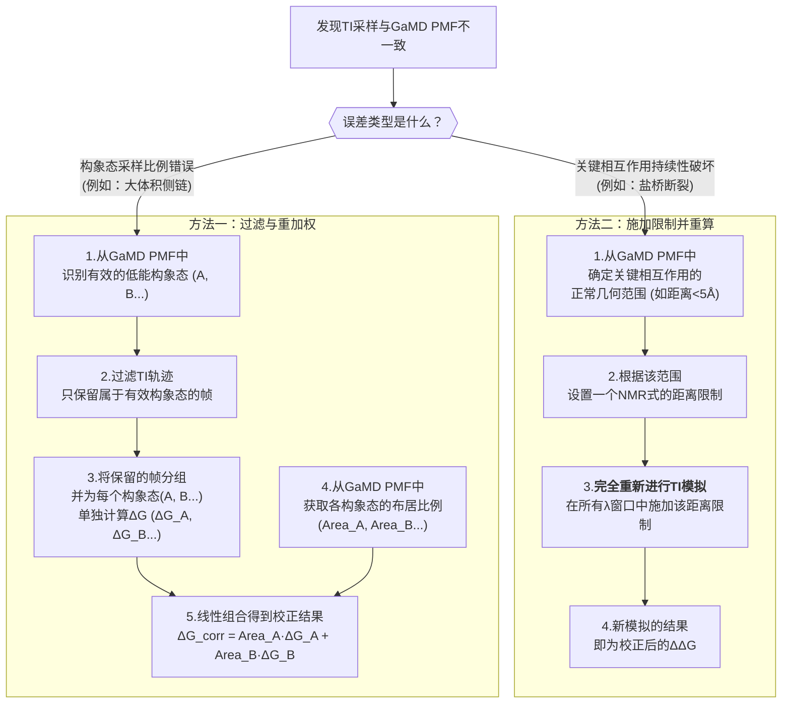

# 随机森林与增强采样联手：揭示并修正炼金术自由能计算中的幽灵误差

## 本文信息

  - **标题**: 研究炼金术自由能预测中的误差：使用随机森林模型与GaMD
  - **作者**: Skanda Sastry and Michael Tae-jong Kim
  - **单位**: Genentech Inc, South San Francisco, California, 美国
  - **引用格式**: Sastry, S., & Kim, M. T.-j. (2025). Investigating Errors in Alchemical Free Energy Predictions Using Random Forest Models and GaMD. *Journal of Chemical Information and Modeling*. [https://doi.org/10.1021/acs.jcim.5c01135](https://doi.org/10.1021/acs.jcim.5c01135)
  - **源代码**: [https://github.com/adnaksskanda/gamdti-paper](https://github.com/adnaksskanda/gamdti-paper)

## 摘要

> 当前最先进的抗体-抗原复合物计算结合自由能变化（$\Delta\Delta G$）预测技术，其精度约为$\pm1$ kcal/mol。尽管这对于高通量筛选或亲和力成熟等应用已足够，但对于在临床开发阶段评估**翻译后修饰（PTMs）的关键性和影响而言，这一精度仍显不足。那些导致结合能力下降超过50%的PTMs会对实现预期疗效构成重大风险，因此必须严格控制其含量以确保产品质量。50%的解离常数（$K_D$）损失对应于$+0.5$ kcal/mol的$\Delta\Delta G$变化，这意味着计算预测的精度必须达到$\pm0.5$ kcal/mol的阈值**，才能在临床阶段具有实际应用价值。在本文中，我们使用常规分子动力学热力学积分（CMD-TI）方法生成$\Delta\Delta G$预测值，并开发了一种结合**随机森林（RF）模型**和末端态**高斯加速分子动力学（GaMD）的误差分析方法。该方法仅需cMD-TI和末端态GaMD数据，即可无偏见地洞察关键自由度（DOF）的采样不足问题。我们发现，大体积侧链的采样不足和关键原子间相互作用的破坏**是主要的误差来源，通过我们基于GaMD的误差校正，在误差最大的案例中，预测精度提升超过了1 kcal/mol。当应用于一个包含13个突变的测试集时，基于GaMD的误差校正将均方根误差（RMSE）从$1.06 \pm 0.22$ kcal/mol降低至$0.70 \pm 0.18$ kcal/mol。这项工作不仅开创了利用炼金术自由能预测来评估PTM对生物活性影响的应用，也深入探究了限制其在临床开发中实际应用的关键误差来源。

一句话：跑一段GaMD来识别关键DOF，进而指导TI的采样能减小误差。

## 背景

治疗性抗体是现代生物医药的基石，其通过与特定抗原的高亲和力结合来发挥治疗作用。在抗体药物的规模化生产过程中，蛋白质不可避免地会发生各种化学修饰，即**翻译后修饰（PTMs），如色氨酸氧化、天冬氨酸异构化**等。这些PTMs如果发生在抗体-抗原结合界面附近，可能会显著改变结合亲和力，从而影响药物的疗效、药代动力学甚至安全性。因此，准确评估PTMs的影响，并将其作为关键质量属性（CQA）进行严格控制，是生物制药开发中的核心环节。

传统上，评估PTM影响主要依赖实验方法，如富集含有特定PTM的抗体亚型，再通过SPR等技术测定其结合活性。然而，这一过程不仅耗时耗力，而且当多种PTMs同时出现时，几乎无法剥离出单一修饰的影响。相比之下，计算模拟方法，特别是**炼金术自由能计算，为评估这些点突变或化学修饰对结合自由能的影响（$\Delta\Delta G$）提供了一个高效、精准的理论框架**。

然而，尽管炼金术自由能计算（如热力学积分TI或自由能微扰FEP）是当前预测相对结合自由能（RBFE）的“金标准”，但其精度仍然存在瓶颈。目前，对于蛋白质-蛋白质相互作用体系，该方法的**最佳精度约为$\pm1$ kcal/mol**。这一精度水平足以用于抗体亲和力改造的初步筛选，但对于临床阶段的CQA评估，则显得力不从心。一个对产品质量构成严重风险的PTM，其bioactivity影响阈值通常设定为50%，这在热力学上相当于仅仅**$+0.5$ kcal/mol**的$\Delta\Delta G$变化。因此，计算方法必须达到远超当前水平的$\pm0.5$ kcal/mol精度，才能为临床决策提供可靠依据。这一巨大的“精度鸿沟”是当前领域面临的核心挑战，其背后的误差来源——无论是力场不准、构象采样不足还是计算方案本身的缺陷——亟待被系统性地揭示和解决。

> 50%解离常数损失意味着什么？
>
> 在临床上，如果一个PTM导致抗体的生物活性（通常与结合亲和力相关）**损失超过50%**，则被认为具有高风险。在热力学层面，这意味着结合变得更弱，解离常数$K_D$增大。具体来说，“50%的活性损失”通常指突变体的$K_D$值变为野生型的两倍，即$K_{D,mutant} / K_{D,wildtype} = 2$。根据公式
> $$
> \Delta\Delta G = RT \ln(K_{D,mutant} / K_{D,wildtype})
> $$
> 在室温下（约298K），这对应于$\Delta\Delta G \approx +0.41$ kcal/mol的变化。为了能够可靠地识别这一变化，计算方法的精度必须显著优于这个值，因此作者提出了$\pm0.5$ kcal/mol的目标。

## 关键科学问题

本文旨在解决的核心科学问题是：**如何系统性地识别并校正炼金术自由能计算中的微观分子层面采样误差，从而将其预测精度提升至临床应用所需的$\pm0.5$ kcal/mol阈值以下？** 这不仅仅是一个提升数值精度的问题，更是要深入理解在非物理的炼金术路径中，哪些关键的分子动态行为被错误地表征，并开发出能够“对症下药”的诊断和修正策略。

## 创新点

  - **创新的误差诊断框架**：首次提出了一种无偏见的（untargeted）误差诊断新方法，该方法巧妙地将**机器学习（随机森林）**与**增强采样（GaMD）**相结合，能够从复杂的动力学数据中自动识别出导致计算误差的关键分子自由度（DOF）。
  - **揭示核心误差来源**：通过该框架，系统性地 pinpoint 了炼金术计算中两个主要的误差来源：一是**大体积氨基酸侧链（如Trp）的旋转异构态采样不足**；二是在炼金术中间态，由于混合势场的人为效应导致的**关键盐桥等原子间相互作用的破坏**。
  - **精准的误差校正策略**：针对上述误差来源，开发了相应的校正方法（如基于GaMD构象分布对TI数据进行过滤或重加权，以及使用距离限制来强制维持关键相互作用），在误差最大的案例中实现了超过1 kcal/mol的精度提升。

-----

## 方法和体系

作者采用了一套结合常规MD、增强采样MD和机器学习的综合性方法流程，详见图2。

### 1\. 模拟体系与数据集准备

  - **实验数据集**：本文使用的基准数据集来源于已发表的文献，主要包括`hu4D5-5`、`mab1`和`mab2`三个抗体系统的一系列单点突变及其对应的实验测定结合能数据。`hu4D5-5`是人源化抗p185HER2抗体4D5的一个变体，与乳腺癌靶点Erbb2抗原结合。
  - **结构准备**：抗体-抗原复合物的初始结构来源于PDB数据库（如`hu4D5-8`的冷冻电镜结构，PDB ID: 6OGE）。`hu4D5-5`的结构是通过在`hu4D5-8`上引入两个点突变（VH-V102Y 和 VL-E55Y）构建的。为了节省计算资源，模拟中对抗原蛋白进行了截断，仅保留了靠近结合界面的135个残基。
  - **MD模拟设置**：
      - **力场与溶剂**：所有模拟均采用**AMBER20**软件包，力场为**ff14SB**，水模型为**TIP3P**。体系被溶于一个半径为10 Å的水盒子中，并加入0.15 M的NaCl以模拟生理盐浓度。
      - **拓扑构建**：使用**AmberTools20**中的`tLEaP`和`parmed`工具准备拓扑文件。对于非天然氨基酸（甲硫氨酸亚砜），使用**Gaussian 09**和**antechamber**进行力场参数化。
      - **cMD-TI协议**：每个突变计算包含5个重复。体系首先在$\lambda=0.5$下进行能量最小化和升温弛豫，然后进行双向串行平衡，最后在**12个**$\lambda$​窗口下分别进行**5 ns**的production模拟。每个$\lambda$窗口用于分析的帧数（构象数）为 **200帧** 。
      - **GaMD协议**：为了获得更可靠的构象分布，对每个突变的端点态（野生型和突变型）进行了5次重复的、每次300 ns的**GaMD增强采样**模拟。

### 2. 随机森林(RF)关键自由度筛选

这是本文的核心创新，目的是从海量构象信息中找出导致误差的“罪魁祸首”。详见文末附录。

  - 数据集的每一行代表TI模拟过程中的一个**单一快照（即一个构象）**。对于同一帧，计算机会记录其对应的能量导数值$dV/d\lambda$。
  - **特征(Feature)提取**：首先，通过GaMD轨迹确定体系的最低能构象簇。然后，在突变位点周围5 Å的球形区域内，定义一系列几何参数作为候选特征，主要包括**侧链的二面角（rotamers）和原子间的距离（interatomic distances）**。
  - **目标变量(Target)定义**：RF模型要预测的目标不是原始的能量导数$dV/d\lambda$，而是经过高斯求积权重$w_j$加权后的值，即$w_j \cdot dV/d\lambda$。这使得模型能更直接地关注对最终$\Delta G$积分贡献最大的项。
  - **特征筛选与模型训练**：
    1.  使用**scikit-learn**库进行建模。
    2.  首先剔除相关性过高（Pearson $r > 0.5$）的冗余特征。
    3.  然后使用**递归特征消除（Recursive Feature Elimination）**方法进一步筛选，保留最重要的75%特征。
    4.  最后，使用这些筛选后的特征训练一个**随机森林回归模型**，并通过贝叶斯超参数调优来优化模型性能。
  - **关键自由度(DOF)识别**：模型训练完成后，利用随机森林内置的**“基于不纯度的平均特征重要性（mean impurity-based feature importance）”**指标，量化每个DOF对预测$w_j \cdot dV/d\lambda$的贡献度。得分最高的DOF即被认为是影响能量计算的**关键自由度**。

### 3\. 使用的软件工具总结

  - **MD模拟**: AMBER20, AmberTools20 (tLEaP, parmed)
  - **增强采样**: GaMD
  - **量子化学计算**: Gaussian 09
  - **机器学习**: scikit-learn
  - **轨迹分析**: CPPTRAJ, PyReweighting
  - **分子可视化**: VMD

## 研究内容与结果

### 初始TI预测的性能基准

作者首先在一个包含20个有定量实验数据的抗体突变数据集上，评估了他们标准cMD-TI流程的性能。

**图1：经验ΔΔG与预测ΔΔG的对比图**。该图展示了包含所有定量实验结果的案例中，初始TI预测值（纵轴）与实验测量值（横轴）的比较。理想情况下，所有数据点应落在对角虚线上。虽然整体趋势良好（斜率0.788），但均方根误差（RMSE）为0.94 kcal/mol，且许多数据点落在了$\pm1$ kcal/mol的误差区间（点线之间）之外。分析发现，**涉及大体积侧链（如Phe, Tyr, Trp）或电荷变化的突变，误差往往更大**。

### 创新的RF+GaMD联合误差诊断流程

为了剖析这些误差的根源，作者设计了一套创新的诊断流程。

**图2：TI计算与误差模式分析方法的图形化示意图**。该图展示了整个工作流程：(左上) 首先通过常规的TI计算获得初始的$\Delta\Delta G$；(中上) 在突变位点周围5Å的局部环境中测量各种DOF；(右上) 将这些DOF作为输入，加权的$dV/d\lambda$作为输出，训练一个随机森林模型，以识别出对能量影响最大的关键DOF；(中下) 利用GaMD增强采样的轨迹生成这些关键DOF的自由能分布图（PMF）；(左下) 将常规TI模拟对关键DOF的采样情况与GaMD的PMF进行对比，找出采样不一致的地方，并据此进行校正。

通过该流程，作者识别出了导致TI计算不准确的关键DOF。

#### 跑GaMD不需要事先知道关键DOF？

在这个工作流程中，跑GaMD时**不需要**事先知道哪个或哪些DOF是关键的。这正是该方法**“无偏见”（untargeted）**的核心优势所在。

GaMD的角色是作为一个独立的、更可靠的“黄金标准”来使用。它通过施加一个偏置势能，对体系的**整个势能形貌**进行增强采样，目的是尽可能地探索所有可能的构象，并生成一个接近真实平衡态的自由能分布图（PMF）。这个过程是全局性的，不针对任何特定的DOF。

关键DOF的识别是在**之后**发生的。流程是：

1. **并行计算：独立地运行常规TI模拟和GaMD增强采样模拟。**
2. **事后诊断**：利用随机森林模型，分析TI轨迹和能量数据，从事后诸葛亮的角度找出哪些DOF对能量计算影响最大。
3. **交叉验证**：将RF模型找出的关键DOF在TI模拟中的表现，与GaMD这个“黄金标准”进行对比，从而确认采样错误。

#### 怎么根据PMF校正采样的？

详见附录。

**表1：由随机森林模型识别出的误差最大案例中的前5个最重要自由度**

| rank | hu4D5-5 VH-R50A (charging step) | hu4D5-5 VH-W95A | mab2 VL-Y→R (charging step) | mab2 VH-T→Y | hu4D5-5 VL-F53N |
| :--- | :--- | :--- | :--- | :--- | :--- |
| **1** | **Ag-E71:VH-R50 salt bridge dist** | **VH-W95 chi1** | **Ag-D161:VL-R49 salt bridge dist** | **Ag-V117:VH-Y53 H-bond dist** | **Ag-C117:VL-N53 H-bond dist** |
| **2** | VH-R50 chi1 | **VH-W95 chi2** | VL-R49:VL-S50 H-bond dist | VL-Y53 chi1 | VL-N53 chi1 |
| **3** | VH-R94 chi4 | VH-V48 chi1 | VL-S53 chi1 | VL-T53 chi1 | Ag-M102 chi1 |
| **4** | VH-F100 chi1 | VL-T94:VH-R50 H-bond dist | VL-S50 chi1 | VL-T53:VL-N51 H-bond dist | Ag-N53 chi2 |
| **5** | Ag-E71 chi3 | Ag-E71 chi3 | Ag-R157 chi1 | VL-Y53 chi2 | Ag-N120 chi1 |

*注：表格内容根据原文Table 1整理。加粗的特征是作者后续使用GaMD自由能图进行深入检查的特征。*

### 案例分析：揭示三大核心误差来源

#### 案例1：大体积侧链采样不足 (Bulky Side-Chain Undersampling)

在`hu4D5-5 VH-W95A`（色氨酸突变为丙氨酸）这个误差高达1.88 kcal/mol的案例中，RF模型指出，**W95侧链的两个二面角（chi1/chi2）是影响能量计算的最关键DOF**。

**图3：(A, C) 完整的和 (B, D) 校正后的TI采样与VH-W95 chi1/chi2旋转角空间的GaMD自由能形貌图的比较，分别对应结合态(A, B)和非结合态(C, D)**。图中，背景的彩色热图代表由GaMD增强采样得到的“真实”自由能地貌，其中颜色越深的区域能量越低，是侧链最应该停留的构象。而灰色的散点则代表在常规TI模拟中，侧链实际访问过的构象。

  - 在(A)和(C)中可以看到，大量的TI采样点（灰色散点）散落在高能量区域，并未准确地集中在GaMD发现的两个主要低能区域（能量阱）。
  - 更重要的是，TI模拟对这两个能量阱的**采样比例**（例如在结合态，TI采样比例为33.6% vs 66.4%）与GaMD计算的**真实布居比例**（GaMD: 24.5% vs 75.5%）存在显著偏差。
  - 作者通过过滤掉无效的TI采样帧，并根据GaMD的比例对两个能量阱的贡献进行重新加权，最终将预测误差从1.88 kcal/mol**降至0.44 kcal/mol**。

#### 案例2：关键盐桥相互作用的破坏 (Violation of Key Salt Bridge Interactions)

在`hu4D5-5 VH-R50A`和`mab2 VL-Y→R`这两个涉及电荷变化的突变案例中，RF模型发现，影响计算的最关键DOF是抗体与抗原之间的一个**关键盐桥的距离**。

**图5：(A) hu4D5-5复合物中的Ag-E71:VH-R50A盐桥和(B) mab2复合物中的Ag-D161:VL-Y→R盐桥的可视化**。图中展示了由RF模型识别出的关键盐桥。

**图4：(A-C) hu4D5-5 VH-R50A和(D-F) mab2 VL-Y→R中关键盐桥距离的GaMD自由能形貌图（曲线）与TI采样（直方图）的对比**。(A, D)为原始TI模拟，(B, E)为过滤后的TI数据，(C, F)为施加NMR距离限制后的TI模拟。

  - 在(A)和(D)中，可以惊人地发现，在大部分TI模拟帧中（绿色直方图），该盐桥的距离都远远超过了5Å，说明**这个关键的相互作用在计算过程中被人为地破坏了**。
  - 作者推测这是由于炼金术中间态的混合势场削弱了静电作用所致。
  - 通过(B, E)过滤掉盐桥破坏的帧，或(C, F)在TI模拟中施加距离限制来强制维持盐桥，**预测精度都得到了超过1 kcal/mol的显著提升**。

> 小编补充：从图4来看，似乎过滤数据分布也差不多，但很可能普通TI散掉了就一直散掉了，采不了多少数据？还是约束着好。

#### 案例3：关键氢键相互作用的破坏 (Violation of Key Hydrogen Bonds)

对于`mab2 VH-T→Y`和`hu4D5-5 VL-F53N`这两个案例，RF模型识别出的关键DOF是分子间的氢键距离。与前两种情况类似，TI模拟也未能准确捕捉这些氢键的正确构象。然而，对这类更动态、更复杂的相互作用进行校正要困难得多。例如，在`mab2 VH-T→Y`中，由于**自由能形貌呈现双峰分布，简单的加权求和难以实现。**在`hu4D5-5 VL-F53N`中，施加距离限制甚至导致了体系无法正确平衡。这表明，虽然该框架能有效识别问题，但对某些复杂情况的修复仍是未来的挑战。

### 总体校正效果

**表2：对误差最大的几个预测进行GaMD校正的效果总结**
| case | original $\Delta\Delta G$ (kcal/mol) | corrected $\Delta\Delta G$ (kcal/mol) | empirical $\Delta\Delta G$ (kcal/mol) | original error (kcal/mol) | corrected error (kcal/mol) | model R² | theorized source of error |
| :--- | :--- | :--- | :--- | :--- | :--- | :--- | :--- |
| hu4D5-5 W95A | $3.19 \pm 0.71$ | $4.63 \pm 0.47$ | 5.07 | 1.88 | **0.44** | 0.53 | bulky side-chain undersampling |
| hu4D5-5 R50A | $2.98 \pm 1.02$ | $5.14 \pm 1.05$ | 4.58 | 1.60 | **0.56** | 0.73 | salt bridge violation |
| mab2 VL-Y→R | $0.61 \pm 1.04$ | $-0.87 \pm 1.01$ | \< -0.83 | \> 1.43 | - | 0.48 | salt bridge violation |
| mab2 VH-T→Y | $1.69 \pm 0.75$ | $0.61 \pm 0.73$ | 0 | 1.69 | **0.61** | 0.76 | hydrogen bond violation |
| hu4D5-5 VL-F53N| $-0.56 \pm 0.57$ | - | 1.19 | 1.75 | - | 0.64 | hydrogen bond violation |

*注：表格内容根据原文Table 2整理。不确定度为95%置信区间。original：普通TI；empirical：实验世界*

最终，作者将此校正方法应用到包含13个突变的整个`hu4D5-5`数据集，进一步验证了其普适性。

**表3：对hu4D5-5数据集($n=13$)的误差分析：原始方案、延长模拟方案与RF+GaMD校正方案的对比**
| protocol | MAE | RMSE |
| :--- | :--- | :--- |
| original protocol (5 ns per $\lambda$) | $0.82 \pm 0.18$ | $1.06 \pm 0.22$ |
| extended protocol (25 ns per $\lambda$) | $0.71 \pm 0.18$ | $0.93 \pm 0.23$ |
| **RF + GaMD correction** | **$0.53 \pm 0.16$** | **$0.70 \pm 0.18$** |

*注：表格内容根据原文Table 3整理。MAE为平均绝对误差，RMSE为均方根误差。*

结果表明，**简单地将模拟时间延长5倍，对精度的提升有限**，而**RF+GaMD校正方法则取得了实质性的改进**，使RMSE非常接近$\pm0.5$ kcal/mol的目标精度。

## 深入讨论

本文的讨论部分对研究的发现及其意义进行了深刻的阐述。

1.  **盐桥破坏是炼金术计算中的一个普遍且棘手的问题**：作者强调，在炼金术中间态，混合势场会系统性地削弱静电相互作用，导致关键盐桥的“局部解离”。这是一个方法本身的缺陷，无法通过简单延长模拟时间来解决。作者将他们基于物理的距离限制校正方法与文献中其他经验性的校正方案进行对比，认为他们的方法虽然计算成本更高，但更为严谨和可靠，特别适用于对精度要求极高的场景。
2.  **机器学习赋能无偏见的误差诊断**：本文最大的方法学创新在于利用RF模型实现了一种“无偏见”的误差溯源。在不具备任何先验知识的情况下，该模型能自动从纷繁的动力学数据中识别出对能量计算起决定性作用的少数几个DOF。这为解决自由能计算中的“未知之不知”问题提供了一个强大的工具。
3.  **对已知问题的再验证**：RF模型能够自动识别出“大体积侧链采样不足”这一领域内公认的难题，这本身就强有力地验证了该诊断框架的有效性。作者指出，他们的框架可以作为更高级的增强采样方法（如ACES）的前导步骤，为其指明需要增强采样的关键DOF，从而提高效率。
4.  **对力场误差的评估**：在经过一系列采样校正后，预测的RMSE降低到了0.70 kcal/mol。考虑到实验测量本身也存在约$\pm0.3$ kcal/mol的误差，这意味着由ff14SB力场本身带来的误差可能非常小（约0.2-0.4 kcal/mol）。这表明，在当前阶段，**改善采样问题比优化力场参数对提升预测精度的贡献可能更大**。

## Q&A

  - **Q1**: 为什么简单地延长TI模拟时间通常无法修复这些预测误差？

  - **A1**: 因为这些误差很多是**系统性误差（systematic error）**，而非随机误差。例如，在电荷变化突变中，炼金术路径中间态的“混合势场”会人为地削弱静电相互作用。这导致关键的盐桥即使在理论上应该存在的情况下也容易断裂。无论模拟时间多长，只要这个势场本身存在缺陷，盐桥就可能一直处于被破坏的状态。这并非采样不足的问题，而是方法本身的“人造缺陷”（artifact）。

  - **Q2**: 随机森林模型（RF）在其中扮演了什么角色？为什么不直接分析所有可能的分子自由度（DOF）？

  - **A2**: RF模型扮演了“**筛子**”或“**侦探**”的角色。在一个复杂的蛋白质体系中，分子自由度（如所有侧链的旋转角、所有原子间的距离）的数量是巨大的。绝大多数DOF的变化对我们关心的$\Delta\Delta G$计算影响甚微，它们是“噪音”。RF模型通过监督学习，能够从海量的DOF中，找出与能量导数$dV/d\lambda$相关性最强、即对最终结果影响最大的那几个**“关键自由度”**。这使得后续的分析可以集中火力解决主要矛盾，而不是在无关的噪音中大海捞针。

  - **Q3**: GaMD增强采样给出的自由能分布就一定是“正确”的吗？这个方法的核心假设是什么？

  - **A3**: GaMD并不保证绝对“正确”，但它是一种**增强采样**方法，相比于几纳秒的常规MD（cMD），它能更快速、更广泛地探索分子的构象空间，因此其得到的自由能分布**更有可能接近**体系的真实平衡态分布。该方法的核心假设是：由长时间GaMD模拟得到的构象能量地貌，比短时间的常规TI模拟所采样的构象，能更准确地反映体系的真实热力学性质。当然，使用GaMD时，研究者也需要通过检查收敛性等方式来确认其结果的可靠性。

  - **Q4**: 论文中使用距离限制（restraint）来修复盐桥断裂问题，但施加限制本身不会引入新的能量项，从而影响自由能计算吗？

  - **A4**: 问得非常好，这确实是一个严谨性问题。是的，施加限制会改变系统的哈密顿量，理论上需要计算并扣除这个限制所贡献的自由能。在一些体系中（如小分子-蛋白），有成熟的方法（如Boresch restraints）来解析地计算这一项。但在复杂的蛋白-蛋白界面，这个问题尚无标准解法。作者在文中也承认了这一点，他们认为，由盐桥断裂引入的巨大误差（\>1 kcal/mol）远大于忽略限制自由能所带来的微小误差，因此在当前阶段，这是一个实用且有效的近似处理方法。

  - **Q5**: 这个RF+GaMD框架与其他改进炼金术计算的方法（如ACES）有何不同？

  - **A5**: 它们是互补而非竞争的关系。像ACES（炼金术增强采样）这类方法，旨在通过在炼金术路径上对某些“慢”自由度进行增强采样来加速收敛。但一个前提是，你需要**预先知道应该对哪些自由度进行增强采样**。而本文提出的RF+GaMD框架的核心贡献之一，就是提供了一种**无偏见的、自动化的方法来识别出这些需要被特别关注的关键自由度**。因此，可以将该框架视为ACES等更高级采样方法的前置步骤：先用RF+GaMD做“侦查”，找出问题所在，再用ACES等方法进行“精确打击”。

## 关键结论与批判性总结

### 关键结论

* 本文提出并验证了一个结合**随机森林（RF）**和**高斯加速分子动力学（GaMD）**的创新框架，该框架能够以一种**无偏见（untargeted）**的方式，系统性地诊断和校正炼金术自由能计算中的采样误差。
* 研究发现，**大体积侧链（如色氨酸）的旋转异构态采样不足**和在炼金术中间态由于混合势场导致的**关键盐桥人为断裂**，是导致$\Delta\Delta G$预测不准确的两大主要来源。
* 通过应用基于GaMD的针对性校正策略（对不同构象态进行重加权或施加距离限制），在误差最大的案例中，预测精度提升**超过1 kcal/mol**。对于包含13个突变的hu4D5-5数据集，该方法将整体均方根误差（RMSE）从$1.06 \pm 0.22$ kcal/mol**降至$0.70 \pm 0.18$ kcal/mol**，非常接近临床应用所需的0.5 kcal/mol精度目标。
* 研究明确表明，简单地将模拟时间延长5倍（从每个$\lambda$窗口5 ns增加到25 ns）对精度的提升非常有限（RMSE仅从1.06 kcal/mol降至0.93 kcal/mol），这证实了误差主要来源于**系统性缺陷而非随机采样不足**，因此必须采用更具针对性的校正方法。

### 批判性总结

* **潜在影响**：该工作为突破炼金术自由能计算的精度瓶颈提供了一个**强大、系统且思路清晰的框架**。其“**无偏见的误差识别能力**”尤为重要，能够在使用常规TI计算的基础上，为更高级的增强采样方法（如ACES）指明需要关注的关键自由度。这有望将高精度自由能计算从少数专家的“炼丹术”推广为更可靠、更自动化的标准流程，从而加速其在**治疗性抗体药物临床前CQA评估**等要求苛刻的工业领域的应用。
* **存在的局限性**：
  * 尽管对盐桥断裂的校正效果显著，但对于更瞬态、更复杂的相互作用（如**氢键网络**）的校正仍具挑战性，因为这些相互作用的自由能形貌可能呈现复杂的多峰分布，难以直接修复。
  * 此外，**施加距离限制所贡献的自由能**未能被严格计算，这在理论上仍是一个待解决的问题。
  * 同时，该框架无疑增加了**额外的计算成本**，因为它需要在标准TI计算之外进行长时间的GaMD模拟和机器学习模型训练。

* **未来研究方向**：未来的工作可以致力于将该框架推广到**更多的PTMs类型**（如天冬酰胺脱氨等）和更复杂的分子体系中。同时，开发更普适、更自动化的方法来校正氢键等瞬态相互作用，以及探索如何在蛋白-蛋白体系中严格处理限制自由能的贡献，将是该领域的重要发展方向。

## 附录1：随机森林(RF)关键自由度筛选

- **高斯求积权重$w_j$的来源**：高斯求积是一种经典的数值积分方法，其目的是用一个离散的加权和来高度精确地近似一个连续积分。对于热力学积分中自由能的计算，其基本形式为：
  $$
  \Delta G = \int_{0}^{1} \left\langle \frac{\partial V(\lambda)}{\partial \lambda} \right\rangle_{\lambda} d\lambda
  $$
  为了在计算机中求解，该积分被离散化。在使用N点高斯求积法时，这个积分被近似为在N个特定的$\lambda$坐标点（$\lambda_j$）上计算值的加权和：
  $$
  \Delta G \approx \sum_{j=1}^{N} w_j \cdot \left\langle \frac{\partial V(\lambda)}{\partial \lambda} \right\rangle_{\lambda_j}
  $$
  在这项工作中，作者使用了**12点高斯求积方案**（即$N=12$）。这些$\lambda_j$坐标点和它们对应的权重$w_j$是根据高斯求积的数学理论**预先确定的**，旨在最大化数值积分的精度。该论文将这些权重作为标准数值方法的组成部分直接使用，并未详细阐述其数学推导过程。

- **递归特征消除（Recursive Feature Elimination, RFE）的具体操作**：该方法通过一个迭代过程来系统性地减少特征数量，以找到性能最佳的特征子集。其操作流程如下：
    1.  **初始训练**：使用全部$p$个候选特征$S_0 = \{f_1, f_2, \dots, f_p\}$训练一个基础模型（本文中是一个最大深度为5的决策树回归器）。
    2.  **重要性排序**：根据训练好的模型，计算并排序所有特征的重要性。
    3.  **特征剔除：移除最不重要的预设百分比的特征**。根据论文描述，每次迭代剔除5%的特征。这个过程可以表示为：
        $$
        S_{k+1} = S_k \setminus R_k
        $$
        其中，$S_k$是第$k$次迭代的特征集，$R_k$是该轮中被评定为最不重要的5%特征的集合。
    4.  **循环迭代**：重复步骤1至3，直到特征数量达到预设的目标。在本文中，该过程持续进行，直到保留原始特征集中最重要的75%为止。

- **贝叶斯超参数调优的具体操作**：这是一种用于自动寻找机器学习模型最佳超参数组合的优化算法。其目标是找到一组能使模型性能最大化的超参数$\theta^*$。
    1.  **定义目标函数**：首先定义一个评估模型性能的目标函数$J(\theta)$。在本文中，目标函数被设定为**5折交叉验证后的平均$R^2$值**，这代表了模型的泛化能力。
    2.  **构建代理模型**：贝叶斯优化使用一个概率模型（通常是高斯过程）来拟合已观察到的超参数点$(\theta, J(\theta))$与目标函数之间的关系。
    3.  **优化搜索**：整个搜索过程共进行200次迭代。**前50次通过拉丁超立方采样进行随机探索**，以获得对超参数空间的初步了解。随后的150次迭代则由贝叶斯模型指导，通过一个“采集函数”来智能地选择下一个最有希望提升性能的超参数组合进行尝试，从而高效地找到全局最优解。整个优化问题可表示为：
        $$
        \theta^* = \arg\max_{\theta \in \Theta} J(\theta)
        $$
        其中$\Theta$是所有可能的超参数组合空间。

- **基于不纯度的平均特征重要性的具体计算**：这是决策树和随机森林模型中常用的一种评估特征重要性的方法。对于回归任务，其核心是计算每个特征对“方差减少”的贡献。
    1.  **节点方差**：对于树中的任意一个节点$m$，其包含的数据点的方差定义为：
        $$
        \text{Var}(m) = \frac{1}{N_m} \sum_{i \in \text{node } m} (y_i - \bar{y}_m)^2
        $$
        其中$N_m$是节点$m$中的样本数，$y_i$是样本值，$\bar{y}_m$是节点内所有样本的平均值。
    2.  **分裂带来的方差减少**：如果一个节点$m$使用特征$f$进行分裂，产生左右两个子节点，那么这次分裂带来的方差减少量（即该节点的重要性）为：
        $$
        \Delta I(m, f) = \text{Var}(m) - \left( \frac{N_{\text{left}}}{N_m} \text{Var}(\text{left}) + \frac{N_{\text{right}}}{N_m} \text{Var}(\text{right}) \right)
        $$
    3.  **特征在单棵树中的重要性**：一个特征$f$在单棵决策树$T$中的总重要性，是它在所有用它进行分裂的节点上带来的方差减少量的总和。
    4.  **特征在森林中的重要性**：在随机森林中，一个特征的最终重要性是它在所有树中的重要性的平均值。为了结果的稳健性，作者通过5次重复的5折交叉验证共训练了25个模型，最终的特征重要性是这25个模型计算出的重要性分数的平均值。

## 附录2：校正采样的细节

### 怎么根据PMF校正采样的？

根据识别出的不同误差来源，作者采用了两种不同的、具有针对性的校正策略：

**1. 针对构象态采样比例错误的校正（过滤与重加权）**

这种方法主要用于处理像**大体积侧链采样不足**（如W95A案例）这样的问题，即TI模拟虽然找到了正确的低能构象态，但对它们的采样比例是错误的。

- **第一步：识别构象态**。首先，根据GaMD生成的PMF，确定体系存在几个主要的低能构象微观态（microstates）以及它们各自的能量盆。例如，在W95A案例中，GaMD发现W95侧链主要存在两个稳定的旋转异构态。

- **第二步：过滤TI数据**。检查常规TI模拟的每一帧，将所有不属于GaMD识别出的任何一个低能构象态的帧全部**过滤掉、丢弃**。这些被认为是物理意义不大或采样错误的“噪音”数据。

- **第三步：分别计算各态的自由能**。对于过滤后剩下的数据，**将其按照所属的构象态进行分组**。然后，为**每一个构象态单独计算**其炼金术自由能变化$\Delta G$。例如，如果存在两个微观态，就会得到$\Delta G_1和\Delta G_2$。

- **第四步：根据GaMD比例进行重加权**。最后，根据GaMD的势能面（Potential of Mean Force, PMF）计算出各个微观态的真实热力学布居比例（即自由能盆的面积或体积占比，例如$\text{Area}_1$和$\text{Area}_2$）。用这个比例作为权重，对上一步分别计算出的自由能进行线性组合，得到最终校正后的总自由能：

  $$
  \Delta G_{\text{corrected}} = (\text{Area}_1 \times \Delta G_1) + (\text{Area}_2 \times \Delta G_2) + \dots
  $$
  这个过程本质上是**用热力学积分（Thermodynamic Integration, TI）的局部能量信息，结合增强采样分子动力学（GaMD）的全局构象分布信息**，来重构一个更准确的自由能值。

**2. 针对关键相互作用破坏的校正（施加距离限制）**

这种方法主要用于处理像**关键盐桥断裂**（如R50A案例）这样的问题，即TI模拟系统性地无法采样到某个本应存在的关键相互作用。

- **第一步：识别相互作用**。通过GaMD的PMF确认某个关键相互作用（如盐桥）在平衡态下是稳定存在的，并确定其正常的距离范围（例如< 5 Å）。
- **第二步：施加距离限制并重新模拟**。作者发现，简单地过滤数据会导致样本量急剧下降。因此，他们采用了一种更稳健的方法：**重新进行一次TI模拟**。在这次新的模拟中，他们施加了一个NMR式的**距离限制（distance restraint）**，强制性地将形成盐桥的两个原子基团的距离约束在GaMD确定的合理范围内。
- **第三步：使用限制性模拟的结果**。这个限制有效地阻止了盐桥在炼金术中间态的人为断裂，确保了这一关键相互作用在整个计算过程中的完整性。最终的$\Delta\Delta G$直接采用这次**限制性TI模拟**的结果。虽然从理论上讲，施加限制本身会引入额外的自由能项，但作者认为，由盐桥破坏引入的巨大误差（>1 kcal/mol）远大于忽略限制自由能所带来的微小误差，因此这是一个在实践中非常有效的校正策略。

### 如何从GaMD PMF中确定关键相互作用的正常几何范围？

从GaMD（高斯加速分子动力学）生成的PMF（Potential of Mean Force，平均力势）图中确定相互作用的正常几何范围，主要依赖于对自由能形貌的解读。这个过程可以分为两步：

- 第一步：生成并观察自由能分布图

  首先，需要针对感兴趣的几何参数（例如形成盐桥的两个原子团之间的距离）运行GaMD模拟并计算其一维PMF。这个PMF图的纵轴是自由能，横轴是距离。一个热力学稳定的相互作用会在图中表现为一个

  **清晰、深刻的能量阱（energy well）**。在论文的图4中，这个能量阱体现为相对丰度（Relative Abundance）图上的一个**尖锐、高耸的山峰** 。

- 第二步：根据能量阱定义范围

  “正常几何范围”就是这个能量阱所覆盖的距离区间。具体操作是：

  - **定位能量最低点**：找到能量阱最深处（即概率峰值最高处）对应的距离值。这代表了该相互作用最可能存在的距离。
  - **确定边界**：从能量最低点向两侧延伸，直到自由能开始急剧上升的位置为止。这个能量急剧上升的“井壁”就定义了稳定相互作用的边界。
  - **应用临界值**：在实践中，可以根据物理化学常识设置一个合理的临界值（cutoff）。例如，对于盐桥，通常认为带电原子团之间的距离在**4-5 Å以内**才算形成有效的相互作用。在论文的图4中，GaMD的PMF清晰地显示能量阱完全位于5 Å以内，因此作者采用**“距离 < 5 Å”**作为判断盐桥是否完整的标准是合理且有数据支持的 2。

## 附录3：SI的信息

### 1. 完整的实验基准数据集 (Table S1)
* SI提供了用于验证计算结果的**全部23个突变的完整实验数据**。这包括每个突变的来源文献、实验方法（如SPR、滴定量热法）、原始测量值（如Kd值），以及最终转换为$\Delta\Delta G$ (kcal/mol)的结果。
* 文件还澄清了数据处理的细节，例如在`hu4D5-5`数据存在多个报告值时，优先选择SPR数据，但对于解离速率过快的突变（如W95A），则根据与原作者的沟通改用等温滴定微量热法（ITC）的数据。

### 2. 完整的初始TI计算结果 (Table S3)
* 与实验数据相对应，SI列出了**所有23个突变的初始TI计算预测值**（$\Delta\Delta G$）及其不确定度。
* 该表格还对每个突变进行了分类，明确标注了其是否涉及**大体积侧链（bulky side chain）**、**电荷变化（charge-changing）**或两者兼有。这使得读者可以直接比较不同类型突变的预测难度和误差大小。

### 3. 误差来源的排他性证据 (Table S2)
* 在分析涉及电荷变化的突变时，炼金术转化通常分为范德华（vdW）和静电（charging）两个步骤。主文假设误差主要来源于静电步骤。
* Table S2提供了关键的“排除法”证据：当作者将RF+GaMD校正方法仅应用于误差最大的两个电荷变化突变（R50A和Y→R）的**范德华步骤**时，预测精度的改善**微乎其微（trivial change）**。这有力地证明了误差几乎完全集中在静电（charging）步骤，与主文中观察到的盐桥破坏现象高度吻合。

### 4. 随机森林（RF）模型的详细参数与定义 (Table S4, S4.2)
* 为了提高研究的可复现性，SI提供了RF分析的更多细节。Table S4列出了主文中提到的**前5个最重要自由度（DOF）的定量重要性分数**。
* S4.2节提供了**每个关键DOF的精确原子定义**。例如，它明确定义了“Ag-E71:VH-R50盐桥距离”是“抗原E71残基的CD原子与抗体VH链R50残基的CZ原子之间的距离”。这些精确的定义对于其他研究者复现或借鉴该方法至关重要。

### 5. 方法的稳健性验证 (Table S5, Figures S1-S4)
* 为了排除误差是由于特定的“两步法”电荷转化方案引起的可能性，作者使用了一种更新的**“一步法”**转化方案（使用smoothstep软核势）重新计算了两个关键的电荷变化突变。
* 结果显示，即使在“一步法”中，**同样的盐桥破坏问题依然存在**。并且，施加距离限制同样能有效地校正误差。这表明盐桥破坏是一个与炼金术混合势场相关的普遍性问题，而非特定计算方案的产物。

### 6. 发现的普适性——对外部数据的验证 (Figures S5-S11)
* 为了验证其发现的普适性，作者将其分析思路应用到了一个完全不同的、已发表的**barstar-barnase蛋白复合物**体系中，该体系的某些突变在原研究中也存在无法解释的巨大误差。
* 作者对这些出错的突变进行了GaMD模拟，结果发现，**在每一个出错的案例中，都存在一个先前未被讨论的关键盐桥或氢键相互作用**。这强烈暗示，这些外部数据集中的误差很可能也是由同样的关键相互作用破坏机制导致的，从而极大地增强了本文结论的普适性。

### 7. 对比“增加算力”与“智能校正”的效果 (Table S6, S7)
* SI提供了最有说服力的数据之一：简单粗暴地增加算力是否能解决问题？作者将所有模拟的采样时间**增加了5倍**（从每个λ窗口5 ns延长到25 ns）。
* 结果显示，5倍的算力投入**对精度的提升非常有限**（RMSE仅从1.06轻微降至0.93 kcal/mol），甚至在某些情况下预测结果反而变得更差。
* 相比之下，应用RF+GaMD智能校正方法的RMSE则显著降低至0.70 kcal/mol。这组对比有力地证明了文中所述的误差是**系统性误差**，无法通过“大力出奇迹”来解决，必须采用本文提出的这种更智能的诊断和校正策略。

