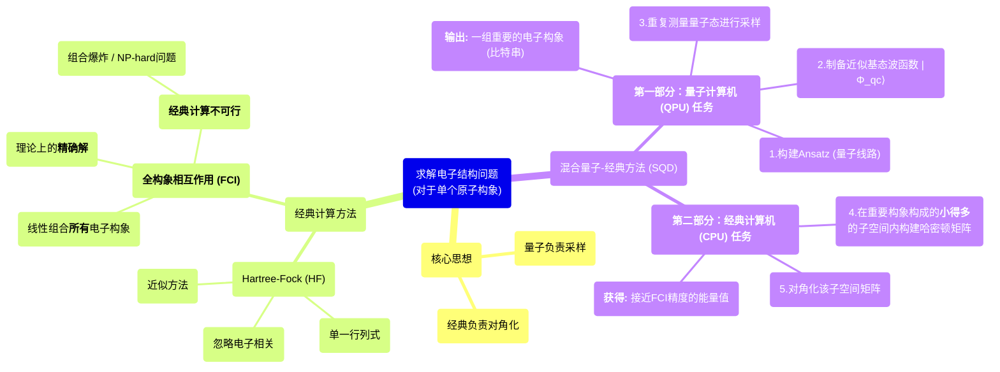

# 量子计算首次炼金：将CI方法引入自由能计算以提升dG预测精度

## 本文信息

- **标题**：以量子为中心的炼金术自由能计算 (Quantum-Centric Alchemical Free Energy Calculations)
- **作者**：Milana Bazayeva, Zhen Li, Danil Kaliakin, Fangchun Liang, Akhil Shajan, Susanta Das, and Kenneth M. Merz Jr.*
- **发表时间**：2025年6月25日 (arXiv预印版)
- **引用格式**：Bazayeva, M., Li, Z., Kaliakin, D., Liang, F., Shajan, A., Das, S., & Merz, K. M. Jr. (2025). Quantum-Centric Alchemical Free Energy Calculations. *arXiv:2506.20825v1 [physics.chem-ph]*.
- **源代码**：
    - **Qiskit**：https://github.com/Qiskit/qiskit
    - **Qiskit Addon SQD**：https://github.com/Qiskit/qiskit-addon-sqd
    - **ffsim**：https://github.com/qiskit-community/ffsim
    - **PySCF**：https://github.com/pyscf/pyscf
    - **SQD教程**：https://qiskit.github.io/qiskit-addon-sqd/tutorials/01_chemistry_hamiltonian.html

## 摘要

> 在本文中，我们提出了一种**混合量子-经典工作流**，旨在通过结合**构象相互作用（CI）模拟和book-ending校正**方法，来提高炼金术自由能（AFE）预测的准确性。该方法利用多态贝内特接受率（MBAR）在一个耦合参数λ上平滑地将系统从分子力学（MM, λ=0）描述过渡到量子力学（QM, λ=1）描述。由此产生的校正值随后被应用于经典（MM）计算的AFE结果，以引入更精确的QM处理。标准的book-ending流程使用AMBER模拟MM区域，并使用其默认的QM引擎QUICK来处理QM区域（通常使用Hartree-Fock或密度函数理论）。在本文中，我们为QUICK引入了一个通过`sander`实现的新颖接口，该接口支持CI模拟，并可以两种方式运行：A) 通过PySCF后端，利用常规计算资源执行**全构象相互作用（FCI）**；B) 通过Qiskit，利用**量子硬件**和传统计算后处理，执行以量子为中心的**样本基量子对角化（SQD）**工作流。在此工作流中，QUICK执行大部分计算，但在用户定义的间隔，它会将计算重定向到FCI或SQD后端以获得CI结果。我们计算了三种小有机分子（氨、甲烷和水）的水合自由能（HFE）的book-ending校正值，以基准测试我们提出的方法，并展示量子计算机如何被用于AFE计算。我们相信，该方法在未来的研究中可以扩展到更复杂的体系，如药物-受体相互作用。

省流：效果一般，就是看看。。。

## 背景

精确预测分子间的结合亲和力是现代药物发现的圣杯。在众多计算策略中，炼金术自由能（AFE）计算因其能够严谨地预测水合自由能、配体-受体结合亲和力等关键热力学性质而备受瞩目。然而，当前AFE方法的精度上限很大程度上受制于其底层的经典分子力学（MM）力场。这些力场本质上是基于经验参数的简化模型，在面对包含复杂离子环境、核酸或强极化效应的新型药物分子时，其准确性往往会大幅下降。

为了克服经典力场的局限性，研究人员自然地将目光投向了能更精确描述电子结构的量子力学（QM）方法。将QM与MM结合的QM/MM方法应运而生，它允许人们用高精度的QM方法处理反应中心或配体等关键区域，同时用高效的MM方法处理周围的溶剂和蛋白质环境。然而，AFE计算需要对体系进行大量的构象采样以确保收敛，而QM计算的巨大计算成本使得直接进行完全的QM/MM AFE模拟在实践中几乎不可行。

为了解决这一困境，"Book-ending"方法作为一种巧妙的折中方案被提了出来。其核心思想是"**主力靠MM，精度靠QM校正**"。具体来说，我们首先用廉价且快速的纯MM模拟完成整个炼金术转化过程，得到一个初步的自由能值。然后，我们只在炼金术路径的两个端点（"book-ends"，即分子完全存在和完全消失的状态），计算一个从MM描述到QM/MM描述的自由能校正项。由于这个校正过程不改变体系的化学成分，仅改变其势能函数，因此收敛速度快得多。然而，现有的book-ending方法大多采用Hartree-Fock（HF）或密度函数理论（DFT）作为其QM引擎。虽然DFT在成本和性能之间取得了良好平衡，但在处理具有强电子相关效应的复杂体系时，其精度仍有不足。理论上最精确的量子化学方法是**构象相互作用（CI）**，特别是全构象相互作用（FCI），它被视为给定基组下的"精确解"。然而，FCI的计算成本随着体系尺寸呈指数级增长，在经典计算机上完全无法处理实际的药物分子。这一巨大的计算鸿沟，为探索新兴的**量子计算**技术提供了绝佳的契机。

## 核心原理解析：从量子比特到量子化学

为了理解本文的突破性，我们需要了解几个关键的量子化学和量子计算概念。

### 1.量子计算：超越0和1

经典计算机使用比特（bit）作为基本信息单元，每个比特在任何时刻只能是0或1。而量子计算机使用**量子比特（qubit）**，由于**量子叠加（superposition）**原理，一个量子比特可以同时是0和1的组合。多个量子比特之间还可以通过**量子纠缠（entanglement）**建立深刻的关联。这些特性使得量子计算机在处理某些特定问题，尤其是模拟其他量子系统（如分子）时，具有经典计算机无法比拟的指数级优势。

### 2.FCI：经典计算的"精确"极限

在量子化学中，一个分子的性质由其波函数Ψ决定。最简单的波函数近似方法是**Hartree-Fock（HF）**，它将每个电子视为在其他所有电子的平均电场中运动，用一个斯莱特行列式来表示波函数。HF方法忽略了电子之间的**瞬时相关（electron correlation）**效应——即电子为了躲避对方而产生的精细运动。

**构象相互作用（CI）**方法正是为了弥补这一缺陷而生。它将真实的波函数展开为所有可能的电子排布方式（即所有可能的斯莱特行列式）的线性组合：
$$
\Psi_{CI} = c_0 \Phi_{HF} + \sum_{i,a} c_i^a \Phi_i^a + \sum_{i,j,a,b} c_{ij}^{ab} \Phi_{ij}^{ab} + \dots
$$
当这个展开包含所有可能的电子排布时，就称为**全构象相互作用（Full Configuration Interaction, FCI）**。在给定的原子轨道基组下，FCI是求解电子薛定谔方程的**精确解**。然而，可能的电子排布数量会随着电子和轨道数量的增加发生**组合爆炸**，其计算复杂度是NP-hard问题，使得FCI在经典计算机上仅适用于极小的分子体系，对于药物分子等实际体系完全无能为力。

### 3.SQD：为量子计算机设计的FCI近似方案

**样本基量子对角化（Sample-based Quantum Diagonalization, SQD）**是一种旨在利用近期量子计算机（NISQ时代）来解决FCI计算瓶颈的混合量子-经典算法。下面我们更详细地拆解其工作原理：

- **第一步：连接原子构象与电子结构**
  在分子动力学模拟中，我们处理的是**原子构象**，即原子核在三维空间中的排布。对于模拟轨迹中的**每一个**特定原子构象（快照），我们都需要求解一个独立的电子结构问题：在该原子核框架下，电子是如何排布的？FCI和SQD解决的正是这个电子结构问题。

- **第二步：用量子线路构建近似波函数（Ansatz）**
  为了求解电子结构，我们需要一个对真实基态波函数的良好猜测，这个猜测在量子计算中被称为**Ansatz（试探波函数）**，并由一个**量子线路**来构建。本文使用的LUCJ ansatz就是一个化学直觉启发的量子线路。它首先在量子计算机上制备一个简单的HF基态（$|x_{RHF}\rangle$），然后通过一系列精心设计的量子门操作，逐步地将电子相关效应"添加"进去，最终生成一个高度纠缠的、能够很好近似真实FCI波函数的量子态$|\Phi_{qc}\rangle$：

  $$
  |\Phi_{qc}\rangle=e^{-\hat{K}_2}e^{\hat{K}_1}e^{i\hat{J}_1}e^{-\hat{K}_1}|x_{RHF}\rangle
  $$
  这个量子线路就像一个"量子配方"，指导量子计算机如何"调制"出一个高质量的波函数。
  
- **第三步：从量子波函数中采样电子构象**
  一旦在量子计算机中制备好了近似波函数$|\Phi_{qc}\rangle$，我们如何从中提取信息？答案是**测量**。根据量子力学基本原理，测量一个叠加态会导致其"坍缩"到一个确定的基态。在量子化学中，这些基态就是**斯莱特行列式**，即一种特定的**电子构象**（例如，电子1在轨道A，电子2在轨道B...）。

  在量子计算机上，每个电子构象都对应一个比特串（如"1010"代表轨道1和3被占据）。测量$|\Phi_{qc}\rangle$得到某个特定比特串x的概率正比于该电子构象在真实波函数中的贡献大小（$P(x) \propto |c_x|^2$）。因此，通过对量子线路进行成千上万次重复的制备和测量，量子计算机就能**物理地实现对波函数的采样**，那些对真实波函数贡献越大的电子构象，被测量到的频率就越高。

- **第四步：经典计算机上的后处理**
  量子计算机最终输出的是一个列表，其中包含了被高频采样到的、最重要的电子构象。这个列表的规模远小于FCI需要处理的全空间。最后，经典计算机接管工作，仅在这个由关键构象构成的小得多的子空间内构建并对角化哈密顿矩阵，从而高效地获得一个接近FCI精度的能量值。

## 关键科学问题

- 如何将高精度但经典计算成本过高的构象相互作用（CI）方法，与成熟的炼金术自由能（AFE）book-ending框架相结合？
- 如何首次探索利用量子计算机来执行CI计算，为超越传统QM/MM方法的精度瓶颈开辟一条新的混合量子-经典模拟路径？

## 创新点

- **CI级别的Book-Ending校正**：首次将高精度的构象相互作用（CI）方法，包括经典的**全构象相互作用（FCI）和以量子为中心的样本基量子对角化（SQD）**，整合到AFE的book-ending校正流程中，超越了传统的HF/DFT方法。
- **创新的混合量子-经典接口**：开发了一个连接经典分子动力学软件包AMBER（通过其QM引擎QUICK）与外部高级CI求解器的模块化接口。该接口能够无缝地将计算任务分派给**经典CI求解器（PySCF）或量子计算后端（Qiskit）**。
- **量子硬件在AFE中的首次应用**：据作者所知，这是**首次将真实的量子硬件**通过SQD方法嵌入到严谨的炼金术自由能计算工作流中的研究，是连接量子计算与药物发现应用的关键一步。
- **SQD梯度的首次计算与应用**：该工作首次实现了利用SQD方法计算原子核梯度，并将该梯度用于传播QM/MM的分子动力学轨迹，这是将量子算法应用于实际动力学模拟的必要前提。

---

## 研究内容

### 核心方法论

#### 1.经典水合自由能（MM-HFE）计算

首先，作者采用标准的热力学积分（TI）流程计算三个小分子（氨、甲烷、水）的经典水合自由能。

- **体系构建**：使用AMBER24的LEaP模块构建分子，并采用GAFF力场（水分子使用OPC3）和RESP方法生成电荷。将溶质分子和用于炼金术转化的相应"虚拟分子"置于一个充满水分子的立方盒子中。
- **模拟协议**：体系经过两步能量最小化、360 ps的NVT系综升温（从0K到300K）以及300 ps的NPT系综平衡。
- **TI计算**：炼金术转化通过一个耦合参数λ将溶质分子（λ=0）变为虚拟分子（λ=1）。势能函数线性依赖于λ：

$$
U(\lambda)=(1-\lambda)U_0+\lambda U_1
$$

自由能变化通过对能量导数进行积分得到：

$$
\Delta A=\int_0^1\langle\frac{dU}{d\lambda}\rangle d\lambda
$$

##### 公式的通俗解释

该公式计算的是将一个分子从溶剂中"抹去"所需要的能量。我们通过一个参数λ（从0到1）逐步地"关闭"这个分子。在每一个微小的步骤中，我们测量系统能量变化的快慢程度$\langle\dfrac{dU}{d\lambda}\rangle$，然后将所有步骤的能量变化累加（积分）起来，就得到了总的自由能变化ΔA，即水合自由能。

在实际计算中，该积分通过7点高斯求积法近似为一个加权和：

$$
\Delta A=\sum_{i=1}^7(c_i\times\langle\frac{dU_i}{d\lambda_i}\rangle)
$$
整个TI模拟在7个λ窗口下进行，每个窗口模拟3 ns，总时长21 ns。

#### 2.Book-Ending校正流程

Book-ending校正的目的是在经典的MM-HFE基础上，加上一个从MM到QM/MM的自由能校正项。

**图1：Book-ending能量校正流程示意图**。底部橙色框代表用经典方法（AMBER）计算MM水合自由能（$\Delta G_{Sol}^{MM}$）。顶部的紫色框代表更高精度的计算。通过在炼金术的两个端点（溶剂化和气相）将势能从MM平滑过渡到QM/MM（红色箭头），可以计算出校正项$\Delta G_{aq}^{MM\rightarrow MM/QM}$和$\Delta G_{vac}^{MM\rightarrow MM/QM}$。最终的校正值是这两项之差，加到经典HFE上得到最终结果。此处的QM部分可以通过三种引擎实现：QUICK (HF)、PySCF (FCI)或Qiskit (SQD)。

该校正过程同样通过一个耦合参数λ将系统从纯MM描述（λ=0）过渡到QM/MM描述（λ=1）。作者使用了6个λ窗口，每个窗口模拟1 ps平衡和1 ps生产。最终的自由能差值通过**多态贝内特接受率（MBAR）**方法进行分析。MBAR是一种统计学上最优的自由能计算方法，它通过求解一个自洽方程来整合所有λ窗口的采样信息，其核心方程如下：

$$
\hat{A}_i= -\frac{1}{\beta} \ln\sum_{j=1}^K\sum_{n=1}^{N_j}\frac{e^{-\beta U_i(x_{jn})}}{\sum_{k=1}^KN_ke^{\beta \hat{A}_k-\beta U_k(x_{jn})}}
$$

##### 公式的通俗解释

MBAR公式看起来很复杂，但其思想很直观：为了得到状态i的自由能$\hat{A}_i$，它不仅使用了在状态i采集的样本，还巧妙地利用了**所有其他状态**（j=1到K）采集的样本信息。它通过一个复杂的加权方案，将所有模拟数据"物尽其用"，从而在统计上达到最高的精度和效率。

#### 3.创新的CI求解器接口

本文最核心的创新是构建了一个能让AMBER/QUICK与外部高级CI求解器协同工作的接口。

**图2：标准sander QM/MM流程（左）与本文提出的扩展接口（右）的工作流**。在标准流程中，`sander`（红色）调用`QUICK`（绿色）计算QM能量和梯度。在扩展流程中，引入了一个`CI_stride`参数。当模拟进行到`CI_stride`指定的步数时，`QUICK`会生成一个MOLDEN文件，并将计算重定向到外部的CI求解器（紫色框）。外部求解器（PySCF或Qiskit+PySCF）完成更高精度的CI计算后，将更新的能量和梯度返回给`sander`，继续传播MD轨迹。

这个接口的巧妙之处在于，常规的HF计算仍然由高效的QUICK在每一步执行，而计算成本高昂的CI计算仅被周期性地（本文中为每10步）调用一次，从而在可接受的成本下将CI级别的精度引入到动力学模拟中。

#### 4.使用的软件工具总结

- **MD模拟与力场**：AMBER24 (sander, LEaP), GAFF, OPC3
- **QM/MM引擎**：QUICK
- **量化计算**：Gaussian (用于RESP电荷), PySCF (用于FCI和接口)
- **量子计算**：Qiskit, Qiskit Addon: SQD, ffsim

### 结果与讨论

作者在三个小分子上测试了该框架，对比了纯MM的结果以及经过三种不同量子级别（HF, HF+FCI, HF+SQD）校正后的结果。

**表1：MM方法和三种book-ending校正方案获得的HFE值（单位：kcal/mol）**

| System | MM HFE | HF protocol | HF+FCI protocol | HF+SQD protocol | MNSol (Benchmark) |
|:---|:---|:---|:---|:---|:---|
| **Ammonia** | -3.87 | -1.94 | -2.35 | -2.20 | **-4.29** |
| **Methane** | 2.28 | 2.13 | 1.44 | 1.91 | **2.00** |
| **Water** | -8.96 | -7.02 | -7.58 | -7.44 | **-6.31** |

从结果中可以观察到以下几点：

- **经典MM的局限性**：纯MM计算的HFE与基准值（MNSol数据库）存在显著偏差，尤其对于水分子，误差高达2.65 kcal/mol，凸显了进行量子校正的必要性。
- **校正效果不一**：
  - 对于**甲烷和水**，所有级别的量子校正都使结果**更接近**基准值。例如，对于水，HF校正将误差从2.65 kcal/mol减小到约0.7 kcal/mol。
  - 对于**氨**，情况则出乎意料。经典MM的结果（-3.87 kcal/mol）已经低于基准值（-4.29 kcal/mol），但**所有的量子校正都施加了一个正向的校正值，反而使结果离基准值更远**。
- **不同QM方法的一致性**：尽管数值上存在差异，但三种不同级别的量子校正方法（HF, FCI, SQD）给出的校正趋势是**一致**的。例如，对于氨，它们都给出了一个正的校正。这从侧面验证了本文构建的混合计算框架和接口是稳健且正常工作的。

为什么在氨分子的案例中，更高精度的量子校正反而让结果变得更差？第一，为了完成这个原理验证性的工作，所有QM计算都使用了**极小的STO-3G基组**，这个基组可能不足以准确描述氨分子的电子结构和极化效应，从而导致校正出现偏差。第二，MM力场中的范德华（Lennard-Jones）参数是与特定的水模型和MM计算方案相匹配的，当引入一个高水平的QM校正时，**MM部分的参数可能与QM部分的描述不再兼容**，导致不匹配的误差。这凸显了发展一个自洽的、贯穿MM和QM层面的力场优化方案的重要性。

尽管如此，这项工作成功地**首次将量子硬件嵌入到炼金术工作流中**，验证了整个混合量子-经典框架的可行性，为未来的高精度计算铺平了道路。

---

## Q&A

**Q1**: 什么是"Quantum-Centric"（以量子为中心）？

**A1**: "Quantum-Centric"是一种描述将量子计算机（QPU）和经典计算机（CPU）深度融合的计算范式。在这种模式下，**QPU不再是仅仅执行某个小任务的协处理器，而是处于整个计算工作流的核心**。计算任务被设计为最大化地利用QPU的独特优势（如采样复杂量子态），而CPU则扮演辅助角色，负责数据预处理（如计算分子积分）、控制量子任务流程以及对QPU的原始输出进行复杂的后处理。这与传统上将QPU视为经典计算"加速卡"的思路不同，是一种围绕量子能力来重新设计整个科学计算流程的新思想。

**Q2**: Book-ending校正的模拟时间非常短（每个窗口仅1 ps），这是否因为QM/MM计算太慢了？

**A2**: 这有两个层面的原因。一方面，QM/MM计算（尤其是CI级别）确实非常耗时，长时间模拟是不可行的。但更重要的另一方面是，book-ending校正过程**本身就不需要很长的采样**。在标准的炼金术转化中，体系的化学成分和结构会发生巨大变化，需要长时模拟来确保构象收敛。但在book-ending校正中，分子的**原子坐标和化学成分是固定不变的**，改变的仅仅是描述其相互作用的**势能函数**（从MM变为QM/MM）。由于两个势能函数描述的是同一个物理状态，它们的势能面通常具有较高的重叠度，体系的自由能收敛速度会快得多，因此较短的采样时间就足够了。

**Q3**: 这个方法是否已经可以用于实际的药物-蛋白质复合物体系？

**A3**: 目前还不行。本文是一项**原理验证（proof-of-concept）**研究，其测试体系是仅包含几个原子的气相小分子。将其扩展到包含成千上万个原子、具有复杂电子结构的真实药物-蛋白质体系，仍然面临巨大挑战，包括：如何处理更大的活性空间、如何使用更精确的基组、如何降低量子计算的噪声和成本、以及如何开发与高精度QM校正相兼容的MM力场等。但这项工作成功地搭建了从经典MD到量子计算的桥梁，为未来解决这些挑战奠定了基础。

---

## 关键结论与批判性总结

### 关键结论

- **成功构建了混合量子-经典AFE框架**：本文开发并验证了一个能够将高精度CI计算（包括经典FCI和量子SQD）整合到炼金术自由能book-ending校正流程中的模块化接口。
- **首次将量子硬件用于AFE计算**：这项工作是首次在严谨的AFE工作流中嵌入真实量子硬件的成功尝试，为量子计算在药物发现领域的应用开辟了新方向。
- **实现了SQD梯度的计算与应用**：首次实现了利用SQD方法计算原子核梯度，并将其用于驱动QM/MM分子动力学模拟，这是量子算法从静态计算走向实际动力学应用的关键一步。
- **原理验证性基准测试**：在三个小分子（氨、甲烷、水）上对该框架进行了测试。结果表明，尽管由于基组和力场限制导致数值准确性不一，但整个计算框架是稳健且自洽的。

### 批判性总结

- **潜在影响**：这项工作是在连接前沿量子计算和传统计算化学应用（特别是药物发现）方面迈出的里程碑式的一步。它为未来利用量子计算机解决经典计算无法处理的高精度电子相关问题，从而突破现有自由能计算精度瓶颈，提供了一个切实可行的技术路线图。
- **存在的局限性**：当前研究的**实用价值有限**。由于使用了极小的基组和简化的测试体系，其计算结果在数值上并未展现出超越传统方法的绝对优势。此外，该方法高度依赖当前仍处于"含噪声的中等规模量子（NISQ）"时代的量子硬件，其噪声、保真度和规模都对计算精度和可行性构成了巨大限制。
- **未来研究方向**：未来的发展方向非常明确。首先是需要将该框架与**更大的基组**和更优化的MM力场参数相结合，以提升数值精度。其次是探索将该方法与密度矩阵嵌入理论（DMET）等技术结合，以**扩展到更大的分子体系**。最后，随着量子硬件从NISQ时代迈向容错量子计算时代，该框架的潜能将被极大地释放。论文还指出，AFE计算中不同lambda窗口的独立性使其天然适合在未来的**多量子处理单元（QPU）**系统上进行并行计算，展现了巨大的可扩展性前景。