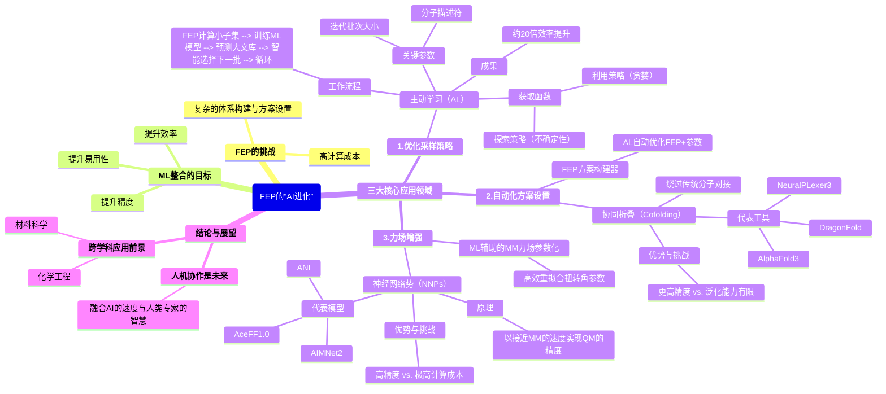

# 【JCIM综述】FEP的“AI进化”：机器学习如何革新自由能微扰计算工作流

## 本文信息

  - **文章类型**: Perspective (观点/综述)
  - **标题**: 将机器学习整合进自由能微扰工作流
  - **作者**: Donald J. M. van Pinxteren and Willem Jespers
  - **发表时间**: 2025年9月17日
  - **单位**: 格罗宁根大学格罗宁根药物研究所 (GRIP)，药物化学、光药理学与成像系 (荷兰)
  - **引用格式**: van Pinxteren, D. J. M., & Jespers, W. Integrating Machine Learning into Free Energy Perturbation Workflows. *Journal of Chemical Information and Modeling*. Published online September 17, 2025. [https://doi.org/10.1021/acs.jcim.5c01449](https://doi.org/10.1021/acs.jcim.5c01449)
-----

## 摘要

> 自由能微扰（Free Energy Perturbation, FEP）方法是基于结构的药物设计中，用于预测蛋白质-配体结合亲和力的最精确的工具之一。然而，由于其高昂的计算需求和复杂的设置流程，其应用仍然受限。这篇综述探讨了如何通过整合机器学习（ML），特别是主动学习（AL）和深度学习（DL），来提升FEP工作流的效率、易用性、准确性和精确性。文章审视了ML成功应用的三个关键领域：**采样策略、方案优化和力场开发**。主动学习算法可以通过指导分子的选择，显著减少虚拟筛选中所需的FEP计算次数。基于深度学习的蛋白质-配体协同折叠方法，如AlphaFold、NeuralPLexer和DragonFold，能够自动化地生成用于FEP的精确复合物结构，绕过了传统的对接和准备步骤。此外，基于量子力学据训练的机器学习衍生的神经网络势（NNPs），虽然计算成本更高，但提供了更高的力场精度。本综述强调，**将人类专业知识与机器学习工具相结合的混合方法**，是加速和普及基于FEP的药物发现最有前景的策略。这个跨学科领域的未来发展，有望在制药和材料科学应用中扩展计算机辅助药物设计的范围和影响力。

-----

### 本文内容思维导图

-----

## 1\. 引言 (Introduction)

在药物发现与优化领域，计算机辅助药物设计（CADD）已成为不可或缺的工具。随着计算能力的增强、开源化学数据库和蛋白质结构的普及，以及各种计算方法的效率、可靠性和准确性的提升，CADD被广泛应用于药物研发流程中。

FEP方法是CADD中定量预测结合亲和力的“金标准”。无论是**绝对结合自由能微扰（ABFE）还是相对结合自由能微扰（RBFE）**，其核心都是通过一系列微小的“炼金术”步骤，在一个热力学循环中计算两个状态之间的自由能差。RBFE因其更高的精度和相对较低的成本，在先导化合物优化中应用最为广泛，但它要求两个比较的配体结构差异不能太大。ABFE虽然可以克服这一限制，但其计算成本和技术挑战更高。

尽管FEP在多个成功的药物研发案例中（如KRAS G12C抑制剂、TYK2抑制剂等）证明了其价值，但其应用普及仍然面临两大瓶颈：**高昂的计算成本**和**繁琐费力的体系准备过程**。因此，开发更高效、计算需求更低、设置更简便的方法，对于筛选更大规模的分子库、更全面地探索化学空间至关重要。

机器学习（ML），特别是深度学习（DL）和主动学习（AL），正是在这一背景下展现出巨大潜力。通过将ML整合到FEP工作流中，我们有望突破上述瓶颈，进一步提升这一强大工具的可靠性与计算性能。

## 2\. 机器学习在自由能微扰方法中的应用

本节将探讨ML在FEP工作流中落地的三个关键方向：优化采样策略、自动化方案设置以及增强力场精度。

### 2.1 通过主动学习（AL）优化FEP样本选择

在虚拟筛选中，对一个包含成千上万个分子的化学库进行“暴力”FEP计算是不现实的。主动学习（AL）为此提供了一个智能的解决方案：**用最少的FEP计算，发现最多的高活性配体**。

**方案1：主动学习增强FEP文库筛选的示意图**

AL-FEP的基本工作流程如上图所示。它是一个迭代循环：

1.  **初始阶段**：从整个化学库中选择一个小的初始子集，对其进行FEP计算，获得精确的结合自由能数据。
2.  **模型训练**：用这个小的、高质量的FEP数据集来训练一个机器学习模型（通常是QSAR模型）。
3.  **预测与选择**：用训练好的模型去预测化学库中所有剩余分子的结合亲和力。
4.  **样本获取**：根据特定的“获取函数”（Acquisition Function），从剩余分子中智能地选择下一批（一个batch）最有价值的分子进行FEP计算。
5.  **循环迭代**：将新获得的FEP数据加入训练集，重新训练模型，并开始下一轮的预测和选择，直到达到预设的计算预算或找到足够多的高活性分子。

“获取函数”是AL的灵魂，主要分为两类：

  * **利用（Exploitation）**：也称“贪婪”策略，即选择模型预测的结合亲和力最强的分子。其目标是尽快找到最佳候选物。
  * **探索（Exploration）**：选择模型最“不确定”的分子，即预测误差可能最大的分子。其目标是帮助模型更好地学习整个化学空间的规律，避免陷入局部最优。

多项回顾性研究系统地评估了AL-FEP工作流的性能。研究表明，通过优化**分子描述符**（如RDKit分子指纹优于相互作用指纹）、**获取策略**（如先探索后利用的混合策略）、**迭代批次大小**（batch size，通常60-120个分子的初始批次和更小的迭代批次效果较好）以及**机器学习算法**等参数，AL-FEP可以**用相当于暴力筛选5%的计算量，找到超过50%的高活性化合物**，实现了高达**20倍**的效率提升。然而，这些研究也指出，最优的AL配置高度依赖于具体靶点和数据集的化学多样性，目前尚无“一招鲜”的通用方案。

### 2.2 FEP方案与蛋白质体系的构建自动化

随着FEP计算本身效率的提升，**繁琐且需要高度专业知识的体系准备过程**已成为新的主要瓶颈。诸如残基质子化状态的确定、关键水分子的保留等细节，都极大地影响着最终结果的准确性。机器学习正在从两个方面彻底改变这一现状。

**方案2：FEP方法中蛋白质体系构建的传统与AI驱动工作流对比。(A) 传统工作流，涉及手动蛋白质准备和分子对接。(B) 使用协同折叠技术的替代工作流。**

#### A. FEP方案的自动化优化

由de Oliveira等人开发的**FEP Protocol Builder (FEP-PB)**是一个典型的例子。它使用主动学习来自动化地创建和优化FEP+的计算方案。FEP-PB能够探索包括蛋白质结构选择、平衡时间、水模型、采样策略、力场选择、残基互变异构/质子化状态等在内的众多参数组合。它通过短时FEP模拟快速评估随机生成的方案，训练AutoML模型来预测并迭代优化，最终找到在特定体系上兼具速度和准确性的最佳方案。在某些情况下，FEP-PB自动生成的方案性能甚至超越了经验丰富的计算化学家手动设计的方案。

#### B. 基于深度学习的蛋白质-配体结构预测（协同折叠）

传统的FEP流程（方案2A）需要先通过分子对接等方法预测配体的结合构象，这个过程本身就充满了不确定性。近年来，以**AlphaFold**为代表的深度学习方法带来了革命性的变化。新一代的工具不再是先预测蛋白质结构再对接配体，而是直接进行**协同折叠（Cofolding）**，一步到位地预测出蛋白质-配体复合物的精细三维结构（方案2B）。

  * **代表性工具**：
      * **AlphaFold3** 和 **HelixFold3**：闭源和开源领域的领先者，报道了相比传统对接方法更高的复合物结构预测精度。
      * **NeuralPLexer3**：采用多尺度DL架构，据称在捕捉配体诱导的构象变化方面优于AlphaFold3，且速度快15倍。
      * **DragonFold**：由Charm Therapeutics开发，旨在通过协同折叠跳过对接步骤，直接生成用于FEP计算的高质量起始结构。
  * **优势**：协同折叠有望提供更准确的结合模式、蛋白质构象和局部质子化状态，从而极大地提升FEP计算的可靠性，并大大降低了对使用者专业知识的要求。
  * **挑战与局限**：尽管前景广阔，但第三方基准测试（如PoseX, Runs N' Poses）也揭示了当前协同折叠模型的局限性。它们的成功率在很大程度上**依赖于测试体系与训练集的相似性**，对于训练集中未充分体现的新颖药物分子，其预测准确性会下降。此外，在处理手性、对柔性配体进行排序、以及模拟大的构象重排等方面仍存在挑战。

### 2.3 力场增强

FEP计算的基石是分子力学（MM）力场。尽管现有力场（如AMBER, CHARMM, OPLS）已相当成熟，但其参数化的局限性和可转移性问题仍是FEP预测不确定性的主要来源之一。机器学习为此提供了两条改进路径。

**方案3：(A) 传统MM力场和(B) QM/NNP混合力场的获取流程示意图**

#### A. 机器学习辅助的MM力场参数化

一种相对温和的改进方式是利用ML来优化现有MM力场中的特定参数。例如，Karwounopoulos等人发现，使用ML/MM方法（基于ANI-2x神经网络势）来重新拟合MM力场中的**扭转角参数**，是一种计算开销极小但能有效提升精度的实用策略，其性能与更复杂的端点校正方法相当，但计算成本和方差都更低。

#### B. 神经网络势（NNP）

更具革命性的方法是开发全新的、完全由机器学习驱动的力场，即**神经网络势（Neural Network Potentials, NNPs）**。

  * **基本原理**：NNPs通过在大量的量子力学（QM）数据上进行训练，学习原子环境与其能量、受力之间的复杂关系。其目标是以接近经典MM力场的计算速度，实现媲美QM计算的精度。
  * **代表性模型**：
      * **ANI系列（如ANI-2x）**：开创性的NNP模型，但应用范围主要局限于小分子。
      * **AIMNet2**：克服了早期NNP的许多局限，提供了广泛的元素覆盖，支持中性和带电分子，并整合了物理的长程相互作用项，无需重新训练即可直接应用于多种化学体系。
      * **AceFF1.0**：应用于QuantumBind-RBFE方法中，展示了在FEP计算中比传统力场更高的精度。
  * **挑战与权衡**：尽管NNPs潜力巨大，但目前仍面临挑战。首先，其**计算成本**显著高于传统MM力场（例如，ANI-2x在FEP中的成本比FEP+高约8倍）。其次，其精度和泛化能力**严重依赖于训练数据的质量和覆盖范围**。尽管如此，在传统MM力场失效的困难体系中，NNPs可以作为介于经典MM和完全QM/MM之间的一种高精度选择。

## 3\. 结论与展望

近年来，机器学习与FEP方法的融合取得了显著进展，覆盖了从采样策略、方案自动化到力场开发的各个环节。

协同折叠模型（如AlphaFold3）和自动化方案构建工具（如FEP-PB）极大地降低了FEP的技术门槛，使其有望被更多非专业用户所使用。然而，当前模型在面对新颖化学结构时泛化能力的不足，也凸显了其局限性。

神经网络势（NNPs）为力场开发带来了新的曙光，有望在未来成为标准实践。但目前，其高昂的计算成本仍然是普及的主要障碍。

展望未来，最有效、最务实的策略可能并非完全依赖自动化，而是一种**人机协作（human-in-the-loop）的混合模式**。在这种模式下，机器学习模型负责处理大规模的数据筛选和繁琐的流程优化，而经验丰富的计算化学家和药物化学家则负责进行关键的决策、评估模型的局限性，并整合关于分子可合成性、脱靶效应等模型难以评估的“化学直觉”。这种结合了AI的速度与人类智慧的深度的工作范式，将是推动FEP在更广泛的科学和工业应用中发挥更大作用的关键。