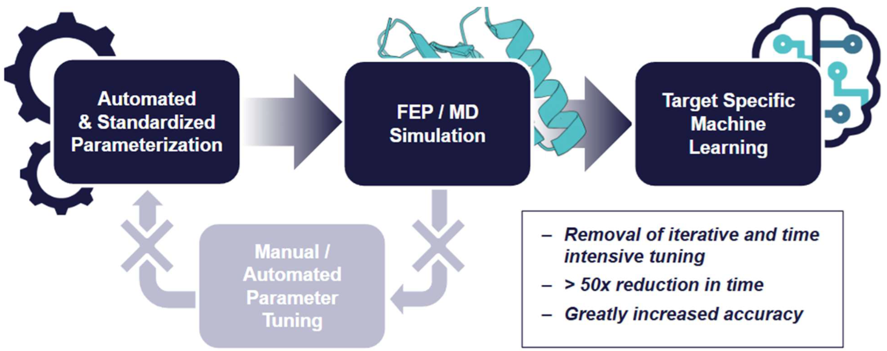
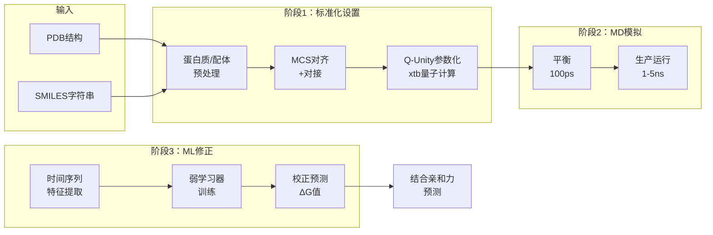
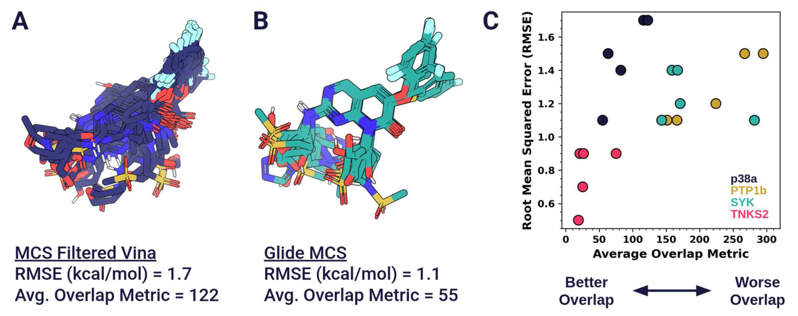
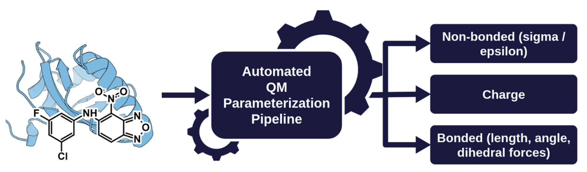
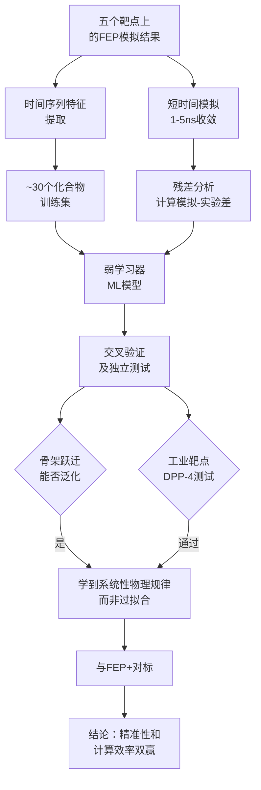
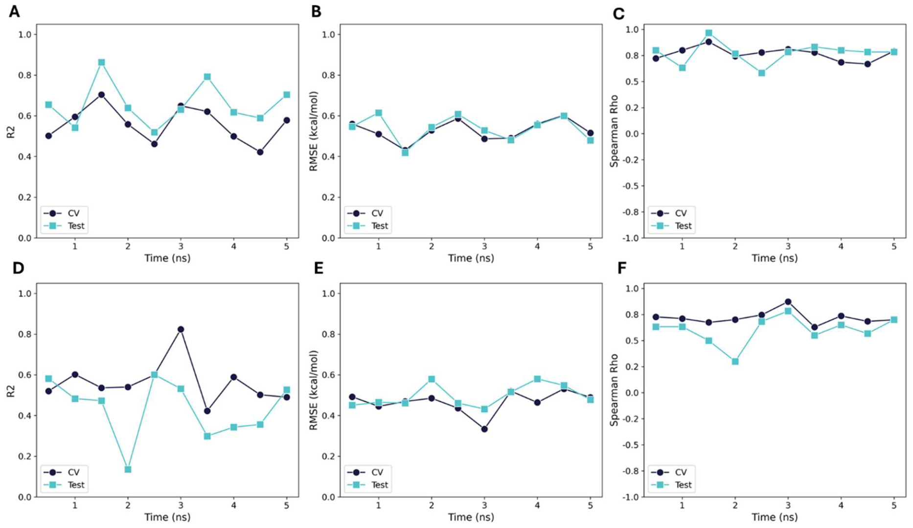
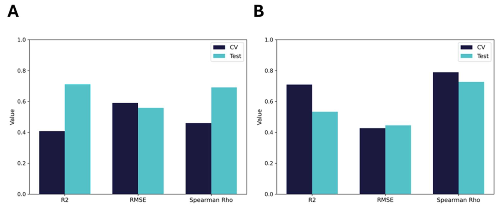
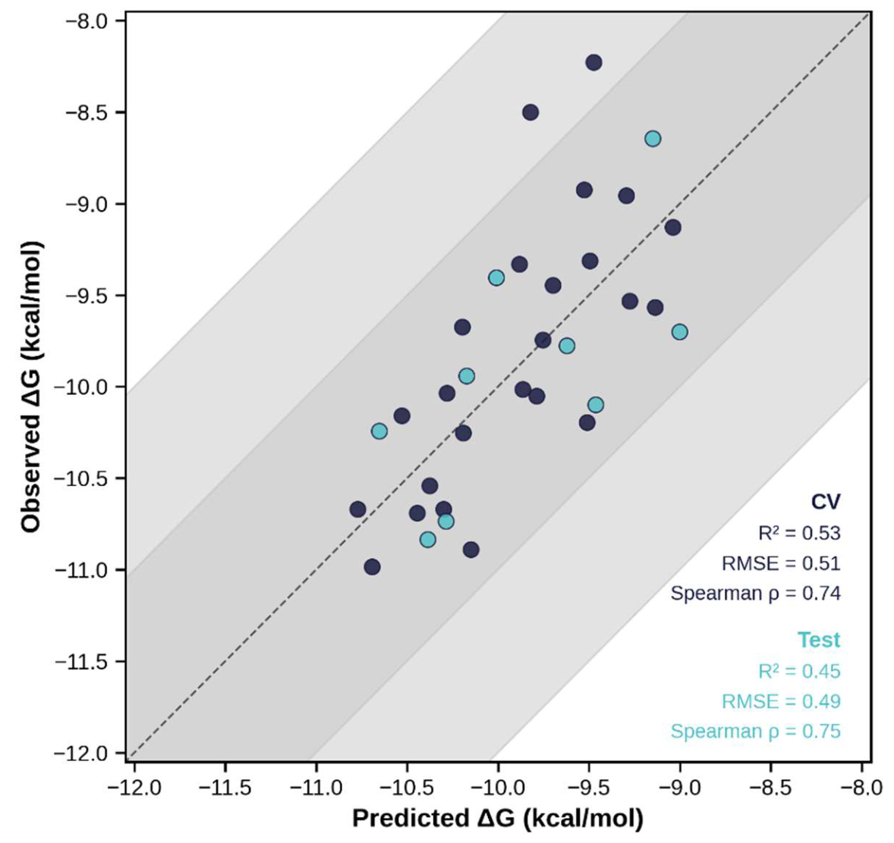

# FEP Ω：结合标准化自动化设置和模拟后机器学习，试图在不进行系统特异性优化的条件下达到更好的精准性

## 本文信息

- **标题**：FEP Ω：参数调优时代的终结
- **作者**：Sam Giannakoulias, John J. Ferrie, Andrew Apicello
- 发表时间：2025年10月
- **单位**：Sentauri Inc，美国马里兰州伍德宾
- **引用格式**：Giannakoulias, S.; Ferrie, J. J.; Apicello, A. FEP Ω: The End of Parameter Tuning. ChemRxiv 2025. https://doi.org/10.26434/chemrxiv-2025-bg1t9
- **论文原文**：https://doi.org/10.26434/chemrxiv-2025-bg1t9
- **作者机构**：Sentauri Inc（www.sentauriai.com）
- **技术涉及**：GROMACS分子动力学、xtb量子化学、scikit-learn机器学习框架

## 摘要

> 自由能微扰（FEP）是结构基础药物设计的常用方法，但其精准性不足往往需要大量的参数调优。本文提出FEP Ω，一个不同的FEP工作流，通过消除先验参数调优、炼金术中间体和网络校正，结合标准化自动化设置和模拟后机器学习，试图在不进行系统特异性优化的条件下达到更好的精准性。与Schrödinger的FEP-PB相比，FEP Ω在多个测试靶点上表现出可比或更优的精准性。

### 核心结论

- **不同的参数调优策略**：通过标准化工作流和后处理机器学习，提出了一个无需系统特异性参数优化的方案
- **计算成本改进**：使用仅1-5纳秒的短模拟时间，避免了网络校正和反向模拟
- **精准性表现**：在测试的靶点上，RMSE通常比FEP+低30-40%
- **泛化能力验证**：在陌生蛋白靶标（DPP-4）上的测试显示了一定的泛化能力
- **工作流自动化**：无需手工目标特异性优化，可应用于新靶点和化学序列

## 小编锐评

> - 感觉很多细节都没说，特征什么的啥也不知道，显得方法不是很靠谱。智能初始结构优化没说清楚，我看不懂但大受震撼。
> - 太搞笑了，每个target就30多个ligand，全拿去训练了，肯定准确。也无法用这样的流程去做真实的药物开发：如果我没有实验数据，纯靠计算，用这个流程也没法训练吧？我FEP算的分子全都实验再测一遍，还需要FEP干啥？就算有初始实验数据（like JMC），后续FEP也无法补充。
> - 而且，跑很短也无所谓只是因为这几个体系比较容易收敛，有的体系是应该长点，你只不过是因为有target，算不准的都是“物理和实验的误差”，那我只要过拟合就行了，拿30个ligands就想做screening？
> - 而且，机器学习它真的能替代调模拟参数等等吗？消除网络校正和反向模拟是通过过拟合？？你攻击人家调模拟参数，但自己在调机器学习参数？？不同实验误差原因都不一样的，学这玩意也没什么可迁移性，原理上都不对。
> - 哪里体现"开箱即用"？？
> - 这篇根本就是体系搭建和模拟没啥改进嘛，除了QM力场参数，也不知道是否真的更好。

## 背景

传统药物发现中，从先导化合物优化到候选药物的过程往往是漫长且昂贵的。在这个关键阶段，**计算方法已成为加速筛选和指导合成的不可或缺的工具**。自由能微扰（FEP）方法因能精准计算配体的结合自由能，已成为**现代药物发现中最可靠的结合自由能预测方法**。

然而，尽管FEP理论上优越，其实际应用面临一个顽固的现实：**无法开箱即用**。无论使用哪个商业平台，计算化学家都必须大量调优参数——晶体结构、对接方案、力场、模拟时间等。这个过程既耗时又需要专业知识，严重限制了FEP在药物设计流程中的应用。

Schrödinger曾尝试通过FEP-PB（自动协议优化）来解决这个问题，但代价巨大：需要运行数百次模拟，且每个新靶点都要重复。结果是**把人工调优转变成计算爆炸**，大规模应用仍然难以实现。

FEP Ω的出现正是为了直面并彻底解决这些问题。核心创新在于：**用标准化物理模拟 + 机器学习后处理的组合，完全消除系统特异性的参数调优需求**。

## 关键科学问题

在FEP发展的关键时刻，**核心问题不是能否提高精准性，而是能否在不进行繁琐参数调优的情况下实现精准性**。

换句话说：如何打破传统FEP中精准性与实用性的矛盾，使其真正成为即插即用的工具？

## 创新点

- **范式转换**：从「模拟前优化」转向「模拟后学习」——用标准化协议运行简短模拟，再用机器学习捕捉系统误差
- **自动化端到端工作流**：从PDB结构和SMILES字符串到精准预测，完全自动化，无需人工干预
- **量子驱动的力场体系**：基于xtb量子力学的统一参数化框架，消除传统lookup表的依赖
- **智能配体放置**：MCS对齐+约束对接确保初始结构合理，最小化后续平衡
- **轻量级机器学习**：用最少实验数据（~30个化合物）训练，可随着数据积累迭代改进

---

## 基准数据集与RBFE配体对

FEP Ω使用**5个不同的蛋白质靶标**进行基准测试和验证，总共包含**180个配体**。这些数据集来源如下：

| 靶标 | 配体数 | PDB ID | 来源 | 特征 |
|------|-------|--------|------|------|
| **HIF2α** | 37 | 4gs9/4xt2/8ck3 | 文献参考 (ref 24-26) | 小型、刚性、高卤代、完全埋藏口袋 |
| **BACE1** | 36 | 4djw | Schrödinger官方套件 (ref 27) | 体积大、正电荷多、埋藏口袋 |
| **P38** | 33 | 3fln | Schrödinger官方套件 (ref 28) | 线性结构、核心恒定、端部可变、部分溶剂暴露 |
| **MCL1** | 41 | 4hw3 | Schrödinger官方套件 (ref 29-30) | 高度灵活连接子、羧基、部分溶剂暴露 |
| **DPP-4** | 33 | 4ffw | 文献参考 (ref 32) | 灵活连接子、游离胺、高卤代、完全埋藏 |
| **总计** | **180** | - | - | - |

**关键说明**：

- **HIF2α的三个PDB ID含义**（4gs9 / 4xt2 / 8ck3）：
  - **不是三个不同的蛋白质**，而是**同一蛋白质（HIF2α）的三个不同晶体结构**
  - 每个结构代表蛋白质在不同配体复合物状态下的晶体学结构
  - **Scaffold hopping实验设计**：4xt2和8ck3用于模型开发训练（共两个配体系列），4gs9专门保留为**盲测试集**（blind test，完全独立），验证模型对**陌生配体系列**的真实泛化性
  - 这个设计类似于k折交叉验证的 held-out test set，但用于评估**不同化学骨架的转移性**

- **RBFE的配体对选择**：原文未明确说明采用全配对、星型网络还是其他拓扑结构。原文仅提到RBFE需要选择 well-characterized reference ligand 作为起点

- **数据集多样性**：这5个靶标代表了**不同的结合位点拓扑、溶剂暴露程度和构象灵活性**，为FEP Ω的鲁棒性和泛化性提供了全面的验证

## 研究内容

**图1：FEP Ω工作流总体框架**。展示自动化与标准化参数化 → FEP/MD模拟 → 目标特异性机器学习三个关键步骤，右侧突出显示核心优势：消除了迭代且耗时的参数调优、计算时间减少>50倍、预测精准度大幅提升。智能初始结构优化是该框架的关键创新，确保配体从化学合理的初始构象开始，最小化平衡过程，从而实现最优的原子重叠度。

### 核心方法：FEP Ω工作流

FEP Ω的设计理念简洁而优雅：**用物理基础模拟为基石，用机器学习进行数据驱动的精度修正**。整个工作流分为三个关键阶段：

#### 第一阶段：标准化自动化设置

与传统FEP不同，FEP Ω不要求对每个系统进行参数微调。相反，所有系统都遵循**统一的预处理协议**：

- **蛋白质处理**：从PDB结构开始，移除非生物学相关的水分子，保留关键水分子，补全缺失的环，添加显式氢
- **配体处理**：从SMILES字符串标准化开始，移除反离子和消除歧义形式电荷。质子化态和互变异构体选择**刻意保留为用户可定义**，以便进行系统性的假设探索
- **智能初始结构优化**（核心创新）

**简化理解**：FEP Ω的配体放置策略就像是乐高积木的组合过程。新配体中的「通用部分」（参考配体也有的核心结构）被固定对齐，而「新添加的部分」被优化到最合理的位置。这种**智能放置策略**确保配体从一开始就处于化学合理的结合状态，大大减少了后续平衡的需要。

**图2：原子重叠度对FEP预测精准性的影响**。(A)展示p38系列中表现最差的FEP初始结构（MCS Filtered Vina，RMSE = 1.7 kcal/mol，平均重叠度指标 = 122），(B)展示表现最好的初始结构（Glide MCS，RMSE = 1.1 kcal/mol，平均重叠度指标 = 55）。上排视觉对比清晰展示了配体重叠程度与RMSE的强相关性。(C)散点图显示不同靶点序列（p38a红色、PTP1b蓝色、SYK棕色、TNKS2紫色）的平均重叠度指标值与RMSE的关系，证明最低RMSE的FEP模拟往往来自重叠度指标最低的对接方法。

#### 第二阶段：量子驱动的力场参数化——Q-Unity框架

**简化理解**：传统力场就像是一本预先写好的化学「字典」，里面只收录了常见分子的参数。当你遇到新分子时，只能从字典里找最相近的来近似使用。**Q-Unity则是一个自动的「化学字典生成器」**，它能为任何一个新分子从第一性原理计算其专属的、最准确的参数。

**Q-Unity的核心价值**：
- **每个分子都有专属参数**：不再依赖「通用字典」，每个化合物都获得基于其自身电子结构的最优参数
- **自动化且物理严谨**：通过量子力学计算自动生成所有必需的参数，无需人工调整
- **真正的统一框架**：蛋白质和配体都采用相同的量子力学方法，确保体系的一致性

**图3：Q-Unity参数化流程示意图**。蛋白质和小分子都采用相同的第一性原理策略（从xtb量子力学计算导出非键作用参数σ/ε、原子电荷和成键参数——键长、键角、二面角），无需lookup表依赖。

#### 第三阶段：轻量级模拟与高效后处理

**简化理解**：FEP Ω的模拟过程就像是一个高度优化的「工厂流水线」：
- **自动化生产线**：从分子输入到最终预测完全自动化，无需人工干预
- **快速采样**：仅1-5纳秒的短模拟，相比传统的10-20 ns大幅压缩时间
- **大跨度变换**：可以一次性处理大幅度的分子变化，无需中间步骤
- **智能纠错**：机器学习层自动修正物理模拟中的系统性偏差

**核心优势**：
- **快速模拟**：仅需1-5纳秒，比传统方法快10-20倍
- **大跨度变换**：可以一次性处理大幅度的分子变化，无需繁琐的中间步骤
- **消除传统瓶颈**：无需网络校正、反向模拟等耗时环节，计算效率提升50倍以上

#### 机器学习的智能纠错机制

**工作原理**：FEP Ω将机器学习集成到**活跃学习框架**中，利用MD轨迹导出的**时间序列特征**来学习**FEP结果与实验间的系统性残差**。具体地：

- **弱学习器初始化**：用仅~30个历史实验数据训练初始模型，建立模拟导出特征与实验结合亲和力间的映射
- **时间序列特征**：不是简单看终态能量，而是分析整个1 ns轨迹中的**能量演化动态**，捕捉MD过程中蕴含的物理信息
- **残差纠正**：学习的是**MD计算与实验间的残差**（residual errors），这些残差反映的是力场对特定相互作用的系统性欠描述，而非特定分子的噪声
- **持续自迭代**：当新实验数据出现时，新化合物自动在标准FEP框架内运行1 ns模拟，模拟结果和实验数据一起加入ML引擎，模型自动重训练和改进

**核心机制**：最终预测 = FEP直接计算结果 + ML学到的系统性残差纠正

原文强调关键一点：「**the learned corrections capture underlying systematic biases rather than memorizing scaffold-specific features**」。这意味着ML学到的是通用的物理规律（如力场对极性相互作用的欠描述），而非特定化学骨架的细节。因此，用两个配体系列训练的模型**可以准确预测第三个完全不同的化学骨架**（骨架跃迁实验），证明了真正的泛化能力而非过拟合。

### 关键结果与分析

**结果推导逻辑**：

**图：关键结果的推导链**。从短时模拟、ML训练、到泛化验证，逐步证明FEP Ω的有效性。

#### 1.收敛性与模拟时间依赖性

在HIF2α系统上进行了详细的收敛性研究：

**图4：ML模型性能随模拟时间的收敛曲线，HIF2α数据集**。上行A-C展示相对结合自由能（RB FEP）建模结果，下行D-F展示绝对结合自由能（AB FEP）建模结果。所有曲线覆盖0-5纳秒的模拟时间范围（横轴），纵轴显示三个计算指标。A和D为R²（Pearson相关系数平方），B和E为RMSE（均方根误差，单位kcal/mol），C和F为Spearman Rho（ρ，秩相关系数）。青色曲线代表交叉验证（CV）指标，深蓝色曲线显示独立测试集（Test）性能。

关键发现：

- **亚千卡准确度**：在每个时间步都实现亚千卡每摩尔的误差，最小值甚至低于0.5 kcal/mol
- **RMSE和Spearman Rho稳定**：在模拟过程中保持稳定，表明即使是**非常短的模拟**也能保持接近实验的预测能力和排名顺序
- **R²不稳定**（不足为怪）：R²在小数据集中极其敏感且不可靠，因此不是主要关注指标，而且RBFE用R²也不好

**三重启示**：
1. **无参数调优也能精准**：精准的能量估算完全依靠数据驱动方法，无需任何参数调优
2. **计算效率翻倍**：避免网络校正和反向模拟，且生产MD极短，直接减少至少50%的计算量
3. **支持大转化**：传统的闭环实现需要最小化转化，但FEP Ω可以处理多个同步转化，让药物化学团队直接测试真实设计假设，而非浪费资源在无关的中间体

#### 2.骨架跃迁：真正的泛化能力测试

为了评估FEP Ω对陌生化学空间的泛化能力，进行了骨架跃迁实验：用HIF2α的两个序列（4xt2和8ck3）训练，保留第三个序列（4gs9）作为独立测试集。这模拟了真实的药物化学场景，即新化学骨架与训练数据差异巨大。

**骨架跃迁的结果**：

**图5：骨架跃迁实验性能对比，柱状图**。(A)相对结合自由能（RB FEP）模式、(B)绝对结合自由能（AB FEP）模式。三个性能指标R²、RMSE和Spearman Rho分别计算交叉验证（CV，深蓝色柱）和独立测试集（Test，青色柱）的数值。

- **RB FEP**：独立测试集RMSE从0.590轻微降至0.558 kcal/mol，表明学到的纠正捕捉的是**系统性物理偏差而非骨架特异性特征**
- **AB FEP**：在所有指标上CV和测试集间保持强一致性，实现亚半千卡精度和稳定的排名顺序

RB FEP在陌生骨架上的性能略微改进，在小数据集中这是合理的——少数预测的变化会导致指标波动。本文推测：AB FEP的目标变量（ΔG）更平滑均匀，相比RB FEP（预测精度对参考配体选择高度敏感）更容易被ML回归稳定处理。

这个实验**验证了模型的泛化能力**，显示出学到的是通用的物理规律而非过拟合。

#### 3.工业基准对标

对标Schrödinger的FEP+是验证FEP Ω的关键一步。在BACE1、P38和MCL1三个标准靶点上进行了详细对比。**关键细节**：这三个靶点来自Schrödinger的公开基准数据集，FEP Ω对每个靶点都**独立训练了自己的ML模型**——即用该靶点的~30个化合物训练，然后在该靶点的其余化合物上评估。这样的设计确保了每个靶点都获得了针对性的学习，而不是用单一HIF2α模型直接外推（见表1）。

| 系统 | FEP+ R² | FEP+ RMSE | FEP+ SR | FEP Ω R² | FEP Ω RMSE | FEP Ω SR |
|------|---------|----------|--------|---------|-----------|---------|
| **BACE1 RB FEP** | 0.47 | 1.08 | 0.215 | 0.306 | **0.513** | **0.533** |
| **BACE1 AB FEP** | 0.44 | 1.21 | -0.004 | 0.340 | **0.703** | **0.333** |
| **P38 RB FEP** | 0.49 | 0.87 | 0.464 | 0.565 | **0.531** | **0.588** |
| **P38 AB FEP** | 0.58 | 1.09 | 0.221 | 0.652 | **0.764** | **0.698** |
| **MCL1 RB FEP** | 0.45 | 1.03 | 0.570 | 0.641 | **0.570** | **0.728** |
| **MCL1 AB FEP** | 0.53 | 0.95 | 0.383 | 0.644 | **0.567** | **0.728** |
| **MCL1 RB FEP (PB)** | 0.439 | 1.0 | 0.657 | 0.641 | **0.570** | **0.728** |

**表1：FEP+与FEP Ω在三个靶点上的RB和AB FEP性能对比**。指标为R²（Pearson相关系数的平方）、RMSE（均方根误差，单位kcal/mol）和SR（Spearman Rho，秩相关系数）。PB是Schrödinger协议构建器的缩写。加粗部分显示各行中表现最优的指标

**对标结果分析**：

- **RMSE表现**：FEP Ω的RMSE通常比FEP+低30-40%，并在所有系统上达到sub-kcal/mol误差水平
- **Spearman相关性**：Spearman Rho指标较高，表明FEP Ω在**化合物排名**上有良好表现，这对药物设计的优先级排序很重要
- **vs FEP-PB**：FEP Ω在**标准化设置和较低计算成本**条件下，准确性超过了经过大量自动调优的FEP-PB

**评估框架对比**：

Schrödinger的FEP+基准基于**参数优化**，无论是手工还是通过协议构建器（FEP-PB）。模拟协议在同一数据集上迭代调优，报告的指标可能反映**数据集内拟合**。

FEP Ω采用不同的路径：**标准化模拟，仅在模拟后学习**，理论上避免前置调优的隐藏偏差。其指标来自样本外测试数据，提供**独立的泛化性能评估**。这种评估方法更加严格，但实际应用价值仍需进一步验证。

#### 4.盲验证：DPP-4外部靶点测试

DPP-4（二肽基肽酶-4）作为测试靶点，因为它是**临床验证的2型糖尿病靶点，但在FEP文献中毫无先例**（无法参考前人的参数调优经验）。

工作流遵循同一标准协议，每个化合物1 ns MD模拟。从33个化合物中取24个作为训练子集，剩余作为独立测试集，模拟实际工业场景。

**图6：DPP-4靶点上AB FEP预测值与实验结合自由能的对比**。虚线（y=x）代表完美一致性，浅灰色阴影区域表示±2 kcal/mol误差带，深灰色阴影区域表示±1 kcal/mol误差带。深蓝色点代表交叉验证（CV）的预测结果，青色点代表独立测试集的预测。图表右下角标注了CV和Test两组的性能指标（R²、RMSE、Spearman ρ）。

**结果**：

- **交叉验证（CV）**：R²=0.53，RMSE=0.51 kcal/mol，Spearman ρ=0.74
- **独立测试集（Test）**：R²=0.45，RMSE=0.49 kcal/mol，Spearman ρ=0.75
- **Spearman Rho > 0.7**：强相关性，表明**可靠的化合物排名能力**
- **亚千卡精度**：RMSE ~ 0.5 kcal/mol，完全达到药物发现的实用要求
- **完全盲测中实现了稳健预测力**，无需任何额外的方法开发

这个结果的意义在于：它证明了FEP Ω不是针对特定靶点序列优化的工具，而是**真正具有通用性的、开箱即用的FEP平台**。医学化学家团队可以立即将其部署到新的发现项目，无需进行系统特异性的优化，这**直接打破了传统FEP应用的关键障碍**。

## 关键结论与批判性总结

### 主要发现

FEP Ω通过将学习从模拟前转移到模拟后，提出了一个不同的参数调优策略。在多个靶点上的测试显示，该方法在不进行系统特异性优化的情况下达到了与调优方法相当或更优的精准性。跨越五个靶点、从小蛋白到临床靶点、从相对到绝对FEP的验证表明，FEP Ω具有一定的泛化能力。与商业平台FEP+的对标显示在精准性和计算效率两方面有改进。

### 局限性

- **小数据集的统计鲁棒性**：即使是30个化合物的训练集，在某些化学空间中仍可能面临统计鲁棒性问题
- **初始实验数据依赖**：ML训练需要历史实验数据，无法在完全无数据的场景下使用
- **溶剂环境的简化**：当前使用SPC/E显式水，对于特殊溶剂或复杂膜系统的适用性未知
- **蛋白质构象选择**：自动流程中蛋白质入射构象的选择仍然关键，复杂的多状态结合可能需要额外处理
- **特殊化学物质的参数化**：某些非常规分子可能仍需手工验证参数

### 可能的应用前景

如果FEP Ω在更多真实项目中得到验证，其潜在应用包括：
- **设计迭代加速**：通过减少参数优化周期，缩短药物设计的迭代时间
- **门槛降低**：标准化流程可能使FEP预测更容易被非专家使用
- **数据反馈循环**：新的实验数据可逐步改进模型

然而，实际的工业应用效果和泛化能力仍需要在更多真实项目中验证。

