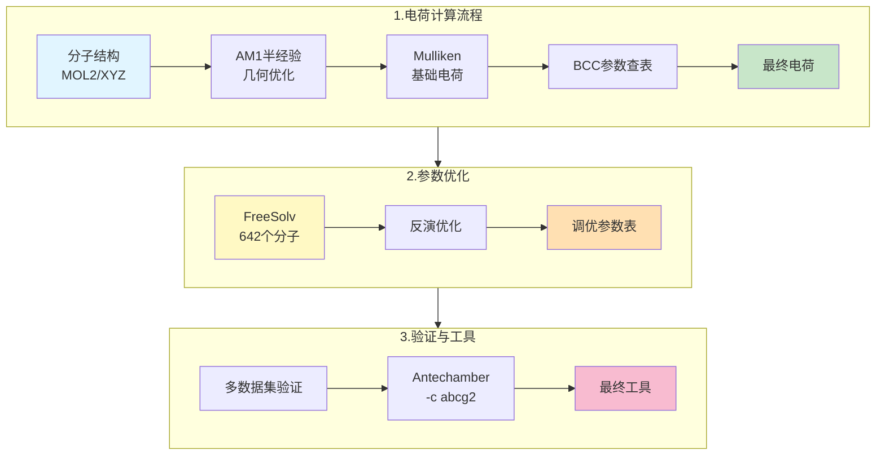

# 优化单一性质≠改善相关性质：ABCG2电荷模型在蛋白-配体结合中的表现

## 本文信息

### 评估论文（本篇）
- **标题**：Evaluation of the ABCG2 Charge Model in Protein–Ligand Binding Free-Energy Calculations
- **作者**：Sudarshan Behera, Vytautas Gapsys, Bert L. de Groot
- **发表时间**：2025年10月
- **单位**：Max Planck Institute for Multidisciplinary Sciences, Göttingen, Germany；Janssen Research & Development, Belgium
- **期刊**：*Journal of Chemical Information and Modeling* (Letter)
- **引用格式**：Behera, S.; Gapsys, V.; de Groot, B. L. Evaluation of the ABCG2 Charge Model in Protein–Ligand Binding Free-Energy Calculations. *J. Chem. Inf. Model.* **2025**. https://doi.org/10.1021/acs.jcim.5c02161

**相关资源**：
- 评估论文数据：https://github.com/deGrootLab/abcg2_evaluation/
- GROMACS：https://www.gromacs.org/
- pmx（非平衡炼金术工具）：https://github.com/deGrootLab/pmx

## 摘要

> 准确的结合自由能预测对于药物设计至关重要，这促使了对新力场模型的评估。本研究使用非平衡炼金术自由能模拟评估了ABCG2电荷模型。**GAFF2/ABCG2组合在水化自由能计算中达到了更高的精度，但在蛋白-配体结合自由能预测中并未超越GAFF2/AM1-BCC**。两种电荷模型在不同靶点上表现出相当的精度和化合物排名能力，表明**针对特定性质的力场优化不能保证改善相关性质的性能**。

### 核心结论

- **ABCG2在水化自由能上的突破**：首次在FreeSolv全部642个分子上实现RMSE < 1 kcal/mol的化学精度里程碑
- **在蛋白-配体结合中无显著改进**：507个配体转化的大规模测试显示，ABCG2与AM1-BCC性能基本相当（p=0.21）
- **揭示力场优化的陷阱**：针对单一环境（水）的优化可能是另一环境（蛋白）的过拟合

## 背景

### 力场参数化的核心挑战

分子动力学模拟中的自由能计算精度依赖于可靠的分子参数化，而这由力场的选择决定。在常用力场（GAFF2、CGenFF、OpenFF、OPLS-3/4等）中，**原子partial charge的分配**是影响预测精度的关键因素。

传统的GAFF2/AM1-BCC组合在大规模水化自由能计算中表现稳健：

- FreeSolv数据集（642分子）：RMSE = 1.71 kcal/mol
- 但始终未能突破**化学精度阈值**（RMSE < 1 kcal/mol）

### ABCG2的诞生：突破化学精度里程碑与2025年BCC参数开发

**2025年3月**，He等人在*Journal of Chemical Theory and Computation*发表了ABCG2电荷模型，通过优化**键电荷修正（BCC）参数**，首次实现了化学精度的里程碑。

#### ABCG2原始论文信息
- **标题**：ABCG2: A Milestone Charge Model for Accurate Solvation Free Energy Calculation
- **作者**：Xibing He, Viet H. Man, Wei Yang, Tai-Sung Lee, Junmei Wang
- **发表时间**：2025年3月11日
- **期刊**：*Journal of Chemical Theory and Computation* **2025**, *21*, 3032–3043
- **DOI**：https://doi.org/10.1021/acs.jctc.5c00038
- **资源**：https://github.com/junmwang/abcg2

#### 2025年BCC参数的开发背景与来源

**BCC参数的本质**：
BCC（键电荷修正，Bond Charge Correction）并非从零开始计算电荷，而是对AM1半经验方法得到的Mulliken电荷进行**系统性修正**。具体流程是：AM1计算基础Mulliken电荷 → 查表读取BCC参数 → 加上修正得到最终电荷。BCC参数本质上是一个**原子类型+键类型相关的离散查表参数集**。例如，`C(sp³)-O(醚)` 和 `C(sp³)-OH(醇)` 会有完全不同的BCC修正值。关键特性是：**同一种原子+键类型组合在所有分子中的修正都相同**——这样一张有限的参数表就能适用于任意分子。

**参数开发驱动力**：
ABCG2的2025年BCC参数来源于**针对特定目标的反演优化过程**。与AM1-BCC的2000年代通用参数不同，ABCG2不是调整**参数形式**，而是用更大更好的数据集**重新优化参数数值**。这个优化问题的目标是最小化：
$$\sum_{\text{分子}} (\Delta G_{\text{calc}} - \Delta G_{\text{exp}})^2$$

其中变量是参数表中所有参数值（几十到几百个原子+键类型组合），约束条件包括电荷守恒和参数平滑性。基于**FreeSolv v0.52数据库**（642个中性有机分子，由已故实验大师Dr. J. P. Guthrie精心编制）进行定向优化。

**反演优化的通俗解释**：反演优化（Inverse Problem）就像"看着最终结果反向推导参数"。我们知道每个分子的实验水化自由能，也知道电荷计算的公式，但不知道最优的BCC参数表应该是什么。反演的思路就是：**尝试不同的参数组合，看哪套参数能让计算结果最接近实验值**。优化算法（如L-BFGS）会自动调整参数表中每个原子+键类型的修正值，直到642个分子的总误差最小（RMSE < 1 kcal/mol）。这比传统的"参数表来自经验或量子化学推导"完全不同——ABCG2是**数据驱动的参数优化**。

**电荷守恒约束**：虽然BCC修正改变了各个原子的电荷，但有一个隐含的约束：**分子的总电荷必须守恒**。对于中性分子，修正前后 $\sum q_i$ 的总和都必须等于 0。这是怎么做到的？答案是BCC修正具有"配对"性质：当某原子因BCC修正增加 $\delta q$ 时，其相邻原子的修正会减少 $\delta q'$ 以保持平衡。这种**成对修正机制**确保了在改善单个原子电荷精度的同时，不会破坏分子的电荷守恒。

**分阶段开发策略**：
1. **第一阶段**（FreeSolv_p1, 441个单官能团分子）：用简单分子优化基础BCC参数，为后续奠基
2. **第二阶段**（FreeSolv_p2, 201个多官能团+P、S含量分子）：保留已优化参数，微调以适应复杂官能团，扩展参数覆盖范围
3. **最终版本**（全642分子）：覆盖H、C、N、O、S、P、F、Cl、Br、I等元素，在FreeSolv全集、MNSol（2068个溶质-溶剂对）和ATB3.0（685个分子）三个数据集上验证泛化能力

**关键优化流程**：

- **电荷计算**：标准工具链（Sqm → Mulliken → BCC查表）
- **参数优化**：在FreeSolv上进行反演，目标RMSE < 1 kcal/mol
- **便捷工具**：新增`-c abcg2`选项实现一键自动电荷分配，相比RESP和AM1-BCC的速度提升百倍以上（秒级完成）
- **多性质验证**：除HFE外，在汽化热（874个有机液体，改进7.4%）和液体密度（1839个液体）上也验证了ABCG2的优越性

#### ABCG2在溶剂化自由能上的卓越表现

**表1：ABCG2在不同数据集上的性能**

| 数据集 | 分子/对数 | RMSE (kcal/mol) | MUE (kcal/mol) | R |
|------|----------|-----------------|-----------------|-----|
| FreeSolv全集 | 642 | **0.99** | 0.57 | 0.97 |
| MNSol溶剂化 | 2068对 | **0.89** | 0.63 | 0.94 |
| 转移自由能 | 1913对 | **0.85** | 0.63 | 0.95 |
| ATB3.0验证集 | 685 | **0.79** | 0.52 | 0.98 |

**关键成就**：首次在FreeSolv全部642个分子上实现RMSE < 1.0 kcal/mol，突破了**化学精度**的长期目标。

**图1：FreeSolv水化自由能计算性能（分子量分布分析）**

**图1A-B**：FreeSolv全集642个有机溶质的水化自由能计算性能对比。(A) GAFF2/AM1-BCC：calculated ΔGhyd vs 实验值的scatter plot，RMSE = 1.71 kcal/mol，51.2%数据点在±1 kcal/mol范围内，离群值（误差>±2 kcal/mol）占14.2%。(B) GAFF2/ABCG2：calculated ΔGhyd vs 实验值的scatter plot，RMSE = 0.99 kcal/mol，86.4%数据点在±1 kcal/mol范围内，离群值仅占4.7%。虚线表示±1 kcal/mol，点线表示±2 kcal/mol误差范围。

#### ABCG2的核心技术特征

**相比RESP和AM1-BCC的优势**：

1. **瞬时电荷分配**：无需QM静电势计算，秒级速度——这是ABCG2相比RESP的**百倍速度优势**

2. **构象稳定性**：电荷在不同构象间的波动仅为RESP的1/5，是**参数优化直接带来的红利**

| 分子系统 | RESP波动 (e) | ABCG2波动 (e) | 改进幅度 |
|--------|------------|-------------|--------|
| 乙二醇 | 0.0247 | 0.0073 | **70%减少** |
| 96个药物分子 | 0.0230 | 0.0045 | **80%减少** |

3. **参数可靠性**：ABCG2电荷与RESP参考电荷的相关系数达R = 0.83（全部11,613个原子数据点），显示两种方法的深层一致性，而非简单替代

4. **多性质性能**：在多种分子性质上验证ABCG2的优越性

| 性质 | 数据集规模 | RESP (RMSE) | ABCG2 (RMSE) | 改进 |
|-----|---------|-----------|------------|------|
| 汽化热 | 874个液体 | 1.88 kcal/mol | 1.74 kcal/mol | **7.4%** |
| 液体密度 | 1839个液体 | 0.037 g/cm³ | 0.037 g/cm³ | 相当 |

5. **便捷性**：通过AmberTools的Antechamber模块一键调用：`antechamber -i molecule.mol2 -fi mol2 -o molecule.prepi -fo prepi -c abcg2`

#### 官能团全覆盖

30种主要官能团（每类≥5个分子）在所有官能团上MUE均<1 kcal/mol，特别是在酮、醚、叔醇、芳香烃等常见药物官能团上表现优异。

**图2：FreeSolv官能团特异性MUE对比**

**图2**：FreeSolv数据集中，GAFF2/AM1-BCC（红柱）和GAFF2/ABCG2（蓝柱）在30种官能团上的平均无符号误差（MUE）对比。X轴标签中数字表示各官能团的分子数量。所有官能团中ABCG2的MUE均≤1 kcal/mol，在酮、醚、叔醇、芳香烃等常见药物官能团上ABCG2均优于或相当于AM1-BCC。

### 自然的推论：如果在水中这么优秀，在蛋白中会不会也很好？

这就是本篇评估论文的核心问题。既然ABCG2在**水化自由能**上表现突出，那么在**蛋白-配体结合自由能**（一个相关但更复杂的环境）中是否也会改进呢？

直觉上似乎应该是的。但结果打破了这个假设。

---

## 主要结果

### ✅ 水化自由能：验证ABCG2的优越性

**表现指标对比（FreeSolv全集642分子）**：

| 力场组合 | MSE (kcal/mol) | MUE (kcal/mol) | RMSE (kcal/mol) | PI | R |
|---------|---------------|---------------|----------------|-----|-----|
| **GAFF2/AM1-BCC** | 0.42 | 1.22 | **1.71** | 0.93 | 0.91 |
| **GAFF2/ABCG2** | −0.10 | **0.57** | **0.99** | **0.98** | **0.97** |
| GAFF2/RESP | 0.40 | 1.06 | 1.48 | 0.93 | 0.93 |

**关键改进**：

- RMSE从1.71降至0.99 kcal/mol，精度提升约**42%**。
- **86.4%的数据点**误差在±1 kcal/mol内（AM1-BCC仅51.2%）。
- **4.7%的离群点**误差>±2 kcal/mol（AM1-BCC为14.2%）。

**图1：水化自由能与蛋白-配体结合自由能计算精度全面评估**

**图1a**：GAFF2/AM1-BCC在FreeSolv数据集（642分子）上的水化自由能预测性能散点图。显示包括绝对无符号误差（AUE）、均方根误差（RMSE）、Pearson相关系数（r）、Spearman等级相关系数（ρ）和Kendall's τ在内的多种统计指标。虚线表示±1 kcal/mol误差范围，点线表示±2 kcal/mol范围，反映了AM1-BCC方法的传统性能水平。

**图1b**：GAFF2/ABCG2在FreeSolv数据集上的水化自由能预测性能散点图。图例与图1a相同。数据点明显更集中在理想线附近，**86.4%的预测在±1 kcal/mol误差范围内**（AM1-BCC仅51.2%），显著提升了预测精度。ABCG2实现了化学精度里程碑（RMSE < 1 kcal/mol），验证了其在溶剂化性质预测中的卓越性能。

### ❌ 蛋白-配体结合自由能（RBFE）：无显著改进

**ΔΔG预测精度对比（507个配体转化）**：

| 力场组合 | RMSE (kcal/mol) | 95% CI |
|---------|----------------|---------|
| AMBER99SB*-ILDN + **AM1-BCC** | **1.31** | [1.22， 1.41] |
| AMBER99SB*-ILDN + **ABCG2** | 1.38 | [1.28， 1.49] |
| AMBER14SB + **ABCG2** | 1.39 | [1.28， 1.51] |

**统计检验**：配对Student's t检验 → **p = 0.21**（不显著）

**绝对结合能（ΔG）预测精度**：

| 力场组合 | RMSE (kcal/mol) | 数据集 |
|---------|----------------|---------|
| AMBER99SB*-ILDN + AM1-BCC | **0.97** | 全集 |
| AMBER99SB*-ILDN + ABCG2 | 1.05 | 全集 |
| AMBER14SB + ABCG2 | 1.15 | 全集 |
| **FEP+**（商业软件） | **0.76** | 全集（对比） |

**图1c**：12个蛋白靶点上的蛋白-配体相对结合自由能（ΔΔG）预测RMSE对比。评估了三种力场组合：AMBER99SB*-ILDN+AM1-BCC（基准）、AMBER99SB*-ILDN+ABCG2和AMBER14SB+ABCG2。误差棒表示95%置信区间。所有靶点上三种力场组合表现相当，无统计学显著差异（配对Student's t检验p=0.21）。缩写"bace_cp"和"bace_p3"分别代表'bace_ciordia_prospective'和'bace_p3_arg368_in'。

**图1d**：计算与实验绝对结合自由能（ΔG）的Pearson相关系数对比。图例和x轴标签与图1c相同。"All"的相关系数是通过各靶点的加权平均值计算得出，权重为每个靶点的数据点数（n）。结果显示ABCG2在化合物排名能力上与AM1-BCC无显著差异。RBFE的Spearman's ρ和Kendall's τ在补充图S15中展示，ΔΔG和ΔG的RMSE以及Pearson's r值也在补充表S1、S2和S3中列出。不同力场比较的ΔΔG估计p值在补充表S4中提供。

### 官能团分析：局部改进不改变整体趋势

研究者进一步分析了不同官能团转化的RMSE：

- **所有官能团**的RMSE差异均不具**统计显著性**（详见表S5）。
- 虽然某些情况下ABCG2表现更好（如**叔醇**），但也有表现更差的情况（如**喹啉**）。

**图2a**：涉及各种官能团的配体转化子集RMSE分析。仅展示AMBER99SB*-ILDN+AM1-BCC与AMBER99SB*-ILDN+ABCG2之间RMSE差异>1 kJ/mol（0.24 kcal/mol）的官能团。注意同一个转化可能贡献到多个类别中（例如，联苯基团扰动同时计入联苯和芳香烃类别）。额外官能团分析在补充图S16中列出。结果显示，虽然某些官能团显示出局部改进或恶化，但整体趋势没有统计学显著性差异。

**图2b**：叔醇官能团的ABCG2改进案例展示。靶点p38，边2y→2v转化。ABCG2显著改进了相对结合自由能预测，与实验值高度吻合：实验ΔΔG = 0.81 kcal/mol，ABCG2预测值为0.49 ± 0.20 kcal/mol，而AM1-BCC预测值为2.47 ± 0.26 kcal/mol。面板中报告的不确定性是按照补充材料S1.3节所述计算的标准误差。这个案例表明ABCG2在特定化学环境下可能提供更好的预测精度。

**图2c**：喹啉官能团的ABCG2性能恶化案例展示。靶点mcl1，边47→27转化。与图2b的改进案例相反，此处ABCG2反而显著恶化了预测精度：实验ΔΔG = −0.34 kcal/mol，ABCG2预测值为−3.11 ± 0.23 kcal/mol，而AM1-BCC预测值为−0.42 ± 0.52 kcal/mol。面板中的不确定性同样是按照补充材料S1.3节计算的标准误差。这个案例与图2b形成鲜明对比，说明了ABCG2在复杂蛋白环境中的表现不一致性。

---

## 深入讨论与结论

### 为什么ABCG2在蛋白结合中失效？

**根本原因**：针对特定环境优化的参数在其他环境中可能失效。ABCG2的BCC参数被**过度优化**于纯水环境，但蛋白结合口袋的静电环境**质变**了——混合着疏水表面、带电残基、部分去溶剂化等复杂因素。此外，蛋白力场本身是为RESP开发的，与ABCG2的兼容性问题也导致参数组合不再**整体一致**。

### 核心启示与实践建议

**关键认识**：**优化单一性质不保证改善相关性质**。力场参数具有**系统特异性**，是经验函数而非普适工具。

**实践策略**：
- **HFE/logP/膜渗透预测**：优先用**GAFF2/ABCG2**（溶剂化性质最优）
- **蛋白-配体FEP（生产环境）**：坚持**GAFF2/AM1-BCC**（已验证、可靠）
- **新参数发布前**：必须在**多个性质和多个靶点**上进行系统验证，而非仅限优化目标

**对开发者的启示**：未来力场开发应转向**多目标优化**策略——同时考虑水化、溶剂化、转移自由能和蛋白结合等多个性质。为新电荷模型开发配套的蛋白参数，而非直接沿用为RESP开发的参数。

**ABCG2的价值仍存**：尽管在RBFE上失效，ABCG2在**效率**（秒级、无需QM计算）、**构象稳定性**（波动仅为RESP的1/5）、**在其他性质上优秀**（密度、汽化热）等方面仍有技术价值，对药物物性预测仍是首选。

### 结论

这项研究是力场开发中的一次**必要的冷静思考**：

> **优化力场或电荷模型针对一个分子性质并不能保证改善其他相关性质的性能**。虽然GAFF2/ABCG2组合显著增强了水化自由能的精准性，但这一改进**未能转移到蛋白-配体相对结合自由能**的计算中。这强调了在将新参数集视为通用工具前，需要在**多样化的系统和应用场景**中进行广泛验证。

**对药物发现人员的建议**：ABCG2在溶剂化相关性质预测中仍是强大工具，但在FEP计算中应坚持已验证的AM1-BCC——直到ABCG2专门的蛋白力场优化版本出现。

**对力场开发者的建议**：单性质卓越性能≠普适工具。新参数必须经过多维度、多靶点的**完整验证流程**才能发布。
