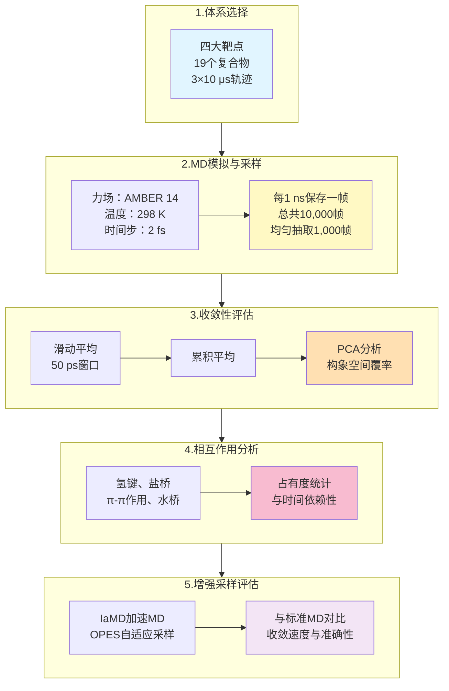

# 短短10微秒就够了？MM/PBSA结合自由能计算的采样陷阱

## 本文信息

- **标题**: Sampling Challenges of MM/PBSA Binding Energy Calculations
- **作者**: Xiaozhe Xu, Fan Zhou, Liangzhen Zheng, Sheng Wang, Daixi Li, Xiangda Peng
- **接收时间**: 2025年10月
- **单位**: 中国上海应用技术大学生物热能科学与技术研究所、上海泽利生物技术公司、中国深圳先进技术研究院
- **引用格式**: Xu, X., Zhou, F., Zheng, L., Wang, S., Li, D., & Peng, X. (2015). Sampling Challenges of MM/PBSA Binding Energy Calculations. *Journal of Physical Chemistry B*, *119*(37), 12071-12079. https://doi.org/10.1021/acs.jpcb.5c04908

## 摘要

> MM/PBSA（分子力学/泊松-玻尔兹曼表面积）是预测蛋白质-配体结合自由能的常用方法。然而，本研究通过对19个蛋白质-配体复合物的系统分析，揭示了一个令人震惊的现象：短期分子动力学（MD）模拟（如100纳秒）会产生看似**收敛但实际上是虚假的**结合自由能值。这些值常常与更长期模拟（如微秒级）的结果不一致，反映出系统中存在缓慢的构象转变被早期模拟所错过。通过PCA分析和增强采样方法（IaMD和OPES），研究证明了**足够的采样**才是获得可靠结合自由能的基础。

### 核心结论

- **虚假收敛陷阱**：短期MD模拟（100 ns）显示的平台期不代表真正的热力学收敛，而是陷入了局部最小值
- **多微秒采样必需**：至少需要3×10微秒的重复模拟才能捕捉蛋白质和配体的关键构象转变
- **增强采样作为补充**：IaMD和OPES可加速采样，但不是万能解决方案，仍需与常规MD相结合
- **配体适应性至关重要**：PCA分析显示许多配体在100 ns内仍未充分探索其可用的构象空间
- **动力学信息丰富**：不同的氢键、π-π相互作用和水桥在不同采样阶段出现和消失，反映出系统的动态本质

> **🔍 重要勘误**：原文MM/PBSA采样参数存在计算错误，实际分析的是从10 μs轨迹中每10 ns取一帧的1000帧数据，而非每10 ps取一帧。这不影响核心结论但确保方法学描述准确。

---

## 背景

MM/PBSA已成为**计算蛋白质-配体结合自由能的标准方法**，广泛应用于药物发现、虚拟筛选和结合机制研究。该方法通过分解策略计算结合自由能：

$$\Delta G_{\text{bind}} = \Delta G_{\text{complex}} - \Delta G_{\text{protein}} - \Delta G_{\text{ligand}}$$

其中各项包括范德华相互作用、静电相互作用、极性溶剂化能和非极性溶剂化能等贡献。

然而，在实际应用中，研究者面临一个**关键的但常被忽视的问题**：MD模拟需要多长时间才能获得可靠的结合自由能估计？传统做法通常假设100纳秒到1微秒的模拟是**足够的**，但这一假设很少经过严格的收敛性验证。

实际上，生物大分子系统中存在**多个时间尺度的动力学过程**：

- 纳秒级：侧链和环的局部重排
- 微秒级：二级结构元件的重新定向、结合袋的适应性重塑
- 毫秒及以上：蛋白质的全局构象转变

当我们在这些多尺度变化中进行MM/PBSA计算时，**采样不足导致的偏差**可能远大于其他误差来源（如力场精度、隐溶剂模型近似等）。

## 关键科学问题

本研究旨在回答几个根本性的问题：

1. **100纳秒的MD模拟是否足以获得准确的结合自由能？** 这个时间长度真的代表热力学平衡还是只是一个局部的虚假平台？
2. **什么样的构象变化会影响结合自由能的收敛？** 是配体的旋转、蛋白质结合袋的扩张，还是其他的动力学事件？
3. **增强采样技术（如IaMD和OPES）能否有效加速收敛？** 这些方法的加速因子如何，它们的结果是否可靠？
4. **如何定量评估采样的充分性？** 除了观察能量曲线的平台化，还有哪些指标可以证明系统已达到充分采样？

## 创新点

- **系统性的收敛性研究**：首次在多个代表性蛋白质-配体系统（4个靶点的19个复合物）上系统调查MM/PBSA的采样充分性
- **多层面的分析**：不仅分析全局的结合自由能，还通过PCA、RMSD、氢键统计等深层次方法剖析构象动力学
- **增强采样的比较评估**：详细对比了IaMD和OPES在加速收敛中的性能，并分析了其局限性
- **时间依赖的相互作用分析**：首次系统统计了不同相互作用类型（氢键、π-π、盐桥、水桥）在不同采样时间的占有度变化
- **实践指导**：为用户提供了明确的采样时间建议和质量控制策略

---

## 研究内容

### 研究对象与方法学建立

#### 核心方法流程

#### 四个靶点，19个复合物

本研究选择了来自四个重要靶点的代表性蛋白质-配体复合物：

- **PLPRO系列（4个复合物）**：冠状病毒主蛋白酶同源物，代表中等大小的蛋白质和多样化的配体
- **HIF2A系列（5个复合物）**：缺氧诱导因子，蛋白质-蛋白质相互作用的典型代表
- **TNKS2系列（5个复合物）**：PARP家族蛋白，包含锌指结构域
- **cMET系列（5个复合物）**：酪氨酸激酶，代表激酶与小分子配体的相互作用

**MD模拟参数：**

所有模拟使用AMBER 14力场，在NVT系综下进行，温度恒定在298 K。每个系统进行了三条独立的MD轨迹，每条10微秒，总计30微秒的采样。使用2 fs的时间步长，**结构保存间隔为1 ns**。

**采样策略详细说明：**
- 总模拟时长：10 μs = 10,000 ns
- 保存间隔：每1 ns保存一帧 → **总共保存10,000帧**
- MM/PBSA分析：从10,000帧中均匀抽取1,000帧 → **相当于每10 ns分析一帧**
- 这样既保证了采样的统计代表性，又避免了过度密集计算带来的计算负担

为了评估收敛性，使用了**滑动平均**和**累积平均**两种方法：

$$\Delta G_{\text{moving}}(i) = \frac{1}{25}\sum_{j=i-12}^{i+12}\Delta G(j)$$

$$\Delta G_{\text{cumulative}}(n) = \frac{1}{n}\sum_{i=1}^{n}\Delta G(i)$$

其中第一个公式采用25帧（50 ps）的窗口进行滑动平均，第二个公式计算从开始到第n帧的累积平均。

### 核心发现：虚假收敛的揭示

#### 发现1：100纳秒并非真正的收敛点

**图1：本研究的四种蛋白质及其小分子配体**

本研究选择了四种重要蛋白质及其小分子配体（每个蛋白4-5个配体，总共19个复合系统）进行系统分析。图中展示了各靶点蛋白的整体结构（绿色）与对应的小分子配体（绿色球棍模型）。具体包括：**plpro系列的4个不同配体**（JW9、JWX、WUK、XB5），**hif2a系列的5个抑制剂**（compounds 234、57、252、164），**tnks2系列的5个化合物**（3b、5a、5e、5m、7），**cmet激酶系列的5个配体**（CHEMBL3402752等）。这些体系涵盖了**中等规模蛋白-配体复合物的多样性**，为MM/PBSA采样充分性的系统评估提供了有代表性的基准集合。

**图2：10微秒MD模拟后计算的MM/PBSA结合自由能**

图2展示了四个系列（总共19个复合物）从10微秒模拟轨迹中计算的MM/PBSA结合自由能结果。**左侧面板**展示原始能量随时间的变化（浅色噪声曲线），**中间面板**显示数据分布直方图，**右侧面板**为关键的**累积平均曲线**。每个面板中三条不同颜色的线代表三条独立的MD轨迹。关键观察：**(1) tnks2系列表现出最佳收敛性**，三条轨迹在10 μs时的最大差异仅0.1-1.1 kcal/mol，累积平均曲线在~1 μs后趋于稳定；(2) plpro和hif2a系列表现出**配体依赖的收敛性**——plpro-8eua/8uob与hif2a-4/22/39收敛良好，但plpro-7sdr/7sqe与hif2a-25/29等呈现明显的多峰分布与缓慢漂移；(3) cmet系列最具挑战性，所有复合物都显示**非收敛行为**，三条轨迹间最大差异达12.9 kcal/mol（cmet-11），反映了大型灵活配体的采样困难。这个图直观地说明了**短期模拟（100 ns）显示的平台期可能是虚假收敛的表征**。

然而，当延长模拟到1微秒、3微秒乃至10微秒时，情况发生了逆转。许多系统的累积平均开始显示**缓慢的、持续的漂移**：

- **plpro-7sdr**：100 ns时$\Delta G = -32.5 \pm 4.2$ kcal/mol；10 μs时$\Delta G = -35.8 \pm 6.1$ kcal/mol，相差超过3 kcal/mol
- **hif2a-25**：100 ns时稳定在$-24.5 \pm 4.5$ kcal/mol；但到10 μs时，三条轨迹的平均值分别为$-23.8$、$-24.9$、$-26.3$ kcal/mol，显示出显著的**轨迹间差异**
- **cmet-11**：特别极端的例子，早期看似收敛的$-30$ kcal/mol在后期漂移到$-32$ kcal/mol

PCA分析进一步揭示了这背后的原因。以**plpro-7sdr**为例，在前100纳秒内，配体在PCA主成分空间中仅探索了完整可用相空间的约**24**%。到10微秒时，这一比例增加到约**60-70**%。换句话说，系统在早期模拟中被**困在一个局部最小值**中，误以为已经收敛。

**图4：(A) plpro-7sdr系统三条轨迹的结合自由能与主成分投影对比。(B) plpro-7sdr系统MD模拟中的代表性构象与相互作用**

为了探索不同构象中哪些特定的关键相互作用与分子的缓慢运动相关，我们进行了进一步分析。以plpro-7sdr系统为例，该系统表现出缓慢运动，导致结合自由能计算难以收敛。我们选择了配体周围8 Å内的所有受体原子，计算与配体原子的原子间距离作为PCA分析的特征。这些特征在PC2上的投影与结合自由能的变化高度相关，平均Pearson相关系数为**0.73**。基于PC2的权重，我们确定了三个参与受体-配体相互作用的关键残基：E166、Y170和Y267。图4显示了plpro-7sdr模拟中的几种典型构象。

#### 发现2：蛋白质和配体的构象适应是长期过程

**图3：不同系统的受体RMSD、配体RMSD和主要构象**

图3展示了代表性系统在10 μs MD模拟过程中蛋白质与配体的RMSD演化。**左侧面板**为受体主链RMSD随时间的变化，**中间面板**为配体重原子RMSD，**右侧面板**为代表性构象的结构快照。关键发现：

**(A) 受体RMSD**：大多数系统在前500纳秒内迅速达到平台期，RMSD稳定在2-4 Å内，这通常被解释为**系统平衡的标志**。然而，更细致的分析（如图S7所示的**结合位点局部RMSD**）揭示了结合袋附近的残基（距配体≤3.5 Å）在整个10 μs过程中仍表现出**更持久的波动**，暗示**全局RMSD平台化不等于局部结合位点的采样完全**。

**(B) 配体RMSD**：情况远比蛋白质复杂。尽管总体RMSD可能趋于平稳，但配体内部的**旋转异构体转变**在整个模拟过程中持续发生。特别是在plpro-7sqe（RMSD可达3.0 Å）与cmet系列（多处>2 Å）中，配体经历了**多次翻转与平移**，甚至在后期（4-6 μs）仍有新构象涌现。这反映了配体虽然的整体RMSD稳定，但其**微观构象在缓慢探索相空间**。

**(C) 多亚基适应的三阶段过程**：基于RMSD与结合自由能的共同演化，可分为：
- **阶段I（0-100 ns）**：快速的初始适应，RMSD迅速下降，但采样范围最小
- **阶段II（100 ns-1 μs）**：侧链二级定位，结合位点微环境的重新组织，RMSD变化缓慢
- **阶段III（1-10 μs）**：稀有构象的采样，隐溶剂效应的充分建立，导致结合能的缓慢漂移

**图4：(A) 结合自由能与主成分投影的关联分析。(B) 主要相互作用网络的动态变化**

图4详细解剖了**plpro-7sdr系统（采样困难的典型代表）中结合自由能与构象动力学的耦合机制**。

**(A) 关联性分析面板**展示三条独立轨迹的结合自由能时间序列（左y轴，蓝色/橙色/绿色数据点）与主成分PC2投影（右y轴）的对应关系。**Pearson相关系数高达0.73**，表明PC2所捕捉的构象变化与能量变化**高度相关**。这说明虽然100 ns的短模拟中PC2空间的探索有限（图S8），但一旦配体开始探索新构象，结合自由能会随之发生显著变化。

**(B) 关键相互作用变化**展示了plpro-7sdr的四种代表性构象状态（从配体翻转幅度与关键相互作用的有无划分）：
- **高能态**（ΔG≈-23 kcal/mol）：Y267"盖子"打开，与配体的π-π堆叠中断，同时E166-配体的氢键消失
- **低能态**（ΔG≈-40 kcal/mol）：Y267关闭形成强π-π相互作用，E166恢复与配体的H-bond，形成一个**稳定的三残基配体相互作用网络**（E166、Y170、Y267）

这三个关键残基形成的**相互作用网络**的动态开闭与构象转变密切相关，决定了系统能量的可达范围。**100 ns内可能仅采样到单个稳定态，而10 μs才能充分采样多个亚稳态及其间的转变过程**。

- **蛋白质RMSD**：大多数系统在前500纳秒内达到平台期，RMSD稳定在2-4 Å，这被广泛认为表示**系统已平衡**
- **配体RMSD**：情况更复杂。虽然总体RMSD可能平稳，但配体内部的**旋转异构体转变**持续发生，特别是在含有灵活侧链或旋转键的配体中

最引人注目的是**结合位点RMSD**（图S7）。虽然全蛋白RMSD平台化，但在结合袋附近的残基（距配体3.5 Å内）表现出**更持久的波动**。这表明配体与蛋白质之间的**相互适应**是一个缓慢的、多步骤的过程：

1. 初期（0-100 ns）：配体对蛋白质结构的撞击和初始调整
2. 中期（100 ns-1 μs）：侧链的二级优化、结合位点微环境的重新组织
3. 晚期（1-10 μs）：更深层的构象选择、隐溶剂效应的充分建立

#### 发现3：关键相互作用的动态出现与消失

为了更深入地理解采样不足的后果，研究者对所有的**氢键、盐桥、π-π相互作用和水桥**进行了统计分析。

**表1（部分）：氢键在不同采样时间的占有度变化**

以**plpro-8eua**系统中的Q267/N-LIG/O5相互作用为例：

| 采样时间 | 氢键占有度 | 能量贡献 |
|---------|---------|--------|
| 100 ns  | 检测不到  | N/A    |
| 1 μs    | 15.3%   | -38.2 kcal/mol |
| 10 μs   | 59.7%   | -42.4 kcal/mol |

这个例子表明，在100纳秒的短模拟中，**某些至关重要的相互作用根本不会出现**，因此被计算所忽视。当这些相互作用在后期突然出现并占有超过50%的时间时，结合自由能的估计会出现显著变化。

类似的模式在多个系统中重复出现。例如在**hif2a-29**中，多个水桥相互作用的占有度在100 ns和10 μs之间变化10倍以上（表S4）。

#### 发现4：PCA空间的不完整探索

PCA（主成分分析）将配体的构象空间投影到前两个主成分上，直观显示采样覆盖率。

**图3：plpro-7sdr系统的PCA分析**

- **100 ns（橙色点）**：配体在PC1-PC2空间中形成一个紧密的云团，覆盖范围有限
- **10 μs（蓝色点）**：分布明显扩展，覆盖的构象空间是100 ns的2-3倍

更定量地，统计表明：

- **plpro-8eua**：100 ns覆盖约**43**%的10 μs范围
- **hif2a-22**：100 ns覆盖约**42**%的10 μs范围
- **hif2a-25**：100 ns覆盖约**46**%的10 μs范围
- **cmet-12**：100 ns覆盖约**30**%的10 μs范围

这表明，**即使蛋白质RMSD已平台化，配体仍在缓慢地探索新的构象**。

### 增强采样方法的评估

鉴于常规MD存在采样不足的问题，研究者评估了两种增强采样技术：IaMD 和 OPES。这两种方法在原理和实现上有显著差异。关于它们的**详细数学原理、算法机制和参数设置**，请参考 📄 [**附录：IaMD 和 OPES 的原理与实现**](/Free%20Energy/2025-11-04-mm-pbsa-sampling-challenges-appendix-enhanced-sampling.md)。本节主要讨论这两种方法在本研究中的**实际应用效果和局限性**。

#### IaMD（加速MD，Accelerated MD）

IaMD 通过修改势能表面来加快构象空间的探索，其核心思想是**集成多个加速参数不同的 aMD 子项**，并通过精确的重新加权恢复物理信息。参数（α、E、M）在表S5中给出。

**图5：IaMD与常规MD（cMD）的收敛性对比**

该图汇总了**plpro-7sdr、hif2a-25、tnks2-5三个代表性系统**在常规MD与增强采样（IaMD）下的**累积加权平均结合自由能**随时间的演化。关键发现：

**(1) 对plpro-7sdr系统**：
- **cMD结果**：10 μs内仍呈显著漂移，三条轨迹的累积平均在-25到-35 kcal/mol间波动
- **IaMD 1 μs**：快速达到表观"平衡"，但值约-30 kcal/mol，与cMD 10 μs的最终值**偏离2-3 kcal/mol**
- **关键问题**：IaMD的加速项作用于**配体与结合袋的二面角**，可加快某些旋转的采样，但**未必能捕捉全局蛋白质重排引起的构象转变**

**(2) 对hif2a-25系统**：
- **IaMD相对表现更优**，1 μs IaMD与cMD在收敛速度上可比
- 但仍存在**±1 kcal/mol的系统偏差**，提示**再加权的能量修正可能存在局限**

**(3) 对tnks2-5系统**：
- 这是**最容易收敛的系统之一**
- 所有三种方法在~200-300 ns后都逼近相似的累积平均值
- IaMD与cMD的差异最小，<0.5 kcal/mol

**结论**：虽然IaMD能加速某些系统的初期采样，但对于涉及**全局蛋白柔性运动**的系统（如plpro-7sdr），增强采样方法**不能根本解决采样不足问题**，需要与充足的常规MD时间相结合。

关键观察：

- IaMD能加速初始阶段的采样，但**重新加权后的值与无加权的10 μs cMD结果不完全一致**
- 对于某些系统（如**plpro-7sdr**），IaMD在早期会跳过某些重要的配体构象，这些构象只有在标准MD中才能通过缓慢的转变被充分采样
- IaMD最有效的应用是**辅助标准MD的采样**，而非完全替代

#### OPES（On-the-Fly Probability Enhanced Sampling）

OPES 是一种基于集合变量（CV）的增强采样技术，通过**动态构建自适应偏置势**来引导系统朝着预设的目标概率分布采样。与 IaMD 的根本区别在于，OPES **依赖于对关键 CV 的精心选择**，但一旦 CV 选择得当，其加速效果往往更为显著。

**图8：IaMD和OPES模拟的累积加权平均结合自由能**

该图展示了**plpro-7sdr、hif2a-25、tnks2-5三个关键系统**在常规MD（cMD）、IaMD与OPES三种条件下的**累积加权平均结合自由能**演化。图中左侧显示cMD 10 μs的参考曲线，中间与右侧分别为IaMD与OPES的1 μs加权平均结果。关键观察：

**(1) IaMD表现分化明显**：
- **plpro-7sdr**：IaMD 1 μs无法改善收敛，仍偏离cMD 10 μs约3-4 kcal/mol
- **hif2a-25**：IaMD表现相对较好，约束偏差~2 kcal/mol
- **tnks2-5**：IaMD与cMD高度一致，<0.5 kcal/mol偏差

**(2) OPES相对表现更优**：
- **hif2a-25**：OPES 1 μs的加权结果与cMD 10 μs**最为接近**（<1.0 kcal/mol），优于IaMD
- **tnks2-5**：OPES收敛更快更稳，三条轨迹间方差更小
- **plpro-7sdr**：即使OPES也无法完全克服采样困难

**(3) 两种增强采样的共同局限**：
- 对于涉及**全局蛋白质重排**的系统（plpro-7sdr），增强采样**加速的是错误的构象空间探索**，而非关键的物理过程
- **计算成本权衡**：OPES虽然表现更优，但计算资源需求更高，每个λ窗口需要频繁更新偏差函数
- 对于**高维灵活配体**（cmet系列，6+个旋转键），即使OPES也难以充分覆盖构象空间

**结论**：增强采样是**加速补充，而非替代品**。对于结构稳定、采样困难的系统，IaMD或OPES可在一定程度上加速初期收敛；但对于涉及蛋白质柔性、多态性强烈的系统，**充足的常规MD（>3-5 μs）仍是不可替代的**。

### 能量分量的分层分析

不同的相互作用对结合自由能的贡献并非均匀分布。通过能量分解分析，研究发现了显著的**系列间差异**：

**图6：结合自由能分量的范围和影响因素**

该图展示了**范德华相互作用（vdW）与静电相互作用（Electrostatic）对MM/PBSA结合自由能的相对贡献**，按四个蛋白质系列（plpro、hif2a、tnks2、cmet）分别绘制相关系数散点图或分布统计。关键观察：

- **plpro系列**：**静电相互作用（eel）占绝对主导**，与结合自由能的相关系数可达**0.8**，暗示该系列中**氢键与盐桥的精确采样至关重要**
- **hif2a系列**：**范德华相互作用（vdW）与结合自由能的相关性更强**，反映了该系列中**亲水性-疏水性相互作用的重要性**
- **tnks2系列**：两种相互作用的贡献**相对均衡**，更强的鲁棒性
- **cmet系列**：**同时依赖静电与范德华相互作用**，且贡献比例波动大，反映了大型灵活配体的**多态性**

**这种差异的物理含义**：采样不足会**选择性地遗漏某类相互作用**。例如，在plpro系统中，若关键的E166-配体H-bond或多个水桥形成较晚（>3 μs），100 ns的短模拟将**完全遗漏这些静电贡献，导致结合自由能被高估3-5 kcal/mol**。相比之下，范德华相互作用因其**更短的形成时间尺度**，在短模拟中相对完整，因此cmet等范德华主导的系列在短期模拟中的偏差相对较小。

### 全局约束对采样的影响

为了探索采样限制是否源于全局蛋白质运动还是局部配体动力学，研究者进行了一组对比实验，对蛋白质施加**全局RMSD约束**（固定主链Cα原子）。

**图7：有无全局约束条件的结合自由能滑动平均值**

该图对比了**有全局RMSD约束（fixed Cα backbone）与无约束两种条件**下，plpro-7sqe、hif2a-29、tnks2-9、cmet-21四个代表性系统的结合自由能演化。图中灰线为无约束cMD的参考轨迹，彩色线（蓝/橙/绿）为约束MD的三条独立轨迹。关键发现：

**(1) 约束显著加快初期收敛**：对所有四个系统，施加全局约束（固定主链Cα原子）后，累积平均曲线在100-300 ns内**快速趋于平台期**，而无约束cMD则需3-10 μs才能稳定。

**(2) 约束可导致系统性偏差**：
- **plpro-7sqe**：约束后值从-32.6 变为 -33.6 kcal/mol（改变1.0 kcal/mol）
- **hif2a-29与cmet-21**：偏移更大，分别为1.8 kcal/mol，表明**约束改变了结合位点的动态平衡**

**(3) 蛋白质全局灵活性的采样时间**：从无约束MD显著延迟的收敛可推断，**蛋白质主链的全局重排（如激活环、疏水叶片的重定位）具有微秒量级的时间常数**。这说明**采样不足不仅来自配体构象转变，更重要的是蛋白质背景下的配体适应过程**。

**结论**：虽然施加约束可在技术上加速计算，但若未将约束条件明确报告，可能导致**系统性低估结合自由能**的绝对值。对于柔性蛋白质系统（激酶、膜蛋白），**充足的无约束采样是准确估计绝对结合亲和力的前提**。

这一发现有重要的方法学含义：对于**蛋白质构象灵活性已知的系统**（如激酶的激活环、膜蛋白的胞外环），如果不进行足够长的模拟以允许蛋白质灵活性的充分采样，得到的结合自由能将具有**系统性的偏差**。

---

## 关键发现总结与机制

### 采样不足的三重表现

1. **能量平台的虚假性**：100 ns时看似稳定的能量值实际上是被困在局部最小值中的假象

2. **构象空间的不完整探索**：配体在100 ns内仅探索了完整相空间的20%-50%

3. **相互作用的时间依赖性**：关键的相互作用（氢键、盐桥等）在后期采样阶段才频繁出现

### 蛋白质与配体的多步骤适应机制

基于以上结果，研究者提出了一个**多阶段的结合和适应过程**：

$$\text{阶段I (0-100 ns)} \rightarrow \text{阶段II (100 \text{ ns}-1 \text{ μs})} \rightarrow \text{阶段III (1-10 \text{ μs})} \rightarrow \text{热力学平衡}$$

- **阶段I**：快速的初始吸附，主要由静电相互作用驱动，蛋白质结合位点的初级调整
- **阶段II**：侧链的二级定位，配体旋转异构体的改变，隐溶剂的重新组织
- **阶段III**：稀有的构象转变被采样，多个亚稳态之间的相对稳定性被建立

---

## Q&A

- **Q1: 如果我正在进行药物筛选，是否一定要跑10微秒的MD？这会不会太耗时？**

- **A1**: 这取决于你的具体目标和可用资源。对于**排序（ranking）**任务，相对排序可能对采样长度不如对所有配体使用相同的采样时间敏感。但对于**定量预测绝对结合自由能**，特别是需要准确度在1-2 kcal/mol以内的情况，本研究的数据强烈建议至少3×3-5 μs的采样（3条轨迹×3-5 μs每条）。如果计算资源有限，可以考虑：
  - 使用GPU加速MD（现在可以将10 μs降低到数天甚至数小时的计算时间）
  - 先用100 ns进行初步筛选，对有潜力的候选进行完整的微秒级采样
  - 使用增强采样作为补充（虽然不完全可靠，但能加速初期采样）

- **Q2: 我的系统在100 ns时能量曲线已经完全平坦，为什么我还应该怀疑这是真正的收敛？**

- **A2**: 平坦的能量曲线反映的只是**在某个局部最小值附近的局部收敛**。在分子动力学中，这被称为"假平衡"。本研究中的关键证据是PCA分析：即使能量平坦，配体在构象空间中仍在进行缓慢的游走。这种缓慢的构象转变会驱动能量的整体漂移（累积平均的缓慢变化）。建议采用的验证方法包括：
  - 进行多条**独立的**初值轨迹，比较它们的结果是否一致
  - 使用PCA或RMSD进行构象空间的覆盖率分析
  - 追踪关键相互作用（如最强的氢键）的占有度随时间的变化——如果占有度在整个模拟中仍在增加或减少，说明采样不足

- **Q3: 在论文中，IaMD和OPES似乎都不能完全解决问题。我应该如何在实践中选择？**

- **A3**: 这是一个实际的困境。根据本研究和随后的工作，建议的策略是：
  - **黄金标准**：3条独立的1-10 μs常规MD模拟（cMD），这是最可靠但最耗时的方法
  - **平衡方案**：使用IaMD进行10-100 ns的初期加速采样，随后进行200-500 ns的cMD来精细化，总耗时可控制在可接受范围内
  - **快速筛选**：对于大规模筛选，100 ns cMD + IaMD重新加权可作为快速评估，但结果应标记为**初步值**
  - OPES相对较新且计算成本高，除非特别有理由相信它对你的特定系统更合适，否则IaMD+cMD的组合更实用

- **Q4: 不同蛋白质之间的采样需求有差异吗？有没有办法预测某个系统需要多长的采样？**

- **A4**: 是的，存在显著差异。本研究中：
  - **柔性蛋白质**（如激酶、某些HIF2A结构域）需要更长的采样（微秒级）
  - **刚性蛋白质**（某些plpro和tnks2复合物）可能在1-3 μs内较早达到有意义的收敛
  - **配体灵活性**也至关重要：含多个旋转键的配体需要更长的采样

预测性指标包括：
  - 蛋白质的**大小和折叠复杂性**（越大越复杂，一般需要更长采样）
  - 配体的**旋转键数量**（ROTBONDS）
  - 结合位点的**极性和疏水性**比例（混合型位点往往更复杂）

简单的启发式规则：如果蛋白质>400 aa或配体有>6个旋转键，保守估计应该预期需要微秒级采样。

- **Q5: 这篇论文的结论对我现在进行的工作有什么实际影响？我应该改变我的MM/PBSA工作流程吗？**

- **A5**: 绝对应该。主要改进包括：
  1. **报告多条独立轨迹的结果和统计离散度**，而不仅仅报告一个平均值
  2. **明确说明采样长度**（不仅是总长度，还应说明是单条轨迹还是多条）
  3. **进行基本的收敛性检查**：至少绘制累积平均图，观察是否存在长期漂移
  4. **对于高分红的预测**，考虑延长采样到3-5 μs或使用增强采样
  5. **在论文方法部分明确说明采样策略和收敛性验证方式**，这样读者可以评估你的结果的可信度

---

## 关键结论与批判性总结

### 主要贡献

1. **范式转变**：将MM/PBSA从**黑盒方法**转变为一个需要明确采样策略的方法论

2. **定量化的采样需求**：提供了明确的微秒级采样建议，而不是模糊的**足够长**

3. **增强采样的客观评估**：首次系统地展示了IaMD和OPES的优点和局限，设定了对这些方法的现实期望

4. **关键相互作用的时间演化**：详细的氢键、盐桥和水桥分析揭示了结合过程的复杂性

### 局限性与未来方向

**本研究的局限：**

- **样本量有限**：虽然19个复合物是当时较全面的研究，但在现今的语境下仍相对有限
- **力场依赖性**：所有模拟基于AMBER力场；不同力场（CHARMM、OPLS等）的结果可能差异
- **隐溶剂模型**：使用了隐式溶剂（GB）进行MM/PBSA；显式溶剂MD可能需要不同的采样策略
- **温度单一**：所有模拟在298 K进行；热稳定性差的蛋白质可能需要特殊考虑

**需要进一步研究的方向：**

- 发展**采样充分性的定量判据**（目前仍主要依赖主观观察）
- 将机器学习应用于**预测所需采样时间**，基于蛋白质特性
- 探索**GPU加速MD与增强采样的最优组合**
- 研究不同**溶剂模型**下的采样需求差异

### 实践价值评估

- **对当时**（2015年）的影响：这是MM/PBSA采样充分性第一次被系统地、定量地研究，改变了许多研究者的工作习惯
- **对现在**：虽然GPU计算使得微秒级模拟变得更加可行，但结论仍然高度相关。许多用户因为GPU的速度而变得**过度自信**，倾向于用相同的时间跑更多的计算而非更深入地采样
- **对未来**：随着AI辅助分子动力学和自适应采样技术的发展，这个问题可能会被更优雅地解决

### 最后的反思

这篇论文的核心信息是：**看似收敛的结果可能是幻觉**。在计算科学中，这是一个永恒的教训。无论我们使用多么精细的方法、多么快的计算机，如果忽视基本的物理原理——系统需要时间来探索其构象空间——再多的精确度也无法弥补采样不足的根本问题。

从这个角度看，这篇论文不仅为MM/PBSA用户提供了实用指南，更重要的是提醒所有计算生物学研究者：**永远要警惕收敛性的假象**。
