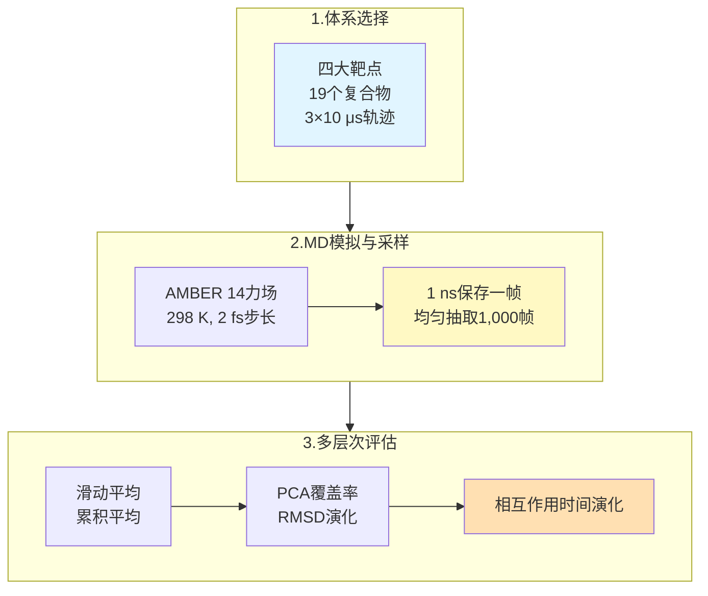
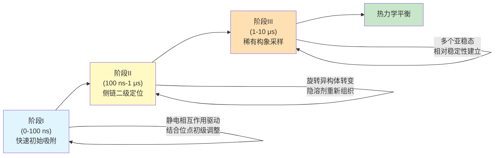

# 短短10微秒就够了？MM/PBSA结合自由能计算的采样陷阱

## 本文信息

- **标题**: Sampling Challenges of MM/PBSA Binding Energy Calculations
- **作者**: Xiaozhe Xu, Fan Zhou, Liangzhen Zheng, Sheng Wang, Daixi Li, Xiangda Peng
- **接收时间**: 2025年10月
- **单位**: 中国上海应用技术大学生物热能科学与技术研究所、上海泽利生物技术公司、中国深圳先进技术研究院
- **引用格式**: Xu, X., Zhou, F., Zheng, L., Wang, S., Li, D., & Peng, X. (2015). Sampling Challenges of MM/PBSA Binding Energy Calculations. *Journal of Physical Chemistry B*, *119*(37), 12071-12079. https://doi.org/10.1021/acs.jpcb.5c04908

## 摘要

> MM/PBSA（分子力学/泊松-玻尔兹曼表面积）是预测蛋白质-配体结合自由能的常用方法。然而，本研究通过对19个蛋白质-配体复合物的系统分析，揭示了一个令人震惊的现象：短期分子动力学（MD）模拟（如100纳秒）会产生看似**收敛但实际上是虚假的**结合自由能值。这些值常常与更长期模拟（如微秒级）的结果不一致，反映出系统中存在缓慢的构象转变被早期模拟所错过。通过PCA分析和增强采样方法（IaMD和OPES），研究证明了**足够的采样**才是获得可靠结合自由能的基础。

### 核心结论

- **虚假收敛陷阱**：短期MD模拟（100 ns）显示的平台期不代表真正的热力学收敛，而是陷入了局部最小值
- **多微秒采样必需**：至少需要3×10微秒的重复模拟才能捕捉蛋白质和配体的关键构象转变
- **增强采样作为补充**：IaMD和OPES可加速采样，但不是万能解决方案，仍需与常规MD相结合
- **配体适应性至关重要**：PCA分析显示许多配体在100 ns内仍未充分探索其可用的构象空间
- **动力学信息丰富**：不同的氢键、π-π相互作用和水桥在不同采样阶段出现和消失，反映出系统的动态本质

> **🔍 重要勘误**：原文MM/PBSA采样参数存在计算错误，实际分析的是从10 μs轨迹中每10 ns取一帧的1000帧数据，而非每10 ps取一帧。这不影响核心结论但确保方法学描述准确。

---

## 背景

MM/PBSA已成为**计算蛋白质-配体结合自由能的标准方法**，广泛应用于药物发现、虚拟筛选和结合机制研究。该方法通过分解策略计算结合自由能：

$$\Delta G_{\text{bind}} = \Delta G_{\text{complex}} - \Delta G_{\text{protein}} - \Delta G_{\text{ligand}}$$

其中各项包括范德华相互作用、静电相互作用、极性溶剂化能和非极性溶剂化能等贡献。

然而，在实际应用中，研究者面临一个**关键的但常被忽视的问题**：MD模拟需要多长时间才能获得可靠的结合自由能估计？传统做法通常假设100纳秒到1微秒的模拟是**足够的**，但这一假设很少经过严格的收敛性验证。

实际上，生物大分子系统中存在**多个时间尺度的动力学过程**：

- 纳秒级：侧链和环的局部重排
- 微秒级：二级结构元件的重新定向、结合袋的适应性重塑
- 毫秒及以上：蛋白质的全局构象转变

当我们在这些多尺度变化中进行MM/PBSA计算时，**采样不足导致的偏差**可能远大于其他误差来源（如力场精度、隐溶剂模型近似等）。

## 关键科学问题

本研究旨在回答几个根本性的问题：

1. **100纳秒的MD模拟是否足以获得准确的结合自由能？** 这个时间长度真的代表热力学平衡还是只是一个局部的虚假平台？
2. **什么样的构象变化会影响结合自由能的收敛？** 是配体的旋转、蛋白质结合袋的扩张，还是其他的动力学事件？
3. **增强采样技术（如IaMD和OPES）能否有效加速收敛？** 这些方法的加速因子如何，它们的结果是否可靠？
4. **如何定量评估采样的充分性？** 除了观察能量曲线的平台化，还有哪些指标可以证明系统已达到充分采样？

## 创新点

- **系统性的收敛性研究**：首次在多个代表性蛋白质-配体系统（4个靶点的19个复合物）上系统调查MM/PBSA的采样充分性
- **多层面的分析**：不仅分析全局的结合自由能，还通过PCA、RMSD、氢键统计等深层次方法剖析构象动力学
- **增强采样的比较评估**：详细对比了IaMD和OPES在加速收敛中的性能，并分析了其局限性
- **时间依赖的相互作用分析**：首次系统统计了不同相互作用类型（氢键、π-π、盐桥、水桥）在不同采样时间的占有度变化
- **实践指导**：为用户提供了明确的采样时间建议和质量控制策略

---

## 研究内容

### 研究对象与方法设计

本研究分析了四个重要靶点的19个蛋白质-配体复合物：**PLPRO系列（冠状病毒主蛋白酶，4个复合物）**、**HIF2A系列（缺氧诱导因子，5个复合物）**、**TNKS2系列（PARP家族蛋白，5个复合物）**、**cMET系列（酪氨酸激酶，5个复合物）**。

所有模拟使用AMBER 14力场，每个系统进行**三条10微秒的独立MD轨迹**，共采样30微秒。采用滑动平均（50 ps窗口）和累积平均方法评估收敛性，结合PCA、RMSD和相互作用占有度分析构象动力学。详细的方法学流程见下图：

### 核心发现：虚假收敛的揭示

#### 发现1：100纳秒并非真正的收敛点

**图1：本研究的四种蛋白质及其小分子配体**

本研究选择了四种重要蛋白质及其小分子配体（每个蛋白4-5个配体，总共19个复合系统）进行系统分析。图中展示了各靶点蛋白的整体结构（绿色）与对应的小分子配体（绿色球棍模型）。具体包括：**plpro系列的4个不同配体**（JW9、JWX、WUK、XB5），**hif2a系列的5个抑制剂**（compounds 234、57、252、164），**tnks2系列的5个化合物**（3b、5a、5e、5m、7），**cmet激酶系列的5个配体**（CHEMBL3402752等）。这些体系涵盖了**中等规模蛋白-配体复合物的多样性**，为MM/PBSA采样充分性的系统评估提供了有代表性的基准集合。

**图2：10微秒MD模拟后计算的MM/PBSA结合自由能**

图2展示了四个系列（总共19个复合物）从10微秒模拟轨迹中计算的MM/PBSA结合自由能结果。**左侧面板**展示原始能量随时间的变化（浅色噪声曲线），**中间面板**显示数据分布直方图，**右侧面板**为关键的**累积平均曲线**。每个面板中三条不同颜色的线代表三条独立的MD轨迹。关键观察：**(1) tnks2系列表现出最佳收敛性**，三条轨迹在10 μs时的最大差异仅0.1-1.1 kcal/mol，累积平均曲线在~1 μs后趋于稳定；(2) plpro和hif2a系列表现出**配体依赖的收敛性**——plpro-8eua/8uob与hif2a-4/22/39收敛良好，但plpro-7sdr/7sqe与hif2a-25/29等呈现明显的多峰分布与缓慢漂移；(3) cmet系列最具挑战性，所有复合物都显示**非收敛行为**，三条轨迹间最大差异达12.9 kcal/mol（cmet-11），反映了大型灵活配体的采样困难。这个图直观地说明了**短期模拟（100 ns）显示的平台期可能是虚假收敛的表征**。

然而，当延长模拟时，许多系统的累积平均开始显示**缓慢的、持续的漂移**，幅度在1-5 kcal/mol不等。PCA分析进一步揭示了原因：配体在100 ns内仅探索完整相空间的**24-46**%，到10 μs时增加到**60-70**%。系统在早期被**困在局部最小值**，误以为已收敛。

**图4：(A) plpro-7sdr系统三条轨迹的结合自由能与主成分投影对比。(B) plpro-7sdr系统MD模拟中的代表性构象与相互作用**

为了探索不同构象中哪些特定的关键相互作用与分子的缓慢运动相关，我们进行了进一步分析。以plpro-7sdr系统为例，该系统表现出缓慢运动，导致结合自由能计算难以收敛。我们选择了配体周围8 Å内的所有受体原子，计算与配体原子的原子间距离作为PCA分析的特征。这些特征在PC2上的投影与结合自由能的变化高度相关，平均Pearson相关系数为**0.73**。基于PC2的权重，我们确定了三个参与受体-配体相互作用的关键残基：E166、Y170和Y267。图4显示了plpro-7sdr模拟中的几种典型构象。

#### 发现2：蛋白质和配体的构象适应是长期过程

**图3：不同系统的受体RMSD、配体RMSD和主要构象**

图3展示了代表性系统在10 μs MD模拟过程中蛋白质与配体的RMSD演化。**左侧面板**为受体主链RMSD随时间的变化，**中间面板**为配体重原子RMSD，**右侧面板**为代表性构象的结构快照。关键发现：

**(A) 受体RMSD**：大多数系统在500 ns内达到平台期（2-4 Å），但结合位点局部RMSD在整个10 μs过程中仍表现出**更持久的波动**，暗示**全局RMSD平台化不等于完全采样**。

**(B) 配体RMSD**：虽然整体RMSD趋于平稳，但**旋转异构体转变持续发生**，灵活配体甚至在后期仍有新构象出现，反映**微观构象在缓慢探索相空间**。

**(C) 多亚基适应的三阶段过程**：基于RMSD与结合自由能的共同演化，可分为：
- **阶段I（0-100 ns）**：快速的初始适应，RMSD迅速下降，但采样范围最小
- **阶段II（100 ns-1 μs）**：侧链二级定位，结合位点微环境的重新组织，RMSD变化缓慢
- **阶段III（1-10 μs）**：稀有构象的采样，隐溶剂效应的充分建立，导致结合能的缓慢漂移

**图4：(A) 结合自由能与主成分投影的关联分析。(B) 主要相互作用网络的动态变化**

图4详细解剖了**plpro-7sdr系统（采样困难的典型代表）中结合自由能与构象动力学的耦合机制**。

**(A) 关联性分析面板**展示三条独立轨迹的结合自由能时间序列（左y轴，蓝色/橙色/绿色数据点）与主成分PC2投影（右y轴）的对应关系。**Pearson相关系数高达0.73**，表明PC2所捕捉的构象变化与能量变化**高度相关**。这说明虽然100 ns的短模拟中PC2空间的探索有限（图S8），但一旦配体开始探索新构象，结合自由能会随之发生显著变化。

**(B) 关键相互作用变化**展示了plpro-7sdr的四种代表性构象状态（从配体翻转幅度与关键相互作用的有无划分）：
- **高能态**（ΔG≈-23 kcal/mol）：Y267"盖子"打开，与配体的π-π堆叠中断，同时E166-配体的氢键消失
- **低能态**（ΔG≈-40 kcal/mol）：Y267关闭形成强π-π相互作用，E166恢复与配体的H-bond，形成一个**稳定的三残基配体相互作用网络**（E166、Y170、Y267）

这三个关键残基形成的**相互作用网络**的动态开闭与构象转变密切相关，决定了系统能量的可达范围。**100 ns内可能仅采样到单个稳定态，而10 μs才能充分采样多个亚稳态及其间的转变过程**。

#### 发现3：关键相互作用的动态出现与消失

为了深入理解采样不足的后果，研究者对**氢键、盐桥、π-π相互作用和水桥**进行了统计分析。以**plpro-8eua**系统中的Q267-配体H-bond为例，该关键相互作用在100 ns内未被检测，但到1 μs时占有度跃升至15.3%，10 μs时达到59.7%，能量贡献从无跳变至-42 kcal/mol。这个例子充分说明**某些至关重要的相互作用在短期模拟中根本不会出现**，但在后期采样中突然频繁出现，显著改变结合自由能估计。

这种**时间依赖的相互作用出现模式**普遍存在于多个系统（完整的H-bond、盐桥统计数据见附录表A3和A5）。更令人担忧的是，对于静电相互作用主导的系统（如plpro），采样不足会**选择性地遗漏关键的H-bond或盐桥**，导致结合自由能被系统性高估3-5 kcal/mol。

#### 发现4：PCA空间的不完整探索

PCA（主成分分析）将配体的构象空间投影到前两个主成分，直观显示采样覆盖率。跨系统定量分析表明，**100 ns模拟的PCA覆盖率普遍在22-52%之间**，到10 μs时才增加到54-74%。这意味着**即使蛋白质RMSD已平台化，配体仍在缓慢地探索新的构象**。

具体来看，采样困难的系统（如plpro）覆盖率增长最明显（2.3-2.7倍），而采样容易的系统（如tnks2）覆盖率相对较高但仍未达100%。这表明，**即使在10 μs后，许多配体仍未充分探索其可用的构象空间**（详见附录表A2）。

### 增强采样方法的评估

鉴于常规MD存在采样不足的问题，研究者评估了两种增强采样技术：IaMD 和 OPES。这两种方法在原理和实现上有显著差异。关于它们的**详细数学原理、算法机制和参数设置**，请参考 📄 [**附录：IaMD 和 OPES 的原理与实现**](/Free%20Energy/2025-11-04-mm-pbsa-sampling-challenges-appendix-enhanced-sampling.md)。本节主要讨论这两种方法在本研究中的**实际应用效果和局限性**。

#### IaMD（加速MD，Accelerated MD）

IaMD 通过修改势能表面来加快构象空间的探索，其核心思想是**集成多个加速参数不同的 aMD 子项**，并通过精确的重新加权恢复物理信息。参数（α、E、M）在表S5中给出。

**图5：IaMD与常规MD（cMD）的收敛性对比**

该图汇总了**plpro-7sdr、hif2a-25、tnks2-5三个代表性系统**在常规MD与增强采样（IaMD）下的**累积加权平均结合自由能**随时间的演化。关键发现：

**(1) 对plpro-7sdr系统**：
- **cMD结果**：10 μs内仍呈显著漂移，三条轨迹的累积平均在-25到-35 kcal/mol间波动
- **IaMD 1 μs**：快速达到表观"平衡"，但值约-30 kcal/mol，与cMD 10 μs的最终值**偏离2-3 kcal/mol**
- **关键问题**：IaMD的加速项作用于**配体与结合袋的二面角**，可加快某些旋转的采样，但**未必能捕捉全局蛋白质重排引起的构象转变**

**(2) 对hif2a-25系统**：
- **IaMD相对表现更优**，1 μs IaMD与cMD在收敛速度上可比
- 但仍存在**±1 kcal/mol的系统偏差**，提示**再加权的能量修正可能存在局限**

**(3) 对tnks2-5系统**：
- 这是**最容易收敛的系统之一**
- 所有三种方法在~200-300 ns后都逼近相似的累积平均值
- IaMD与cMD的差异最小，<0.5 kcal/mol

**结论**：虽然IaMD能加速某些系统的初期采样，但对于涉及**全局蛋白柔性运动**的系统，增强采样方法**不能根本解决采样不足问题**。IaMD最有效的应用是**辅助标准MD的采样**，而非完全替代。

#### OPES（On-the-Fly Probability Enhanced Sampling）

OPES 是一种基于集合变量（CV）的增强采样技术，通过**动态构建自适应偏置势**来引导系统朝着预设的目标概率分布采样。与 IaMD 的根本区别在于，OPES **依赖于对关键 CV 的精心选择**，但一旦 CV 选择得当，其加速效果往往更为显著。

**图8：IaMD和OPES模拟的累积加权平均结合自由能**

该图展示了**plpro-7sdr、hif2a-25、tnks2-5三个关键系统**在常规MD（cMD）、IaMD与OPES三种条件下的**累积加权平均结合自由能**演化。图中左侧显示cMD 10 μs的参考曲线，中间与右侧分别为IaMD与OPES的1 μs加权平均结果。关键观察：

**(1) IaMD表现的系统依赖性**：对于采样容易的系统（如tnks2-5），IaMD与常规MD高度一致；但对于采样困难的系统（如plpro-7sdr），IaMD仍存在明显偏差。

**(2) OPES通常优于IaMD**：在相同条件下，OPES的加权结果与10 μs cMD的结果更为接近，但对于全局重排主导的系统，改进有限。

**(3) 两种增强采样的共同局限**：
- 对于涉及**全局蛋白质重排**的系统（plpro-7sdr），增强采样**加速的是错误的构象空间探索**，而非关键的物理过程
- **计算成本权衡**：OPES虽然表现更优，但计算资源需求更高，每个λ窗口需要频繁更新偏差函数
- 对于**高维灵活配体**（cmet系列，6+个旋转键），即使OPES也难以充分覆盖构象空间

**结论**：增强采样是**加速补充，而非替代品**。对于结构稳定、采样困难的系统，IaMD或OPES可在一定程度上加速初期收敛；但对于涉及蛋白质柔性、多态性强烈的系统，**充足的常规MD（>3-5 μs）仍是不可替代的**。

### 能量分量的系列差异

不同蛋白质系列的结合自由能受不同相互作用主导：**plpro系列中静电相互作用（eel）占绝对主导，与ΔG的相关系数达0.8**；**hif2a系列以范德华相互作用（vdW）为主**；**tnks2系列两者贡献相对均衡**；**cmet系列则因大型灵活配体而呈现多态性**。

这种差异的物理含义很重要：**采样不足会选择性地遗漏某类相互作用**。在plpro系统中，若关键的H-bond或盐桥形成较晚（>3 μs），100 ns的短模拟将完全遗漏这些静电贡献，导致结合自由能被**系统性高估3-5 kcal/mol**。相比之下，范德华相互作用因其更短的时间尺度，在短模拟中相对完整，因此范德华主导的系列在短期模拟中的偏差相对较小。

### 全局约束对采样的影响

为了探索采样限制是否源于全局蛋白质运动，研究者对比了有无全局RMSD约束（固定主链Cα原子）的结果。**约束显著加快初期收敛**——施加约束后，结合自由能在100-300 ns内快速趋于平台期，而无约束MD则需3-10 μs。然而，**约束导致系统性偏差**（1.0-1.8 kcal/mol），表明约束改变了结合位点的动态平衡。

这个发现揭示了关键点：**蛋白质主链的全局重排（如激活环、疏水叶片的重定位）具有微秒量级的时间常数**，这说明**采样不足不仅来自配体构象转变，更来自蛋白质背景下的配体适应过程**。对于柔性蛋白质系统（激酶、膜蛋白），**充足的无约束采样是准确估计结合亲和力的前提**。若未明确报告约束条件，可能导致系统性低估结合自由能的绝对值（详见附录表A5）。

---

## 关键发现总结与机制

### 采样不足的三重表现

1. **能量平台的虚假性**：100 ns时看似稳定的能量值实际上是被困在局部最小值中的假象

2. **构象空间的不完整探索**：配体在100 ns内仅探索了完整相空间的20%-50%

3. **相互作用的时间依赖性**：关键的相互作用（氢键、盐桥等）在后期采样阶段才频繁出现

### 蛋白质与配体的多步骤适应机制

基于以上结果，研究者提出了一个**多阶段的结合和适应过程**：

---

📄 **相关附录**：
- [IaMD和OPES的原理与实现](/Free%20Energy/2025-11-04-mm-pbsa-sampling-challenges-appendix-enhanced-sampling.md)
- [详细数据、表格和Q&A](/Free%20Energy/2025-11-04-mm-pbsa-sampling-challenges-appendix-results.md)

---

## 关键结论与批判性总结

### 主要贡献

1. **范式转变**：将MM/PBSA从**黑盒方法**转变为一个需要明确采样策略的方法论

2. **定量化的采样需求**：提供了明确的微秒级采样建议，而不是模糊的**足够长**

3. **增强采样的客观评估**：首次系统地展示了IaMD和OPES的优点和局限，设定了对这些方法的现实期望

4. **关键相互作用的时间演化**：详细的氢键、盐桥和水桥分析揭示了结合过程的复杂性

本研究的局限性、实践意义评估和深层反思请见附录。
