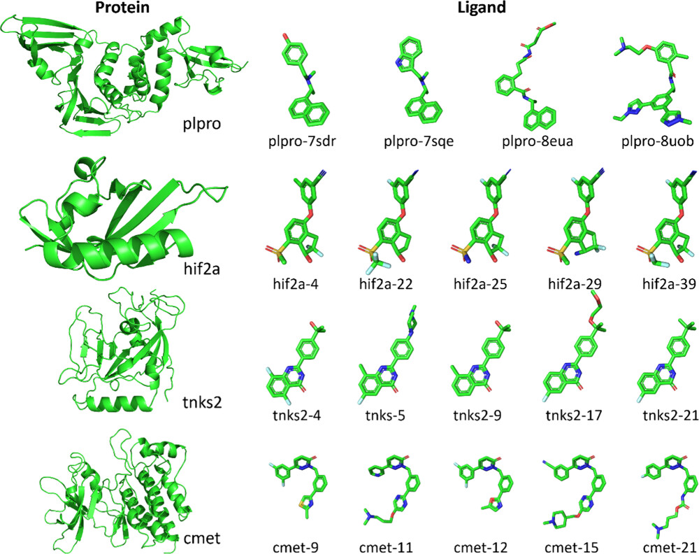
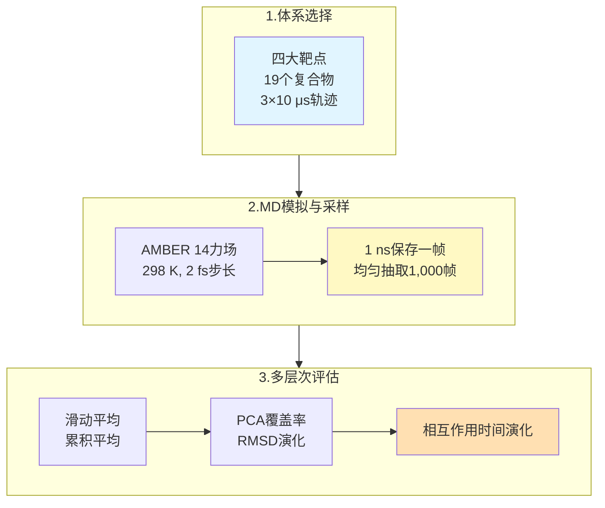
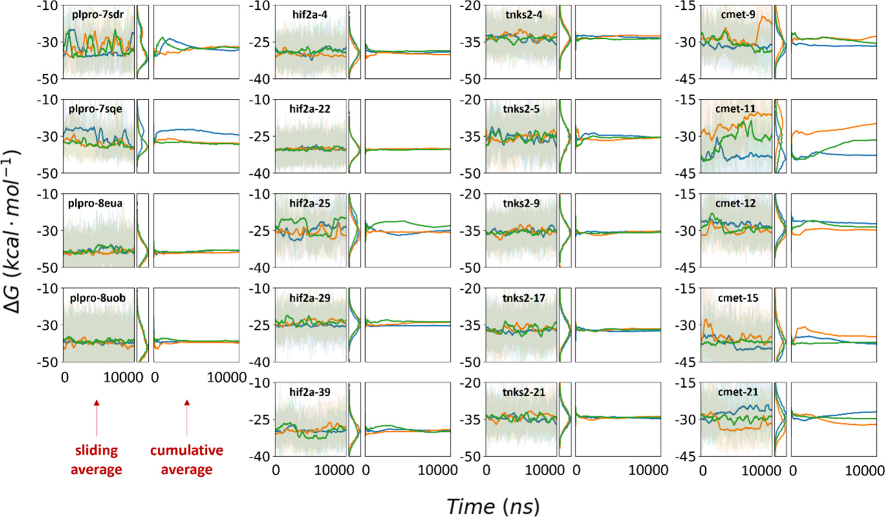
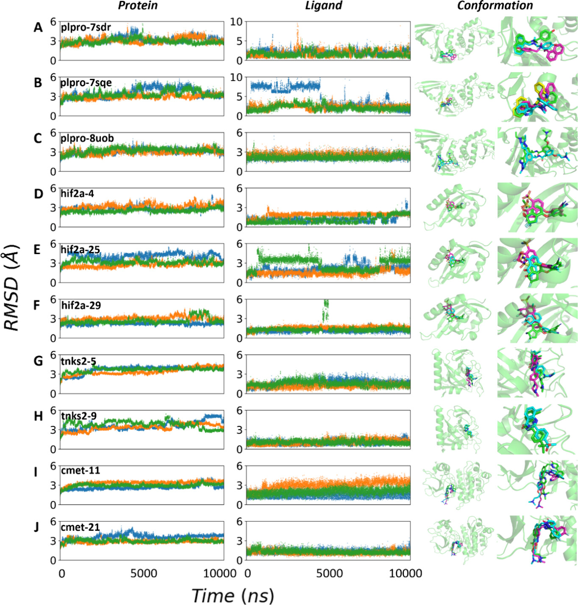
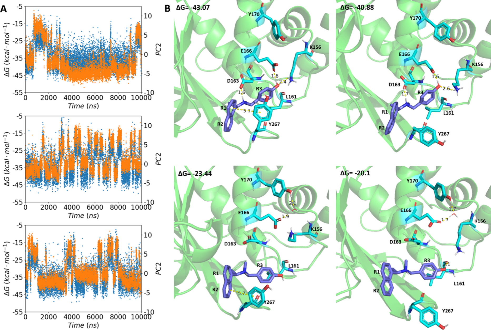
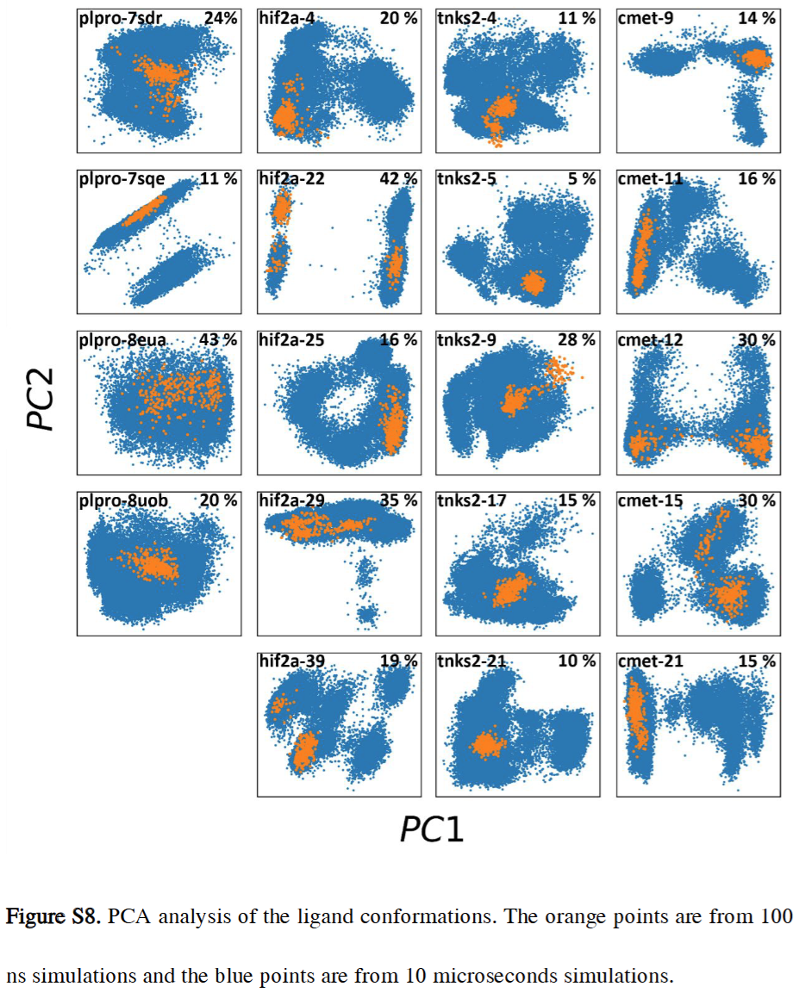
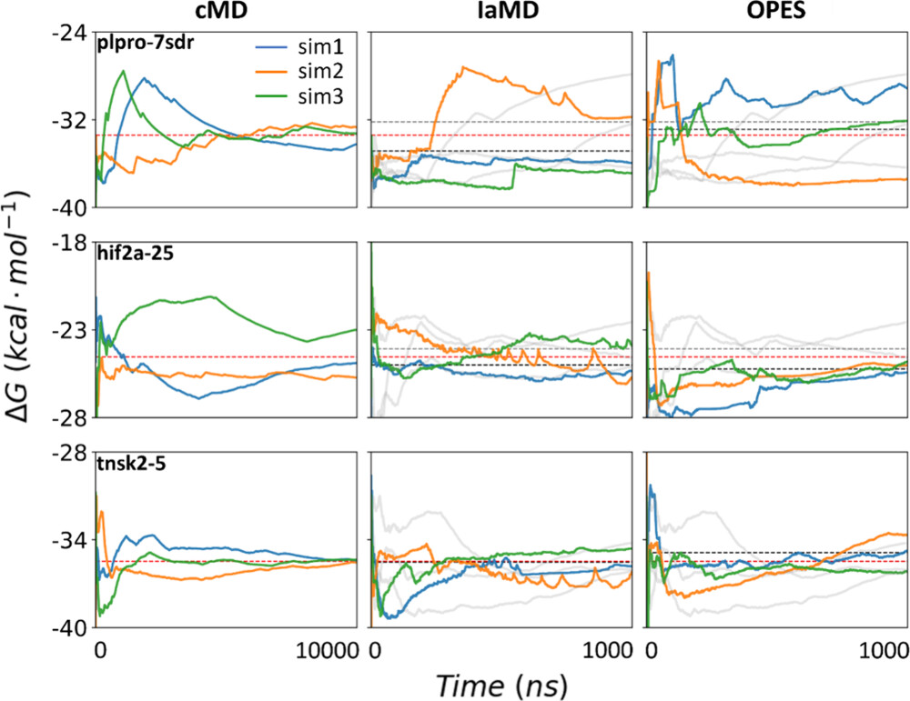
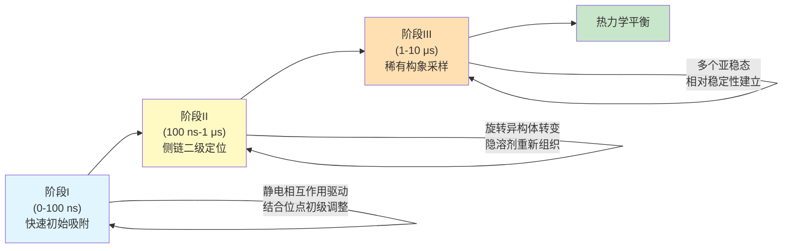

# 短短10微秒就够了？MM/PBSA结合自由能计算的采样陷阱

## 本文信息

- **标题**: Sampling Challenges of MM/PBSA Binding Energy Calculations
- **作者**: Xiaozhe Xu, Fan Zhou, Liangzhen Zheng, Sheng Wang, Daixi Li, Xiangda Peng
- **接收时间**: 2025年10月
- **单位**: 中国上海应用技术大学生物热能科学与技术研究所、上海泽利生物技术公司、中国深圳先进技术研究院
- **引用格式**: Xu, X., Zhou, F., Zheng, L., Wang, S., Li, D., & Peng, X. (2015). Sampling Challenges of MM/PBSA Binding Energy Calculations. *Journal of Physical Chemistry B*, *119*(37), 12071-12079. https://doi.org/10.1021/acs.jpcb.5c04908

## 摘要

> MM/PBSA（分子力学/泊松-玻尔兹曼表面积）是预测蛋白质-配体结合自由能的常用方法。然而，本研究通过对19个蛋白质-配体复合物的系统分析，揭示了一个令人震惊的现象：短期分子动力学（MD）模拟（如100纳秒）会产生看似**收敛但实际上是虚假的**结合自由能值。这些值常常与更长期模拟（如微秒级）的结果不一致，反映出系统中存在缓慢的构象转变被早期模拟所错过。通过PCA分析和增强采样方法（IaMD和OPES），研究证明了**足够的采样**才是获得可靠结合自由能的基础。

### 核心结论

- **虚假收敛陷阱**：短期MD模拟（100 ns）显示的平台期不代表真正的热力学收敛，而是陷入了局部最小值
- **多微秒采样必需**：至少需要3×10微秒的重复模拟才能捕捉蛋白质和配体的关键构象转变
- **增强采样作为补充**：IaMD和OPES可加速采样，但不是万能解决方案，仍需与常规MD相结合
- **配体适应性至关重要**：PCA分析显示许多配体在100 ns内仍未充分探索其可用的构象空间
- **动力学信息丰富**：不同的氢键、π-π相互作用和水桥在不同采样阶段出现和消失，反映出系统的动态本质

> **🔍 重要勘误**：原文MM/PBSA采样参数存在计算错误，实际分析的是从10 μs轨迹中每10 ns取一帧的1000帧数据，而非每10 ps取一帧。这不影响核心结论但确保方法学描述准确。

---

## 背景

MM/PBSA已成为**计算蛋白质-配体结合自由能的标准方法**，广泛应用于药物发现、虚拟筛选和结合机制研究。该方法通过分解策略计算结合自由能：

$$\Delta G_{\text{bind}} = \Delta G_{\text{complex}} - \Delta G_{\text{protein}} - \Delta G_{\text{ligand}}$$

其中各项包括范德华相互作用、静电相互作用、极性溶剂化能和非极性溶剂化能等贡献。

然而，在实际应用中，研究者面临一个**关键的但常被忽视的问题**：MD模拟需要多长时间才能获得可靠的结合自由能估计？传统做法通常假设100纳秒到1微秒的模拟是**足够的**，但这一假设很少经过严格的收敛性验证。

实际上，生物大分子系统中存在**多个时间尺度的动力学过程**：

- 纳秒级：侧链和环的局部重排
- 微秒级：二级结构元件的重新定向、结合袋的适应性重塑
- 毫秒及以上：蛋白质的全局构象转变

当我们在这些多尺度变化中进行MM/PBSA计算时，**采样不足导致的偏差**可能远大于其他误差来源（如力场精度、隐溶剂模型近似等）。

## 关键科学问题

本研究旨在回答几个根本性的问题：

1. **100纳秒的MD模拟是否足以获得准确的结合自由能？** 这个时间长度真的代表热力学平衡还是只是一个局部的虚假平台？
2. **什么样的构象变化会影响结合自由能的收敛？** 是配体的旋转、蛋白质结合袋的扩张，还是其他的动力学事件？
3. **增强采样技术（如IaMD和OPES）能否有效加速收敛？** 这些方法的加速因子如何，它们的结果是否可靠？
4. **如何定量评估采样的充分性？** 除了观察能量曲线的平台化，还有哪些指标可以证明系统已达到充分采样？

## 创新点

- **系统性的收敛性研究**：首次在多个代表性蛋白质-配体系统（4个靶点的19个复合物）上系统调查MM/PBSA的采样充分性
- **多层面的分析**：不仅分析全局的结合自由能，还通过PCA、RMSD、氢键统计等深层次方法剖析构象动力学
- **增强采样的比较评估**：详细对比了IaMD和OPES在加速收敛中的性能，并分析了其局限性
- **时间依赖的相互作用分析**：首次系统统计了不同相互作用类型（氢键、π-π、盐桥、水桥）在不同采样时间的占有度变化
- **实践指导**：为用户提供了明确的采样时间建议和质量控制策略

---

## 研究内容

### 研究对象与方法设计

本研究分析了四个重要靶点的19个蛋白质-配体复合物：**PLPRO系列（冠状病毒主蛋白酶，4个复合物）**、**HIF2A系列（缺氧诱导因子，5个复合物）**、**TNKS2系列（PARP家族蛋白，5个复合物）**、**cMET系列（酪氨酸激酶，5个复合物）**。

**图1：本研究的四种蛋白质及其小分子配体**

**图中内容**：

- 绿色：各靶点蛋白的整体结构
- 绿色球棍模型：对应的小分子配体

**具体包括**：

- **plpro系列**：4个不同配体（JW9、JWX、WUK、XB5）
- **hif2a系列**：5个抑制剂（compounds 234、57、252、164）
- **tnks2系列**：5个化合物（3b、5a、5e、5m、7）
- **cmet系列**：5个配体（CHEMBL3402752等）

这些体系涵盖了**中等规模蛋白-配体复合物的多样性**，为MM/PBSA采样充分性的系统评估提供了有代表性的基准集合。

所有模拟使用AMBER 14力场，每个系统进行**三条10微秒的独立MD轨迹**，共采样30微秒。采用滑动平均（50 ps窗口）和累积平均方法评估收敛性，结合PCA、RMSD和相互作用占有度分析构象动力学。详细的方法学流程见下图：

### 核心发现：虚假收敛的揭示

#### 发现1：100纳秒并非真正的收敛点

**图2：10微秒MD模拟后计算的MM/PBSA结合自由能**

- **左侧面板**：原始能量随时间变化（实线为滑动平均，浅色噪声曲线为原始数据）
- **中间面板**：数据分布直方图
- **右侧面板**：关键累积平均曲线
- 蓝色、橙色、绿色三条曲线分别代表三条独立的MD轨迹

**关键发现**：

- **tnks2系列**：最佳收敛性，10 μs时轨迹差异仅0.1-1.1 kcal/mol
- **plpro/hif2a系列**：配体依赖性收敛
  - 收敛良好：plpro-8eua/8uob，hif2a-4/22/39（差异<1.2 kcal/mol）
  - 收敛困难：plpro-7sdr/7sqe，hif2a-25/29（轨迹差异7.5-8.3 kcal/mol）
- **cmet系列**：最具挑战性，最大轨迹差异达**12.9 kcal/mol**（cmet-11）
- **核心问题**：短期模拟（100 ns）的平台期是虚假收敛表征，配体在100 ns内仅探索完整相空间24-46%，到10 μs才增至60-70%。

#### 发现2：蛋白质和配体的构象适应是长期过程

**图3：不同系统的受体RMSD、配体RMSD和主要构象**

- **左侧面板**：受体主链RMSD随时间变化
- **中间面板**：配体重原子RMSD
- **右侧面板**：代表性构象结构快照
- 三种颜色的点分别代表三条独立的模拟轨迹
- 绿色表示系统的初始构象

**关键发现**：

- **(A) 受体RMSD**：500 ns内达到平台期（2-4 Å），但结合位点局部RMSD在10 μs过程中仍**持续波动**
- **(B) 配体RMSD**：整体趋于平稳，但**旋转异构体转变持续发生**，后期仍有新构象出现
- **(C) 三阶段适应过程**：
  - **阶段I（0-100 ns）**：快速初始吸附，RMSD迅速下降
  - **阶段II（100 ns-1 μs）**：侧链二级定位，结合位点重新组织
  - **阶段III（1-10 μs）**：稀有构象采样，隐溶剂效应充分建立

**核心结论**：**全局RMSD平台化≠完全采样**，阶段III（1-10 μs）对结合自由能影响最大。

**图4：plpro-7sdr系统的结合自由能与构象动力学耦合机制**

- **图4A**：三条轨迹的结合自由能与主成分PC2投影的关联分析
- **图4B**：Representative conformations，主要相互作用网络的动态变化

**关键发现**：

- **PC2与结合自由能高度相关**：Pearson相关系数达**0.73**
- **关键相互作用残基**：E166、Y170、Y267
- **构象状态差异**：
  - **高能态**（ΔG≈-23 kcal/mol）：Y267盖子打开，π-π堆叠中断
  - **低能态**（ΔG≈-40 kcal/mol）：Y267关闭，形成三残基相互作用网络

**核心结论**：**100 ns内可能仅采样到单个稳定态，而10 μs才能充分采样多个亚稳态及其间的转变过程**。

#### 发现3：关键相互作用的动态出现与消失

研究者对**氢键、盐桥、π-π相互作用和水桥**进行了统计分析：

- **时间依赖出现模式**：某些关键相互作用在短期模拟中根本不会出现
- **典型案例**：plpro-8eua系统中的Q267-配体H-bond（Table S1）
  - 100 ns时：未被检测
  - 1 μs时：占有度跃升至15.3%
  - 10 μs时：达到59.7%，能量贡献从无跳变至-42 kcal/mol
- **系统性偏差**：静电主导的系统采样不足会**选择性遗漏关键H-bond或盐桥**，导致结合自由能被系统性高估3-5 kcal/mol

#### 发现4：PCA空间的不完整探索

PCA分析显示配体构象空间覆盖率：

- **100 ns覆盖率**：22-52%（plpro：22-31%，tnks2：48-52%）
- **10 μs覆盖率**：54-74%（仍低于100%充分采样阈值）
- **增长倍数**：采样困难系统2.3-2.7倍，采样容易系统1.4-1.5倍

**核心结论**：**即使10 μs后，配体仍未充分探索构象空间**（最大覆盖率74%），直接挑战"短时间采样足够"的观点。

### 增强采样方法的评估

鉴于常规MD存在采样不足的问题，研究者评估了两种增强采样技术：IaMD 和 OPES。这两种方法在原理和实现上有显著差异。关于它们的**详细数学原理、算法机制和参数设置**，请参考 📄 [**附录：IaMD 和 OPES 的原理与实现**](/Free%20Energy/2025-11-04-mm-pbsa-sampling-challenges-appendix-enhanced-sampling.md)。本节主要讨论这两种方法在本研究中的**实际应用效果和局限性**。

#### IaMD与OPES的比较分析

**图8：IaMD和OPES模拟的累积加权平均结合自由能**。蓝色、橙色、绿色三条线条分别代表三条独立的轨迹；灰色实线是无偏模拟1 μs时的轨迹；灰色虚线是无偏模拟1 μs时的平均能量；黑色虚线是增强模拟的平均能量；红色虚线是无偏模拟10 μs时的平均能量

**IaMD（加速MD，Accelerated MD）**：通过修改势能表面来加快构象空间探索，核心是**集成多个不同加速参数的aMD子项**，通过重新加权恢复物理信息。

- **plpro-7sdr系统**：
  - cMD：10 μs内显著漂移（-25到-35 kcal/mol）
  - IaMD：1 μs快速"平衡"，但与cMD最终值**偏离2-3 kcal/mol**
  - 问题：加速项作用于配体二面角，**难以捕捉全局蛋白质重排**
- **hif2a-25系统**：
  - IaMD相对更优，收敛速度可比
  - 仍有±1 kcal/mol**系统偏差**，重加权修正有局限
- **tnks2-5系统**：
  - 最易收敛系统
  - 所有方法~200-300 ns后趋于相似，差异<0.5 kcal/mol

**OPES（On-the-Fly Probability Enhanced Sampling）**：基于集合变量（CV），通过**动态构建自适应偏置势**引导系统朝目标概率分布采样。与IaMD根本区别在于**依赖于关键CV的选择**。

- **IaMD系统依赖性**：采样容易系统（tnks2-5）与常规MD一致；采样困难系统（plpro-7sdr）仍有明显偏差
- **OPES通常优于IaMD**：加权结果更接近cMD 10 μs结果，但对全局重排改进有限
- **共同局限**：
  - 全局蛋白重排系统中，增强采样**加速错误的构象空间探索**
  - **计算成本高**：OPES需求更高资源，每个λ窗口需频繁更新偏差函数
  - **高维灵活配体**（cmet系列6+旋转键）仍难以充分覆盖

**结论**：增强采样是**加速补充，非替代品**。结构稳定系统可加速初期收敛，但蛋白质柔性、多态性强烈系统仍需**充足常规MD（>3-5 μs）**。

### 能量分量的系列差异

不同蛋白质系列受不同相互作用主导：

- **plpro系列**：静电相互作用（eel）占绝对主导，与ΔG相关系数达0.8
- **hif2a系列**：以范德华相互作用（vdW）为主
- **tnks2系列**：两者贡献相对均衡
- **cmet系列**：因大型灵活配体呈现多态性

**影响**：采样不足选择性地遗漏某类相互作用。plpro系统中，**关键H-bond或盐桥>3 μs形成时，100 ns模拟会遗漏静电贡献**，导致结合自由能系统性高估3-5 kcal/mol。**范德华相互作用时间尺度短，在短模拟中相对完整**。

### 全局约束对采样的影响

研究者对比了有无全局RMSD约束的结果：

- **约束加速收敛**：100-300 ns内快速趋于平台期，无约束需3-10 μs
- **但导致系统性偏差**：1.0-1.8 kcal/mol，改变结合位点动态平衡

**关键发现**：蛋白质主链全局重排具有**微秒量级时间常数**，采样不足不仅来自配体，更来自**蛋白质背景下的配体适应过程**。柔性蛋白质系统需充足无约束采样才能准确估计结合亲和力。

---

## 关键发现总结与机制

### 采样不足的三重表现
1. **能量平台的虚假性**：100 ns时看似稳定实则被困在局部最小值
2. **构象空间的不完整探索**：配体在100 ns内仅探索完整相空间20-50%
3. **相互作用的时间依赖性**：关键相互作用（氢键、盐桥等）在后期才频繁出现

### 蛋白质与配体的多步骤适应机制

基于以上结果，研究者提出了一个**多阶段的结合和适应过程**：

---

📄 **相关附录**：

- [IaMD和OPES的原理与实现](/Free%20Energy/2025-11-04-mm-pbsa-sampling-challenges-appendix-enhanced-sampling.md)
- [详细数据、表格和Q&A](/Free%20Energy/2025-11-04-mm-pbsa-sampling-challenges-appendix-results.md)

---

## 关键结论与批判性总结

### 主要贡献

1. **范式转变**：将MM/PBSA从**黑盒方法**转变为需要明确采样策略的方法论
2. **定量化的采样需求**：提供明确微秒级采样建议，而非模糊的**足够长**
3. **增强采样的客观评估**：首次系统展示IaMD和OPES的优局限，设定现实期望
4. **关键相互作用的时间演化**：详细的氢键、盐桥和水桥分析揭示结合过程复杂性

本研究的局限性、实践意义评估和深层反思请见附录。

### 对分子模拟社区的呼吁

这项研究的一个隐含但重要的信息是：**科学诚实比计算便利更重要**

- 如果一个研究因为计算资源限制无法进行足够长的MD，应该明确说明这一点，而非让读者误以为“足够采样"
- 审稿人在评审含有MM/PBSA结果的论文时，应该养成习惯：不仅看最终的数字，还要看累积平均曲线、多条轨迹的一致性、关键相互作用的时间演化

### 未来方向

基于本研究，几个有价值的后续研究方向包括：

1. **力场与采样时间的系统关联**：在多个常用力场（AMBER、CHARMM、OPLS）上重复类似研究，建立针对不同力场的采样时间建议表
2. **显溶剂MD与隐溶剂MM/PBSA的对应关系**：用全原子显溶剂MD与隐溶剂MM/PBSA的结果对比，量化两者的偏差与采样时间的关系
3. **基于机器学习的收敛性预测**：利用早期轨迹的RMSD、能量波动、PCA信息，用ML模型预测后期的收敛行为，从而优化采样策略
4. **高通量虚拟筛选中的采样优化**：在数百个化合物的筛选中，如何在精度与效率间找到最优平衡点

## Q&A

**Q1: 我一定要跑10微秒MD吗？太耗时了**

A1: 取决于目标。排序任务可用短采样；定量预测（1-2 kcal/mol精度）建议3×3-5 μs。先用100 ns筛选，对候选进行完整采样也可行。

**Q2: 我的能量曲线已100% 平坦，这不是收敛吗？**

A2: 不一定。平坦曲线只代表局部收敛。验证方法：(1) 多条独立轨迹是否一致；(2) PCA覆盖率接近100%？；(3) 关键相互作用占有度还在变化吗？

**Q3: IaMD vs OPES，我应该用哪个？**

A3: 黄金标准是3×1-10 μs常规MD。平衡方案是IaMD初期加速+cMD精细化。快速筛选用100 ns cMD+IaMD但标记为初步值。OPES成本高，不推荐。

**Q4: 不同蛋白质采样需求差异大吗？**

A4: 是的。柔性蛋白（激酶等）需微秒采样；刚性蛋白可1-3 μs。配体灵活性也重要。启发式规则：蛋白>400 aa或配体>6旋转键，预期需微秒采样。

**Q5: 我应该改变MM/PBSA工作流程吗？**

A5: 应该。改进包括：(1) 报告多条轨迹+离散度；(2) 明确采样长度；(3) 绘制累积平均图；(4) 高精度预测用3-5 μs；(5) 方法部分说明收敛验证。

> 小编锐评：
> - 结论很有警示意义，采样是永恒的问题，你难以知道什么时候能采够。所以和实验对不上的时候，请多跑跑吧。
> - 虽然图画得略丑，但逻辑还算可以的，从各种角度说这个问题，虽然我没看所有的图，但可以仔细品品。
> - AI太辣鸡了，半天写不到一块去，太浪费时间了。仔细看一篇文章能写1000多行Markdown。以后还是精简点，直击要害，把握关键结论和逻辑，切忌陷入细节。
