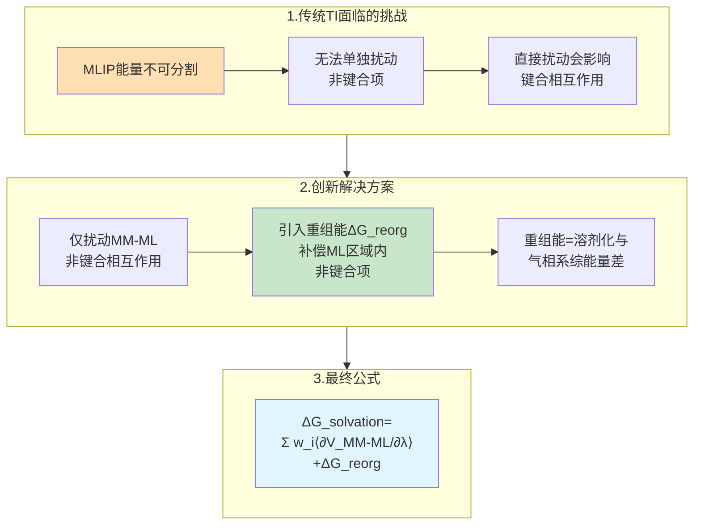
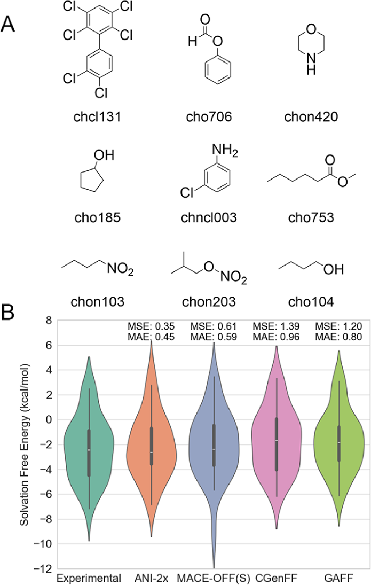

# 机器学习与分子力学混合势驱动的多尺度模拟：精确自由能计算的新途径

## 本文信息

- **标题**: Accurate Free Energy Calculation via Multiscale Simulations Driven by Hybrid Machine Learning and Molecular Mechanics Potentials
- **作者**: Xujian Wang, Xiongwu Wu, Bernard R. Brooks, Junmei Wang
- 发表时间: 2025年7月4日
- **单位**: 匹兹堡大学药学院（美国）；美国国立卫生研究院国家心肺血液研究所（美国）
- **引用格式**: Wang, X., Wu, X., Brooks, B. R., & Wang, J. (2025). Accurate Free Energy Calculation via Multiscale Simulations Driven by Hybrid Machine Learning and Molecular Mechanics Potentials. *J. Chem. Theory Comput.*, *21*, 6979–6987. https://doi.org/10.1021/acs.jctc.5c00598
- **代码仓库**: https://github.com/ClickFF/MLMM4AMBER
- **数据集**: https://zenodo.org/records/15101823

## 摘要

> 本研究开发了集成到AMBER分子模拟软件包中的**混合机器学习/分子力学**（ML/MM）接口。该平台具有高度通用性，可兼容多种先进的机器学习原子间势模型，同时提供稳定的模拟能力并支持高性能计算。在此坚实基础上，研究团队开发了新的计算协议，使得基于路径和终点的自由能计算方法能够利用ML/MM混合势。特别地，提出了**与ML/MM兼容的热力学积分框架**，有效解决了由于机器学习势能和力不可分割的特性而导致的在热力学积分计算中应用机器学习势的挑战。研究结果表明，使用该框架计算的**水化自由能精度达到1.0 kcal/mol**，优于传统方法。此外，ML/MM能够更精确地采样构象系综，从而改进基于终点的自由能计算。

### 核心结论

- 开发了高度灵活的ML/MM接口，集成到AMBER的SANDER引擎中，支持ANI系列和MACE系列等多种机器学习势
- 提出了与ML/MM兼容的热力学积分理论框架，通过引入重组能概念解决了机器学习势能量项不可分割的问题
- ML/MM模拟速度比传统QM/MM快1000到2000倍，同时保持接近从头算的精度
- 水化自由能计算的平均绝对误差为0.45到0.59 kcal/mol，显著优于传统力场
- ML/MM改进的构象采样质量提升了MM-PBSA终点法的结合自由能预测准确性

## 背景

在分子动力学模拟领域，提高分子力场的精度以更准确地重现实验结果一直是持续的研究重点。尽管在扩展通用小分子力场、开发新蛋白质力场以及创建DNA和脂质等其他生物分子力场方面付出了大量努力，但使用经典分子力场精确重现量子力学结果仍然是一个挑战，尤其是在涉及化学反应时。

20世纪70年代，Warshel和Levitt提出了**量子力学/分子力学混合方法**（QM/MM），将量子力学模型应用于描述系统的关键部分，而用分子力场描述系统的其余部分。这种混合模拟技术能够研究大型系统中的电子结构和化学反应。然而，**计算成本一直是限制这些混合模拟技术广泛应用的主要因素**，QM/MM研究的瓶颈在于量子力学计算仍然非常耗时。

十多年前，Behler和Parrinello以及Csányi等人提出了**机器学习原子间势**（MLIPs）作为传统量子力学方法的替代方案。MLIPs通过在机器学习算法上训练以重现从头算的能量和原子力等数据来加速计算，从而避免了耗时的量子力学计算。基于这一框架，许多现代MLIPs通过结合各种先进的人工智能技术而涌现出来，例如ANI-2x，它在ωB97X/6-31G(d)计算数据上训练，达到了接近密度泛函理论的精度，同时保持了与分子力学相当的计算效率。

鉴于MLIPs的高精度和高性能，将其整合到分子动力学引擎中开发全新的多尺度模拟技术极具吸引力。因此，**机器学习/分子力学分子动力学**（ML/MM MD）代表了生物分子模拟的一个有前景的替代方案。

## 关键科学问题

尽管已有大量工作致力于在生物分子系统的分子模拟中实施ML/MM，为未来的发展奠定了坚实的基础，但将ML/MM方法应用于更具挑战性的任务（如精确的自由能计算）仍面临重大障碍。这一研究方向极具吸引力，因为MLIP模型具有**高计算效率和接近从头算水平的精度**这一双重优势，使其特别适合长时间尺度模拟以产生多样化、具有统计意义的构象系综。

然而，**当前使用自由能微扰或热力学积分的自由能计算计算协议无法直接应用于当前的ML/MM混合势**。主要挑战在于：

1. **能量项不可分割性**：当前的MLIP模型被训练来重现总势能和原子力，而没有明确分离ML区域内的非键合项。在传统热力学积分中，可以将势能分解为键合和非键合部分，但在ML/MM中，**如果直接引入λ参数扰动ML区域的非键合项，会不可避免地影响键合相互作用**，从而可能在自由能计算中引入显著误差。

2. **理论框架缺失**：缺乏系统性的ML/MM路径自由能计算新理论，需要开发与ML/MM混合势特性相适应的热力学积分框架。

因此，本研究旨在解决这一根本性挑战，开发与ML/MM兼容的自由能计算理论和实现方法。

## 创新点

- **通用ML/MM接口**：在AMBER平台上开发了高度灵活、兼容多种MLIP模型的ML/MM接口，采用异步工作流和LibTorch库实现高效推理
- **ML/MM热力学积分理论**：提出了与ML/MM兼容的热力学积分框架，通过引入重组能项来补偿ML区域内非键合相互作用的扰动缺失
- **高性能实现**：利用CPU-GPU异步计算架构，使ML/MM模拟速度达到传统QM/MM的1000到2000倍
- **系统验证**：通过NVE系综模拟验证了能量和动量守恒定律，通过水化自由能和蛋白-配体结合自由能计算验证了方法的准确性
- **终点法改进**：展示了ML/MM改进的构象采样如何提升MM-PBSA等终点法的预测精度

---

## 研究内容

### ML/MM理论基础

ML/MM方法在概念上与成熟的QM/MM框架有很强的相似性。基于力学嵌入的ML/MM理论基础已经达到成熟阶段，其中系统的总能量被划分为三个组成部分：

$$
E_{\text{total}} = E_{\text{ML}} + E_{\text{MM}} + E_{\text{ML-MM}}
$$

其中，$E_{\text{ML}}$使用MLIPs获得，而$E_{\text{MM}}$通过经典分子力场方程计算。

对于ML-MM相互作用项，为了确保与广泛的MLIP模型兼容，采用了广泛使用的力学嵌入方案，该方案既高效又得到广泛支持。该方案使用库仑势和Lennard-Jones势的组合来描述ML和MM区域之间的非键相互作用：

$$
\begin{aligned}
E_{\text{ML-MM}}(R_i^{\text{MM}}, R_j^{\text{ML}}) = &\sum_{i \in \text{MM}} \sum_{j \in \text{ML}} \frac{q_i q_j}{|R_i^{\text{MM}} - R_j^{\text{ML}}|} \\
&+ \sum_{i \in \text{MM}} \sum_{j \in \text{ML}} \left[\frac{A}{|R_i^{\text{MM}} - R_j^{\text{ML}}|^{12}} - \frac{B}{|R_i^{\text{MM}} - R_j^{\text{ML}}|^6}\right]
\end{aligned}
$$

在该方程中，$R_i^{\text{MM}}$和$R_j^{\text{ML}}$分别表示MM和ML区域中原子的坐标，$q_i$和$q_j$代表原子部分电荷，参数$A$和$B$代表预参数化的范德华参数。

### ML/MM兼容的热力学积分理论

**传统热力学积分的挑战**

热力学积分（TI）是估计自由能变化的稳健方法，在众多应用中得到广泛使用。传统上，TI计算遵循以下方程：

$$
\Delta G = G_{\lambda=1} - G_{\lambda=0} = \int_0^1 \left\langle \frac{\partial V}{\partial \lambda} \right\rangle_{\lambda} \mathrm{d}\lambda
$$

TI的基本原理是引入参数λ逐渐扰动系统的势能$V$，促进系统从初始状态（$G_{\lambda=0}$）转变为最终状态（$G_{\lambda=1}$）。在实践中，使用不同λ值的几个窗口来数值估计积分：

$$
\Delta G = \sum_i w_i \left\langle \frac{\partial V}{\partial \lambda} \right\rangle_i
$$

在使用分子力场计算时，势能通常可以进一步分解为键合和非键合组分。在计算溶剂化自由能或绝对结合自由能时，共价键在整个模拟过程中保持不变，因此键合相互作用在初始和最终状态中相同，键合项保持不变且不受扰动影响，势能变化仅来自非键合相互作用。

**ML/MM的关键创新：重组能**

在ML/MM方案中省略键合项时，势能可以重写为：

$$
\left\langle \frac{\partial V_{\text{tot}}}{\partial \lambda} \right\rangle_i = \left\langle \frac{\partial V_{\text{MM-ML,non-bonded}}}{\partial \lambda} \right\rangle_i + \left\langle \frac{\partial V_{\text{ML-ML,non-bonded}}}{\partial \lambda} \right\rangle_i
$$

**核心问题**：当前的MLIP模型被训练来重现总势能和原子力，而没有明确分离ML区域内的非键合项（即$V_{\text{ML-ML,non-bonded}}$）。如果尝试引入λ直接扰动该项，则键合相互作用也会不可避免地受到影响，可能在自由能计算中引入显著误差。

**解决方案**：本研究提出的ML/MM TI方案**省略了对ML区域内非键合相互作用的扰动**。相反，引入了一个额外的能量项，称为**重组能**，以补偿这种省略。因此，$V_{\text{MM-ML,non-bonded}}$成为TI过程中唯一受到扰动的项。

由于不对ML区域引入λ扰动，$\langle V_{\text{ML-ML,non-bonded}}^{\text{wat}} \rangle$和$\langle V_{\text{ML-ML,non-bonded}}^{\text{gas}} \rangle$始终等于零。然而，很明显，$\langle V_{\text{ML-ML,non-bonded}}^{\text{wat}} \rangle - \langle V_{\text{ML-ML,non-bonded}}^{\text{gas}} \rangle$描述了分子在水相和气相之间由于构象变化而产生的能量差。为了解决$V_{\text{ML-ML,non-bonded}}^{\text{wat}}$和$V_{\text{ML-ML,non-bonded}}^{\text{gas}}$项的消失，引入了修正项来抵消这种影响：

$$
\Delta G_{\text{reorg}} = \langle E_{\text{ML}} \rangle_{\text{wat}} - \langle E_{\text{ML}} \rangle_{\text{gas}}
$$

**重组能**（$\Delta G_{\text{reorg}}$）被定义为分子在溶剂化和气相构象系综之间的平均能量差。

因此，提出的TI方案能够解决由于MLIPs中能量项不可分割特性而对ML/MM混合势造成的挑战，并且与传统ML/MM方法在很大程度上兼容。最终的溶剂化自由能计算公式为：

$$
\Delta G_{\text{solvation}} = \sum_i w_i \left\langle \frac{\partial V_{\text{MM-ML,non-bonded}}}{\partial \lambda} \right\rangle_{\text{wat},i} + \Delta G_{\text{reorg}}
$$

#### 公式的通俗解释

传统的热力学积分需要对系统中的所有相互作用（键合和非键合）进行λ扰动。但在ML/MM中，机器学习势给出的是**总能量**，无法将ML区域内的非键合项单独提取出来。如果强行对ML区域引入λ扰动，会连带影响键合项，导致错误。

本研究的巧妙之处在于：
1. **只对MM-ML之间的相互作用进行λ扰动**，这部分可以明确计算
2. **ML区域内部不进行λ扰动**，保持完整
3. **用重组能补偿**：分别计算分子在水相和气相中的平均ML能量，两者之差就是由于环境变化导致的构象重组所需的能量

这样既保持了ML势的完整性，又准确捕获了溶剂化过程中的能量变化。

### ML/MM接口设计与实现

**架构设计**

为了扩展灵活性并确保与各种MLIP模型的兼容性同时保证高性能，研究团队使用LibTorch库实现了该接口，该库能够实现高效的MLIP推理和力计算。为了进一步支持这些目标，采用了**异步工作流**，其中传统的MD计算在CPU上执行，而MLIP推理在GPU上并发运行。

实现采用了力学嵌入方案（QM/MM框架中常用的方法），允许用户明确定义ML区域，同时用经典力场处理其余原子。在此框架下，已成功将多个MLIP模型集成到SANDER中，包括：
- ANI系列：ANI-1x、ANI-1ccx、ANI-2x
- MACE系列：MACE-OFF23(S)、MACE-OFF23(M)、MACE-OFF23(L)

这种设计通过充分利用异构硬件资源显著加速了模拟，为未来的MLIP发展提供了强大而通用的平台。

**性能评估**

传统QM/MM模拟的主要限制是其高计算成本，将模拟速度限制在每天皮秒范围内。相比之下，ML/MM框架提供了显著的加速：
- 使用ANI-2x模型，大多数模拟达到**每天2纳秒以上**
- MACE-OFF23(S)达到**每天约1.5纳秒**
- 传统QM/MM模拟对于相同系统限制在**每天不超过6皮秒**

这意味着ML/MM方法的运行速度大约是传统方法的**1000到2000倍**。这种效率在保持接近从头算精度的同时大大改善了计算性能。

所有报告的模拟都使用1 fs时间步长；当使用SHAKE算法约束涉及氢的键时，时间步长可以扩展到2 fs，对于详细的氢动力学不太关键的系统，有效地使模拟性能翻倍。

**工作负载测试**

研究团队进行了工作负载测试以评估性能扩展。结果表明，将CPU核心增加到16个可以提高整体模拟速度。值得注意的是，ANI-2x模型从额外的核心中受益更多，这表明使用ANI-2x的GPU计算更快，其瓶颈在于基于CPU的MM计算。相比之下，MACE-OFF23(S)在8个核心时达到性能平台期，表明MACE-OFF23(S)是一个GPU需求型模型，主要是由于其大参数集和多功能架构。

尽管性能较慢，但持续的改进（如减少模型参数和采用JAX MD框架）可能会提升MACE的速度。总的来说，ML/MM实现了纳秒时间尺度的模拟，具有接近从头算的精度，代表了对传统QM/MM方法的实质性增强。

**稳定性验证**

为了评估ML/MM方法的稳健性，在微正则（NVE）条件下模拟了水中的erlotinib（一种EGFR抑制剂）。系统由151个原子组成：52个来自erlotinib的原子定义ML区域，其余99个原子代表33个水分子。

结果表明：
- **能量守恒**：ANI-2x的平均能量为-826,579.53 kcal/mol，MACE-OFF23(S)为-827,364.49 kcal/mol，标准偏差均为0.03 kcal/mol，这一微小波动非常接近先前报道的QM/MM值0.02 kcal/mol
- **动量守恒**：质心速度保持在0.02的有效可忽略水平
- **平动和转动能量**：平动能量保持在0.15 kcal/mol以下，转动能量甚至更低（ANI-2x为0.02 kcal/mol，MACE-OFF23(S)为0.03 kcal/mol）

这些观察确认了ML/MM方法稳健地守恒动量和能量，并忠实地根据热力学定律再现了系统的热力学行为。

### 水化自由能计算验证

**数据集选择**

Mobley和Guthrie报告了数百种分子的实验水化自由能数据。当使用传统TI协议和MMFF方法估计时，这些分子的水化自由能表现出约±1.5 kcal/mol的偏差。从该数据集中，研究团队精心选择了30个化合物，包含C、H、O、N、F和Cl六种元素，代表了多种功能基团，包括酮、胺和卤化物。

然后应用ML/MM兼容的TI方法，使用ANI-2x和MACE-OFF23(S)结合GAFF2来预测水化自由能。

**结果分析**

**图2：使用ML/MM方法和经典力场预测水化自由能**

本图展示了不同方法计算水化自由能的准确性比较：
- **(A)** 几种用于TI计算的化合物结构
- **(B)** TI计算获得的最终结果，包括实验值、ANI-2x、MACE-OFF23(S)、CGenFF和GAFF的预测

主要发现：
- ANI-2x和MACE-OFF23(S)的整体数据分布相对相似
- **平均绝对误差**（MAE）分别为**0.45和0.59 kcal/mol**，显著低于CGenFF（0.96 kcal/mol）或GAFF（0.80 kcal/mol）
- 四分位线分布和均方误差表明，ANI-2x和MACE-OFF23(S)估计的水化自由能更接近实验数据

令人惊讶的是，MLIP模型的精度略高于MMFF。然而，值得注意的是，在ML/MM方法中，**原子间的力仍然由GAFF2描述，而分子间相互作用在MLIP水平计算**。这种差异可能导致两个组分之间的一致性问题。毕竟，ANI-2x和MACE-OFF23(S)被训练来重现高精度DFT能量学和力，而GAFF2和TIP3P水模型是为了重现量子力学和实验数据而开发的。

所有这些结果表明，本研究提出的关于ML/MM的理论以一种新颖的方式展示了其与TI方法的可比性。然而，传统TI采用逐渐缩小的方法来减少分子内相互作用，这也可能影响水与分子之间的相互作用，创建了一个高度耦合的系统；而本研究的方法旨在合理地解耦这些相互作用。未来需要进一步努力来估计TI计算中的耦合效应，从而提高ML/MM TI计算的准确性。

### 蛋白-配体复合物模拟

**系统选择与模拟设置**

研究团队选择了六个经过充分研究的蛋白-配体复合物进行分析，并对这些系统进行了ML/MM MD模拟。在超过5纳秒的模拟中，蛋白和配体都表现出仅有的微小波动，展示了该方法在扩展模拟中的出色稳定性及其在现实世界任务中的高潜在适用性。

**B因子验证**

为了定量评估使用该方法采样的系综质量，研究团队为每个结构计算了B因子，并与实验数据进行了比较：
- 在大多数情况下，计算的B因子与实验值具有良好的相关性，**Pearson相关系数大于0.5**
- 唯一的例外是髓系细胞白血病1蛋白（PDB ID: 4HW3），其相关系数为0.18

4HW3的较低相关性可归因于原始PDB条目是多聚体蛋白，而模拟仅在单体单元上进行。改变的环境（用溶剂相互作用替代蛋白-蛋白相互作用）可能解释了动力学的差异。

**图3：使用ML/MM方法进行蛋白-配体模拟**

本图展示了ML/MM在蛋白-配体复合物模拟中的性能：
- **(A, B)** 使用ANI-2x和MACE-OFF23(S)计算的整个蛋白-配体复合物的均方根偏差（RMSD）
- **(C, D)** 基于两种MLIP的配体RMSD
- **(E-G)** B因子颜色映射结构，其中B因子分别来自晶体结构和模拟

实验和计算的B因子被映射到蛋白结构上进行比较。大多数图基本相似，这强调了ML/MM方法在捕获这些复合物的基本动力学行为方面的稳健性。此外，ML/MM提供的出色构象采样确保收集的结构更准确地反映生物大分子的真实动力学，从而有助于正确捕获其复杂行为。

### 终点自由能计算的改进

**MM-PBSA方法评估**

这种优越的构象采样能力使ML/MM方法能够准确捕获热力学上有意义的构象，这反过来又提高了终点自由能计算方法（如MM-PBSA）的性能。MM-PBSA是一种广泛使用的预测蛋白-配体结合亲和力的方法。

为了评估该协议，研究团队检查了CDK2与19种不同配体的结合：
1. 首先采用ML/MM MD对复合物构象进行采样
2. 然后使用MM-PBSA分析获得结构的自由能

**结果比较**

| 采样方法 | RMSE (kcal/mol) | R² |
|---------|----------------|-----|
| 传统MD | 0.68 | 0.54 |
| MACE-OFF23(S) | **0.65** | **0.59** |
| ANI-2x | 0.77 | 0.36 |

从MACE采样的系综得出的结合自由能实现了**0.65 kcal/mol的RMSE**和**0.59的R²**，优于产生0.68 kcal/mol和0.54的传统MD。ANI-2x模型产生了略逊的结果，RMSE为0.77 kcal/mol，R²为0.36。

与基于路径的自由能计算方法不同，这种基于终点的方法可以直接应用于ML/MM轨迹，而无需修改其基本理论框架。因此，**改进的结合自由能计算准确性主要归功于ML/MM采样的构象系综质量的提高**。

预计ML/MM采样与MM-PBSA终点自由能分析的结合在阐明蛋白和核酸靶标的结合机制方面具有很大的应用前景。

---

## Q&A

- **Q1**: ML/MM中的力学嵌入方案与电静力嵌入方案相比有何优缺点？
- **A1**: 力学嵌入方案的主要优点是实现简单、计算高效且与广泛的MLIP模型兼容。在该方案中，MM区域的电荷和范德华参数直接用于计算ML-MM相互作用，无需修改MLIP模型本身。缺点是它不考虑ML区域对MM区域电场的极化响应，可能在某些高度极化的系统中影响精度。电静力嵌入方案虽然更精确地处理极化效应，但实现复杂度更高，需要MLIP模型本身支持外部电场。本研究选择力学嵌入是为了最大化兼容性，未来可以探索电静力嵌入以进一步提高精度。
- **Q2**: 重组能的计算是否会引入额外的计算成本？
- **A2**: 重组能的计算确实需要额外的模拟，但成本相对较小。具体而言，需要分别在水相和气相中进行短时间的ML/MM模拟（本研究中为1纳秒），然后计算ML能量的平均值差异。由于这些模拟相对较短且可以并行进行，相比传统QM/MM自由能计算所节省的计算成本，这部分额外开销是完全可以接受的。更重要的是，重组能的引入从理论上解决了MLIP在TI中应用的根本性障碍，使得高精度的ML/MM自由能计算成为可能。
- **Q3**: 为什么MACE-OFF23(S)在MM-PBSA计算中表现优于ANI-2x？
- **A3**: MACE-OFF23(S)在MM-PBSA计算中的优越表现可能源于几个因素。首先，MACE采用了更先进的等变神经网络架构，能够更好地捕获分子的对称性和几何特征，从而产生更真实的构象系综。其次，MACE-OFF23系列专门在有机分子的广泛数据集上训练，可能对药物样分子具有更好的迁移能力。第三，MACE的训练数据质量和多样性可能更适合描述蛋白-配体相互作用中的复杂环境。然而，ANI-2x在水化自由能计算中表现出色，表明不同MLIP模型可能在不同类型的计算任务中各有优势，选择合适的模型需要根据具体应用场景。
- **Q4**: ML/MM方法是否可以应用于相对结合自由能（RBFE）计算？
- **A4**: 理论上可以，但面临挑战。RBFE计算需要在两个配体之间进行拓扑变换，涉及原子的出现和消失。这在ML/MM框架中的主要挑战是：（1）如何在拓扑变化过程中保持ML区域的定义一致性；（2）如何处理ML-MM边界在变换过程中的变化；（3）如何确保变换过程中ML和MM势函数之间的平滑过渡。本研究提出的TI框架提供了坚实的理论基础，但RBFE需要额外的方法学发展。未来的工作可能集中在开发混合拓扑方案，其中ML区域在两个配体的共同原子上定义，或者探索双拓扑方法，其中两个配体同时存在但通过λ参数进行耦合/解耦。
- **Q5**: 如何选择合适的MLIP模型用于特定的自由能计算任务？
- **A5**: 选择合适的MLIP模型需要考虑多个因素。首先是**元素覆盖**：确保模型支持研究体系中的所有元素类型（例如ANI-2x支持H、C、N、O、S、F、Cl，而某些MACE模型支持更广泛的元素）。其次是**训练数据的相关性**：如果研究涉及特定类型的化学环境（如有机分子、无机材料等），选择在类似数据上训练的模型。第三是**精度vs效率权衡**：ANI系列通常更快但参数较少，MACE系列更慢但可能更准确。第四是**任务特异性**：对于构象采样，可能更关注动力学的合理性；对于能量计算，更关注绝对精度。建议在正式计算前进行小规模基准测试，比较不同模型在特定体系上的表现。

---

## 关键结论与批判性总结

**潜在影响**

- **方法学突破**：首次系统性地解决了MLIP在热力学积分自由能计算中的应用障碍，为高精度自由能计算开辟了新途径
- **计算效率革命**：相比传统QM/MM提速1000到2000倍，使得在接近量子力学精度下进行长时间尺度模拟成为可能
- **药物设计应用**：改进的自由能计算精度和效率将显著加速药物发现中的先导化合物优化和虚拟筛选
- **平台化价值**：通用的ML/MM接口设计为未来集成更多先进MLIP模型提供了基础设施，具有长期发展潜力
- **多尺度模拟新范式**：为生物分子系统的多尺度模拟提供了介于经典力场和量子力学之间的理想选择

**局限性**

- **力场一致性问题**：ML区域用MLIP描述而MM区域用经典力场，两者训练目标不同可能导致界面处的一致性问题，需要进一步研究混合势的系统误差
- **重组能近似**：将ML区域内非键合相互作用的扰动缺失用单一的重组能补偿，这一近似的理论严格性和普适性还需要更深入的数学证明
- **拓扑变化的限制**：当前框架适用于溶剂化自由能和绝对结合自由能，但对需要拓扑变化的相对结合自由能计算仍面临方法学挑战
- **MLIP模型依赖性**：不同MLIP模型在不同任务中表现差异显著，缺乏系统性的模型选择指南
- **长程相互作用处理**：当前实现采用力学嵌入和截断方案，对长程静电相互作用的处理可能不如电静力嵌入和PME方法精确
- **构象采样的充分性**：虽然ML/MM改善了构象采样，但在复杂生物系统中（如存在大幅度构象变化的蛋白）是否充分捕获了稀有事件仍需验证

**未来研究方向**

- **电静力嵌入方案**：开发与更多MLIP模型兼容的电静力嵌入方案，以更准确地描述ML-MM界面的极化效应
- **长程相互作用校正**：将长程静电相互作用校正整合到MLIP模型中，提高对周期性系统和带电体系的描述精度
- **相对结合自由能方法**：发展ML/MM兼容的相对结合自由能计算协议，突破拓扑变化的障碍
- **增强采样方法整合**：将ML/MM与伞形采样、metadynamics、加速分子动力学等增强采样方法结合，研究复杂的自由能面
- **化学反应模拟**：探索ML/MM在酶催化反应、化学反应自由能计算中的应用，充分利用MLIP描述键断裂和形成的能力
- **不确定性量化**：发展基于贝叶斯推理或集成学习的不确定性量化方法，为ML/MM自由能计算提供可靠性评估
- **力场一致性优化**：研发针对ML/MM界面优化的混合力场参数化方案，减少ML和MM势函数之间的系统偏差
