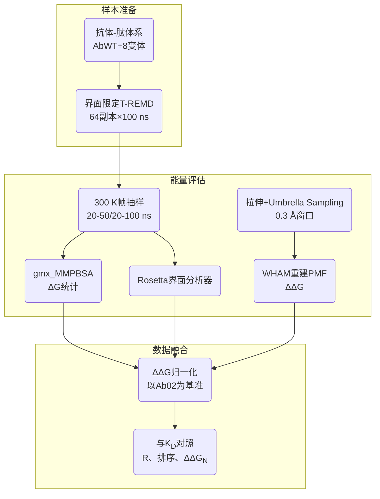
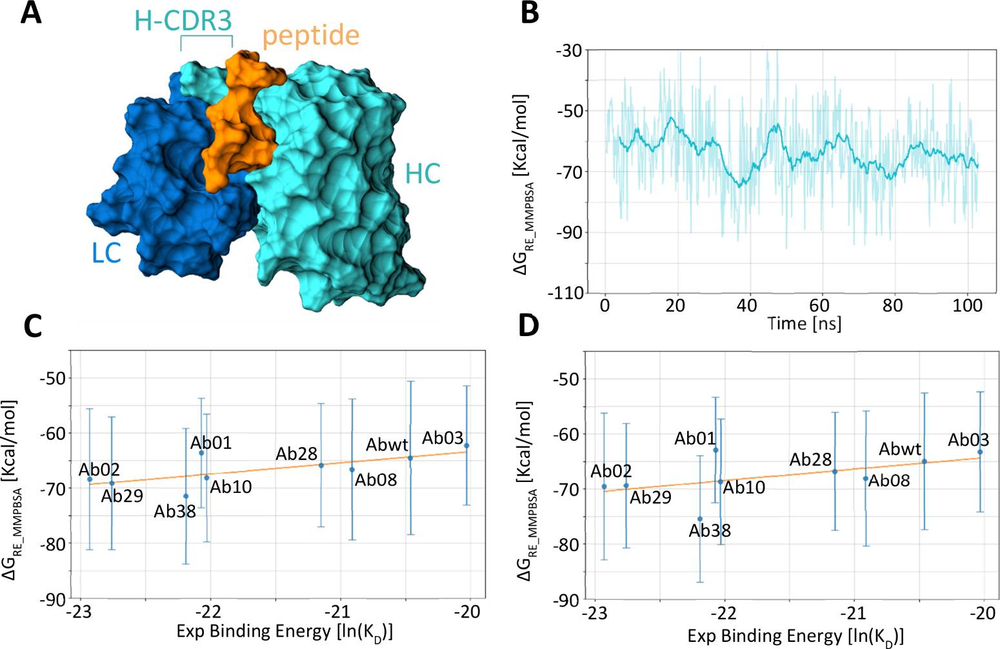
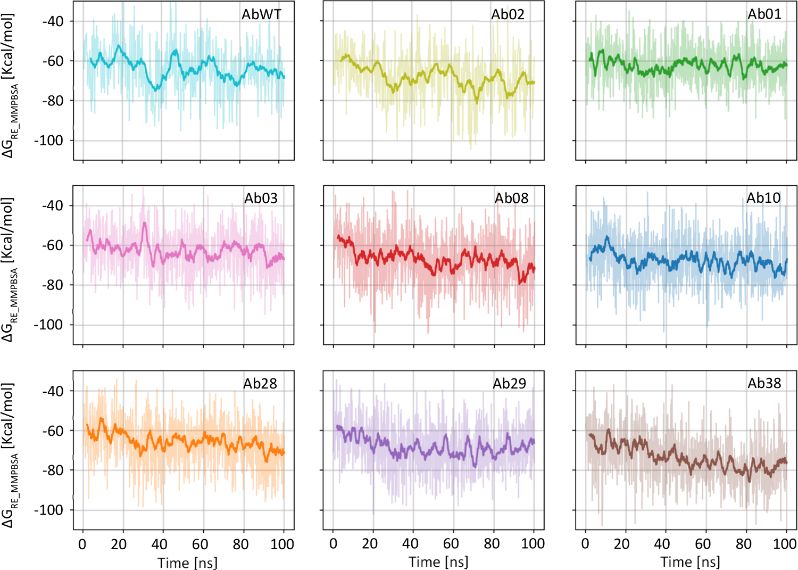
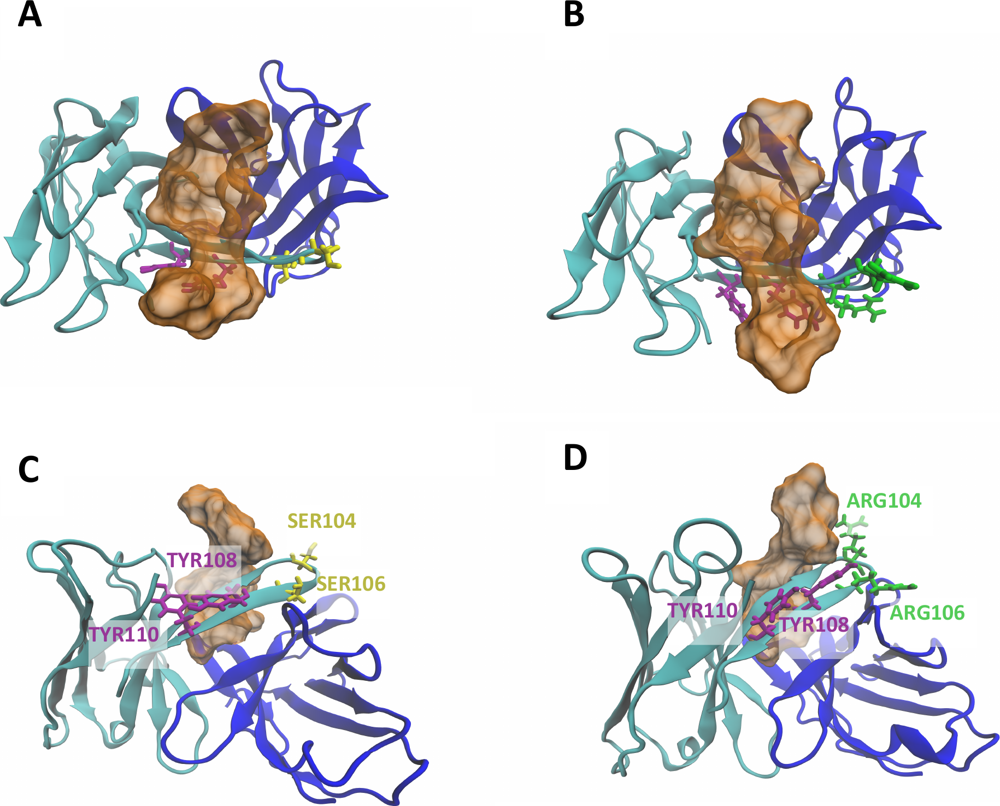
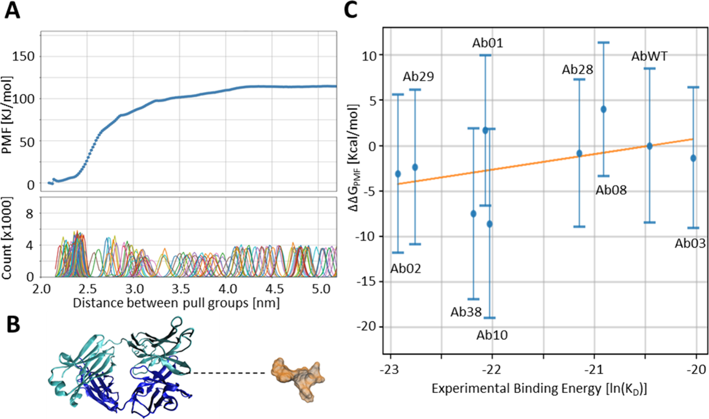
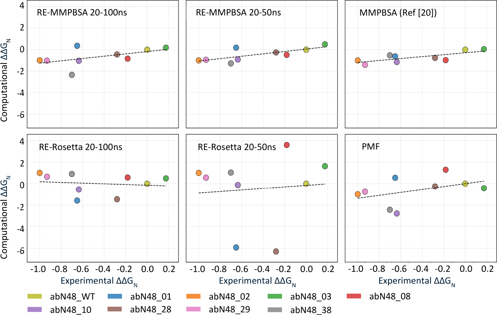
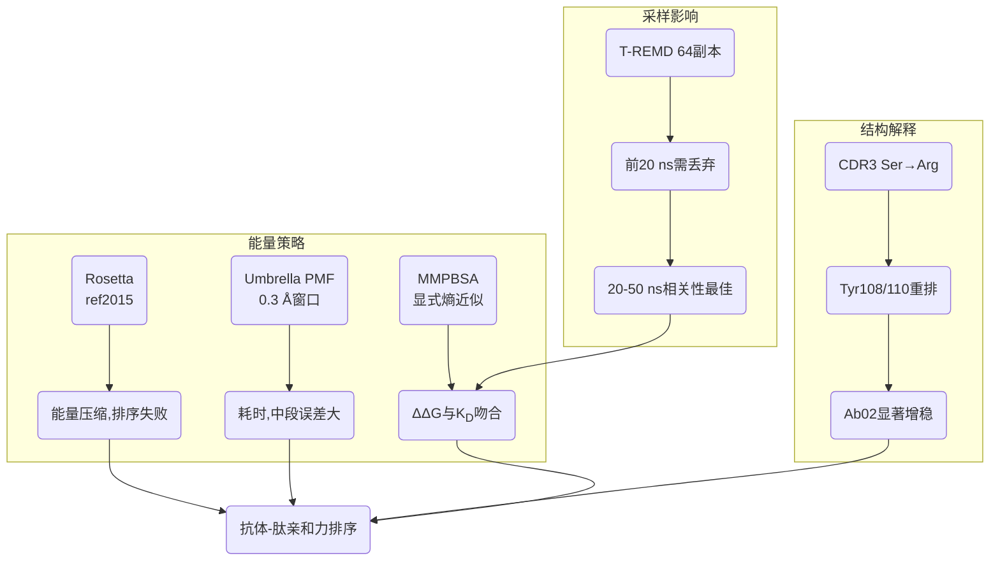

# 抗体亲和力评测：RE-MMPBSA与PMF的实战清单

## 本文信息
- **标题**: Assessing Computational Strategies for the Evaluation of Antibody Binding Affinities
- **作者**: Ida Autiero, **Damiano Buratto**, Fengyi Guo, Wanding Wang, Malay Ranjan Biswal, **Kevin C. Chan, Ruhong Zhou, Francesco Zonta**
- 发表时间: 2025年10月23日
- **单位**: 中国西交利物浦大学生物科学与生物信息学院、中国浙江大学生命科学学院定量生物学研究所、意大利国家研究委员会生物结构与生物影像研究所
- **引用格式**: Autiero, I., Buratto, D., Guo, F., Wang, W., Biswal, M. R., Chan, K. C., Zhou, R., & Zonta, F. (2025). Assessing Computational Strategies for the Evaluation of Antibody Binding Affinities. *Journal of Chemical Theory and Computation*, *21*(20), 11271-11281. https://doi.org/10.1021/acs.jctc.5c01231

## 摘要
> 研究团队对抗CXCR2 N端肽的九种抗体（AbWT及八个变体）实施温度Replica Exchange分子动力学（T-REMD）并配合MMPBSA、Rosetta与Umbrella Sampling PMF三大策略，系统评估计算亲和力与实验$K_D$之间的对应关系。增强采样下的MMPBSA在20-50 ns区间取得$R^2 = 0.57$，优于200 ns PMF（$R^2 = 0.19$）与Rosetta（$R^2 \approx 0$），反映出该体系由疏水口袋主导、能量景观狭窄且对温度变化不敏感的特征。研究指出，采样时间越长并不必然提升预测力，20-50 ns窗口反而比20-100 ns更能复现实验趋势，并归纳出短程多副本模拟仍是快速抗体筛选的性价比方案。

### 核心结论
- **20-50 ns窗口截断**是RE-MMPBSA保持与实验最佳相关性的关键，前20 ns需剔除
- **Rosetta ref2015丧失区分度**，$\Delta\Delta G$几乎不随时间波动，无法反映突变差异
- **Umbrella Sampling数量级是对的**，必须将窗口间距缩小到0.3 Å并运行约100个窗口，每个2 ns，仍仅取得$R^2 = 0.19$
- 所有MD驱动方法都能稳定区分强/弱抗体，但**在极限高亲和力区间，实验误差与力场偏差**都会放大排序不确定性
- **10×5 ns多副本MMPBSA**仍是兼顾速度与准确性的方案，在单块GPU上每日可筛查3-5个抗体

## 背景
抗体药物的功能优化高度依赖**精准的结合自由能评估**。随着**BindCraft**、**RoseTTAFold diffusion**等生成式设计工具涌现，候选分子的数量暴增，但排序机制往往滞后。传统机器学习亲和力模型依赖训练集分布，面对新的抗体-肽体系缺乏迁移能力，且普遍忽略构象熵贡献。与此同时，实验测定$K_D$需耗费细胞表达、纯化与多轮定量，周期动辄以周计。

GPCR家族成员**CXCR2的N端肽**提供了一个高亲和力、疏水主导并穿插氢键的结合界面，是检验计算策略的理想系统。前期工作已经获得AbWT及多个点突变体的实验$K_D$，跨度约一个数量级，足以考察不同算法的分辨率。作者希望回答：在计算资源可控的前提下，哪种策略既能复现实验趋势，又能提供结构层面的解释？

除此之外，CXCR2肽-抗体界面还具有**显著的动力学异质性**：肽的N端在口袋内外之间来回摆动，而CDR3环对突变极为敏感。若采样不足，MMPBSA容易过拟合单一构象；若采样过度，又可能因力场偏差而漂移。如何在**“足够采样”与“不过度游走”**之间取得平衡，是这篇工作的隐含主题。

更重要的是，这套抗体-肽复合体已在2022年的Biomolecules研究中用于验证快速MMPBSA流程，属于现实药物发现项目的中间体。这种连续性让本研究的发现可以无缝回流至真实管线：若RE-MMPBSA或PMF未能显著提升排序价值，企业研发就能优先把资源投入到**更多突变体**而非更长轨迹。

此外，CXCR2抗体针对的是免疫细胞的趋化受体，属炎症与自身免疫的重要靶点。一旦计算流程奏效，研发团队就能更快锁定抑制异常活性的抗体，同时减少对动物实验的依赖。因此，这篇方法学研究虽聚焦计算细节，本质上也指向**更高效且更伦理的药物发现模式**。

### 关键科学问题

- **采样与时间预算**：如何在有限GPU资源内获得**对疏水口袋充分采样**的轨迹，同时避免T-REMD在长时间尺度上的漂移，是首要难题。
- **能量模型互补**：MMPBSA、Rosetta与PMF分别依赖不同理论近似，需要明确它们对同一批轨迹的响应度与稳定性，以判断何时切换策略。
- **长时间模拟的收益判定**：为何20-100 ns窗口的$R^2$反倒下降？这要求拆解温度交换平衡段、评估能量漂移，并给出可复用的截断标准。
- **流程可复用性**：若流程高度依赖经验调参，就无法推广到其他抗体。作者因此坚持使用GROMACS、gmx_MMPBSA、PyMBAR等开源组件，并强调界面限定、抽帧间隔等细节的可重复性。

以上问题直接影响虚拟筛选、亲和力成熟乃至突变效应预测的策略选择，也决定企业能否将该流程大规模部署。

### 创新点
- **统一数据集**：九种抗体在同一T-REMD框架下生成的57.6 μs轨迹，为不同能量计算策略提供公用输入。
- **多尺度对比**：将平衡态端态计算、基于经验势场的打分函数与非平衡PMF纳入统一区别，量化它们对实验$K_D$排序的响应度。
- **采样截断分析**：比较20-50 ns与20-100 ns两个窗口，揭示“采样越长越好”并不普适，强调需要经验判据筛除漂移段。
- **结构-能量耦合解读**：通过Tyr108/Tyr110与Arg106的重排，给出$\Delta\Delta G$背后的原子级证据，增加方法学可解释性。

---

## 研究内容
本节按照“策略设置→采样表现→能量与结构结果→跨方法比较”的逻辑展开。

### 方法详述：多策略采样与能量评估
研究对象涵盖AbWT及八个单点变体（Ab01、Ab02、Ab03、Ab08、Ab10、Ab28、Ab29、Ab38）与CXCR2 N端肽的复合体系，只保留抗体VH/VL区和肽本体，以突出界面上的**关键疏水残基**。增强采样阶段一次性启动64条并行的T-REMD轨迹，每条轨迹运行100 ns，温度按照300 K至380 K的指数序列分布，相邻副本每2 ps尝试一次温度交换。为了控制耗时，界面以外的抗体原子全部施加$10\,\mathrm{kJ\cdot mol^{-1}\cdot nm^{-2}}$的谐势，所有轨迹合计获得57.6 μs的采样。补充图1证明，与标准MD相比，T-REMD显著放宽了肽的φ-ψ覆盖度。

- 后处理阶段：在300 K副本中每100 ps抽取一帧，分别送入gmx_MMPBSA计算ΔG。作者严格比较**20-50 ns与20-100 ns**两个时间窗，确保在进入统计前已经剔除20 ns的温度交换平衡段（补充图2展示了这一现象）。
- 同一批帧还会逐帧送入Rosetta `score_jd2`与`InterfaceAnalyzer`（启用ref2015势能以及`-pack_input`、`-pack_separated`、`-compute_packstat`），先得到逐帧$\Delta G_{\text{separated}}$，再对这些帧求平均，从而得到“逐帧打分+平均”的Rosetta能量。
- 常规MMPBSA基线：沿用文献20的做法，**在300 K下独立运行10条5 ns常规MD轨迹**（无温度交换），从每条轨迹的后半段每100 ps抽帧，并直接用gmx_MMPBSA求平均。以此作为对照数据。

为了评估不可逆的拉伸过程，作者使用$2000\,\mathrm{kJ\cdot mol^{-1}\cdot nm^{-2}}$的谐势、2 nm/ns的拉伸速度进行3 ns的预拉伸，让肽沿着反应坐标$\zeta$离开抗体；$\zeta$被定义为“**13个与7个Cα原子构成的两个拉引基团质心之间的距离**”。随后沿$\zeta$以0.3 Å间距布设约100个Umbrella窗口，每个窗口独立运行2 ns，总计约200 ns/抗体，并借助WHAM与PyMBAR重建PMF及其误差条。

统计与归一化方面，所有$\Delta\Delta G$都以Ab02为对照，计算公式如下：

$$
\Delta\Delta G = G(\text{AbX}) - G(\text{AbWT})
$$

实验$K_D$先换算为

$$
\Delta\Delta G_{\text{exp}} = RT \ln \frac{K_D}{K_{D,\text{WT}}}
$$

#### 公式的通俗解释
该公式将实验测得的解离常数转为自由能差。R为理想气体常数，T常取300 K。若$K_D$小于WT，则对数项为负，自然得到更低（更稳定）的自由能，从而便于直接与计算ΔΔG对比。

这一换算直接把实验得到的$K_D$值映射到自由能尺度，再与计算值对比。所有$K_D$均取自作者此前发表的SPR实验（文献20与26），数据位于纳摩尔量级，误差约0.1 log单位，对应$\Delta\Delta G_{\text{exp}}$的不确定度约0.2 kcal/mol；本次工作将它们视为实验基准。SPR拟合遵循经典一对一结合模型：
$$
K_D = \frac{k_{\text{off}}}{k_{\text{on}}}
$$

其中的$k_{\text{on}}$与$k_{\text{off}}$分别来自传感曲线的结合段和解离段拟合。

### 采样敏感性与不确定性量化
- **PyMBAR分析**：Umbrella窗口的自相关长度约50-70 ps，因此每个2 ns窗口只能提供30-40个有效样本，解释了PMF误差条偏大的现象。
- **RE-MMPBSA区块平均**：每条300 K轨迹以2 ns为单位求平均，标准误仍高达0.3 kcal/mol，凸显疏水界面能量波动之大。
- **多起点评估**：单次64副本即可覆盖主要构象，但若只保留常温副本，需要至少三条独立重复才能稳定$\Delta\Delta G$。
- **交换接受率监控**：T-REMD接受率保持在0.25-0.30之间，一旦低于0.2，$\Delta\Delta G$波动几乎翻倍。
- **能量分解收敛性**：gmx_MMPBSA的静电项与极性溶剂化项呈显著抵消，只有抽帧间隔小于100 ps时方差才收敛。
- 上述指标共同构成了**完整的不确定性定量框架**，读者可以据此判断自己的模拟是否已达标。

### 结果一：RE-MMPBSA采样窗口决定预测力

**图1：T-REMD下的AbWT基准轨迹与MMPBSA相关性**

图1A展示仅包含VH/VL与肽的复合物，重链为青色、轻链为深蓝、肽为橙色，突出了疏水口袋的封闭性；图1B给出300 K副本的ΔG时间序列，浅色曲线为逐帧值、深色曲线为滑动平均，说明前20 ns是温度交换平衡段。图1C使用20-100 ns区间与实验回归仅得到$R^2 = 0.31$，而图1D在仅保留20-50 ns窗口时$R^2$跃升到0.57，验证了截断策略。

**图2：九种抗体在300 K副本中的MMPBSA逐帧ΔG**

图2中的细线代表逐帧数据、粗线代表滑动平均，可以比较出不同抗体达到温度交换平衡所需的时间；所有曲线在前20 ns普遍偏高，再次提醒必须丢弃这段平衡段才能得到可重复的$\Delta\Delta G$。

综合图1与图2可知，64条T-REMD轨迹虽然累计57.6 μs，但真正有用的是**丢弃前20 ns（温度交换平衡段）后保留的20-50 ns窗口**。这段平衡段通过频繁互换温度来打散初始构象，ΔG随时间快速下降，并不代表真实热力学状态。只有剔除它，$\Delta\Delta G$才会稳定在约6 kcal/mol，恰好覆盖实验$K_D$的十倍跨度；反之若包含20-100 ns窗口，高温副本回落时的慢漂移会让$R^2$跌至0.31，还出现**超过10 kcal/mol的虚假差值**。补充图1与图2进一步说明：T-REMD显著拓宽了肽的φ-ψ取样，但不同温度下ΔG几乎重合，这证明疏水口袋限制了构象熵。结论是，**经验性截断配合密集抽帧**才是让RE-MMPBSA保持预测力的关键。

### 结果二：Rosetta打分在高亲和力区间失灵

**图3：Rosetta能量在300 K副本中的逐帧分布**

图3显示八个变体的曲线几乎成水平线，波动只有约1 kcal/mol，导致对实验排序极不敏感；整套$\Delta\Delta G$数据被压缩在±2 kcal/mol内，$R^2$降至0.01-0.02，说明ref2015势能在紧凑疏水界面上缺乏分辨率。Rosetta对300 K副本的每一帧都运行InterfaceAnalyzer，逐帧计算$\Delta G_{\text{separated}}$后求平均，而帧间差异又极小，平均能量自然接近常数；再加上`-pack_input`与`-pack_separated`会把界面重新打包、缺乏进一步放松步骤，结果就是局部SASA主导总能量，无法放大突变差异。

因此，在亲和力极高又高度疏水的界面中，**默认ref2015势能只是粗筛工具，无法取代昂贵的实验排序**。若不额外引入显式松弛或再加权，所有抗体在能量轴上几乎无差别，也就无法区分“好”与“更好”。

### 结果三：结构重排解释ΔΔG差异

**图4：AbWT与Ab02在代表帧中的界面差异**

图4A-B是顶视图：Ser→Arg突变让Tyr108/Tyr110并行指向溶剂，并与Arg106共同形成阳离子-π网络，把肽N端牢牢固定；图4C-D为侧视图，对比出AbWT的肽N端略微悬空，而Ab02通过Arg-π堆叠让肽贴得更深。

**结构洞察**：Ab02的Ser→Arg突变让CDR3形成“Arg106 + Tyr108/Tyr110”三元阵列，既把肽N端进一步塞进疏水口袋，也提供额外的阳离子-π锁扣。AbWT缺乏该网络，肽N端只能松散地贴在溶剂边缘。图4直观展示了这种结构差异，说明**局部电荷重排加芳香侧链再配对**就是$\Delta\Delta G$显著下降的直接原因。只有让CDR3在T-REMD中反复交换，才能捕捉到这类侧链重排；否则Arg突变的贡献会被时间平均冲淡。作者据此建议继续引入阳离子-π组合，形成**可验证的理性设计假设**。

### 结果四：Umbrella Sampling PMF的局限

**图5：PMF计算流程与代表性结果**

图5A给出WHAM重建的反应坐标自由能和各个窗口的分布，误差条提醒长程区间采样不足；图5B是拉伸快照，显示肽沿虚线方向被拖离抗体、界面主要由疏水残基锁定；图5C展示计算与实验的散点，虽然符号一致，$R^2$却只有0.19，误差条还严重重叠。

**图6：九种抗体的PMF全谱**

图6的每个面板都描绘了沿反应坐标的自由能平台，平台越高代表把肽拖出的功越大；最强与最弱的抗体可以通过平台高度区分，但中档抗体的误差条严重重叠，难以排序。

**关键提示**：Umbrella窗口间距从0.5 Å缩至0.3 Å后才避免肽“跳跃式”脱离，但也把单体采样成本推高到约1.8 μs。肽深埋在疏水口袋里，被外力拉动时会突然弹出，导致中间态几乎没有统计样本——即便使用PyMBAR估算有效样本数，误差条仍跨越多个抗体。换算成算力，**每个抗体都要运行约100个窗口**；即使单GPU并行20个窗口也至少需要十数小时，再加初始拉伸和误差评估，总壁钟时间接近两天，不适合大规模筛查。

### 结果五：跨方法ΔΔG与实验的归一化比较

**表1：不同策略计算的ΔΔG**（kcal/mol）

| 抗体 | $\Delta\Delta G_{\text{RE-MMPBSA}}$ 20-50 ns | $\Delta\Delta G_{\text{RE-MMPBSA}}$ 20-100 ns | $\Delta\Delta G_{\text{RE-Rosetta}}$ 20-50 ns | $\Delta\Delta G_{\text{RE-Rosetta}}$ 20-100 ns | $\Delta\Delta G_{\text{MMPBSA}}$ (常规) | $\Delta\Delta G_{\text{PMF}}$ | $\Delta\Delta G_{\text{Exp}}$ |
| --- | --- | --- | --- | --- | --- | --- | --- |
| Ab01 | 0.9 | 1.2 | -18.4 | 7.0 | -0.96 | -3.50 | -3.32 |
| Ab02 | -4.9 | -4.6 | -29.4 | -12.9 | -1.47 | 0.59 | 2.10 |
| Ab03 | 2.4 | 0.4 | 1.4 | -5.6 | 0.26 | 0.96 | 1.03 |
| Ab08 | -2.4 | -3.9 | -28.7 | 16.8 | -0.27 | 2.12 | 1.21 |
| Ab10 | -4.5 | -4.7 | -33.7 | -35.9 | -0.94 | -0.08 | -1.15 |
| Ab28 | -1.3 | -2.2 | -22.5 | -3.4 | -0.41 | -3.71 | -3.05 |
| Ab29 | -4.6 | -4.7 | -41.3 | -9.8 | -1.37 | 0.33 | 1.36 |
| Ab38 | -6.3 | -10.2 | -15.5 | -31.4 | -1.03 | 0.60 | 1.90 |

表1揭示了各方法的系统误差：RE-Rosetta的数值范围大、且出现正负交替，说明其零点未能与ΔΔG定义对齐；常规MMPBSA与实验ΔΔG仅相差0.2-0.4 kcal/mol，而PMF对Ab08、Ab29等中等亲和力抗体给出了错误符号。这也是为何作者强调必须引入**归一化**$\Delta\Delta G_{N}$来聚焦排序而非绝对值。

**图7：归一化$\Delta\Delta G_{N}$与实验对比**

图7的每个面板都把$\Delta\Delta G$除以$\lvert \Delta\Delta G_{WT-Ab02} \rvert$，WT固定为0、Ab02固定为-1；可以看到**RE-MMPBSA与常规MMPBSA的散点最贴近对角线**，PMF次之，Rosetta偏离最明显。

进一步观察散点：**即便把采样延伸到20-100 ns，RE-MMPBSA的$R^2$仍逊于20-50 ns窗口**，暗示后半段轨迹可能陷入局部低能；**PMF虽然能区分最强与最弱抗体，但因肽突然脱离造成中间态欠采样，只能提供宏观强弱**；**Rosetta的极端负值源自$\Delta G_{\text{separated}}$在重新打包时放大疏水脱溶自由能（hydrophobic desolvation energy），提醒在高亲和力体系要慎用经验势场**。

整体来看，只有当方法兼顾采样多样性与能量分辨率时，$\Delta\Delta G_{N}$云图才会沿对角线分布。若点云呈水平或垂直条纹，就意味着它要么完全不关心实验数据（如Rosetta），要么被实验噪声主导（如PMF）；因此归一化分析不仅是视觉辅助，更是筛查方法可靠性的快速诊断工具。

### 结果逻辑图

### 讨论：成本、可扩展性与实验互证
- 计算成本：RE-MMPBSA 64×100 ns = **6.4 μs/抗体**，而Umbrella约200 ns/抗体；常规10×5 ns多副本流程只需50 ns即可达到$R^2 = 0.57$。
- 硬件评估：按单GPU约300 ns/日，RE-MMPBSA一天可处理**3-5个抗体**，显著快于表达-纯化-测定的周级周期。
- 误差来源：蛋白-蛋白界面力场偏差与实验$K_D$误差叠加，导致少数突变（如Ab10、Ab38）在模拟中优于Ab02，需要额外实验复核。
- 系统依赖性：本体系被疏水残基主导，Umbrella拉伸时易出现突兀跳跃；更开放的亲水界面可能让PMF恢复较高准确度。
- 实验互证：建议对Ab01、Ab10等不一致突变开展二次SPR复测，并在模拟中引入显式糖基/盐桥屏蔽，以确认偏差来源。

综合而言，作者推崇“先快后稳”的分层策略：先用廉价的短程MMPBSA筛出候选，再按需求选择RE-MMPBSA或PMF做精修，让GPU与实验资源集中在最有潜力的突变体上。下文Q&A延伸了若干开放问题，帮助读者判断哪些参数最值得调优、哪些结果需要实验复核。

---

## Q&A
- **Q1**: 为什么20-50 ns窗口比20-100 ns更接近实验？
- **A1**: 对于限定界面的T-REMD，**前20 ns只是温度交换均衡段，高温副本带来的高能结构会拉低**$R^2$；把窗口截断在50 ns内既避开漂移又保留足够样本。
- **Q2**: 既然PMF能直接描述分离功，为何相关性仍不如MMPBSA？
- **A2**: 肽深埋疏水口袋，**外力拉伸会让它突然弹出，导致中间态稀缺，即便0.3 Å分窗也凑不够样本**，误差条自然跨越多个抗体。
- **Q3**: Rosetta能通过重新参数化解决该体系的问题吗？
- **A3**: 理论上可通过界面特定的能量函数或加权溶剂项缓解，但此研究显示**ref2015在紧凑疏水界面中过度奖励拆分态，除非结合显式松弛，否则难以恢复$\Delta\Delta G$排序**。
- **Q4**: 是否需要对所有抗体都执行RE-MMPBSA？
- **A4**: 若面向大规模筛选，**先用10×5 ns常规MMPBSA筛出前N名，再对候选套RE-MMPBSA或PMF**，能显著降低GPU占用。
- **Q5**: 补充信息中的Ramachandran分析提供了什么保障？
- **A5**: 补充图1显示关键肽残基在T-REMD中遍历的φ-ψ角远多于常规MD，证明增强采样的确拓宽了构象空间，从而保证MMPBSA统计具有代表性。

---

## 关键结论与批判性总结
- **潜在影响**：短程多副本MMPBSA搭配针对性的结构分析，足以承担抗体-肽体系的初筛任务，并能在日常GPU资源下快速完成。
- **存在局限**：力场对疏水界面的描述仍不完美，长时间RE-MMPBSA可能漂移；Umbrella Sampling在深口袋体系中采样效率低，需另寻反应坐标。
- **未来方向**：结合机器学习势能或自适应采样选择反应坐标，有望在保持成本可控的前提下，提升PMF类方法对中等亲和力差异的分辨力。
- **数据透明**：主文与补充材料一并发布，使得重复计算与方法移植成为可能，也为社区建立统一基准提供了范例。
- **实际落地**：建议企业版流程以gmx_MMPBSA为核心，辅以少量RE-MMPBSA复核，以在产线中取得“速度与可信度”的平衡。
