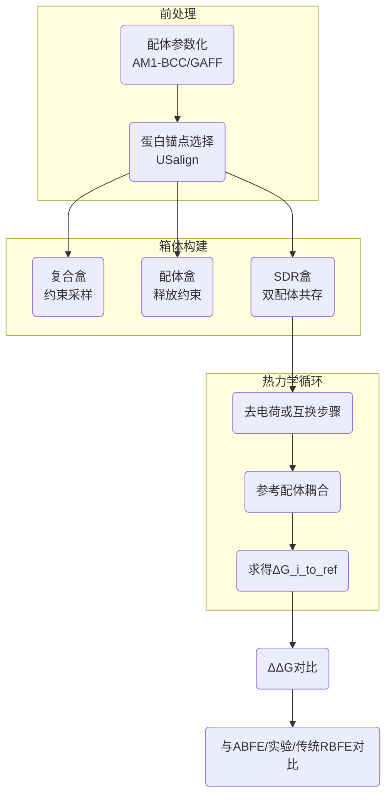
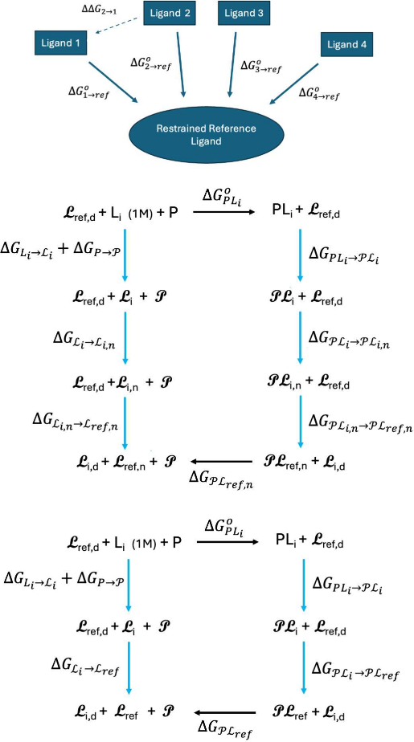
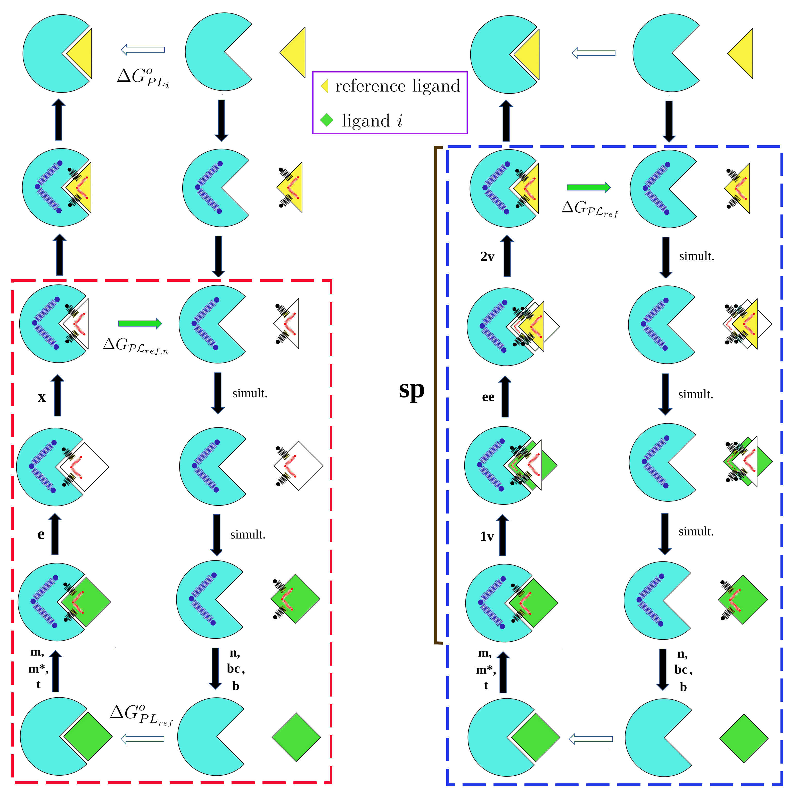
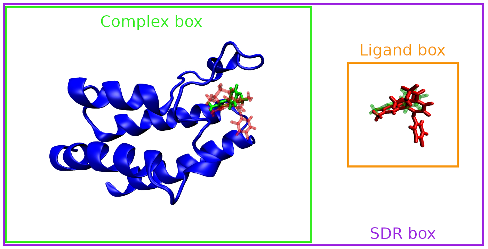
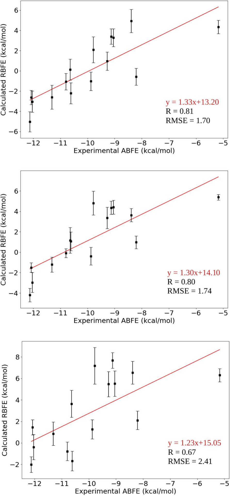

# 相对BAT：SepTop自动化让BRD4结合自由能评估真正可扩展

## 本文信息

- **标题**：Relative BAT：利用分离拓扑的自动化相对结合自由能计算
- **作者**：Germano Heinzelmann, David J. Huggins, Michael K. Gilson
- 发表时间：2025年11月10日
- **单位**：巴西圣卡塔琳娜联邦大学物理系；美国威尔康奈尔医学院生理与生物物理系；美国加州大学圣迭戈分校药学院
- **引用格式**：Heinzelmann, G.; Huggins, D. J.; Gilson, M. K. Relative BAT: An Automated Tool for Relative Binding Free Energy Calculations by the Separated Topologies Approach. *J. Chem. Inf. Model.* 2025. https://doi.org/10.1021/acs.jcim.5c02175
- **相关资源**：BAT.py 2.4 全套输入与脚本（https://github.com/GHeinzelmann/BAT.py）

## 摘要

> 文章将分离拓扑（SepTop）相对结合自由能策略嵌入 BAT.py 自动化平台，首次同时支持 AMBER 与 OpenMM，并提出以去电荷参考配体为核心的 Method 1。通过 BRD4(2) 十五个配体的基准测试，Method 1 在 R=0.81、RMSE≈0.9 kcal/mol 的精度下，与 ABFE、传统 RBFE 及实验数据保持一致，同时把单次计算时间控制在 177.6 ns，显著优于 Method 3 的 254.4 ns。支持信息进一步给出了全部输入文件、热力学循环细节与成本拆解，便于直接复现实验。

### 核心结论

- **Method 1 以去电荷参考配体为枢纽，SepTop 在双引擎下依旧保持 1 kcal/mol 以内的 MUD**。
- **在 BRD4(2) 十五个配体上，Method 1 的实验相关系数 0.81 明显优于 Method 3 的 0.67**，且对构象约束选择不敏感。
- **SepTop 能覆盖共享骨架不足的配体对，同时在可适用的 common-core 对上维持 ±0.5 kcal/mol 级别一致**。
- **Method 1 比 Method 3 少耗 76.8 ns 的模拟时间，并在 SDR、复合、配体三类盒子间负载均衡**。

## 背景

从 ABFE 到 RBFE，分子动力学驱动的自由能评估已成为早期药物发现筛选的硬核工具，但传统工作流依赖繁琐的手动搭建与调参与力场兼容性，导致 GPU 规模化部署困难。ABFE 虽覆盖任何配体，但要解决空腔水交换与蛋白大尺度构象变化；RBFE 虽高效，却受限于“公共骨架”要求。SepTop 方法通过同时存在的两条热力学腿，把一条配体在蛋白腔体中维持耦合，另一条在溶剂中解耦，从而兼得两者优点，却需要更复杂的约束、箱体与脚本管理。Relative BAT 的目标正是把这些繁琐步骤模块化，减轻药物化学团队在 AMBER、OpenMM 之间切换的负担。

### 关键科学问题

SepTop 仍面临三点挑战：其一，如何构建对任何配体都共同适用的参考态，并在不同引擎间保持能量一致性；其二，如何在保持多参考箱体、Boresch 约束及 SDR 同步过程的同时自动化误差估计；其三，如何在真实药物候选上验证精度、稳定性与成本三者的平衡。本文通过引入 Method 1（去电荷参考）、Method 2（全电荷单步互换）及 Method 3（三步分离互换），系统回答了这些问题。

### 创新点

- **Method 1 的去电荷参考**：把所有配体映射到 5uf0 的无电荷版本，使热力学循环减少轮廓面积并消除电荷不平衡。
- **Ambertools + OpenMM 双引擎统一脚本**：同一 BAT 输入即可调用 AMBER22 或 OpenMM 8.2.0，并共享 SDR、MBAR、TI-GQ 计算图。
- **多箱体管理**：引入 SDR 盒、复合盒、配体盒的自动生成与复用，配合 Boresch 约束和可选蛋白构象约束，显著降低设定错误率。
- **全流程成本分析**：支持信息提供各方法在 SDR、复合、配体盒的耗时拆分，给出具体 ns 级预算。

---

## 研究内容

### SepTop 热力学循环与公式解析

**图1：SepTop 相对结合自由能网络与三条路径** 顶部示意所有配体都指向单一参考，虚线箭头 $\Delta\Delta G_{2\to1}$ 由不同 $\Delta G_{oi\to\mathrm{ref}}$ 差值得到；中部是 Method 1，强调对配体及参考的去电荷、LJ 切换、约束附着；底部是 Method 2 与 Method 3，把参考保持带电并采用单步或三步互换。蓝色箭头表示真正求解的自由能分量，黑色字体表示未施加约束的物种，花体表示已被 TR/构象约束锁定。

**图S1：Method 1 与 Method 3 的 SDR 子步骤** 红框中是 Method 1 的 e 与 x 分量，蓝框是 Method 3 的 1v、ee、2v 分量；黑色弹簧代表 TR 约束，红色弹簧代表配体构象约束，蓝色弹簧代表蛋白构象约束。“Simult” 标签提醒上下两个环境要在同一 SDR 盒中同步执行，以避免净电荷漂移。

核心数学关系概括为：

$$
\Delta\Delta G_{ij}=\Delta G_{oj\to ref}-\Delta G_{oi\to ref}
$$

#### 公式的通俗解释

相对结合自由能只关心配体之间的优劣，因此作者先让每个配体在蛋白腔体与溶剂中都“走一遍”到共同参考的路径，记录所需的自由能差；两个配体的差分就是上式。只要参考态的约束对所有配体完全相同，该差分就自动抵消参考偏移，而且可以随时累加上参考的 ABFE 还原出单体结合能。

沿着图 1 的蓝色箭头，可以把 Method 1 的路径拆成以下通俗步骤：

1. **附着约束**：Boresch 约束负责把配体姿态和蛋白三颗锚点绑定，这一步贡献 $\Delta G_{\text{attach}}$，目的是确保之后的去电荷或互换不会把配体甩出腔体。
2. **去电荷**：把配体所有部分电荷调至 0，得到 $L_i^{\mathrm{n}}$。这样一来，配体与参考在 SDR 盒内互换时不会破坏整体电荷守恒，也就避免了 Ewald 校正带来的系统误差。
3. **x 步骤（LJ 互换）**：在同一个 SDR 盒中，让配体在口袋里逐渐“隐形”，同时让参考配体逐渐“现形”；溶剂腿上执行完全相反的过程。这一步的自由能被称为 $\Delta G_x$，是 Method 1 相比传统 SepTop 最大的精简之处。
4. **回充电荷**：把配体在溶剂中的电荷重新打开，恢复真实化学价态；参考配体在腔体中保持中性，直到所有配体都完成映射。
5. **释放约束**：在溶剂盒中一口气解除平动、转动以及可选的扭转约束（分析式的 $\Delta G_b$ 与 $\Delta G_c$），让溶剂中的配体成为真正的标准态分子。
6. **可选蛋白约束释放**：如果为了稳定口袋曾经加过骨架约束，此时要同步解除，以免把额外的弹性能量混入配体差分。
7. **补回参考项**：Method 1 还需要对去电荷的参考配体做一次 LJ decouple/recouple（图 1 中右上角的竖直箭头），才能恢复绝对自由能基准。

综合这些步骤就得到了 $\Delta G_{i\to\mathrm{ref}}^{(1)}$，任意两个配体的差值直接给出 $\Delta\Delta G_{ij}$。Method 2、Method 3 则把上面的“去电荷 + x”组合替换为不同的互换方式：Method 2 用单步 $\Delta G_{\text{ex}}$ 同时更改 LJ 与电荷，省时但更容易震荡；Method 3 把互换拆成 $\Delta G_{1v}$、$\Delta G_{ee}$、$\Delta G_{2v}$ 三段，物理过程最细腻，代价是窗口更多、采样更久。用户可以依据体系电荷、GPU 预算以及对方差的容忍度自由选择路径。

### 仿真设置、约束策略与箱体管理

**图S2：SDR、复合、配体三种模拟盒** SDR 盒（紫色）同时放置蛋白、配体 i 以及参考配体，既可在腔体也可在体相中执行同步 decouple/recouple；复合盒（绿色）仅含蛋白复合物用于约束附着；配体盒（橙色）仅含单个配体用于释放构象约束。Ambertools tleap 负责溶剂化，默认 TIP3P 与 Joung-Cheatham 离子参数。每个 SDR 过程使用 12 个 λ 点的 TI-GQ 或 MBAR，OpenMM 版本还支持 HREX 加速收敛。BAT.py 自动化管理 Boresch 约束：三对锚点由 USalign 对齐后自动挑选，必要时可以选装蛋白骨架构象约束来避免突发折叠。

### BRD4 基准：与 ABFE、实验和传统 RBFE 的多重对齐

**图2：三种协议的 $\Delta G_{oi\to\mathrm{ref}}$ 与实验结合自由能相关性** 上：Method 1 同时施加 TR+构象约束，R=0.81，RMSE=0.86 kcal/mol；中：Method 1 仅保留 TR 约束，R=0.80，RMSE=0.90 kcal/mol，误差条更短；下：Method 3，R=0.67，RMSE=1.31 kcal/mol。三幅图都显示出 5uf0 参考配体在实验坐标系中作为原点，Method 1 数据与回归线基本重叠。

**表1：OpenMM 与 AMBER 上 RBFE 与 ABFE 的 MUD/RMSD 对比（单位：kcal/mol）**

| 引擎 | 协议 | MUD | RMSD |
| --- | --- | --- | --- |
| OpenMM | Method 1 | 0.6 | 0.8 |
| OpenMM | Method 1（仅 TR） | 0.7 | 1.0 |
| OpenMM | Method 2 | 2.6 | 2.9 |
| OpenMM | Method 3 | 1.4 | 1.5 |
| AMBER | Method 1 | 0.7 | 0.9 |
| AMBER | Method 1（仅 TR） | 0.5 | 0.6 |
| AMBER | Method 2 | 1.4 | 2.1 |

Method 1 在两大引擎中的误差均小于 1 kcal/mol，Method 2 因将 LJ 与电荷一次性互换产生较大方差，Method 3 虽改善但成本更高。

**表2：三组具备公共骨架的配体对上的 $\Delta\Delta G$ 对比（单位：kcal/mol）**

| 配体对 | 传统 RBFE | Method 1 | Method 1（仅 TR） | 实验 |
| --- | --- | --- | --- | --- |
| 5uew−5uey | −0.9 ± 0.5 | −1.6 ± 1.5 | −0.8 ± 1.1 | −1.4 |
| 5u2c−7usj | −0.3 ± 0.6 | 1.7 ± 1.5 | −0.8 ± 0.9 | 0.6 |
| 4z93−5uoo | −1.4 ± 0.6 | −1.6 ± 1.1 | −1.4 ± 0.6 | −1.3 |

数据表明，当配体确有共用骨架时，SepTop 与 common-core RBFE 二者在误差范围内相符；但当差异较大（例如 5u2c−7usj），传统方法无法应用，而 Method 1 仍可提供趋势，虽然需进一步降低不确定性。

### 计算成本与工程部署考量

**表S13：不同方法的模拟时长拆分（单位：ns）**

| 计算类型 | SDR 盒 | 复合盒 | 配体盒 | 总计 |
| --- | --- | --- | --- | --- |
| ABFE | 76.8 | 12.0 | 12.0 | 100.8 |
| Method 1 | 153.6 | 12.0 | 12.0 | 177.6 |
| Method 1（仅 TR） | 153.6 | 6.0 | — | 159.6 |
| Method 2 | 124.8 | 12.0 | 12.0 | 148.8 |
| Method 3 | 230.4 | 12.0 | 12.0 | 254.4 |
| 传统 RBFE | 52.8 | — | — | 52.8 |

Method 1 相比 Method 3 节省 76.8 ns，主要得益于只需 e 与 x 两种 SDR 分量；放弃配体构象约束还能把复合盒时间砍半。虽然传统 RBFE 更便宜，但因骨架约束难以覆盖 BRD4(2) 全部 15 个配体，因此 Method 1 在通用性与成本间取得较优平衡。

---

## Q&A

- **Q1**：为何 Method 1 要把参考配体去电荷？
  - **A1**：去电荷后，配体与参考在 SDR 盒中互换时不会引入净电荷差，从而避免 Ewald 校正与长程补偿，降低整个循环的不确定性；若某体系对静电敏感，可改用 Method 3。
- **Q2**：在什么情况下需要保留配体构象约束？
  - **A2**：当配体柔性高或存在多个可比构象时，构象约束可以固定关键扭角，保证端态一致；若配体较刚性（如多环结构），移除构象约束可节省 6 ns 复合盒采样且误差不升反降。
- **Q3**：OpenMM 与 AMBER 的差异主要体现在哪？
  - **A3**：Method 3 在 AMBER 尚未实现，因为需要在同一盒中同时耦合两个配体；除此之外，两者在 TI-GQ、SDR、Boresch 约束实现细节保持一致，误差差异主要来自积分器与软核参数。
- **Q4**：为何 5u2c−7usj 的 Method 1 结果与实验差异大？
  - **A4**：该配体对的结合自由能差仅约 0.6 kcal/mol，接近统计误差；同时其配体特征差异较大，需要更长的 SDR 采样来收敛互换步骤，作者也在支持信息中指出这是未来扩展到多靶点数据集时需要重点关注的困难场景。

---

## 关键结论与批判性总结

- **潜在影响**
  - Method 1 让任何配体都能无需公共骨架即可执行 RBFE，显著拓宽真实项目对自由能优先级排序的适用范围。
  - BAT.py 同步支持 AMBER 与 OpenMM，并交付完整输入脚本，为企业 GPU 农场快速复现提供了模板。
- **存在局限**
  - 研究仅在 BRD4(2) 上验证，尚未给出多靶点公开基准，Method 1 是否在跨靶点情况下依旧“<1 kcal/mol” 有待验证。
  - 5u2c−7usj 等难例显示 Method 1 对采样长度仍敏感，需要更系统的窗口与 HREX 设置自适应策略。
- **未来方向**
  - 将 Method 1 嵌入主动学习式分子生成（作者引用的 MF-LAL 工作）中，以实时提供高置信度标签。
  - 扩展到带强电荷盐桥的体系，评估去电荷参考是否会削弱物理可解释性，必要时发展混合参考态。
