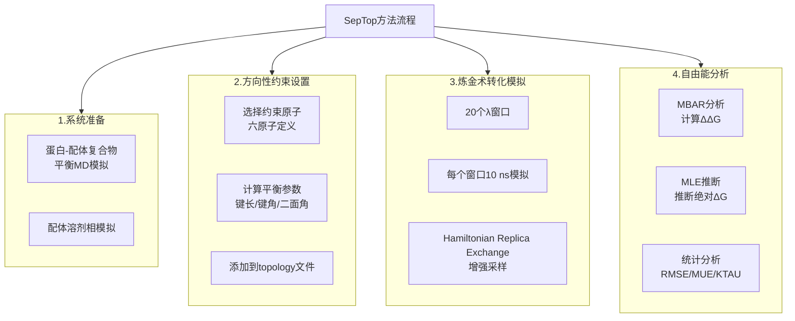
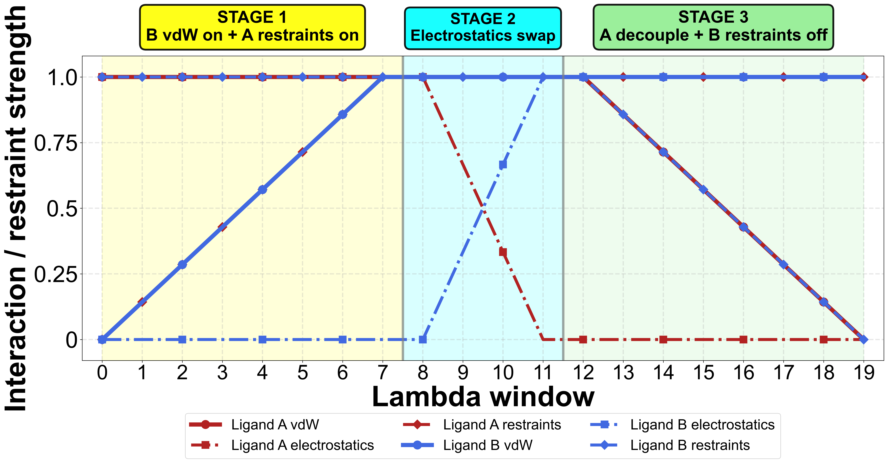
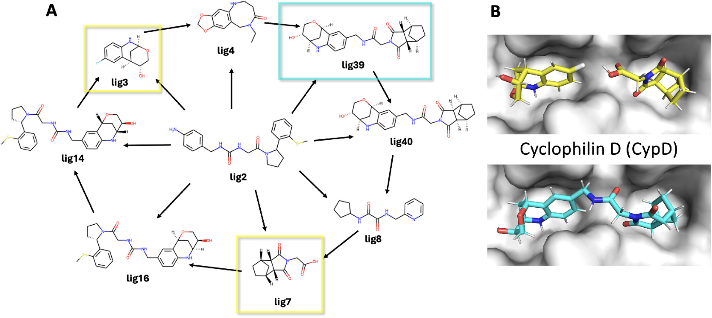
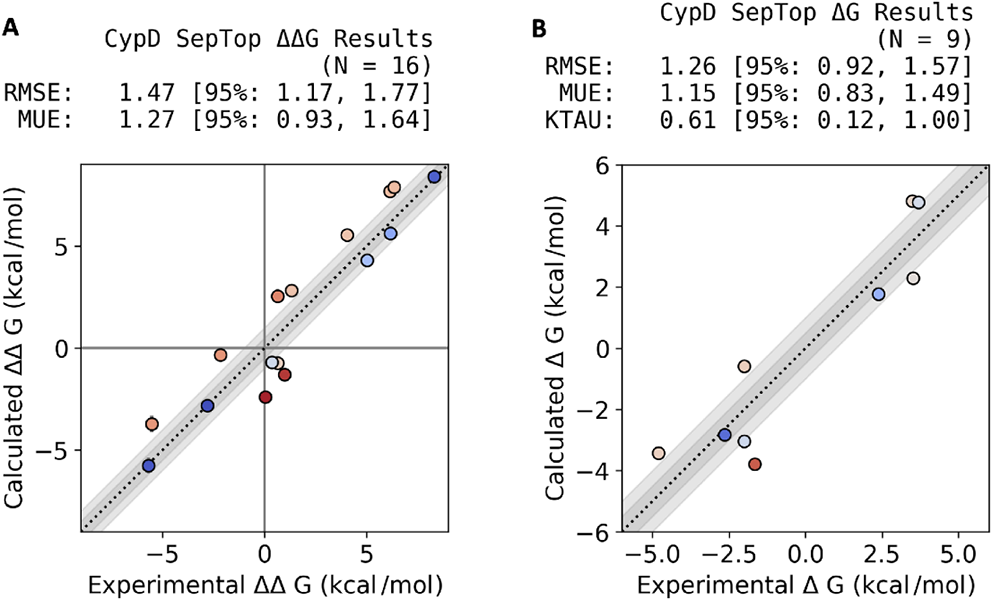
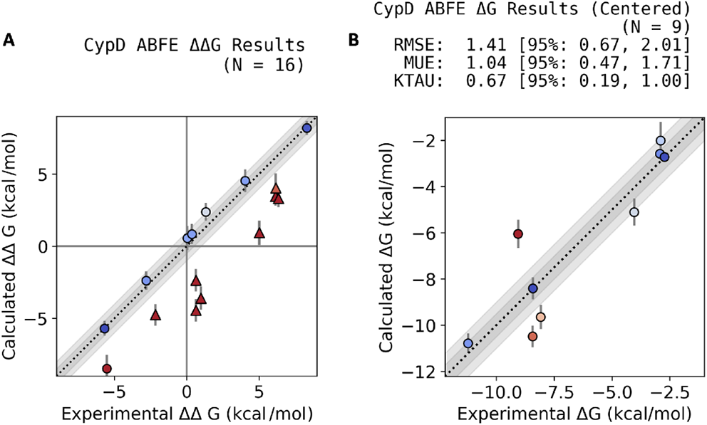
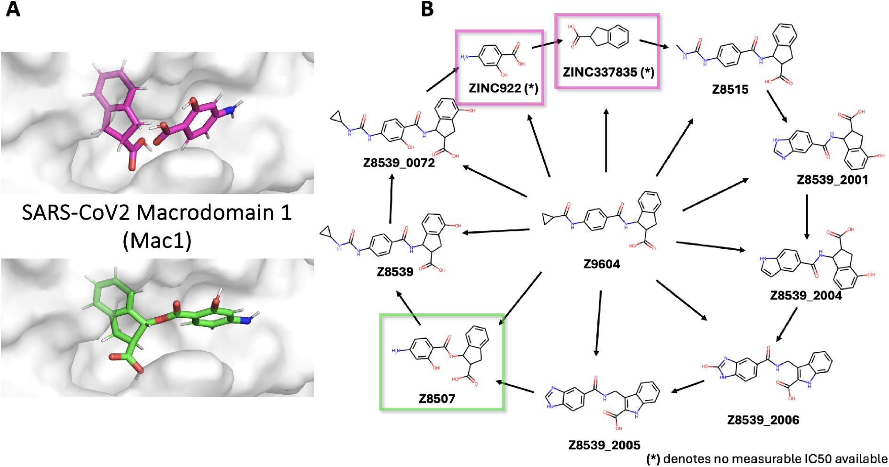
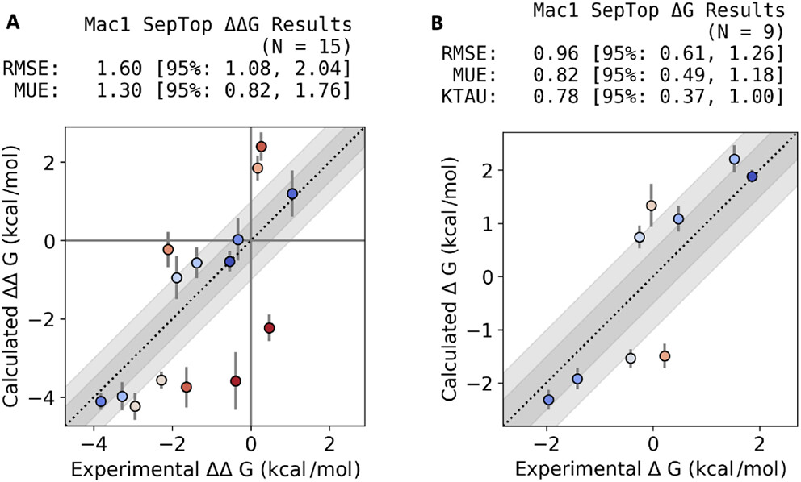

# 片段药物亲和力预测的新工具：分离拓扑方法突破结构重叠限制

## 本文信息
- **标题**：Efficient Binding Affinity Estimation for Fragment-Based Compounds Using a Separated Topologies Approach
- **作者**：Ana-Maria Caldararu, Hannah M. Baumann, David L. Mobley
- **单位**：University of California, Irvine（美国）
- **期刊**：Journal of Chemical Information and Modeling
- **发表时间**：2025年（doi: 10.1021/acs.jcim.5c03091）
- **引用格式**：Caldararu, A.-M.; Baumann, H. M.; Mobley, D. L. Efficient Binding Affinity Estimation for Fragment-Based Compounds Using a Separated Topologies Approach. *J. Chem. Inf. Model.*, 2025, Article ASAP. https://doi.org/10.1021/acs.jcim.5c03091
- **源代码**：https://github.com/MobleyLab/SeparatedTopologies
- **数据与脚本**：https://github.com/AnaCaldaruse/fragment_septop (Zenodo: 10.5281/zenodo.17795849)

## 摘要

> 片段药物发现（FBDD）是早期药物开发中广泛使用的策略，但准确预测片段及其优化衍生物的结合亲和力面临独特的计算挑战。这些困难源于**弱结合亲和力、****多样化的化学骨架**以及片段与优化衍生物之间**有限的结构重叠**。虽然存在多种自由能方法，但很少有专门针对FBDD特定需求的方法。在本研究中，我们评估了**分离拓扑（SepTop）方法**用于建模基于片段的转化，包括片段**合并**和**连接**。使用来自Cyclophilin D和SARS-CoV-2 Macrodomain 1的回顾性数据集，我们证明了SepTop可以在片段和先导化合物中**以良好的精度恢复实验结合亲和力**。这些结果支持SepTop在片段优化中的适用性，并突出了其将结合自由能计算的适用范围扩展到药物发现更早期阶段的潜力。

### 核心结论

- **SepTop在片段连接任务上表现优异**：能够准确预测片段合并和连接后的结合亲和力变化，在CypD系统上RMSE为1.47 kcal/mol（ΔΔG）和1.26 kcal/mol（ΔG）
- **方法灵活性强**：无需共享原子或结合模式重叠即可进行配体转化计算，特别适合片段药物中常见的非同源转化
- **统计效率高**：相比文中对照的ABFE方案，SepTop总模拟长度更短，重复间波动更小，并表现出**更好的重复性**
- **适用范围广泛**：从弱结合片段（mM级）到强结合先导化合物（nM级）都能准确预测，统一了药物发现早期阶段的亲和力预测流程

---

## 背景

片段药物发现（Fragment-Based Drug Discovery, FBDD）是现代药物研发的重要策略，其核心思想是使用**分子量小**（MW<300 Da）、**结合亲和力弱**（mM级别）的片段作为起点，通过逐步优化获得高亲和力的先导化合物。这种方法能够快速探索化学空间，发现新颖的结合模式，但同时也带来了计算预测的独特挑战。

### 关键科学问题

片段药物发现的计算预测面临三大核心难题：

1. **弱结合亲和力的准确预测**：片段的结合亲和力通常在mM级别，信噪比低，实验误差大，对计算方法的精度要求极高
2. **化学骨架多样性**：片段优化往往涉及大幅度的结构变化，如片段合并、连接等，配体间可能完全没有共享原子或重叠的结合模式
3. **转化路径的复杂性**：从片段到先导化合物的优化路径可能跨越多个数量级的亲和力变化，需要方法既能处理局部微调，又能处理全局重构

传统自由能计算方法主要分为两类：**相对结合自由能**（RBFE）和**绝对结合自由能**（ABFE）。RBFE方法（如FEP）适用于结构相似配体间的转化，但要求配体间有较大的结构重叠和共享原子；ABFE方法可以直接计算单个配体的绝对结合自由能，但计算成本高，且需要模拟apo态，对片段系统尤为不利。

### 创新点

本研究首次系统性评估**分离拓扑（Separated Topologies, SepTop）方法**在片段药物发现中的应用，主要创新包括：

- **非同源转化能力**：SepTop通过**方向性约束**（orientational restraints）允许配体在结合位点内独立移动，无需共享原子或结合模式重叠，天然适合片段合并和连接场景
- **计算效率优化**：相比ABFE方法避免了apo态模拟，相比传统RBFE方法放宽了结构相似性要求，在精度和效率间取得良好平衡
- **双系统验证**：在Cyclophilin D（片段连接案例）和SARS-CoV-2 Macrodomain 1（片段合并案例）两个截然不同的系统上验证方法的普适性

---

## 研究内容

### Separated Topologies方法原理

SepTop是一种相对结合自由能计算方法，最初由Rocklin等人在2013年提出，后经Baumann等人进一步完善。其核心思想是通过**方向性约束**将两个配体独立地锚定在结合位点中，从而允许它们在模拟过程中自由移动和旋转，而不必保持结构重叠。

#### 核心设计原则

SepTop方法的核心是通过**方向性约束**（Boresch Restraints）将两个配体独立地锚定在结合位点中，允许炼金术转化过程中两个配体同时存在于结合位点。具体到**方向性约束的原子选择**，作者并不是直接根据一张静态构象手工挑点，而是尽量把约束建立在平衡态动力学信息上：
- 使用**Baumann等人开发的自动化算法**从平衡MD轨迹中选择**6个约束原子**（3个配体原子+3个蛋白原子）
  - 采用轨迹而非静态结构的原因是**选择更稳定的约束原子**，静态结构可能无法识别最佳位置
  - 这6个原子定义了**1个键、2个角、3个二面角**的几何约束
- 约束参数（键长、键角、二面角的平衡值）从平衡轨迹计算，可以是单结构值或轨迹平均值
  - 约束力常数设置：键约束为$20\,\mathrm{kcal\cdot mol^{-1}\cdot Å^{-2}}$，角和二面角约束为$20\,\mathrm{kcal\cdot mol^{-1}\cdot rad^{-2}}$，其中一个角使用可变力常数（在5 Å时为$40\,\mathrm{kcal\cdot mol^{-1}\cdot rad^{-2}}$）
  - 约束在非相互作用态的自由能贡献按照**Boresch等人的解析公式**精确计算并扣除，不引入近似误差

在**炼金术转化路径的三阶段设计**上，SepTop也不是简单地把一个配体关掉、再把另一个配体打开，而是把整个过程拆成更稳定、更容易采样的三段：
- 使用**20个λ窗口**逐步将配体A转化为配体B，每个λ窗口模拟**10 ns**，总共200 ns
- 采用**Hamiltonian Replica Exchange**（HREX）增强采样，相邻λ窗口间尝试交换
- 通过**软核势**（soft-core potentials，$\gamma=0.5$）避免端点奇异性，减少构象采样势垒

| λ窗口范围 | 阶段名称 | 配体A（outgoing） | 配体B（incoming） |
|----------|---------|------------------|------------------|
| 0-7 | vdW阶段 | 添加约束保持参考取向 | 打开van der Waals相互作用 |
| 8-11 | 静电交换阶段 | 关闭静电相互作用 | 打开静电相互作用（配体间除外） |
| 12-19 | 退耦合阶段 | 关闭van der Waals相互作用 | 移除约束，完成转化 |

真正值得强调的**关键创新点**在于，这套约束不是从头到尾死板固定，而是会随着相互作用状态一起变化：
- **约束动态变化**：与直觉不同，约束并非始终不变。配体A开始无约束（完全相互作用态），并在λ 0-7逐渐添加约束；与此同时，配体B从一开始就是**被约束的dummy态**，在同一阶段逐步打开vdW相互作用，直到λ 12-19才逐步移除这些约束
- **双配体共存**：两个配体同时存在于结合位点，一个处于real态，一个处于dummy态，dummy态配体虽被约束但不与环境相互作用
- **独立拓扑**：每个配体保持独立的拓扑结构和坐标框架，无需共享原子或结合模式重叠

#### 最大似然估计（MLE）：整合网络信息推断绝对ΔG

SepTop计算的直接输出是配体对之间的相对结合自由能差（ΔΔG），但药物化学家更关心的是**绝对结合自由能**（ΔG），因为它可以直接与实验测得的IC50、$K_i$或$K_d$值比较。MLE的优势在于**利用整个网络的约束关系，把一组彼此关联的ΔΔG整合成自洽的ΔG集合**。

##### MLE的核心思想

MLE的基本任务，是根据整张ΔΔG网络去反推出一组彼此最自洽的绝对ΔG值。由于这组ΔG**只在一个加法常数以内可确定**，如果要把它们放到实验绝对尺度上，就还需要额外的参考信息来确定整体零点。

##### 网络级约束优化

MLE并不简单地信任某个单一配体的实验值或某一条边的计算值，而是**同时考虑网络中所有信息**，找到一组最自洽的绝对ΔG值。具体来说：

- 对于有$N$个配体的网络，目标是找到一组$\Delta G_1, \Delta G_2, ..., \Delta G_N$，使得所有配体对的计算ΔΔG与对应绝对ΔG之差尽量一致
$$
\min \sum_{(i,j)} [\Delta\Delta G_{ij}^{\text{calc}} - (\Delta G_j - \Delta G_i)]^2
$$
- 这个优化问题通过**cinnabar**软件包实现。在本文的回顾性分析里，作者随后又把预测ΔG和实验ΔG都做了**zero-centering**，也就是各自减去平均值，再进行公平比较

> 小编锐评：这里其实要把**两件事分开看**。
> - 第一，MLE本身做的是**网络整合**：它把一组彼此有误差的ΔΔG边，整理成一组内部更自洽的ΔG表示，这一步即使没有实验值也成立。应该是校正cycle上的每个ddG使和为零，我以前的推送应该有这样的paper。
> - 第二，若要把这组ΔG解释成“可直接和实验绝对亲和力一一对应”的结果，就必须再确定整体零点。
> 也正因为如此，**如果所有配体的实验ΔG都已经知道了**，再做zero-centering更像是 retrospective 的公平对比与误差压缩，而不是获得了新的绝对信息，用来表明自己方法好就更是扯淡了；真正更有实际意义的情形，通常是**只知道部分参考配体的实验ΔG**，再用这些参考把整张网络放到实验绝对尺度上，去推断其余未测配体的绝对ΔG，这时对ΔΔG网络的整合才更有现实价值。

##### 循环闭合的作用

在高度连通的网络中，往往存在多条路径连接同一对配体。理想情况下，沿着闭合循环的ΔΔG之和应该为零（例如，A→B + B→C + C→A = 0）。但实际测量会有统计误差，导致循环不闭合（sum ≠ 0）。MLE的优势在于：

1. **识别异常边**：如果某一条边的ΔΔG明显偏离网络中其他路径推断的值，MLE会自动降低其权重
2. **平滑随机误差**：通过多条路径的相互约束，MLE能有效平滑单个配体对的测量噪声
3. **提高统计精度**：这正是Mac1系统中ΔG RMSE（0.96）优于单条边ΔΔG RMSE（1.60）的原因

---

### 实验设计：CypD和Mac1双系统验证

研究选择了两个具有代表性的片段药物系统进行回顾性验证：

| 对比维度 | Cyclophilin D（CypD） | SARS-CoV-2 Macrodomain 1（Mac1） |
|---------|------------------------|----------------------------------|
| 靶点背景 | 线粒体肽基脯氨酰异构酶，参与线粒体功能调控和细胞死亡，与神经退行性疾病、缺血再灌注损伤相关 | SARS-CoV-2非结构蛋白nsp3中的保守酶结构域，参与病毒复制和免疫逃逸 |
| FBDD场景 | **片段连接** | **片段合并** |
| 数据集组成 | **9个配体**，包括2个原始片段（lig3、lig7）和1个片段连接产物（lig39） | 基于Gahbauer等人2023年的晶体筛选和迭代设计数据**，总共选取11个配体**，其中包括2个原始片段（ZINC922、ZINC337835）和1个通过Fragmenstein协议**计算合并**的化合物（Z8507） |
| 结合位点特征 | 片段分别靶向S1'和S2两个亚口袋，部分配体几乎**无共享原子** | 两个片段结合在相邻亚口袋，化学多样性更高，转化幅度更大 |
| 网络设计 | 采用**hub-and-spoke**扰动图，随机选一个中心配体作为hub，共计算**16个配体对** | 扰动网络中保留了11个配体的结构上下文，但由于2个原始片段亲和力太弱、无法稳定测得IC50，最终只有**9个可测配体**进入定量评估 |
| 方法学挑战 | 更适合检验SepTop能否处理**跨亚口袋、低结构重叠**的片段连接问题 | 更适合检验SepTop在**弱结合起点、合并幅度更大**时的稳定性与泛化能力 |

> **补充说明**：Fragmenstein可以粗略理解为一种**基于已知片段共晶姿势**来做片段合并与构象放置的工作流。它的重点不是从零开始盲目对接，而是尽量保留parent fragments在蛋白中的已知结合几何关系，再生成可行的merge设计。

表格之外还有两点需要补充说明。
- 第一，CypD网络之所以重要，不只是因为它有16个edges，而是因为这种更连通的设计允许后续通过**最大似然估计**（MLE）把相对自由能网络整合为一组绝对结合自由能。
- 第二，Mac1系统的两个原始片段虽然保留在网络中，但由于亲和力太弱而**不纳入RMSE、MUE和排序统计**，因此这个体系更像是在检验SepTop能否从“很弱的片段命中”一路过渡到“可定量优化的合并化合物”。

---

### 核心发现1：CypD系统的准确预测

**图1：CypD结合位点中片段连接的配体扰动图和结构示意图**。
- （A）用于说明SepTop计算的相对结合自由能（RBFE）的扰动图。每个节点代表一个配体，箭头表示配体对之间的转化。黄色框标出两个片段（lig3和lig7），蓝色框标出通过连接这些片段生成的化合物（lig39）。
- （B）同一片段（顶部，黄色高亮）和连接化合物（底部，蓝色高亮）结合到CypD结合位点的3D结构表示。该例子展示了片段连接如何让配体跨越两个非重叠亚口袋（S1'和S2），形成更强效、扩展的化合物。

研究首先在CypD系统上评估SepTop的性能。图1A展示了实验设计：16个配体对（边）的相对结合自由能计算构成了一个高度连通的网络，这种设计允许通过最大似然估计推断所有9个配体的绝对结合自由能。

**图2：SepTop预测与CypD数据集实验结合自由能的比较**。
- （A）使用SepTop计算的16个配体对的相对结合自由能（ΔΔG），与从IC50测量推导的实验ΔΔG值比较。阴影区域表示±1 kcal/mol，代表自由能方法的典型精度阈值。冷暖色标表示与实验的匹配程度，SepTop显示强相关性，RMSE=1.47 kcal/mol，MUE=1.27 kcal/mol。
- （B）通过MLE从SepTop计算ΔΔG网络推断的9个配体的绝对结合自由能（ΔG）。大多数预测落在±1 kcal/mol区域内，RMSE=1.26 kcal/mol，MUE=1.15 kcal/mol，KTAU=0.61。

实验结果显示，相对结合自由能（ΔΔG）的RMSE=1.47 kcal/mol，MUE=1.27 kcal/mol，大多数配体对的预测误差在±1 kcal/mol内，证明了SepTop在处理**结构差异大、无共享原子**的配体转化时的准确性。绝对结合自由能（ΔG）推断的RMSE=1.26 kcal/mol，MUE=1.15 kcal/mol，KTAU=0.61，只有一个配体（亮红色数据点）偏差超过±1 kcal/mol，高Kendall's Tau值表明**配体排序准确**，这对于药物发现中的化合物优先化至关重要。

Alibay等人之前在相同系统上进行了绝对结合自由能计算。图3对比了两种方法的性能：

**图3：原始ABFE研究与CypD数据集实验结合亲和力的比较**。
- （A）Alibay等人原始ABFE研究报告的ΔG值计算的ΔΔG。由于hub配体（lig2）的预测不准确，大多数边都偏离对角线。
- （B）经过中心化校正（减去平均系统误差）后的ABFE计算的ΔG值。性能统计改善为RMSE=1.41 kcal/mol，MUE=1.04 kcal/mol，KTAU=0.67。

> 这里的**中心化校正**可以简单理解为：如果整组ABFE预测值相对实验值整体偏高或整体偏低，就先**统一减去这个平均偏差**，把整条数据“平移回去”。它不会改变配体之间的相对排序，但能去掉全局零点偏移，让不同方法之间的比较更公平。

对比结果显示，ABFE在**未中心化的ΔG比较**（Figure S3）中RMSE=2.56 kcal/mol，并存在明显的**系统偏差**（大多数预测值过于负）；而经过中心化校正后，Figure 3B中的RMSE改善为1.41 kcal/mol，与SepTop性能相当。SepTop的优势在于无需额外后处理校正，且在本文所比较的设置下总模拟长度更短：SepTop为**20个λ窗口、每窗口10 ns**，即每次重复约200 ns；对照ABFE则为**32个λ窗口、每窗口20 ns**，即每次重复约640 ns。

> 小编锐评：那不是废话吗，你只算了ddG，肯定无需额外后处理校正，总模拟长度更短

研究还检查了模拟时间对结果的影响。使用每个λ窗口2 ns、5 ns和10 ns的截断轨迹重新分析：

| 模拟时间 | RMSE变化 | 收敛性评估 | 推荐度 |
|---------|---------|-----------|--------|
| 2 ns/窗口 | 明显增加 | 收敛不足 | 不推荐 |
| 5 ns/窗口 | 轻微增加 | 接近10 ns性能 | 可接受 |
| 10 ns/窗口 | 基准 | 平衡精度和成本 | **推荐协议** |

这表明SepTop在该系统上**收敛良好**，5 ns/窗口可能已经足够，但为了保守起见研究采用了10 ns协议。

---

### 核心发现2：Mac1系统的片段合并验证

**图4：SepTop应用于靶向SARS-CoV-2 Macrodomain 1（Mac1）的片段合并FBDD项目**。
- （A）通过晶体片段筛选鉴定的两个片段命中（洋红色）结合到SARS-CoV-2 Mac1活性位点的3D结构。这些片段结合在相邻亚口袋中，并通过Fragmenstein协议**计算合并**为单一化合物（绿色）。
- （B）Mac1化合物系列的SepTop扰动图。粉色框化合物（ZINC922和ZINC337835）是原始片段，太弱而无法产生可测量的IC50值；它们合并生成Z8507（绿色框），该化合物经过**定制合成并实验验证**。其余化合物主要是该合并骨架的类似物；图中心的Z9604只是为了网络组织而放在中央，并不代表特殊的参考地位。

Mac1系统代表了片段药物发现的另一常见场景：**片段合并**。与CypD的片段连接不同，这里两个片段结合在相邻的亚口袋中，通过**计算设计**合并为一个骨架扩展的化合物。

**图5：SARS-CoV-2 Mac1数据集的SepTop预测评估**。
- （A）15个配体对的SepTop计算ΔΔG结果与实验ΔΔG值比较。SepTop预测显示中等一致性（RMSE=1.60 kcal/mol，MUE=1.30 kcal/mol），6个转化落在±1 kcal/mol区域外，几个显示大误差条。
- （B）通过MLE从SepTop推导ΔΔG网络推断的9个有可测量结合亲和力的配体（排除片段）的ΔG结果。尽管底层ΔΔG数据有噪声，RMSE=0.96 kcal/mol，MUE=0.82 kcal/mol，KTAU=0.78。

| 指标 | CypD | Mac1 | 更稳妥的解读 |
|------|------|------|-------------|
| ΔΔG RMSE | 1.47 kcal/mol | 1.60 kcal/mol | Mac1的单条边预测**统计不确定性更高**，说明片段合并场景下的逐对转化更难收敛 |
| ΔG RMSE | 1.26 kcal/mol | 0.96 kcal/mol | 尽管Mac1的ΔΔG结果**波动更大**，但MLE整合后的ΔG反而更准确，说明网络级整合能在该体系中有效平滑噪声 |
| KTAU | 0.61 | 0.78 | Mac1的排序指标更高，但这并不等同于“每一条边都更好算” |

研究还检查了**循环闭合**（cycle closure）对结果的影响。从扰动图中移除闭合循环后：

| 系统 | 原始ΔG RMSE | 移除循环后的变化 | 依赖程度 |
|------|-----------|------------------|---------|
| CypD | 1.26 kcal/mol | 增至1.47 kcal/mol，定量精度轻度下降 | 中等 |
| Mac1 | 0.96 kcal/mol | 原文指出下降更明显，且多处配体不确定性进一步增大 | **显著** |

这表明**网络冗余以及闭合循环所提供的内部一致性约束**对于提高统计效率至关重要，特别是在高噪声系统中（如Mac1）。

---

### 方法学讨论：SepTop在FBDD中的优势

通过两个系统的验证，研究总结了SepTop在片段药物发现中的独特优势。与传统RBFE方法相比：

| 对比维度 | 传统FEP/TI | SepTop |
|---------|-----------|--------|
| **结构重叠要求** | 要求大的结构重叠和共享原子 | 无需共享原子，独立锚定配体 |
| **适用场景** | 逐步优化，同源转化 | 非同源转化、片段合并/连接 |
| **路径设计** | 通常依赖共享骨架上的直接炼金术映射 | 允许两个配体以**分离拓扑**形式共存于同一结合位点 |
| **方法定位** | 更适合结构相近分子的渐进优化 | 更适合传统RBFE难以覆盖的片段合并/连接问题 |

与ABFE方法相比：

| 对比维度 | ABFE | SepTop |
|---------|------|--------|
| **采样对象** | 每个配体独立估计绝对结合自由能 | 先计算网络化ΔΔG，再用MLE重建ΔG |
| **模拟长度** | 文中对照方案为32个λ窗口、每窗口20 ns，即每次重复约640 ns | 文中SepTop方案为20个λ窗口、每窗口10 ns，即每次重复约200 ns |
| **重复间波动** | 文中图3B显示部分配体的重复间波动较大 | 文中图2B显示重复间波动更小，误差条通常更不显著 |
| **信息共享** | 每配体独立计算，无信息共享 | MLE推断利用所有配体数据 |
| **系统覆盖** | 需要模拟apo态 | 避免apo态模拟 |

尽管SepTop在两个系统上表现出色，但原文也提醒了几类当前误差来源。
- 第一，**采样仍然有限**，因此即便统一使用共晶结构并做了一致的预平衡，建模姿势本身的偏差仍可能传导到自由能结果。
- 第二，**力场、质子化状态与互变异构体指定**仍可能出错，这些并不是SepTop独有的问题，却会显著影响预测。
- 第三，**关键结构水或离子缺失**也可能造成系统性偏差，论文甚至指出至少有一个离群配体在SepTop与ABFE中都出现较大偏差，提示这更像是共同建模误差，而不只是某一种自由能方法失效。

---

## Q&A

- **Q1**：SepTop的方向性约束是否会人为地限制配体的构象空间，从而影响自由能计算的准确性？
- **A1**：这是一个关键的方法学问题。方向性约束的目的是**保持配体在结合位点中的合理位置和取向**，而不是限制其内部自由度。具体来说：
  - 约束仅涉及6个原子的相对位置（3个配体原子+3个蛋白原子）
  - 约束力常数通常设置得较弱（例如，$k = 10\,\mathrm{kcal\cdot mol^{-1}\cdot Å^{-2}}$），允许一定程度的**热涨落**
  - 约束的自由能贡献通过**解析公式**精确计算并扣除，不引入近似误差
  - Dummy态配体虽然被约束，但不与环境相互作用，因此不影响real态配体的采样
  - 实验结果显示，SepTop的预测精度与ABFE方法相当（CypD系统），说明约束不会系统性地高估或低估结合亲和力

  实际上，约束的存在**提高了统计效率**，因为减少了配体在结合位点外的无效采样。这与传统RBFE方法中通过 harmonic restraints 限制配体重心的思路一致，但SepTop的约束更加精细和物理合理。

- **Q2**：为什么Mac1系统的绝对结合自由能（ΔG）预测优于相对结合自由能（ΔΔG）？这与直觉相反。
- **A2**：这个观察结果确实反直觉，但可以通过**网络连通性和闭合循环带来的内部一致性约束**来解释：
  - **MLE的平滑作用**：最大似然估计在推断ΔG时，会最小化整个网络的矛盾。高度连通的网络允许通过**多条路径**间接比较两个配体；闭合循环提供的是内部自洽约束，而不是直接拿实验值去修正某一条异常边
  - **噪声抵消**：直接ΔΔG测量受个别配体对的收敛问题影响大，而MLE推断会**平均所有相关信息**，平滑随机误差
  - **实验验证**：研究明确指出，移除Mac1网络中的闭合循环后，ΔΔG和推断ΔG的定量表现都会进一步变差，而且多个配体的不确定性也会增大，说明**网络冗余**在这个体系里确实很重要
  - **系统差异**：原文强调，CypD与Mac1对闭合循环和网络冗余的依赖程度并不相同。对Mac1而言，这种内部一致性约束不仅影响统计精度，还更明显地影响最终的定量准确性

  这启示我们在设计SepTop实验时，应该优先考虑**高度连通的网络**，而不是简单的star或线性图，即使这意味着需要更多的计算资源。

- **Q3**：SepTop方法是否可以推广到更大的片段库（例如100+片段）的高通量筛选？
- **A3**：从这篇论文本身来看，答案应该偏谨慎。作者展示的是**两个回顾性案例**，说明SepTop在片段连接和片段合并场景中可以工作，但这还不足以直接推出它已经适合超大规模片段库筛选。
  - **从计算量看**：SepTop在本文中的复合物相协议是20个λ窗口、每窗口10 ns，而且每个体系都做了3次重复。对单个项目来说这是可接受的，但如果直接扩展到超大网络，成本仍然会迅速上升
  - **从网络设计看**：论文反复强调**网络冗余和闭合循环带来的内部一致性约束**对结果稳定性的重要性，尤其在Mac1这类**边级预测不确定性更高**的体系中更明显。这意味着网络并不是越稀疏越好，过度压缩反而可能损失精度
  - **从证据边界看**：本文并没有真正测试“100+片段”的前瞻性筛选场景，所以更稳妥的说法是：SepTop已经证明了自己适合**中等规模、需要精细排序与定量比较**的片段优化任务，但是否适合更大规模部署，还需要额外验证

---

## 关键结论与批判性总结

基于原文PDF的Conclusions部分，本研究的主要发现和局限性总结如下：

### 核心贡献

- **SepTop拓展了自由能计算的适用范围**：成功将炼金术自由能方法扩展到片段药物发现（FBDD）领域，在CypD和Mac1两个系统上都实现了与实验结果的高度一致性，即使配体占据不同的结合亚口袋
- **计算效率与精度的平衡**：相比ABFE方法，SepTop在获得相似或更优精度的同时，所需的总模拟时间更少，且重复间统计不确定性更低
- **方法定位**：SepTop在概念上桥接了传统RBFE和ABFE方法之间的差距。通过在共享结合位点内解耦配体而非采样蛋白的apo态，避免了ABFE收敛困难的主要来源，同时保持了RBFE的相对效率
- **突破RBFE限制**：传统RBFE方法因依赖共同骨架定义炼金术映射，不适用于结合在不同亚口袋的片段比较。SepTop通过将配体视为分离拓扑，移除了这一限制，使得直接比较结构差异巨大的分子成为可能

### 局限性

- **验证范围有限**：本研究仅在两个系统（CypD和Mac1）上进行了回顾性验证，需要在更多蛋白靶点和化合物类别上进行更广泛的验证，以确认这一优势的普适性
- **共同建模误差仍然存在**：原文明确提到，错误的结合姿势、力场局限、质子化/互变异构体指定错误，以及缺失关键结构水或离子，都可能同时影响SepTop和ABFE结果
- **网络质量仍然关键**：Mac1结果表明，当单条边噪声较大时，网络冗余和闭合循环提供的内部一致性约束会变得更加重要，因此SepTop并不是“随便连几条边”就能稳定工作

### 未来方向

- **更广泛的方法验证**：需要在更多蛋白靶点和化合物类别上验证SepTop的性能，特别是在具有显著诱导契合的系统上
- **水分子网络整合**：开发水分子网络分析方法或大正则模拟，以整合水分子的热力学贡献
- **计算成本优化**：探索更短的协议（如5 ns/窗口）或基于增强采样的方法（如metadynamics）来进一步加速收敛
- **更复杂配体的处理**：对于极度柔性的配体，可能需要多约束集策略或系综docking方法来处理构象异构性

> 小编锐评：2026年了，简单RBFE方法还能发出文章来啊[捂脸]，这个也就确实比传统FEP应用范围广一点，但校正什么的讲得太扯了
