# 自由能计算方法新进展：从经典方法到量子硬件加速

自由能计算是药物发现中的核心工具，能够精确预测配体与蛋白的结合亲和力。近期三项研究分别从**经典方法优化**、**量子硬件应用**和**量子计算管线**三个维度推动了这一领域的发展。第一篇系统比较了MM/PBSA、ABFE和伞形采样三种方法在预测PARP抑制剂选择性方面的性能；第二篇首次在蛋白体系中实现了量子硬件辅助的自由能微扰计算；第三篇开发了完全自动化的FreeQuantum管线，将量子计算无缝集成到生物分子自由能计算中。

## 第一篇：经典自由能计算方法的系统性比较

### 本文信息（一）
- **标题**：自由能计算方法的比较评估：揭示PARP1选择性抑制的相互作用
- **作者**：Alejandro Feito, Nàtalia DeMoya-Valenzuela, ..., Adiran Garaizar, Javier Oller-Iscar, Alberto Ocana, Jorge R. Espinosa
- 发表时间：2026年（Received: January 19, 2026; Accepted: April 3, 2026）
- **期刊**：Journal of Chemical Information and Modeling
- **DOI**：10.1021/acs.jcim.6c00083
- **引用格式**：Feito, A., et al. (2026). Comparative Assessment of Free Energy Computational Methods for Revealing the Interactions Driving PARP1 Selective Inhibition. *Journal of Chemical Information and Modeling*. https://doi.org/10.1021/acs.jcim.6c00083

### 摘要

> 准确预测抑制剂在蛋白同源物之间的选择性仍然是计算药物发现的核心挑战。本文对三种计算方法——分子力学/泊松-玻尔兹曼表面积（**MM/PBSA**）、绝对结合自由能（**ABFE**）和伞形采样（**US**）计算——在重现八种临床相关PARP酶抑制剂对PARP1与PARP2的选择性方面的能力进行了比较评估。我们证明了MM/PBSA计算能够提供快速的定性洞察，但对所选择的静态构象姿态表现出显著的敏感性，对于具有微妙能量差异的配体尤其具有挑战性。ABFE计算实现了更高的定量精度，与实验数据的相关系数达到$R^2 = 0.97$（4个抑制剂）和$R^2 = 0.74$（8个抑制剂），**但计算成本显著增加**。US方法提供了最精确的选择性预测，相关系数达到$R^2 = 0.90$，**同时通过势能分布描绘了抑制剂的解离路径**。

### 背景：PARP抑制剂的选择性挑战

聚腺苷二磷酸核糖聚合酶（PARP）是DNA修复过程中的关键酶，其中PARP1和PARP2是临床最为重要的两个亚型。虽然这两个蛋白的催化结构域高度同源，但它们在DNA修复通路中发挥不同的生理功能。因此，开发能够选择性靶向特定PARP亚型的抑制剂，对于提高治疗指数、减少副作用具有重要意义。

然而，在同源蛋白间实现选择性抑制是药物设计的核心挑战。传统的基于结构的药物设计方法，如分子对接，虽然能够快速评估配体与蛋白的结合模式，但**难以准确预测结合自由能的细微差异**，尤其是当两个蛋白亚型的结合位点高度保守时。自由能计算方法虽然理论上更准确，但**不同方法的计算成本和预测精度差异巨大**，如何在实际药物发现项目中做出合理选择，一直是领域内的关键问题。

本研究选择了**8个已进入临床阶段的PARP抑制剂**作为测试体系，包括奥拉帕利（olaparib）、鲁卡帕利（rucaparib）、尼拉帕利（niraparib）、他拉唑帕利（talazoparib）、帕米帕利（pamiparib）、veliparib、saruparib和NMS-P118。这些抑制剂在临床用于卵巢癌、乳腺癌、前列腺癌等多种恶性肿瘤的治疗，其选择性的生物学意义明确，实验数据丰富，非常适合作为方法学验证的标准体系。所有复合物的初始结构均来自PDB晶体结构（PARP1：9ETQ、7KK4、7KK6、5A00、7KK5、6VKK、7CMW、7KK3；PARP2：4TVJ、3KJD、4ZZY、8HLQ、8HKO、8HKS、4PJV），以确保结构的可靠性和一致性。

### 核心结论

- **MM/PBSA**：速度最快，但对构象选择高度敏感，更适合初筛和定性比较
- **ABFE**：在精度和成本之间最平衡，对4个抑制剂时与实验相关性最高，扩展到8个抑制剂后仍保持优势
- **Umbrella Sampling**：在该体系上也给出强相关性，并补充了沿解离路径的物理解释
- **接触模式分析**：高选择性抑制剂更依赖少数PARP1特异接触，而非选择性抑制剂更多依赖两种蛋白共享的保守识别模式

### 三种方法的工作流程与性能对比

本研究采用三种不同精度的自由能计算方法来评估PARP抑制剂的选择性。**图1展示了三种方法的整体工作流程**。

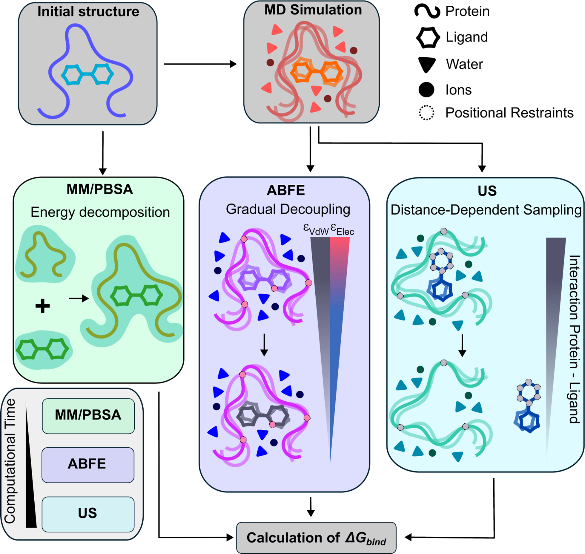

**图1：三种计算方法的工作流程示意图**。展示了MM/PBSA、ABFE和Umbrella Sampling三种方法来估算给定配体在不同蛋白同源物中的结合自由能（$\Delta G_{\text{bind}}$）。MM/PBSA通过代表性构象的能量分解来估算自由能；ABFE通过逐渐解耦配体与其环境的相互作用；US通过蛋白-配体解离路径的函数来量化自由能分布。图中还包含了每种方法的相对计算成本。

三种方法的核心差异在于**如何处理蛋白-配体复合物的构象采样和自由能计算**：

- **MM/PBSA**：基于分子动力学模拟的代表性构象，通过MM/PB（GB）SA方法计算结合自由能，主要包括范德华力、静电能、极性溶剂化和非极性溶剂化贡献
- **ABFE**：通过炼金术路径逐步解耦配体与环境的相互作用来计算绝对结合自由能，**在物理上更严谨，考虑了更完整的构象空间采样**
- **Umbrella Sampling**：通过定义配体解离的反应坐标，在一系列窗口中进行受限模拟，然后使用WHAM方法重构势能分布，**不仅提供结合自由能，还能揭示解离路径的能垒和中间态**

### 方法表现与适用场景

MM/PBSA（Molecular Mechanics/Poisson-Boltzmann Surface Area）是最快速的筛选方法，计算成本仅为ABFE的约1/10、US的约1/50。该方法基于分子动力学模拟获得的代表性构象，通过分子力学能量和连续溶剂化模型来估算结合自由能。

然而，本研究发现**MM/PBSA的预测精度高度依赖于所选择的代表性构象**，这在选择性预测中尤为突出。

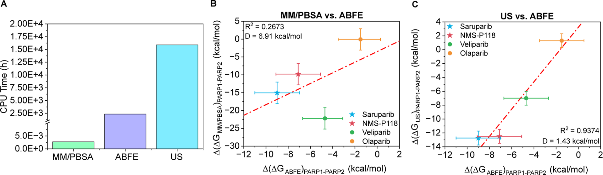

**图2：三种方法的计算成本和选择性预测对比**：
- （A）使用不同计算方法进行结合能预测所需的单CPU核心模拟时间（小时）
- （B）四种抑制剂（saruparib为蓝色星形、NMS-P118为红色星形、veliparib为绿色圆形、olaparib为黄色圆形）在PARP1和PARP2之间的结合自由能差值（Δ(ΔG)PARP1−PARP2）比较
- （C）MM/PBSA与ABFE结果的相关性
- （D）US与ABFE计算的相关性

误差棒表示模拟的标准偏差。PARP1特异性抑制剂以星形绘制，非特异性抑制剂以圆形绘制。红色虚线表示数据的线性回归。
- **构象敏感性**：MM/PBSA对构象选择高度敏感，不同MD模拟时间点提取的构象会导致显著不同的预测结果。当使用平衡后的构象时，MM/PBSA预测与实验的相关性仅为$R^2$ = 0.13，**远低于ABFE和US方法**
- **定性分析价值**：尽管定量预测精度有限，MM/PBSA仍可用于快速比较不同抑制剂的相互作用模式，并辅助识别Ser904、Arg878、Tyr907等可能与选择性相关的关键接触
- **构象选择建议**：研究建议使用多个构象的平均结果来降低构象敏感性，或者通过聚类分析选择最具代表性的构象进行MM/PBSA计算
- **适用性建议**：MM/PBSA最适合用于大规模化合物的初步筛选和相互作用模式的定性分析。在本研究中，当化合物集从4个扩展到8个时，MM/PBSA的预测精度有所提升（$R^2$从0.13提升到0.50），**表明该方法在多样化化合物集上的表现更为稳定**
- **隐式溶剂模型的局限性**：MM/PBSA使用隐式溶剂模型（PB或GB）来处理溶剂效应，**难以准确描述结构化水、氢键网络和溶剂介导相互作用**，这在解释抑制剂选择性差异时尤其重要

### ABFE：平衡精度与效率

ABFE（Absolute Binding Free Energy）方法在计算成本和精度间取得了良好平衡，是本次研究中表现最全面的方法。该方法采用热力学积分（TI）或自由能微扰（FEP）技术，**通过逐渐解耦配体与其环境的相互作用**来计算绝对结合自由能。

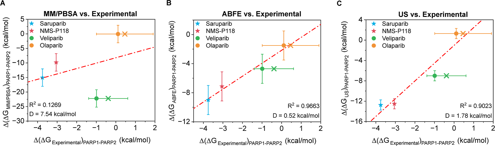

**图3：三种方法预测选择性（Δ(ΔG)PARP1−PARP2）与实验数据的对比**：
- 展示了四种抑制剂（saruparib为蓝色星形、NMS-P118为红色星形、veliparib为绿色圆形、olaparib为黄色圆形）使用不同计算方法的结果
- （A）MM/PBSA与实验结果的相关性
- （B）ABFE与实验结果的相关性
- （C）US与实验结果的相关性

叉号表示从ChEMBL数据库提取的平均IC50值，实心圆表示文献中最常引用的IC50值。误差棒表示模拟的标准偏差，以及根据不同报告的IC50值使用方程10计算的实验不确定性。PARP1特异性抑制剂以星形绘制，非特异性抑制剂以圆形绘制。红色虚线表示数据的线性回归。

ABFE在这篇文章里最重要的价值，不是“更复杂”，而是它在选择性预测上给出了最稳的定量结果：

- **精确的构象采样**：ABFE沿炼金术路径进行显式溶剂采样，能够更充分地考虑配体结合过程中的构象变化和溶剂重组效应。在本次研究中，ABFE与实验数据的相关系数达到$R^2$ = 0.97（4个抑制剂），**展现了极高的预测精度**
- **物理严谨性**：ABFE基于热力学微扰理论，通过显式处理蛋白-配体-溶剂的相互作用，避免了MM/PBSA中的隐式溶剂近似。**对于氢键、π-π堆积等关键相互作用的描述更为准确**
- **统计误差控制**：文中ABFE计算每个体系累计了约75 ns采样时间，并通过bootstrap方法评估统计误差。研究中的误差棒显示，大多数抑制剂的标准偏差仍处于可解释范围内
- **力场验证**：本研究使用了amber99sb-disp力场处理蛋白，OpenFF力场处理配体，这种组合在之前的benchmarks中已展现出优秀的性能。**ABFE结果验证了该力场组合在PARP抑制剂体系中的可靠性**
- **适用性扩展**：当化合物集从4个扩展到8个时，ABFE的预测精度略有下降（$R^2$从0.97降至0.74），但仍显著优于MM/PBSA。**这表明ABFE在多样化化合物集上保持了良好的泛化能力**

### Umbrella Sampling：补上路径信息

Umbrella Sampling（US）方法提供了最高的物理洞察，通过定义配体解离的反应坐标，在一系列窗口中进行受限模拟，然后使用WHAM（Weighted Histogram Analysis Method）方法重构势能分布（PMF），**能够揭示配体解离过程中的能垒和中间态**。

US方法的优势不在于完全压过ABFE，而在于它提供了另一类信息：

- **反应坐标设计**：本研究选择了配体质心到蛋白活性中心的最小距离作为反应坐标，该坐标代表了配体解离过程中位阻最小的路径。所有体系使用统一的反应坐标定义，**确保了结果的可比性**
- **PMF曲线的物理意义**：PMF曲线不仅提供了结合自由能（$\Delta G_{\text{bind}}$），还揭示了配体解离过程中的能垒和中间态，有助于解释不同抑制剂在PARP1和PARP2上的选择性趋势
- **预测精度**：US方法与实验数据的相关系数达到$R^2$ = 0.90（4个抑制剂），略低于ABFE但仍然非常优秀。**更重要的是，US方法提供了ABFE没有直接给出的路径信息**
- **机制解释能力**：与ABFE相比，US沿物理反应坐标给出了更直观的解离自由能景观，因此更适合用来讨论中间态、脱溶剂化和路径依赖的选择性来源
- **计算成本考量**：US方法的计算成本最高，约为ABFE的3-5倍。每个US模拟需要30-50个反应坐标窗口，每个窗口模拟20-50 ns，总模拟时间达到微秒级。因此，**US方法最适合用于关键化合物的验证和机制研究，而不适合大规模筛选**

### 结构基础：什么接触在区分选择性

通过接触模式分析，文章把选择性差异主要归结为几类结构特征：

- **高选择性抑制剂的特异接触**：saruparib 和 NMS-P118 这类高选择性抑制剂虽然共享部分保守接触，但还会形成少数PARP1特异性相互作用，例如 saruparib 对应的 Arg878、Ser904、Tyr907，以及 NMS-P118 对应的 Lys903、Tyr907
- **非选择性抑制剂的共享识别模式**：olaparib、niraparib、talazoparib 和 pamiparib 等抑制剂主要与两种蛋白共有的保守残基形成接触，这种更对称的识别模式与其较弱的亚型选择性一致
- **部分选择性的来源**：rucaparib 这类化合物同时具备共享接触和少量PARP1特异接触，因此更接近“部分选择性”而非高度特异
- **MM/PBSA的结构解释边界**：由于缺少显式溶剂和完整构象采样，MM/PBSA更适合提供相互作用模式的定性线索，而不适合把单个残基贡献解释得过于定量

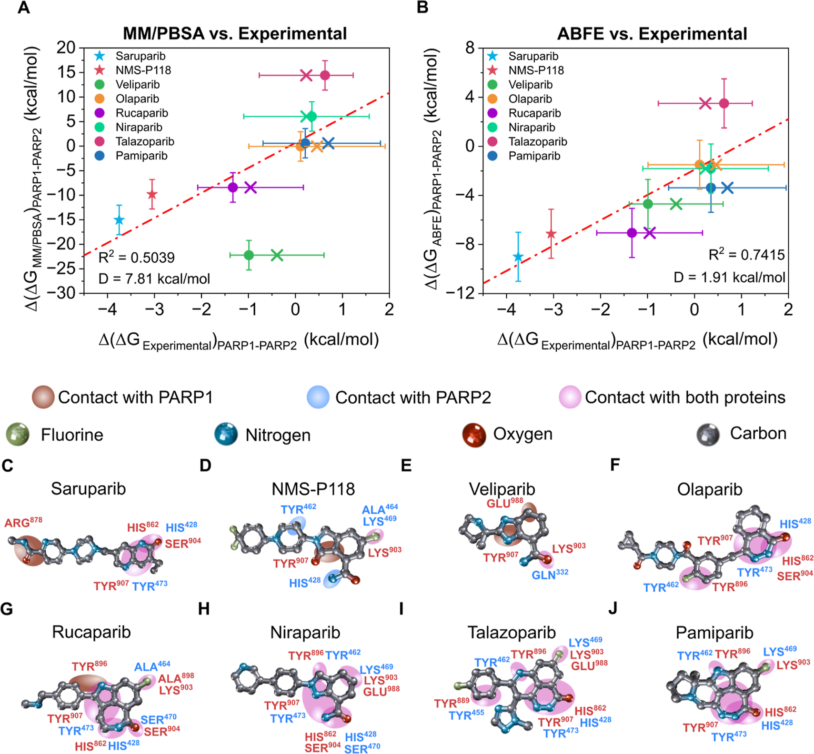

**图4：结合自由能与选择性预测的结构基础**：
- 展示了八种抑制剂（saruparib为蓝色星形、NMS-P118为红色星形、veliparib为绿色圆形、olaparib为黄色圆形、rucaparib为紫色圆形、niraparib为薄荷绿色圆形、talazoparib为栗色圆形、pamiparib为深蓝色圆形）在PARP1和PARP2之间的结合自由能差值
- **（A-B）相关性与选择性预测**：展示了MM/PBSA与实验结果的相关性（左）以及ABFE与实验结果的相关性（右），PARP1特异性抑制剂以星形绘制，非特异性抑制剂以圆形绘制，红色虚线表示数据的线性回归
- **（C-J）接触模式图**：展示了每种抑制剂在PARP1中的2D相互作用模式，不同颜色代表不同的相互作用类型（绿色虚线=氢键，红色阴影=疏水接触，蓝色弧线=π-π堆积），可观察到选择性抑制剂更容易形成PARP1特异接触，而非选择性抑制剂则更多依赖共享残基

顺着这些结果往前推，针对PARP1选择性可以优先考虑几类设计策略：

1. **增强与Ser904的相互作用**：在配体中引入能够与Ser904形成氢键的官能团，如羟基、羰基等
2. **增强PARP1特异接触**：优先利用Arg878、Ser904、Tyr907、Lys903等更能区分PARP1和PARP2的接触位点
3. **减少对共享保守残基的依赖**：避免设计完全依赖His862、Tyr896、Tyr907等保守识别模式的配体，以免削弱亚型选择性
4. **结合高精度方法复核关键化合物**：对接近等能的候选物，优先使用ABFE或US而不是仅依赖MM/PBSA

### 实用工作流建议

把三种方法放在同一个项目里看，更合理的逻辑其实是分层使用，而不是三选一。

#### 性能与成本的综合评估

| 方法 | 单次计算时间 | CPU核心数 | 总CPU小时 | 与实验R² | 典型误差 | 适用阶段 |
| --- | --- | --- | --- | --- | --- | --- |
| MM/PBSA | 2-4小时 | 1-4 | 8-16 | 0.13-0.50 | ±3-5 kcal/mol | 初期筛选 |
| ABFE | 1-2天 | 8-16 | 200-500 | 0.74-0.97 | ±1-2 kcal/mol | 中期优化 |
| US | 5-7天 | 16-32 | 2000-4000 | 0.90 | ±1-2 kcal/mol | 最终验证 |

对应地，**MM/PBSA更适合作为初期筛选工具**，用来快速缩小范围；**ABFE更适合中期优化**，负责给出更可靠的定量排序；**US更适合最后的机制验证**，特别是在你需要解释“为什么选中它”而不只是“它排第几”的时候。

---

## 第二篇：量子硬件加速的自由能微扰计算

### 本文信息（二）
- **标题**：量子硬件上的蛋白-配体自由能微扰计算
- **作者**：Zhen Li, Milana Bazayeva, ..., Danil Kaliakin, Fangchun Liang, Akhil Shajan, Kenneth M. Merz Jr.
- 发表时间：2026年（arXiv预印本，arXiv:2604.09857v1，提交日期：April 10, 2026）
- **引用格式**：Li, Z., et al. (2026). Protein-Ligand Free Energy Perturbation on Quantum Hardware. *arXiv preprint* arXiv:2604.09857

### 摘要

> 自由能微扰（FEP）方法是结构-based药物设计中最重要的工具之一，能够以化学精度（约1 kcal/mol）预测相对结合自由能。然而，传统FEP方法依赖经验力场，可能受到力场参数化不完善的限制，特别是在处理电子结构效应显著的体系（如氢键、电荷转移等）时。本研究首次**在蛋白体系中实现了量子硬件辅助的FEP计算**，将量子计算与经典分子力学相结合，通过**book-ending框架**在热蛋白酶体系中验证了方法的有效性。结果显示，量子硬件增强的LUCJ-SQD-extSQD方法将预测误差从经典MM的6.05 kcal/mol降低至2.54 kcal/mol，**显著提升了结合自由能预测的精度**，为未来在药物发现中应用量子计算开辟了新的技术路径。

### 背景：量子计算在化学中的崛起

量子计算具有处理复杂电子结构问题的天然优势，理论上可以在多项式时间内求解经典计算机难以处理的电子关联问题。近年来，随着量子硬件的快速发展，量子计算在化学领域的应用已从简单的氢分子体系扩展到更复杂的有机分子和金属配合物。

然而，**将量子计算应用于蛋白-配体体系面临巨大挑战**：

1. **体系规模**：蛋白-配体复合物通常包含数千个原子，远超当前量子硬件的处理能力（通常限制在几十个量子比特）
2. **溶剂效应**：水溶剂对结合过程有重要影响，必须在量子计算中显式处理，这进一步增加了体系规模
3. **采样需求**：自由能计算需要对多个构象进行采样，而量子计算目前在单点能量计算上仍不够快速

为解决这些挑战，本研究采用了**混合量子-经典的book-ending框架**，只在关键的端态（配体完全结合或完全解离的状态）使用量子力学校正，而中间的构象采样仍使用高效的经典分子力学方法。这种策略既保留了量子计算的精度优势，又控制了计算成本。

### 核心创新点

这篇工作的创新可以概括成三件事：
- **首次在蛋白体系中集成量子硬件**，把量子计算真正接到蛋白-配体FEP工作流里
- 开发**混合QM/MM接口**，连接AMBER/QUICK与多种量子后端
- 在同一套book-ending框架下比较**RHF、HCI和LUCJ-SQD-extSQD**三种量子校正路线

### 研究体系与方法

研究选择了热蛋白酶（thermolysin）体系作为测试案例，该体系包含两个结构相似的抑制剂（0PJ和0PI），仅相差一个氢键。这两个抑制剂通过磷酰胺（0PJ）或磷酸酯（0PI）基团区分，0PJ的N1原子能与Asn112形成额外氢键，而0PI的N1被OS取代，缺失此氢键。

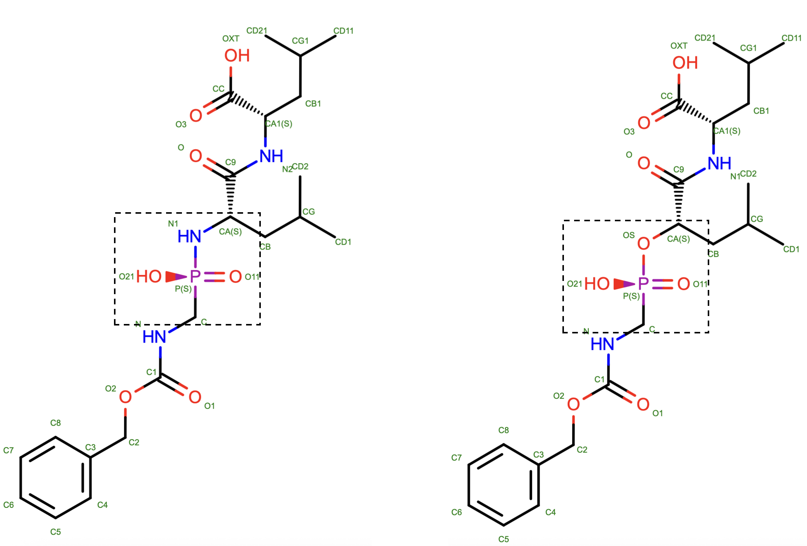

**图1：两个热蛋白酶抑制剂的化学结构**。这两个抑制剂相差一个氢键，虚线框表示QM/MM模拟中的QM区域。0PJ（左）通过N1上的额外氢与热蛋白酶的Asn112形成额外的氢键，而0PI（右）的N1原子被OS原子取代，未观察到该氢键。

体系规模方面，**0PJ和0PI均包含26个电子，分别占据19和18个轨道**（经Cartesian-based AVAS轨道选择）。四个复合物（两个配体×两个环境）分别在6个λ窗口（0.00、0.20、0.40、0.60、0.80、1.00）下进行模拟，每个窗口重复两次。为实现量子硬件校正，**CI stride设为50步**，即每50个MD步进行一次CI计算，总共执行**2400分钟量子硬件时间**（每个LUCJ电路1分钟 × 50步 × 4复合物 × 6窗口 × 2重复）。

方法学核心是**book-ending框架**：

1. **经典MM计算**：使用热力学积分（TI）方法计算相对结合自由能
2. **量子力学校正**：在四个端态（两个配体×两个环境）进行MM→QM/MM的微扰
3. **自由能分析**：使用MBAR方法分析自由能差值，获得量子校正项

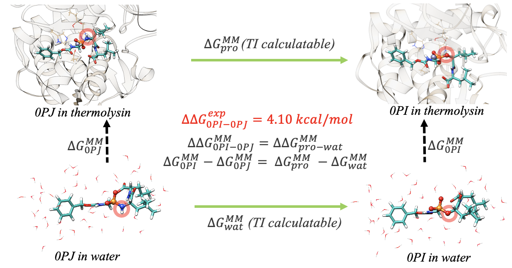

**图2：纯MM热力学循环示意图**。绿色箭头表示FEP可以计算的自由能，黑色虚线箭头表示本文中未计算的部分。使用热力学循环，这两组箭头都可以获得相对结合自由能（见黑色公式）。

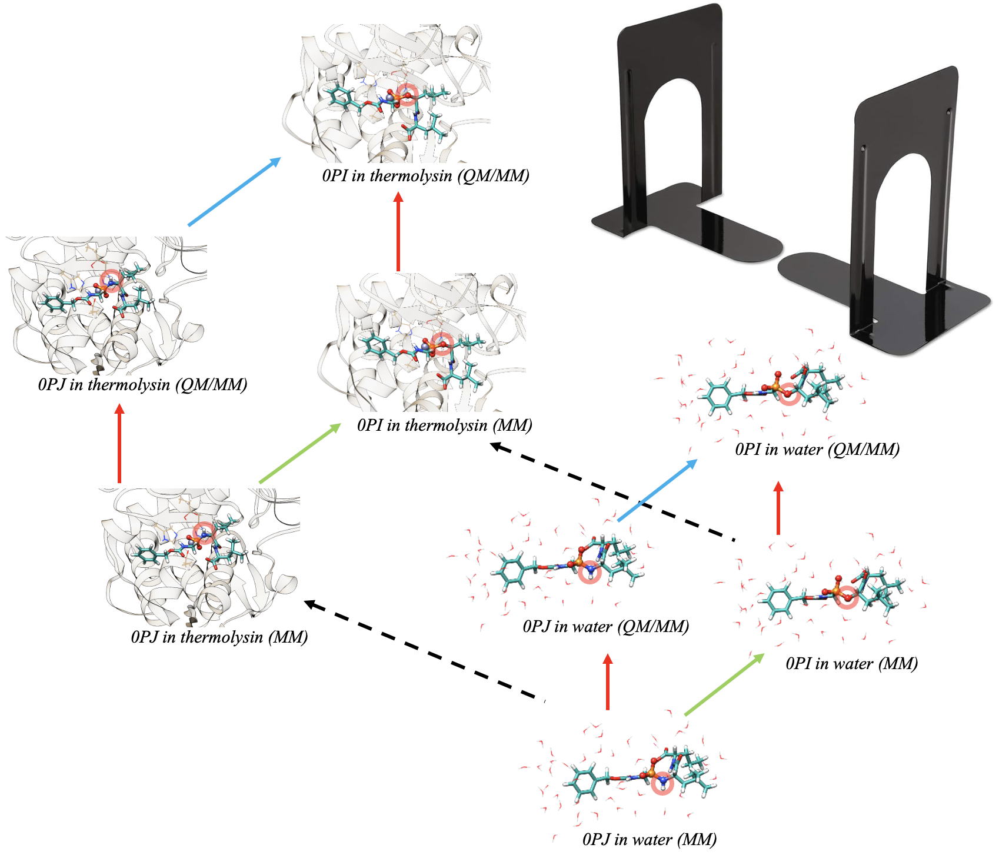

**图3：Book-ending校正应用于经典MM FEP结果的示意图**。相对结合自由能首先使用经典分子力学方法计算，如图2所示。Book-ending框架然后在每个端态逐渐将势能从MM转换为QM/MM（垂直红色箭头）。量子力学贡献可通过三种途径评估：通过QUICK包的RHF计算、通过PySCF的HCI计算，或量子centric的LUCJ-SQD-extSQD方法。然后使用MBAR分析自由能差值，产生量子校正，随后添加到MM计算值（实心蓝色箭头）。

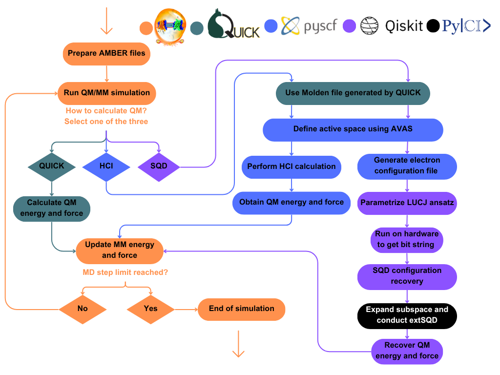

**图4：AMBER/QUICK API工作流程**。左侧为标准QM/MM流程（AMBER管理橙色步骤，QUICK执行绿色步骤），右侧为本研究扩展的接口（中间：HCI通过PySCF/qiskit-addon-dice-solver；右侧：LUCJ-SQD-extSQD从QUICK生成的Molden文件开始，经PySCF和改进的Cartesian-based AVAS进行轨道选择，最后由PyCI辅助extSQD恢复配置）。**用户通过CI stride参数定义量子校正频率**，实现CI-level校正与MD采样的无缝集成。

### 量子计算方法的技术细节

本研究采用了三种不同层次的量子校正方法，从经典的Hartree-Fock到最前沿的量子硬件增强计算：

#### QUICK (RHF) - 经典量子化学基准

QUICK是一个成熟的量子化学软件包，提供基于限制性Hartree-Fock（RHF）方法的快速计算。RHF是波函数理论中最简单的方法，不考虑电子关联效应。在这个体系里，它给出的偏差为-**9.39 kcal/mol**，比经典MM的+**6.05 kcal/mol**还更偏，说明对于氢键差异这类问题，**简单的RHF会出现过校正**。

#### HCI (Heat-bath CI) - 经典高精度基准

Heat-bath Configuration Interaction（HCI）是一种高效的组态相互作用方法，通过热浴采样策略选择最重要的组态配置，从而在保持计算效率的同时达到接近全CI（Full Configuration Interaction）的精度。HCI在经典超级计算机上运行，作为本研究中量子硬件方法的对标基准。

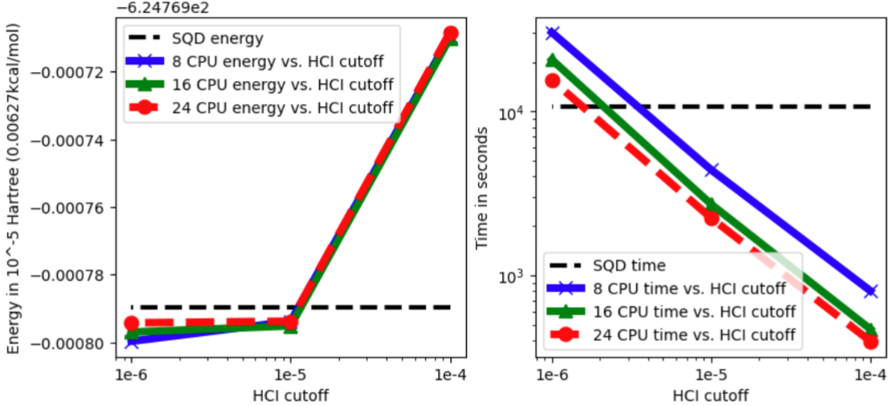

**图5：HCI在不同CPU核数和heat-bath cutoff下的能量和时间性能**。水平虚线表示SQD基准（10批、8 CPU、100 GB内存、10^-5 d-prime cutoff，每步约40分钟）。结果显示，**HCI的计算成本随heat-bath cutoff收紧而显著上升**，特别是多核并行时，这限制了其在实时FEP工作流中的应用。

HCI方法的偏差为6.18 kcal/mol，**与经典MM的6.05 kcal/mol相近，并未带来明显改善**，说明仅靠经典后HF校正并不足以在该案例中显著提升预测质量。更重要的是，HCI在tight cutoff下的**计算时间远超量子硬件方法**，这凸显了开发量子加速路线的必要性。

#### LUCJ-SQD-extSQD - 量子硬件增强的创新方法

这是本研究的核心创新，结合了三项前沿技术：

1. **LUCJ (Low-Unitarity Coupled Jordan-Wigner)**：一种改进的Jordan-Wigner变换，降低了量子比特操作（量子门）的数目，从而减少了量子电路深度，提高了在当前嘈杂中等规模量子（NISQ）设备上的执行效率
2. **SQD (Sample-based Quantum Diagonalization)**：基于样本的量子对角化方法，通过在量子硬件上制备和测量量子态，然后在经典计算机上进行对角化，从而降低了量子电路的复杂度
3. **extSQD (extended SQD)**：扩展的SQD方法，通过迭代优化和密度矩阵嵌入理论（DMET）的结合，进一步提高了精度和效率

LUCJ-SQD-extSQD方法在IBM量子硬件上运行，结果显示偏差仅为2.54 kcal/mol，显著优于其他所有方法。这一成就标志着量子硬件首次在真实的蛋白-配体体系中展现出实用价值。

### 结果：哪种校正真正有用

研究对热蛋白酶体系中两个抑制剂（0PJ和0PI）的相对结合自由能进行了系统性比较，结论非常直接：**经典MM有明显偏差（+6.05 kcal/mol），RHF过校正（-9.39 kcal/mol），HCI与MM相近（+6.18 kcal/mol），而LUCJ-SQD-extSQD把偏差降到了2.54 kcal/mol**。也就是说，在这个案例里，真正带来可见改进的不是"任意更高阶QM方法"，而是**接入量子硬件后的CI类校正路线**。

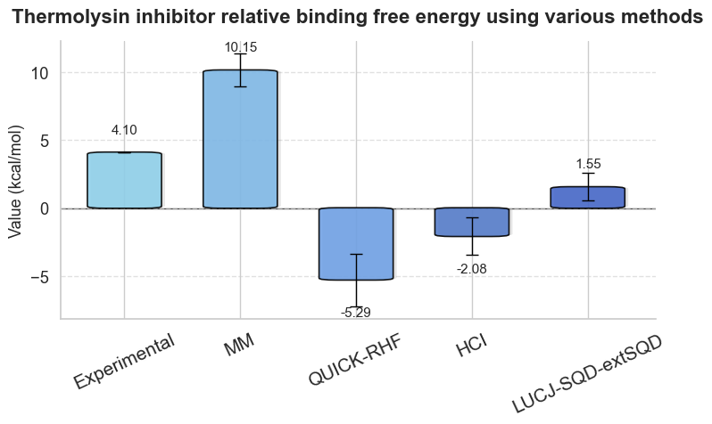

**图6：不同方法计算的相对结合自由能与实验值的对比**（将0PJ配体替换为0PI，氢键损失）。从左到右：实验值、经典MM预测、QUICK (RHF)校正、HCI校正、LUCJ-SQD-extSQD校正。误差棒表示统计不确定性。**量子硬件增强的LUCJ-SQD-extSQD在保持合理计算成本的同时，显著提升了预测精度**。

### 方法学意义

这项研究真正留下来的方法学价值有两点：
- 一是证明量子硬件可以在蛋白-配体FEP中提供有意义的校正；
- 二是把**CI-level quantum corrections** 真正嵌进了可复用的AMBER/QUICK-API接口里，使 book-ending 不再只依赖 RHF 或 DFT。

后续最直接的改进方向，仍然是**增加SQD采样数**、**优化LUCJ迭代方案**，以及把方法推广到更复杂的药物发现体系。

---

## 第三篇：量子计算在生物分子自由能中的应用框架

### 本文信息（三）

- **标题**：如何使用量子计算机进行生物分子自由能计算
- **作者**：Jakob Günther, Thomas Weymuth, ..., Kresten Lindorff-Larsen, Gemma Solomon, Markus Reiher, Matthias Christandl
- 发表时间：2026年（Journal of Chemical Theory and Computation, DOI: 10.1021/acs.jctc.5c02088）
- **开源代码**：https://github.com/Quantum-for-Life/pipeline
- **引用格式**：Günther, J., et al. (2026). How to Use Quantum Computers for Biomolecular Free Energies. *Journal of Chemical Theory and Computation*. https://doi.org/10.1021/acs.jctc.5c02088

### 摘要

> 自由能计算是**物理-based生化过程分析的核心工具**，使我们能够**量化分子识别机制**，从细胞信号传递到药物治疗疾病的各种生物现象。定量和预测性的自由能计算需要**准确捕获分子间复杂电子相互作用**的计算模型，以及**分子运动对其水溶液环境的熵贡献**。然而，**准确的量子力学能量和力只能获得小原子模型**，而不能获得大型生物大分子。本文展示了如何使用**机器学习将子结构获得的高精度量子力学数据一致地链接到生物分子复合物的整体势能**。我们使用**双重量子嵌入策略**，其中最内层的量子核心以**非常高的精度处理**。我们通过将**传统量子化学方法**应用于钌基抗癌药物与其蛋白靶点的分子识别，证明了该方法的可行性。由于这些方法随系统尺寸的扩展性不佳，我们**分析了量子计算机提供影响所得自由能的高精度能量的要求**。一旦满足这些要求，我们的计算管线**FreeQuantum**就能够**有效利用量子计算的能量**，从而实现**量子计算增强的生化过程建模**。

### 背景：生物分子量子模拟的挑战

量子计算在处理复杂电子结构问题方面具有天然优势，但将其应用于生物分子体系面临**巨大挑战**：

- **系统复杂性**：生物大分子包含数千到数百万个原子，远超当前量子计算机的处理能力
- **电子结构难度**：开放壳层体系（如含过渡金属的药物）需要处理多参考态和强关联效应
- **采样需求**：自由能计算需要对大量构象进行采样，每个构象都可能需要高精度量子计算
- **精度要求**：化学精度（约1 kJ/mol）对量子计算提出了极高的准确性要求

本文提出了**生物分子量子模拟四象限**框架，根据电子结构问题的复杂性和体系动力学/熵贡献的重要性将问题分类。钌基药物-蛋白复合物位于左上角（高电子结构复杂性，高熵贡献），是最具挑战性的体系。

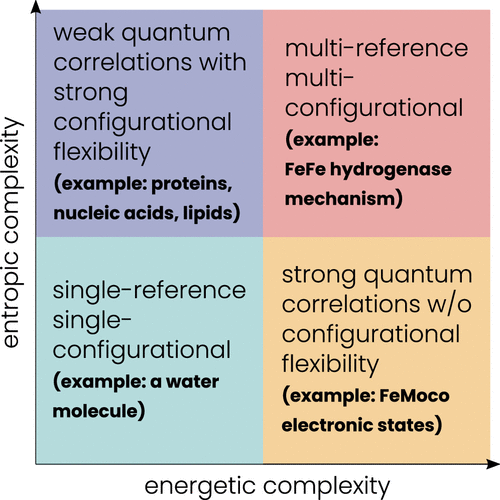

**图1：生物分子量子模拟的四象限框架**。横轴表示电子结构问题的复杂性（从低到高），纵轴表示采样/熵贡献的重要性（从低到高）。四个象限分别代表四类典型问题：右下（低电子复杂性、高熵重要性）如水溶剂化自由能；右上（高电子复杂性、高熵重要性）如钌基药物-蛋白复合物；左下（低电子复杂性、低熵重要性）如理想气体模型；左上（高电子复杂性、低熵重要性）如单个有机分子的电离能。**钌基抗癌药物NAMI-A与蛋白靶点的复合物位于右上象限，是同时面临高电子结构复杂性和高采样需求的最具挑战性体系**。

### FreeQuantum管线详解

FreeQuantum是一个**完全自动化的计算管线**，将经典分子模拟、量子力学计算和机器学习无缝集成，分为三个层次逐步提升精度：

#### 第一层：经典FEP + MM力场

- 使用经典分子力学力场进行分子动力学模拟，通过炼金术自由能微扰（FEP）计算初始结合自由能估计，识别需要量子力学处理的关键区域（量子区域）

#### 第二层：QM/MM嵌入 + 机器学习（ML1）

- 对量子区域进行QM/MM计算，获得高精度能量和力；使用**主动学习**训练第一个机器学习势能（ML1），通过非平衡切换计算优化ML1模型，得到MM + ML1校正后的自由能估计

#### 第三层：QM/QM/MM嵌入 + 迁移学习（ML2）

- 在量子区域内识别最重要的”量子核心”（如金属活性中心），对量子核心进行极高精度的量子化学计算（或未来的量子计算），通过**迁移学习**将ML1精炼为ML2，使用ML2进行最终采样，得到最高精度的自由能估计

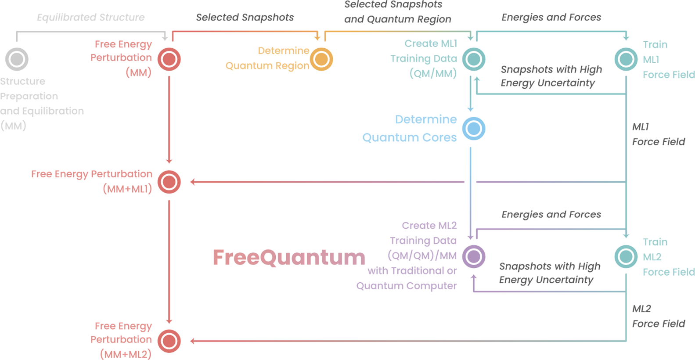

**图2：FreeQuantum工作流程示意图**。灰色表示结构准备和平衡，红色表示自由能微扰计算，橙色表示QM/MM量子区域定义，青色表示机器学习训练，蓝色表示量子核心定义，紫色表示高精度量子计算（传统或量子计算机）。整个流程完全自动化，仅需初始结构准备。

### 关键技术模块

#### 1. Huzinaga投影嵌入

- 通过投影算符将量子核心与周围环境解耦，**允许对量子核心进行精确对角化处理强关联**，使用NEVPT2等方法处理动态关联

#### 2. Bootstrap嵌入

- 将量子核心分割为多个重叠的子系统，每个子系统独立计算后一致地嵌入整体，适合处理不同的电子结构问题

#### 3. 自适应量子核心选择

- 根据体系复杂性和量子计算资源自动调整量子核心大小，使用autoCAS算法自动选择活性空间，灵活适应不同的量子计算引擎

### 实际应用：钌基抗癌药物NKP1339

研究团队将FreeQuantum应用于**钌基抗癌药物NKP1339与分子伴侣蛋白BiP**的结合：

**体系特点**：该体系含钌过渡金属，为开放壳层双重态，经典力场难以准确描述金属配位环境，位于生物分子量子模拟四象限的左上角（最难）。

**计算结果**：纯MM得到$\Delta G_{\text{binding}} = -19.1 \pm 1.5$ kJ/mol，MM + ML1得到$\Delta G_{\text{binding}} = -17.0 \pm 2.6$ kJ/mol，而最高层级的QM/QM/MM（NEVPT2）给出$\Delta G_{\text{binding}} = -11.3 \pm 2.9$ kJ/mol。对钌体系而言，这里更合适的表述是**给出了更高层级的一性原理预测值**，而不是宣称“达到化学精度”，因为该体系在文中并没有对应的实验结合自由能作直接基准。

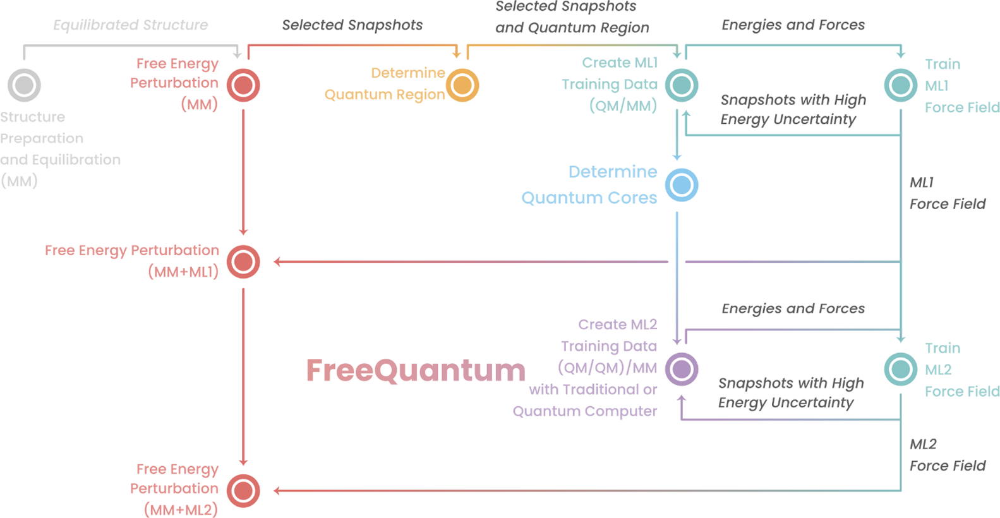

**图3：钌基药物-蛋白复合物结构与自由能结果**。（a）BiP蛋白（host）与钌配合物NKP1339（guest，蓝色圆圈）的复合物结构。Lewis结构中的蓝色六边形表示QM-in-QM嵌入的量子核心。（b）不同精度方法的结合自由能比较，包括钌体系（本文）和MCL-1蛋白体系（参考文献）。误差棒表示统计不确定性。

### 量子计算资源估算

作者对钌体系进行了**详细的量子计算资源估算**：

- **资源需求**：文中给出了两类代表性估算。对于30个空间轨道的Trotter方案，至少需要60个量子比特、门误差低于$10^{-7}$，且平均门时间低于$10^{-7}$ s，才能把单点能量计算压到约20分钟；而对更大的60个空间轨道体系，作者认为qubitization更合适，其量级约为**1000个逻辑量子比特**、门误差低于$10^{-10}$。整个FreeQuantum流程大约需要**4000个高精度能量点**用于训练和校正
- **量子算法选择**：Trotter分解适合中等规模的强关联体系，Qubitization对大规模问题提供更好的渐近复杂度，随机化方法可进一步降低资源需求
- **关键发现**：Hartree-Fock态（易于在量子计算机上准备）已提供合理的初始参考；量子计算资源主要由哈密顿量模拟决定，与问题规模相关；**主动学习**可以显著减少所需的高精度量子计算数据点

### 为什么这套框架值得关注

FreeQuantum最重要的优点，是它把**FEP、QM/MM、机器学习和未来量子计算接口**放进了同一条自动化管线里。它的现实限制也同样明确：当前硬件还远达不到文中估算的规模和精度门槛，体系一旦比钌配合物更复杂，训练、采样和验证成本都会继续上升。

如果量子硬件继续进步，这条路线最先受益的，仍然会是**过渡金属药物设计**、**酶催化机制**和其他经典力场最吃力的强关联体系。

---

## 综合评述与未来方向

### 主线

三项研究放在一起看，主线其实很清楚：第一篇解决的是**经典方法怎么分工**，第二篇证明的是**量子硬件能否在真实蛋白体系里带来额外校正**，第三篇搭建的是**把这些层级串起来的自动化框架**。

### 局限性

三篇研究各自的局限性同样值得关注。**第一篇**的测试集规模仍然有限（4-8个抑制剂），能否推广到其他同源蛋白家族（如激酶、蛋白酶）仍是未知数。**第二篇**的量子硬件增强仅针对热蛋白酶这一个二肽酶体系，真实药物发现通常涉及更大、更复杂的体系，LUCJ-SQD-extSQD方法的偏差仍有2.54 kcal/mol，距离化学精度（约1 kcal/mol）仍有差距。**第三篇**的量子计算资源估算相当乐观（需要约1000个逻辑量子比特和低于$10^{-10}$的门误差），而当前最先进的量子硬件（IBM超导量子比特门误差约$5\times10^{-3}$，离子平台约$3\times10^{-4}$）与之相差数个数量级，量子计算部分目前仍是”概念展示”。

### 未来方向

结合三篇研究，可以预见以下方向将成为热点：

- **扩展验证集规模**：第一篇和第二篇的体系规模都较小，未来需要在更大、更多样化的蛋白-配体体系上验证方法的可迁移性
- **推进量子硬件成熟度**：当前量子硬件需要数千逻辑量子比特和极低的门误差才能真正参与竞争，量子硬件的进步将直接决定这一方向的成败
- **发展混合架构**：三篇研究都暗示了同一条主线，不是用量子完全替代经典，而是让量子在关键环节增强经典，第三篇的迁移学习框架为这种混合提供了范式
- **探索Metal-Redox体系**：第三篇专门讨论了钌基抗癌药物这类含过渡金属的体系，这是经典力场的公认短板
