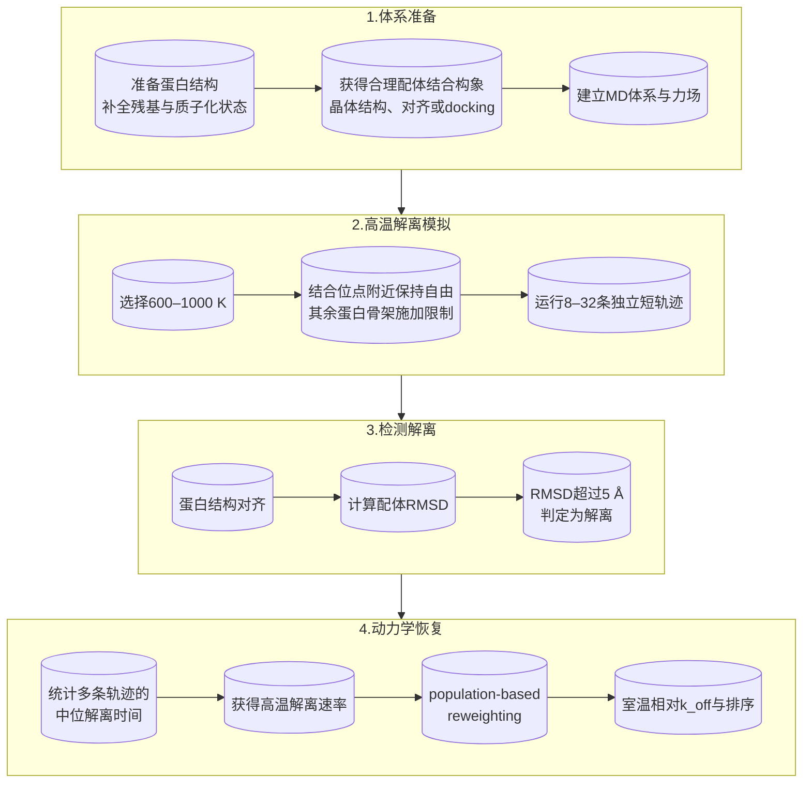
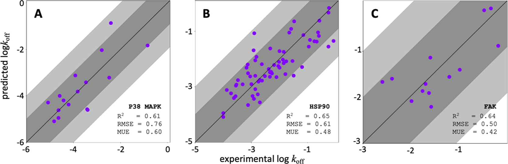
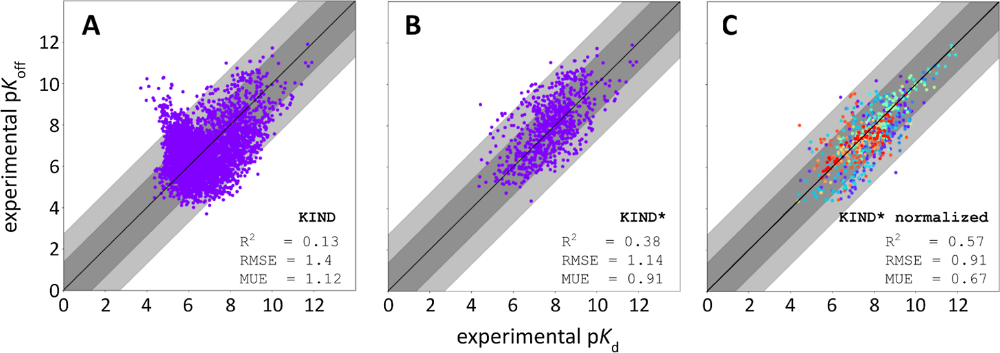
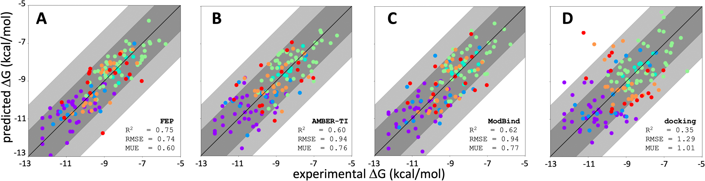
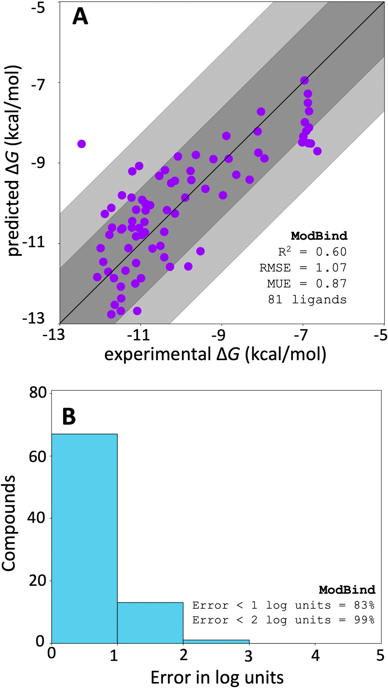
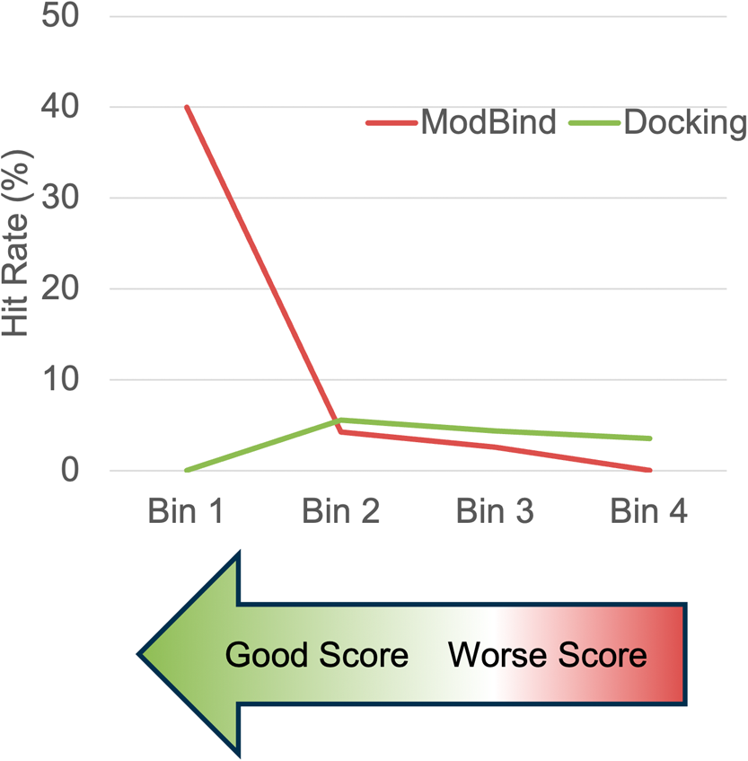

# ModBind——用高温解离轨迹快速预测配体解离速率

## 本文信息

- **标题**：ModBind，一种快速的基于模拟的配体结合与解离速率预测方法
- **作者**：William Sinko, Blake Mertz, Takafumi Shimizu, Taisuke Takahashi, Yoh Terada, S. Roy Kimura
- **发表期刊**：Journal of Chemical Information and Modeling
- **发表时间**：2024年12月16日
- **DOI**：https://doi.org/10.1021/acs.jcim.4c01805
- **单位**：Alivexis Inc.，美国与日本
- **引用格式**：Sinko, W.; Mertz, B.; Shimizu, T.; Takahashi, T.; Terada, Y.; Kimura, S. R. ModBind, a Rapid Simulation-Based Predictor of Ligand Binding and Off-Rates. *J. Chem. Inf. Model.* 2025, *65*, 265–274. https://doi.org/10.1021/acs.jcim.4c01805
- **补充数据**：论文Supporting Information提供完整验证体系的蛋白与小分子三维结构。

## 摘要

> 在理性药物设计中，结合自由能和结合半衰期共同决定药物效果。本文开发的ModBind是一种基于MD模拟的$k_\mathrm{off}$预测方法：用**600–1000 K的高温短轨迹**主动加速配体解离，再通过population-based reweighting恢复室温下的相对解离速率。它的预测精度与现有自由能方法接近，计算速度却快约**两个数量级**；与主要用于同系化合物优化的相对自由能方法不同，ModBind不要求待比较配体结构相似，可直接用于**不同化学骨架的虚拟筛选**。

### 核心结论

- ModBind用**600–1000 K高温MD主动加速配体解离**，把原本可能需要毫秒至小时才能发生的事件压缩到ns量级。
- 单条模拟通常只需要**1–5 ns或更短**，本文实际使用**8–32条重复轨迹**，而不是几十到上百ns的长轨迹。
- 高温产生的解离时间不能直接当作室温$k_\mathrm{off}$，需要通过**population-based reweighting**恢复室温尺度上的相对动力学。
- 在p38 MAPK、HSP90和FAK共96个配体中，预测与实验$k_\mathrm{off}$的$R^2$约为0.61–0.65。
- 在特定条件下，$k_\mathrm{off}$与$K_d$具有较强相关性，因此ModBind还可以用于**近似排序结合强度**，但这不是严格的结合自由能计算。
- 每个配体的累计模拟量最低可降至约4 ns，因此特别适合用于docking之后的大规模二次筛选。

## 背景

结合自由能长期主导先导发现与优化，但只优化自由能并不够：药物浓度在体内随时间下降后，**药效持续时间由结合半衰期决定**，更长的驻留时间（residence time）往往同时带来更好的选择性和体内药效。相比之下，$k_\mathrm{on}$和$k_\mathrm{off}$的预测在计算化学领域受到的关注少得多，已有方法的验证体系有限，也少有展示出对工业药物发现实际影响的案例。

ModBind要回答的，就是如何在合理的计算成本下把解离动力学纳入筛选流程。FEP、热力学积分（TI）等方法已经可以较可靠地预测同系小分子的相对结合自由能，但它们回答的主要是热力学问题：平衡态下$\Delta G = RT\ln K_d$。药物从蛋白上**多久才会脱落**则属于动力学问题，由$K_d=k_\mathrm{off}/k_\mathrm{on}$描述。两个具有相同$K_d$的分子完全可能具有不同的$k_\mathrm{on}$和$k_\mathrm{off}$，因此体内驻留时间也会明显不同。

已有的$\tau$-RAMD、steered MD、targeted MD、LiGaMD、metadynamics和milestoning都可以研究解离过程，但各有瓶颈：$\tau$-RAMD对配体施加随机力，steered MD要沿指定矢量施加恒力，targeted MD要预先给定目标态，metadynamics和milestoning依赖collective variable的定义，而且这些方法的计算成本或验证范围都限制了大规模应用。

ModBind改从温度入手：**把体系升到高温，让配体自己跑出去**。

### 关键科学问题

如何在不依赖参照配体、不需要定义collective variable的前提下，以合理的计算成本预测不同化学骨架配体的$k_\mathrm{off}$？

### 创新点

- **用温度缩放代替增强采样**：不需要定义collective variable、milestone或施加pulling force，只需升温让配体自行解离
- **不依赖参照配体（RBFE）**：相对结合自由能需做A→B的alchemical transformation，而ModBind每个配体独立模拟
- **从population scaling恢复解离速率**：利用$P(\mathbf r)=[P^*(\mathbf r)]^{1/\lambda}$关系和Arrhenius-like变换恢复室温相对动力学，避免了逐帧Boltzmann weight带来的势能涨落噪声
- **计算量比现有方法低两个数量级**：单条轨迹1–5 ns，8–32条replica，累计可低至4 ns/ligand

## 研究内容：ModBind怎么做？

### 1. 建立蛋白—配体复合物

蛋白结构通过Schrödinger Protein Preparation Workflow处理，包括缺失残基修复、互变异构体和$\mathrm{p}K_\mathrm{a}$状态确定，以及restrained minimization。如果已有已知结合模式，则采用三维结构对齐或restrained docking；没有已知配体结构时，则在实验确定的binding site中使用Glide或AutoDock Vina进行docking。小分子参数通过OpenMM和`openmmforcefields`生成，采用GAFF 2.1；蛋白则使用`openmmforcefields`自带的Amber蛋白力场（ff14SB），与GAFF 2.1配套。

### 2. 用高温把配体的解离加速

生产模拟使用OpenMM，在NVT系综下进行：

| 参数 | 本文设置 |
| --- | --- |
| 温度 | 600–1000 K |
| thermostat | Langevin |
| 时间步长 | 2 fs |
| 单条轨迹 | 通常1–5 ns或更短 |
| 重复数 | 最多32条，实际测试8–32条 |
| 蛋白限制 | binding site周围6 Å以内不限制，其余backbone限制 |
| 默认限制尺度 | $\sigma=3.0$ Å |

温度不是固定使用900 K或1000 K。本文先针对已知抑制剂做**temperature scan**，找到一个既能在几ns内产生足够解离事件，又能保留不同配体解离速度差异的温度。例如：

| 体系 | 温度 | 单条轨迹时长 |
| --- | ---: | ---: |
| p38 MAPK | 1000 K | 约2 ns |
| HSP90 | 900 K | 约1 ns |
| 结合强度benchmark体系 | 按体系调整 | ≤4 ns |

温度是ModBind需要反复调整的参数。与Mollica等人2015年的scaled MD工作（至少20条replica，单条解离时间可达几十ns）相比，ModBind把单条轨迹和累计计算量进一步压缩：HSP90体系平均每个配体只需约13 ns总模拟量。

### 3. 怎么定义“配体已经跑掉”？

每条轨迹按蛋白对齐到初始结构，然后计算配体相对于初始pose的RMSD，以$\mathrm{RMSD}>5$ Å作为bound到unbound的判据。随后统计同一配体所有重复轨迹的**中位解离时间**，由此得到高温条件下的raw unbinding rate。这里选择中位数而不是单条轨迹，是因为解离本身属于随机事件，同一配体不同replica可能出现明显不同的escape time。

### 4. 高温结果怎么重加权回300 K？

ModBind继承了Sinko等人在2013年提出的**population-based reweighting of scaled MD**。理解这一步只需要三个概念：**Boltzmann分布、scaled potential的数学等价性、Arrhenius关系**。

#### 第一步：Boltzmann分布与scaled potential

在温度为$T$的平衡体系中，某个构象$\mathbf r$出现的概率由Boltzmann分布$P(\mathbf r)\propto e^{-V(\mathbf r)/k_\mathrm{B}T}$给出。

现在考虑两种操作。操作A：把温度从$T_0$提高到$T^* = T_0/\lambda$。操作B：保持温度$T_0$不变，但把势能面整体缩小为$\lambda V(\mathbf r)$，其中$0 < \lambda < 1$。

操作A的Boltzmann因子为$e^{-V/k_\mathrm{B}T^*} = e^{-\lambda V/k_\mathrm{B}T_0}$。操作B的Boltzmann因子为$e^{-\lambda V/k_\mathrm{B}T_0}$。**两者完全相同**。

> **直觉理解**：升温让热涨落变大，分子更容易跨越能垒；缩小势能面让能垒变矮，效果一样。数学上，把$T$增大三倍，和把$V$缩小到三分之一，$V/T$的比值不变，所以Boltzmann权重不变。

因此在$T^*$温度下采样得到的构象分布满足$P^*(\mathbf r) \propto e^{-\lambda V(\mathbf r)/k_\mathrm{B}T_0}$，而目标温度$T_0$下的真实分布是$P(\mathbf r) \propto e^{-V(\mathbf r)/k_\mathrm{B}T_0}$，两者只差一个$\lambda$次方，即$P(\mathbf r)=[P^*(\mathbf r)]^{1/\lambda}$。

这就是**population-based reweighting**：直接从采样得到的population分布出发，取$1/\lambda$次方就能恢复目标温度下的相对概率分布。

它和常见的energy-based reweighting（对每一帧用$e^{-\Delta E/k_BT}$加权）不同：**权重来自构象population本身**，而不是每帧瞬时势能的指数权重。由于不需要对每帧势能求指数，避免了大体系中势能剧烈涨落带来的数值噪声。

#### 第二步：温度与$\lambda$的对应

如果目标温度是$T_0$，高温模拟温度是$T^*$，那么缩放因子就是$\lambda = T_0/T^*$。例如从300 K提高到900 K，$\lambda = 1/3$，等价于把势能面缩小到原来的三分之一。能垒变矮，原本可能需要毫秒级才能跨越的解离能垒，现在在ns尺度就能观察到。

#### 第三步：从population scaling到$k_\mathrm{off}$

配体解离是一个越过自由能垒的速率过程，按Arrhenius关系有$k_\mathrm{off} \propto e^{-\Delta G^\ddagger / k_\mathrm{B}T}$，其中$\Delta G^\ddagger$是解离的过渡态能垒。

对两个配体1和2，室温$T_0$下的速率比是$e^{-(\Delta G_1^\ddagger - \Delta G_2^\ddagger)/k_\mathrm{B}T_0}$，高温$T^*$下同样的能垒差对应的比值则是$e^{-\lambda(\Delta G_1^\ddagger - \Delta G_2^\ddagger)/k_\mathrm{B}T_0}$，指数上多了一个$\lambda$。两者一对比就得到：

$$
\dfrac{k_{\mathrm{off},1}}{k_{\mathrm{off},2}} = \left(\dfrac{k_{\mathrm{off},1,\lambda}}{k_{\mathrm{off},2,\lambda}}\right)^{1/\lambda}
$$

其中$k_{\mathrm{off},\lambda}$是高温下测得的解离速率，$k_{\mathrm{off}}$是室温下的解离速率。

比如900 K对应$\lambda=1/3$，高温下两个配体的解离速率比要取三次方才能映射回300 K的相对差异。这个指数放大效应意味着，高温下看似很小的解离速率差异，映射回室温后会**变得非常显著**。

流程上，先对每个配体跑多条重复解离轨迹，统计**中位解离时间**得到高温解离速率，再用温度缩放恢复室温的相对解离速率。整个过程只用到解离能垒之间的比例关系，不需要逐帧的势能权重。

## 预测效果怎么样？

在第一组严格使用实验$k_\mathrm{off}$验证的数据中，本文测试了p38 MAPK（12个配体）、HSP90（70个配体）和FAK（14个配体），共96个配体，$R^2$为0.61–0.65。ModBind的长处是**把快解离和慢解离的配体区分开**，排序和数量级预测都比较可靠。

**图1：ModBind预测的解离速率与实验值的比较**

| 体系 | 配体数 | $R^2$ | RMSE | MUE |
| --- | ---: | ---: | ---: | ---: |
| p38 MAPK | 12 | 0.61 | 0.76 | 0.60 |
| HSP90 | 70 | 0.65 | 0.61 | 0.48 |
| FAK | 14 | 0.64 | 0.50 | 0.42 |

RMSE与MUE的单位为$\log k_\mathrm{off}$。预测值经归一化后与实验直接比较；深灰色区域为1个log量级误差带，浅灰色区域为2个log量级误差带；p38 MAPK的$k_\mathrm{off}$跨越约5个数量级。

### 能不能顺便预测结合强度？

$k_\mathrm{off}$并不能单独决定结合强度。由$K_d=k_\mathrm{off}/k_\mathrm{on}$，$k_\mathrm{off}$与$K_d$正向相关、$k_\mathrm{on}$与$K_d$反向相关，但只有在同一组化合物的$k_\mathrm{on}$变化不大时，$k_\mathrm{off}$才会与$K_d$近似成比例。

ModBind在Schuetz等人的KIND数据集上做了检验，而这项原研究的结论恰恰是反面的：$k_\mathrm{off}$与$K_d$并不相关，$R^2$只有0.13。做两步清理后，相关性明显改善：

| 数据集 | 处理 | 规模 | $R^2$ |
| --- | --- | --- | ---: |
| Schuetz 原始 KIND | 直接比较 | 3812 配体 / 78 靶标 | 0.13 |
| KIND\* | 筛除同一激酶中混用 type I 与 type II 抑制剂，以及靠过渡态调控改变动力学的体系（如 InhA） | — | 0.38 |
| KIND\*（按靶标归一化） | 再按靶标对齐 $k_\mathrm{off}$ 与 $K_d$ 的范围（38 个只有单点数据的靶标无法归一化，去掉） | 762 配体 / 29 靶标 | 0.57 |

改善的物理含义是：当一组成员结合模式相近、蛋白也不发生大的构象重排时，$k_\mathrm{on}$近似恒定，$k_\mathrm{off}$就能代表$K_d$。KIND\*里同时包含同系与非同系系列，说明这个规律并不局限于同系化合物，但整体仍属经验观察。

> 小编锐评：$k_\mathrm{on}$的假设直观上让人很难相信，我没调研过，搞这个归一化可能还是挺抽象的，感觉实用价值就真的有限了。。要做$k_\mathrm{off}$就好好做啊。。

**图2：解离速率与亲和力的相关性**

- 三个面板横轴均为实验$\mathrm{p}K_d$，纵轴均为实验$\mathrm{p}K_\mathrm{off}$，数据改编自Schuetz et al.
- （A）原始KIND数据集，（B）筛除两类体系后的KIND\*，（C）KIND\*按靶标归一化
- 论文原图注把（C）描述为$\log k_\mathrm{on}$，但图中纵轴实际是$\mathrm{p}K_\mathrm{off}$，这里按图更正

基于这个经验相关性，本文进一步测试ModBind能否直接预测结合强度。做法是把ModBind的$k_\mathrm{off}$分数**按靶标归一化到自由能尺度**，再与实验$\Delta G$比较；基准是Wang et al.的FEP测试集。本文选了其中六个体系，排除了对绝对方法特别困难的PTP1B（loop重排与较高的蛋白构象重排能）和BACE（结合时关键残基滴定）：

| 方法 | $R^2$ | RMSE（kcal/mol） | MUE（kcal/mol） |
| --- | ---: | ---: | ---: |
| FEP | 0.75 | 0.74 | 0.60 |
| AMBER-TI | 0.60 | 0.94 | 0.76 |
| ModBind | 0.62 | 0.94 | 0.77 |
| Docking | 0.35 | 1.29 | 1.01 |

**图3：ModBind预测结合自由能与实验值的比较**

- （A）FEP，（B）AMBER-TI，（C）ModBind，（D）docking
- 六个靶标：TYK2（蓝）、thrombin（青）、MCL1（黄绿）、JNK1（橙）、CDK2（红）、p38（紫），实验数据来自Wang et al., JACS 2015
- 各方法预测值均经归一化后与实验比较，归一化不影响配体排序

### “absolute predictor”具体指什么？

ModBind常被称为absolute $k_\mathrm{off}$ predictor，因为它不像相对结合自由能（RBFE）那样必须指定结构相似的参照配体，也不需要做配体A到配体B的alchemical transformation。只要拿到蛋白结构和配体结合pose，单个配体就能独立跑。

但这里的“absolute”指的是**不依赖参照配体**，并不意味着预测值天然就落在实验标度上。图1到图3里的预测值之所以能和实验直接比较，靠的是一次**两步归一化**（细节见Supporting Information）：先把预测值与实验值的均值对齐，再把两者的范围对齐。这一步需要已知部分或全部配体的实验自由能，也是理解absolute potency的前提。它只影响绝对误差的估计，**不影响配体排序，也不影响相关性**，所以文中FEP、AMBER-TI、ModBind、docking都用同一套流程处理。

### 内部项目验证：前瞻性预测

本文还用Alivexis内部一个晚期先导优化项目检验ModBind能否指导合成决策，做法分两步：

- **回顾性验证**：从项目里挑36个活性跨度大、R基团多样的化合物跑ModBind，确认预测与实验吻合；
- **前瞻性预测**：再用ModBind对数百个候选化合物打分，据此决定要合成哪些分子，目前已合成45个并完成生化测试。

36个回顾加45个前瞻共81个化合物，结果如下：

- 约**83**%的预测误差在1个log单位以内，99%在2个log单位以内
- 预测结合力强于10 nM的化合物中，**76**%在实验中得到证实

这一精度与最好的自由能方法处于同一量级。不过这些化合物本身就是按ModBind预测结果挑选的，存在**系统性过预测偏差**，实际应用中误差分布会更均匀。

**图5：ModBind在内部项目中的回顾性与前瞻性预测**

- （A）81个化合物的预测$\Delta G$与实验$\Delta G$：$R^2$=0.60，RMSE=1.07 kcal/mol，MUE=0.87 kcal/mol；深灰、浅灰区域分别为1与2个log量级误差带
- （B）预测误差分布：83%的误差小于1个log单位，99%小于2个log单位

### 虚拟筛选实战：重排docking前100名

DUD-E（Directory of Useful Decoys Enhanced）基准数据集提供了贴近真实筛选的测试场景，本文选了p38 MAPK和MET两个激酶体系。流程是：先用AutoDock Vina对整个化合物库做docking，取前100名，再用ModBind重新排序。

| 体系（分子数） | 全库 docking | docking 前100 | ModBind 重排前100 |
| --- | ---: | ---: | ---: |
| p38 MAPK（36,379） | 5.8 | 2.1 | 27 |
| MET（11,398） | 10 | 2.9 | 20 |

表中数值均为5%富集因子（EF5%）。p38 MAPK这组很典型：docking拿到前100名后，这100个里只有20个是活性化合物，活性与诱饵几乎无法区分（EF5%掉到2.1）；ModBind重排后EF5%升到**27**，近**80**%的活性化合物排在所有诱饵之前。

**图4：ModBind重排显著提升虚拟筛选富集**

- 三列依次为全库docking、docking前100、ModBind重排前100；上排为p38 MAPK（A–C），下排为MET（D–F）
- 曲线为ROC（横轴specificity，纵轴sensitivity）；ModBind的ROC（C、F）明显优于docking（A、B、D、E）
- 说明ModBind能**区分docking无法分辨的活性与诱饵**

图4的结果也说明，ModBind的定位是**docking前100名之上的一层动力学重排**，而不是替代后续的自由能或实验验证。

### 大规模虚拟筛选：命中新的化学骨架

Alivexis还把ModBind用进了真实的超大规模筛选。此前的纯docking流程是docking数百万个可购买化合物，购买几百个做体外测试，平均每次筛选只能发现**1.3个**IC50小于100 μM的新化学骨架。

加入ModBind后，流程变成：docking按分数和结构多样性选出前约20000个化合物，再用ModBind排序，平均每次筛选发现的新骨架数提高到**14.0个**。

复盘命中化合物时还有一个细节：ModBind分数越高，命中率越高，最高可达约**40**%；而docking分数的好坏与命中率几乎没有关系。docking的价值在于给出合理的结合pose，区分这些pose相近的化合物，正是ModBind这类动力学筛选层的作用。

**图6：基于分数分箱的命中提取率**

- 横轴为分数分箱（Bin 1分数最高），纵轴为命中率
- ModBind分数分箱：Bin 1命中率约40%，随分数降低迅速下降
- Docking分数分箱：各箱命中率都在5%左右或以下，几乎不随分数变化

### 速度：每天约250个配体

传统相对自由能方法通常要几百ns累计模拟（绝对结合自由能可达约1000 ns/ligand），本文按1000 ns/day的GPU吞吐量给出如下对比估算：

| 方法 | 每个配体累计模拟量 | 1000 ns/day GPU上的吞吐量 |
| --- | ---: | ---: |
| 相对alchemical free energy | 240–480 ns | 约2–4个/天 |
| 绝对alchemical free energy | 640–1240 ns | 约1–2个/天 |
| ModBind虚拟筛选 | 约4 ns | 约250个/天 |

所以ModBind更适合作为**docking → ModBind reranking → 少量高精度自由能或实验验证**之间的中间层。在Alivexis的内部项目中，ModBind的计算周转时间也比alchemical free-energy方法快约100倍。

## 关键结论与批判性总结

### 主要影响

- **预测对象是解离动力学本身**：高温短MD产生大量unbinding event，再靠population scaling恢复室温$k_\mathrm{off}$差异，这是它和FEP/TI这类纯热力学方法的根本区别
- **速度优势**：单条1–5 ns、8–32条replica，累计仅数ns到十余ns/ligand，比alchemical free energy快约两个数量级，因此能嵌进docking后的大规模重排
- **重加权不是常规Boltzmann energy reweighting**：核心是population scaling加上Arrhenius型的解离速率比例变换，避免了逐帧势能涨落带来的噪声

### 存在的局限

- **结合自由能属于二级推断**：只有当$k_\mathrm{on}$在待比较化合物之间变化有限时，$k_\mathrm{off}$才可作为$K_d$或$\Delta G$的proxy
- **力场选择影响跨方法比较**：本文ModBind与AMBER-TI都用GAFF，而对比的FEP（Wang et al.）用OPLS，所以FEP表现更好可能部分来自力场差异而非方法本身
- **尚未覆盖非标准配体**：金属离子、离子对、共价抑制剂等体系的力场和配位化学远比有机小分子复杂，目前未经过验证
- 高温、蛋白限制范围、unbinding判据都有target-specific参数，**不是完全无需校准的黑箱工具**