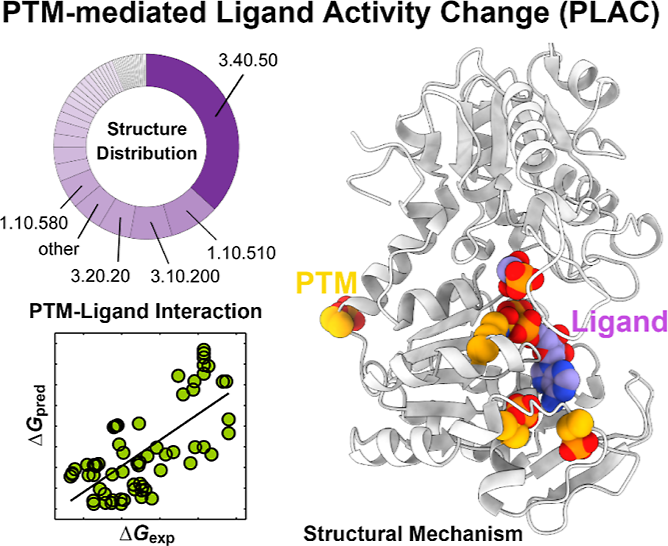
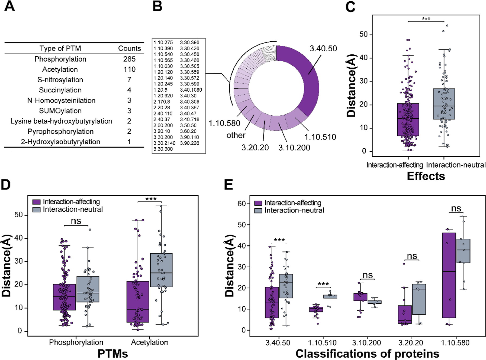
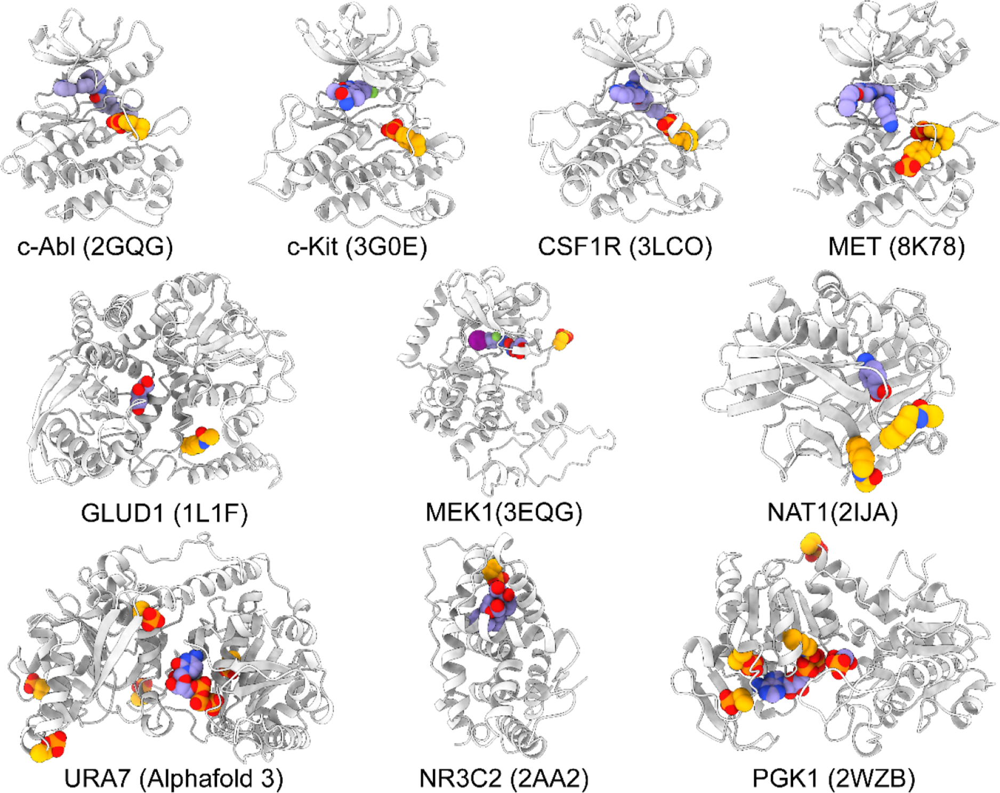
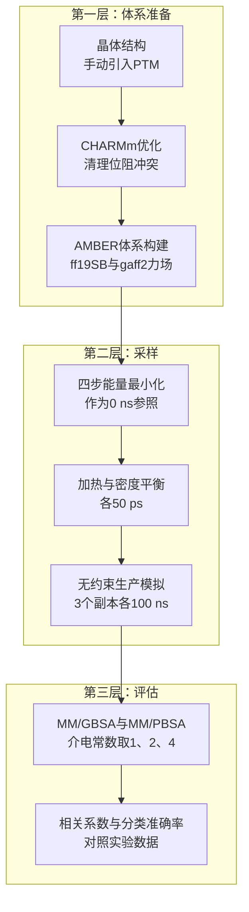
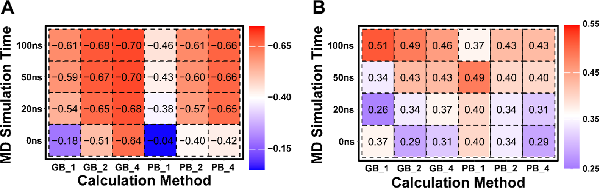
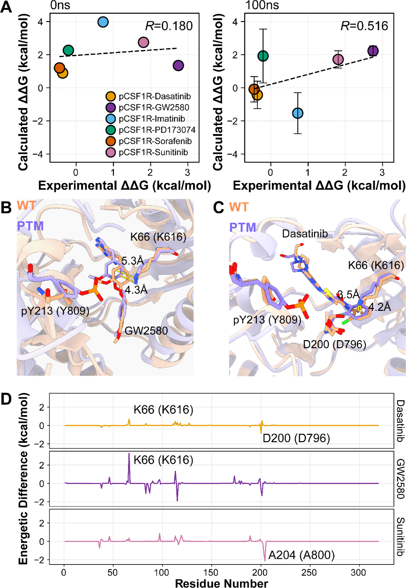

# PTM如何改写药物结合？PLAC数据库与MM/GBSA给出两套最优协议

## 本文信息

- **标题**：通过端点结合自由能计算预测翻译后修饰对蛋白-配体相互作用的影响：数据库构建与策略优化（Predicting the Post-translational Modification Effects on Protein−Ligand Interactions via End-Point Binding Free Energy Calculation: Database Creation and Strategy Optimization）
- **作者**：Zihao Wang, Xiaowei Xu, Zhe Wang, Kexin Xu, Kaimo Yang, Zhiliang Jiang, Chen Yin, Yiheng Wang, Yun Zhao, Zhengting Chen, Tingjun Hou, Huiyong Sun
- **发表期刊**：Journal of Medicinal Chemistry
- **发表时间**：2026年8月12日
- **DOI**：https://doi.org/10.1021/acs.jmedchem.6c00581
- **单位**：中国药科大学药学院（中国南京）、浙江大学药学院（中国杭州）、杭州师范大学药学院（中国杭州）
- **引用格式**：Wang, Z.; Xu, X.; Wang, Z.; et al. Predicting the Post-translational Modification Effects on Protein−Ligand Interactions via End-Point Binding Free Energy Calculation: Database Creation and Strategy Optimization. *J. Med. Chem.* 2026, ASAP. https://doi.org/10.1021/acs.jmedchem.6c00581

## 摘要

> 翻译后修饰（PTM）经常改变蛋白结构与药物结合亲和力，但系统性的数据集一直空缺。为填补这一空白，我们整理了经实验验证的PTM介导配体活性变化（PLAC）数据集，并发现**影响相互作用的PTM在空间上通常比不影响相互作用的PTM更靠近配体**。为准确刻画PTM对蛋白-配体相互作用的影响，我们系统评估了不同分子动力学（MD）模拟时长与介电常数下的端点结合自由能方案（MM/GBSA）。结果显示，**100 ns MD配合高介电常数**（$\varepsilon_\mathrm{in} = 4$）与实验数据的相关性最强（$r_p = -0.70$），而低介电常数（$\varepsilon_\mathrm{in} = 1$）更适合把PTM效应分为增强、减弱或无影响三类。机制分析表明，长MD模拟能捕捉野生型与PTM体系之间的**构象差异**，这正是预测精度提升的原因。PLAC数据集有望推动PTM信息驱动的药物设计。

### 核心结论

- **PLAC数据集**：人工整理417条经实验验证的PTM-配体结合记录，覆盖139个靶标、9类PTM，其中304条有可用的蛋白-配体复合物结构；磷酸化（285条）与乙酰化（110条）合计约占95%。
- **空间规律**：影响相互作用的PTM位点距配体平均15.07 ± 10.18 Å，明显近于无影响组的21.62 ± 10.98 Å（$p < 0.01$），PTM与结合位点的空间邻近性是它发挥功能的关键结构因素。
- **定量预测选高介电加长模拟**：100 ns MD配合$\varepsilon_\mathrm{in} = 4$时，MM/GBSA与实验$pK_\mathrm{d}$的相关性达到最强（$r_p = -0.70$，MM/PBSA为−0.66）。
- **趋势分类选低介电**：$\varepsilon_\mathrm{in} = 1$时MM/GBSA在100 ns取得最佳分类准确率（**51**%），MM/PBSA在50 ns达到**49**%；相对结合自由能对介电常数不敏感，对模拟时长敏感。
- **机制层面的解释**：在CSF1R-pY809案例中，相关系数从最小化结构的0.180升至100 ns的0.516，长MD捕捉到PTM引起的配体构象偏移，是精度提升的直接原因。

### 创新点

- **填补数据库空白**：dbPTM、PhosphoSitePlus、PTMD、UniProt等PTM相关数据库收录位点与功能注释，却没有一个专门定性或定量记录PTM对配体结合的影响，PLAC是首个专门做这件事的实验验证数据集。
- **协议网格化评估**：2种方法（MM/GBSA、MM/PBSA）、4种模拟时长（0、20、50、100 ns）、3种介电常数（1、2、4）共24种组合，同时覆盖绝对值预测与趋势分类两类任务，各给出明确的推荐设置。
- **从机制解释时长效应**：不止于调参，而是用残基能量分解与构象叠合说明长MD为什么更好，即PTM带来的局部结构扰动需要时间松弛成新的构象系综。

## 背景

PTM（post-translational modification，翻译后修饰）是氨基酸侧链的共价修饰，目前已报道超过400种类型，参与蛋白定位、细胞信号、蛋白降解、药物敏感性、酶活性调控等大量细胞过程。对药物结合而言，PTM的影响可以直接体现在亲和力上：

- **SHP099失效**：变构抑制剂SHP099与SHP2的结合会被Y62磷酸化削弱，靶蛋白自己“关掉”了抑制剂。
- **II型激酶抑制剂**：II型抑制剂（如伊马替尼）需要激酶处于“DFG-out”构象，而A-loop上Y393的磷酸化会影响这一构象的稳定性，进而改变抑制剂亲和力。
- **奥雷巴替尼**：它能同时结合非磷酸化与磷酸化形式的ABL（T315I），但亲和力相差数倍，$K_\mathrm{d}$分别为0.71与3.20 nM。
- 类似现象也见于醛固酮、咯利普兰、雌二醇等内源或外源配体，说明**靶蛋白自身的PTM足以改写药物的结合强度**。

但数据层面的供给远远跟不上：dbPTM、PhosphoSitePlus、PTMD、UniProt等数据库收录PTM位点、功能注释或与疾病的关联，却没有一个专门记录PTM对配体结合的定性或定量影响。这种空缺的代价很具体：同一个靶点，在野生型结构上算出来的结合模式未必适用于带PTM的病理形式；反过来，文献里零散报道的PTM效应也缺少统一格式，喂不进任何计算流程。想知道某个磷酸化位点会不会让某个抑制剂失效，研究者只能在文献里零散地翻。

计算端同样缺少针对PTM体系的可靠性评估。几种候选路线的定位如下：

| 路线 | 优势 | 局限 |
|---|---|---|
| 自由能微扰/热力学积分（FEP/TI） | 理论严格，精度上限高 | 计算昂贵，难以铺开 |
| 机器学习亲和力预测 | 推理快，适合大规模 | 精度与应用范围高度依赖训练数据 |
| 端点方法MM/PB(GB)SA | 计算效率与精度的实用平衡 | 介电常数等设置依赖经验 |

MM/PB(GB)SA在突变、PROTAC、蛋白-肽等体系中的表现已被广泛校验，但手动引入PTM会不会像手动引入突变那样损害计算精度，此前并不清楚。这正是本文要系统回答的问题。作者聚焦两个此前就知道影响很大的参数，模拟时长与介电常数，因为两者对PROTAC、突变体系这类柔性体系的影响已被反复观察到，只是PTM体系没有专门测过。

### 关键科学问题

- **PTM影响结合有没有结构规律**？如果影响结合的PTM与不影响结合的PTM在空间分布上存在系统性差异，PTM-配体距离就能用作先验判据，帮助筛选需要重点关注PTM的靶标-药物对。
- **手动引入PTM后，端点自由能还算得准吗**？此前经验表明手动引入突变会损害基于能量最小化结构的MM/PB(GB)SA精度；PTM是否同理、MD采样能否弥补、需要多长的模拟，都需要系统测试。
- **介电常数该怎么选**？$\varepsilon_\mathrm{in}$显著影响静电项，已有经验是蛋白-配体体系用4、蛋白-蛋白体系用1、蛋白-RNA与蛋白-肽体系用2，PTM体系属于哪一类没有现成答案。
- **长MD为什么能改善预测**？如果只是采样更充分，收益应该体现在绝对值上；PTM效应分类对模拟时长的依赖还需要机制层面的解释。

## 研究内容

整篇文章的论证分三层：数据库层面找结构规律，方法层面筛计算协议，机制层面解释时长效应。三层依次递进，下面按这个顺序展开。

### PLAC数据库：417条PTM改写配体结合的实验记录

PLAC的数据来自文献人工整理，每条记录都标注PTM的功能（激活、抑制或亲和力变化），有$K_\mathrm{d}$、$\mathrm{IC50}$等定量数据的都保留。9类PTM的分布高度不均：

| PTM类型 | 样本数 |
|---|---|
| 磷酸化 | 285 |
| 乙酰化 | 110 |
| S-亚硝基化 | 7 |
| 琥珀酰化 | 4 |
| N-高半胱氨酸化 | 3 |
| SUMO化 | 3 |
| 赖氨酸β-羟丁酰化 | 2 |
| 焦磷酸化 | 2 |
| 2-羟基异丁酰化 | 1 |

磷酸化与乙酰化合计395条，占整个数据集的约95%，后续分析也围绕这两类展开。为分析结构特征，作者在晶体结构或AlphaFold 3预测结构上对PTM位点建模，417条中304条有可用的蛋白-配体复合物结构。按CATH分类索引归类后，299条样本落入43个蛋白超家族，其中3.40.50（Rossmann折叠）最多（110/299），其后是1.10.510（26）、3.10.200（22）与3.20.20（17），数据集在折叠类型层面有多样性。

把PTM分为**影响相互作用**（220条）与**不影响相互作用**（84条）两组后，一个清晰的结构规律浮出水面：影响组的PTM位点离配体明显更近，平均距离15.07 ± 10.18 Å对21.62 ± 10.98 Å（$p < 0.01$）。这与突变影响药物-靶标相互作用的规律类似：**空间邻近是扰动作祟的前提**，远离结合位点的修饰大多掀不起风浪。

这个规律有直观的物理解释：离配体足够近的修饰可以直接改变化学环境，挤占或松动配体的接触界面；远处的修饰只能通过变构效应间接传导，而变构路径既长又不稳定，多数时候传不到口袋里。顺带补充一个细节：这里的距离定义为PTM原子与配体原子的平均间距（Biopython计算），没有现成复合物结构的样本，则把同源蛋白中的配体或其类似物叠加移植进口袋后再量。对实际应用来说，这意味着PTM-配体距离可以当成一个廉价的初筛指标，在动手算任何自由能之前就判断哪些PTM值得认真对待。

**图2：PLAC数据集的分布特征**

- （A）9类PTM的样本数统计；
- （B）基于CATH索引的蛋白折叠结构分布，3.40.50（Rossman fold）占比最大；
- （C）全数据集中影响组（紫色）与不影响组（灰色）的PTM-配体距离分布，影响组显著更近（***）；
- （D）磷酸化与乙酰化子集的距离分布，乙酰化子集差异显著（***），磷酸化子集不显著（ns）；
- （E）CATH超家族子集的距离分布，3.40.50与1.10.510内差异显著（***），3.10.200、3.20.20与1.10.580不显著（ns）。

拆到子集层面还能看到规律的边界：全局显著的距离差异，在磷酸化子集里并不显著，乙酰化子集里才显著；按超家族拆开后，只有样本最多的3.40.50与1.10.510内部保持显著，其余超家族样本太少。全局规律是扎实的，但落到细分层面要考虑统计功效，小样本组的"不显著"不等于"没有差异"。

### 63个体系的基准测试设计

要从结构上理解PTM效应，就得对体系做MD模拟与结合自由能计算。作者从417条中筛出63条（10个靶标、18个配体）开展基准测试，筛选标准是结构质量与力场适用性：含金属中心的蛋白（如Zn结合体系）需要专门参数化，超出本研究范围；只有细胞水平实验数据（没有分子层面结合数据）的体系无法与计算能量直接对比，也被排除。这63个体系覆盖了激酶、代谢酶、核受体等不同折叠类型（图1），结构多样性足够检验方法的泛化能力。每个体系跑3个随机种子的独立副本再汇总统计，也是为了降低单条轨迹的偶然性。

**图1：MD模拟与端点自由能计算覆盖的10个代表性体系**

- 包括c-Abl（2GQG）、c-Kit（3G0E）、CSF1R（3LCO）、MET（8K78）、GLUD1（1L1F）、MEK1（3EQG）、NAT1（2IJA）、URA7（AlphaFold 3建模）、NR3C2（2AA2）与PGK1（2WZB）；
- 橙色球模型为PTM残基，紫色球模型为配体，多数体系中两者相距不远；
- 除URA7因缺少合适晶体结构改用AlphaFold 3建模外，其余体系均基于晶体结构。

PTM怎么建进结构是个实际问题，两类修饰用了不同方案：

- **磷酸化**：用Discovery Studio 2019的build and edit protein模块手动引入，像引入突变一样只修改PTM残基的侧链。
- **乙酰化**：Discovery Studio不支持这类修饰，改用AlphaFold 3服务器（https://alphafoldserver.com/）预测修饰后的残基，再叠合映射回晶体结构的对应位置。
- 两种情况都只做局部修饰，随后做几何精修与基于CHARMm的优化，清理PTM与周围残基之间的位阻冲突。

体系构建与模拟全部在AMBER/20中完成：配体用antechamber赋AM1-BCC电荷，蛋白、配体、PTM残基分别用ff19SB、gaff2、ff19SB_modAA/phosaa19SB力场参数化，加入$\ce{Na+}$或$\ce{Cl-}$中和体系电荷，最后浸入边界10 Å的OPC立方水盒子。每个体系的模拟流程如下：

注意流程里有两条支路：最小化结构单独构成“0 ns”参照，MD轨迹则支撑20、50、100 ns三档采样，正好对应协议网格要扫的两个维度。

每个体系取最小化结构和MD轨迹分别做MM/GBSA与MM/PBSA计算，核心公式为：

$$
\Delta G_\mathrm{bind} = G_\mathrm{complex} - (G_\mathrm{receptor} + G_\mathrm{ligand}) \approx \Delta E_\mathrm{MM} + \Delta G_\mathrm{sol} - T\Delta S
$$

#### 公式的通俗解释

- **分子力学能量项**（$\Delta E_\mathrm{MM}$）：只保留vdW与静电两项（$\Delta E_\mathrm{MM} = \Delta E_\mathrm{vdW} + \Delta E_\mathrm{ele}$）。单轨迹协议下复合物、受体、配体用同一套构象，键长键角二面角项相消，不算白算。
- **溶剂化能项**（$\Delta G_\mathrm{sol}$）：极性部分用PB或GB模型（本文分别对应MM/PBSA与MM/GBSA），非极性部分由溶剂可及表面积（SASA）估计，$\Delta G_\mathrm{SA} = \gamma \times \mathrm{SASA} + b$，系数$\gamma$取0.0072、$b$取0。
- **熵的贡献**（$-T\Delta S$）：计算代价高，而且作者此前的工作发现算上熵反而损害预测精度，本文全部忽略。
- **溶质介电常数**（$\varepsilon_\mathrm{in}$）：直接调制静电项与极性溶剂化项，是本文重点扫描的参数；外层溶剂介电常数固定为80。

评估指标有两个层面。绝对值层面用Pearson相关系数（PCC）衡量计算的$\Delta G_\mathrm{bind}$与实验$pK_\mathrm{d}$的相关性；趋势层面比较PTM体系与野生型的自由能差$\Delta\Delta G = \Delta G_\mathrm{PTM} - \Delta G_\mathrm{WT}$，按±1.0 kcal/mol阈值分为“增强结合”“减弱结合”“无显著影响”三类，这个阈值大致对应收敛良好的RBFE计算的不确定度。实验端以$|\Delta pK_\mathrm{d}| < 0.301$（即$\log 2$，亲和力变化不足两倍）为无显著效应，预测标签与实验趋势对上才算预测正确。

### 模拟时长与介电常数：24种组合怎么选

先看基线：直接用能量最小化结构算，效果如何？答案是**不够好**。此前研究认为基于最小化结构的端点自由能甚至优于MD轨迹，但对手动引入的修饰体系，这个经验失效了。手动引入的PTM会破坏局部结构，不利的原子接触需要构象调整来松弛，而最小化结构给不出这种调整。

下表汇总了全部组合的PCC（0 ns即最小化结构）：

| MD时长 | GB ε=1 | GB ε=2 | GB ε=4 | PB ε=1 | PB ε=2 | PB ε=4 |
|---|---|---|---|---|---|---|
| 0 ns | −0.18 | −0.51 | **−0.64** | −0.04 | −0.40 | −0.42 |
| 20 ns | −0.54 | −0.65 | **−0.68** | −0.38 | −0.57 | −0.65 |
| 50 ns | −0.59 | −0.67 | **−0.70** | −0.43 | −0.60 | −0.66 |
| 100 ns | −0.61 | −0.68 | **−0.70** | −0.46 | −0.61 | −0.66 |

趋势分类准确率的网格则是另一番景象：

| MD时长 | GB ε=1 | GB ε=2 | GB ε=4 | PB ε=1 | PB ε=2 | PB ε=4 |
|---|---|---|---|---|---|---|
| 0 ns | 37% | 29% | 31% | **40**% | 34% | 29% |
| 20 ns | 26% | 34% | 37% | **40**% | 34% | 31% |
| 50 ns | 34% | 43% | 43% | **49**% | 40% | 40% |
| 100 ns | **51**% | 49% | 46% | 37% | 43% | 43% |

两张网格放在一起读，能得到几个明确结论：

- **绝对值预测**：模拟越长越好，介电常数越高越好，最优组合是100 ns加$\varepsilon_\mathrm{in} = 4$（MM/GBSA的$r_p = -0.70$，MM/PBSA为−0.66）。主要提升发生在前20 ns，之后收益递减，绝对结合自由能在这些体系中收敛很快。
- **趋势分类**：与模拟时长的关系是非单调的，最优设置是低介电常数$\varepsilon_\mathrm{in} = 1$（MM/GBSA在100 ns达51%，MM/PBSA在50 ns达49%）。有趣的是，$\varepsilon_\mathrm{in} = 1$在50 ns的分类（34%）反而低于最小化结构（37%），说明相对能量对构象系综的调整过程敏感，路径不是直线改善的。
- **两类任务分工明确**：相对结合自由能对介电常数不敏感、对模拟时长敏感；绝对值则两者都敏感。想省算力时，最小化结构加$\varepsilon_\mathrm{in} = 4$（$r_p = -0.64$）也能给出不错的绝对值预测，适合大规模PTM效应初筛。

顺带一提，63个体系的样本量不大，个别离群点足以拉动相关系数，所以这些PCC都配了误差估计：每次随机抽80%的样本重算，重复1000次取标准差（完整结果在原文SI表S3）。方案之间的对比建立在这个误差量级之上，而不是单点数字。

介电常数那一维值得多说一句。它本质上是给静电作用加屏蔽系数：取1等于完全不做内部屏蔽，静电贡献容易被高估；取4是一种经验补偿，让静电项回到合理量级。绝对值预测受益于高介电，与此相符。至于分类任务为什么反而偏爱低介电，论文没有给出机制解释，还是个开放问题。

**图3：MD模拟时长与介电常数对MM/PBSA与MM/GBSA性能的影响**

- （A）计算的绝对结合自由能（$\Delta G_\mathrm{bind}$）与实验数据（$pK_\mathrm{d}$）在不同模拟方案下的Pearson相关系数热图，行代表模拟时长（0、20、50、100 ns），列代表计算方法与介电常数组合（GB_1至PB_4）；
- （B）计算的$\Delta\Delta G$与实验$\Delta pK_\mathrm{d}$的分类准确率热图，行列设置同（A）；
- 颜色越红代表数值越好，GB与PB分别对应MM/GBSA与MM/PBSA，下划线后的数字为介电常数取值，如GB_4即MM/GBSA配合$\varepsilon_\mathrm{in} = 4$；
- 详细数据见原文Supporting Information 4至19。

### 案例：CSF1R-pY809，长MD多看到了什么

模拟时长是影响最大也最稳健的因素，值得拆开看机制。作者选了CSF1R-pY809做案例分析，这个案例的巧妙之处在于控制变量：同一个磷酸化位点、同一条蛋白，配上6个不同的配体，天然构成一组对照，配体之间的差异只能来自修饰本身的效应。用MM/GBSA在$\varepsilon_\mathrm{in} = 1$下比较最小化结构与100 ns轨迹，结果与全局趋势一致：$\Delta\Delta G$与实验的相关系数从0.180（0 ns）提升到0.516（100 ns），其中GW2580、sunitinib、dasatinib三个体系的预测倾向变得正确且更可分。

**图4：CSF1R-pY809体系的机制分析**

- （A）6个CSF1R-pY809体系的计算与实验结合自由能差的相关性，左为最小化结构（0 ns，R=0.180），右为100 ns（R=0.516），MM/GBSA、$\varepsilon_\mathrm{in} = 1$；
- （B）pCSF1R-GW2580体系中野生型（橙色）与磷酸化修饰（紫色）体系在100 ns的平均构象叠合，磷酸化后配体位置发生明显偏移；
- （C）pCSF1R-dasatinib体系的对应叠合，两个体系的构象变化轻微；
- （D）三个代表性体系的残基水平结合自由能差曲线，橙色为dasatinib、紫色为GW2580、品红为sunitinib，K66（K616）、D200（D796）与A204（A800）为关键残基（括号外为构建体编号，括号内为全长编号），体系基于PDB 3LCO建模。

三个配体的故事各有不同：

- **GW2580，结合减弱**：残基能量分解显示最显著的能量差异位于K616。构象叠合揭示了原因：100 ns时野生型体系中的配体离K616的苯环只有4.3 Å，磷酸化体系被推远到5.3 Å，配体在口袋里挪了位置，K616相互作用减弱超过2 kcal/mol，整个体系的结合随之减弱。
- **dasatinib，无显著影响**：同一个K616，野生型与磷酸化体系的距离分别为4.2 Å与3.5 Å，配体只轻微挪动，残基水平的能量差异不大，预测与实验都指向“没变化”。
- **sunitinib，总体减弱**：A800单独看反而增强了药物结合，但所有残基的总效果是让磷酸化体系的结合自由能高出1.15 kcal/mol，整体上更不喜欢这个药。

> 长MD的价值不在于算得更久，而在于让蛋白有足够时间把PTM带来的局部扰动松弛成新的构象系综。这种系综差异决定了配体在口袋里的摆放方式，也正是能量最小化结构永远给不出的信息。

这个案例只覆盖一个磷酸化位点，但它给出的图像，扰动、松弛、系综差异，与全局观察到的时长依赖一致，为协议选择提供了结构层面的依据。介电常数那一侧没有类似的故事，也呼应了相对能量对介电设置不敏感的结论。

## 关键结论与批判性总结

### 潜在影响

- **PLAC填补了PTM-配体结合数据的空白**，417条带实验标注的记录可以直接用作基准测试集或机器学习训练集，推动PTM信息进入药物设计流程。
- **两套协议即插即用**：定量预测用100 ns MD加$\varepsilon_\mathrm{in} = 4$，趋势分类用低介电常数（$\varepsilon_\mathrm{in} = 1$），算力紧张时还能退回最小化结构加高介电常数做初筛，工程上容易落地。
- **PTM-配体距离提供了廉价的先验判据**：在算任何一个自由能之前，先看修饰位点离配体多远，就能初步判断这个PTM值不值得担心。

### 局限与展望

- **分类准确率的天花板不高**：最好也只有51%到49%，意味着端点方法在“增强、减弱、无影响”的三分类上刚过半数，比随机猜测好得有限，趋势判断仍是硬骨头。
- **数据集高度偏斜**：磷酸化与乙酰化占约95%，其余7类PTM样本稀少，结论对这些类型的适用性有待检验。
- **体系覆盖有缺口**：含金属中心的蛋白与只有细胞水平数据的体系被排除，而前者（如Zn结合蛋白）恰恰是PTM研究的重要场景，需要专门参数化方案才能纳入。
- **PTM建模本身有不确定性**：乙酰化依赖AlphaFold 3预测再映射回晶体结构，预测结构的可靠性会传导进下游模拟；熵项被忽略对结合强弱接近的体系也可能引入系统误差。
- **更严格的路线没有覆盖**：alchemical自由能方法（FEP/TI）处理PTM残基需要专门的微扰拓扑，算力开销更大，本文没有对比，算力充裕时两条路线的交叉验证值得做。

PLAC数据集与63个体系的初始结构都随原文Supporting Information公开，SI还附了全部24种方案的逐体系MM/PB(GB)SA结果，想复现或接着训练模型的话可以直接取用。计算协议的参数细节与表S1数据摘录见配套附录。
