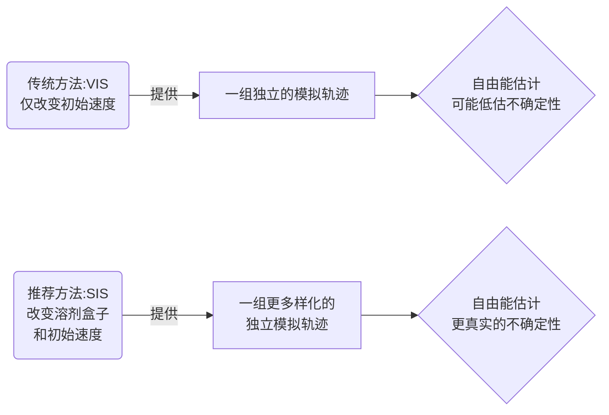

# 自由能计算的"蝴蝶效应"：初始速度 vs. 溶剂盒子，哪个对结果影响更大？

## 本文信息

  - **标题**: 变化的初始速度和溶剂盒子对炼金术自由能模拟的影响
  - **作者**: Meiting Wang, Hao Jiang, Ulf Ryde
  - **发表时间**: 2025年1月31日
  - **单位**: 新乡医学院 (中国), 隆德大学 (瑞典)
  - **引用格式**: Wang, M., Jiang, H., & Ryde, U. (2025). Impact of Varying Velocities and Solvation Boxes on Alchemical Free-Energy Simulations. *Journal of Chemical Information and Modeling*, *65*(7), 2107–2115. [https://doi.org/10.1021/acs.jcim.4c02236](https://doi.org/10.1021/acs.jcim.4c02236)
    本文的输入文件和水盒子模型等可在 [http://signe.teokem.lu.se/ulf/Methods/waterboxes.html](http://signe.teokem.lu.se/ulf/Methods/waterboxes.html) 找到。

-----

## 摘要

> 炼金术自由能微扰 (FEP) 是一种精确且热力学上严谨的方法，用于估算小分子配体与生物大分子结合的相对能量。研究反复指出，**单次模拟通常会停留在相空间的起始点附近，因此会低估结果的不确定性**。因此，更好的做法是运行一组独立的模拟。传统上，这样的独立模拟系综是通过使用不同的初始速度来生成的。我们认为，利用模拟设置过程中的其他随机选择，特别是**溶质的溶剂化**过程，可能会更优。我们在此证明，这种“溶剂诱导的独立模拟 (SIS)” 方法，在计算42种配体与五种不同蛋白质（人N端溴结构域蛋白4、T4溶菌酶的Leu99Ala突变体、二氢叶酸还原酶、凝血因子Xa和铁蛋白）的结合能时，**有时会产生更大的标准差和略有不同的结果**。SIS方法不会增加任何额外的时间消耗。因此，我们强烈建议使用SIS（以及不同的初始速度）来启动独立模拟。模拟系统设置中的其他随机或不确定的选择，例如选择具有替代构象的残基或添加质子的位置，也可用于增强独立模拟的多样性。

-----

## 背景

在计算生物化学领域，精确预测小分子药物与靶点蛋白的结合自由能是核心目标之一，尤其是在药物研发中，它直接关系到药物筛选和优化的效率。为此，研究者们开发了从分子对接到高精度自由能微扰 (FEP) 的一系列方法。FEP方法通过在分子动力学 (MD) 模拟中将一个配体“炼金术式”地缓慢转变为另一个，从而计算它们与蛋白结合的相对自由能差 (ΔΔG)，其精度可以达到甚至优于 4 kJ/mol。

然而，FEP的精度高度依赖于两个核心要素：力场的准确性和相空间采样的充分性。MD模拟具有所谓的“李雅普诺夫不稳定性”，即对初始条件的微小扰动会随着模拟时间的推移被指数级放大。这意味着，任何单次MD模拟都只能探索初始结构附近一个非常局限的构象区域。因此，仅靠单次模拟得出的结合能及其误差估计，往往会过于乐观，无法反映真实的不确定性。

为了解决这个问题，学术界普遍推荐的做法是**运行一组（系综）独立的模拟**。传统上，生成这些独立模拟最简单、最常用的方法是为每次模拟分配**不同的随机初始速度**。因为原子速度在实验上是完全未知的，所以这种随机化是物理上合理的。但是，在搭建一个模拟体系的过程中，还存在许多其他同样具有随机性或任意性的步骤。

## 关键科学问题

本文旨在解决的核心科学问题是：**除了改变初始速度外，我们能否利用模拟设置过程中的其他“随机性来源”来生成更加多样化、更能反映真实不确定性的独立模拟系综，从而提高自由能计算的可靠性？**

具体来说，作者将焦点放在了另一个关键的、但常被忽略的随机步骤上：**溶剂化**。当我们将一个蛋白质-配体复合物放入一个水盒子中进行模拟时，水分子的具体位置和取向是完全任意的。我们只是简单地将一个预平衡的水盒子叠加在溶质上，并删除与溶质冲突的水分子。更换一个不同的水盒子（例如，从一个纯水模拟轨迹的不同时间点提取），会得到一个原子坐标完全不同、甚至水分子总数也略有不同的初始体系。

因此，本文的核心问题可以进一步细化为：

  - **与传统的改变初始速度 (VIS) 相比，使用不同溶剂盒子 (SIS) 生成的独立模拟，其计算出的结合自由能结果是否会有显著差异？**
  - **SIS方法是否能够比VIS方法揭示出更大的统计不确定性（即更大的标准差），从而提供一个更保守、更真实的误差估计？**
  - **考虑到SIS方法在计算成本上与VIS完全相同，它是否应该成为未来FEP计算中的一个标准实践？**

## 创新点

  - **提出新策略**：明确提出了**溶剂诱导的独立模拟 (Solvent-Induced Independent Simulations, SIS)** 的概念，将其作为一种与传统改变速度 (VIS) 并行或更优的策略，用于生成FEP计算的独立模拟系综。
  - **系统性比较**：对VIS和SIS两种策略进行了大规模、系统性的比较。研究涵盖了**5个不同的蛋白质靶点**和**42个配体**，涉及数十个炼金术转换，确保了结论的统计鲁棒性。
  - **强调不确定性量化**：本文再次强调了单一模拟会严重低估不确定性的问题，并通过VIS和SIS的对比，为如何更准确地评估FEP计算的真实误差范围提供了切实可行的方案。
  - **零成本优化**：最关键的是，SIS方法**不引入任何额外的计算成本**，因为它仅仅改变了模拟开始前的设置步骤，使得这一优化策略极易被广泛采纳和应用。

-----

## 研究内容

### 核心方法：VIS vs. SIS 的严格比较框架

为了系统地比较两种独立模拟生成策略，作者设计了一个严谨的计算流程，并在多个蛋白质-配体体系上进行了测试。

  - **测试体系**:
    研究共涉及五个蛋白质靶点，涵盖了不同的结构和功能类型：

    1.  **BRD4**: 人N端溴结构域蛋白4，一个热门的表观遗传学靶点。
    2.  **T4溶菌酶 (L99A突变体)**: 一个经典的用于研究配体结合的口袋模型体系。
    3.  **二氢叶酸还原酶 (DHFR)**: 一个重要的抗疟疾药物靶点。
    4.  **凝血因子Xa (fXa)**: 一个关键的抗凝血药物靶点。
    5.  **铁蛋白 (Ferritin)**: 一个用于研究小分子结合的蛋白笼。
        总共研究了42个配体的相对结合自由能。

    **图1：BRD4和T4溶菌酶的示意图及其配体结构式。**

  - **模拟设置与流程**:
    所有模拟均采用 **AMBER 22** 软件包进行。

    ```mermaid
    graph LR
        A("1.体系准备<br/>(Maestro, MOE)") --> B["2.力场与溶剂化<br/>蛋白:ff14SB<br/>配体:GAFF2,AM1-BCC<br/>水模型:TIP3P"]
        B --> C["3.能量最小化<br/>与平衡"]
        C --> D{"4.FEP生产模拟<br/>(pmemd.cuda,NPT系综)<br/>11-13个λ窗口"}
        D --> E["5.自由能计算<br/>(MBAR,alchemlyb)"]
    ```

    1.  **体系准备**: 蛋白质结构来自PDB数据库，使用Maestro软件进行质子化、残基侧链翻转等预处理。配体则通过MOE软件对接到活性位点。
    2.  **力场参数**: 蛋白质采用 **ff14SB** 力场，配体采用 **GAFF2** 通用力场，其原子部分电荷通过 **AM1-BCC** 方法计算。
    3.  **溶剂化**: 将复合物和游离配体分别置于一个立方体 **TIP3P** 水盒子中，盒子边界距离溶质至少12 Å。
    4.  **平衡**: 体系首先进行能量最小化，然后依次在NVT（恒容）和NPT（恒压）系综下进行加热和平衡。
    5.  **FEP模拟**: 使用双拓扑方法，在11或13个离散的λ窗口中进行炼金术转换。每个窗口的生产模拟时长为2 ns或10 ns。
    6.  **自由能分析**: 使用**多态贝内特接受率 (MBAR)** 方法计算每个λ窗口间的自由能差，并最终得到总的相对结合自由能 $\Delta\Delta G$。

  - **VIS vs. SIS 的实现**:
    这是本研究的核心设计。对于每一个炼金术转换，作者都进行了10次独立的FEP模拟，分为两组：

      - **VIS组 (Velocity-Induced Independent Simulations)**: 5次模拟。这5次模拟使用**完全相同的初始坐标和拓扑文件**，但在AMBER输入文件中设置了不同的随机数种子 (`ig = -1`)，从而生成了**5套不同的原子初始速度**。
      - **SIS组 (Solvent-Induced Independent Simulations)**: 5次模拟。这5次模拟使用了**5个不同的水盒子**来溶剂化初始结构。这些水盒子是从一个长达500 ns的纯水模拟轨迹中，每隔12.5 ns提取一个快照得到的。这意味着每个SIS模拟的初始原子坐标（特别是水分子的坐标）和体系中的水分子总数都略有不同。同时，它们的初始速度也是随机生成的。

  - **性能评估指标**:

      - **与实验值的比较**: 平均绝对偏差 (MAD), 最大误差 (Max), 相关系数 ($R^2$), 和肯德尔等级相关系数 ($\tau_{r90}$)。
      - **不确定性评估**: 比较由MBAR方法本身报告的误差和由5次独立模拟结果的标准误（Standard Error）。
      - **热力学循环闭合度**: 检查由多个转换构成的热力学循环的自由能总和是否接近于零，这是衡量采样收敛性的一个重要指标。

### 结果与分析

作者通过对五个体系的详细数据分析，系统比较了VIS和SIS两种策略的性能。

#### 以BRD4和T4溶菌酶为例

  - **BRD4体系 (表1)**:

      - **平均值相似**: 对于BRD4的4个配体转换，VIS和SIS计算出的平均 $\Delta\Delta G$ 值非常接近，差异在0.1-0.8 kJ/mol之间，均在统计误差范围内。
      - **不确定性差异**: 对于 L3 → L2 的转换，**SIS给出的不确定性 ($0.58 \mathrm{kJ/mol}$) 几乎是VIS ($0.35 \mathrm{kJ/mol}$) 的两倍**。这表明在这种情况下，SIS探索了更广阔的构象空间，从而揭示了更大的潜在误差。
      - **热力学循环**: 对于一个由三次转换构成的循环，SIS计算得到的循环闭合能为 $0.16 \pm 0.7 \mathrm{kJ/mol}$，完美地接近于零。而VIS的结果为 $-1.08 \pm 0.5 \mathrm{kJ/mol}$，略有偏差。这**暗示SIS系综可能具有更好的收敛性**。

    **表1：BRD4四个配体的相对结合自由能 (kJ/mol)**
    | 转换 | 方法 | 独立模拟1 | 独立模拟2 | 独立模拟3 | 独立模拟4 | 独立模拟5 | 平均值 ± 标准误 | 实验值 |
    |---|---|---|---|---|---|---|---|---|
    | L1→L3 | VIS | 1.45±0.10 | 1.18±0.10 | 1.80±0.10 | 1.30±0.10 | 1.40±0.10 | **1.43±0.10** | 1.26 |
    | | SIS | 1.59±0.10 | 1.66±0.10 | 1.49±0.10 | 1.76±0.10 | 1.32±0.10 | **1.65±0.07** | |
    | L3→L2 | VIS | 6.62±0.17 | 6.62±0.17 | 8.24±0.16 | 7.08±0.17 | 8.04±0.16 | **7.32±0.35** | 6.69 |
    | | SIS | 9.01±0.16 | 8.11±0.16 | 7.24±0.17 | 6.47±0.17 | 9.66±0.16 | **8.10±0.58** | |
    | L3→L4 | VIS | -0.38±0.08 | -0.10±0.08 | 0.00±0.07 | 0.09±0.08 | 0.03±0.08 | **-0.07±0.08** | 0.00 |
    | | SIS | -0.30±0.08 | -0.56±0.08 | 0.26±0.08 | -0.11±0.08 | -0.10±0.08 | **-0.16±0.13** | |
    | L4→L2 | VIS | 9.34±0.16 | 8.06±0.17 | 7.16±0.17 | 8.71±0.17 | 9.09±0.17 | **8.47±0.39** | 6.69 |
    | | SIS | 8.69±0.17 | 8.49±0.17 | 8.59±0.17 | 7.11±0.17 | 7.62±0.17 | **8.10±0.31** | |

  - **T4溶菌酶体系 (表2)**:

      - **显著的平均值差异**: 对于 Eth→Tol 的转换，VIS和SIS的结果出现了**统计上显著的差异** ($2.5 \pm 0.1$ vs $3.1 \pm 0.1 \mathrm{kJ/mol}$)。VIS的5次模拟结果分布在2.4-2.9 kJ/mol，而SIS则分布在2.8-3.3 kJ/mol。这表明，对于这个特定的体系，初始溶剂环境的微小差异确实导致了最终收敛到了不同的自由能平均值。
      - **采样问题**: 该体系的某些转换（如 Ide→Ido）与实验值误差较大（6-10 kJ/mol）。但热力学循环闭合得很好，暗示问题可能出在力场参数或初始对接构象上，而非采样不足。
      - **对慢动力学不敏感**: 作者还分析了活性位点附近一个关键残基 Val-111 的侧链动力学，发现其构象变化非常缓慢。然而，VIS和SIS两种方法在采样这种慢动力学行为上没有表现出差异，这可能是因为初始溶剂环境的改变主要影响表层，难以直接传递到蛋白内部。

    **表2：T4溶菌酶七个配体的相对结合自由能 (kJ/mol)，节选**
    | 转换 | 方法 | 平均值 ± 标准误 | 实验值 |
    |---|---|---|---|
    | Ben→Phe | VIS | 8.11±0.08 | ≥10.25 |
    | | SIS | 8.14±0.07 | |
    | Eth→Tol | VIS | **2.51±0.10** | 1.00 |
    | | SIS | **3.13±0.10** | |
    | Ide→Ido | VIS | 7.52±0.24 | 1.00 |
    | | SIS | 7.26±0.12 | |

#### 综合所有体系的结论

对另外三个蛋白质（DHFR、fXa、铁蛋白）的分析也得出了类似的结论（详见支持信息）。

  - **普遍现象**: 在大多数情况下，VIS和SIS给出的结果非常相似。
  - **SIS的优势**: 但在某些情况下（如BRD4的一个转换和铁蛋白体系），**SIS确实揭示了比VIS更大的结果可变性（标准差）**。并且在T4溶菌酶的一个例子中，**SIS和VIS甚至收敛到了不同的平均值**。
  - **共同的重要性**: 两种方法都清晰地表明，**单次FEP模拟报告的误差（来自MBAR）显著低于多次独立模拟的标准误**，再次证实了运行独立模拟系综的必要性。单次模拟的结果差异可达数 kJ/mol，这在药物研发项目中足以影响决策。

### 结论：向更可靠的自由能计算迈出简单而重要的一步

作者最终得出结论，强烈推荐在生成独立模拟系综时，**除了使用不同的初始速度，也应该使用不同的溶剂盒子**。



这种SIS策略的优势在于：

1.  **最大化初始条件的多样性**: 它利用了模拟设置中另一个主要的随机来源，从而可能引导模拟轨迹进入更广阔、更多样的相空间区域。
2.  **提供更保守的误差估计**: 在某些体系中，SIS能够揭示出更大的统计不确定性，这对于避免在药物项目中做出过于乐观的判断至关重要。
3.  **零额外计算成本**: SIS的实施仅在模拟开始前的准备阶段有所不同，完全不增加FEP模拟本身的计算时间。

作者进一步建议，未来还可以探索将其他不确定性来源，如蛋白侧链的替代构象、质子化状态的选择等，也纳入到独立模拟的构建中，以期获得对自由能计算结果可靠性的最全面评估。

-----

## Q&A

  - **Q1**: SIS方法为什么有时能比VIS产生更大的结果差异？其物理机制是什么？

  - **A1**: 物理机制在于，不同的初始溶剂构象（水分子的位置和取向）会改变溶质表面（蛋白质和配体）的初始氢键网络和静电环境。这种微小的初始环境差异，会通过MD模拟的“蝴蝶效应”被放大，可能导致蛋白质或配体在模拟过程中探索到略有不同的构象子空间。如果这些子空间对应着不同的能量状态，那么最终计算出的平均自由能就可能出现差异或更大的波动。而VIS方法由于初始坐标完全相同，所有模拟都从同一个能量微观态出发，它们的分歧完全依赖于随机速度的碰撞传导，这种多样性可能不如改变整个溶剂环境来得直接和显著。

  - **Q2**: 这篇论文的结果是否意味着传统的VIS方法是错误的或不可靠的？

  - **A2**: 并非如此。论文的结果表明，VIS方法在大多数情况下与SIS给出了相似的结果，它仍然是生成独立模拟的有效且必要的方法。文章的核心论点是“优化”而非“否定”。作者认为，既然存在多个随机性来源，我们应该尽可能地利用它们来最大化模拟系综的多样性。SIS可以看作是对VIS的一个**零成本的、强有力的补充**。最佳实践应该是同时使用不同的溶剂盒子和不同的随机速度，确保初始条件尽可能地随机和不相关。

  - **Q3**: 作者提到，对于T4溶菌酶体系中的Val-111残基的慢动力学，SIS和VIS都没有表现出更好的采样能力。这是否说明这两种方法有其局限性？

  - **A3**: 是的，这正说明了这两种方法的适用范围和局限性。VIS和SIS主要通过改变模拟的**初始条件**来增加多样性。这种扰动对于采样与溶剂接触的、快速变化的构象非常有效。然而，对于深埋在蛋白质内部、由高能垒隔开的慢动力学过程（如大范围的侧链翻转或结构域运动），仅仅改变初始条件是不足以在有限的模拟时间内（本文中为10 ns）跨越这些能垒的。要解决这类问题，需要依赖更高级的增强采样方法，如副本交换MD (REMD)、元动力学 (Metadynamics) 或特定的蒙特卡洛移动等。

  - **Q4**: 如果我想在自己的FEP计算中实施SIS策略，具体应该如何操作？

  - **A4**: 操作非常简单。首先，你需要生成几个不同的水盒子文件。一个标准做法是：运行一个较长时间（例如100 ns）的纯水盒子（如TIP3P水）的MD模拟。然后，从这条轨迹中等间隔地（例如每10 ns）提取一个快照（坐标文件）。这样你就得到了10个原子坐标和构象完全不同的水盒子。在你的FEP模拟流程中，当进行溶剂化步骤时（例如在AMBER的`tleap`或GROMACS的`gmx solvate`中），为你的5次独立模拟分别指定这5个不同的水盒子文件即可。

-----

## 关键结论与批判性总结

### 核心结论

  - **独立模拟至关重要**: 再次证实，仅依赖单次FEP模拟会严重低估计算的不确定性，运行一组独立的模拟是获得可靠结果和误差估计的必要步骤。
  - **SIS是一种有效的补充策略**: 使用不同的溶剂盒子来初始化模拟（SIS），在某些体系中能够比仅改变初始速度（VIS）揭示出更大的结果可变性和更保守的误差估计。
  - **初始条件影响显著**: 在至少一个案例中，SIS和VIS系综收敛到了统计上显著不同的平均结合能，表明初始溶剂环境可以对FEP计算结果产生实质性影响。
  - **实践建议**: 鉴于SIS策略不增加任何计算成本，作者强烈建议将其作为FEP计算中的标准操作，与改变初始速度结合使用，以最大程度地增加初始构象的多样性，从而获得更可靠的自由能预测。

### 潜在影响

  - **改进FEP计算的最佳实践**: 本研究为高精度自由能计算领域提供了一个简单、有效且零成本的改进方案，有望被社区广泛采纳，成为新的“最佳实践”之一，从而提高药物设计项目中计算结果的可靠性。
  - **提升对不确定性的认识**: 它促使研究者更加关注模拟设置中各种“隐性”的随机性来源，并思考如何利用这些来源来更全面地量化模拟结果的不确定性，推动计算化学向更严谨、更可重复的方向发展。

### 研究局限性

  - **扰动范围有限**: SIS主要扰动的是溶剂环境，对于那些由蛋白质内部慢动力学主导的构象变化，其采样增强效果有限。
  - **样本数量相对较小**: 尽管研究的体系很多，但每个系综仅包含5次独立模拟。虽然这是当前计算成本下的常见做法，但更多的独立模拟（如10次或20次）可能会提供更稳健的统计结果。
  - **未探索其他不确定性来源**: 文章虽然提及了质子化状态、替代构象等其他不确定性来源，但并未在本次研究中进行系统性比较，这些因素的影响仍有待进一步探索。

### 未来方向

  - **组合多种不确定性来源**: 系统地研究将不同的初始速度、不同的溶剂盒子、不同的初始质子化状态、不同的晶体结构副本等多种不确定性来源组合在一起，以构建终极的、最大多样性的模拟系综。
  - **自动化工作流**: 开发能够自动执行VIS和SIS（以及其他策略）的计算工作流软件，使用户可以一键式地生成和分析多样化的独立模拟系综。
  - **与增强采样方法结合**: 探索如何将SIS/VIS策略与更强大的增强采样技术（如GCMC/MD）相结合，以同时解决初始条件不确定性和采样不充分的问题，特别是对于包含埋藏水合物或存在构象变化的复杂体系。