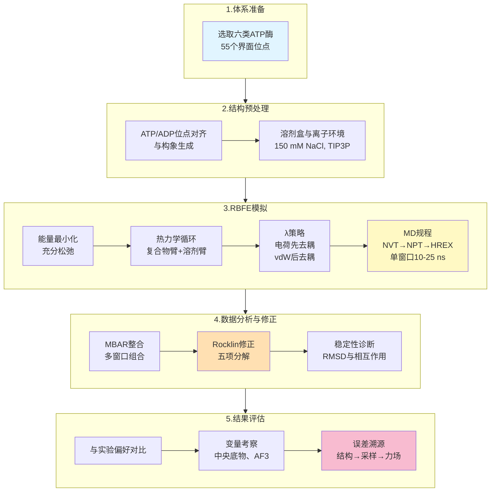
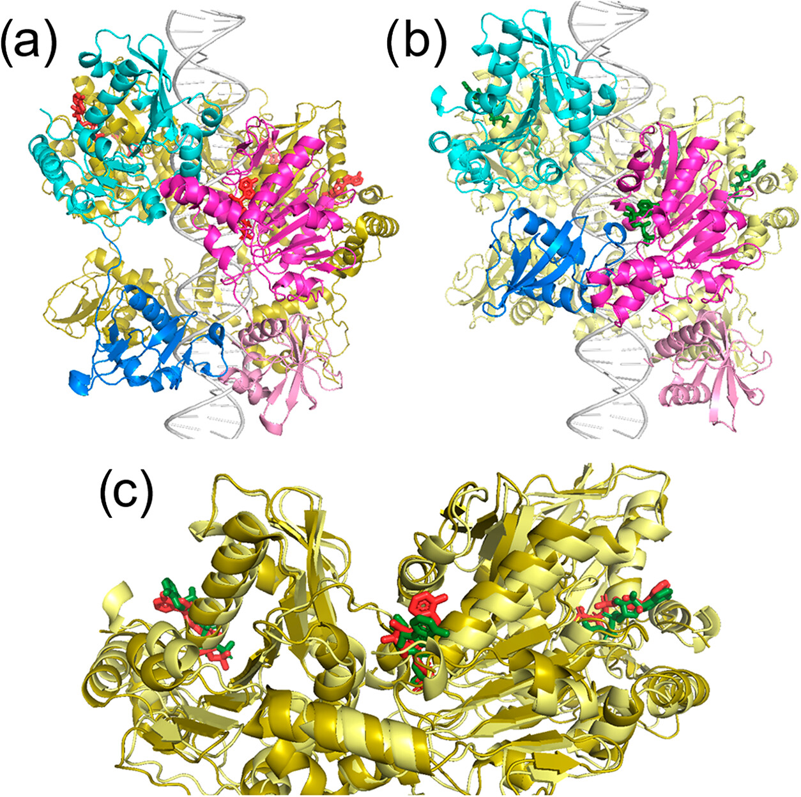
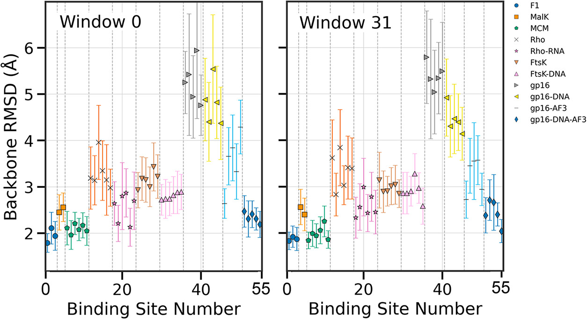
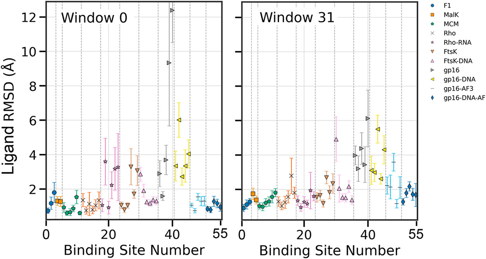
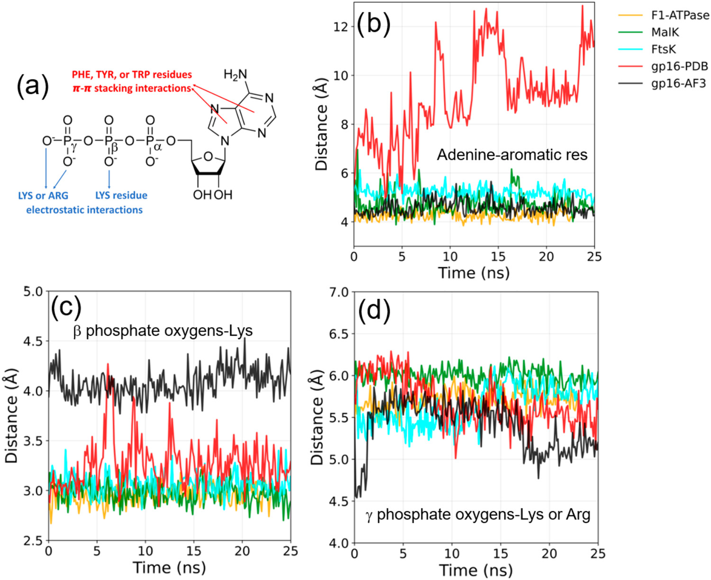
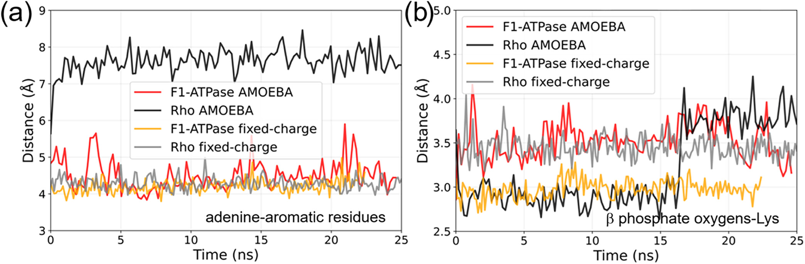
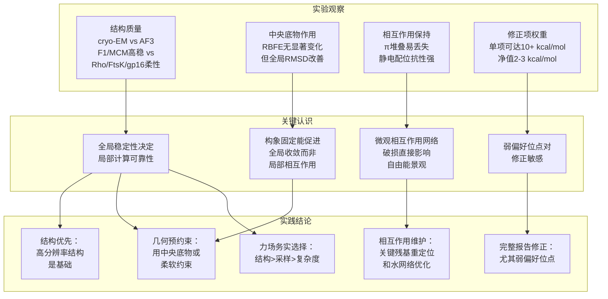

# RBFE计算在多亚基ATP酶中的适用性边界：大规模基准研究提供明确指导原则

## 本文信息

- **标题**: 多亚基ATP酶中核苷酸结合的炼金相对结合自由能计算基准研究
- **作者**: Apoorva Purohit, Xiaolin Cheng
- **发表时间**: 2025年10月13日
- **单位**: Xiaolin Cheng课题组 俄亥俄州立大学 药学院与转化数据分析研究所，美国
- **引用格式**: Purohit, A., & Cheng, X. (2025). Benchmarking Alchemical Relative Binding Free Energy Calculations for Nucleotide Binding to Multimeric ATPases. *Journal of Chemical Theory and Computation*, *21*(20), 10547–10560. https://doi.org/10.1021/acs.jctc.5c01069

**支持信息**: Supporting Information 包含所有55个位点的详细RBFE结果、GROMACS输入脚本、带电配体修正参数分解等，详见：https://pubs.acs.org/doi/10.1021/acs.jctc.5c01069

## 摘要

多亚基ATP酶的核苷酸位点通常坐落于亚基界面，受**协同与变构**调控，导致单位点亲和力实验测定困难。本文在六类寡聚ATP酶（F1-ATPase、MalK、MCM、Rho、FtsK、gp16）的**55个界面位点**系统开展炼金相对结合自由能（RBFE）基准研究，采用固定电荷力场与电荷修正方案，并比较有与无中央底物（DNA/RNA）两种条件。结果显示：在结构分辨率高且口袋稳定的体系中，RBFE可**复现实验偏好达91%**；而在柔性更强或结构分辨率较低的体系中，一致性降至约60%。进一步分析指出，误差源主要来自**全局与局部结构稳定性不足、配体构象漂移、关键堆叠与静电作用丢失**等。对gp16引入AlphaFold3模型后，RBFE暗示该模型与cryo-EM结构可能对应**不同的动力学功能态**。本文为复杂多亚基体系中核苷酸结合能的计算可行性、边界条件与改进路径提供了系统评估。

## 讨论与建议

### 核心结论

本研究通过大规模RBFE基准验证，得到以下核心结论：

1. **一致性统计**：F1、MalK、MCM等**口袋稳定**体系，一致性达**91**%；Rho、FtsK、gp16等更柔性或低分辨率体系约**60**%。

2. **中央底物效应**：DNA/RNA的引入对RBFE数值影响有限，但显著**降低全局RMSD**，未必改善**局部配体RMSD**。

3. **相互作用保持性**：腺嘌呤-Phe/Tyr/Trp的**π-π堆叠**和**磷酸-Lys/Arg**的静电配位是能量学稳定的核心要素；堆叠的丢失与RBFE方差放大强相关。

4. **Rocklin修正项敏感性**：单项可达十余kcal/mol，净修正常见**2-3 kcal/mol**，对|RBFE|<3 kcal/mol的**弱偏好位点**排序影响显著。

5. **AF3模型启示**：AF3-gp16显示更紧密的亚基界面与NTD-CTD互作，RBFE呈**ADP偏好**，可能对应**后水解停顿态**。AF3模型可作为低分辨率体系的结构替代，但能量学结论需谨慎解读与交叉验证。

6. **力场选择结论**：固定电荷力场在口袋稳定的体系中表现可靠，极化力场并未带来决定性收益

**方法学建议**：

- **结构优先**：优选高分辨率结构；对低分辨率cryo-EM可结合AF3筛选更稳定构象作为起点，并以实验交叉验证
- **口袋稳定化**：对关键堆叠与配位采用软约束/重定位预处理，减少端点构象重排
- **采样增强**：在关键窗口结合HREX/REST2/Metadynamics，降低长程静电松弛的时间常数
- **修正必做**：对带电转化必须执行Rocklin修正，并报告修正分解与盒长依赖检查
- **力场务实选择**：极化并非银弹。本研究用极化AMOEBA力场对F1和Rho各做对比，结果表明：**在成本可控前提下，高质量结构与充分采样（>20 ns/窗口）往往比力场复杂度更关键**
  - **优先级**：结构质量 > 采样充分 > 力场复杂度
- 
## 背景

ATP酶是生命体的能量转换中枢。**多亚基环状ATP酶以ATP水解驱动构象切换**，完成DNA包装、染色体分离、转录终止、跨膜转运等关键任务。这些系统的**核苷酸结合位点多位于亚基界面**，天然具备协同与变构特性。

从实验角度看，ITC、SPR等常规生物物理方法通常只能测到全局平均亲和力，难以解析单个界面的ATP/ADP偏好。更复杂的是，相邻位点的核苷酸状态常常彼此耦合，使得单位点亲和力呈现**强烈的上下文依赖性**——同一位点因相邻亚基的核苷酸状态不同而显示截然不同的亲和力。这种**协同与变构效应**在生物学上很关键（控制顺序转位、维持周期性协调），但为实验测定制造了巨大困难。

分子模拟，特别是**炼金自由能计算**，提供了从原子层面解析亲和力差异的途径。相对结合自由能（RBFE）通过在一系列虚拟态间平滑变换势能，直接给出ATP→ADP在复合物臂与溶剂臂中的自由能差，再经热力学循环得到相对结合自由能。然而，核苷酸配体具有**高度带电且多转子**的特点，其长程静电松弛异常缓慢，导致窗口间收敛困难。加之多亚基体系中的**全局构象漂移**与**位点柔性波动**进一步放大了不确定性。因此，系统化评估RBFE在多亚基ATP酶上的可用性与边界条件具有明确的方法学与机制学意义。

## 关键科学问题

- RBFE能否在多亚基协同背景下准确给出单界面的ATP/ADP结合偏好？
- 带电转化引入的周期性边界伪能如何校正，修正量级对弱偏好位点的排序影响有多大？
- 中央底物与结构模型质量（X射线、cryo-EM、AF3）分别如何影响预测稳定性与准确性？

## 创新点

- 覆盖六类ATP酶、**55个界面位点**的大规模RBFE基准，系统量化结构稳定性与位点柔性的影响
- 全流程引入**Rocklin电荷修正**方案，提供修正项分解与敏感性分析
- 同步考察有无中央底物的RBFE，并引入AF3预测构象，探讨不同功能态的能量学指纹
- 以**相互作用保持性**与**配体/蛋白RMSD**等可解释指标诊断误差来源，提出可操作的改进建议

---

## 研究内容

### 体系选择与数据集

本研究涵盖六类结构差异显著的多亚基ATP酶：

| ATP酶 | 结构来源 | 分辨率 | 寡聚态 | 核苷酸位点数 |
|------|--------|------|------|----------|
| F1-ATPase | PDB 1h8e (X射线) | 2.0 Å | 六聚体 | 3个界面 |
| MalK | PDB 1q12 (X射线) | 2.6 Å | 二聚体 | 2个界面 |
| MCM | PDB 6mii (X射线) | 3.15 Å | 六聚体 | 6个界面 |
| FtsK | PDB 6t8b (cryo-EM) | 3.65 Å | 六聚体 | 6个界面 |
| Rho | PDB 3ice (X射线) | 2.8 Å | 六聚体 | 6个界面 |
| gp16 (φ29) | PDB 7jqq (cryo-EM) | 4.1 Å | 五聚体 | 5个界面 |

总计**55个界面位点**分为三组：
- **28个位点**：无中央底物（DNA/RNA）
- **17个位点**：有中央底物（Rho-RNA、FtsK-DNA、gp16-DNA）
- **10个位点**：AlphaFold3预测的gp16-DNA结构

### 方法详述

#### 力场与溶剂模型

- **蛋白**: AMBER ff19SB全原子力场
- **水**: TIP3P显式溶剂
- **核苷酸**: Meagher参数（已在多种蛋白-核苷酸体系中验证）
- **特殊处理**: 全程**不显式加入Mg²⁺**离子，避免固定电荷力场下二价离子配位的一致性问题

对代表性位点进行了**AMOEBA极化力场**的无偏MD对照，以评估极化效应的实际收益。

#### 热力学循环与λ策略

相对结合自由能通过热力学循环计算：

$$\Delta\Delta G_{\text{bind}} = \Delta G_{\text{complex\ arm}} - \Delta G_{\text{ligand\ arm}}$$

- **复合物臂**与**溶剂臂**各设32个λ窗口
- **分段去耦策略**: 先电荷去耦（λ-coulomb: 0.0→1.0），后范德华去耦（λ-vdW: 0.0→1.0）
- 每窗口模拟规程：
  - NVT预平衡（5000步，300 K）
  - NPT平衡（15 ns，含随机体积涨落项）
  - NPT生产（10-25 ns，结合Hamiltonian Replica Exchange）
- 收敛判据：正反向变换自由能差<0.1 kcal/mol

#### 带电配体修正

**ATP→ADP转化**引入+1e**净电荷变化**，采用**Rocklin半解析修正方案**包含五项修正。对弱偏好位点（|RBFE|<3 kcal/mol），修正量可达2-3 kcal/mol，影响排序结果。

*详细的Rocklin修正项物理意义与计算方法请参见附录文章《多亚基ATP酶中核苷酸结合RBFE计算——技术细节与Rocklin修正深度解析》。*

#### 结构稳定性诊断指标

- **全局稳定性**: 蛋白主链RMSD（相对初始结构），在λ窗口0与31处对25 ns轨迹进行时间平均
- **局部稳定性**: 配体重原子RMSD，按口袋6 Å内残基对齐，以隔离局部口袋漂移
- **相互作用保持性**:
  - **π-π堆叠**: 腺嘌呤环与Phe/Tyr/Trp的距离演化
  - **静电配位**: 磷酸氧与Lys/Arg的距离演化

#### 核心方法流程

---

## 结果与分析

### 无中央底物条件下的RBFE预测

**图1：六类多亚基ATP酶在无中央底物条件下的相对结合自由能计算结果与实验偏好对照**。RBFE计算结果按ATP酶类型（F1-ATPase、MalK、MCM、Rho、FtsK、gp16）并按核苷酸结合位点的主要亚基的字母顺序排列。数据点按实验观测的核苷酸结合偏好进行颜色编码：蓝色表示ATP结合（或ATP类似物结合），红色表示ADP结合，绿色表示核苷酸交换位点。正值RBFE表示相对于ADP优先ATP结合，负值表示相对于ATP优先ADP结合。不确定性对应于两个独立运行间的标准偏差（而非MBAR误差）。高度不确定性反映了在动态多聚体组件中模拟高度带电、灵活核苷酸配体的挑战。

本图汇总了F1-ATPase、MalK、MCM、Rho、FtsK与gp16在不含中央底物时的所有界面RBFE值。整体分布呈**双峰**特征：一类显著偏负（>-3 kcal/mol，更偏好ADP），一类显著偏正（>+3 kcal/mol，更偏好ATP），少量接近零的位点被标注为交换态。

与实验观测对比后可见明显分化：

**高一致性组（F1、MalK、MCM）**：
- 一致率达**91**%（11个位点中10个与实验相符）
- 计算的RBFE值与实验核苷酸占位高度对应
- 绝大多数位点|RBFE|>3 kcal/mol，排序具有**稳健的热力学裕度**
- 这三类体系均采用X射线结构，分辨率2.0-3.15 Å，口袋几何限制强

**低一致性组（Rho、FtsK、gp16）**：
- 一致率仅**60**%（15个明确位点中9个相符）
- 出现**中心收敛**的窄分布，多处|RBFE|<3 kcal/mol
- 相邻位点的RBFE值波动大，重复运行间方差显著增大
- Rho和gp16为cryo-EM结构或低分辨率体系，结构柔性大

**物理解释**：稳健的一致性来自两个因素——其一，初始结构质量高、**局部口袋的几何限制强**；其二，腺嘌呤环的π-π堆叠与磷酸-阳离子静电配位**在所有λ窗口都被良好维持**，降低了窗口间的自由能方差与系统性偏差。

*详细的RBFE数据汇总请参见附录D：具体RBFE计算结果。*

### 中央底物的影响

**图2：中央底物存在对Rho、FtsK与gp16相对结合自由能预测的影响**。对比了有无DNA或RNA中央底物条件下，Rho、FtsK与gp16三种ATP酶的RBFE计算结果。蛋白-核苷酸复合物与纯蛋白体系用不同符号区分。数据点按实验观测的核苷酸结合偏好进行颜色编码：蓝色表示ATP（或ATP类似物），红色表示ADP，绿色表示核苷酸交换位点。误差条表示有中央底物条件下单次运行的MBAR估计误差，以及无中央底物条件下两次独立运行的标准偏差。中央底物的引入对所有三个ATP酶的预测核苷酸偏好影响微乎其微，RBFE值在有无DNA或RNA条件下基本保持相似，提示中央底物并不能显著稳定不同的核苷酸结合构象。这可能源于核苷酸结合口袋与中央转位通道之间的较大空间距离。

在Rho、FtsK、gp16中引入DNA/RNA后，多数位点的RBFE变化**幅度有限**（通常在±1 kcal/mol内），但误差条显示方差略有下降。结合后文图4的RMSD结果，可得：中央底物通过**限制全局构象**减少宏观漂移，却**未必稳定核苷酸口袋的局部微结构**。

> 因此，中央底物对RBFE数值的直接贡献小，对收敛速度与方差的间接贡献更明显。

*详细的有无中央底物RBFE对比数据请参见附录D：中央底物影响分析。*

**方法建议**：若仅为提升RBFE稳定性，可优先在端点短程MD中加入中央底物做几何预约束；但若口袋本身柔性大，仍需**口袋内的软约束或构象筛选**。

### AlphaFold3预测结构与实验结构的对比

**图3：gp16 cryo-EM结构与AlphaFold3预测结构的对比**

(a) cryo-EM结构（PDB：7jqq）中，亚基D的NTD显示为**洋红色**，CTD为**浅粉色**；亚基E的NTD显示为**青色**，CTD为**深蓝色**；其余亚基用**各种黄色**表示，DNA用**浅灰色**表示。该结构相邻亚基之间**缺乏NTD-CTD相互作用**，仅呈现NTD-NTD和CTD-CTD相互作用。(b) AlphaFold3（AF3）预测的gp16-DNA-5ATP结构展示更高的**螺旋度**与**明确的NTD-CTD相互作用**（特别是亚基D和E之间）。(c) 亚基A、B、C的NTD用两种**黄色**表示——**深黄色**代表cryo-EM结构，**浅黄色**代表AF3结构，两者高度重合，说明**结构一致性强**。结合的核苷酸：cryo-EM中ATP用**红色**表示，AF3结构中ATP用**绿色**表示。

该图并排比较了gp16的低分辨率cryo-EM模型与AlphaFold3（AF3）模型：AF3展示**更紧密**的亚基界面与更明确的NTD-CTD接触，RBFE在多数位点偏向**ADP**。这与cryo-EM结构中多处ATP-γ-S占位形成对照。

**解释**：两种结构很可能对应不同功能态。AF3模型的界面更锁定，有利于ADP稳定结合，符合后水解停顿态的直觉；而cryo-EM样品可能捕获到更接近水解前/转运中的构象。因此，结构选择会改变能量学结论，但这不必然意味着孰优孰劣，而是反映了动力学循环中的态-依赖能量学。

表3 AF3‑gp16‑DNA五个位点的RBFE（ATP→ADP）

| 位点（主、辅） |          RBFE |
| ------- | ------------: |
| AB      |  −3.51 ± 0.43 |
| BC      | −11.65 ± 3.01 |
| CD      |  −4.80 ± 2.01 |
| DE      |   1.40 ± 1.95 |
| EA      |  −6.90 ± 1.90 |

**解读**：五个位点中四个呈**ADP偏好**，与cryo‑EM中的ATP占位不同步，进一步支持“AF3与cryo‑EM捕获了不同功能态”的判断。若以此为假设，可据此设计**突变或时间分辨实验**（例如稳定NTD‑CTD互作）以区分前后水解态。

### 全局构象稳定性分析

**图4：六类ATP酶在模拟过程中的主链RMSD变化**

该图展示了所有6类多亚基ATP酶复合物在两个代表性λ窗口的蛋白骨架RMSD（均值自25 ns炼金MD轨迹）：**λ窗口0**（完全ATP结合态）和**λ窗口31**（完全ADP结合态）。RMSD值按ATP酶体系用**颜色和符号编码**以便识别。F1-ATPase和MCM的平均骨架RMSD约**2.0 Å**，提示**最小的全局结构变化**；MalK、Rho-RNA、FtsK-DNA和AF3预测的gp16-DNA复合物RMSD为**2.0-3.0 Å**，反映**中等程度的结构变化**；cryo-EM结构的gp16-DNA则显示**大于3.0 Å**的较大RMSD。AF3预测的gp16-DNA结构RMSD比cryo-EM结构更低，且呈现更高的螺旋度和更强的亚基间NTD-CTD接触。

主链RMSD在端点窗口给出全局稳定性的上限估计。F1与MCM在两个端点均<2 Å，表明整体环型装配紧致且稳固；Rho与FtsK在某些窗口>2.5 Å，提示体系易发生跨亚基的相对位移。

**意义**：当全局RMSD升高时，窗口之间的参考系差异变大，MBAR整合的统计不确定性放大，直接体现在RBFE误差条上。降低全局RMSD的通用策略包括：

- 使用**弹性网络**或**域间相对位置约束**保持装配整体性
- 在构建盒子与离子环境时避免应力集中，使用**各向同性压力耦合**与充足的平衡阶段

表4 AMOEBA对照MD的全局与局部稳定性（25 ns，代表位点）

| 体系        | 位点 |    主链RMSD Å |    配体RMSD Å |
| --------- | -- | ----------: | ----------: |
| Rho       | AB | 3.01 ± 0.08 | 3.84 ± 1.03 |
| F1‑ATPase | FB | 2.54 ± 0.01 | 2.75 ± 0.56 |

**结论**：极化与二价离子并非灵丹妙药。当关键**几何与水网络**未就位时，增加物理保真度未必换来更好稳定性。优先级应是**结构→端点稳态→采样→力场**。

### 局部构象稳定性分析

**图5：配体构象在端点窗口的稳定性比较**

该图展示了所有6类多亚基ATP酶复合物在两个代表性λ窗口的配体RMSD（均值自25 ns炼金MD轨迹）：**λ窗口0**（完全ATP结合态）和**λ窗口31**（完全ADP结合态）。RMSD值按ATP酶体系用**颜色和符号编码**以便识别。低RMSD表示配体在模拟过程中位置稳定，而高RMSD则指示配体构象漂移。

配体重原子RMSD是判断位点可计算性的直接指标。经验上，若端点窗口中配体RMSD>2 Å且**关键堆叠/配位反复丢失**，则RBFE的方差与系统性偏差会同时增大。本文的FtsK、gp16在部分位点就呈现此特征。

**诊断与补救**：

- 先做**端点短程MD**与关键作用距离监控，必要时进行口袋**侧链重定位**（rotamer调整）或**水网络重建**
- 对腺嘌呤-芳环堆叠可用温和**平面保持约束**，对磷酸-阳离子可用**距离约束**避免非物理解离

### 相互作用保持性分析

**图6：关键蛋白-核苷酸相互作用的保持性**

(a) 代表性的关键相互作用，包括：**π-π堆叠**（腺嘌呤与芳香残基PHE/TYR/TRP），以及**静电配位**（磷酸基团与Lys/Arg）。这两类相互作用在所有55个结合位点中广泛保守。详细的蛋白-核苷酸相互作用图见Figure S1(a-g)。(b-d) 在第一个炼金窗口（λ窗口0，完全ATP结合态）MD模拟期间，关键核苷酸基团（腺嘌呤和磷酸基团）与其对应的口袋残基之间的距离演化。数据来自5个代表性ATP酶：两个结构偏差低的（F1和MalK），两个结构偏差高的（FtsK和gp16），以及AF3预测的gp16模型。

此图以时间序列显示堆叠距离与配位距离。可见在高一致性的F1、MCM位点中，堆叠距离在**3.5-4.5 Å**之间小幅波动，磷酸-Lys/Arg配位在**2.8-3.2 Å**的窗口内稳定；而在偏差较大的位点中，这些距离呈**间歇性崩塌**或**双稳态跳变**。特别是gp16完全丧失π-π堆叠相互作用，而磷酸-残基相互作用仍基本保持，表明**静电相互作用对结构扰动的抗性更强**。AF3预测的gp16模型则在两种相互作用上都表现更为稳定。

**结论**：RBFE的本质是端点-路径无关的状态函数差。当端点的**微观相互作用网络**不能稳定维持时，即便总体RMSD不高，**局部自由能景观**也在窗口间改变，从而破坏了路径无关的前提，导致整合的不稳定。

### 极化力场效果评估

**图7：极化与固定电荷力场在关键作用维持上的差异性**

(a) 腺嘌呤与其对应的结合口袋残基之间的距离，展示F1-ATPase和Rho在**λ窗口0**（完全ATP结合态）的MD模拟中使用极化AMOEBA和固定电荷AMBER力场的对比。(b) 磷酸基团与其对应结合口袋残基之间的距离，同样比较两种力场。虽然AMOEBA的计算成本更高，但**未能维持**π-π堆叠相互作用，而AMBER力场**持续维持**堆叠和静电相互作用。

代表位点的无偏对照MD显示：引入Mg²⁺与AMOEBA极化后，关键距离的平均值与方差未见**系统性改善**；在某些情形下，极化还可能放大**侧链多体相互作用的竞争**，使口袋出现新的亚稳态。

**结论**：当主要误差来自**结构与采样**而非电性欠刻画时，简单堆叠更复杂的力场**性价比不高**。**结构质量与端点稳态**仍是决定因素。

### 结论逻辑关系图

## 方法学讨论与建议

本研究的发现为多亚基ATP酶中的RBFE计算提供了重要启示。**结构质量与稳定性**是决定计算成败的关键因素。在结构分辨率高且口袋几何限制强的体系中（如F1-ATPase、MalK、MCM），RBFE能够达到**91**%的定性一致性，充分证明了该方法在合适条件下的可靠性。

然而，对于柔性较大或分辨率较低的体系（如Rho、FtsK、gp16），计算精度显著下降至约**60**%，这提示我们需要更加谨慎的方法学考量。**全局构象漂移**和**局部相互作用丢失**是主要的误差来源，特别是在核苷酸结合位点的π-π堆叠和静电配位不能稳定维持时。

中央底物的引入虽然对RBFE数值影响有限（通常在±1 kcal/mol内），但能显著**降低全局RMSD**，改善计算的收敛性。这为处理柔性体系提供了一个实用的策略：通过几何预约束来稳定整体构象，同时关注局部口袋的优化。

**Rocklin电荷修正**在带电配体转化中扮演着至关重要的角色。修正项的敏感性分析显示，对于|RBFE|<3 kcal/mol的弱偏好位点，小的净修正就可能改变排序结果。这要求我们在计算中必须**完整报告修正分解**，并进行盒长依赖性检查。

有趣的是，**AlphaFold3预测结构**与实验结构的对比揭示了不同功能态的能量学差异。AF3-gp16模型显示更紧密的亚基界面和ADP偏好，这可能对应后水解停顿态，为理解ATP酶的功能循环提供了新的视角。

> 小编锐评
> - 本文可能提供了一些RBFE实操时需要注意的问题，给出了一些建议，可以参考

## 关键结论与批判性总结

本研究通过在六类ATP酶的55个界面位点开展系统性RBFE基准研究，为复杂多亚基体系中的核苷酸结合自由能计算提供了重要的方法学见解。

**潜在影响**：

- **为复杂分子机器建立RBFE实用基线**，明确何种结构与采样条件下可获得可复现实验的预测
- **为机制学研究提供量化线索**，例如通过AF3-gp16的ADP偏好指向后水解功能态，有助于理解ATP酶的功能循环

**局限性**：

- 单窗口采样仍可能低估长程静电松弛，**弱偏好位点**排序对修正与采样时间敏感
- 未显式处理Mg²⁺在固定电荷力场下的配位细节，可能造成局部静电不一致
- AF3与实验结构的差异解读仍需更多实验验证，不同功能态的能量学特征需要进一步探索

**未来方向**：

- **结构-采样一体化优化**：AF3筛选稳定构象→端点稳态判定→分层增强采样，形成系统化的工作流程
- **稳健的不确定性量化**：多起点、多种λ路径与Bayesian整合，给出置信区间，提高预测可靠性
- **跨体系推广**：将流程扩展到DNA聚合酶、解旋酶等更多ATP驱动机器，形成通用评估框架
