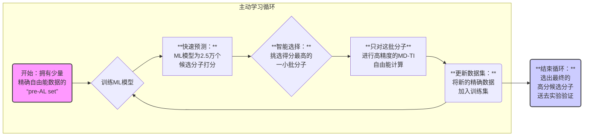

# 【JCIM】主动学习+自由能计算，高效发掘帕金森病新药候选分子

> 导语：面对数以十亿计的潜在药物分子，我们如何才能高效地“大海捞针”？当精准的物理计算遇上聪明的机器学习，一场药物发现的革命正在悄然发生。本文将深度解析一篇发表于*Journal of Chemical Information and Modeling*的研究，看科学家们如何利用“主动学习”这一AI策略，成功为帕金森病的一个新兴靶点找到了8种全新的抑制剂。

### **本文基本信息**

#### **摘要**

富含亮氨酸重复激酶2（Leucine-rich repeat kinase 2, LRRK2）是家族性帕金森病中突变最多的基因，其突变会导致该疾病的病理特征。LRRK2的WDR结构域是一个研究尚浅的帕金森病药物靶点，在计算化学领域寻找苗头化合物的关键评估实验（CACHE）挑战赛的第一阶段之前，没有任何已知的抑制剂。CACHE挑战赛的一个独特优势在于，所有预测的分子都会在内部进行实验验证。在此，我们报告了LRRK2 WDR抑制剂分子的设计和实验确认。我们围绕先前已确认的两个苗头化合物，**利用一个基于优化自由能分子动力学（MD）模拟的主动学习（Active Learning, AL）机器学习（ML）工作流程，并结合热力学积分（TI）框架来扩展化学系列**。在35个经过实验测试的分子中，我们最终发现了8个经过实验验证的新型抑制剂（**命中率高达23%**）。这些结果证明了我们基于自由能的主动学习工作流程在快速、高效地探索大型化学空间，同时最大限度地减少昂贵模拟的数量和时长方面的有效性。该工作流程可广泛应用于筛选任何化学空间中具有更高亲和力的小分子类似物，但需遵循相对结合自由能（RBFE）计算的一般限制。相对于命中化合物的实测抑制常数$K_I$，TI MD计算的平均绝对误差为2.69 kcal/mol。

#### **原文引用信息**

Gusev, F., Gutkin, E., Gentile, F., Ban, F., Koby, S. B., Li, F., Chau, I., Ackloo, S., Arrowsmith, C. H., Bolotokova, A., Ghiabi, P., Gibson, E., Halabelian, L., Houliston, S., Harding, R. J., Hutchinson, A., Loppnau, P., Perveen, S., Seitova, A., Zeng, H., Schapira, M., Cherkasov, A., Isayev, O., & Kurnikova, M. G. (2025). Active Learning-Guided Hit Optimization for the Leucine-Rich Repeat Kinase 2 WDR Domain Based on In Silico Ligand-Binding Affinities. *Journal of Chemical Information and Modeling*, *65*, 5706-5717. https://doi.org/10.1021/acs.jcim.5c00588

CACHE challenge：http://dx.doi.org/10.1021/acs.jcim.4c01267

https://cache-challenge.org/challenges/predict-hits-for-the-wdr-domain-of-lrrk2

### **背景**

#### **关键科学问题**

帕金森病（PD）是全球第二大神经退行性疾病，而LRRK2基因的突变是其重要的遗传风险因素。尽管针对LRRK2激酶结构域的抑制剂已有报道，但其旁边的**WDR结构域却是一个几乎未被探索过的“处女地”靶点**。在药物研发的早期阶段，最大的挑战之一是如何从包含数十亿甚至更多分子的巨大化学文库中，找到能与特定靶点结合的“苗头化合物”。

**图1**：在CACHE挑战赛第一阶段发现并用于后续优化的经实验验证的苗头化合物。

传统的虚拟筛选方法速度快但精度有限；而基于物理的自由能计算（如RBFE）虽然被誉为预测结合亲和力的“金标准”，但其计算成本极其高昂，对每个分子进行计算都无异于“用高射炮打蚊子”。因此，核心的科学问题是：**如何设计一个智能工作流程，既能利用自由能计算的精确性，又能避免其高昂的成本，从而在广阔的化学空间中高效地进行“苗头到先导”的优化？** 

#### **创新点**

本文最大的创新点在于构建并验证了一个**“主动学习-相对结合自由能”（AL-RBFE）计算管线**。它巧妙地将两种技术结合起来：

1. **机器学习（ML）**：训练一个轻量级模型，能够快速、低成本地预测分子的结合能力。
2. **物理模拟（MD-TI）**：进行精确但耗时的相对结合自由能（RBFE）计算，为ML模型提供高质量的训练数据。

其核心思想是：**不再盲目地进行昂贵的物理计算，而是让一个不断学习和进化的ML模型来充当“领航员”，智能地挑选出最有潜力的分子进行精确验证**。这种“少即是多”的策略，旨在以最小的计算代价实现最大的科学发现，并在著名的CACHE挑战赛中一举夺魁。

#### 分子筛选漏斗各阶段数量总结

| **筛选阶段 (Screening Stage)**    | **分子数量 (Number of Molecules)** | **备注 (Notes)**                                             |
| --------------------------------- | ---------------------------------- | ------------------------------------------------------------ |
| **初始化学空间**                  | **~55亿**                          | 来源为 Enamine REAL 数据库 (2022年10月版)。                  |
| **初步SMARTS搜索 (通用类似物)**   | **341281**                         | 基于苗头1和2的骨架进行SMARTS模式搜索，得到的通用类似物总数 (154204 + 187077)。 |
| **初步SMARTS搜索 (最相似类似物)** | **250**                            | 采用更严格的SMARTS模式，搜索与苗头1和2最相似的类似物 (58 + 192)。 |
| **最终主动学习集 (AL Set)**       | **25171**                          | 经过两轮分子对接和过滤后，最终用于主动学习-自由能计算循环的分子库总数 (16101 + 9070)。 |
| **预备主动学习集 (Pre-AL Set)**   | **302**                            | 包含了所有最相似类似物、最近邻搜索和人工挑选的分子，这些分子都计算了相对结合自由能。 |
| **选择进行实验验证的分子**        | **75**                             | 从计算结果中挑选出预测活性最好的70个分子，加上为增加化学多样性而挑选的5个分子，送去进行实验测试。 |
| **实验确认的苗头化合物**          | **8**                              | 在75个被测试的分子中，最终有8个被SPR实验确认为新的LRRK2 WDR结构域抑制剂。 |

### **研究内容：四步解锁高效药物发现**

研究团队设计了一个精巧的四步计算管线，将理论计算与实验验证紧密结合。

#### **第一步：大海捞针——从55亿分子中筛选候选集**

研究的起点是巨大的Enamine REAL数据库，其中包含了约**55亿个**可合成的化合物。为了从中筛选出与两个已知苗头化合物（Hit 1 和 Hit 2）相似的分子，研究者采用了双管齐下的策略：

- **近亲筛选（Closest Analogs）**：使用严格的化学子结构（SMARTS）模式，寻找与苗头化合物结构最相似的“近亲”，共找到约**250个**分子。
- **远亲筛选（General Analogs）**：使用更宽泛的骨架（Murcko scaffold）模式，寻找结构更多样化的“远亲”，初步筛选出约**34万个**分子。

随后，通过分子对接和一系列过滤条件，研究团队将“远亲”候选集缩小到了一个约2.5万个分子的“主动学习集”（AL set），为下一步的智能筛选做好了准备。

#### **第二步：智能导航——主动学习引导的自由能计算**

这是整个研究的“灵魂”所在。传统的做法可能是随机挑选分子进行昂贵的自由能计算，而本文的AL-RBFE工作流则像一个带GPS的智能寻宝系统。

这个循环的精髓在于：

1. **训练（Train）**：用已知的、通过精确物理计算（热力学积分，TI，Pre-AL Set）得到的相对结合自由能（ddG）数据，训练一个机器学习模型。这个模型的目标是学习“分子结构”与“结合强度”之间的复杂关系。
2. **预测（Predict）**：利用训练好的模型，对2.5万个候选分子进行快速打分。这一步成本极低，可以在短时间内完成。
3. **选择（Select）**：根据模型的预测分数，贪婪地选出排名最靠前的一小批（例如几十个）最有希望的分子。
4. **计算（Calculate）**：**只对这批被智能选出的“精英分子”进行高精度的MD-TI自由能计算**。这确保了宝贵的计算资源被用在刀刃上。
5. **迭代（Iterate）**：将新获得的精确计算结果加入到训练数据集中，让模型在下一轮循环中变得更“聪明”。

**这个“训练-预测-选择-计算”的闭环迭代了8次，每一次都让模型对化学空间的理解更深一步，从而能够更精准地指导后续的探索方向**。

**图2. 用于苗头化合物优化的计算方法概述。**

(A) 用于优化两种苗头化合物的计算流程总图（详见正文描述）。对应于**最相似类似物**、**通用类似物**和**RBFE计算**的模块分别以蓝色、灰色和绿色显示。NNS代表最近邻搜索（nearest neighbors search），CS代表人工选择（curated selection）（详见方法第4节）。(B) 用于苗头1和苗头2的最相似类似物和通用类似物的**SMARTS模式**。(C) 苗头1和苗头2的通用类似物的**虚拟筛选**。图中显示了流程中每一步之后，苗头1和苗头2类似物的分子数量。(D) 由主动学习（AL）引导的RBFE计算（**AL-RBFE**）的自动化计算工作流程总图。该工作流程包括两个主要模块：AutoML和MD TI RBFE，以及四个主要步骤。化学空间以二维t-SNE图的形式展示。计算了ΔΔG的苗头1和苗头2的类似物，以彩色方块和三角形表示，颜色方案与图4一致。

#### **第三步：技术细节——自由能微扰与计算优化**

对于计算化学领域的读者，论文中的一些技术细节同样值得关注：

- **巧妙的微扰路径**：在进行炼金术自由能计算（即模拟一个分子“变”成另一个分子）时，研究者发现直接从Hit 1出发进行某些转换会导致结构扭曲和计算失败。为了解决这个问题，他们设计了一个中间体“Ligand X”，通过“Hit 1 → Ligand A → Ligand X → 目标分子”的路径，**成功避免了原子碰撞和不合理的构象，保证了自由能计算的稳定性和可靠性**。
- **动态的资源分配**：为了进一步节省成本，研究团队采用了一种“动态优化”策略。模拟程序可以自动检测计算是否收敛，并按需增加或停止模拟时长，避免了在已经收敛的计算上浪费机时。

#### **第四步：成果展示——从计算到实验验证**

经过8轮主动学习，计算结果令人振奋。

**效率的提升**：从下方的箱形图（图3）可以看出，随着AL迭代的进行（从AL-1到AL-7），计算出的分子结合自由能（ddG）的分布**整体持续向更优（更负）的方向移动**，证明AL确实在引导计算走向“富矿区”。

**图3. 计算得到的MD TI RBFE值与主动学习迭代次数的关系，以箱形图展示。** 在主动学习循环中计算的苗头1（红点）和苗头2（绿点）的类似物展示于图2D中。苗头1和苗头2的RBFE值被设定为0 kcal/mol，并在预备主动学习（pre-AL）步骤中由黑色箭头标出。被选中并提交进行实验评估的两种苗头化合物的类似物，用黑色或品红色的圆圈圈出。品红色显示的是已测得K~D~值的新苗头化合物（见图5和表S3）。

**探索的多样性**：通过t-SNE降维可视化（图4），可以看到AL选择的分子（彩色点）**广泛分布在整个化学空间中，而不是仅仅聚集在初始苗头化合物（紫色圈）周围**。这表明AL不仅在“利用”已知的高分区域，同时也在积极“探索”未知的、具有结构多样性的新区域，这对于发现全新骨架的药物至关重要。

**图4. 主动学习引导下计算得到的TI ABFE值，以苗头1和苗头2类似物化学空间的t-SNE投影图展示。** (A) 苗头1类似物的每一次独立主动学习迭代的t-SNE图。 (B) 苗头2类似物的每一次独立主动学习迭代的t-SNE图。 (C) 所有主动学习迭代的t-SNE图。每个分子以一个点的形式显示。苗头1和苗头2由黑色箭头标出。分子根据其计算出的ABFE值进行着色，其余分子以灰色显示。初始苗头化合物用紫色的圆圈圈出。被选中进行体外实验验证的分子用黑色的圆圈圈出，而已被实验确认的优化后苗头化合物则用品红色的圆圈圈出。

最终，研究团队从**672个经过RBFE计算的分子中挑选了75个进行实验验证**。在成功合成并**测试的35个**化合物中：

- **8个分子被实验证实具有抑制活性**，解离常数$K_D$范围在**18 µM到230 µM**之间。
- **实验命中率高达23%**，这在针对全新靶点的药物发现项目中是一个非常出色的成绩。
- 计算预测的结合自由能**与实验值的平均绝对误差（MAE）为2.69 kcal/mol**，显示了计算方法具有一定的预测能力。

**图5. 实验测得的苗头分子的结合特性。** 图中展示了SPR传感图、含氟化合物的NMR谱图片段（完整谱图见图S2）（10 μM化合物分别与0 μM [黑色] 和 20 μM [红色] 蛋白质混合），以及化学结构。图中还标明了通过DLS测量的化合物溶解度和聚集情况，以及每个化合物是从哪个集合中被识别出来的。

### **关键结论与批判性总结**

#### **关键结论**

1. **AL-RBFE工作流程是真实有效的**：该研究成功地将AI驱动的主动学习与高精度的物理计算相结合，为解决实际的药物优化问题提供了一个强大且高效的范例。
2. **成功攻克全新靶点**：从零开始，针对一个没有任何已知抑制剂的LRRK2 WDR靶点，该方法不仅找到了苗头化合物，还成功地将其拓展为了一个具有8个活性分子的化学系列。
3. **资源效率最大化**：通过智能选择，该方法仅计算了672个分子的自由能，就从一个2.5万个分子的库中识别出了多个活性化合物，极大地节省了计算资源。
4. **为后续研究奠定基础**：这8个新发现的抑制剂，尽管活性仍有待提高，但它们结构新颖、理化性质良好，为进一步优化成高活性的帕金森病候选药物提供了坚实的起点。

#### **批判性总结**

- **优势**：本研究最突出的优点是其**前瞻性和实用性**。它不仅提出了一个先进的计算框架，更重要的是在一个公开、公正的竞赛（CACHE Challenge）中前瞻性地验证了其有效性，这比回顾性研究更具说服力。23%的实验命中率充分展示了该方法的强大预测能力。
- **局限与展望**：
  - **活性仍需提升**：目前发现的抑制剂活性多处于**中低微摩尔（µM）级别**，距离成为真正的临床候选药物还有很长的路要走，需要进一步的药物化学优化。
  - **计算精度**：2.69 kcal/mol的平均绝对误差在当前领域属于可接受范围，**但仍有提升空间**。作者也指出，该误差值受到了两个离群值较大的影响，排除后误差可降至1.66 kcal/mol。这提示我们，自由能计算的力场和模拟方案仍需不断完善。
  - **统计显著性**：尽管AL选择的分子在命中率上远超“pre-AL”组（**8个命中里有7个来自AL**），但作者坦诚，由于样本量较小，尚不能从统计学上得出AL优于其他选择策略的结论，尽管趋势非常明显。

> 小编点评：
>
> - 方法还是那一套方法，docking部分可以借鉴一些，Schrodinger很多使用那些约束骨架的docking，对FEP计算非常有用。同时也发现他们也手动挑选化合物了
> - AL+FEP已经很多人在用了，得抓紧时间跟上，加实验发个JCIM没啥问题。
> - 看到人家发文章也都远远500个mutation起步，还是得多算
> - FEP/TI也越来越讲究动态调整模拟时间和λ windows，得快点有个软件能自己用
> - 本文用的机器学习方法有点太简单了，我还是有机会的。每一轮都可以用不同的模型（最好的那个）；每一轮也就100个数据点，看来不用那么多？
> - 最终实验亲和力也不是那么突出，命中率还行。是不是AL的贡献不知道，但感觉ddG几轮下来并没有太降低，可能是在局部最小的往外爬？还没有原始hit亲和力高呢
> - 2.69 kcal/mol的误差有点大，但人家是有些多步mutation的，可能多样性还行
> - 反正基础库和突变体库以后肯定是要自动生成的，不能再手动设计了，这篇还是更偏RBFE能算的变化小的，less偏虚拟筛选

### 研究方法学（Methods）总结

#### **4.1 数据库筛选与文库准备**

本研究的计算流程核心是筛选两个分子集合：**pre-AL集**（包含与苗头化合物Hit 1和Hit 2最相似的类似物）和**AL集**（包含结构更多样化的普适类似物）。这两个集合最终都用于主动学习引导的相对结合自由能（AL-RBFE）计算。

##### **4.1.1 最近似物（Closest Analogs）的虚拟筛选**

该部分旨在构建一个高质量的初始训练集（pre-AL set）。

1. **SMARTS搜索**：首先，在包含55亿化合物的Enamine REAL数据库中，使用基于Hit 1和Hit 2化学结构的**SMARTS模式**进行搜索。这些模式保留了关键的药效团（如草酰胺、肽键）和芳香性，但**允许重原子替换**，从而找到结构最相似的“近亲”。此步骤为Hit 1和Hit 2分别找到了58和192个最近似物。
2. **最近邻搜索（NNS）**：为了增加Hit 1类似物的多样性，研究者将当时**已计算出较好结合能的Hit 1类似物**作为“查询分子”，在更大的普适类似物库中寻找它们的最近邻（基于ECFP6指纹和Tanimoto距离），额外获得了27个独特的分子。
3. **人工挑选（CS）**：在完成初步的RBFE计算后，研究者以结合能最佳的“配体A”（Ligand A）为母核，通过**人工审视**的方式，挑选了一批在1,2,3,4-四氢异喹啉环上**有不同取代基的类似物**，又增加了49个分子。
4. **pre-AL集的形成**：综合以上三个步骤，最终形成的**pre-AL集**共包含302个分子（134个Hit 1类似物，168个Hit 2类似物），这些分子都经过了RBFE计算，作为主动学习的“种子数据”。

##### **4.1.2 普适类似物（General Analogs）的虚拟筛选**

该部分旨在构建一个巨大且多样化的候选池（AL set），供主动学习算法探索。

1. **SMARTS搜索**：使用更宽泛的、基于**Murcko骨架**的SMARTS模式在Enamine REAL数据库中进行搜索，允许任意重原子替换，只要保持芳香性模式。此步骤为Hit 1和Hit 2分别筛选出约15.4万和18.7万个普适类似物。
2. **无模板对接（Template-Free Docking）**：使用Glide SP软件，将上述分子对接到LRRK2 WDR结构域的晶体结构（PDB ID: 6DLO）上。对接后进行严格筛选，保留满足以下条件的分子：(1) 关键的吲哚环与苗头化合物的MD代表性构象偏差（RMSDindole）小于等于5 Å；(2) Glide对接分数小于等于-6。此步骤将候选库缩小至约2.2万（Hit 1）和2.7万（Hit 2）个分子。
3. **模板对接（Template Docking）**：为了进一步提高对接姿势的准确性，研究者使用OpenEye HYBRID软件进行模板对接，以Hit 1和Hit 2的MD代表性构象作为模板。对接后再次筛选，保留满足以下条件的分子：(1) 广义**Murcko骨架与模板的偏差**（RMSDMurcko）小于等于4 Å；(2) OpenEye对接分数小于等于-6；(3) 分子与蛋白的碰撞（clash）分数小于等于0.5。
4. **AL集的形成**：经过模板对接和筛选，并去除重复及带电荷的分子后，最终形成了包含**25,171个分子**的**AL集**（16,101个Hit 1类似物，9,070个Hit 2类似物），作为主动学习算法的“探索空间”。

#### **4.2 炼金术相对结合自由能（RBFE）计算**

##### **4.2.1 分子动力学（MD）模拟**

1. **初始结构与参数化**：使用先前在CACHE挑战赛第一阶段获得的对接复合物结构作为MD模拟的起始点。
2. **力场与溶剂**：蛋白使用**FF14SB**力场，水分子使用**TIP3P**模型，配体则使用**GAFF2**力场和**AM1-BCC**电荷模型。
3. **模拟流程**：使用AMBER 20的`pmemd.cuda`模块进行GPU加速模拟。标准流程包括：能量最小化、NVT系综下的升温、NPT系综下的密度平衡，以及最终在**NVT系综下进行100 ns的生产性模拟**。
4. **代表性结构提取**：舍弃前10 ns的轨迹，对后90 ns的蛋白Cα原子和配体重原子坐标进行平均，得到一个平均结构。然后从轨迹中提取与该平均结构RMSD最小的一帧，作为后续计算的**代表性结构**。

##### **4.2.2 配体准备与参数化**

使用RDKit进行参照分子和目标分子间的原子映射，并利用**FESetup**软件包生成蛋白-配体复合物和溶剂化配体体系的拓扑和坐标文件。力场和电荷模型与MD模拟部分保持一致。

##### **4.2.3 热力学积分（TI）模拟**

1. **λ调度**：所有模拟均采用包含软核势（softcore potentials）的**9点高斯求积λ调度**。
2. **动态资源优化**：这是本研究的一个关键效率优化点。研究者采用了一种**“动态飞行中（on-the-fly）”的计算资源优化策略**。该方法首先进行一个**较短的初始模拟**（如2.5 ns），然后通过算法**自动检测模拟是否平衡**以及计算是否收敛（通过比较前后两半时间序列的Jensen-Shannon距离）。如果未达到收敛标准，则**自动增加一小段模拟时长**（如0.5 ns），并重复检测，直至收敛。这极大地避免了在已收敛的计算上浪费机时。
3. **多副本处理**：当计算资源允许时，会对一些转换（尤其是预测结合能较好的）进行多次重复模拟。最终的ddG通过集合方法计算，即合并所有重复模拟的梯度时间序列数据，以获得更稳健的均值。

#### **4.3 主动学习（AL）文库构建：ML引导的选择**

##### **4.3.1 分子表示与ML算法**

1. **分子特征化**：为了让机器学习模型能“读懂”分子，研究者使用了多种分子指纹技术，包括：RDKit路径指纹、Morgan指纹（ECFP6）、3D分子指纹（E3FP）以及2D和3D的药效团指纹。
2. **机器学习算法**：采用了scikit-learn库中的三种经典算法：线性回归、随机森林和高斯过程回归（使用Tanimoto核）。

##### **4.3.2 机器学习建模**

1. **迭代训练**：在AL的每一次循环中，模型都会在所有已获得精确ABFE（由RBFE转换而来）数据的分子上进行训练。

2. **模型选择**：通过**留一法交叉验证（LOOCV）**，在所有分子表示和ML算法的组合中，选择R2分数最高的模型作为当次迭代的最佳模型。

3. 筛选策略

   - 在AL迭代1-6轮，模型仅在Hit 1的衍生物上训练，并仅用于筛选AL集中属于Hit 1的16101个类似物。
   - 在第7轮，模型在Hit 1和Hit 2的所有衍生物上训练，并用于筛选整个AL集。
   - 选择方式为**贪婪选择**，即直接挑选出模型预测结合能最负（最优）的一批化合物进入下一轮的精确TI计算。

#### **4.4 实验验证分子的选择**

根据挑战赛的预算（75个分子或10000美元），研究者挑选了最终提交的分子列表。其中，**70个分子完全基于计算出的ABFE值进行贪婪选择**（67个Hit 1衍生物，3个Hit 2衍生物），另外**5个分子则在具有负ABFE值的Hit 2衍生物中，偏向于化学多样性进行选择**。

#### **4.5 实验方法**

1. **蛋白表达与纯化**：在Sf9昆虫细胞中表达LRRK2 WDR结构域蛋白，并通过亲和层析（Ni-NTA）和尺寸排阻色谱进行纯化，最终通过SDS-PAGE和质谱确认纯度和大小。
2. **表面等离子共振（SPR）**：使用Biacore 8K仪器评估化合物的结合亲和力。将生物素化的LRRK2蛋白固定在芯片上，然后将一系列稀释的化合物流过芯片表面，通过监测响应信号的变化，使用1:1结合模型拟合动力学曲线并计算解离常数KD。
3. **动态光散射（DLS）**：用于评估化合物的溶解度和聚集情况，确保SPR信号不是由化合物聚集引起的假阳性。
4. **19F-NMR光谱**：对于含氟的化合物，使用19F-NMR作为**正交验证方法**。通过观察加入蛋白后19F信号的展宽或化学位移变化，来独立地确认化合物与蛋白的结合。