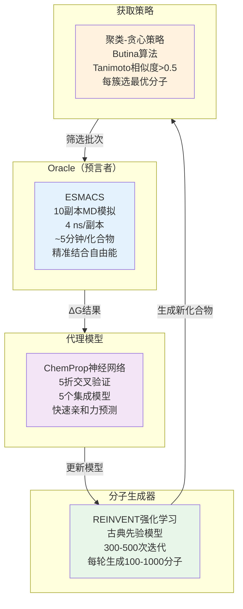

  
# 生成式主动学习+物理模拟：AI与精准计算协力加速新药设计

## 本文信息

- **标题**: Optimal Molecular Design: Generative Active Learning Combining REINVENT with Precise Binding Free Energy Ranking Simulations
- **作者**: Hannes H. Loeffler, Shunzhou Wan, Marco Klähn, Agastya P. Bhati, Peter V. Coveney
- **发表时间**: 2024年9月（J. Chem. Theory Comput.）
- **单位**: AstraZeneca分子AI部门（瑞典）、伦敦大学学院计算科学中心（英国）
- **引用格式**: Loeffler, H. H., Wan, S., Klähn, M., Bhati, A. P., & Coveney, P. V. (2024). Optimal Molecular Design: Generative Active Learning Combining REINVENT with Precise Binding Free Energy Ranking Simulations. *Journal of Chemical Theory and Computation*, *20*(19), 8308–8328. https://doi.org/10.1021/acs.jctc.4c00576

## 摘要

> 主动学习（AL）是一种**序列实验设计策略**，利用机器学习智能地选择需要评估的下一批分子结构，有效模拟实验室中的**设计-制造-测试-分析（DMTA）循环**。本研究描述了一个将**生成式分子AI（REINVENT）与物理精算绝对结合自由能计算（ESMACS）**相结合的主动学习框架，称为**生成式主动学习（GAL）**。在**全球首台超算Frontier**上，该协议成功发现了两个靶点（3CLpro和TNKS2）的新型高效配体，这些分子**不仅结合亲和力超越初始模型，而且化学空间分布完全不同**，显示了物理约束与AI生成的协同优势。通过系统改变批大小参数，研究提供了不同应用场景下的最优效率建议。

### 核心结论

- **GAL框架的有效性**：在两个差异化靶点上，生成式主动学习都能成功发现结合亲和力更优的新分子，且化学结构多样性高
- **批大小的关键影响**：对于开放型结合口袋（3CLpro），小批大小（n=250）效率更高；对于封闭型口袋（TNKS2），较大批大小能提升精度但增加计算成本
- **快速收敛特性**：TNKS2仅需3-4次迭代即可收敛，3CLpro需5-7次，远低于传统虚拟筛选
- **物理精算的必要性**：Docking评分与ESMACS相关性极弱，表明**物理计算对驱动高质量分子生成至关重要**
- **代理模型质量与靶点结构的耦合**：靶点口袋的约束性越强，代理模型预测精度越高，GAL整体效率越优

---

## 背景

### 药物发现中的计算加速困境

传统的药物发现遵循**设计-制造-测试-分析（DMTA）循环**，这是一个**迭代、缓慢、昂贵的过程**。每次设计新化合物都需要实验评估，周期长达数月，投入巨大。计算机辅助药物设计（CADD）应运而生，但面临核心难题：

- **虚拟库规模爆炸**：商业库动辄数百万甚至数十亿化合物，传统虚拟筛选无法遍历
- **评估函数精度不足**：Docking等快速评分方法与实验关联性差（本研究中Spearman相关系数仅0.08）
- **化学空间探索有限**：固定库只能覆盖已合成分子，无法发现新颖性强的化合物
- **采样-精度的平衡**：高精度方法（如MM-PBSA）计算昂贵，难以大规模应用

### 主动学习的理论基础

**主动学习**（AL）打破了被动数据标注的枷锁。其核心思想是：**不盲目标注海量数据，而是智能地选择最具信息价值的样本**进行昂贵计算，逐步优化代理模型。在药物发现中，AL的逻辑链条是：

1. **Oracle（预言者）**：精准但昂贵的计算方法（如分子动力学结合自由能计算）
2. **代理模型**：快速但精度有限的机器学习模型（如神经网络QSAR）
3. **获取函数**：智能选择下一批候选化合物的策略
4. **迭代优化**：循环运行，逐步收敛到高质量分子

### 生成式AI与强化学习的融合

传统AL依赖**固定库池**，而**REINVENT**引入了**生成式前沿**：通过**强化学习（RL）**，该模型能够即时生成满足目标属性的新型化合物，不受合成库限制。这意味着：

- **化学空间无限**：从分子图表示（SMILES）生成，理论上可探索所有可合成分子
- **先验知识驱动**：预训练的“先验”模型被RL逐步微调向目标方向
- **评分函数驱动**：多个评分项（结合亲和力、药物性、合理性）加权聚合

---

## 关键科学问题

本研究旨在回答药物发现实践中的根本问题：

1. **能否在主动学习框架中有效整合生成式AI和物理模拟？** 两种范式（快速生成 vs. 精准评估）的协同效果如何量化？
2. **批大小（每轮提交多少化合物给Oracle）如何影响效率？** 小批高迭代 vs. 大批低迭代，孰优孰劣？
3. **靶点结构特征对GAL性能的影响程度有多大？** 开放vs.封闭的结合口袋是否导致截然不同的行为？
4. **在超算上实现的GAL是否具有实际药物发现价值？** 生成的分子是否真正新颖且可合成？

---

## 创新点

- **首个完整的GAL范式展示**：在药物发现领域系统展示生成式AI（REINVENT）与物理精算（ESMACS）的端到端整合，非概念验证而是实战应用
- **超算尺度的实现**：在Frontier（全球首台艾字节级超算）上部署，单次迭代仅需50分钟墙钟时间评估数百化合物，计算量~2毫秒
- **系统的批大小分析**：首次在两个代表性靶点上对比5种不同批大小（100-1000），给出精度-效率权衡的定量建议
- **靶点结构的影响揭示**：通过对比开放型（3CLpro）和封闭型（TNKS2）结合口袋，深入讨论了蛋白质约束性对代理模型质量和GAL收敛的直接影响
- **真实新颖性验证**：生成分子与原始库的Tanimoto相似度<0.13，证明了**真正的结构创新而非模式复制**

---

## 研究内容

### 方法论框架：GAL工作流

该研究建立的**GAL循环**由四个关键组件组成：

**工作逻辑**：每一轮GAL包括 (1) 评估当前批次的化合物结合亲和力→ (2) 用真实数据更新代理模型→ (3) 用强化学习生成新批次→ (4) 通过聚类和贪心策略选择最有潜力的子集→ (5) 循环回到第1步。

**图1：生成式主动学习的整体工作流**

GAL框架从右上方开始：ESMACS评估一组化合物的结合亲和力，将结果与其ΔG值用于更新ChemProp代理模型（右下）。REINVENT利用古典强化学习先验和经过更新的ChemProp评分函数，通过内层强化学习优化循环在左边生成新分子，外层是主动学习算法本身。新生成的候选物通过Butina聚类和贪心选择策略筛选，再回到评估步骤。

### 两个代表性靶点的对比

#### 3CLpro（SARS-CoV-2主蛋白酶）

**靶点特征**：**大型开放结合口袋**，允许多种配体结合模式

- 初始模型：基于~10,000个Docking评分最优的化合物
- 测试批大小：250和500分子/轮
- 迭代轮数：7轮
- 总Oracle调用：3,500和1,750次

**关键结果**：
- 代理模型初期精度低（Spearman ρ~0.1），后期恢复到0.62（n=250）和0.39（n=500）
- 生成分子结合自由能从初始约-30 kcal/mol逐步改善至**-56 kcal/mol**（相对于最优种子库提升>5 kcal/mol）
- 化学多样性保持高水平（平均Tanimoto相似度<0.35），**与种子库差异度极大**（<0.13）
- 小批大小（n=250）表现出**更高的计算效率**（每次Oracle调用发现的结构簇数更多）

**图2：代理模型精度逐轮改进**

对比n=250（绿色）和n=500（蓝色）两种批大小，ChemProp代理模型对ΔG的预测精度逐轮提升。Spearman相关系数从初期0.1恢复到0.62（n=250）或0.39（n=500）。这是**3CLpro最关键的指标**，反映了数据驱动模型如何逐步学习配体-蛋白复杂关系。

**图4：结构多样性与聚类分析**

四个子图展示3CLpro的核心演变轨迹：
- **(a)** ΔG分布的逐轮改善（绿=n=250，蓝=n=500）
- **(b)** Tanimoto相似度分布：内部相似度<0.35，保持高多样性
- **(c)** 结构簇数随迭代递减，表明**收敛到少数高质量簇**
- **(d)** 生成分子与初始库的相似度<0.13，证明**真正的新颖性而非模式复制**

**图6：化学空间演变（t-SNE可视化）**

使用Morgan指纹的t-SNE投影清晰展示：
- **蓝色**：初始种子化合物聚集在紧凑区域
- **红/橙/黄**：生成分子**大幅扩展到外围**，形成多个分离簇
- 充分证明了**GAL能突破已知化学空间的边界**

这些图表共同展示了3CLpro从困难收敛到逐步优化的全过程。

#### TNKS2（Tankyrase-2，PARP家族蛋白）

**靶点特征**：**狭窄封闭结合口袋**，限制了配体的结合模式多样性

- 初始模型：基于27个实验验证的同系物（使用QSARtuna随机森林）
- 测试批大小：100、300、500、700、1,000分子/轮
- 迭代轮数：4-5轮（快速收敛）
- 总Oracle调用：较少但更精确

**关键结果**：
- 代理模型质量显著优于3CLpro（Spearman ρ > 0.7，R² > 0.6在第1轮后）
- **仅需单次迭代**就实现显著改善（对比3CLpro需多轮）
- 生成分子结合自由能达**-47 kcal/mol**（超过所有27个实验验证的种子）
- **大批大小导致更深的化学空间收敛**：n≥500的多轮试验收敛到相同区域，n=700则稍偏移
- 生成分子中**腈基和桥环等特殊取代基**被反复发现，表明它们是该口袋的关键优化群体

**图9：TNKS2代理模型的快速精准提升**

对比n=100、500、1000三种批大小，ChemProp在TNKS2上的表现远优于3CLpro。Spearman相关系数>0.7（vs 3CLpro的0.62），R²>0.6（vs 3CLpro的更低值）。**关键差异**在于TNKS2的**一致性结合模式**使得1D SMILES与3D构象有清晰对应。

**图11：TNKS2的多维性能分析**

四个子图汇总TNKS2的关键演变：
- **(a)** 结合自由能分布极速移向低值（单次迭代显著改善）
- **(b)** Tanimoto相似度分布宽度增加，表示**更多样的结构生成**
- **(c)** 结构簇数呈现**快速收敛模式**（vs 3CLpro的缓慢递减）
- **(d)** 与初始27个实验同系物的相似度<0.3，多数为**全新支架**

**图13：TNKS2的化学空间拓展**

t-SNE可视化对比3CLpro的多簇分散，TNKS2展现：
- **黄色**：初始10000个种子化合物聚集
- **浅蓝色**：27个实验验证配体占据极小区域
- **多彩点**：生成分子虽然向外扩展，但范围**相对集中**（反映封闭口袋的约束性）

这揭示了**口袋拓扑结构直接决定化学空间探索的广度**。

**靶点对比的深层洞察**：
- **3CLpro**：开放口袋→多种结合模式→代理模型难以学习→需更多迭代
- **TNKS2**：封闭口袋→一致结合模式→代理模型快速精准→少轮次收敛

### 批大小的效率权衡

研究定义了**计算效率指标** $\eta = \frac{N_{CG,\Delta G_{\max}}}{n_{\text{oracle}}}$，其中$N_{CG}$为满足结合亲和力和相似度阈值的结构簇数，$n_{\text{oracle}}$为Oracle调用次数。

通过**多场景参数扫描**（两个ΔG阈值×两种相似度截断），研究系统评估了不同批大小在多样性探索（hit finding）和亲和力优化（lead optimization）两种应用场景下的表现。

**结论**：
- **3CLpro**：小批大小（n=250）在**所有情景下效率最高**
- **TNKS2**：小批大小（n=100）在多数情景下最优，但在严格亲和力条件下n≥500超越
- **实践建议**：当代理模型质量**难以预知**时，**小批大小（100-250）是更安全的选择**，能在探索和精细化之间取得平衡

### 代理模型质量的关键因素

TNKS2代理模型显著优于3CLpro的根本原因在于**靶点蛋白的结构特性**（详见附录的深层分析）：封闭口袋建立了SMILES与3D结合姿态的清晰对应，高质量的初始数据来自实验验证，以及明确的优化目标。这与3CLpro的开放结构、Docking初始数据的噪声、以及多模式竞争形成鲜明对比。

## 关键发现的反思

### 物理精算的核心价值

本研究的一个重大发现是**Docking与ESMACS的巨大差异**：
- Docking评分：Spearman ρ = 0.08（几乎无相关性）
- ESMACS评分：Spearman ρ = 0.33（中等相关）

**为什么这很重要？** 虽然ESMACS的绝对精度仍有限，但**相对排序能力**足以驱动强化学习找到更好的分子。物理计算提供的是：
- **结构-能量关联的物理基础**（而非Docking的黑盒碰撞几何）
- **代理模型的高质量训练信号**（相比低质量Docking标注）
- **规避虚假优化**（RL不会因为Docking的任意性而陷入孤立死胡同）

### 生成式AI的局限性

REINVENT生成分子时**知识有限**：
- 不支持立体化学（所有生成分子均无手性中心）
- 不包含蛋白质结构信息（仅基于配体结构与亲和力）
- 缺少合成性评估（本研究中某些分子可能难以合成）

**这反过来解释了为何代理模型质量至关重要**：强化学习需要良好的评分信号来弥补生成器的信息缺陷。

### 化学空间探索的启示

GAL的一个独特优势是**可探索前所未有的化学空间**，而非被限制在已知分子的相似性范围内。研究中的t-SNE可视化清晰显示：
- **初始库**（蓝色）聚集在一个紧凑区域
- **生成分子**（红/橙/黄）向外大幅扩展，形成多个分离的簇
- **不同批大小导致的不同收敛点**表明：强化学习的**随机性保证了多样性**

这对药物发现的意义是：**当热点靶点的已知配体陷入某个局部SAR极值时，GAL能自动跳出，在全新化学空间寻找突破**。

---

## 关键结论与未来方向

### 主要成就

1. **范式融合**：首次在工业规模上展示了**生成式AI + 物理精算 + 主动学习**的三位一体，打破了各自为政的局面
2. **超算驱动**：证明在Frontier级超算上，GAL的墙钟时间与小型实验室规模相当，成本可控
3. **靶点适应性**：系统揭示了**蛋白质结构约束性**对AI-物理协作的深刻影响，提供了定性预测能力
4. **效率量化**：为不同应用场景（hit finding vs. lead optimization）提供了批大小选择的定量证据

### 局限性

- **合成性未评估**：生成分子虽然新颖，但未经Retrosynthesis检验（建议集成AiZynthFinder）
- **代理模型静态化**：未尝试层冻结或持续学习，每轮从零训练（可优化）
- **超算依赖**：50分钟/轮的效率对无超算访问的群体无益（需研发GPU集群优化）
- **药物性约束薄弱**：仅用QED+构象过滤，缺少PK/PD/毒性模块（实际应用需补充）
