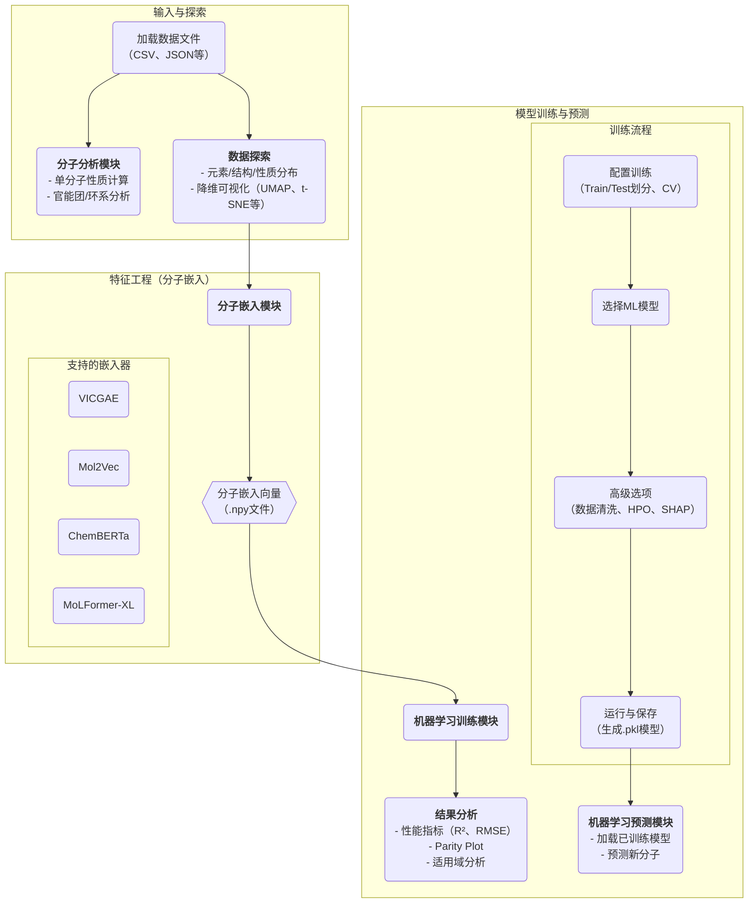

# ChemXploreML：一款“开箱即用”的桌面软件，让分子属性预测迈向自动化与平民化

## 本文信息

  - **标题**: 使用ChemXploreML的机器学习流程进行分子属性预测
  - **作者**: Aravindh Nivas Marimuthu and Brett A. McGuire
  - **发表时间**: 2025年5月20日
  - **单位**: 麻省理工学院化学系 (美国)，美国国家射电天文台 (美国)
  - **引用格式**: Marimuthu, A. N., & McGuire, B. A. (2025). Machine Learning Pipeline for Molecular Property Prediction Using ChemXploreML. *Journal of Chemical Information and Modeling*, *65*, 5424–5437. [https://doi.org/10.1021/acs.jcim.5c00516](https://doi.org/10.1021/acs.jcim.5c00516)
  - **软件与数据链接**:
      * **ChemXploreML文档**: [https://aravindhnivas.github.io/ChemXploreML-docs/](https://aravindhnivas.github.io/ChemXploreML-docs/)
      * **ChemXploreML软件发布**: [https://github.com/aravindhnivas/ChemXploreML/releases](https://github.com/aravindhnivas/ChemXploreML/releases)
      * **数据集与模型文件**: [https://zenodo.org/doi/10.5281/zenodo.15007626](https://www.google.com/search?q=https://zenodo.org/doi/10.5281/zenodo.15007626)

## 摘要

> 我们在此推出ChemXploreML，一个为基于机器学习的分子属性预测而设计的模块化桌面应用程序。该框架的灵活架构允许将任何分子嵌入技术与现代机器学习算法相集成，使研究人员无需深厚的编程专业知识即可定制其预测流程。为了展示该框架的能力，我们实现并评估了两种分子嵌入方法——Mol2Vec和VICGAE（方差-不变性-协方差正则化的GRU自编码器）——并结合了最先进的基于树的集成学习方法（梯度提升回归、XGBoost、CatBoost和LightGBM）。我们使用五个基本分子性质——熔点、沸点、蒸气压、临界温度（CT）和临界压力——作为测试案例，在来自《CRC化学与物理手册》的数据集上验证了我们的框架。对于分布良好的性质，模型取得了优异的性能，其中CT预测的$R^2$值高达0.93。值得注意的是，虽然Mol2Vec嵌入（300维）提供了略高的精度，但VICGAE嵌入（32维）表现出相当的性能，同时计算效率显著提高。ChemXploreML的模块化设计便于轻松集成新的嵌入技术和机器学习算法，为定制化的属性预测任务提供了一个灵活的平台。该应用程序通过直观的界面，自动化了化学数据预处理（包括基于UMAP的分子空间探索）、模型优化和性能分析，使得复杂的机器学习技术变得触手可及，同时为高级化学信息学用户保留了可扩展性。

## 背景

在化学科学中，快速准确地预测分子性质，对于筛选化合物、加速新材料和新药物的发现至关重要。熔点（MP）、沸点（BP）、蒸气压（VP）、临界温度（CT）和临界压力（CP）等基本物理化学性质是理解分子行为的基础，无论在工业应用还是理论研究中都不可或缺。然而，通过传统实验方法测定这些性质不仅耗时费力，成本也十分高昂，这极大地限制了我们探索广阔化学空间的能力。

机器学习（ML）的崛起为分子属性预测带来了革命性的变化。其核心挑战在于如何将分子的化学结构转化为机器能够理解的数字“语言”，即**分子嵌入（molecular embedding）**，同时最大限度地保留关键的化学信息。近年来，诸如Mol2Vec和VICGAE（方差-不变性-协方差正则化的GRU自编码器）等先进的嵌入技术应运而生，它们能够将分子映射到高维向量空间中，为精准预测奠定了基础。

然而，一个成功的预测任务不仅依赖于好的分子表示和ML算法，更需要一个**完整、稳健的工作流**，它涵盖了从数据清洗、预处理、模型选择、超参数优化到性能评估的每一个环节。对于许多化学家而言，搭建这样一个复杂的计算流程需要跨领域的编程和数据科学知识，技术门槛相当高。因此，目前迫切需要一个能够将这些复杂步骤集成并自动化的工具，让化学研究者可以专注于化学问题本身，而不是纠缠于代码和算法细节。

## 关键科学问题

能否开发一个**模块化的、用户友好的桌面应用程序**，将从数据预处理、分子嵌入、模型训练、超参数优化到结果可视化的整个机器学习流程集成起来，从而**降低分子属性预测的技术门槛**，使其能够被更广泛的化学研究者使用？

同时，利用这样一个统一的平台，不同的分子嵌入技术（如高维的Mol2Vec和低维的VICGAE）在与先进的树模型结合进行属性预测时，它们在**预测精度**和**计算效率**之间存在怎样的具体权衡关系？

## 创新点

  - **发布ChemXploreML软件**：开发并推出了一款功能全面、模块化的桌面应用程序，旨在实现分子属性预测流程的自动化和“平民化”，其内置了包括九种降维算法在内的丰富数据探索工具。

  - **系统性评估嵌入技术**：在统一的软件框架下，对两种代表性的分子嵌入方法——**Mol2Vec（无监督、高维）和VICGAE（自编码器、低维）**——进行了并排的性能基准测试。

  - **揭示精度与效率的权衡**：明确量化了不同嵌入方法在性能上的权衡关系：高维的Mol2Vec在精度上略胜一筹，而低维的VICGAE在性能相当的情况下，计算速度**快了近10倍**，为不同应用场景（如高通量筛选）提供了选择依据。

## 研究内容

### 核心工具：ChemXploreML的功能与架构

ChemXploreML旨在将复杂的ML工作流封装在一个直观的桌面应用中。它主要由**分子嵌入**、**机器学习训练**和**分子分析/探索**三大核心模块组成。

ChemXploreML软件提供了从数据输入到模型预测的端到端解决方案，其核心功能和内置工具包括：

  * **丰富的分子嵌入器**：内置了包括**VICGAE、Mol2Vec、ChemBERTa、MoLFormer-XL**在内的四种SOTA嵌入模型。
  * **全面的机器学习模型库**：支持从**线性模型**、**支持向量机**、**近邻算法**到\*\*高级梯度提升框架（XGBoost、LightGBM、CatBoost）\*\*等多种算法。
  * **强大的数据探索工具**：除了基本的数据集统计分析，软件还集成了**九种降维算法**用于化学空间的可视化探索。
  * **自动化的工作流程**：通过**Optuna**进行超参数优化，通过**Cleanlab**进行数据清洗，通过**SHAP**进行模型解释，将复杂的ML操作流程化、自动化。

#### 核心概念深度解析：高级功能模块

##### 智能数据清洗：Cleanlab算法

  * **是什么？**
    Cleanlab是一种先进的机器学习算法，专门用于**自动检测和修正数据集中错误的标签（label）**。在化学属性预测任务中，“标签”就是我们希望模型预测的目标值，例如实验测得的熔点。由于实验或记录错误，这些标签有时会是错误的，这种情况被称为**标签噪声（label noise）**。

  * **工作原理**
    Cleanlab的核心是**置信学习（Confident Learning）框架。其基本思想是：如果一个模型在交叉验证中，能够持续且自信地**将某个数据点预测为A类，但它的真实标签却是B类，那么这个数据点的标签B就很有可能是错误的。Cleanlab通过系统性地估计每个数据点的噪声概率，来识别出这些“可疑”的样本。

  * **在ChemXploreML中的作用**
    在ChemXploreML中启用Cleanlab功能，软件会在模型训练前自动运行该算法，识别并移除那些标签可能错误的分子。这相当于在投喂给模型“学习资料”之前，先请了一位“自动审校员”修正错误，从而确保模型学习到的是更干净、更准确的结构-性质关系，最终提升其预测的准确性。

##### 模型可靠性评估：适用域分析（AD）

适用域（Applicability Domain, AD）定义了模型能够做出可靠预测的“化学空间”范围。如果一个新分子的特征超出了这个范围，模型对它的预测就可能是不可信的外插。ChemXploreML通过计算杠杆值和马氏距离来帮助用户评估AD。

  * **杠杆值（Leverage Value）**
    杠杆值是统计学中用于回归诊断的一个指标，它衡量了**一个数据点在特征空间（X空间）中的极端程度**。一个数据点的杠杆值越大，说明它的\*\*分子特征（即其嵌入向量）\*\*相对于训练集中的所有分子来说越“特立独行”或“异常”。在预测时，如果一个新分子的杠杆值过高，说明它落在了模型的适用域之外，模型在训练时很少见过类似结构的分子，因此其预测结果的置信度较低。

  * **马氏距离（Mahalanobis Distance）**
    马氏距离是一种更高级的距离度量，它在计算时**考虑了特征之间的相关性以及数据分布的方差**。它衡量的是一个点距离数据云中心的“统计学距离”。一个大的马氏距离意味着这个分子在多维特征空间中是一个统计学上的离群点。与杠杆值一样，它也是判断一个新分子是否在AD内的重要指标，对于衡量一个分子是否为离群点更为稳健。

### 化学空间探索：高维数据的降维与可视化

ChemXploreML的降维模块提供了一套强大的算法，将高维的分子嵌入向量投影到二维或三维空间，从而实现对化学空间的可视化。

软件支持以下九种降维方法，每种方法在保持数据结构（局部/全局）和计算速度方面各有千秋：
| 方法 | 核心描述 | 局部/全局结构保持 | 速度 |
| :--- | :--- | :--- | :--- |
| **PCA** | 线性技术，最大化保留数据方差。 | 中/优 | 快 |
| **UMAP** | 非线性流形学习，平衡保持局部和全局结构。 | 优/中 | 快 |
| **t-SNE**| 非线性技术，擅长可视化数据的聚类结构。 | 优/差 | 慢 |
| **KernelPCA**| 使用核方法的非线性PCA。 | 良/良 | 较慢 |
| **PHATE** | 基于热扩散，擅长可视化数据中的轨迹和演变趋势。 | 良/优 | 中 |
| **ISOMAP** | 非线性技术，保持点之间的测地线距离。 | 优/良 | 中 |
| **Laplacian Eigenmaps**| 通过构建图来保持局部流形信息的光谱方法。 | 优/差 | 快 |
| **TriMap** | 使用三元组约束来同时保持局部和全局结构。 | 优/良 | 快 |
| **Factor Analysis** | 线性统计方法，用于发现潜在的“因子”变量。 | 有限/良| 快 |

本研究的作者**特意选用了UMAP**，因为它能很好地捕捉化学空间中复杂的非线性结构-性质关系，在保持局部聚类和全局拓扑结构之间取得了很好的平衡，且计算速度快。

**图1：五种热力学性质数据集的元素组成和结构分布分析。左侧面板显示元素频率分布，其中碳（C）、氧（O）和氮（N）是所有数据集中最主要的元素。右侧面板显示分子大小分布的核密度估计图，以及指示结构组成的饼图：非环状（橙色）、芳香性（蓝色）和环状非芳香性（绿色）化合物。

**图2：数据集中分子性质的分布分析。主图显示了熔点（MP, °C）、沸点（BP, °C）、蒸气压（VP, kPa at 25 °C）、临界压力（CP, MPa）和临界温度（CT, K）的频率分布。插图中的Q-Q图评估了每个分布的正态性，线性排列表示符合正态分布。计算出的偏度值揭示了不同程度的分布对称性，偏度值越接近零表示分布越对称。**

**图3：UMAP投影图，展示了五种不同性质的分子嵌入的聚类模式。每个子图代表一个二维的高维分子数据表示，其中的点根据其各自的属性值进行着色。**

**注意：此处选择的色图因其高视觉对比度而被使用。**
UMAP的可视化结果（图3）直观地证明了其有效性。图中每个点代表一个分子，颜色代表其属性值。性质相近的分子在二维投影空间中也倾向于聚集在一起，形成了从蓝色（低值）到红色（高值）的平滑过渡区域，清晰地揭示了嵌入向量所捕捉到的结构-性质关系。

### 模型性能基准测试

**表3：不同回归模型在各项分子性质上的优化超参数。

**图4：使用Mol2Vec嵌入的梯度提升回归器在MP预测任务上的超参数优化景观图，通过Optuna的等高线图进行可视化。该优化空间探索了关键的GBR参数。较暗的区域代表最小化目标函数（RMSE）的更优参数组合。每个子图中的灰点代表实际采样的超参数组合。**

ChemXploreML集成的Optuna能够自动寻找最优的模型超参数组合。图4展示了这一过程的可视化结果，其中深色区域代表能使模型误差最小化的“最优”参数区间。表3则列出了所有模型在所有任务上找到的最优超参数。

**表1：分子性质数据集大小摘要。**
| 性质 | 嵌入器 | 原始数量 | 验证后数量 | 清洗后数量 |
| :--- | :--- | :--- | :--- | :--- |
| MP | Mol2Vec | 7476 | 7476 | 6167 |
| | VICGAE | 7476 | 7200 | 6030 |
| BP | Mol2Vec | 4915 | 4915 | 4816 |
| | VICGAE | 4915 | 4909 | 4663 |
| VP | Mol2Vec | 398 | 398 | 353 |
| | VICGAE | 398 | 398 | 323 |
| CP | Mol2Vec | 777 | 777 | 753 |
| | VICGAE | 777 | 776 | 752 |
| CT | Mol2Vec | 819 | 819 | 819 |
| | VICGAE | 819 | 818 | 777 |

**表4：不同机器学习模型使用Mol2vec和VICGAE嵌入进行分子属性预测的性能比较。对于每种性质，最佳性能指标（最高的R²和最低的RMSE、MAE）以粗体突出显示。括号中的值代表最后一位有效数字的标准差。所有指标均通过5折交叉验证计算。**

**图5：使用Mol2Vec和VICGAE两种嵌入方式，不同机器学习模型在各种分子性质上的性能比较。图中显示了GBR、CatBoost、LGBM和XGBoost模型预测五种分子性质的R²分数。对于每种性质，实心条代表使用Mol2Vec嵌入的预测，而相同颜色的较浅条形表示使用VICGAE嵌入。条内的黑色实线代表通过5折交叉验证获得的误差棒（标准差）。**

**图6：五种分子性质（行）使用四种回归模型（列）时，实验值与预测值的比较。蓝色和橙色点分别代表训练集和测试集数据，黑线表示理想的1:1相关性，橙色线表示测试集的线性拟合。插图中显示了通过5折交叉验证得到的性能指标（R², RMSE, MAE）。**

  * **整体性能**：在**临界温度（CT）、临界压力（CP）和沸点（BP）这三个性质上都取得了优异的预测性能，$R^2$值普遍在0.9以上**。熔点（MP）的预测性能中等（$R^2$ ≈ 0.86）。蒸气压（VP）的预测最差（$R^2$ ≈ 0.4）。
  * **模型比较**：在四种先进的树模型中，**CatBoost**通常表现最佳或并列最佳。

#### 关键权衡：Mol2Vec vs. VICGAE的精度与效率

**图7：在MP数据集上，不同回归模型使用Mol2Vec和VICGAE嵌入时的计算执行时间比率。基准测试在Apple M2 Pro处理器上进行。条内的黑色实线代表误差棒，表示测速因子中的不确定性。**

这是本研究的核心发现之一：

  * **精度**：在大多数情况下，维度更高（300-D）的**Mol2Vec在预测精度上略微优于**维度更低（32-D）的VICGAE。
  * **效率**：然而，如图7所示，**VICGAE的计算速度远超Mol2Vec**。在最大的MP数据集上，对于GBR模型，使用VICGAE的速度是Mol2Vec的**近10倍**。
  * **权衡结论**：对于需要最高精度的任务，Mol2Vec是更好的选择。但对于需要快速迭代或进行高通量筛选的应用，VICGAE以微小的精度牺牲换来了巨大的速度提升。

## Q&A

  - **Q1**: Mol2Vec和VICGAE这两种分子嵌入方法的核心思想有什么不同？为什么它们的向量维度差异如此之大（300 vs 32）？

  - **A1**:

      * **Mol2Vec**的核心思想源于自然语言处理的**Word2Vec**。它将分子“拆解”成一系列重叠的化学子结构（类似句子中的“单词”），然后通过无监督学习，为每个子结构（单词）学习一个向量表示。一个分子的最终向量是其所有子结构向量的简单加和。它更关注**局部的化学环境**。其300维的设置是借鉴了NLP领域的常用维度，旨在提供足够丰富的表达空间。
      * **VICGAE**则是一种基于**自编码器**的深度学习方法。它训练一个神经网络，先将整个分子的SELFIES字符串“压缩”到一个低维的潜在向量（编码过程），然后再从这个向量“解压”并重建出原始的字符串（解码过程）。通过这种方式，模型被迫学习到一个能够捕捉分子**全局结构信息**的、高度浓缩的向量表示。其32维的设计是为了在保持信息完整性的同时，实现最大程度的压缩，从而提高计算效率。

  - **Q2**: 软件支持九种降维方法。为什么作者在论文中只使用UMAP？其他方法（如t-SNE或PHATE）可能会揭示什么不同的信息？

  - **A2**: 作者选择UMAP是因为它在**保留局部和全局结构、计算速度以及可视化效果**之间取得了出色的平衡，非常适合进行探索性数据分析。相比之下：

      * **t-SNE**更专注于**保留局部结构**，它能生成非常清晰的类簇（clusters），但在不同类簇的相对位置和大小（即全局结构）上可能会产生误导。
      * **PHATE**则特别擅长**可视化数据中的轨迹和连续演变过程**。如果数据集包含一个从简单到复杂的同系物序列，PHATE可能会比UMAP更清晰地展示出这种连续变化的流形结构。
        ChemXploreML提供其他工具的价值在于，用户可以根据自己数据的特点和分析目标，选择最合适的降维“镜头”来观察化学空间。

  - **Q3**: ChemXploreML作为一个桌面应用，它的目标用户是谁？相比于写Python脚本，它提供了哪些核心价值？

  - **A3**: ChemXploreML的目标用户是**广大不具备深厚编程或数据科学背景的化学研究者**，例如有机合成化学家、药物化学家或材料科学家。相比于需要手动编写Python脚本的工作流，它的核心价值在于**集成化、自动化和易用性**：

      * **降低技术门槛**：用户无需编写一行代码，即可通过点击图形界面完成从数据导入、预处理、模型训练、调优到评估的全过程。
      * **工作流标准化**：它将最佳实践（如交叉验证、数据清洗、超参数优化）固化在软件流程中，避免了用户因经验不足而犯错，保证了结果的可靠性和可复现性。
      * **效率提升**：将所有工具链无缝集成，大大减少了在不同软件和脚本之间切换的时间，让研究者能更专注于分析和化学洞见的挖掘。

## 关键结论与批判性总结

  * **核心结论**

      * 本文成功开发并推出了一款名为**ChemXploreML**的模块化桌面应用，它将复杂的机器学习流程集成于一个用户友好的图形界面中，显著降低了分子属性预测的技术门槛。
      * 在预测五种基本物理化学性质的任务中，ChemXploreML内置的流程表现出色，在CT、CP、BP等性质上$R^2$值均超过0.9，性能达到或超过了许多更复杂的模型。
      * 对比发现，高维（300-D）的**Mol2Vec**嵌入在**精度**上略有优势，而低维（32-D）的**VICGAE**嵌入在保持相当性能的同时，**计算效率**提升了近10倍，揭示了两者在实际应用中的重要权衡。
      * 研究强调，模型性能不仅取决于算法，也高度依赖于**数据集的质量和性质分布**。

  * **潜在影响**

      * ChemXploreML作为一款开源的、开箱即用的工具，有望在更广泛的化学和材料科学社区中普及机器学习的应用，真正实现AI工具的“平民化”。
      * 本文对不同嵌入方法的系统性基准测试，为研究者在具体应用中如何选择合适的分子表示法提供了清晰的、量化的指导。

  * **存在的局限性**

      * 本研究主要集中在回归任务和树模型上，尚未在软件中全面实现分类任务和其他类型的模型。
      * 性能评估主要基于几个经典的物理化学性质，在更复杂的生物活性或量子化学性质预测上的表现有待进一步验证。
      * 添加全新的、非内置的嵌入方法或模型，可能仍需要一定的编程能力。

  * **未来研究方向**

      * 继续扩展ChemXploreML的功能，集成更多的模型（如图神经网络、分类器）和嵌入技术。
      * 开发专门针对小样本、数据分布不均问题的嵌入或学习策略。
      * 全面利用软件内置的“适用域（Applicability Domain）”分析功能，以评估模型对全新分子的预测可靠性。