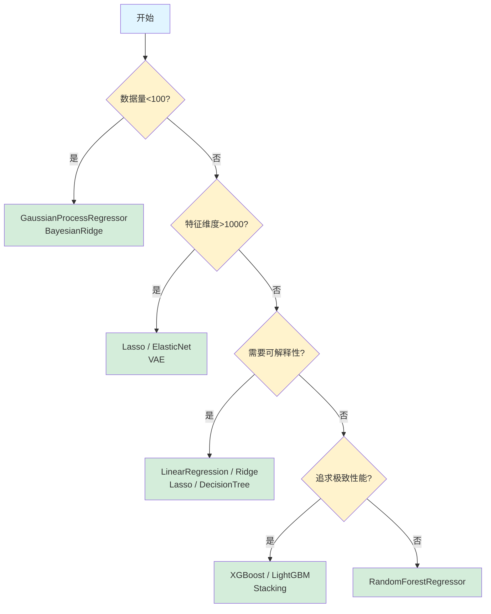

# 分子性质预测：机器学习回归算法详解（三）高级模型与应用指南

> **系列导航**：
> - [第一篇：基础回归模型](2025-11-10-ml-regression-models-part1-basics.md) - 线性模型、支持向量机、近邻方法
> - [第二篇：树模型与梯度提升](2025-11-10-ml-regression-models-part2-trees.md) - 决策树、随机森林、XGBoost/LightGBM等
> - **第三篇：高级模型与应用指南**（本文）- 神经网络、概率模型、VAE、模型选择指南

## 导读

**系列最终篇**将介绍高级回归模型和完整的应用指南：

- **神经网络**：深度学习在回归任务中的应用
- **概率模型**：高斯过程等提供不确定性量化的模型
- **深度生成模型**：VAE在特征学习中的应用
- **模型选择指南**：如何根据数据特征、应用场景、计算资源选择最合适的模型

本篇将帮助你构建完整的回归模型工具箱，并在实际项目中做出最佳选择。

---

## 1. 神经网络

### 1.1 MLPRegressor（多层感知机回归器）

**核心思想**：通过多层非线性变换学习复杂的特征表示。

**sklearn实现**：`from sklearn.neural_network import MLPRegressor`

**前向传播**：
$$
\mathbf{h}^{(1)} = \sigma(\mathbf{W}^{(1)}\mathbf{x} + \mathbf{b}^{(1)})
$$
$$
\mathbf{h}^{(2)} = \sigma(\mathbf{W}^{(2)}\mathbf{h}^{(1)} + \mathbf{b}^{(2)})
$$
$$
\hat{y} = \mathbf{W}^{(3)}\mathbf{h}^{(2)} + \mathbf{b}^{(3)}
$$

其中 $\sigma$ 是激活函数（ReLU、Tanh等）。

**特点**：
- ✅ **强大表达能力**：理论上可拟合任意函数
- ✅ **特征学习**：自动提取高层特征
- ❌ **需要大量数据**：小样本易过拟合
- ❌ **调参困难**：学习率、隐藏层结构等
- ⚙️ **关键参数**：
  - `hidden_layer_sizes`：隐藏层结构（如 `(128, 64, 32)`）
  - `alpha`：L2正则化强度
  - `learning_rate_init`：初始学习率

📊 **推荐场景**：特征复杂、样本充足的大规模分子性质预测


## 2. 概率模型

### 2.1 GaussianProcessRegressor（高斯过程回归器）

**核心思想**：将函数本身建模为高斯过程，通过核函数定义点之间的相关性。

**sklearn实现**：`from sklearn.gaussian_process import GaussianProcessRegressor`

**预测分布**（在观测数据 $\mathcal{D}$ 下）：
$$
p(f(\mathbf{x}_*) | \mathcal{D}) = \mathcal{N}(\mu_*, \sigma_*^2)
$$

其中均值和方差由核函数 $k(\mathbf{x}, \mathbf{x}')$ 计算得出。

**特点**：
- ✅ **优雅的不确定性量化**：提供完整的预测分布
- ✅ **小样本友好**：数十个样本即可建模
- ❌ **计算复杂度高**：$O(n^3)$，样本数 >1000 时不可行
- ⚙️ **关键参数**：
  - `kernel`：核函数（RBF、Matérn等）
  - `alpha`：噪声水平

📊 **推荐场景**：高价值小样本分子数据，主动学习


### 2.2 概率模型家族对比

| 模型 | sklearn实现 | 不确定性量化 | 核心优势 | 计算复杂度 | 适用数据规模 | 推荐场景 |
|------|-------------|-------------|---------|-----------|-----------|----------|
| **BayesianRidge** | `BayesianRidge` | ✓ | 自动正则化，无需调参 | $O(n^3)$ | 小-中等 | 需要不确定性估计 |
| **GaussianProcessRegressor** | `GaussianProcessRegressor` | ✓ | 完整预测分布，小样本友好 | $O(n^3)$ | 小样本(<1000) | 高价值小样本 |
| **ARDRegressor** | `ARDRegressor` | ✗ | 极致特征选择 | $O(n^3)$ | 任意大小 | 超高维稀疏 |

**对比要点**：
- 不确定性量化：只有GaussianProcessRegressor提供完整的预测分布
- 计算复杂度：BayesianRidge < ARDRegressor < GaussianProcessRegressor
- 适用规模：GaussianProcessRegressor受限于小样本，其他两者适用任意规模
- 特征选择能力：ARDRegressor > BayesianRidge > GaussianProcessRegressor


## 3. 深度生成模型

### 3.1 VAE（变分自编码器）

**核心思想**：通过**编码器-解码器**架构学习数据的低维潜在表示，同时利用**变分推断**确保潜在空间的平滑性。

**模型架构**：
$$
\text{Encoder}: \mathbf{x} \rightarrow \mathcal{N}(\mu(\mathbf{x}), \sigma^2(\mathbf{x}))
$$
$$
\text{Latent}: \mathbf{z} \sim \mathcal{N}(\mu, \sigma^2)
$$
$$
\text{Decoder}: \mathbf{z} \rightarrow \hat{\mathbf{x}}
$$

**损失函数**：
$$
\mathcal{L} = \underbrace{\|\mathbf{x} - \hat{\mathbf{x}}\|^2}_{\text{重构损失}} + \beta \cdot \underbrace{D_{KL}(q(\mathbf{z}|\mathbf{x}) \| p(\mathbf{z}))}_{\text{KL散度正则化}}
$$

**常见变体**：
- **VAE**（latent=64/128/256）：不同潜在维度，平衡压缩率和信息保留
- **VAE**（compact）：浅层网络，快速训练
- **VAE**（deep）：深层网络，更强表达能力

**特点**：
- ✅ **无监督特征学习**：自动从向量表示提取深层特征
- ✅ **降维能力强**：高维指纹→低维潜在向量
- ✅ **支持生成**：可用于分子生成（虽然主要用于回归）
- ❌ **训练复杂**：需要GPU加速，调参困难
- ⚙️ **关键参数**：
  - `latent_dim`：潜在空间维度
  - `beta`：KL散度权重（β-VAE）

📊 **推荐场景**：
- 高维稀疏数据
- 需要特征降维的迁移学习
- 与传统ML模型配合使用


## 4. 模型选择指南

### 4.1 按应用场景选择

| 场景 | 推荐模型 | 理由 |
|------|---------|------|
| **快速baseline** | LinearRegression, Ridge, KNeighborsRegressor | 训练极快，评估回归模型可行性 |
| **追求准确率** | XGBoost, LightGBM, RandomForestRegressor | 集成学习，性能最佳 |
| **小样本**（<100） | BayesianRidge, GaussianProcessRegressor | 贝叶斯方法，提供不确定性 |
| **大数据集**（>100k） | LGBMRegressor, SGDRegressor | 内存高效，训练快速 |
| **需要可解释性** | LinearRegression, Ridge, Lasso, DecisionTreeRegressor | 清晰的特征权重或决策规则 |
| **数据有离群点** | HuberRegressor, TheilSenRegressor, RANSACRegressor, RandomForestRegressor | 鲁棒损失函数或集成方法 |
| **计数数据** | PoissonRegressor | 符合数据分布假设 |
| **高维稀疏数据** | Lasso, ElasticNet, ARDRegressor | L1正则化特征选择 |
| **深度特征学习** | VAE, MLPRegressor | 非线性表征学习 |
| **不确定性量化** | GaussianProcessRegressor, BayesianRidge, QuantileRegressor | 提供置信区间或预测分布 |
| **复杂非线性** | SVR, XGBoost, MLPRegressor | 处理复杂的非线性关系 |
| **实时预测** | LinearRegression, DecisionTreeRegressor | 推理速度快 |


### 4.2 按数据特征选择

#### 特征维度

- **低维**（<10）：任意回归模型
- **中维**（10-100）：RandomForestRegressor, GradientBoostingRegressor, Lasso
- **高维**（100-10000）：Lasso, ElasticNet, LGBMRegressor, VAE
- **超高维**（>10000）：Lasso, ARDRegressor, VAE

#### 样本数量

- **小样本**（<100）：LinearRegression, Ridge, GaussianProcessRegressor
- **中等样本**（100-10k）：RandomForestRegressor, XGBoost, SVR
- **大样本**（>10k）：LGBMRegressor, SGDRegressor, MLPRegressor
- **超大样本**（>100k）：LGBMRegressor, SGDRegressor

#### 数据质量

- **噪声小**：任意回归模型
- **中等噪声**：RandomForestRegressor, GradientBoostingRegressor
- **噪声大/有离群点**：HuberRegressor, TheilSenRegressor, RANSACRegressor, QuantileRegressor


### 4.3 按计算资源选择

| 资源限制 | 推荐模型 | 避免模型 |
|---------|---------|---------|
| **内存有限** | LinearRegression, Ridge, SGDRegressor, LGBMRegressor | RandomForestRegressor（n_estimators大）, GaussianProcessRegressor |
| **CPU有限** | LinearRegression, Ridge, DecisionTreeRegressor | SVR（大数据集）, GradientBoostingRegressor |
| **有GPU** | MLPRegressor, VAE, XGBoost/LGBMRegressor（GPU版本） | - |
| **需要快速训练** | LinearRegression, Ridge, DecisionTreeRegressor, LGBMRegressor | SVR, GaussianProcessRegressor, MLPRegressor |
| **需要快速预测** | LinearRegression, Ridge, RandomForestRegressor（小） | KNeighborsRegressor, GaussianProcessRegressor |

### 4.4 集成学习策略

**为什么要集成**？
- 单个模型可能有偏差
- 不同模型捕捉不同的数据模式
- 集成通常能提升1-5%的性能

**简单集成方法**：

#### 平均集成（Averaging）
```python
from sklearn.ensemble import VotingRegressor

ensemble = VotingRegressor([
    ('rf', RandomForestRegressor()),
    ('xgb', XGBRegressor()),
    ('lgbm', LGBMRegressor())
])
```

**适用场景**：模型性能相近


#### Stacking
```python
from sklearn.ensemble import StackingRegressor

base_estimators = [
    ('rf', RandomForestRegressor()),
    ('xgb', XGBRegressor()),
    ('lgbm', LGBMRegressor())
]

stacking = StackingRegressor(
    estimators=base_estimators,
    final_estimator=Ridge()
)
```

**适用场景**：模型差异大，追求极致性能

## 5. 实战建议

本系列介绍了覆盖从经典到前沿的30+种机器学习**回归**模型，形成了完整的**回归算法生态**：

**第一篇：基础回归模型**
- **线性模型家族**：从简单的线性回归到鲁棒回归、广义线性模型
- **支持向量回归**：处理非线性关系的经典方法
- **近邻方法**：基于相似性的简单有效算法

**第二篇：树模型与梯度提升**
- **决策树与森林回归器**：强大泛化，特征重要性分析
- **梯度提升回归器**：准确性之王，竞赛首选

**第三篇：高级模型与应用指南**
- **神经网络回归器**：深度学习，复杂模式捕捉
- **概率回归模型**：不确定性量化，贝叶斯框架
- **深度生成模型**：VAE提供特征学习与降维能力
- **完整的模型选择指南**：按场景、数据特征、计算资源选择最合适的模型

### 模型选择决策树




### 最后的建议

记住：**没有万能的回归器，只有最适合的回归器**

**实战流程建议**：
1. 快速baseline（1小时）：LinearRegression, Ridge, KNeighbors
2. 性能优化（半天）：RandomForest, XGBoost, LightGBM
3. 鲁棒性验证（几小时）：鲁棒回归，异常值分析
4. 可解释性分析（几小时）：特征重要性，SHAP值
5. 集成学习（半天）：Stacking或Blending

**持续学习**：
- 关注新模型和新方法（如Transformer回归器）
- 参加Kaggle竞赛积累经验
- 阅读顶会论文了解前沿进展

Happy Regression Modeling! 🚀

---

## 6. 参考资料

1. Scikit-learn Documentation: https://scikit-learn.org/
2. XGBoost Documentation: https://xgboost.readthedocs.io/
3. LightGBM Documentation: https://lightgbm.readthedocs.io/
4. CatBoost Documentation: https://catboost.ai/docs/
5. Kingma & Welling (2013). "Auto-Encoding Variational Bayes"
6. Hastie et al. (2009). "The Elements of Statistical Learning"
7. Bishop (2006). "Pattern Recognition and Machine Learning"
8. Rasmussen & Williams (2006). "Gaussian Processes for Machine Learning"
