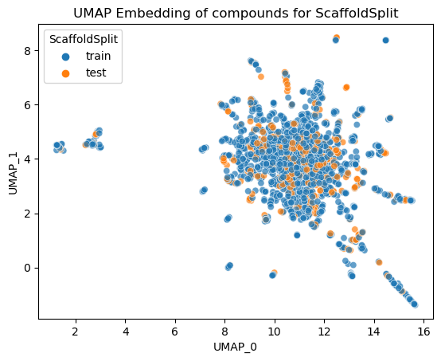
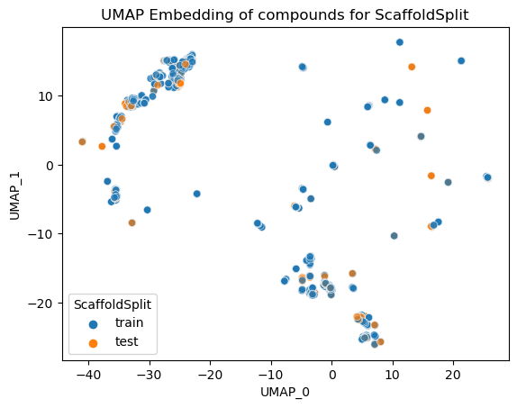
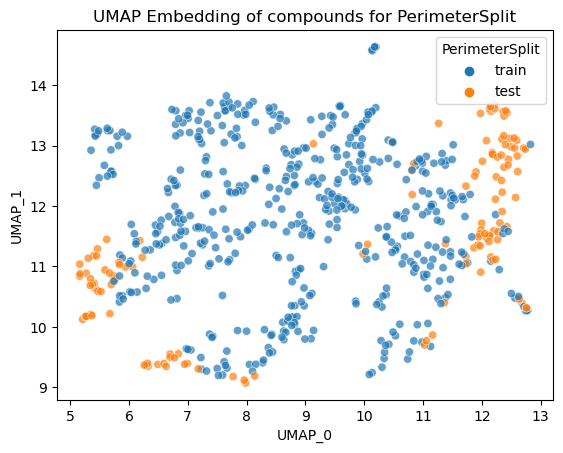
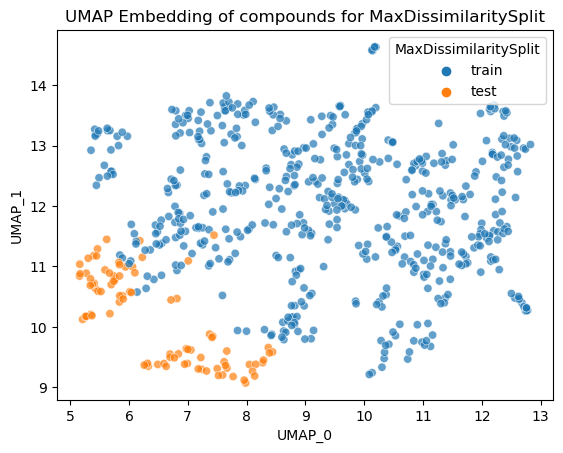
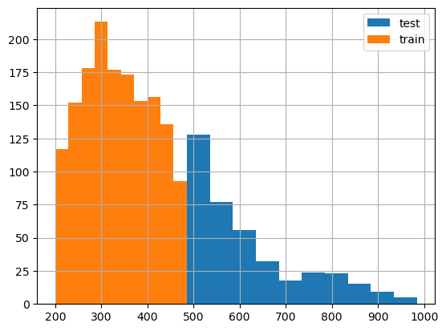
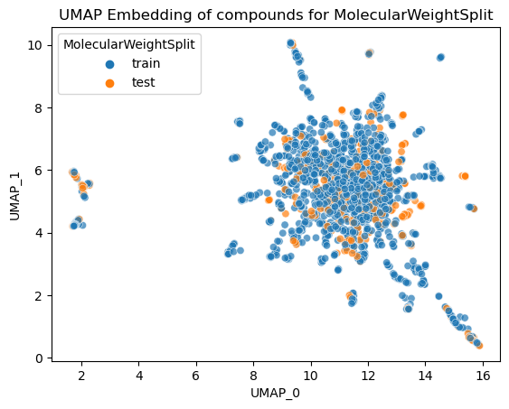
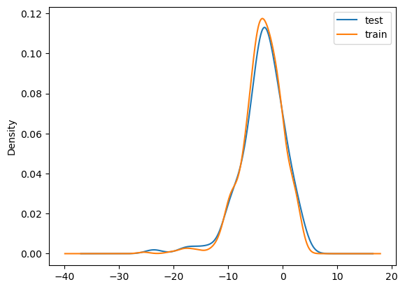
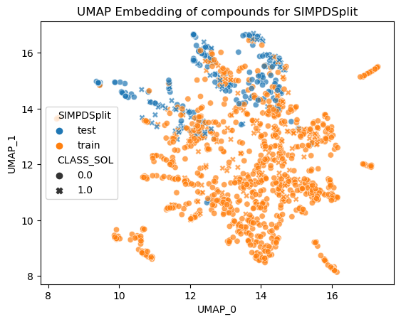

# 数据分割的艺术：splito教程

> splito是一个专门为生命科学领域设计的机器学习数据分割库。本文深入探讨了splito库中各种数据分割方法的原理、应用场景和实现细节，包括基础的骨架分割、基于结构的分割、分子量分割、分层分布分割以及先进的多目标优化分割方法。通过详细的代码示例和实际应用案例，帮助研究人员在药物发现项目中选择合适的数据分割策略。

## 关于Splito

Splito是一个专为辅助药物发现而设计的Python库，通过提供强大的数据解析和分割方法，帮助研究人员和化学家高效处理机器学习项目中的数据。

Splito是Datamol生态系统的一部分：https://datamol.io

**安装**

可以使用pip安装splito：

```bash
pip install splito
```

**文档官网**：https://splito-docs.datamol.io/stable/

### 核心结论

- splito提供了从基础到高级的多种专业数据分割方法，覆盖药物发现全流程
- 骨架分割和结构分割（Perimeter/MaxDissimilarity）测试模型对新化学结构的泛化能力
- SIMPD通过多目标优化模拟真实项目中分子性质的时间演进
- Lo Splitter评估模型对微小结构修饰的敏感度，专为先导化合物优化设计
- MOOD Protocol自动选择最适合特定部署场景的分割策略

## 背景

在机器学习项目中，特别是在药物发现领域，**数据分割是一个至关重要的步骤**。模型使用训练集构建，然后在测试集上进行预测评估。**测试集预测值与实际活性值的一致程度（通常用R平方等指标量化）作为模型内部一致性的评估指标**，也是模型预测能力的指标。然而，预测估计的具体标准取决于选择测试集化合物的标准，与真实前瞻性预测场景相比。

在药物发现项目中，采用各种数据分割策略来训练和评估机器学习模型。这些策略有助于确保模型的性能稳健，并且能够很好地泛化到新的、未见过的数据。**常见的分割策略包括随机分割、时间序列分割、基于骨架的分割、分层分割等**。

splito库正是为了解决这些数据分割挑战而设计的，它为生命科学领域的研究人员提供了强大的数据解析和分割工具。

## 研究内容

### 基础分割方法：骨架分割

骨架分割（ScaffoldSplit）是药物发现中最常用的分割方法之一。**这种方法基于公共结构来分割化学数据集，确保训练集和测试集包含不同的化学结构，同时保持骨架的多样性**。

#### 方法原理与应用

骨架分割基于公共结构将数据集分区，**确保训练集和测试集包含不同的化学骨架，从而评估模型对新化学结构的泛化能力**。当骨架对生物活性有显著影响时最有用，通常在先导化合物优化阶段使用。

#### 代码实现

```python
import datamol as dm
from splito import ScaffoldSplit

# 加载数据
data = dm.data.chembl_drugs()

# 初始化分割器
splitter = ScaffoldSplit(smiles=data.smiles.tolist(), n_jobs=-1, test_size=0.2, random_state=111)

# 生成训练集和测试集的索引
train_idx, test_idx = next(splitter.split(X=data.smiles.values))
```

#### 可视化结果



**图1：ScaffoldSplit的化合物UMAP嵌入可视化**（蓝色=训练集，橙色=测试集）



**图2：ScaffoldSplit的骨架UMAP嵌入可视化**（骨架在化学空间中形成明显的分离）

> 我感觉也没太分开。。。

### 基于结构的分割方法

#### PerimeterSplit

PerimeterSplit通过迭代选择距离最远的分子对，**将位于化学空间边缘的分子放入测试集，测试模型的外推能力**。实践发现这种方法能够选出具有更好泛化能力的模型。



**图3：PerimeterSplit的UMAP嵌入可视化**（测试集分布在化学空间边缘）

#### MaxDissimilaritySplit

**最大不相似性分割通过最大化训练集和测试集之间的距离来分割数据**。选择两个最不相似的分子分别作为训练集和测试集的“种子”，然后迭代构建，使测试集聚集在化学空间的某个区域，训练集覆盖其余区域。



**图4：MaxDissimilaritySplit的UMAP嵌入可视化**（最大化训练集与测试集的不相似性）

#### 代码实现

```python
import datamol as dm
import splito

# 加载数据
data = dm.data.freesolv()

# 定义PerimeterSplit
splitter = splito.PerimeterSplit(n_jobs=-1, test_size=0.2, random_state=111)
train_idx, test_idx = next(splitter.split(X=data["smiles"].values))

# 定义MaxDissimilaritySplit
splitter = splito.MaxDissimilaritySplit(n_jobs=-1, test_size=0.2, random_state=111)
train_idx, test_idx = next(splitter.split(X=data.smiles.values))
```

### 其他有用的分割方法

#### MolecularWeightSplit

分子量分割通过按分子量对分子进行排序，然后找到合适的分割点将分子分成两个集合。**应用场景是训练一个能够从小分子学习SAR并旨在泛化到更大分子的模型**。

```python
splitter = splito.MolecularWeightSplit(test_size=0.2, random_state=111, generalize_to_larger=True)
train_idx, test_idx = next(splitter.split(X=data.smiles.tolist()))
```



**图5：MolecularWeightSplit的分子量分布**（橙色=训练集小分子，蓝色=测试集大分子）



**图6：MolecularWeightSplit的UMAP嵌入可视化**

#### StratifiedDistributionSplit

**分层分布分割使用实验测量值来分割数据集，使得训练集、测试集和验证集都具有相同的值分布**。而不是使用某种间隔进行分箱，我们将使用测量值的一维聚类。

```python
splitter = splito.StratifiedDistributionSplit(test_size=0.2, random_state=111)
train_idx, test_idx = next(splitter.split(X=data["smiles"].tolist(), y=data.expt.tolist()))
```



**图7：StratifiedDistributionSplit的值分布**（蓝色和橙色曲线重合，保持相同分布）

### 高级多目标优化分割：SIMPD

SIMPD（**S**imulated Medicinal Chemistry **P**roject **D**ata，模拟药物化学项目数据）是一种基于多目标遗传算法的高级数据分割方法，由ETH Zurich和诺华生物医学研究所开发。

#### 方法原理

**核心思想**：**模拟真实药物化学项目中的时间分割（time-split）场景**。在真实的药物发现项目中，后期化合物通常在分子性质上优于早期化合物。SIMPD使用多目标遗传算法，基于对诺华130多个先导化合物优化项目的深入分析，将公开数据集分割成模拟这种早期/后期差异的训练集和测试集。

**关键特征**：
- **模拟时间演进**：测试集模拟项目后期的化合物，具有更优的分子性质谱
- **基于真实项目经验**：目标函数源自对130多个真实药物化学项目早期和后期化合物差异的广泛分析
- **多目标优化**：同时优化8个目标，涵盖分子性质、活性分布、化学空间覆盖等多个维度
- **金标准替代**：为缺乏真实时间序列数据的公开数据集提供了time-split验证的替代方案

#### 应用场景

药物开发项目中后期化合物通常在分子性质谱中具有改进特征（更大分子量、新骨架、增强活性等）。SIMPD为模型泛化能力提供了稳健估计，**在先导化合物优化阶段非常有价值**。

#### 八个优化目标

SIMPDSplitter选择了八个目标用于MOGA，基于NIBR药物发现项目中训练集和测试集之间描述符差异和空间统计的分析：

**分子性质差异目标**（1-4）：
1. $\Delta_{\text{test-train}}\text{median(SA\_Score)}=0.28$ - 合成可及性评分差异
2. $\Delta_{\text{test-train}}\text{median(HeavyAtomCount)}=3.1$ - 重原子数差异
3. $\Delta_{\text{test-train}}\text{median(TPSA)}=13.2$ - 拓扑极性表面积差异
4. $\Delta_{\text{test-train}}\text{median(fr\_benzene/1000\ HeavyAtoms)}=-8.8$ - 苯环比例差异

**活性分布目标**（5-6）：
5. $\text{frac}_{\text{active}}(\text{train})=\text{value from dataset}$ - 训练集活性分子比例
6. $\text{frac}_{\text{active}}(\text{test})=\text{value from dataset}$ - 测试集活性分子比例

**空间统计目标**（7-8）：
7. $10<\sum_{G}-\sum_{F'}<30$ - 控制测试集的空间聚集程度
8. $\sum_{G}>70$ - 确保测试集内部有足够的空间分离

其中G函数衡量测试集内部点之间的距离分布，F函数衡量测试集到训练集的距离分布，这两个空间统计指标确保训练集和测试集在化学空间中既有区分又有合理的覆盖。

#### 代码实现

```python
from splito.simpd import SIMPDSplitter

# 初始化分割器
simpd_splitter = SIMPDSplitter(
    n_splits=5,
    pop_size=500,
    ngens=10,
    target_GF_delta_window=(10, 30),
    target_G_val=70
)

# 拟合数据集并分割
result = simpd_splitter.fit(data[mol_col].values, data[data_col].values)
train_idx, test_idx = next(simpd_splitter.split(data[mol_col].values))
```

#### 可视化结果



**图8：SIMPDSplit的UMAP嵌入可视化**（蓝色=测试集，橙色=训练集，点的大小表示溶解度类别）

### 先导化合物优化专用分割：Lo Splitter

Lo Splitter（Lead Optimization Splitter，先导化合物优化分割器）是专门为先导化合物优化阶段和分子生成任务设计的数据分割方法。

#### 通俗理解

**问题场景**：假设你已经找到一个有潜力的药物分子（先导化合物），现在需要对它进行“微调”——比如把一个甲基换成乙基，或者改变一个取代基的位置。这些微小改动可能显著影响药效。

**传统方法的问题**：ScaffoldSplit等方法测试的是模型能否预测“完全不同骨架”的分子，但在先导优化阶段，我们更关心模型能否区分“长得很像但性质不同”的分子。

**Lo Splitter的解决方案**：创建由“长得很像的分子小团体”组成的测试集，每个团体保留一个分子在训练集（模拟已知的先导化合物），其余放入测试集。这样就能评估模型是否真的理解“把-CH₃换成-C₂H₅会让活性提高2倍”这种细微差异。

#### 方法原理

Lo Splitter通过创建一个由**相似分子簇**组成的测试集来解决这个需求：

1. **测试集由相似分子簇组成**：每个簇包含结构相似的分子
2. **簇内性质变化大于实验噪声**：确保簇内的性质差异是真实的，而不是测量误差
3. **每个测试簇中恰好一个分子移到训练集**：模拟已知的先导化合物

这种设计使我们能够**评估模型识别微小修改的能力**，帮助我们选择最适合先导化合物优化或作为分子生成评分器的模型。与其他分割方法不同，Lo splitter不仅能区分不同骨架，还能“理解”不同取代基如何影响性质。


**图9：Lo Splitter概念图**（测试集由相似分子簇组成，每个簇保留一个分子在训练集作为已知先导）

#### 关键参数

- **threshold**（默认0.4）：ECFP4 1024位Tanimoto相似度阈值。相似度高于此阈值的分子被认为非常相似，可以归为一个簇
- **min_cluster_size**（默认5）：每个簇的最小分子数量
- **max_clusters**（默认50）：算法在找不到更多合适的簇或达到此限制时停止
- **std_threshold**（默认0.60）：簇内标准差阈值。只选择簇内变化超过噪声变化的簇。默认值0.60是ChEMBL中logKi数据的噪声标准差。如果使用内部高质量数据，可以设置为0.2左右

#### 代码实现

```python
from splito.lohi import LoSplitter
from scipy.stats import spearmanr

# 初始化并分割
lo_splitter = LoSplitter(threshold=0.4, min_cluster_size=5, std_threshold=0.60)
train_idx, cluster_idx = lo_splitter.split(data['smiles'], data['calc'])

# 评估：计算每个簇内的Spearman相关系数
cluster = data.iloc[cluster_idx[0]]
spearman_score = spearmanr(cluster['calc'], predict(model, cluster))[0]
```

**评估指标**：使用Spearman秩相关系数在每个簇内计算并跨簇平均，归一化后在-1（完全错误）、0（随机）和1（理想）之间。

### 自动选择最佳分割方法：MOOD Protocol

MOOD（Multi-Objective Optimization for Dataset splitting，多目标数据集分割优化）协议是一种**元方法**，它能够自动选择最适合特定数据集和部署场景的分割策略。

#### 通俗理解

**问题场景**：你有一堆分割方法（随机分割、骨架分割、Perimeter分割等），不知道选哪个？每个方法都声称自己好，但哪个真正适合你的项目？

> **部署集/部署场景**：模型训练好后，在实际应用中需要预测的那些新分子。比如临床候选药物、虚拟筛选得到的化合物等。

**核心思想**：假设你知道模型最终要预测什么样的分子（部署场景）。MOOD的逻辑是——**好的分割方法应该让测试集和未来要预测的分子"距离训练集的远近程度"相似**。

**类比**：就像高考模拟题，好的模拟题应该和真实高考题“难度分布”相似。如果模拟题都是简单题，但高考全是难题，那模拟考高分也没用。MOOD通过计算“测试集离训练集有多远”是否接近“未来要预测的分子离训练集有多远”，来评判哪种分割方法更靠谱。

**实际应用**：比如你训练模型是为了预测“临床候选药物”的性质，那就应该用临床候选药物作为部署场景的参考。MOOD会帮你选择一个分割方法，使得测试集和临床候选药物在化学空间中的位置关系类似，这样测试结果更能反映模型在真实应用时的表现。

#### 工作流程

1. **定义部署场景**：准备一组代表未来应用场景的分子（如已上市药物、临床候选药等），计算它们到训练集的距离分布（这是目标分布）
2. **评估各种分割方法**：对每种候选分割方法计算test-to-train分布
3. **选择最佳方法**：使用Jenssen-Shannon距离评分，选择与目标分布最相似的分割方法

#### 代码实现

```python
import splito
from sklearn.model_selection import ShuffleSplit

# 定义候选分割器
splitters = {
    "Random": ShuffleSplit(),
    "Scaffold": splito.ScaffoldSplit(dataset.mol.values),
    "Perimeter": splito.PerimeterSplit(),
    "MaxDissimilarity": splito.MaxDissimilaritySplit(),
}

# 评估并选择最佳分割方法
mood = splito.MOODSplitter(splitters)
ranking = mood.fit(X=dataset_feat, X_deployment=deployment_feat)
```

**输出示例**：
```
              split  representativeness   best  rank
0            Random            0.375938  False   4.0
1          Scaffold            0.492793  False   3.0
2         Perimeter            0.526232  False   2.0
3  MaxDissimilarity            0.552740   True   1.0
```

在这个例子中，对于给定的部署场景，MaxDissimilarity是最具代表性的分割方法，能够最好地模拟部署时的数据分布特征。


---

## Q&A

- **Q1**: 什么时候应该使用骨架分割而不是随机分割？
- **A1**: **当您的数据集中包含多个不同的骨架系列（骨架多样性高）时，骨架分割特别有用**。它确保模型在从未见过的骨架上进行测试，这对于评估模型泛化到新化学结构的能力至关重要。典型场景是先导化合物优化阶段，此时有多个不同骨架的先进分子系列需要优化。如果数据集中只有一个或少数几个骨架，骨架分割就没有意义了。

- **Q2**: PerimeterSplit和MaxDissimilaritySplit有什么区别？
- **A2**: PerimeterSplit选择分布边缘的分子，MaxDissimilaritySplit最大化训练集和测试集的总体不相似性。两者算法实现不同，但都旨在提高模型泛化能力。

- **Q3**: SIMPDSplitter的计算成本很高，值得使用吗？
- **A3**: SIMPD确实需要较多计算资源，但在先导化合物优化阶段非常有价值，能够模拟真实项目中分子特征的演变，提供更现实的泛化能力估计。

- **Q4**: 如何选择适合我项目的分割方法？
- **A4**: 考虑数据集特征（骨架多样性）、项目阶段（早期发现vs先导化合物优化）、预期目标（新骨架vs微小修饰）和计算资源。

- **Q5**: 分割比例通常设置为多少合适？
- **A5**: 常用的分割比例是80/20（训练集/测试集）或70/30。但具体比例应考虑数据集大小、项目需求和分割方法的特性。

- **Q6**: Lo Splitter与其他分割方法的主要区别是什么？
- **A6**: Lo Splitter独特之处在于它创建的**测试集由相似分子簇组成**，专门评估模型对微小结构修饰的敏感度。这与其他方法（如骨架分割）测试新骨架的泛化能力完全不同。Lo Splitter特别适合先导化合物优化阶段和分子生成任务。

- **Q7**: 什么时候应该使用MOOD Protocol？
- **A7**: 当不确定使用哪种分割方法、且有明确的未来应用场景（如知道模型最终要预测什么类型的分子）时使用MOOD。例如，如果你知道模型将用于预测临床候选药物，就可以用MOOD来选择最合适的分割方法。

---

## 关键结论与批判性总结

splito库为生命科学领域的数据分割提供了强大而灵活的工具。通过系统性地理解各种分割方法的原理和应用场景，研究人员可以选择最适合其特定需求的策略。

通过合理选择和应用splito中的数据分割方法，研究人员可以更准确地评估机器学习模型的泛化能力，从而加速药物发现进程并提高研究质量。