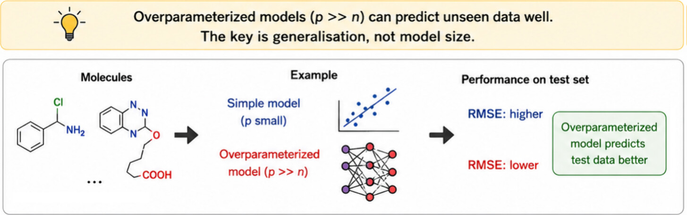
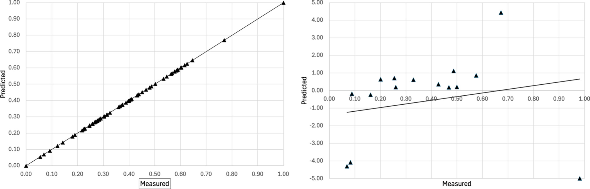
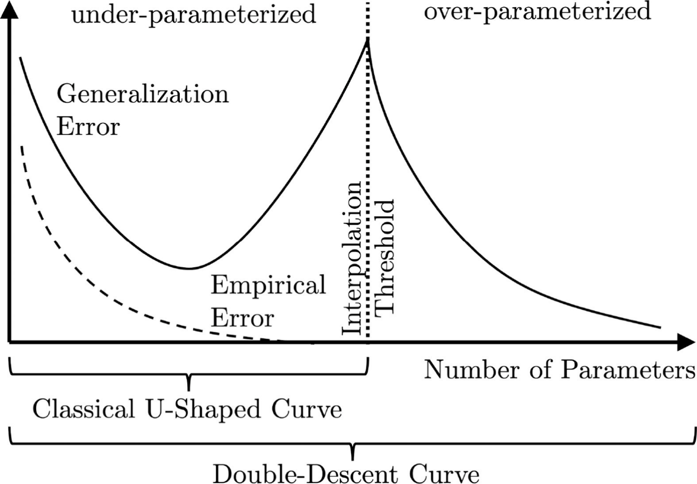

# 我们是否低估了过拟合？复杂模型中“双下降”现象的再思考

## 本文信息
- **标题**：Are We Underestimating Overfitting?
- **作者**：David A. Winkler
- **发表期刊**：Journal of Chemical Information and Modeling
- **发表时间**：2026年5月
- **DOI**：https://doi.org/10.1021/acs.jcim.6c00518
- **单位**：澳大利亚拉筹伯大学（La Trobe University）、莫纳什大学（Monash University）
- **引用格式**：Winkler, D. A. (2026). Are We Underestimating Overfitting?. *Journal of Chemical Information and Modeling*. https://doi.org/10.1021/acs.jcim.6c00518

## 摘要
> 在定量构效关系（QSAR）领域，一个根深蒂固的教条是：简约的模型泛化能力最好，必须避免过拟合。随着模型中拟合参数的数量接近训练样本数，训练误差降低，而外部测试集误差通常显著增加。这在直觉上很合理，但近期关于过拟合和过度参数化的研究，以及复杂深度学习模型的飞速发展，表明形式上过度参数化的机器学习模型可能恢复其准确预测外部数据的能力。这种反直觉的现象得到了多种信息论论证的支持，并且在极易出现过拟合的合成和真实数据集建模中被证实。其实质含义是，过多的模型参数中蕴含了有关构效关系（SAR）的额外信息，这些信息有益于模型对未知数据的预测。在本文中，我们探讨了过度参数化这一转变背后的含义，讨论了其对相关问题模型构建的深远影响，并提供了**过度参数化**机器学习模型能够良好预测测试集数据的实例。

### 核心结论

- **挑战“简约性”教条**：传统的定量规律认为拟合参数过多必然导致过拟合并极大降低泛化能力。然而，这一经典认知在当前广为流行的大型人工神经网络中受到了直接的挑战。
 
 - **良性过拟合现象**：过度参数化（网络参数量远大于样本量的情况，代表如 $\gamma > 1$） 的模型在跨过插值阈值之后，测试误差会在参数爆炸性增长的过程中发生反直觉的第二次下降（即“双下降”现象）。在极度复杂的网络维度下，模型依然能对看不见的数据实现准确预测。
- **重新思考模型构建策略**：对于具有非线性及高维复杂特性的现代模型，不应仅仅因为参数数量庞大而抛弃这些方法。相比于粗暴的参数数量截断，我们必须从信息论和算法的本身性质入手重新评估复杂的计算机决策风险。

## 背景

定量构效关系（QSAR）作为一种前驱性的特征学习应用手段开发于20世纪60年代。早期研究受到计算资源与标注数据的严重限制，因此研究者偏好低自由度且易解释的方法，衍生出若干实践经验：

 - **计算与数据限制**：当时算力和样本数量均有限，难以支撑高维模型的训练与验证。**因此实践上更倾向于低维可解释模型**。
 - **偏好简单模型**：例如**多元线性回归**（MLR），因为解释性强且容易诊断模型问题。**这意味着早期QSAR更注重可解释性而非纯预测性能**。
 - **经验规则**：常采用参数与样本比的经验上限（如每个参数配备8到10个样本）来约束模型复杂度。**这些经验在数据稀缺情形下仍然有参考价值**。

这些限制共同塑造了经典机器统计学派中的“简约性”原则和U型**偏差-方差权衡**（Bias-Variance Trade-off）曲线。研究者常用的控制手段包括：

- **经验比率**：按经验为每个待估参数配备约8到10个样本点以降低过拟合风险；
- **维度约简**：使用主成分分析（PCA）等方法提取主成分、减少原始特征数量；
- **稀疏正则化**：采用LASSO类回归来压缩或移除不重要的变量，从而简化模型结构。

### 关键科学问题

- **过度参数化必然导致模型表现极其糟糕吗**？：过去传统的偏差-方差权衡模型根本无法解释近年来超大型深度学习网络为何在拥有千万甚至是数以十亿计的参数容量时，仍然能保持惊人的强泛化学习能力。
- **药物领域是否应该继续坚守传统的“限制参数上限”的教条原则**？：在如今广泛使用深度计算甚至高度非线性架构学习的环境下，传统僵化的防过拟合指标可能正在严重扼杀复杂算法捕捉深层次药物分布规律的潜能。
 - **过度参数化必然导致模型表现极其糟糕吗**？：过去传统的偏差-方差权衡模型根本无法解释近年来超大型深度学习网络为何在拥有千万甚至是数以十亿计的参数容量时，仍然能保持惊人的强泛化学习能力。**关键在于是否存在决定性的信息投影和训练稳定性**。
 - **药物领域是否应该继续坚守传统的“限制参数上限”的教条原则**？：在如今广泛使用深度计算甚至高度非线性架构学习的环境下，传统僵化的防过拟合指标可能正在严重扼杀复杂算法捕捉深层次药物分布规律的潜能。**因此建议以诊断性检查（如特征谱分析）代替简单的参数计数**。

## 研究内容

### 经典观念：偏差-方差权衡与简单回归危机

毫无悬念地，极尽压缩的数据模型常常因为维度降低丧失有效解释事物的灵敏性。在最原始的统计学逻辑里，过度参数化（通常指模型权重数大于或等于其所利用的训练信息总量）将必然引发病态。具体来说，可以拆成三个层面理解：

- **拟合层面**：回归算法不断逼近训练数据的每一点细微结构，目标是把训练误差压到极低。
- **泛化层面**：外部独立数据会出现明显震荡，误差在复杂度增加时先下降再急剧反弹。
- **实践层面**：如果只用简单刚性的低维处理，如部分多线性架构，这类风险会被进一步放大。

**图1：过拟合的MLR多元线性回归模型预测误差表现图：分别在所能记忆拟合的已知源训练集（左栏）遭遇严重数据失败崩塌的外部独立验证与测试集（右栏）对比差异**

### 范式转移：双下降曲线与良性过拟合现象

研究近期发现，传统的单纯关于U型波谷的刻板印象是不完全的。可以把这一转变拆成两个关键点：

- **第一阶段**：模型复杂度上升到插值阈值附近时，测试误差会先变差；
- **第二阶段**：继续增加参数后，测试误差并不一定继续恶化，反而可能再次下降。

图2：由早年经典U型表现边界与双下降曲线组合的全局误差示意。图中以插值阈值（interpolation threshold）作为两个行为阶段的分界点。

  早年传统欠拟合与U型发散域：在该区间，随着自由度增加模型趋于记忆训练样本，训练误差下降但测试误差很容易上升（常见的过拟合峰值，插值阈值约为（$\gamma = 1$））。

	大规模高维与过度参数区间：当参数继续大幅增加（$\gamma \gg 1$）且数据/训练满足特定条件时，测试误差有时会再次下降——这就是“双下降”现象。参数变多并不必然等于性能变差，关键是哪些参数参与有效表征以及训练过程如何调节模型的稳定性。

> 本文中所说的**良性过拟合（Benign Overfitting）**，指的是在某些高维设置下，模型虽然能完全插值训练数据（训练误差≈0），但仍能在独立测试集上保持较好性能。这并不是普适规律，而是对数据特性、特征谱和训练程序有具体要求的情形。

### 理论支持：为何会出现“双下降”与“良性过拟合”——更深入的分解

 - **插值阈值与风险曲线的分段理解**：多篇工作（包括 Belkin 等和 Hastie 等）指出，随着模型参数数目相对训练样本数的比率 γ 增加，风险（test risk）曲线常出现两段截然不同的行为：
	- 在接近插值阈值（$\gamma \approx 1$）时，模型刚好能将训练误差降为零，但此时对带噪标签或有限样本的敏感性极高，测试误差常剧烈上升。**这是观察到的过拟合峰值**；
	- 当参数继续大幅增加（$\gamma \gg 1$）时，若数据与算法满足一定条件，测试误差可以再次下降，形成所谓的“双下降”现象。**第二次下降表明更多参数并非总是无用噪声**。

- **六类理论框架的比较与结论要点**：作者回顾并比较了复杂度度量、算法稳定性（Algorithmic Stability）、PAC-Bayes、差分隐私（Differential Privacy）、压缩/表征（Compression）和信息论（Information Theory）等框架来解释这一现象，结论要点为：
	- **算法稳定性/假设稳定性（Hypothesis Stability）**：在许多被检验的设置下，这是最能解释何时过度参数化会仍然泛化良好的理论之一。若训练过程（包括随机初始化、优化轨迹和早停规则）使模型对单个训练样本的影响被限制，则即便参数众多也可维持**稳定泛化**。
	- **差分隐私相关性**：差分隐私的分析工具强调对单点影响的有界性（bounded influence），与稳定性论证思路相近，因此能为某些过参数化设置下的良性泛化提供理论支撑；
	- **信息论/压缩视角**：从信息论角度看，虽然参数数目很多，但良好泛化的模型往往实现了对训练信息的高效“压缩”或提取，即参数中有助于泛化的有效自由度最终少于原始参数总数。**换句话说，参数多并不等于有效自由度多**。

- **线性/核/随机特征的精确分析提供了可检验条件**：Hastie 与合作者以及后续工作提供了在高维线性回归、核机器与随机特征回归中精确的渐近分析，指出预测风险不仅取决于参数量本身，还深受特征协方差结构（各向同性 vs 各向异性）、噪声能量分布和样本数三者共同影响。换言之，参数/样本比只是判据之一，特征谱（effective rank）和噪声-信号投影更能决定是否出现良性过拟合。
 - **噪声、正则化与训练程序的调制作用**：论文强调若训练数据标签噪声较高，双下降的第二次下降会更明显；反之，低噪声数据、早停（early stopping）或适当的 L_2 正则化都可能抑制在 $\gamma \approx 1$ 附近的误差激增，甚至令双下降现象不明显。这说明实践中正则化与优化策略对是否观察到良性过拟合至关重要。
- **Benign overfitting 在线性回归中的可证结果**：引用了 Bartlett 等关于“Benign overfitting in linear regression”的精确工作，指出在某些高维随机设计（例如协方差谱具有衰减特性）下，最小二乘插值解虽然完美拟合训练数据，但其在测试集上的期望风险仍可有界并趋于良好。
- **为什么深度网络也能表现出类似行为（若干直觉层面）**：尽管深度神经网络非线性与训练细节复杂，若将其视作带有大量随机基/特征映射的高维函数逼近器（kernel 或 random-feature 近似视角），其整体行为在某些尺度上可与线性/核模型类比。因此，线性分析的可迁移直觉（如特征谱、噪声投影、隐式正则化）在解释深度网络的双下降上仍然有用。
- **可检验的实践建议（对QSAR的含义）**：基于上述理论与实证，作者给出几个可操作的判断依据：
	- 检查**特征谱**与有效维度（例如 PCA 能量分布），而不是仅看参数数目；
	- 在不同正则化/早停策略下比较插值阈值区域的行为，观察噪声敏感性，并**记录哪种策略降低了插值峰值**；
	- 在小样本极端情况下，慎用完全无约束的插值解，优先采用**稳定性增强**的训练程序（如小批量 SGD、合适学习率衰减、基于验证集的早停）；
	- 利用差分隐私或稳定性相关诊断（如leverage或influence函数）来评估单样本对模型的影响，并将这些诊断作为发布模型前的安全检查。

这些更细化的理论与实践要点，正是论文用来把“良性过拟合”从概念性现象转化为在QSAR与QSPR建模中可检验、可操作的判断框架的核心内容。

### 验证：文献报告与实际模型的卓越应用

为加强说服力，本文汇总展示了多种QSAR研究中的过度参数化成功实例。它们虽然没有遵守传统的样本数/参数数经验规则，但仍表现出不错的外部预测能力。对比信息如下表。

| 模型/数据集 | 样本规模 | 参数规模 | 参数/样本比（$\gamma$） | 外部结果 | 结论 |
| --- | --- | --- | --- | --- | --- |
| 5-HT6受体模型 | 41个样本 | 136个权值 | $3.3$ | $r^2 = 0.87$ | 样本较少时仍有可用泛化能力 |
| 代谢酶预测模型（四隐层） | 两百多例 | 几万到几百万级 | $>5500$ | $r^2 = 0.65$ | 极端高参数配置下仍保持可接受表现 |
| 大型水溶数据集 | 1531个化合物 | 覆盖欠参数化与过参数化设置 | $\approx 0.1$ 到 $3.5$ | 误差整体稳健 | 同一任务跨两端设置仍稳定 |

## 关键结论与批判性总结

- **深远的影响意义**：这篇文章最重要的价值，不是鼓励盲目堆参数，而是提醒读者不要再把“模型越大越差”当成铁律。对分子计算和QSAR来说，这意味着可接受的模型空间被明显放宽了。
- **不得不面对的客观局限性**：复杂模型的代价也很直接，算力开销会更高，可解释性会更弱。小模型能快速告诉我们“为什么这个配体更好”，大模型往往只能给出结果，却不容易给出同样清晰的机制说明。
- **接下来尚需开垦的研究空间**：下一步更关键的问题，是如何识别模型真正的应用域，并在未知化学空间中避免失控输出。换句话说，未来要补的不是“再堆一点参数”，而是“把边界条件看清楚”。
