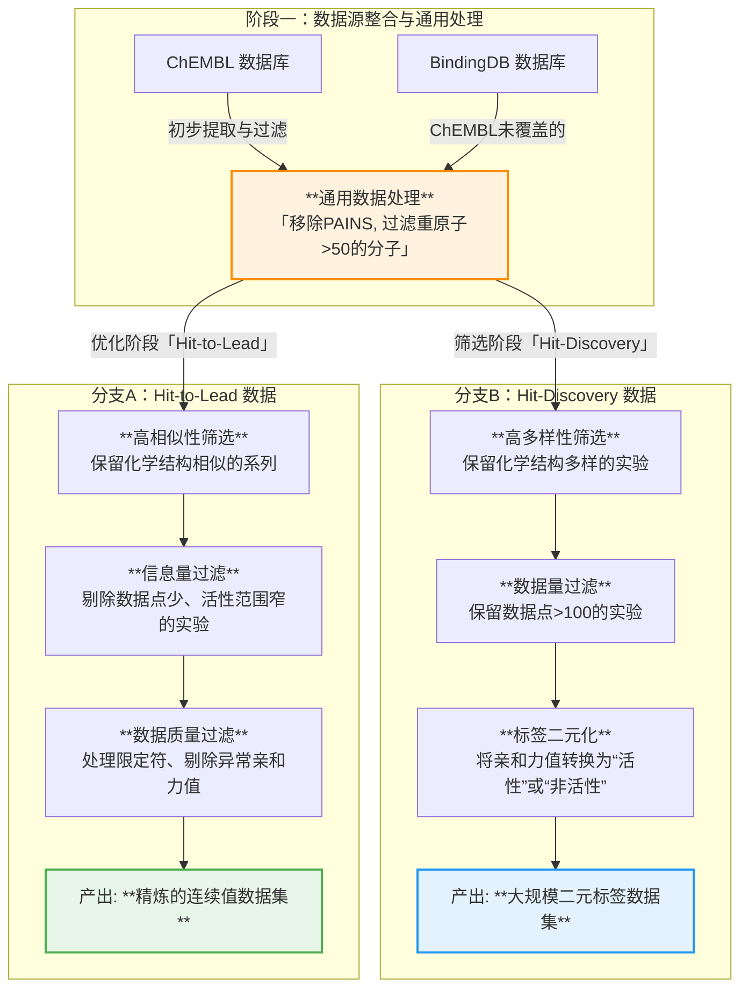
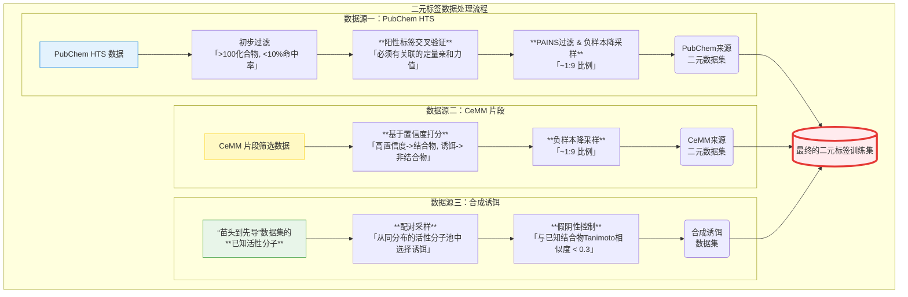
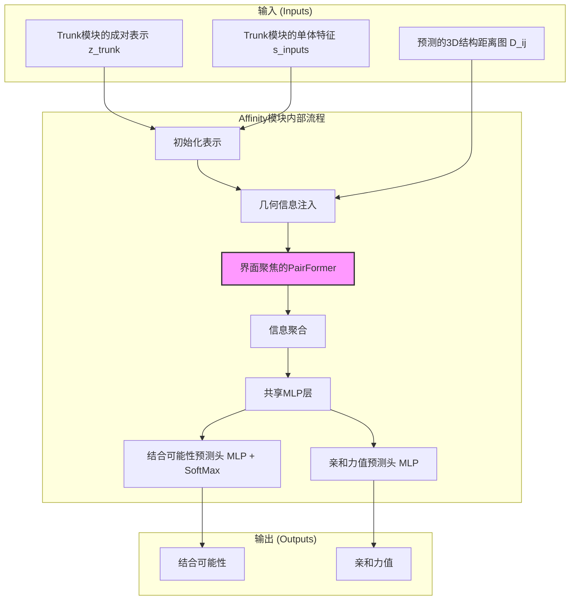
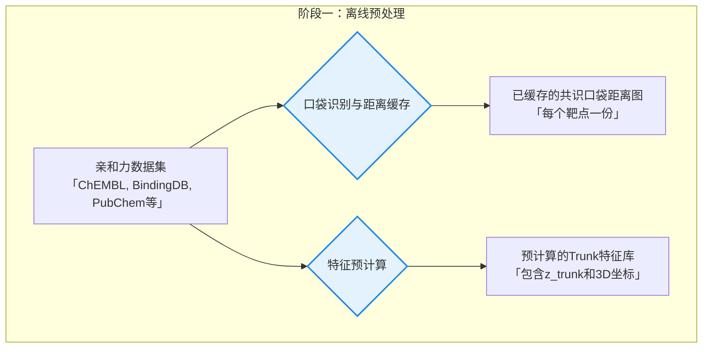
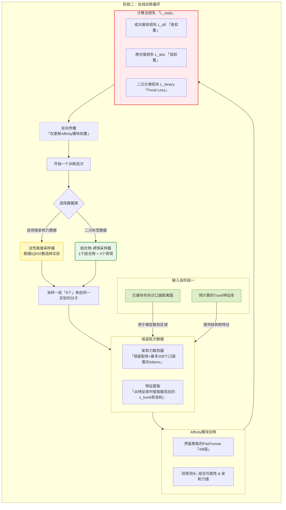
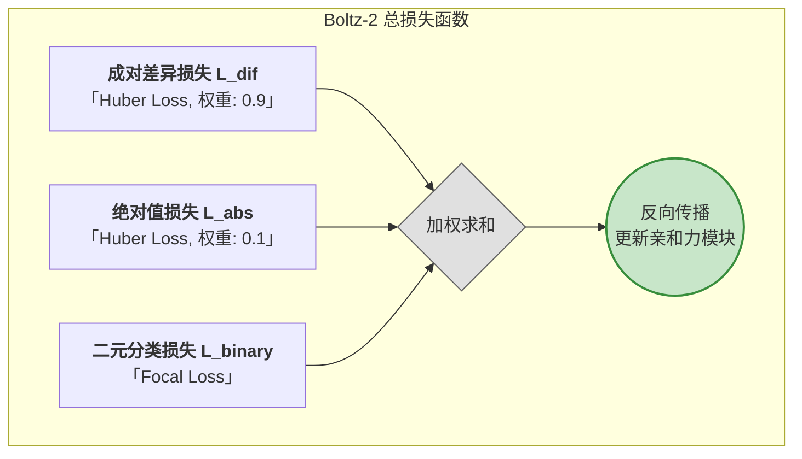
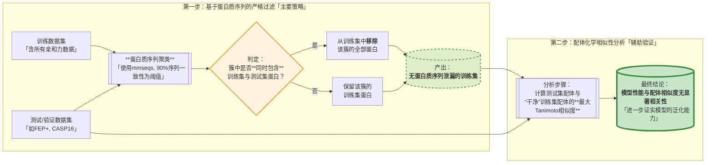

# 千倍加速，精度接近FEP：深入解析Boltz-2的结合亲和力预测

## 引言：挑战亲和力预测的“速度-精度”壁垒

在计算机辅助药物发现（CADD）领域，结合亲和力的预测长期以来面临一个核心的权衡困境：**速度与精度**。一方面，以**自由能微扰（FEP）**为代表的、基于物理模拟的方法，凭借其严谨的理论基础，能够提供最高的预测精度，被誉为领域的“金标准”；但其高昂的计算成本（通常需要数天GPU时）使其应用场景受限，难以进行大规模筛选。另一方面，以**分子对接（Docking）**为代表的快速方法，虽然能在数秒内完成计算，但其精度往往不足以在先导化合物优化等阶段提供可靠的指导。

在两者之间，各类机器学习（ML）方法层出不穷，但迄今为止，在公开基准上，鲜有AI模型能在预测准确性上展现出与FEP方法相抗衡的性能。**Boltz-2的问世，正是为了正面挑战这一壁垒。** 它不仅是一个结构预测模型，其核心突破之一在于构建了一个强大的亲和力预测模块。该模块根植于模型对生物分子相互作用的深层结构表示，通过对海量含噪数据的精细化处理和创新的训练策略，首次在AI模型中实现了**接近FEP的精度**与**远超对接的速度**的结合。

本文将深入Boltz-2的心脏地带，详细剖析其亲和力预测的**数据管理、模型架构、训练策略、性能评估**以及**前瞻性应用**的全流程。

## 1. 数据管理(Data Curation)：在噪声中淘金

Boltz-2亲和力预测成功的基石，在于其前所未有的大规模、高质量的数据管理(Data Curation)策略。团队深知，公共数据库（如PubChem, ChEMBL, BindingDB）中的亲和力数据虽浩如烟海，但因实验方案各异、噪声巨大而难以直接使用。为此，他们设计了一套精密的“淘金”流程。为同时服务于药物发现的早期（苗头发现）和中后期（先导优化）阶段，Boltz-2构建了一个包含**二元标签（结合/不结合）**和**连续值亲和力**的混合数据集。其数据管线（Data Pipeline）极其精细，旨在从海量的、良莠不齐的公共数据中筛选出最可靠、信息量最大的部分。

### **1.1 通用数据处理与质量控制**

在处理具体数据类型之前，所有数据源都经过了统一的预处理流程：

- **多源整合**：数据集整合了多个公共来源，包括**PubChem**, **ChEMBL**, **BindingDB**, 以及专门的**CeMM片段筛选数据集**和**MIDAS代谢物相互作用组数据集**。**详见之前的推送**。
- **配体标准化**：所有配体分子都经过**ChEMBL结构管线（ChEMBL Structure Pipeline）**进行标准化处理，以确保化学表示的一致性。
- **结构质量过滤**：由于模型是基于结构的，训练样本的靶点结构质量至关重要。该管线应用了一种**避免引入选择偏倚的过滤策略**：对每个实验（assay），使用Boltz-2自身的置信度模块，对随机10个结合物的复合物结构进行预测，并计算平均的界面TM-score（ipTM）。**只有当平均ipTM分数高于0.75时，该实验的全部数据才被保留**，从源头上确保了训练样本的结构可靠性。

### **1.2 连续值亲和力数据的处理管线**

这部分数据主要用于模型的回归任务，以学习精确的构效关系。

#### 数据提取 (ChEMBL & BindingDB)

- **从ChEMBL中提取的数据**：遵循严格标准，包括置信度得分**必须为最高分9**，靶点类型限定为**单一蛋白**，实验类型限定为生化或功能性实验，亲和力类型限定为$\{K_i, K_d, IC_{50}, XC_{50}, EC_{50}, AC_{50}\}$，并排除了被标记为不可靠的数据源。
- **避免数据重复**：只保留BindingDB中有但ChEMBL未覆盖的记录。

#### 通用处理步骤 (General Curation)

- **应用PAINS过滤器**：移除可能产生实验假象或干扰多种生化读数的分子。
- **重原子数限制**：移除重原子数超过**50**的分子。
- **数据划分**：将数据划分为**“苗头到先导优化”（hit to lead）和“苗头发现”（hit discovery）**两个子集，以便更智能地处理带有不等号的截断数据。在“苗头发现”阶段，`>`值被视为非结合物；而在“苗头到先导”阶段，则被视为不确定的下限。

#### 针对“苗头到先导优化”的深度过滤

- **化学多样性**：**移除分子间平均Tanimoto相似度过低**（$< 0.25$）的实验，以保留那些专注于结构相关分子优化的、**真正的“先导优化”**数据集。
- **数据量与信息量**：排除**数据点少于10个、活性值标准差过低**（$< 0.25$，无法学习活性悬崖）、或独特活性值过少的实验，确保每个用于训练的实验都包含足够丰富的信息。
- **截断数据处理**：严格处理带不等号的数据，例如丢弃所有`<`限定符的数据，以及活性值$< 10 \mu M$但带有`>`限定符的数据。
- **不要亲和力太强的**：移除任何报告活性值小于$10^{-12} M$的实验，因为这通常意味着单位或注释错误。

#### 针对“苗头发现”的过滤

- **数据量要求**：实验至少包含**100个**数据点。
- **化学多样性**：保留化学上更多样化的实验（平均Tanimoto相似度$< 0.25$）。
- **活性标记**：将所有带有`>`限定符的数据标记为非活性，而将亲和力`=`和$< 2.0 \mu M$的数据标记为活性，其余数据则被丢弃。

### **1.3 二元标签数据的处理管线**

这部分数据主要用于模型的二元分类任务，其处理核心在于提高标签的可靠性并构建高质量的负样本集。

> “诱饵”（decoy）通常指的是那些在实验中**表现出没有活性或低活性的化合物**。这些化合物在筛选过程中被用来评估模型或实验方法的性能，特别是在区分活性化合物（hits）和非活性化合物（non-hits）的能力上。

- **PubChem HTS数据的处理**:
  - **初步过滤**：保留至少测试了**100个化合物且命中率低于10%**的实验，以过滤掉高噪声或有问题的筛选。
  - **阳性标签交叉验证**：这是提高标签可靠性的关键一步。对于每个被标记为“Active”的（蛋白质，SMILES）对，管线会反向查询PubChem，**确认其必须存在一个独立的、报告了具体亲和力值的条目**。只有满足此条件的才被保留为阳性样本。据此估计，约**40%**的原始HTS“阳性”标签（很可能是假阳性）被过滤掉。
  - **负样本降采样**：为了平衡正负样本比例，对每个实验中的诱饵（decoy）集进行降采样，达到约**1:9的结合物与诱饵比例**。
- **CeMM片段数据的处理**：对CeMM片段筛选数据集采用类似的置信度过滤。高置信度（score=2或3）的片段被标记为结合物，标记为诱饵（score=0）的为非结合物，**低置信度（score=1）的被移除**。同样进行了1:9的负样本**降采样**。
- **合成诱饵分子的构建 (Synthetic decoys)**：这是构建高质量负样本集的另一项创新策略。
  - **配对与采样**：每个来自“苗头到先导优化”数据集的活性化合物，都会被配对一个“合成诱饵”。这个诱饵分子是从**其他活性化合物池**中采样的，这确保了正负样本在化学性质的分布上保持一致，防止模型学习到区分两者的“捷径”。
  - **避免假阴性**：为防止错误地**将一个未被发现的活性分子当作诱饵**（即假阴性），采样时强制要求诱饵分子与当前靶点所在蛋白簇的所有已知结合物，其**Tanimoto相似度必须低于0.3**。这一约束极大地降低了引入假阴性的风险。

尽管该数据处理管线已相当复杂，但作者也承认，由于公共数据库元数据的不一致性，这仅仅是构建高质量训练集的冰山一角。更深度的标准化（如应用Cheng-Prusoff方程）和实验细节审查，将是未来工作的方向。

> **背景知识：什么是PAINS过滤器？**
>
> **PAINS (Pan-Assay Interference Compounds)**，即**泛筛选干扰化合物**，特指那些在多种高通量筛选（HTS）实验中都倾向于产生**假阳性**信号的分子。
>
> **典型干扰机制与结构特征**
>
> |        **PAINS类别**         |     **干扰机制**      |    **代表化合物**    |
> | :--------------------------: | :-------------------: | :------------------: |
> |    罗丹宁类（Rhodanines）    |    共价修饰靶蛋白     |    常见于文献误报    |
> |   邻苯二酚类（Catechols）    | 氧化还原循环/金属螯合 |    天然产物姜黄素    |
> | 异噻唑酮类（Isothiazolones） |   非特异性化学反应    |    商业筛选库常见    |
> |       醌类（Quinones）       |  产生活性氧破坏靶标   | 毒黄素（Toxoflavin） |
>
> - **核心功能**：PAINS过滤器是一个计算工具，通过识别分子中是否存在已知的、会导致非特异性相互作用的**化学结构子结构（警报结构）**，来标记这些潜在的“麻烦制造者”。
> - 干扰机制：这些化合物并非通过与靶标特异性的、有意义的“钥匙-锁”模式结合来产生信号。相反，它们通过一些“取巧”的物理化学机制来干扰实验读数，例如：
>   - **共价修饰**：分子上的活泼基团与靶蛋白发生不可逆的共价反应。
>   - **氧化还原循环**：分子自身发生氧化还原反应，干扰依赖荧光或发光的检测系统。
>   - **金属螯合**：螯合实验缓冲液中的金属离子。
>   - **胶体聚集**：在高浓度下形成胶体聚集体，非特异性地吸附蛋白。
> - **应用与争议**：在药物发现早期，使用PAINS过滤器剔除这些化合物是标准流程，可以有效降低后续资源投入的风险。然而，也存在争议，因为一些上市药物（如儿茶酚胺类药物）或有潜力的天然产物（如姜黄素）也包含PAINS警报结构。因此，PAINS过滤通常被用作一个**警示工具而非一票否决**的规则，需要结合具体的化学环境和后续的实验验证（如正交检测法）来综合判断。

## 2. 模型架构：专为亲和力设计的预测模块

Boltz-2的亲和力预测功能由一个专门设计的**Affinity Module**实现。该模块在已经训练好的结构预测模型之上构建，其梯度在训练时不会反向传播到Trunk模块，以保护其学到的强大结构表示。

### 2.1 Boltz-2 主干网络 (Trunk): Pairformer 架构

Boltz-2的主干网络（Trunk）是其结构预测能力的核心，其设计在很大程度上借鉴并扩展了前代模型的思想，其核心是**Pairformer**模块。与早期架构相比，Pairformer的一个关键演进是**显著降低了对多序列比对（MSA）信息的直接和持续依赖**，转而将计算重心完全放在对**成对表示（pair representation）**和**单一表示（single representation）**的深度迭代精炼上。这种设计使其能更高效地处理包含多种分子类型（蛋白质、核酸、小分子等）的复杂生物系统。

具体内容见下一篇推送。

**Trunk模块与Affinity模块的PairFormer区别**

> 必须明确的是，Boltz-2的**亲和力模块（Affinity Module）**中使用的PairFormer是一个**完全独立的、更轻量、更专注**的版本。它们的区别在于：
>
> | **对比维度** | **Trunk中的PairFormer (主干网络)**             | **Affinity模块中的PairFormer (亲和力模块)**                  |
> | ------------ | ---------------------------------------------- | ------------------------------------------------------------ |
> | **功能定位** | **结构生成器 (Structure Generator)**           | **亲和力判别器 (Affinity Discriminator)**                    |
> | **核心目标** | 预测完整的、物理化学合理的3D结构。             | 在一个**已固定的3D结构**基础上，精细计算其结合强度。         |
> | **架构深度** | **深层 (64层)**，用于复杂的几何推理。          | **轻量级 (4层或8层)**，专注于快速、高效的界面分析。          |
> | **关注焦点** | **全局**：处理系统内所有原子对的相互作用。     | **局部且专注**：通过`masking`机制，**仅处理蛋白质-配体界面及配体内部的相互作用**，屏蔽了蛋白质内部的冗余信息。 |
> | **角色总结** | 是一个**通用、强大的几何特征提取与精炼引擎**。 | 是一个**轻量级的、专注于结合界面物理化学性质分析的后处理网络**。 |
>
> 因此，可以将亲和力模块的PairFormer理解为一个**轻量级的、专注于结合界面物理化学性质分析的后处理网络**。

### 2.2 核心架构：聚焦界面的PairFormer与双预测头

亲和力模块的输入，继承了Trunk模块对生物分子复合物的深层理解：

1. **Trunk模块的最终成对表示**：这是Trunk模块输出的、蕴含了丰富序列和结构上下文信息的二维特征图。
2. **预测的3D原子坐标**：由Denoising模块生成的、置信度最高的蛋白质-配体复合物三维结构。

基于原文中的算法1，我们可以将亲和力模块的内部数据流可视化如下：

**流程步骤详解**:

1. **初始化表示**：接收来自Trunk模块的成对表示`z_trunk`和单体特征`s_inputs`，通过线性变换将它们融合，构建出亲和力模块的初始成对表示`z`。
2. **几何信息注入**：将已预测出的3D结构信息（以距离图`D_ij`的形式）通过一个`PairwiseConditioner`注入到成对表示`z`中，使其感知3D空间关系。
3. **界面聚焦的PairFormer**：这是核心处理步骤。成对表示`z`经过一个轻量级（4或8层）的PairFormer模块进行精炼。关键在于，此处的计算被一个`pair_mask`所限制，该掩码只允许网络关注**蛋白质-配体之间**和**配体内部**的相互作用。
4. **信息聚合**：经过PairFormer处理后，使用**平均池化（Mean Pooling）**将`(N, N, D)`形状的成对表示聚合成一个单一的、代表整个结合事件的全局特征向量`g`。
5. **共享MLP层**：全局特征向量`g`先通过一个共享的多层感知机（MLP）进行一次非线性变换，为最终预测做准备。
6. **双预测头**：共享MLP的输出被送入两个独立的MLP预测头，分别输出**结合可能性**（经过SoftMax归一化）和**连续的亲和力值**。

### 2.3 鲁棒性增强：亲和力模型集合（Ensemble）

为了提升预测的鲁棒性和整体性能，Boltz-2实际上训练了**两个**超参数略有不同的亲和力模型，并在推理时将它们的预测结果进行集合。

- **模型对比细节**:

| **对比项**                         | **集合成员1** | **集合成员2** |
| ---------------------------------- | ------------- | ------------- |
| PairFormer层数                     | **8**         | **4**         |
| Focal Loss权重 ($\lambda_{focal}$) | **0.8**       | **0.6**       |
| 训练样本数                         | **5500万**    | **1250万**    |

*(注：成员2训练样本数较少，表明其经过了早停（early-stopping）策略)*

集合策略与应用
- **常规评估**：在进行基准测试时，使用的是**两个模型的集合预测结果**。对于二元分类，是预测概率的平均值；对于连续值回归，是经过分子量校准的加权平均。
- **生成式筛选中的应用**：集合策略在与SynFlowNet结合进行分子生成时扮演了更重要的角色。为了防止生成器“过拟合”或“攻击”单个打分模型的弱点（即reward hacking），团队采用了**一个模型（成员1）作为主要的奖励函数来指导生成，而另一个模型（成员2）则用作独立的验证和最终过滤工具**。这种机制确保了最终筛选出的分子不仅在主模型上得分高，还能通过第二个模型的“交叉检验”，从而提高了最终候选分子的可靠性。

## 3. 训练策略：从噪声数据中学习精确信号

亲和力模块的成功，同样离不开其为处理噪声数据而量身定制的训练策略。**Affinity training**在结构预测之后进行，其梯度与结构模型分离，以保护已学到的表示。该训练流程包括几个关键组成部分：高效的蛋白质结合口袋预处理、围绕结合位点的空间区域裁剪、主干特征的预处理、平衡结合物与诱饵并优先考虑信息丰富实验的采样策略，以及为减轻实验噪声影响而定制的鲁棒损失函数。

### 3.1 口袋识别、裁剪与特征预计算：为亲和力预测精准聚焦

为了让亲和力模块能够高效、准确地学习，Boltz-2设计了一套精密的预处理流程，其核心思想是**剥离无关信息，聚焦于决定结合亲和力的关键区域和特征**。此流程分为三个关键步骤：

- 口袋识别 (Pocket Identification)：

  为降低训练和推理的复杂性并减少过拟合，模型首先需要精准地识别出配体的结合口袋。这是一个至关重要的预处理步骤，其过程如下：

  1. **多构象采样与预测**：对每个目标蛋白，从亲和力训练数据集中随机**抽取10个已知的结合物**。然后，利用Boltz-2强大的结构预测模块，为这10个蛋白质-配体复合物分别**生成预测的3D结构**。
  2. **置信度筛选**：为了确保后续步骤基于高质量的结构信息，模型会使用**界面预测TM分数 (interface predicted TM-score, `ipTM`)** 来评估每个预测结构的质量。`ipTM`是一个源自AlphaFold系列的置信度指标，专门用于评估两个或多个分子链（此处为蛋白质和配体）之间**相互作用界面的预测准确性。分数越高，代表模型对预测的结合模式越有信心**。
  3. **共识口袋确定**：通过在10个高`ipTM`分数的预测结构上进行**基于共识的投票策略**，来最终确定最可能的结合位点。具体来说，该策略会识别出在多个不同配体的预测结合模式中，**始终稳定出现在配体周围的那些蛋白质残基**。这种方法有效地平均掉了单个预测可能带来的噪声，定义了一个更可靠、更具代表性的“共识口袋”。
  4. **距离缓存**：最后，计算蛋白质中每个原子到这个共识口袋的最小距离，并将这些距离信息**缓存**下来，供后续的裁剪器高效使用。

- 亲和力裁剪器 (Affinity Cropper)：

  该裁剪算法利用上一步预先计算好的口袋注释，来高效地从整个复合物中裁剪出与结合亲和力最相关的区域。

  - **裁剪目的**：这一步骤的**核心价值在于为亲和力模块创造一个尺寸一致、信息集中的输入**。通过移除距离结合位点遥远的、无关的蛋白质部分，可以确保亲和力模块有限的计算能力（例如其4层或8层的PairFormer）能够**完全聚焦于真正决定结合强弱的物理化学相互作用**——即蛋白质-配体界面。
  - **裁剪流程**：该算法首先保留所有的配体tokens，然后基于缓存的口袋距离信息，贪婪地选择距离结合位点最近的蛋白质tokens，直到总tokens数达到上限（**最多256个tokens，其中蛋白质tokens不超过200个**）。
  - **效率提升**：该方法保证了即使在某些复合物的实验结构不可用时，也能进行一致的裁剪，并将预处理的复杂度从与复合物数量成正比的O(complexes)降低到与蛋白质数量成正比的O(proteins)。

- 特征预计算 (Feature Pre-computation)：

  为最大限度地降低迭代式亲和力训练期间的计算开销，关键的结构和表示特征被预先计算并存储。

  - **一次性重计算**：对每个蛋白质-配体复合物，计算成本最高的步骤——运行完整的Boltz-2结构模型主干网络（Trunk）——**只执行一次**。
  - **关键特征提取**：运行后，保留`ipTM`分数最高的那个候选结构。模型提取并存储该结构的关键信息，包括：**预测的原子坐标**、**主干网络输出的成对表示 (pair representation)** 以及上一步**裁剪器确定的token索引**。
  - **内存优化**：主干网络输出的成对表示矩阵（尺寸为 N×N×C）非常巨大。考虑到亲和力模块仅利用**蛋白质-配体之间**和**配体内部**的成对特征，因此可以**在训练开始前，安全地丢弃矩阵中占据绝大部分空间的蛋白质-蛋白质相互作用部分**。根据论文，这一优化步骤能将训练时所需的**内存占用减少5倍以上**，极大地提升了数据加载和处理的效率，使得大规模亲和力训练成为可能。

### 3.2 Activity Cliff采样器与标签采样

模型设计了一个定制的亲和力训练采样器，以增强从含噪数据集中学习的能力，该采样器旨在平衡结合物和诱饵，并强调高对比度的实验。训练时，根据表8中指定的概率从不同数据源进行采样，并构造大小为5的批次，确保同一批次内的所有样本来自同一个实验。

- **亲和力值采样器 (Affinity value sampler)**：从亲和力数据中学习的一个关键挑战是捕捉“活性悬崖”——由分子微小结构修饰引发的结合亲和力巨大变化。为了鼓励模型关注这些高频模式，采样器在每个批次中都从同一个实验中采样五个复合物。为了优先考虑信息最丰富的实验，引入了实验级别的“活性悬崖分数”，该分数被定义为亲和力值的**四分位距 (IQR)**。对实验的采样概率与这些活性悬崖分数成正比。
- **二元标签采样器 (Binary label sampler)**：为提高对结合物和诱饵的区分能力，训练批次在一致的蛋白质背景下构建。对每个批次，首先从数据集中随机均匀采样一个结合物，确定其相关实验，然后从同一实验中随机采样四个诱饵。

### 3.3 鲁棒且精巧的损失函数

为了应对实验噪声和数据异质性，Boltz-2采用了复杂的复合损失函数。

> **背景知识：Huber Loss与Focal Loss**
>
> - Huber Loss (胡贝尔损失)：这是一种用于回归任务的损失函数，它巧妙地结合了均方误差（MSE）和平均绝对误差（MAE）的优点。
>   $$
>   L_{\delta}(y, f(x)) = \begin{cases} \frac{1}{2}(y - f(x))^2 & \text{for } |y - f(x)| \le \delta / \delta \cdot |y - f(x)| - \frac{1}{2}\delta^2 & \text{otherwise} \end{cases}
>   $$
>   当预测误差 $|y−f(x)|$ 小于一个阈值δ时，它等同于MSE，对误差进行平方惩罚；当误差大于δ时，它进行线性惩罚。这使得它对**异常值（outliers）**不那么敏感。在亲和力数据中，某些实验点可能由于各种原因噪声极大，使用Huber Loss可以防止这些异常点对模型训练产生过度的负面影响。
>
> - Focal Loss (焦点损失)：这是一种用于解决类别不平衡问题的分类损失函数，是交叉熵损失的一种改进。
>   $$
>   FL(p_t) = -\alpha_t (1 - p_t)^\gamma \log(p_t)
>   $$
>   其核心是引入了调制因子$(1 - p_t)^\gamma$。其中，$p_t$是模型对正确类别的预测概率。对于一个容易分类的样本（$p_t$很大），$(1 - p_t)^\gamma$项会变得很小，从而降低了这个样本对总损失的贡献。反之，对于难以分类的样本（$p_t$很小），这个调制因子接近1，其损失贡献不受影响。这使得模型在训练时能够更专注于那些难学的、分类错误的样本。在虚拟筛选数据中，非活性分子（负样本）的数量远超活性分子（正样本），Focal Loss能有效解决这个问题。

Boltz-2的具体损失函数设计如下：

1. **二元分类损失**：使用**Focal Loss**。

2. 连续值回归损失

   - **监督绝对值与差异值**：损失函数同时监督两个目标：

     - **绝对亲和力值**（Labs）。
     - **同批次内分子间的成对亲和力差异**（Ldif）。 并给予后者**更高（9倍）的权重**。

     > 通俗解释：为何要监督“差异值”？
     >
     > 不同实验室、不同批次的实验测出的IC50值，会受到底物浓度等实验条件的严重影响，导致它们的绝对值无法直接比较。然而，在同一个实验中测定的一系列分子的活性差异，则很大程度上消除了这些系统性偏差。通过重点监督这个“差异值”，模型可以学习到更本质、更可迁移的构效关系，而不过分依赖于绝对值的准确性。

   - **处理截断数据（Censor-aware Supervision）**：对于那些只有上限或下限的实验数据（如“> 10μM”），损失函数被设计为**只在模型预测方向错误时才产生惩罚**。例如，如果真实值是“>10”，而模型预测为8，则会产生损失；如果预测为12，则不会产生损失。

#### 连续值亲和力监督 (Affinity Value Supervision)

该部分使用Huber Loss同时监督绝对亲和力值（$L_{abs}$）和同批次内分子间的成对亲和力差异（$L_{dif}$），并给予后者更高（9倍）的权重。

**处理截断数据（Censor-aware Supervision）**：这是其设计的核心亮点之一。对于那些只有下限的实验数据（例如，亲和力报告为$>10\mu M$，意味着真实值比10$\mu M$要差），模型只在预测值比该下限更好（例如预测为8$\mu M$）时才施加惩罚。这种“感知截断”的监督方式确保了模型不会因做出正确的方向性预测而受到惩罚。

**绝对值损失 $L_{abs}$**:
$$
\mathcal{L}_{abs}(y, \hat{y}, s) =
\begin{cases}
\text{Huber}(y, \hat{y}; \delta=0.5) & \text{if } s \text{ is } = /
\text{Huber}(y, \hat{y}; \delta=0.5) \cdot I[\hat{y} < y] & \text{if } s \text{ is } >
\end{cases}
$$
其中，$y$是真实亲和力值，$\hat{y}$是预测值，$s$是限定符（=或$>$），$I[\cdot]$是指示函数，当条件成立时为1，否则为0。

**成对差异损失 $L_{dif}$**:
$$
\mathcal{L}_{dif}(y_1, y_2, \hat{y}_1, \hat{y}_2, s_1, s_2) =
\begin{cases}
\text{Huber}(y_1 - y_2, \hat{y}_1 - \hat{y}_2; \delta=0.5) & \text{if } s_1 \text{ is } = , s_2 \text{ is } = /
\text{Huber}(y_1 - y_2, \hat{y}_1 - \hat{y}_2; \delta=0.5) \cdot I[\hat{y}_1 - \hat{y}_2 > y_1 - y_2] & \text{if } s_1 \text{ is } = , s_2 \text{ is } > /
\text{Huber}(y_1 - y_2, \hat{y}_1 - \hat{y}_2; \delta=0.5) \cdot I[\hat{y}_1 - \hat{y}_2 < y_1 - y_2] & \text{if } s_1 \text{ is } > , s_2 \text{ is } = /
0 & \text{if } s_1 \text{ is } > , s_2 \text{ is } >
\end{cases}
$$
该公式精细地处理了两种化合物亲和力限定符的所有组合情况。

#### 二元标签监督 (Binary Label Supervision)

对于区分结合物与非结合物的二元分类任务，使用Focal Loss。
$$
\mathcal{L}_{binary} = \text{Focal}(\text{logits}, \gamma=1, \alpha=\lambda_{focal})
$$
其中，$\gamma=1$是聚焦参数，$\lambda_{focal}$是用于平衡正负样本贡献的权重系数。

#### 总损失函数 (Overall Loss)

最终的训练目标是以上三个损失分量的加权和。
$$
\mathcal{L}_{\text{total}} = 0.9 \cdot \mathcal{L}_{dif} + 0.1 \cdot \mathcal{L}_{abs} + \mathcal{L}_{binary}
$$

## 4. 性能评估：与物理金标准的正面交锋

对Boltz-2亲和力预测能力的评估，核心在于将其与领域内现有的基线方法进行严格比较，尤其是与被视为“金标准”的FEP等物理方法。为此，研究团队在一系列精心挑选的公开基准测试集上进行了正面交锋。

### 4.1 精度-速度权衡的突破：Pareto前沿图解读

**Boltz-2最令人瞩目的成就，在于它彻底打破了亲和力预测领域长期存在的“速度-精度”壁垒**。这一点在论文核心的Pareto前沿图上得到了最直观的体现。

这张图以计算时间为横轴（对数尺度），以预测精度（皮尔逊相关系数）为纵轴，清晰地展示了不同方法的定位：

- **右侧高精度区**：这里是**FEP**和**ABFE**等物理模拟方法的领地。它们拥有最高的精度（Pearson R > 0.65），但计算成本也最高，通常需要数小时到数天的GPU时间。
- **左侧高速度区**：这里是传统**分子对接（Docking）**和一些早期机器学习模型的区域。它们速度极快（秒级到分钟级），但精度较低（Pearson R &lt; 0.4），难以胜任精细的先导化合物优化。
- **Boltz-2的革命性定位**：**Boltz-2（蓝色五角星）首次出现在了图的左上角**——一个此前几乎为空白的区域。它以**数十秒**的计算时间，实现了**与自动化FEP（OpenFE）相当、并接近手动优化FEP（FEP+）的预测精度**。这标志着AI模型首次在公开基准上，实现了“鱼与熊掌兼得”，为大规模、高精度的亲和力预测提供了现实可行的解决方案。

### 4.2 方法论对决：基准、协议与性能概览

为了严格评估Boltz-2的亲和力预测能力，研究团队将其与两个代表了当前FEP技术领先水平的平台——**FEP+**和**OpenFE**——在大型公开基准数据集上进行了直接比较。这两个平台虽然使用了相同的核心数据集，但其背后的**方法哲学**和**操作流程**各有侧重，分别代表了**专家精调下的精度上限**和**自动化流程下的普适性能**，为评估Boltz-2提供了绝佳的参照系。

#### 基准方法对比总览

下表总结了Boltz-2所比较的、以FEP为核心的“金标准”方法，以及其他关键基线。

| **方法**              | **类型**     | **核心原理**           | **典型精度 (Pearson R)**  | **计算成本**   | **关键特点**                                            |
| --------------------- | ------------ | ---------------------- | ------------------------- | -------------- | ------------------------------------------------------- |
| **Boltz-2**           | **AI模型**   | 基于结构预测的深度学习 | **~0.62 - 0.66**          | **~20秒/配体** | **首次实现速度与精度的突破**，开源，无需实验结构。      |
| **FEP+**              | **相对FEP**  | 物理模拟，炼金术转换   | **~0.72 - 0.78**          | >20小时/对     | **商业软件精度上限**，依赖专家手动精调协议。            |
| **OpenFE**            | **相对FEP**  | 物理模拟，炼金术转换   | **~0.63 - 0.66**          | 6-12小时/对    | **自动化开源流程的代表**，反映“开箱即用”的性能。        |
| **ABFE (RXRX)**       | **绝对FEP**  | 物理模拟，配体湮灭     | **~0.6 - 0.9** (靶点依赖) | >20小时/配体   | 高精度绝对自由能计算，对**协议优化**极其敏感。          |
| **MM/PBSA**           | **端点法**   | MD模拟 + 连续介质模型  | **~0.18**                 | ~1小时/配体    | 速度较快，但精度远低于FEP，作为中等成本的物理方法参考。 |
| **对接 (Chemgauss4)** | **打分函数** | 经验/基于力场的函数    | **~0.26**                 | &lt;1分钟/配体 | 速度最快，用于大规模虚拟筛选，但精度最低。              |

#### FEP+ 基准集：专家精调的“精度天花板”

该基准集由Schrödinger公司的Ross G.A.等人在2023年发表于*Communications Chemistry*的论文中建立，旨在打造当时**最全面的公开FEP基准数据集**，以评估FEP方法所能达到的**最大精度（maximal accuracy）**。

##### 数据集构成与规模

该数据集通过整合大量已发表的FEP研究以及额外的数据系统构建而成，总计包含**1237个化合物**，覆盖了多种多样的蛋白质靶点和化学系列。其详细构成如下表所示：

| **数据集名称 (来源文献)** | **蛋白质靶点**                                               | **化合物数量** |
| ------------------------- | ------------------------------------------------------------ | -------------- |
| **FEP+ R-group set**      | BACE1, CDK2, JNK1, Mcl1, p38, PTP1B, thrombin, TYK2          | **199**        |
| **FEP+ charge-change**    | CDK2, DLK, EGFR, EPHX2, IRAK4, ITK, JAK1, JNK1, PTP1B, TYK2  | **53**         |
| **OPLS stress set**       | BACE1, CHK1, Factor Xa, A, B, C, D, E                        | **114**        |
| **OPLS drug discovery**   | BRD4(1), CHK1, Hsp90, scytalone dehydratase, TAF1(2), thrombin, urokinase | **93**         |
| **Water displacement**    | T4 lysozyme, LigA, Mcl1, MUP-1, JAK-2, hsp90, p38            | **76**         |
| **FEP+ Fragments**        | BACE1, CHK1, CK2, MHT1, HSP90                                | **79**         |
| **FEP+ macrocycles**      | -                                                            | **34**         |
| **FEP+ scaffold-hopping** | BACE1, β-tryptase, CHK1, ERα, Factor Xa                      | **17**         |
| **Merck sets**            | CDK8, cMet, Eg5, HIF-2α, PFKFB3, SHP-2, SYK, TNKS2           | **264**        |
| **GPCRs**                 | A2A, OX2, P2Y1                                               | **98**         |
| **Bayer macrocycles**     | Ftase, BRD4                                                  | **8**          |
| **Janssen BACE1**         | BACE1                                                        | **74**         |
| **MCS docking**           | HNE, Renin                                                   | **49**         |
| **Miscellaneous**         | CDK8, Galectin 10, BTK, HIV1 protease, FAAH                  | **79**         |
| **总计**                  | -                                                            | **1237**       |

##### 分子多样性与挑战

该数据集主要由**同源物系列（congeneric series）**构成，即具有相同核心骨架但周边R基不同的化合物。然而，为了全面检验FEP方法的鲁棒性，该基准集**特意包含了多种极具挑战性的非同源转换**，包括：

- **变电荷（charge-changing）转换**
- **骨架跃迁（scaffold-hopping）**
- **大环化（macrocyclization）**
- **水分子置换（buried water displacement）**

这使得该基准集比以往任何数据集都更能模拟真实药物研发中遇到的复杂化学场景。

##### 实验数据来源

基准集中所有化合物的结合亲和力数据均来源于已发表的文献，涵盖了多种实验测定方法，包括直接的**结合实验（binding assays）**和**功能性实验（functional assays）**。亲和力数值类型主要为：

- 解离常数 Kd
- 抑制常数 Ki
- 半数抑制浓度 IC50

论文作者通过详尽的调研发现，这两类实验测得的**相对结合自由能**（ΔΔG）具有良好的一致性，因此均可作为验证FEP预测的可靠依据。

##### FEP+计算协议与精度

为达到“最大精度”的目标，该研究中的FEP+计算流程包含了大量的专家干预和手动优化。

- **计算协议**：所有计算均使用**OPLS4力场**和**SPC水模型**。采用了**副本交换溶质回火（Replica Exchange with Solute Tempering, REST）**技术来增强采样，并针对不同类型的微扰（如变电荷、骨架跃迁等）使用了定制化的Lambda窗口数量（12、16或24个）。
- 专家手动调优：这是该基准集结果含金量的关键。研究人员对大部分体系的输入结构进行了精细的手动审查和优化，包括配体的结合模式、残基的质子化/互变异构状态等。在发现模拟采样不足时，会采取**手动增加额外构象**或**调整微扰路径**等策略。例如：
  - 在**MCL1**体系中，通过手动为配体添加额外的旋转异构体状态，将成对RMSE从1.41 kcal/mol**降低至1.24 kcal/mol**。
  - 在**TNKS2**体系中，通过将配体的质子化和去质子化两种状态都加入计算，将成对RMSE从2.10 kcal/mol**降低至1.60 kcal/mol**。
- **总体精度**：在经过上述精细处理后，FEP+在该大型基准集上达到了当前已知的最高精度水平。

| **精度指标**                   | **FEP+ 基准集结果 (95% CI)** |
| ------------------------------ | ---------------------------- |
| 成对RMSE (kcal/mol)            | 1.25 [1.17, 1.33]            |
| 成对MUE (kcal/mol)             | 0.98 [0.91, 1.05]            |
| R² (决定系数)                  | 0.56 [0.51, 0.60]            |
| Kendall τ (肯德尔等级相关系数) | 0.51 [0.48, 0.55]            |

**总而言之，FEP+基准集及其结果，代表了在一个经过专家精细准备和计算方案优化的理想条件下，顶级商业FEP软件所能达到的性能上限**。这为衡量任何新兴预测方法（包括Boltz-2）的**理论最高精度**提供了一个黄金标准。

- 相关链接
  - **论文原文**: `https://doi.org/10.1038/s42004-023-01019-9`
  - **GitHub仓库**: `https://github.com/schrodinger/public_binding_free_energy_benchmark`

#### OpenFE 基准集：自动化开源方法的“现实世界”代理

OpenFE是一个致力于开发开源炼金术自由能计算软件生态的社区项目。为了验证其性能，OpenFE社区联合了15个制药公司合作伙伴，进行了一项大规模的基准测试，而他们选择的**核心公共数据集，正是上述的FEP+基准集**。

- **与FEP+的关系**：OpenFE选择使用FEP+基准集，恰恰说明了该数据集作为社区“金标准”的地位，因为它允许与顶级的商业软件进行直接比较。
- 测试规模：OpenFE的公开基准测试运行了FEP+数据集中的一个大规模子集，具体包括：
  - **59个** 蛋白质-配体系统
  - **876个** 独立配体
  - **近1200次** 炼金术转换计算
- **核心哲学差异**：与FEP+结果最关键的不同之处在于，OpenFE的测试严格遵循了**“开箱即用”**的原则。在整个测试过程中，**始终使用的是OpenFE的默认、自动化计算流程**，没有为任何特定体系进行手动参数优化。
- **性能对比**：根据其发布的报告，虽然OpenFE在使用默认协议时，其预测的绝对误差（如RMSE）总体上高于经过手动精调的FEP+结果，但其**排序能力（ranking ability）**，即正确预测一系列化合物活性高低顺序的能力（如以Kendall's tau衡量），**表现出了与FEP+相当的竞争力**。

**总而言之，OpenFE的基准测试结果，可以被视为当前自动化、开源FEP方法在没有专家干预的前瞻性预测中所能达到的典型性能**，更能反映其在真实世界高通量、自动化筛选流程中的表现。

- 相关链接
  - **博客文章**: `https://blog.omsf.io/the-free-energy-of-everything-benchmarking-openfe/`
  - **GitHub仓库**: `https://github.com/OpenFreeEnergy/openfe-benchmarks`

#### ABFE (RXRX协议) 基准集：自动化与协议优化的前沿探索

在另一项由Wu Z.等人发表于ChemRxiv（2025）的研究中，重点并非构建一个全新的大规模数据集，而是针对**绝对结合自由能（ABFE）**计算中存在的**稳定性差和结果复现性不佳**的问题，开发了一套经过深度优化的新协议，并将其在成熟的基准体系上进行了验证。

##### 基准体系与实验数据

- **测试系统**：该研究选择了四个广为人知且经过充分验证的激酶靶点进行基准测试：**TYK2, P38, JNK1, CDK2**。这些体系的结构和实验数据源自更早的社区基准集（如Chen et al.的工作），确保了数据的可靠性。
- **配体选择**：所有参与测试的配体均为**电中性分子**，以避免因净电荷变化带来的额外计算复杂性。
- **力场**：蛋白质使用**AMBER14SB**力场，配体则使用**OpenFF 2.2.0**力场。

##### 核心创新：RXRX协议 vs Aldeghi协议

该研究的核心在于展示其新开发的`RXRX`协议相比于广泛使用的基线`Aldeghi`协议的优越性。其关键创新点在于：

1. **智能化的约束选择**：`Aldeghi`协议使用基于原子移动性的`MDRestraintsGenerator`来选择约束，有时会导致模拟不稳定。而`RXRX`协议则开创性地**利用蛋白质-配体间的氢键信息来选择约束原子**，确保了约束施加在关键的相互作用上，从而**从根本上避免了数值不稳定性**。
2. **优化的Lambda调度**：`Aldeghi`协议采用线性的Lambda调度。`RXRX`协议则通过**最小化最终MBAR分析误差**的方式，搜索并确定了非线性的、**最优的Lambda窗口分布方案**，尤其是在处理范德华力（LJ）相互作用的湮灭阶段。
3. **重排的炼金术路径**：`Aldeghi`协议通常是先施加所有约束，再依次湮灭静电和LJ相互作用。`RXRX`协议则**重新安排了这一顺序**，将约束的施加与相互作用的湮灭**分阶段并行进行**（例如，在湮灭静电作用时，仅施加二面角约束），进一步提升了模拟的稳定性和收敛性。

##### 精度提升结果

通过上述优化，`RXRX`协议在所有四个靶点上都展现了优于基线协议的性能，不仅**降低了重复计算间的方差（提高了复现性）**，也提升了与实验值的吻合度。

| **靶点** | **评估指标**    | **Aldeghi 协议** | **RXRX 协议 (优化后)** |
| -------- | --------------- | ---------------- | ---------------------- |
| **TYK2** | RMSE (kcal/mol) | 0.99             | **0.76**               |
|          | Kendall's τ     | 0.48             | **0.74**               |
| **P38**  | RMSE (kcal/mol) | 0.91             | **0.86**               |
|          | Kendall's τ     | 0.50             | **0.46**               |
| **JNK1** | RMSE (kcal/mol) | 1.05             | **0.89**               |
|          | Kendall's τ     | 0.61             | **0.61**               |
| **CDK2** | RMSE (kcal/mol) | 0.93             | **0.76**               |
|          | Kendall's τ     | 0.48             | **0.49**               |

**该研究的价值在于，它展示了通过精细优化ABFE计算协议，可以在不改变力场和MD引擎的前提下，显著提升计算的稳定性、复现性和准确性**。这为Boltz-2等AI方法提供了一个更具挑战性、代表了**自动化ABFE计算前沿水平**的性能基准。

- **预印本原文**: `https://doi.org/10.26434/chemrxiv-2025-q08ld-v2`

#### 快速打分函数与端点法简介

- **对接打分函数 (如Chemgauss4)**：这是分子对接程序中用于评估配体结合姿态和粗略估计亲和力的数学函数，速度极快但精度有限。
- **MM/PBSA**：一种流行的“端点法”。它通过对MD模拟轨迹的始末状态进行计算，结合连续介质溶剂模型来估算结合自由能，比对接精确，但远不如FEP严谨。
- **量子化学方法 (如FMO)**：片段分子轨道法（FMO）是一种半经验的量子化学方法，通过将大体系分割成小片段进行计算，以在可接受的时间内获得更精确的相互作用能，但仍属于打分函数范畴。

### 4.3 在FEP+基准集上的详细表现

Boltz-2与FEP方法的正面比较，主要在**FEP+基准集**上进行。这是一个由Schrödinger公司建立的、包含1237个化合物的大规模、高质量数据集，被广泛视为行业金标准。结果图详见第一篇推送。

- **在4-靶点专注子集上**：
  - **Boltz-2**取得了**0.66**的平均皮尔逊相关系数（Pearson R）。
  - **OpenFE**（自动化FEP）的相关系数为**0.66**。
  - **FEP+**（专家精调FEP）的相关系数为**0.78**。
  - **结论**：在此数据集上，**Boltz-2的性能与自动化的OpenFE完全相当，并显著超越了所有其他快速物理方法和机器学习基线**，与代表精度上限的FEP+处于同一量级。
- **在大型OpenFE子集上（876个复合物）**：
  - **Boltz-2**的Pearson R达到了**0.62**。
  - **OpenFE**的相关系数为**0.63**。
  - **FEP+的相关系数为0.72**。
  - **结论**：即使在规模扩大十倍的更大数据集上，**Boltz-2的性能依然紧随自动化FEP方法**，显示了其强大的稳定性和泛化能力。

这些结果清晰地表明，AI模型在亲和力预测精度上，首次达到了可以与严谨物理模拟方法**直接对话**的水平。

### 4.4 问题：Boltz-2如何保证FEP基准数据不被混入训练集？

Boltz-2采用了一套**严格且多层次的数据泄漏控制策略**，以确保基准测试的公正性和可靠性。这套策略主要基于**蛋白质序列聚类**，并辅以**配体化学相似性分析**作为补充验证。

#### 主要策略：基于蛋白质序列相似性的严格过滤

这是防止数据泄漏的核心机制。

##### 序列聚类

研究团队首先使用 `mmseqs easy-cluster` 工具，将亲和力训练集、验证集和测试集中的**所有蛋白质序列**进行聚类。聚类的标准是**90%的序列一致性**（sequence identity）。这意味着，任何两个序列如果相似度达到或超过90%，它们就会被分到同一个簇（cluster）中。

##### 训练集清洗

在聚类完成后，进行关键的过滤步骤：**如果某个蛋白质簇中，既包含了来自训练集的蛋白质，又包含了来自验证集或测试集的蛋白质，那么所有来自该簇的训练集蛋白质都将被移除**。

**这一策略的核心思想是，确保模型在评估时面对的蛋白质靶点，其序列与训练集中见过的任何靶点都足够不相似（相似度低于90%）**。这可以有效防止模型仅仅因为“记住”了训练集中某个同源蛋白的特性，而对测试集中的相似蛋白做出看似准确的预测。

#### 辅助策略：配体化学相似性分析

作为额外的验证手段，特别是在评估FEP+和CASP16这两个重要基准集时，团队还分析了配体层面的数据泄漏可能性。

##### FEP+基准集分析

他们计算了FEP+测试集中每个化合物，与其在整个亲和力训练集中的**最相似化合物之间的Tanimoto相似度**。分析结果显示，**模型性能与这种配体相似度之间没有显著的相关性**。这表明，Boltz-2的优异表现并非因为它“见过”化学结构相似的训练样本，而是其真正学习到了更普适的构效关系。

##### CASP16基准集分析

对CASP16数据集也进行了同样的分析，发现其测试配体与训练集的最高Tanimoto相似度也处于一个**足够低的水平**，从而减轻了对配体层面数据泄漏的担忧。

#### 例外情况

论文明确指出，上述基于序列的过滤策略应用于**所有公共基准数据集**，但有两个例外：

- **CASP16数据集**
- **Recursion内部的私有数据集**

原因是，CASP16的数据发布时间晚于Boltz-2的训练数据截止日期，因此天然不存在泄漏问题。而Recursion的内部数据集是专有的，本身就不存在于公共的训练数据源中。

通过这套以**蛋白质序列过滤为主、配体相似性分析为辅**的严谨流程，Boltz-2最大限度地保证了其在FEP+等关键基准测试上性能评估的客观性和公正性。

