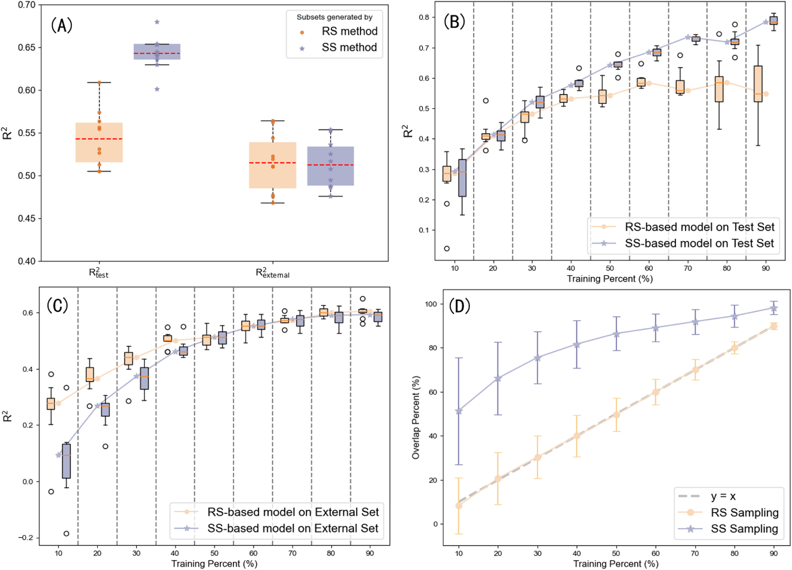
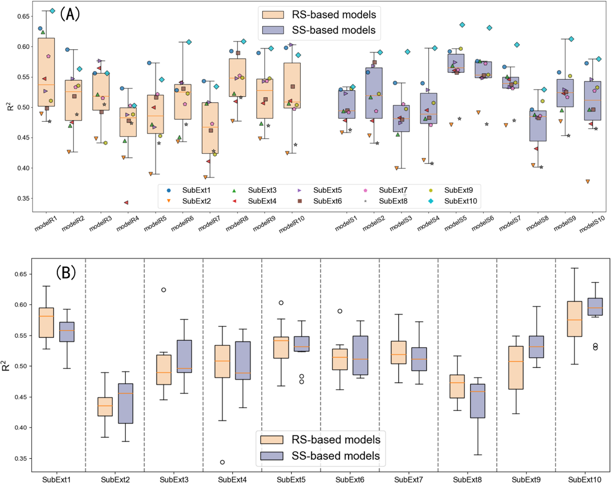
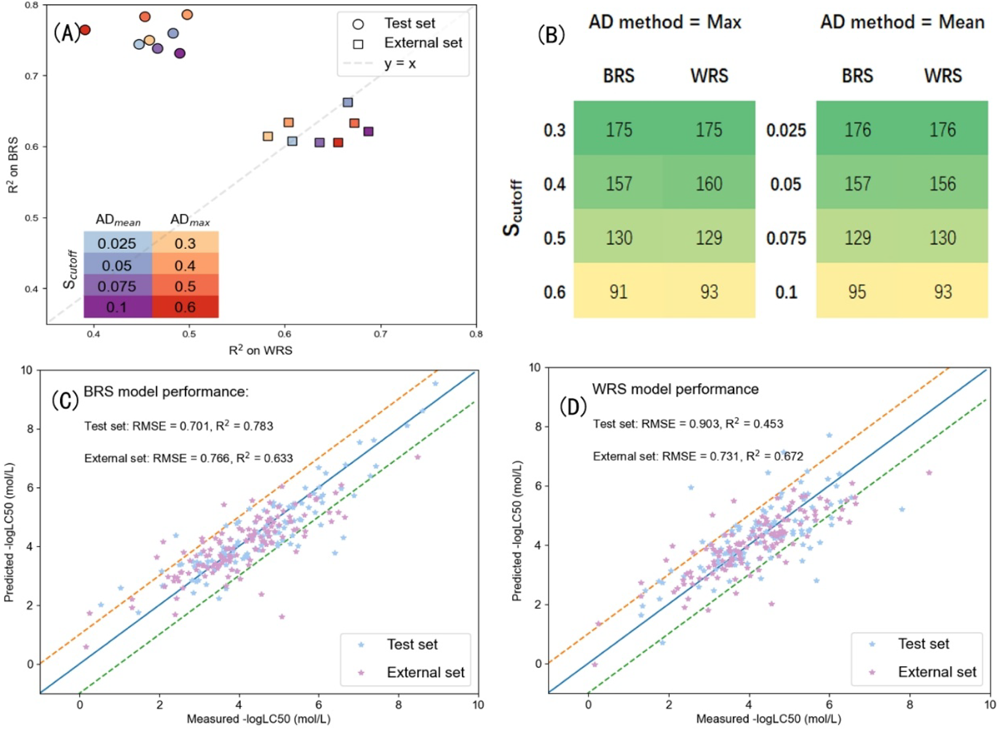
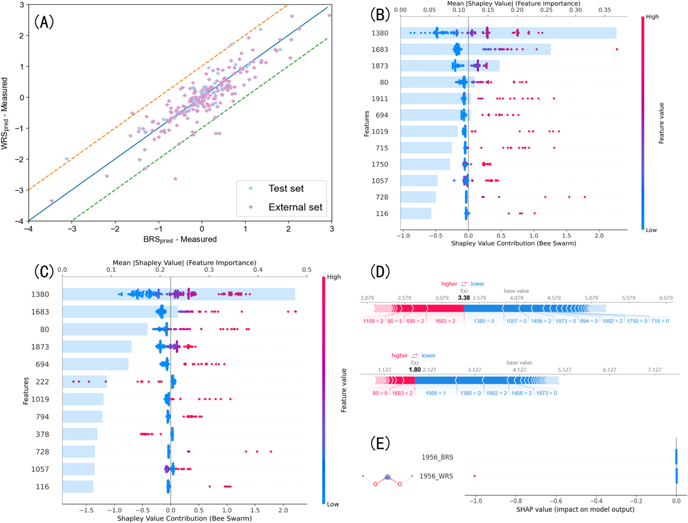
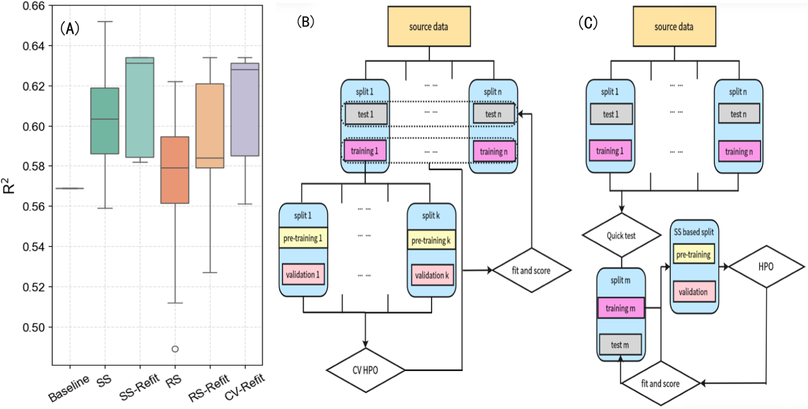

# QSAR模型的数据集划分陷阱：为何内部测试性能可能骗过你

## 本文信息
- **标题**：Toward More Trustworthy QSAR: A Systematic Discussion on Data Set Partitioning
- **作者**：Shangyu Li, Peizhe Sun
- 发表时间：2026年2月2日
- 单位：哈尔滨工业大学（深圳）
- **期刊**：Journal of Chemical Information and Modeling
- **卷期**：66卷，2199-2210页
- **引用格式**：Li, S.; Sun, P. Toward More Trustworthy QSAR: A Systematic Discussion on Data Set Partitioning. *J. Chem. Inf. Model.* **2026**，*66* (3), 2199-2210. https://doi.org/10.1021/acs.jcim.5c02465

## 摘要

> 随着QSAR模型开发的激增，人们对评估严谨性的担忧日益增加，特别是关于**数据集划分的影响**。
>
> 本研究使用5个不同规模的数据集，系统评估了**随机划分**（RS）、**基于相似性的划分**（SS）和**随机种子变化**对模型泛化能力的影响，研究覆盖了两种场景：**化学筛选的有限数据场景**和**标准建模的充足数据场景**。
>
> 研究发现，**数据集划分方法的选择**和**随机种子的选择**都会显著影响内部测试性能，而这种性能可能**无法可靠反映真实的预测能力**。虽然SS在许多情况下可以提高内部测试性能，但这些收益**不一定能转化为更强的外部泛化能力**。此外，在低采样比例下，SS在内部测试和外部测试上的表现可能都劣于RS。这挑战了**为优化内部性能而设计的合理划分能够普遍改善模型性能**这一隐含假设。
>
> 值得注意的是，在最小数据集上，不同随机种子间的内部测试变异性很高（$R^2$：0.453–0.783），而在固定的外部数据集上$R^2$变化较小（0.633–0.672），无论是否进行适用域（AD）过滤都是如此。这**削弱了跨研究的可比性**，并**强调了得出过度乐观结论的风险**。
>
> 本研究的发现强调，**测试集的构建必须与真实应用场景相一致**。研究者应避免依赖单一或精心挑选的随机种子，或不合适的合理划分方法。应采用透明的、与应用场景一致的划分协议和AD方法，以强调**真正的外部泛化能力**，而非可能被夸大的内部指标。

### 核心结论

- **内部测试性能不可靠**：无论是RS还是SS，内部测试集的性能都可能误导对模型真实预测能力的评估
- **SS的局限性**：相似性划分虽然能提高内部测试性能，但对外部数据集的泛化能力提升有限
- **随机种子的敏感性**：不同随机种子会导致模型性能的显著波动，需要多次重复验证
- **外部验证的必要性**：只有通过独立外部数据集的验证，才能可靠评估QSAR模型的预测能力

---

## 背景

QSAR（Quantitative Structure-Activity Relationship，定量构效关系）模型是药物发现和化学信息学中的核心工具，通过建立化学结构与生物活性之间的数学模型，预测分子的性质和活性。随着机器学习技术的发展，QSAR模型的开发呈现爆发式增长，但一个根本性的问题始终困扰着研究者：**我们如何知道一个模型真的有用**？

传统的模型评估方法通常将数据集划分为**训练集**、**验证集**和**测试集**，通过交叉验证获得内部测试性能，然后报告$R^2$、`RMSE`等指标。然而，这种做法存在一个致命缺陷：**内部测试性能可能无法反映模型在真实应用场景中的预测能力**。

### 关键科学问题

本研究系统地探讨了以下核心问题：

1. **数据集划分方法的影响**：随机划分（RS）和基于相似性的划分（SS）如何影响模型的性能评估？SS真的比RS更好吗？
2. **随机种子敏感性**：不同随机种子导致的训练集/测试集划分差异，会对模型性能产生多大的影响？
3. **内部测试 vs 外部泛化**：模型在内部测试集上的优异性能，是否能够转化为对独立外部数据的准确预测？
4. **数据规模的依赖性**：在数据稀缺的化学筛选场景和数据充足的标准建模场景中，这些规律是否一致？

### 创新点

- **系统性评估**：使用5个不同规模的真实数据集，系统比较RS和SS在不同场景下的表现
- **双重验证框架**：同时评估内部测试集性能和独立外部数据集性能，揭示两者的差异
- **随机种子分析**：量化随机种子变化对模型性能的影响程度
- **实用性指导**：为QSAR模型的实践者提供数据集划分和模型评估的具体建议

---

## 研究内容

### 数据集与实验设置

研究使用了5个不同规模的环境化学数据集：

#### 研究使用的数据集

| 数据集 | 样本量 | 预测目标 | 应用场景 |
|--------|--------|----------|----------|
| $K_{\text{ow}}$（辛醇-水分配系数） | 11442 | 化合物的脂溶性 | 环境行为评估 |
| $S$（水溶性） | 6113 | 化合物在水中的溶解度 | 环境归趋预测 |
| $H$（亨利定律常数） | 1940 | 气液分配平衡 | 挥发性有机物评估 |
| Fish acute toxicity（鱼类急性毒性） | 908 | 半数致死浓度$\text{LC}_{50}$ | 水生生物毒性评估 |
| $K_{\text{oc}}$（有机碳分配系数） | 964 | 土壤吸附性 | 污染物迁移预测 |

这些数据集涵盖了从**小样本**（964个化合物，$K_{\text{oc}}$数据集）到**大样本**（11442个化合物，$K_{\text{ow}}$数据集）的规模范围，能够系统评估不同数据规模下模型性能的稳定性。

#### 划分方法对比

研究对比了两种数据集划分策略：

- **随机划分**（Random Split, RS）：完全随机地将数据分配到训练集和测试集，不考虑化合物的结构相似性
- **基于相似性的划分**（Similarity-based Split, SS）：使用最大最小算法（MaxMin algorithm），根据化合物的分子指纹相似性进行划分，确保训练集和测试集的化合物在化学空间中有良好的分离

对于外部验证，研究从每个数据集中保留了**独立的测试子集**作为外部数据集，不参与任何训练和验证过程。

##### SS的具体实现

SS方法的核心目标是**最大化训练集的结构多样性**，具体实现如下：

| 步骤 | 关键操作 | 目的与输出 |
| --- | --- | --- |
| 分子指纹表示 | 多数数据集使用半径为2的计数型`ECFP4`指纹，鱼类急性毒性数据集使用半径为1 | 统一结构特征表示，便于后续相似性计算 |
| 相似性矩阵计算 | 计算所有化合物对的Tanimoto相似系数，取值范围为0-1 | 定量衡量结构相似度，构建全局相似性矩阵 |
| MaxMin选择策略 | 先随机选一个种子分子，再迭代选择与已选分子“最远”的化合物加入训练集 | 覆盖化学空间的最大范围，提升训练集结构多样性 |

这种方法让训练集包含更多样化的化合物结构，提升模型对化学空间的覆盖能力。

##### 数据集三分法

研究采用了**双重划分**策略，将数据集分为三部分：

- **第一步划分**（80:20）：使用**代表性随机划分**（RRS）将完整数据集分为**建模集**（modeling set）占80%和**外部测试集**（external set）占20%，外部测试集被完全保留不参与任何训练过程
- **第二步划分**（50:50）：从建模集中假设只测量了50%的化合物（模拟有限数据场景），这50%用于**模型训练**，剩余50%作为**内部测试集**
- **最终比例**：训练集40%、内部测试集40%、外部测试集20%，其中外部测试集在整个训练过程中完全固定

##### 外部测试集的关键作用

外部测试集在训练过程中**完全固定**，不参与任何训练、验证或超参数优化，它的作用包括：

- **模拟真实应用场景**：评估模型在完全未见过的数据上的预测能力，这是判断模型是否真正有用的关键标准
- **提供稳定评估标准**：研究表明固定外部测试集上的性能变异远小于内部测试集（$R^2$波动0.633-0.672 vs 0.453-0.783），说明外部测试更加可靠
- **避免过度优化**：防止研究者通过调整测试集组成来获得“虚假”的高性能，这在机器学习实践中是一个常见陷阱

##### 实验设计的严谨性

为确保结果的可靠性，研究采用了严格的重复实验设计来量化随机因素对模型性能的影响：

- **随机种子范围**：RS在80:20划分中使用随机种子1–49生成外部集，并据此定义RRS、BRS与WRS；对未明确说明的划分，使用随机种子1–10生成10个独立划分以降低抽样偏差
- **训练-测试配置**：RS与SS各基于10个随机种子生成20种训练-测试配置，并使用3折交叉验证训练
- **外部集稳定性评估**：从外部集抽样50%生成10个subexternal sets，用于评估外部测试的波动

---

### 核心发现1：内部测试性能的不可靠性

研究首先在**鱼类急性毒性数据集**（n = 908）上系统评估了RS和SS的表现。结果令人震惊：内部测试性能可能完全误导我们对模型能力的判断。

**图1：鱼类急性毒性数据集上RS和SS的性能对比**。该图展示了在不同训练集比例下，随机划分（RS）和基于相似性的划分（SS）在内部测试集和外部数据集上的性能表现。

- **面板A**：在50%测量比例下，SS在内部测试集上显著优于RS，但外部数据集性能差异不大
- **面板B**：不同训练集比例下，两种方法在内部测试集上的性能差异，SS始终优于RS
- **面板C**：不同训练集比例下，两种方法在外部数据集上的性能差异，RS在某些情况下甚至优于SS
- **面板D**：不同训练集比例下，RS和SS生成训练集的重叠率，RS的重叠率接近采样比例，而SS的重叠率明显更高

#### 关键观察

**SS在内部测试集上的“虚假优势”**：在50%测量比例下，SS方法在内部测试集上的表现明显优于RS，但在**独立外部数据集**上两者差异很小，说明内部性能优势并不等同于真实泛化优势。

这意味着什么？如果你仅根据内部测试性能选择SS方法，你会认为它构建了一个更好的模型。但实际上，**这个“更好”的模型在预测新数据时并不会比RS方法更强**。

> **形象比喻**：想象你在准备一场考试，SS方法就像是老师提前“透露”了考题范围，你在练习题上表现得很好（内部测试），但真正考试时（外部预测）并没有比随机准备的同学更强。因为练习题和真实考试的能力要求不完全一样。

此外，图1D显示RS的训练集重叠率接近采样比例，而SS由于MaxMin选择机制导致训练集高度重叠，这解释了SS内部测试更稳定却外部优势有限的原因。

---

### 核心发现2：外部子集选择会显著改变评估结论

**图2：鱼类急性毒性数据集上不同外部子集的性能对比**。该图展示了在多个外部子集上评估同一模型时的性能差异：面板A为模型层面的表现，面板B为外部子集层面的波动。

**关键观察**：无论采用RS还是SS，模型在不同外部子集上的表现都会出现明显波动，说明**外部集构成本身就是影响结论的重要变量**。

---

### 核心发现3：随机种子与AD设置会放大内部差异

研究系统评估了**不同随机种子**对模型性能的影响，发现这一因素常常被忽视，但实际上影响巨大。

**图3：BRS/WRS与适用域（AD）分析**。图3A比较BRS与WRS在内部测试与外部数据集上的表现，图3B展示不同AD方法与阈值下外部样本数量，图3C-D给出在最大相似度AD阈值0.5下的预测结果。

**关键观察**：BRS在内部测试上显著优于WRS，但在外部数据集上的差异明显缩小，且AD筛选后外部样本数量差异不大。摘要进一步指出，在最小数据集上内部测试$R^2$波动可达**0.453–0.783**，而固定外部数据集$R^2$仅为**0.633–0.672**，且这一稳定性不受AD过滤影响。

> **实践建议**：在报告QSAR模型性能时，**必须使用多个随机种子进行重复实验**，报告均值和标准差，而不是单一随机种子的结果。

---

### 核心发现4：SS不一定带来外部优势

研究在所有5个数据集上系统比较了RS和SS的外部泛化能力，结果挑战了“SS总是更好”的普遍认知。

**图4：模型残差分析与特征重要性**。该图展示了BRS（最佳随机种子）和WRS（最差随机种子）模型在外部数据集上的残差对比，以及SHAP特征重要性分析。

这与普遍认知形成鲜明对比——许多研究者认为SS能够提高模型的“真实性”和“可靠性”，因此应该优先使用。但本研究表明，**这种优势在独立外部验证时往往消失**。

> **批判性思考**：SS的核心假设是“测试集应该与训练集在化学空间中分离”，以模拟真实预测场景。然而，这种假设可能忽略了两个关键因素：
> 1. **化学空间的连续性**：即使测试集化合物与训练集“不相似”，它们仍然可能共享相同的药效团或作用机制
> 2. **过拟合风险**：SS倾向于选择“边界”化合物进入测试集，这些化合物可能更具“挑战性”，导致模型在内部测试时表现“较差”，但并不代表外部预测能力更强

---

### 核心发现5：建模工作流建议

研究基于发现，提出了在不同计算资源条件下的建模工作流建议。

**图5：建模工作流建议**。

面板A的关键发现包括：

- **所有使用HPO的策略都优于Baseline**：超参数优化对提升模型性能至关重要
- **使用完整训练数据集重新拟合的策略表现更好**：在HPO后用全部训练数据重新训练模型，比只用预训练数据效果更好
- **RS-holdout准确性最低**：由于验证集生成的高随机性，RS-holdout在超参数选择上存在较大变异性
- **holdout策略的现实意义**：在计算资源受限时，holdout可作为CV的折中方案，但需要注意随机性带来的不确定性

#### 建模工作流建议

基于HPO策略的比较结果，研究提出了两种场景下的工作流：

| 步骤 | 充足计算资源（面板B） | 有限计算资源（面板C） |
|------|---------------------|---------------------|
| **1. 数据集划分** | 将数据集多次划分为建模集和测试集（使用不同随机种子） | 选择适度的数据划分（对应中等性能的随机种子） |
| **2. 验证集生成** | 无需预定义验证集，使用交叉验证 | 使用**相似性划分**将建模子集分为训练集和验证集 |
| **3. 超参数优化** | 在单个建模子集上通过**重复交叉验证**进行HPO | 在验证集上进行HPO（holdout方法） |
| **4. 模型训练** | 使用选定的超参数在完整建模集上重新训练模型 | 在完整建模子集上用优化参数重新训练 |
| **5. 结果评估** | 对多次划分的结果取平均值或选择中等表现的种子（RRS），获得更现实的性能估计 | 在测试集上评估最终模型 |

**关键区别**：充足资源时使用交叉验证和多次划分以获得更稳健的结果，有限资源时使用holdout和相似性划分以平衡准确性和效率。

基于上述系统性研究发现，我们为QSAR模型的实践者提供以下建议：

### 数据集划分选择指南

| 场景 | 推荐方法 | 理由 | 注意事项 |
|------|----------|------|----------|
| **小样本**（<500） | SS为主，RS为辅 | SS提供更稳定的性能估计 | 必须外部验证，内部性能可能误导 |
| **中等样本**（500-5000） | RS和SS并行比较 | 两者外部性能接近，无明确优势 | 报告两种方法的结果 |
| **大样本**（>5000） | RS为主 | RS外部性能更好，且计算效率高 | 仍然需要多次重复实验 |
| **化学筛选场景** | SS优先 | 需要预测真正“新”的化合物 | 重点关注外部验证 |
| **标准建模场景** | RS优先 | 目标是构建通用模型 | 交叉验证即可 |

### 模型验证最佳实践

1. **必须进行外部验证**：仅报告内部测试性能是不够的，必须使用独立外部数据集验证模型
2. **多随机种子重复**：至少使用5-10个不同随机种子，报告均值和标准差
3. **报告训练集重叠率**：特别是使用SS时，应报告不同随机种子下训练集的重叠率
4. **敏感性分析**：系统评估不同训练集比例（20%、40%、60%、80%）下的性能差异
5. **避免“cherry-picking”**：不要只报告表现最好的随机种子结果

### 报告规范

在发表QSAR模型研究时，应完整报告以下信息：

- **数据集划分方法**：RS还是SS？具体算法是什么？
- **随机种子**：使用了哪些随机种子？是否重复实验？
- **训练集比例**：训练集、验证集、测试集的比例是多少？
- **重叠率分析**：不同随机种子下训练集的重叠率是多少？
- **内部vs外部性能**：同时报告内部测试集和独立外部数据集的性能
- **性能波动范围**：不同随机种子下的性能分布（箱线图或均值±标准差）

---

## Q&A

- **Q1**：为什么SS在内部测试集上表现更好，但无法转化为外部优势？这不合理啊？
- **A1**：这个现象初看确实反直觉，但有其深刻原因。SS的核心假设是“测试集应该与训练集在化学空间中分离”，但这可能导致两个问题：
  1. **测试集偏差**：SS倾向于选择“边界”化合物进入测试集，这些化合物可能更具“挑战性”，导致模型在内部测试时表现“较差”，但这个“较差”并不代表外部预测能力弱
  2. **训练集代表性**：SS为了确保训练集和测试集的分离，可能牺牲了训练集的多样性，导致模型过拟合训练集的特定化学子空间，而对其他子空间的泛化能力下降

  形象地说，SS就像让学生考试“超出教学大纲”，学生在内部测试时表现较差（因为题目确实没见过），但这不代表他们在真实考试（外部预测）时会更差。真实考试可能既有一些“超纲题”，也有一些“常规题”，SS的学生可能在“常规题”上反而表现不佳。

- **Q2**：本研究只用了环境化学数据集，结论是否适用于其他QSAR任务（如活性预测、物化性质预测）？
- **A2**：本研究使用的数据集涵盖了环境化学的不同性质和规模（从964到11442个样本），具有一定代表性。但是，**不同QSAR任务的特性可能不同**：
  - **物化性质预测**（如本研究）：数据集规模通常较大，性质与结构关系较直接，RS可能更合适
  - **毒性预测**：通常数据集较小，且化合物结构多样性高，SS可能更有优势
  - **活性预测**：通常针对特定靶点，化合物可能集中在特定化学空间，RS可能更合适

  因此，本研究的**核心方法论和发现是通用的**（如内部性能不可靠、随机种子影响大、必须外部验证），但**具体的RS vs SS选择**需要根据具体任务和数据特性调整。

---

## 关键结论与批判性总结

### 潜在影响

- 强化了**外部泛化是核心指标**的共识：单看内部测试很容易得出过度乐观的结论
- 提醒社区避免**挑选随机种子**与**挑选划分策略**造成的结论偏差，强调**透明**与**可复现**
- 将数据集划分从**技术细节**提升为**科学问题的一部分**，要求与真实应用场景对齐

### 存在的局限性与适用边界

- 结论主要建立在**五个毒性数据集**与既定评估流程上，仍需在更多任务类型与场景下验证
- 研究显示在低采样比例下，**SS不一定优于RS**，内部优势可能源于测试集变得更容易的组成偏差
- 即便引入适用域筛选，外部测试的波动仍显著小于内部测试，说明**内部好看不等于外部可靠**

### 未来研究方向

- 建立与真实应用对齐的**测试集构建规范**，明确外部测试集的角色与构建逻辑
- 完整记录并公开**随机种子与划分细节**，提升跨研究的可比性与可复现性
- 系统评估不同划分与适用域策略在外部数据上的**稳健性**，优先强调可迁移的泛化能力
