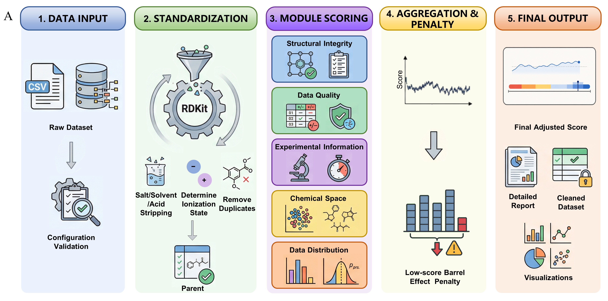
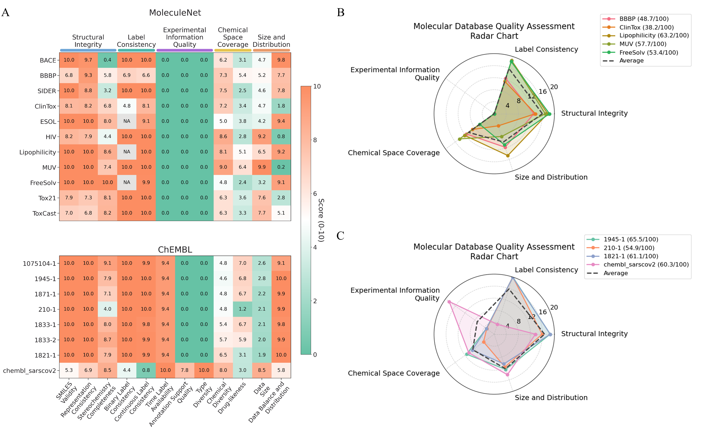
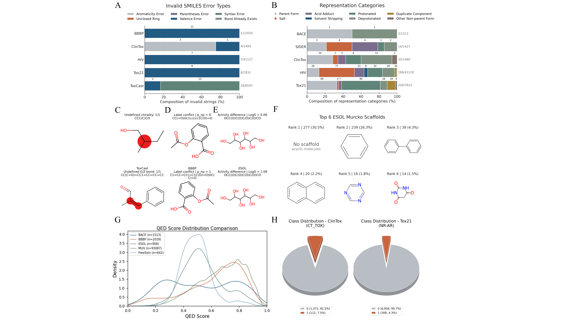
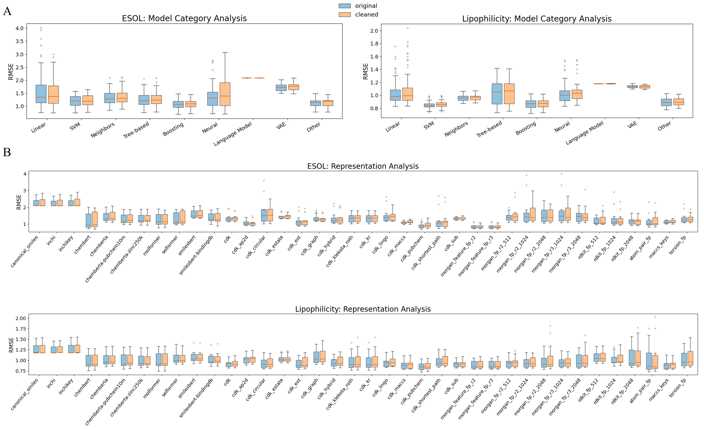
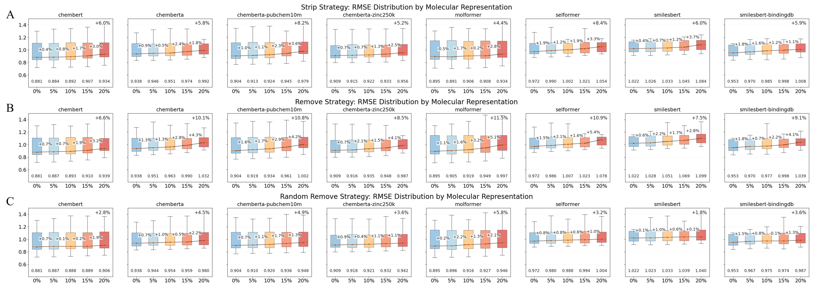

# MolJam——量化分子数据集质量的开源工具

## 本文信息

- **标题**：MolJam: A Multidimensional Framework for Assessing Molecular Dataset Quality and Its Impact on Machine Learning
- **作者**：Peng Wang, Zhaoqi Shi, Xufan Gao, Ruhong Zhou
- **发表期刊**：bioRxiv（预印本）
- **发表时间**：2026年8月25日
- **DOI**：<https://doi.org/10.64898/2026.08.21.746384>
- **单位**：浙江大学定量生物中心、浙江大学物理学院、美国哥伦比亚大学化学系
- **引用格式**：Wang, P.; Shi, Z.; Gao, X.; Zhou, R. MolJam: A Multidimensional Framework for Assessing Molecular Dataset Quality and Its Impact on Machine Learning. bioRxiv, 2026. <https://doi.org/10.64898/2026.08.21.746384>
- **代码与数据**：<https://github.com/thezombie0/moljam/>

## 摘要

> 高质量分子数据集是化学信息学和生物信息学中可靠机器学习的基础，但数据集质量很少被系统评估，其与下游模型性能的关系也仍不清楚。本文提出MolJam，一个开源框架，使用**12个标准化指标**从**五个维度**（结构完整性、数据质量、实验信息质量、化学空间覆盖、数据分布）对分子数据集质量进行定量评估。将其应用于11个MoleculeNet和8个ChEMBL数据集后，MolJam揭示了广泛而不均一的质量问题，包括**70.72%的分子未定义立体化学**、不一致的分子表示和相互矛盾的标签。**提高这些质量指标是否一定会提高机器学习性能？**对ESOL和Lipophilicity数据集的精修提升了MolJam质量分数，但对预测性能的影响却是混合的，提示数据量减少带来的竞争效应。受控消融实验进一步表明，数据集质量和数据量都对模型性能有贡献；尤其值得注意的是，当数据量增长能够抵消质量惩罚时，**保留立体化学信息不完整的分子可能比直接删除它们表现更好**。因此，分子数据集整理不能被简化为最大化数据洁净度，而需要在多个数据质量维度与信息损失之间取得平衡。

### 核心结论

- MolJam把分子数据集质量拆成**五个维度、十二个指标**，将每个指标映射到0–10分，再聚合成0–100分的可解释总评分。
- 对11个MoleculeNet和8个ChEMBL数据集的普查显示，**公开基准普遍带着SMILES解析错误、未定义立体化学、标签矛盾等缺陷**。
- 用MolJam的标准流程清洗ESOL和Lipophilicity后，**MolJam分数上升，但下游机器学习模型的RMSE并没有普遍下降**。
- 消融实验表明，数据质量和数据量共同影响模型表现，二者缺一不可。
- 数据集整理需要在质量维度和信息保留之间做权衡，而不是只看单一指标。

### 创新点

- **定量、可解释的多维评估工具**：以往工具大多只处理结构标准化或单一缺陷，MolJam把标准化、评分、聚合、惩罚、报告整合到一个流程里，输出可直接定位问题所在。
- **化学感知的标准化协议**：MolJam不仅做RDKit标准化，还提供 `canonical_smiles`、`observed_parent_smiles`、`parent_smiles` 三个层次的归并粒度，让用户按研究需求选择。
- **系统性的公开基准质量普查**：MoleculeNet系列和ChEMBL衍生数据集被放在同一套评分体系下比较，量化了以往多停留在经验层面的问题。
- **用可量化实验回应质量与数量困境**：通过控制数据质量和数据量的消融，MolJam提供了一个讨论数据整理取舍的具体案例，而不只是抽象原则。

## 背景

分子数据集是AI制药和化学信息学的基础设施。MoleculeNet、Therapeutics Data Commons、PubChem、ChEMBL这些数据集为模型提供了公共测试场，也让不同架构之间的比较成为可能。过去十几年，从随机森林到Transformer，**新模型几乎都会在这些基准上跑一轮**，但很少回头检查这些基准本身的质量。

但这些基准的可信度近年被反复质疑。**排行榜上的高分，有一部分来自标签泄漏和对单一榜单的过拟合**；更大的模型、更多的数据，常常掩盖而非解决底层数据质量问题，模型可能在一个本身有缺陷的答案上越练越准。换句话说，先回答数据集本身可不可信，再谈模型准不准，才是更合理的研究顺序。

**数据本身的质量，却很少被系统讨论**。研究者已经发现了不少问题：SMILES字符串无法解析、同一化合物出现多种表示、立体化学未定义、相同结构却有矛盾标签、数据分布高度不平衡等等。标签矛盾也并不少见，ClinTox中有19组相同结构被标为不同的二分类标签。

现有工具大多是单点解决方案。RDKit负责解析和规范化，MolVS和datamol提供标准化接口，一些已发表的数据整理协议给出了最佳实践。但这些工具没有回答一个更基础的问题：**这个数据集整体质量如何？问题出在哪里？**该领域缺少一把统一的标尺，能把结构有效性、标签可靠性、实验注释完整性、化学空间覆盖和数据分布放在同一个可解释的框架里打分。

### 关键科学问题

- 如何定量地、从多个角度评估分子数据集质量，**而不是只给出通过/不通过这种二元判断**？
- 当前广泛使用的公开基准（MoleculeNet、ChEMBL衍生集），**究竟藏着哪些质量缺陷**？
- 提高MolJam定义的质量分数，**是否一定转化为下游机器学习性能的提升**？
- 在数据整理中，**清洗与保留之间的权衡该如何量化**？

## 研究内容

### MolJam的工作流程：从原始数据到质量报告

**图1：MolJam五阶段流程**。数据输入→结构标准化→模块评分→聚合与低分惩罚→最终输出。每个阶段都直接对应RDKit化学处理或质量指标计算。

MolJam把数据整理拆成五个阶段（图1）：**从列标注、标准化到指标聚合，每一步都可追溯、可复现**。第一步，用户把表格中的列标记为分子标识符、标签或实验元数据；第二步，用RDKit做解析、标准化、去盐/溶剂/酸加合物、电荷中和，并生成三个粒度的SMILES（见下）；第三步，计算五个维度下的十二个指标；第四步，把指标聚合到维度，再用改进的Cannikin Law做低分惩罚；最后输出总分、逐指标报告、可视化图表，以及可选的精修数据集。

- **三层SMILES标准化**。MolJam的化学感知体现在它对同一分子输出三个不同归并粒度的SMILES，研究者可按需求选择：
  - `canonical_smiles`：RDKit解析成功后重新生成的规范SMILES，**只统一写法、不做删减**，盐与溶剂等成分原样保留，是最贴近原始输入的层级；
  - `observed_parent_smiles`：**仅剥离盐/溶剂/酸加合物**、保留观测到的质子化状态与立体化学，最大限度保留原始记录信息；
  - `parent_smiles`：在observed_parent基础上进一步统一质子化状态，适合需要同一母核只算一次的表示一致性、结构重复等分析。
- **评分与低分惩罚**。每个指标先按预设规则映射到0–10分（越高越好），同一维度下的指标再聚合成维度分；总分在维度分基础上，用改进的“木桶定律”（Cannikin Law）施加惩罚——**当任一关键指标明显偏低时，整体分数被额外压低**，使单点严重缺陷无法被其他维度的满分掩盖。
- **下游机器学习基准协议**。为把质量分数与模型性能联系起来，研究用18种机器学习算法×38种分子表示（共504种组合）在ESOL和Lipophilicity上训练回归模型，以RMSE为主要指标，并用配对t检验比较精修前后的差异。这一协议同时支撑了图4的清洗是否提升性能与图5的质量vs数量消融。

> 数据整理最怕黑箱：**MolJam 把标准化到打分的每一步都做成可复现、可质问的环节**，你才随时能说清一条记录为何被改、为何被删。

### 五个维度与十二个指标

**表1：MolJam的五个维度与十二个指标**

| 维度 | 指标| 衡量内容  |
| ------- | --------- | -------------------- |
| 结构完整性| SMILES有效性 | 分子标识符能否被解析为化学有效结构 |
| 结构完整性| 表示一致性| 同一化合物的不同记录是否被规范到一致形式 |
| 结构完整性| 立体化学完整性| 手性中心与立体双键是否被完整指定|
| 数据质量 | 二分类标签一致性  | 结构相同的记录是否带有相同的0/1标签  |
| 数据质量 | 连续标签一致性| 同一化合物的重复测量值是否一致 |
| 实验信息质量  | 时间标签可用性| 记录是否带有检测或发表时间等注释|
| 实验信息质量  | 注释支持质量 | 实验元数据列是否完整、信息丰富 |
| 实验信息质量  | 类型多样性| 实验上下文种类的多样性|
| 化学空间覆盖  | 化学多样性| 分子在化学空间中的分散程度与骨架多样性  |
| 化学空间覆盖  | 类药性  | 分子群体的平均QED类药性评分 |
| 数据规模与分布 | 数据规模 | 数据集是否足够支撑可靠训练|
| 数据规模与分布 | 数据平衡与分布| 二分类标签是否平衡，连续标签是否接近正态 |

先把每个指标映射到0–10分，维度内归一化聚合，最后加上低分惩罚，得到0–100分的总分。**总分高不代表每个维度都好**，需要结合雷达图和热图看短板。

> 五个维度、十二个指标，最后汇成一个数字，而数字真正的用处，是**能顺着分数反查到具体哪条记录出了问题**——这比“感觉这个集不行”强得多。

### 公开基准的质量画像

**图2：公开数据集质量画像**。(A) 11个MoleculeNet和8个ChEMBL衍生数据集的指标级热图；(B) 代表性MoleculeNet数据集的维度雷达图；(C) 代表性ChEMBL衍生数据集的维度雷达图。颜色越偏红表示该指标得分越低。

把MolJam应用到11个MoleculeNet和8个ChEMBL数据集上，**MoleculeNet系列整体得分偏低，ChEMBL衍生集整体偏高**，只是各自的短板不一样。

- 结构完整性方面，SMILES解析错误虽然比例不高，却**几乎存在于所有MoleculeNet数据集中**；ToxCast有18条无效记录，错误类型包括芳香性、括号、价键、未闭合环、语法和键异常。
  - 更严重的是立体化学：BACE中**70.72%的分子带有未定义手性中心**，SIDER为46.74%，HIV为40.81%，BBBP为33.69%。
- 表示一致性针对的是同一母核、不同形态的问题：**看似不同的记录，可能只是同一分子的不同写法**。以ToxCast为例，348组分子共享同一个 `parent_smiles` 却有不同表示，其中59.6%是盐形式重复；Tox21的209组问题中，43.1%来自不同质子化状态。
- 标签一致性则是另一类隐患：**相同结构却拿到不同标签，说明标注过程本身存在不一致**。ClinTox有19组（1.30%）相同结构被赋予不同二分类标签，BBBP有10组（0.51%）；连续标签的重复测量离群值则主要出现在ESOL中。

**表2：MoleculeNet数据集主要质量问题**

| 数据集 | 样本量| 无效SMILES| 未定义手性中心| 立体双键未定义  | 结构重复  | 标签矛盾  |
| ------------- | ----- | ---------- | -------------- | ------------- | ---------- | ---------- |
| BACE| 1513  | 0| 1070 (70.72%)  | 36 (2.38%) | 0| 0|
| BBBP| 2050  | 11 (0.54%) | 687 (33.69%)| 406 (19.91%)  | 64 (3.14%) | 10 (0.51%) |
| SIDER | 1427  | 0| 667 (46.74%)| 289 (20.25%)  | 0| 0|
| ClinTox  | 1484  | 4 (0.27%)  | 402 (27.16%)| 231 (15.61%)  | 19 (1.28%) | 19 (1.30%) |
| ESOL| 1128  | 0| 212 (18.79%)| 111 (9.84%)| 11 (0.98%) | NA |
| HIV | 41127 | 7 (0.02%)  | 16782 (40.81%) | 9598 (23.34%) | 0| 0|
| Lipophilicity | 4200  | 0| 592 (14.10%)| 97 (2.31%) | 0| NA |
| MUV | 93087 | 0| 21437 (23.03%) | 6117 (6.57%)  | 0| 0|
| FreeSolv | 642| 0| 1 (0.16%) | 22 (3.43%) | 0| NA |
| Tox21 | 7831  | 8 (0.10%)  | 1412 (18.05%)  | 789 (10.09%)  | 0| 0|
| ToxCast  | 8597  | 18 (0.21%) | 1484 (17.30%)  | 849 (9.90%)| 0| 0|

实验信息质量把MoleculeNet和ChEMBL两个家族彻底分开，**有没有实验注释，直接决定了这个维度的天花板**：所有MoleculeNet数据集因为没有实验元数据列，这个维度全部得0分；ChEMBL衍生集则因为有时间标签、检测方法信息等而获得较高分数。不过simpd系列只保留了时间标签，注释支持质量和类型多样性仍为0；而chembl_sarscov2保留了更完整的元数据，在这两个指标上得分更高。

化学空间覆盖方面，ESOL和FreeSolv表现最差：**骨架高度集中、投影明显聚集，意味着模型可能只见过很窄的化学空间**。ESOL排名第一的骨架占了28.10%，FreeSolv甚至高达49.84%；它们的t-SNE投影也明显聚集。MUV则分布最广，最大骨架仅占2.24%。

**同一家族内部，短板也各不相同**：Lipophilicity是MoleculeNet中得分最高的（63.2/100），MUV为57.7，BBBP为48.7，ClinTox最低（38.2）。ChEMBL衍生集大多超过60分，但chembl_sarscov2（60.3）展现出独特的雷达形状：**化学空间覆盖和实验信息质量最高，但结构完整性和标签一致性较低**，这正反映了它来自过去六年大量不同检测方法的实验数据。

> 同一把尺子量下来，两类基准的“差”方向相反：一个缺注释、一个缺广度——**它们不是同一种不合格，不能只比总分高低**。

### 典型质量问题长什么样

**图3：公开数据集中的典型质量问题**。(A) 无效SMILES错误类型；(B) 表示不一致的类别；(C) 立体化学未定义示例；(D) 二分类标签矛盾示例；(E) 连续标签不一致示例；(F) ESOL排名前六的Murcko骨架；(G) QED类药性分布；(H) 不平衡数据分布示例。

图3把抽象指标具体化。无效SMILES可能来自芳香性、括号、价键、未闭合环、语法或键类型错误；**表示不一致常常是盐、溶剂、酸加合物或质子化状态不同造成的**，是同一母核的多种形态；标签矛盾则直接显示同一个分子、两个标签。再看化学空间覆盖：ESOL的骨架高度集中，**QED分布显示FreeSolv和ESOL包含大量低类药性分子**。

### 清洗数据后，模型一定变好吗？

**图4：数据集精修对下游机器学习性能的影响**。(A) 按模型类别分组的ESOL和Lipophilicity精修前后RMSE分布（蓝色为原始，橙色为精修后）；(B) 按分子表示分组的RMSE分布。

**清洗让质量分数上升，却未必让模型变好**。研究者用MolJam的精修流程处理ESOL和Lipophilicity：去掉无效SMILES、去掉未定义立体化学、删掉同一结构同一活性值的完全重复记录。精修后，两个数据集的MolJam分数都提高了，ESOL从53.8升到56.7，Lipophilicity从63.2升到65.0。

然后他们按前述504种组合协议（18种算法×38种分子表示）训练模型，**结果却并不一致**：Lipophilicity的改善率只有21.4%（504种组合中仅108种在精修后RMSE更低），中位数RMSE从0.943微升到0.950；ESOL改善率35.7%，但中位数RMSE也从1.213升到1.229。配对t检验显示，大多数组合在精修前后没有显著差异。

精修在提高质量的同时，也砍掉了数据量：ESOL从1128条降到908条（减少19.5%），Lipophilicity从4200条降到3608条（减少14.1%）。**质量上去了，信息量下来了，两者相互抵消**。

> 别把 MolJam 分数当 KPI：**分高量的是质量，不是对你的任务有多好用**——它诊断数据集，不保证模型受益。

### 质量vs数量：消融实验给出的答案

**图5：Lipophilicity数据集上控制数据质量与数据规模的消融实验**。(A) strip策略：保留分子但抹去立体化学标记；(B) remove策略：直接删除这些分子；(C) random remove策略：随机删除等量分子。百分比表示相对于精修后基线的性能下降。

为了把“质量效应”和“数量效应”拆开，研究者从精修后的Lipophilicity出发，设计了三种扰动策略，**用控制变量把质量和数量各自的影响单独拎出来**：strip（保留分子但抹去立体化学标记，质量下降、数量不变）、remove（直接删除这些分子，质量上升、数量下降）、random remove（随机删除等量分子，数量下降、质量大致不变）。

当扰动比例从0%增加到20%时，三种策略的性能都在下降，说明**质量和数量都对模型有正向贡献**。但下降幅度明显不同：strip策略平均下降6.2±1.4%，random remove下降3.8±1.3%，remove策略下降最多，达到9.4±1.8%。

这意味着，对于立体化学这个维度，**直接删除信息不完整的分子，反而比保留它们并当作低质量数据更伤模型**。当然，最好的情况仍然是立体化学完全标注清楚；但如果现实条件不允许，盲目删除未必是更优选择。

> 随机删样本只掉约 4%，专挑不完整分子删却掉 9%——**模型宁可收下带瑕疵的信息，也不要更齐整的空白**。

## 关键结论与批判性总结

MolJam的价值不仅在于发现了一堆质量问题，更在于**把这些质量问题变成可比较、可追踪、可复现的分数**。它像是给分子数据集做了一次标准化体检：哪里健康、哪里带病、哪里需要取舍，结果一目了然。

- **系统性诊断**：五个维度、十二个指标覆盖了从化学结构到实验注释再到数据分布的主要风险点，低分惩罚机制也防止了某个维度很差但整体分数还高的误导。
- **质量与数量需要平衡**：清洗数据不是免费午餐。ESOL和Lipophilicity的例子说明，提高单项质量指标可能以损失数据量为代价；消融实验进一步说明，在立体化学这个场景下，**保留不完整记录有时优于删除**。
- **公开基准还有很大改进空间**：MoleculeNet普遍缺少实验元数据，ChEMBL衍生集虽然得分较高，但化学空间覆盖往往较窄。chembl_sarscov2的独特画像也说明，检测方法来源越多元，结构完整性和标签一致性越容易出问题。

### 局限和未来方向

- 目前的指标主要基于SMILES层面的二维描述，**未来可以加入图级别或三维结构描述符**；
- 维度权重目前是固定的，**针对不同任务自适应加权会更有用**；
- 把MolJam与不确定性建模结合，也可能帮助识别对模型预测影响最大的问题样本。
- 此外，未标注立体化学的分子最好被视为外消旋体，并用额外的元数据列说明其组成，而不是简单地当作错误或删除。

> **把质量画像作为数据集发布的标准附件**，就像模型卡（model card）之于训练好的模型，或许是这个工作更长远的意义。
