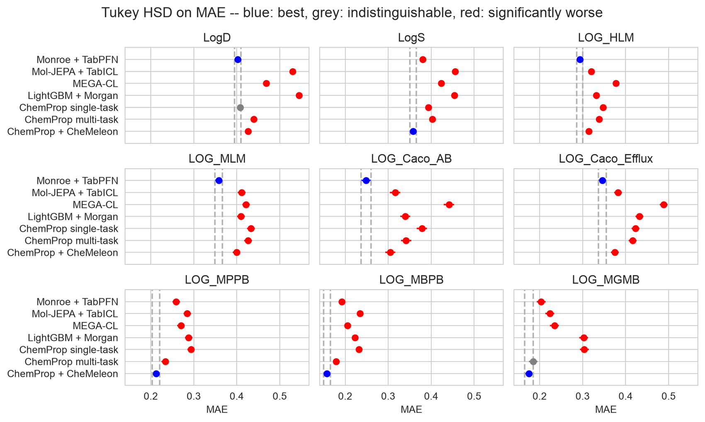
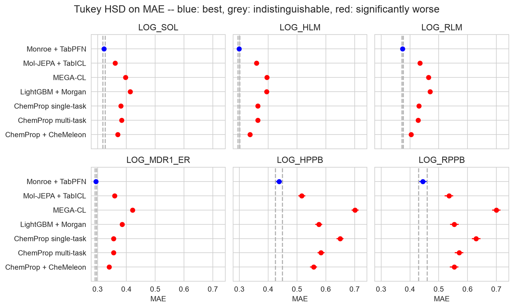
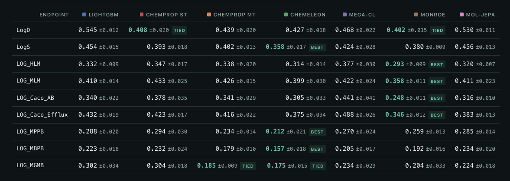

> 本文翻译自Pat Walters的博客 [Let the Agents Do the Benchmarking](https://patwalters.github.io/Let-the-Agents-Do-the-Benchmarking/)，原文发表于2026-08-29。以下为直译，版权归原作者所有。

## 一个全新的世界

在计算工作中，很少有事情比读了一篇精彩的论文、从GitHub上拽下代码、再在可信数据集上跑一遍验证更让人满足。然而，那份最初的热情常常被现实的麻烦冲散：大把时间消耗在调试CUDA、PyTorch、PyTorch Lightning之间此起彼伏的版本冲突，以及一张没完没了的依赖网上。即便代码真跑通了，论文的价值也常被对**有缺陷数据集**（比如TDC或MoleculeNet）的依赖，以及**缺乏严格的统计比较**所削弱。

幸好，那些令人沮丧的日子已经彻底成为过去，也希望对你而言同样如此。借助我的朋友Claude以及它手下的一组agent，我最近做benchmark连一个Git仓库都没手动clone过。这种**行云流水般的方式与整体成效**，着实让我吃惊。

为了启动benchmark流程，我先指定目标数据集。鉴于我聚焦ADMET建模，我选了近期[OpenADMET ExpansionRx Blind Challenge](https://huggingface.co/spaces/openadmet/OpenADMET-ExpansionRx-Challenge)的数据集，以及[Cheng Fang及其同事在2023年论文](https://pubs.acs.org/jcisd8/article-abstract/63/11/3263/850292/Prospective-Validation-of-Machine-Learning?redirectedFrom=fulltext)里提供的**Biogen**数据集。几个关键因素让它们成为**出类拔萃的评测选择**。

这些数据并非像Franken-dataset（弗兰肯数据集）那样从几十篇互不相干的文献拼凑而来，而是由同一实验室的同一批科学家统一产出。我对那些整理早期文献集、采集原始测量值的先驱绝无冒犯之意；他们的贡献对让这个领域起步至关重要。但我们现在完全有能力达到**更高的标准**。都2026年了，还依赖**过时又有缺陷的基准数据**，完全说不过去。想和更老的论文保持一致也不是正当理由——就像我妈以前常说的：「要是你朋友跳桥，你也跟着跳吗？」

> 这些化合物覆盖的化学空间，忠实地反映了标准的药物发现场景。同时纳入ExpansionRx与Biogen两套基准集，让我们能评估**两种截然不同的真实世界情境**：ExpansionRx数据集来自活跃的发现项目、高度同系物（congeneric），是**hit-to-lead与lead优化阶段的准确写照**；而Biogen集多半由商业筛选分子构成，捕捉了早期发现阶段的特征。

这些数据集拥有真实的动态范围。文献benchmark里最让我长期不爽的一点，就是它们**夸张得离谱的人为量程**；那些声称能预测跨越十几个数量级的水溶性的论文，至今还在发表，实在让我费解（说真的，这到底是谁在审稿？）。**在如此夸张的数据上声称强性能，比[在浴缸里钓鱼](https://patwalters.github.io/Please-Stop-Fishing/)还假**。

## 让评测跑起来

为了确保benchmark流程遵循严格的统计规范，在选定基线数据集之后，我让Claude参考了我们2025年的论文[《Practically significant method comparison protocols for machine learning in small molecule drug discovery》](https://pubs.acs.org/jcisd8/article-abstract/65/18/9398/3687588/Practically-Significant-Method-Comparison?redirectedFrom=fulltext)，以及几篇相关博客。我请Claude搭建一个**包含四个候选模型的初始套件**：用**LightGBM**的**Morgan指纹**基线、**ChemProp**单任务、**ChemProp**多任务，以及接入**CheMeleon**基础模型的**ChemProp**。Claude自行定位了所需的代码仓库与文献。虽然它起初拉到的是CheMeleon预印本，但很快更新为[近期发表的JCIM论文](https://pubs.acs.org/jcisd8/article-abstract/doi/10.1021/acs.jcim.6c01546/5250516/Deep-Learning-Foundation-Models-for-Low-Data?redirectedFrom=fulltext)。

我没有依赖自己的笔记本，而是让Claude把benchmark的计算负载卸载到地下室的Linux服务器上以加速。为了做会话编排、并在合上笔记本时不中断任务，我依赖[**herdr**](https://herdr.dev/)——一个为agent驱动的工作流量身打造、受tmux启发的现代工具。如果你还没试过herdr，我强烈推荐你去看看（我的朋友们已经听我反复安利听到烦了！）。

我们用论文里写的**5×5交叉验证协议**评估了每个方法。每个数据集都有固定的留出测试集，25个复现模型来自对训练分子做5次五折交叉验证、按聚类分组，于是每个方法在每一折都看到完全相同的训练分子，并在同一个未被触碰的测试集上打分。划分设定如下：

- **ExpansionRx数据集**：用挑战赛自带的train/test划分，5,326训练/2,282测试，70/30。
- **Biogen数据集**：数据本身不带划分，于是把整个BitBIRCH聚类留出，直到测试集达到同样的30%。
- **基础模型**：CheMeleon与MEGA-CL在训练折上微调；Monroe与Mol-JEPA**冻结编码器、做上下文内（in-context）预测，完全不做下游训练**。

到此为止做的这些都不错，但**算不上特别激动人心**。过去几周，我们见证了**三个新的化学基础模型**登场。

### [MEGA-CL](https://arxiv.org/abs/2607.24314)（arXiv:2607.24314）

走**图对比学习路线**。它把一个增强版GCN+消息传递骨干（加了残差连接和层归一化）与多头图外部注意力模块配对。模型在约1亿分子上用NT-Xent对比学习目标预训练，再用作者发布的checkpoint对每个endpoint微调。由于该架构为单目标任务设计，**每个endpoint都需要单独训练一个模型**。

### [Monroe](https://arxiv.org/abs/2608.18982)（arXiv:2608.18982）

是一个**58.5M参数的图transformer**，建立在GRIT架构之上。它在1,152个同步任务上做了广泛预训练：为8,100万分子预测62个量子化学性质（通过PM6）、1,089个来自PCBA的二值生物assay，外加一个构象去噪目标。它的图表示很特别——额外加边来编码立体化学构型，因而能**区分立体异构体**。下游任务里**编码器保持冻结**：每个分子被映射成一个720维向量，[**TabPFN**](https://github.com/PriorLabs/tabpfn)用**单次前向**直接从这些表示做上下文内（in-context）预测。

### [Mol-JEPA](https://arxiv.org/html/2608.22642v2)（arXiv:2608.22642）

约50M参数，来自Boehringer Ingelheim、Tübingen大学、Brown大学与UT Austin。它放弃了常见的「扰动结构」自监督路线（作者认为这不适合化学），改用**联合嵌入预测架构**（JEPA, joint-embedding predictive architecture）：在14类分子数据（图、ECFP/MOE描述符、xTB/DFT计算、各类实验标签）上掩盖整个模态，用一个transformer从其余模态预测缺失的潜在表示，训练用469万分子。推理时模型**只需要SMILES字符串**；冻结的512维CLS token（[CLS]令牌）随后交给[**TabICL**](https://github.com/soda-inria/tabicl)做下游任务。

> Monroe与Mol-JEPA属于**同一方法论类别**，与MEGA-CL区分开来。前二者**冻结编码器、靠上下文内表格模型做适应**，而MEGA-CL**对整个网络做针对每个endpoint的完整微调**。

在三个模型的所有case里，我都**只是提供了预印本PDF**，让Claude去下载、测试代码，然后跑和之前方法相同的benchmark。整个过程竟**如此轻松**，让我惊讶。过去，benchmark一个方法要花我好几天。我通常得花几小时只为解决代码跑通，再花更多时间搞清楚输入、跑代码、写分析脚本。而这次，我**给了几条prompt、上床睡觉，醒来就收到一份漂亮的报告**。说实话，中间出了一个小故障，但那不是Claude的错。下载MEGA-CL的GitHub仓库后，Claude指出模型权重缺失。我翻了仓库和Zenodo档案，果然确实缺失。我邮件联系了MEGA-CL的作者，他们很快把模型权重补进了仓库。谢谢Jinfeng Liu！

## 真章在报告里

我让Claude把结果写成一份artifact。我不得不承认，**Claude的报告比我凭自己能力写出的任何东西都好**。它包含我钟爱的Tukey诚实显著性差异（HSD, honestly significant difference）图，Claude还做了一版更好的「可怕的加粗表」——不只是把「最佳」加粗，而是**标出哪些结果在统计上等价**。更妙的是，全部分析代码与数据都在独立的GitHub仓库里保持更新，我凭一个URL就能分享报告。

https://claude.ai/code/artifact/fa406d3a-3b09-4e17-9e1c-ecd2d92903d2

此时此刻，你一定迫不及待想知道哪个基础模型表现最好；跨两套数据集，都有一个**清晰的赢家**。报告很长，我力劝你去看看。为了简洁起见，我只分享几张关键图。先看ExpansionRx数据集中9个endpoint的平均绝对误差（MAE, mean absolute error）。既然看的是MAE，越低越好。对不太熟悉这些图的人说明一下：最佳方法标蓝，其他统计等价的方法标灰。若某方法显著差于最佳，它的点标红。评测ExpansionRx时，两个明显的赢家浮现：Monroe + TabPFN拿下LogD、两个微粒体稳定性endpoint、两个Caco-2 endpoint；而ChemProp + CheMeleon拿下全部三个蛋白/组织结合endpoint加水溶性（LogS）。**胜负按assay切分，而非按数据量多少**。LogS的训练数据比任何endpoint都多，5,128条，ChemProp + CheMeleon仍拿下它，Monroe + TabPFN紧随其后。同样值得注意的是：**MEGA-CL与Mol-JEPA在全部九个endpoint上，既无一最佳、也无并列最佳**。

Biogen数据集上，**冠军更没有悬念**。每一个case，Monroe + TabPFN都压过其他模型。ExpansionRx那种**按assay切分的格局**在这里不复现。两个血浆蛋白结合endpoint本该是ChemProp + CheMeleon的强项，却恰恰是它在整页里**输得最惨的地方**。

我也很喜欢Claude对「可怕的加粗表」的替代方案：不是只把「最佳」方法加粗，而是**把统计等价的方法标为「并列（tied）」**。

有一个**caveat值得专门flag**，而且是**Claude在报告里主动提出的**，不是我。Monroe的作者本人在ExpansionRx上也跑过自己的模型，那自然要问：模型是不是见过这些测量值？答案是没有，而且**论文写得足够具体，能定下这个结论**。Monroe在1,152个具名任务上预训练：62个来自PM6的半经验量子性质、1,089个来自PCBA的二值生物assay、一个构象去噪目标——没有一个是ADME endpoint。折、变换、测试集都是我们的，也没有任何Monroe超参在它们上做过tuning。

Monroe作者Blazej Banaszewski走得更远，直接查了分子本身，发现**零标签重叠**。恰好有一个ExpansionRx测试分子（带LogD与LogS值）出现在PM6里。Biogen集重叠重得多：约53%的测试分子出现在PM6，约8%出现在PCBA。对一份8,100万分子的语料来说，覆盖商业来源ADME集的一半并不意外，关键是这些结构挂了什么标签——PM6给的是与这些assay无关的量子化学描述符；PCBA里少数生物assay与Biogen endpoint生物相邻，但是**不同的实验、报不同的标签**。Monroe见过不少这些分子，但**从没见过它们测的是什么**。

Mol-JEPA是**唯一外人能独立核查的case**，因为它的作者公开了完整的预训练表——466万行，每个分子带一个InChIKey。问题在这里也最尖锐：14个模态中有两个是来自ChEMBL、PCBA、Therapeutic Data Commons（TDC）的实验标签向量，而TDC确实含ADME任务。但7,608个ExpansionRx分子按精确InChIKey**无一出现在该表里**。Biogen是公开集，其中59 / 3,521个分子出现（1.7%），经nabla-DFT、PubChem BioAssay、TDC进入，另有132个共享连接块。InChIKey命中不等于Mol-JEPA见过Biogen数据——**事实是它没有**：这些行没有一行带Biogen测量值，为这些endpoint命名的6列在全部466万行里都是空的。**结构略有重叠，标签从不重叠**。

## 按下「轻松按钮」

直到今年春天，我还**坚定地站在LLM怀疑论阵营**。随着Claude Opus 4.8与GPT-5.5的出现，这一立场剧烈改变。我对药物化学问题的回答，**从拿到一堆胡言乱语，变成了被那些让我心想「我怎么没想到？」的回答真正震撼**。如今，搭建新协议、跑benchmark，**简单得就像写一条prompt**。我不再花好几天评估一个新模型才把它加进工作流，而是设好prompt、上床过夜，醒来就有一份全面的报告。

这项工作，加上近期的[OpenADMET PXR Blind Challenge](https://openadmet.ghost.io/dont-look-back-in-error-what-we-learned-predicting-pxr-induction-part-i/)，带来一个关键洞见：**表格基础模型**（TFM, Tabular Foundation Model）的**威力惊人**。把TFM与来自Monroe、CheMeleon这类基础模型的预训练表示配对，**能产出真正亮眼的表现**。想快速上手这些技术的人，我**强烈推荐**去看[Karim Ben Hicham的webinar](https://youtu.be/e1XdacPHlJg?si=KBV2jdTgPF9f-BdP)，它对TFM及其在分子性质预测中的角色做了极友好的概览。

如我所愿地展示的那样，严谨地搭建并运行benchmark，如今已变得**不可思议地简单**。既然已经这么简单，就看大家会不会去做了。如果他们不做，**我的agent和我来做**。小心了！

本次分析用到的全部代码与prompt都发布在GitHub上。

https://github.com/PatWalters/expansion-ml-comparison
