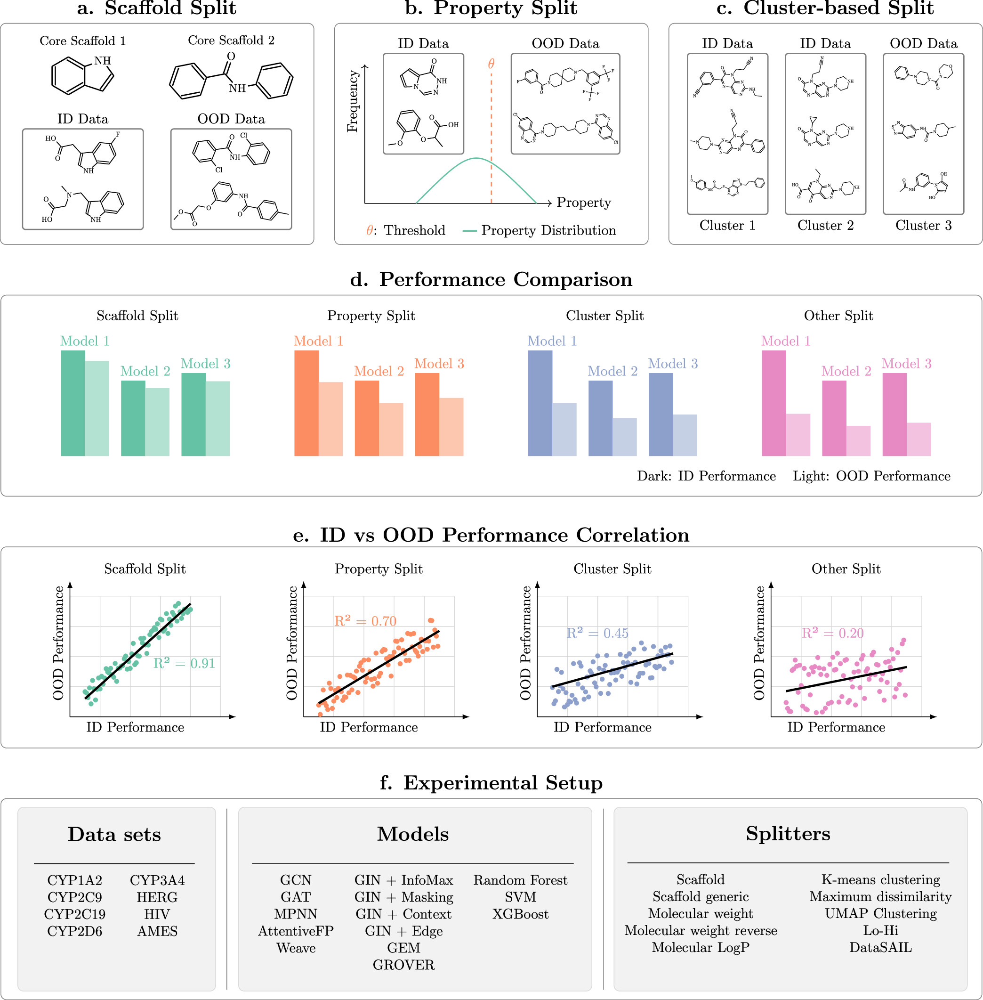
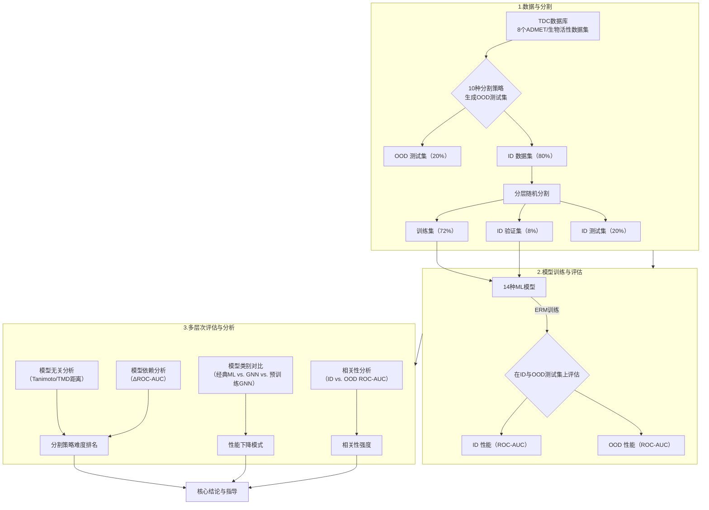
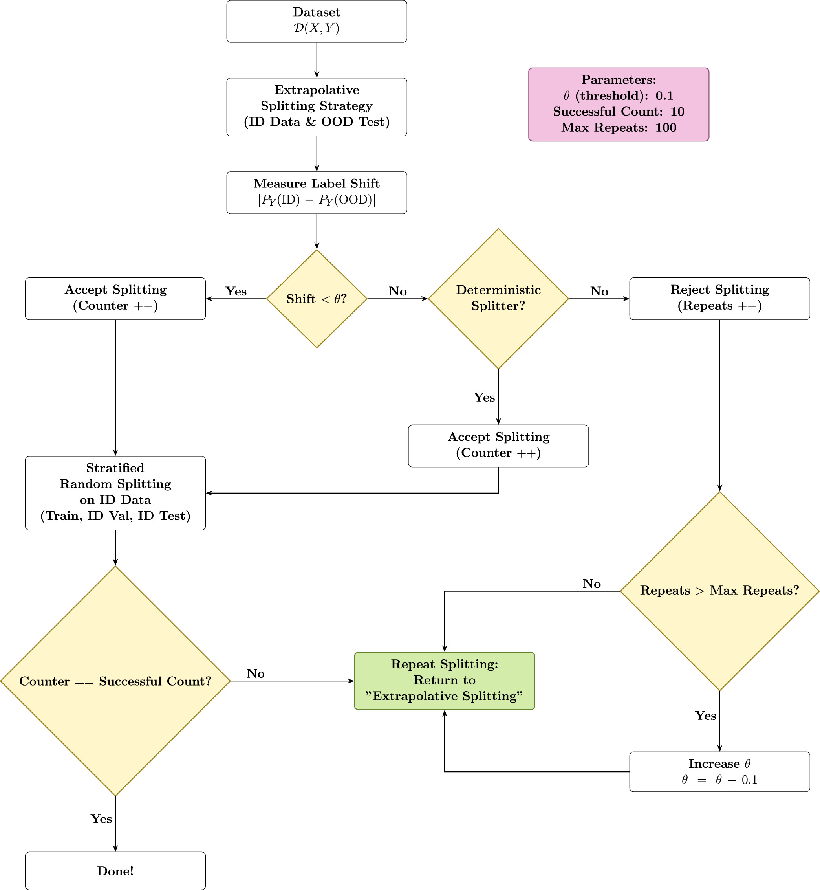
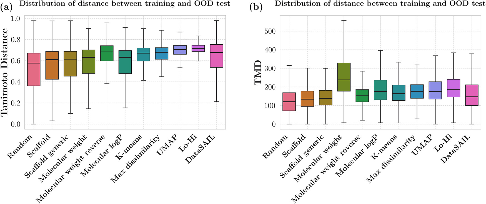
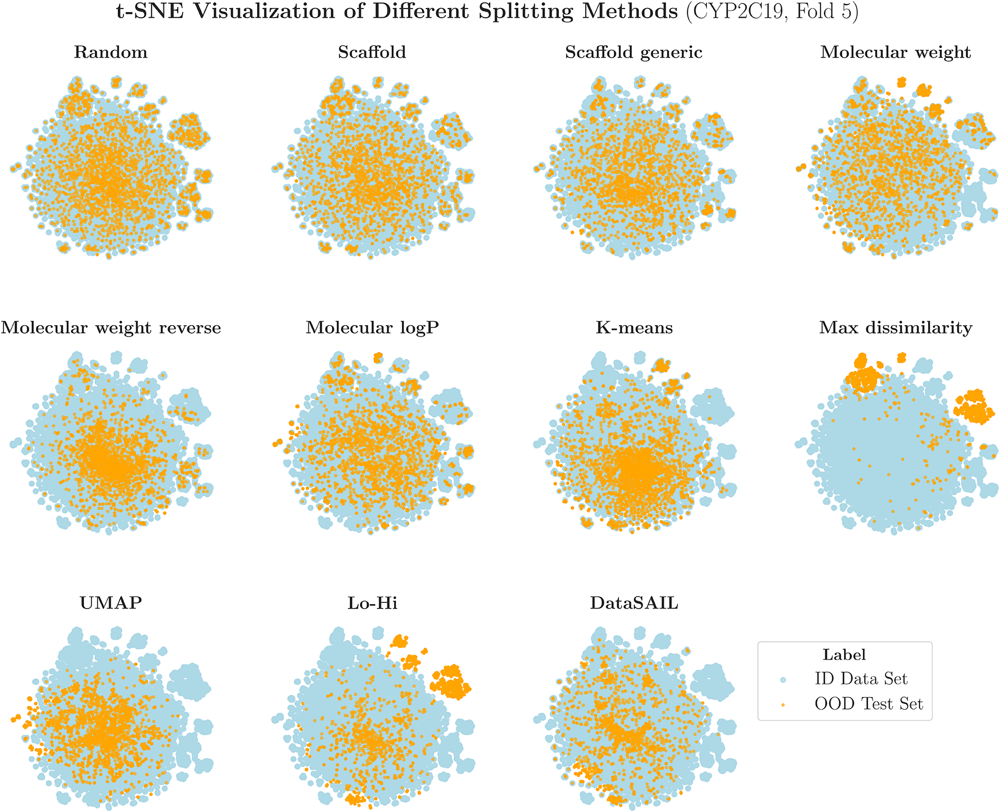
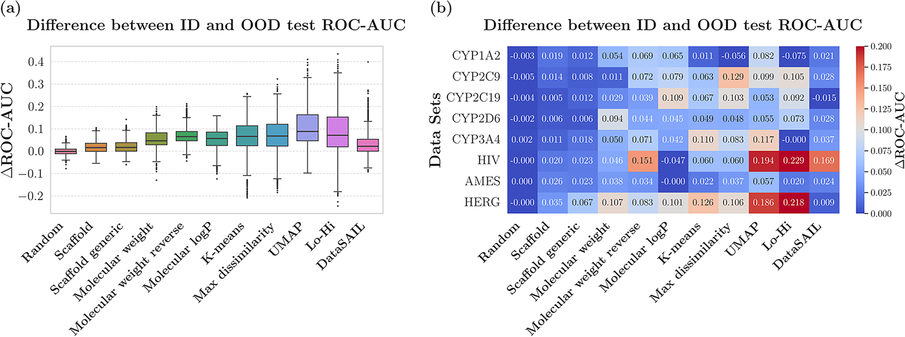
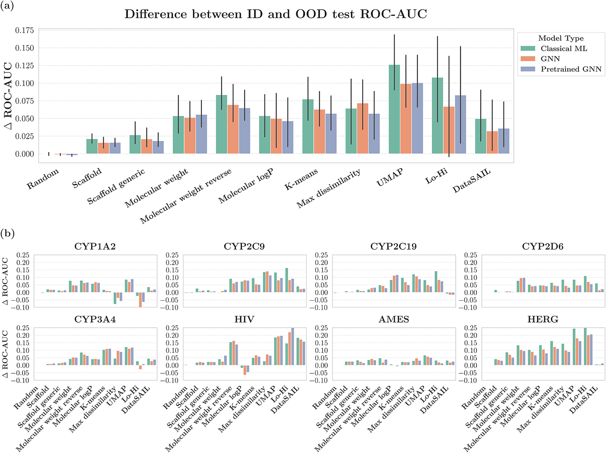
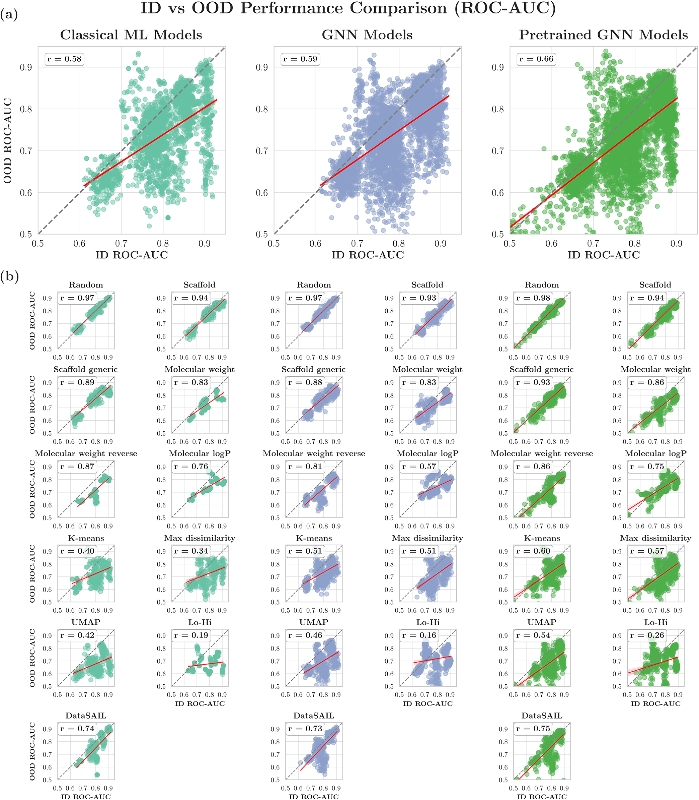
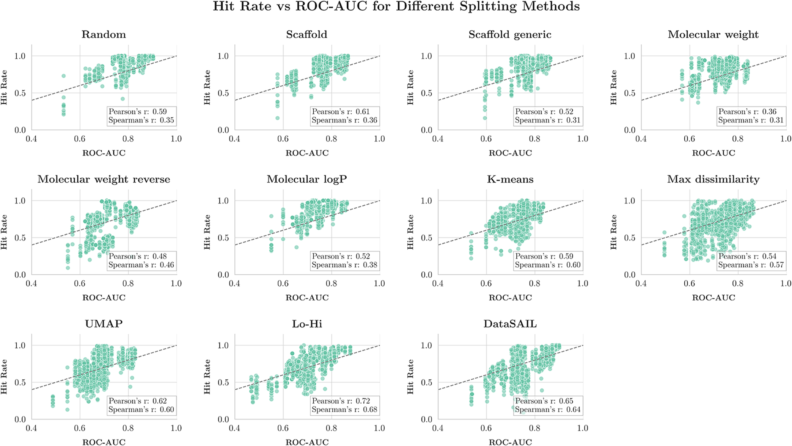
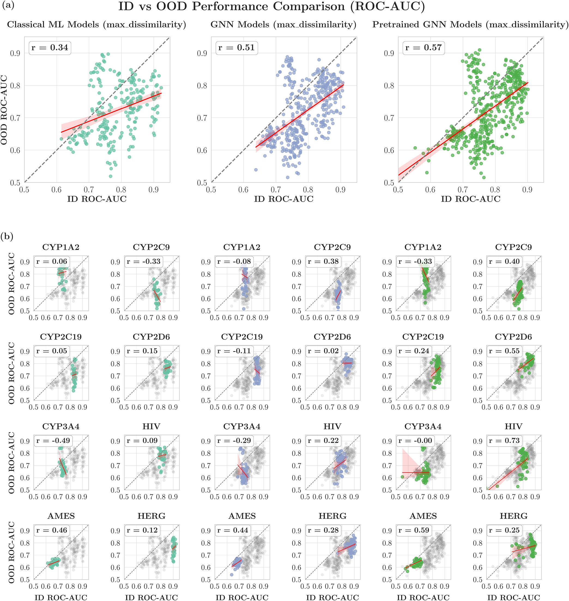

# 机器学习预测分子性质，走出“舒适圈”还靠得住吗？

## 本文信息
- **标题**: 用于分子性质预测的机器学习模型评估：分布外数据的性能与鲁棒性
- **作者**: Hosein Fooladi, Thi Ngoc Lan Vu, Miriam Mathea, Johannes Kirchmair
- 发表时间：2025年9月15日
- **单位**: 奥地利维也纳大学药物科学系、巴斯夫公司
- **引用格式**: Fooladi, H., Vu, T. N. L., Mathea, M., & Kirchmair, J. (2025). Evaluating Machine Learning Models for Molecular Property Prediction：Performance and Robustness on Out-of-Distribution Data. *Journal of Chemical Information and Modeling*, *65*, 9871-9891. https://doi.org/10.1021/acs.jcim.5c00475
- **源代码**: https://github.com/HFooladi/ALineMol
- **数据来源**: 所有数据来自Therapeutics Data Commons（TDC）数据库：https://tdcommons.ai

## 摘要
> 如今，机器学习（ML）模型被广泛用于预测分子的物理化学和生物性质。它们的性能通常在分布内（ID）数据（即与训练数据同源的数据）上评估。然而，此类模型在真实世界应用中常常涉及与训练数据差异较大的分子，因此需要评估其在分布外（OOD）数据上的性能。本工作中，我们使用十种数据分割策略在八个数据集上，调查并评估了包括随机森林等经典方法和消息传递图神经网络等图神经网络（GNN）方法在内的14种机器学习模型的性能。首先，我们探究了在分子领域的生物活性和ADMET预测任务中，什么构成了OOD数据。与普遍观点相反，我们发现基于Bemis-Murcko支架的分割对经典ML和GNN模型来说并不困难（与随机分割无显著差异）。**基于化学相似性聚类（使用ECFP4指纹的UMAP聚类）的分割对两类模型都构成了最具挑战性的任务**。其次，我们探究了ID性能与OOD性能在多大程度上存在正线性关系。如果这种正相关成立，就可以选择在ID数据上表现最好的模型，并期望其在OOD数据上也有最佳性能。我们发现这种线性关系的强弱与OOD数据的生成方式（即使用何种分割策略）密切相关。对于支架分割，ID与OOD性能的相关性很强（皮尔逊$r \sim 0.9$），而对于所有基于聚类的分割，这种相关性则显著下降（皮尔逊$r \sim 0.4$）。因此，两者的关系可能更加微妙，**并非在所有OOD场景下都能保证强正相关**。这些发现表明，OOD性能评估和模型选择应与目标应用领域仔细匹配。

### 核心结论
- **经典分割策略评估**：广为使用的**Bemis-Murcko支架分割**由于数据集中每个支架平均只包含**不到2个分子**，导致其分割效果接近随机分割，**并不能有效构建具有挑战性的OOD测试集**。而基于UMAP降维后的化学相似性聚类分割，被证明是评估模型OOD泛化能力的**最严苛方法**。
- **模型性能对比**：无论是经典ML还是GNN模型，在面临挑战性分割（如UMAP、Lo-Hi）时，性能均会显著下降。然而，当存在显著差异时，**GNN模型（特别是预训练GNN）表现出比经典ML模型更强的鲁棒性**，性能下降幅度更小。
- **ID与OOD性能关系**：ID性能与OOD性能的相关性**高度依赖于分割策略的“难度”**。在简单的随机或支架分割下，两者强相关；但在UMAP、Lo-Hi等严苛分割下，相关性很弱甚至可能为负。这表明仅凭ID性能选择模型，并不能保证其在真实OOD场景下的最优泛化能力。

## 背景
在药物发现领域，机器学习扮演着至关重要的角色，能够快速预测分子的性质和生物活性。借助海量的化合物数据，ML模型在识别潜在候选药物、优化先导化合物和预测药代动力学性质方面取得了显著成功。然而，该领域一个关键挑战依然存在：ML模型通常在分布内（ID）数据上表现良好，但面对分布外（OOD）数据时，其性能往往会**严重下降**。OOD数据指的是那些与训练集分子在化学结构或性质上存在显著差异的分子。

在药物发现中，探索超出训练数据边界的新化学空间对于识别新的治疗化合物至关重要。但这种探索会将ML模型置于OOD场景中，其预测可能不可靠。因此，面对新分子结构时保持准确性和鲁棒性，对于ML在药物发现中的应用至关重要。然而，如何有效、可靠地评估模型的OOD泛化能力，并理解其与ID性能之间的关系，目前尚缺乏系统性的认识。

### 关键科学问题
1. **如何定义分子领域的OOD数据？** 药物化学中，研究者常用基于分子支架或特定性质（如分子量）的分割来模拟OOD场景。但这些分割方法在多大程度上能真正反映模型泛化到新化学空间的挑战性，存在争议，**迫切需要系统评估**不同分割策略的有效性。
2. **各类ML模型在OOD数据上的表现有何差异？** 传统的基于指纹的ML模型（如随机森林）与更先进的、直接从分子图学习的图神经网络，在面临不同类型的OOD数据时，其性能下降模式和鲁棒性是否存在系统性差异？
3. **ID性能能否可靠地预测OOD性能？** 这是模型选择的**一个核心问题**。如果ID与OOD性能强相关，那么选择ID性能最优的模型即可。但若这种关系不稳定或取决于OOD数据的生成方式，则需要更复杂的评估策略。

### 创新点
- **系统性基准测试**：在八个ADMET/生物活性数据集上，系统评估了14种ML模型（包括经典ML和多种GNN）在十种不同OOD数据分割策略下的表现，构建了一个**全面的评估框架**。
- **重新评估分割策略**：通过模型无关和模型依赖两种方法，量化了不同分割策略的“难度”，挑战了“支架分割即严苛OOD测试”的传统观念，并**识别出最具挑战性的分割方法**（UMAP聚类）。
- **深入剖析ID-OOD关系**：并非简单肯定或否定“ID‑OOD强相关”的结论，而是揭示了这种相关性**强烈依赖于分割策略的严苛程度**，为模型选择提供了更精细的指导。

---

## 研究内容
本研究通过构建大规模基准测试，从分割难度评估、模型性能对比和ID‑OOD关系探究三个维度，系统回答了上述科学问题。

### 核心方法概览
研究流程严谨，旨在控制变量，进行公平比较。

**图1：研究方法概览**。（a）基于支架的分割，（b）基于性质的分割（使用分子量和LogP），（c）基于聚类的分割。（d）经典ML模型和GNN方法在分布内（ID）和分布外（OOD）测试集上的性能对比。（e）ID与OOD性能之间线性相关性的分析。（f）本研究使用的数据集、模型和分割方法总结。

这张图清晰地展示了整个研究设计的三大维度：**数据分割策略**（a-c）、**模型评估框架**（d）和**分析目标**（e）。研究者通过系统地改变分割方式来模拟不同类型的OOD场景，从而全面评估ML模型的泛化能力。

#### 数据集与分割策略
研究从TDC数据库中筛选出8个二分类任务数据集，涉及CYP450酶抑制、HIV活性、致突变性（AMES）和hERG通道阻断等关键ADMET/生物活性终点。每个数据集样本量在**5000至20000之间**，活性化合物比例在**30**%至**70**%之间，以保证数据质量和平衡性。

**数据预处理流程**：为确保数据质量，所有SMILES字符串都经过了**严格的标准化处理**，包括去除盐分、校正生理pH下的质子化状态、转换为 canonical互变异构体等步骤。对于类别不平衡的数据集（如CYP2D6和HIV），研究者通过**随机下采样多数类**（非活性化合物）来平衡数据集。

**图2：数据分割工作流程概览**。该图展示了如何将原始数据集划分为OOD测试集和ID数据集，以及如何进一步将ID数据集分割为训练集、验证集和ID测试集。整个流程通过**迭代优化**来同时控制标签分布的相似性和特征分布的差异性。

这个迭代分割过程的核心设计非常巧妙：为了**最小化ID与OOD集合之间的标签分布偏移**（即活性化合物比例的差异），同时**最大化特征分布差异**（即化学结构的差异，模拟协变量偏移），研究者实现了一个迭代算法。该算法会生成**最多100个候选分割方案**，并从中筛选出ID与OOD集合间活性化合物比例差异低于预定阈值的方案。目标是获得**10个合格的分割**，如果必要时会逐步放宽阈值。对于确定性分割方法（如基于分子量的分割），无法控制标签分布，因此接受由此产生的标签分布偏移。这种设计确保了在纯粹研究协变量偏移对模型性能的影响时，不会被标签分布偏移所混淆。

研究采用了**十种不同的数据分割器**来生成OOD测试集，旨在模拟不同类型的分布偏移：

**分割策略对比表：十种分割策略的分类与特点**

| **类型** | **分割方法** | **原理** | **挑战性** |
| --- | --- | --- | --- |
| **基准对照** | 随机分割 | 完全随机分配分子到各集合 | ★☆☆☆☆ 最低 |
| **基于分子结构** | Bemis-Murcko支架分割 | 按支架分组，相同支架的分子放入同一集合 | ★★☆☆☆ 较低 |
|  | 通用支架分割 | 将所有原子视为碳、所有键视为单键后的支架分割 | ★★☆☆☆ 较低 |
| **基于分子性质** | 分子量分割（Hi） | 按分子量排序，最高的**20**%分入OOD测试集 | ★★★☆☆ 中等 |
|  | 分子量分割（Lo） | 按分子量排序，最低的**20**%分入OOD测试集 | ★★★☆☆ 中等 |
|  | CLogP分割 | 按脂溶性排序，最高的**20**%分入OOD测试集 | ★★★☆☆ 中等 |
| **基于化学空间聚类** | K-means聚类 | 基于ECFP4指纹的K-means聚类，簇间分配 | ★★★★☆ 较高 |
|  | 最大相异性聚类 | 最大化训练集与测试集之间的相异性 | ★★★★☆ 较高 |
|  | UMAP聚类 | UMAP降维后的聚类分割 | ★★★★★ 最高 |
|  | Lo-Hi分割 | 同时考虑分子性质和化学空间的聚类方法 | ★★★★★ 最高 |
|  | DataSAIL | 基于相似性图优化的分割 | ★★★★☆ 较高 |

**核心设计原则**：在分割时，研究者通过**迭代过程**尽量控制ID与OOD数据间标签分布（即活性比例）的差异（$\Delta_{\text{label}} < 0.05$），同时最大化特征分布（即化学结构）的差异，以**更纯粹地研究协变量偏移的影响**。这意味着活性化合物的比例在训练集和测试集中基本保持一致，但测试集中的分子结构却**可能远离训练集覆盖的化学空间**。

#### 机器学习模型
研究评估了三类共**14种**模型，涵盖了从**传统机器学习到最先进的预训练图神经网络的完整谱系**：

**机器学习模型对比表：14种模型的分类与特点**

| **模型类型** | **具体模型** | **输入特征** | **核心特点** | **实现来源** |
| --- | --- | --- | --- | --- |
| **经典ML** | 随机森林（RF） | ECFP4指纹（2048位） | 基于树的集成学习，鲁棒性强 | scikit-learn |
|  | 支持向量机（SVM） | ECFP4指纹（2048位） | 核方法，适合中小规模数据 | scikit-learn |
|  | XGBoost | ECFP4指纹（2048位） | 梯度提升，性能优异 | XGBoost库 |
| **从头训练GNN** | 图卷积网络（GCN） | 分子图（原子+键特征） | 一阶邻域聚合，计算高效 | DGL-LifeSci |
|  | 图注意力网络（GAT） | 分子图（原子+键特征） | 注意力机制，自适应权重 | DGL-LifeSci |
|  | 消息传递神经网络（MPNN） | 分子图（原子+键特征） | 通用消息传递框架 | DGL-LifeSci |
|  | AttentiveFP | 分子图（原子+键特征） | 层级注意力，原子级和分子级 | DGL-LifeSci |
|  | Weave | 分子图（原子+键特征） | 双向原子-键特征更新 | DGL-LifeSci |
| **预训练GNN** | GIN（4种预训练策略） | 分子图 | - Deep Graph Infomax（最大化图级表示互信息） - Attribute Masking（屏蔽原子属性预测） - Context Prediction（预测邻域上下文） - Edge Prediction（预测键的存在） | DGL-LifeSci |
|  | GEM | 分子图+几何信息 | 双图结构（原子-键图+键-角图），捕获拓扑和空间关系 | 原始实现 |
|  | GROVER | 分子图 | 自监督预训练+Transformer注意力，多层消息传递 | 原始实现 |

**GNN消息传递机制**：所有GNN模型的核心都是消息传递（message passing）机制。在每一步更新中，原子节点聚合其邻居的信息来**更新自身的特征表示**：

$$
h_i^{(k+1)} = \phi\left(h_i^{(k)}, \square_{j \in \mathcal{N}(i)} \psi\left(h_i^{(k)}, h_j^{(k)}, e_{ij}\right)\right)
$$
其中，$h_i^{(k)}$ 是原子 $i$ 在第 $k$ 层的特征，$\mathcal{N}(i)$ 是原子 $i$ 的邻居集合，$e_{ij}$ 是键的特征，$\phi$ 和 $\psi$ 是**可学习的更新函数**。不同GNN架构的主要区别在于这两个函数的具体形式：

- **GCN**：使用对称归一化的邻域平均
- **GAT**：使用注意力系数加权邻域特征
- **MPNN**：通用框架，支持多种消息和聚合函数
- **GROVER**：结合了Transformer的多头注意力机制

**分子图表示**：分子被表示为图 $\mathcal{G} = (\mathcal{V}, \mathcal{E})$，其中：
- 节点集 $\mathcal{V}$ 对应原子，每个节点用特征向量 $h_i \in \mathbb{R}^d$ 表示（包含原子类型、度数、电荷等信息）
- 边集 $\mathcal{E}$ 对应化学键，每条边用特征向量 $e_{ij} \in \mathbb{R}^{d'}$ 表示（包含键型、共轭性、芳香性等）

经过 $K$ 轮消息传递后，节点特征被聚合为图级表示 $h_{\mathcal{G}}$，最后通过多层感知机（MLP）预测分子性质。

**训练策略**：为确保公平比较，所有模型均使用**固定的超参数**进行训练，采用**经验风险最小化（ERM）作为统一的训练算法**，使用二元交叉熵损失和Adam优化器。这种设计虽然可能使个别模型未达到其最优性能，但确保了不同模型之间的可比性。

#### 评估与分析方法
- **分割策略难度量化**：采用模型无关（计算OOD测试集分子与训练集分子之间的平均Tanimoto距离或树移动距离TMD）和模型依赖（计算ID与OOD测试集性能差值ΔROC-AUC）两种方法。
- **性能评估指标**：主要使用ROC-AUC，并辅以准确率和Top-100命中率（模拟虚拟筛选场景）进行分析。
- **相关性分析**：计算所有模型在不同数据集和分割策略下，ID性能与OOD性能之间的皮尔逊相关系数。

### 结果与讨论

#### 发现一：重新定义OOD分割的“难度”

通过模型无关的距离分析，研究发现：

**图3：不同分割器下OOD测试集与训练集之间距离的分布**。（a）基于Morgan指纹的Tanimoto距离，（b）基于图表示的树移动距离（TMD）。**随机、支架和通用支架分割产生的距离最小**，意味着它们构建的OOD测试集与训练集最相似；而UMAP聚类和Lo‑Hi等基于复杂聚类的方法产生的距离最大，挑战性最高。

**图4：CYP2C19数据集在不同分割策略下的t-SNE可视化**。不同颜色表示ID和OOD测试集的分配。这张图直观地展示了不同分割策略如何在二维化学空间中分布分子：随机分割和支架分割导致训练集和测试集在空间上高度重叠，而UMAP聚类则清晰地分隔了两个集合。

结合距离分析和可视化结果，可以得出：

- **支架分割并不“难”**：基于Bemis-Murcko支架的分割，其产生的OOD测试集与训练集的化学距离（Tanimoto/TMD）与随机分割相近，都属于“最不具挑战性”的分割方法。从t-SNE可视化可以清晰看出，支架分割下训练集（蓝色）和测试集（红色）在化学空间中高度混杂，**无法形成清晰的边界**。这是因为在所使用的数据集中，**每个独特的支架平均仅对应约2个分子**。当支架独特性极高时，按支架分组就近似于随机分配分子，**无法有效分离出具有区分度的新化学空间**。
- **最具挑战性的分割策略**：基于化学空间聚类的方法，尤其是**UMAP降维后聚类**和**Lo-Hi分割**，能**最大程度地将化学空间上远离训练集的分子划入OOD测试集**，因此被证明是评估模型OOD鲁棒性的**最严苛标准**。从Figure 4可以观察到，UMAP分割下测试集（红色）聚集在化学空间的边缘区域，与训练集（蓝色）形成鲜明对比，**真正实现了分布外测试的设计目标**。

#### 发现二：模型性能下降模式与鲁棒性差异

**图5：不同分割器下ID与OOD测试集之间的性能差距（ΔROC-AUC）**。（a）所有数据集和模型聚合结果，（b）各数据集和分割器的平均ΔROC-AUC。**UMAP和Lo‑Hi分割导致了最大的性能下降**（中位ΔROC-AUC分别为0.088和0.070），而支架分割导致的下降微乎其微。

**图6：经典ML和GNN模型在ID与OOD测试集上的性能差距（ΔROC-AUC）对比**。该图分别展示了所有数据集聚合的结果和每个数据集的单独结果，清晰地显示GNN模型（尤其是预训练GNN）在面临严苛分割时性能下降更小。

**图7：不同分割器（x轴）、模型（y轴）和数据集之间的性能差距热力图**。颜色越深表示ΔROC-AUC越大，即性能下降越严重。该热力图揭示了不同模型在不同分割策略下的鲁棒性差异模式，GROVER、Weave和GEM等先进GNN模型在大多数分割策略下都显示出较浅的颜色（即更好的鲁棒性）。

综合这三个图表的分析，可以得出以下关键结论：

- **GNN展现出更强的鲁棒性**：当面对UMAP、Lo-Hi等严苛分割时，所有类型模型的性能**都会下降**。但在**统计上性能下降存在显著差异**的分割策略中（如UMAP、Lo-Hi），**GNN模型（包括预训练GNN）的性能下降幅度显著小于经典ML模型**。例如，在UMAP分割下，**GNN模型比经典ML模型更能保持其预测能力**（ΔROC-AUC中位数分别为**0.053**和**0.115**）。从Figure 6可以观察到，这种优势在**所有8个数据集上是一致的**。在单独模型分析中（Figure 7），**GROVER、Weave和GEM是表现最稳健的模型**，而**基于树的集成方法（XGBoost、随机森林）鲁棒性最差**。
- **一个有趣的不对称性**：在基于分子量的分割中，**“用大分子训练，用小分子测试”比“用小分子训练，用大分子测试”更具挑战性**。Figure 5b显示，Molecular Weight（高）分割的ΔROC-AUC中位数为**0.018**，而Molecular Weight Reverse（低）分割为**0.038**，是前者的两倍多。这表明模型从较小结构泛化到较大结构，可能**比反向泛化更容易**，因为**大分子往往包含小分子作为子结构**，而**小分子可能缺失大分子中的某些关键特征**。

#### 发现三：ID与OOD性能的相关性：一个依赖上下文的答案

**图9：ID与OOD性能（ROC-AUC）的相关性分析**。（a）按模型类别聚合所有分割策略的结果，显示中等正相关。（b）按分割策略分别分析，**相关性强度差异巨大**：在简单的随机/支架分割下相关性极强（$r > 0.9$），而在严苛的Lo-Hi分割下相关性很弱（$r \sim 0.2$）。

这是本研究最核心的发现之一，**彻底否定了“ID性能总能预测OOD性能”**的简单假设。
- **相关性取决于分割难度**：当**OOD数据与训练数据化学空间相似时**（如随机、支架分割），ID与OOD性能**强正相关**（$r \sim 0.9-0.98$）。在这种情况下，**选择ID性能最佳的模型是有效的**。
- **相关性随难度增加而减弱**：当**分割策略更具挑战性**，OOD测试集化学空间与训练集差异增大时（如UMAP、Lo-Hi分割），ID与OOD性能的**相关性急剧下降甚至消失**（$r$可低至**0.16**）。此时，多个ID性能相近的模型，其OOD性能**可能天差地别**。
- **实践指导意义**：这一发现表明，**没有“放之四海而皆准”的模型选择策略**。评估协议必须与预期应用场景对齐。如果目标是泛化到高度新颖的化学空间，**就必须使用能产生足够大分布偏移的严苛分割策略**（如UMAP聚类）来评估和选择模型，**而不能依赖简单的ID性能排名或支架分割验证**。

#### 其他发现：命中率（Hit Rate）指标的启示

**图8：Top-100命中率与ROC-AUC性能的相关性分析**。每个数据点代表一个模型在特定数据集-分割器组合的单次实验重复中的性能。该图揭示了这两个评估指标提供一致性模型性能评估的程度。

在模拟虚拟筛选的Top-100命中率评估中，研究观察到了与ROC-AUC**相似但幅度更大**的性能下降趋势（UMAP分割下平均命中率下降**18.7**%）。从Figure 8可以观察到：

- **中度相关性**：ROC-AUC与命中率之间仅存在**中度相关性**（Spearman $\rho \approx 0.68$），且这种相关性也随分割策略变化。这意味着在**某个指标上表现优异的模型，未必在另一个指标上同样出色**。
- **应用导向的指标选择**：这提醒我们，**针对不同的应用目标（如整体排名能力 vs. 顶部富集能力），可能需要关注不同的评估指标**。ROC-AUC衡量模型对所有化合物的整体排序能力，而Top-100命中率则更关注在虚拟筛选场景下从大量候选者中识别出少数活性化合物的能力。对于药物发现项目而言，后者往往更具实际意义，因此**单一指标的优化可能无法保证模型在所有场景下的最优表现**。

**图10：最大相异性分割器下的ID vs OOD性能（ROC-AUC）**。（a）分别展示经典ML、GNN和预训练GNN模型的结果，（b）展示每个单独数据集的结果。每个数据点对应模型池中的一个模型。r表示皮尔逊相关系数。

作为Figure 9的补充，Figure 10展示了在最大相异性分割这一特定严苛分割下的ID-OOD性能关系。可以看到：
- **显著的相关性衰减**：即使在**整个模型类别层面**（Figure 10a），ID与OOD性能的相关性**也大大降低**（经典ML：$r = 0.34$，GNN：$r = 0.44$，预训练GNN：$r = 0.51$），远低于支架分割下的**0.9+**水平。
- **数据集特异性**：不同数据集的相关性差异巨大（Figure 10b），CYP2C19显示出弱负相关（$r = -0.20$），而CYP2D6则保持中度正相关（$r = 0.65$）。这进一步强调了**评估策略必须与具体的应用场景和数据集特性对齐**的重要性。

---

## Q&A
- **Q1**: 为什么本研究发现Bemis-Murcko支架分割并不具有挑战性，这与之前一些认为支架分割是严苛OOD测试的认知相悖？
- **A1**: **关键在于数据集的特性**。本研究使用的公共数据集（主要来自TDC）中，活性化合物比例高（30%–70%），且针对的是CYP450等“易结合”的靶点，导致活性分子结构多样性大。这造成**每个独特的支架平均只对应不到2个分子**。当支架几乎都是唯一时，按支架分割就无法将结构相似的分子系统性地分开，结果**趋近于随机分割**，自然无法构建出有意义的化学空间偏移。而在工业界药物发现项目中，数据常围绕几个核心骨架（congeneric series）展开，每个骨架下有**大量类似物**，此时支架分割才能真正考验模型对全新骨架的泛化能力。因此，本研究结论揭示了**支架分割的有效性高度依赖于数据集的组成**。
- **Q2**: 模型无关的Tanimoto距离为什么能较好地预测模型依赖的性能下降（ΔROC-AUC）？
- **A2**: 研究计算的是OOD测试分子与其在训练集中最近邻的Tanimoto距离（基于ECFP4指纹）。这个距离直观反映了测试分子在训练集化学空间中的**“孤立”程度**。距离越大，说明测试分子越“新颖”，模型在训练中**从未见过类似结构**，因此更可能预测失败。有趣的是，这种基于简单指纹的距离，不仅与同样使用指纹的经典ML模型性能下降强相关，也与直接从图学习的GNN模型性能下降强相关。这表明，**尽管GNN能捕获更复杂的结构信息，但其泛化能力在根本上仍然受训练集化学空间覆盖度的制约**。Tanimoto距离因此**成为一个计算高效且可靠的代理指标**，用于预估分割策略难度和模型性能下降。
- **Q3**: 既然严苛分割下ID与OOD性能不相关，那在实际药物发现中该如何选择模型？
- **A3**: 本研究**并未给出一个万能公式**，而是强调**评估策略需与目标匹配**。这为实践提供了更清晰的路线：
    1. **明确泛化目标**：首先要**定义**“成功泛化”意味着什么。是预测同一个靶点下全新骨架的分子？还是预测不同物理性质区间的分子？这决定了**应使用哪种分割策略来模拟OOD场景**。
    2. **使用匹配的评估协议**：如果目标是泛化到新颖化学空间，就**必须**在实验设计阶段采用类似UMAP聚类、Lo-Hi或DataSAIL等能产生足够大分布偏移的分割方法来划分训练/测试集，并在此测试集上评估模型。
    3. **在正确的测试集上做选择**：**模型选择应基于其在目标OOD测试集**（或能有效模拟该测试集的严苛验证集）上的性能，**而不是ID验证集性能**。可以借鉴本研究，使用Tanimoto距离等快速指标预筛选出可能产生严苛测试集的分割方法用于验证。
    4. **考虑模型鲁棒性**：在性能相近时，可优先考虑在本研究中显示出更强鲁棒性的GNN架构，特别是GROVER、GEM等先进模型。

---

## 关键结论与批判性总结
- **主要贡献**：
    1. **提供了分子ML领域OOD评估的系统性基准**，涵盖了**广泛的数据集、模型和分割策略**，为未来研究设立了高标准。
    2. 挑战并细化了关于“分割难度”和“ID‑OOD关系”的既有认知，**明确指出这些概念高度依赖于上下文，不能一概而论**。
    3. 为实践者提供了具体指导：**推荐使用基于化学空间聚类的严苛分割**（如UMAP）进行模型评估与选择，并**警示了仅依赖支架分割或ID性能排名的风险**。

- **局限性与未来方向**：
    1. **数据集规模与类型局限**：研究集中于中等规模（5k–20k）、二分类、且靶点相对“易结合”的数据集。结论在极小规模（<100）或极大规模（>100k）数据集，以及回归任务或其他性质预测任务上的普适性有待验证。
    2. **固定超参数的权衡**：为公平比较，所有模型使用**固定超参数**，这可能使个别模型未达其最优性能，影响了**绝对性能值**，但**相对比较和趋势结论是可靠的**。
    3. **评估指标的扩展**：未来可纳入更多药物发现特定指标（如不同阈值下的富集因子、早期识别能力等）进行综合评估。
    4. **面向真实场景的OOD**：本研究模拟的是“协变量偏移”。未来需要探索更复杂的、包含“概念偏移”的真实世界OOD场景，例如同一靶点在不同物种间的活性差异，或同一分子在不同细胞系或实验条件下的表现差异。
