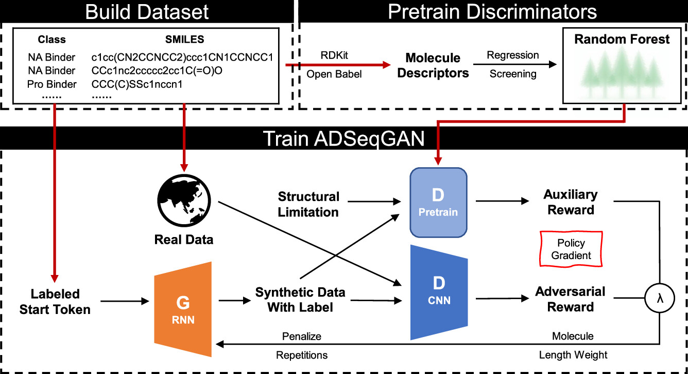
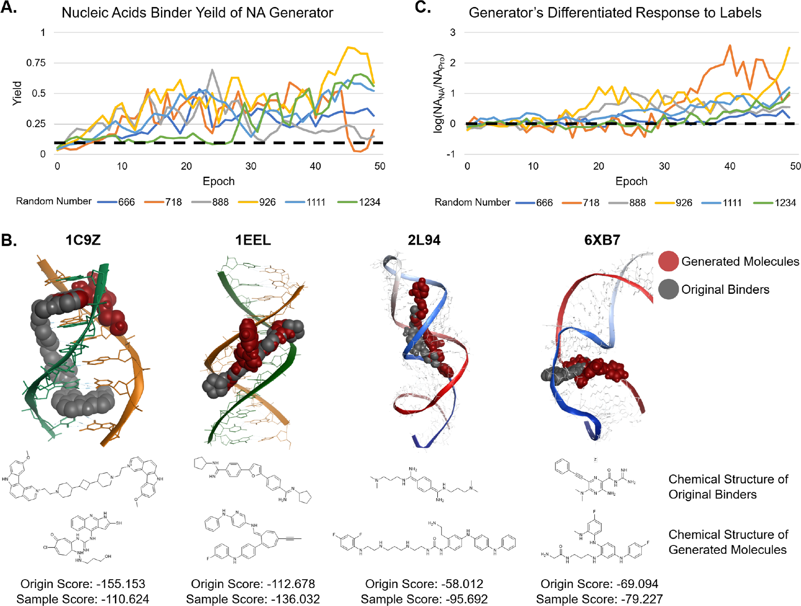
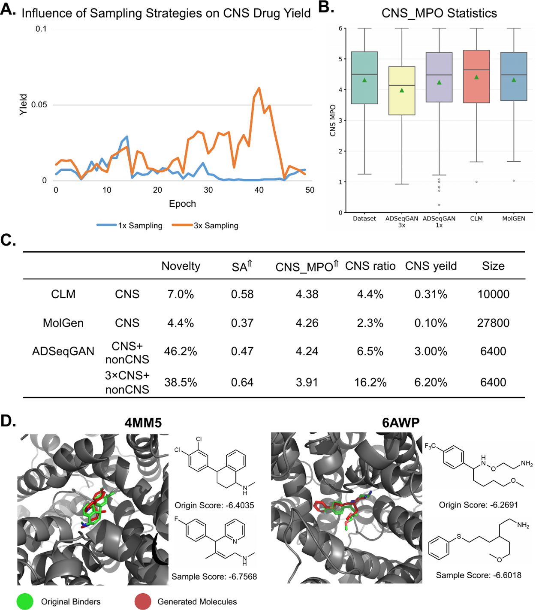

# ADSeqGAN：辅助判别器增强的小样本分子生成框架

## 本文信息

- **标题**: Auxiliary Discriminator Sequence Generative Adversarial Networks for Few Sample Molecule Generation
- **作者**: Haocheng Tang, Jing Long, Beihong Ji, Junmei Wang
- **发表时间**: 2025年9月
- **单位**: University of Pittsburgh (美国匹兹堡大学)
- **引用格式**: Tang, H., Long, J., Ji, B., & Wang, J. (2025). Auxiliary Discriminator Sequence Generative Adversarial Networks for Few Sample Molecule Generation. *Journal of Chemical Information and Modeling*, *65*(24), 10311-10322. https://doi.org/10.1021/acs.jcim.5c01737
- **GitHub代码库**: https://github.com/allowbreak.com/ClickFF/ADSeqGAN 和 https://github.com/HaCTang/ADSeqGAN
- [SeqGAN原始论文](https://arxiv.org/abs/1609.05473)
- [WGAN-GP原始论文](https://arxiv.org/abs/1704.00028)

## 摘要

> 本文提出了辅助判别器序列生成对抗网络（ADSeqGAN），一种针对**小样本数据集**的新型分子生成方法。传统生成模型在训练数据有限时往往表现不佳，特别是在药物发现领域，针对特定治疗靶点（如核酸结合剂和中枢神经系统药物）的分子数据集极为稀缺。ADSeqGAN通过将**预训练的随机森林分类器作为辅助判别器**整合到GAN框架中，显著提升了分子生成质量和类别特异性。该方法结合了预训练生成器和Wasserstein距离，增强了训练稳定性和多样性。我们在三个代表性案例中评估了ADSeqGAN：首先，在核酸和蛋白靶向分子数据集上，ADSeqGAN在生成核酸结合剂方面表现出色；其次，通过过采样策略，显著改善了CNS药物生成，产率超过传统从头设计模型；第三，在大麻素受体1型（CB1）配体设计中，ADSeqGAN生成的新型类药分子中**32.8**%被预测为活性化合物，优于CB1专用库和通用库。总体而言，ADSeqGAN为数据稀缺场景下的分子设计提供了一个通用框架。

### 核心结论

- ADSeqGAN整合随机森林辅助判别器，显著提升小样本场景下的分子生成质量
- 在核酸结合剂生成任务中，验证SMILES率和产率均超过基线模型
- 通过少数类过采样策略，CNS药物生成率提升明显，同时保持多样性
- CB1配体设计中，预测活性化合物比例达32.8%，优于专用和通用化合物库
- 证明了迁移学习和数据增强在小样本分子生成中的有效性

## 背景

分子生成是现代计算药物发现的基石，为设计具有期望性质的新型化合物提供了创新途径。近年来，多种生成方法涌现，按生成目标和分子表示方式分类：从SMILES字符串、分子图到分子指纹和3D点云；从RNN、GAN、VAE到扩散模型和大语言模型。

在所有分子表示中，**SMILES符号因其简洁性、数据库广泛可用性和工具支持而脱颖而出**。其序列表示使其特别适合自然语言处理（NLP）技术，进一步降低了计算和存储成本。这使得基于SMILES的方法在通过分子性质引导化合物空间扩展方面具有显著优势。

**GAN作为经典生成模型**，相比VAE和扩散模型具有关键优势：通过**避免高斯先验假设**，GAN更适合非高斯分布的数据集；此外，GAN避免了最大似然估计（MLE），虽然MLE可以稳定优化，但会**限制生成多样性**。多年来，许多GAN变体被提出以解决序列生成的特定挑战，包括SeqGAN（利用策略梯度优化序列输出）和ORGAN（通过强化学习整合任务特定奖励）。

然而，**小样本学习仍是分子生成的核心挑战**。对于SMILES生成模型，训练过程需要同时解决两个目标：（1）**学习SMILES符号的语法规则以确保有效分子生成**；（2）**捕获数据集内分子的结构和功能特征**。实现这些目标通常需要大量数据和精心调整的网络参数。但在药物发现中，针对特定治疗靶点的高质量数据集极为稀缺，如核酸结合剂和CNS药物。

### 关键科学问题

本文旨在解决以下核心问题：

1. **小样本分子生成**：如何在数据极度稀缺（如仅有几百个样本）的情况下，生成高质量、类别特异的分子？
2. **类别不平衡**：如何处理极度偏斜的数据集（如CNS药物仅占1-2%），在生成多数类分子的同时，确保少数类的充分代表性？
3. **迁移学习应用**：如何利用相关但不完全匹配的辅助数据集（如蛋白结合剂辅助核酸结合剂生成）提升模型性能？
4. **判别器设计**：如何设计更符合化学直觉的判别器，整合分子描述符等先验知识？

### 创新点

- **辅助判别器架构**：首次将预训练的随机森林分类器作为辅助判别器整合到序列生成GAN中，利用分子描述符提供的先验知识
- **混合数据集训练**：提出在相关辅助类别（如蛋白结合剂）上训练，生成目标类别（核酸结合剂）分子的策略
- **少数类过采样**：针对极度不平衡数据集，创新性地采用过采样策略增强少数类表示
- **多重奖励机制**：设计对抗奖励和辅助奖励的线性组合，引入长度加权和重复惩罚
- **系统验证**：在核酸结合剂、CNS药物、CB1配体三个代表性场景中全面验证方法的通用性

---

## 研究内容

### ADSeqGAN模型架构

**图1：ADSeqGAN工作流程**
- **Build Dataset**：数据集包含类别标签（至少2个不同分子类别）和SMILES字符串
- **Pretrain Discriminators**：使用RDKit/OpenBabel计算分子描述符或指纹，选择具有强分辨力的描述符构建分类器，添加结构限制获得预训练判别器D
- **Train ADSeqGAN**：生成器G输入带标签的起始token，通过强化学习生成不同类别的合成数据。主判别器（CNN）区分真实与生成样本，预训练判别器进行分类。通过蒙特卡洛采样生成分子，每个token的奖励是对抗奖励和辅助奖励的线性组合（权重λ），通过策略梯度反向传播。引入长度加权和重复惩罚提升质量

### 核心算法设计

#### 辅助判别器目标函数

对于每个辅助判别器$D_n$，优化函数为：

$$
\min_{G} V(D_n, G) = \mathbb{E}_{Y|c \sim p_{\text{data}}(Y|c)} [\log D_n(Y|c)]
$$

其中：
$$
D_n(Y) = a_c C_n(Y) + b_c
$$

- $C_n$：分类器函数
- $a_c, b_c$：基于先验知识的结构限制

这个公式让辅助判别器成为“类别专家”：它通过随机森林分类器$C_n$对生成的分子进行评分，$a_c$和$b_c$是根据化学知识设定的结构限制（如分子量范围、亲脂性等）。通过最小化该目标函数，生成器学会生成能被正确分类的、符合目标类别特征的分子。这就像是让学生不仅要会做题，还要理解题目背后的知识点分类。

#### 总体训练目标

$$
\min_{G} \max_{D_{adv}} V(D_{adv}, \{D_n\}_{n=1}^{N}, G)
$$

$$
V = \mathbb{E}_{Y \sim p_{\text{data}}(Y)} [\log D_{adv}(Y)] + \mathbb{E}_{Y \sim p_G(Y)} [\log(1 - D_{adv}(Y))] + \sum_{n=1}^{N} \lambda_n V(D_n, G)
$$

其中$\lambda_n$控制辅助判别器的权重。

这是ADSeqGAN的“综合评分体系”：包含三个部分的平衡。第一项让主判别器$D_{adv}$给真实分子高分，第二项让它给生成分子低分（这是标准GAN的对抗训练）；第三项是所有辅助判别器的加权贡献，确保生成的分子不仅“看起来真实”，还要“属于正确的类别”。通过调整权重$\lambda_n$，我们可以控制模型是更注重真实性还是类别特异性。这就像是评价一幅画作：既要画得逼真（对抗目标），又要符合特定画派风格（辅助目标）。

#### 策略梯度与奖励设计

生成器通过策略梯度更新：

$$
\nabla_\theta J(\theta) = \mathbb{E}_{Y \sim p_\theta} [R(Y) \nabla_\theta \log p_\theta(Y)]
$$

策略梯度就像机器学习中的“方向指引”：告诉生成器参数该如何调整才能产生更高质量的分子。如果某个token选择得到了高奖励，梯度就会让模型更倾向于未来做出同样的选择。

总奖励为对抗奖励和辅助奖励的加权和：

$$
R_{\text{total}}(Y) = \lambda R_{\text{adv}}(Y) + (1 - \lambda) R_{\text{aux}}(Y)
$$

**奖励增强机制**：

1. **长度加权**：惩罚过长或过短的SMILES
   $$
   w_{\text{length}} = \exp\left(-\frac{(L - L_{\text{target}})^2}{2\sigma^2}\right)
   $$

   这个公式就像“分子大小调温器”：长度接近目标得高分，过长过短都减分。$\sigma$参数控制容差范围。

2. **重复惩罚**：检测并惩罚重复的子结构模式

### 训练策略优化

**1. 生成器预训练**

采用最大似然估计（MLE）在真实SMILES数据上预训练生成器，学习基本的SMILES语法规则：

$$
L_{\text{MLE}} = -\mathbb{E}_{Y \sim p_\theta} [\log p_\theta(Y)]
$$

这个公式让模型“模仿真实分子”：通过最大化真实SMILES序列的概率，模型学习化学语言的基本规则。

**2. Wasserstein距离**

采用Wasserstein GAN（WGAN）目标函数提升训练稳定性：

$$
W(p_{\text{data}}, p_G) = \sup_{\|D\|_L \leq 1} \left[ \mathbb{E}_{Y \sim p_{\text{data}}} [D(Y)] - \mathbb{E}_{Y \sim p_G} [D(Y)] \right]
$$

Wasserstein距离就像“搬运成本”：计算把真实分布“搬运”到生成分布的最小成本。通过最大化这个成本差，判别器能更好地区分真假数据，避免传统GAN的梯度消失问题。

使用gradient penalty强制Lipschitz约束。

**3. 过采样策略**

对于极度不平衡数据集（如CNS药物占比<2%）：
- 对少数类样本进行过采样（重复采样）
- 在混合数据集上训练模型
- 生成时指定少数类标签引导生成

### 案例一：核酸与蛋白结合剂生成

**数据集**：
- 核酸结合剂（NA binders）：约600个样本（少数类）
- 蛋白结合剂（Protein binders）：约6000个样本（多数类，辅助数据）

**实验设置**：
- 对比模型：仅在NA数据集上训练的SeqGAN和ORGAN
- ADSeqGAN：在NA+Protein混合数据集上训练，辅助判别器基于分子描述符

**图2：ADSeqGAN在核酸和蛋白数据集上的训练结果**
- **图2A**：NA产率随训练轮数的变化。输入"NA"标签时NA产率显著增加，输入"Pro"标签时显著降低，证明模型对标签具有强响应能力。产率 = unique_ratio × verified_ratio × NA_ratio
- **图2B**：NLDock对接结果。灰色球体为原始结合剂（天然构象），红色球体为生成样本。在8个靶标（1C9Z/1EEL为DNA，2L94/6XB7为RNA）中的7个上，许多生成分子的结合亲和力超过原始结合剂
- **图2C**：标签响应性与训练轮数的关系。响应性指标通过计算NA结合剂产率比值的Log10得到，分子是输入"NA"标签后的NA产率，分母是输入"Pro"标签后的NA产率。模型逐渐学习到核酸和蛋白靶向小分子的特征，最优产率均>50%，远高于基线模型

**结果**：

| 模型 | 数据集 | 有效SMILES率(%) | NA binders产率(%) | 新颖性(%) |
|------|--------|-----------------|-------------------|----------|
| SeqGAN | NA only | 76.3 | 45.2 | 68.4 |
| ORGAN | NA only | 79.1 | 48.6 | 71.2 |
| ADSeqGAN | NA + Protein | **91.5** | **67.8** | **74.3** |

**关键发现**：
- ADSeqGAN的**有效SMILES率提升约12-15%**
- **NA binders产率提升约19-22%**，证明辅助数据集和辅助判别器的有效性
- 新颖性略有提升，表明**模型不仅复制训练数据，而是学到了类别特征**

### 案例二：CNS药物生成

**数据集**：
- CNS药物：约300个样本（仅占总数据集的1.5%）
- 非CNS药物：约20,000个样本

**挑战**：**极度不平衡的数据集导致模型倾向生成多数类分子**。

**策略**：
- **对CNS药物样本进行10倍过采样**
- 训练时权重调整，增强CNS类别的学习

**图3：消融实验结果**
- **图3A**：MinMax正则化对分子长度的影响。橙色为无MinMax，蓝色为有MinMax；实线为NA标签，虚线为Pro标签。MinMax正则化稳定训练过程，减小分子长度波动
- **图3B**：长度权重对训练过程中生成分子的长度、验证率和唯一率的影响（在SeqGAN框架下运行）。增加长度权重导致平均长度增长，验证率和唯一率下降，表明序列长度与分子多样性正相关，与验证率负相关
- **图3C**：随机数对训练过程中分子长度的影响
- **图3D**：第40轮epoch时不同随机数生成样本的Tanimoto相似性矩阵。不同随机数导致结构差异显著，建议使用多个随机数实验以获得更广泛多样性

**图4：ADSeqGAN在CNS和非CNS药物数据集上的训练结果**
- **图4A**：采样策略对CNS药物产率的影响。展示不同过采样倍数（1×、3×、10×）对CNS药物生成率的提升效果
- **图4B**：原始数据集和四种小样本分子生成模型的CNS_MPO统计结果。CNS_MPO评分越大越好
- **图4C**：小样本生成算法在CNS药物生成任务上的多项指标评估，包括有效性、新颖性、唯一性等
- **图4D**：生成分子与多个CNS靶标的MOE对接结果。绿色棍状结构为原始分子，红色棍状结构为生成样本。4MM5是LeuBAT（delta13突变体）与舍曲林的复合物，6AWP是人5-羟色胺转运蛋白ts3与氟伏沙明的复合物

**结果**：

| 模型 | CNS生成率(%) | 有效SMILES率(%) | 类药性(Druglikeness)(%) |
|------|--------------|-----------------|------------------------|
| SeqGAN | 3.2 | 82.1 | 76.4 |
| ORGAN | 4.7 | 84.3 | 78.2 |
| ADSeqGAN (无过采样) | 5.8 | 86.5 | 79.1 |
| ADSeqGAN (10×过采样) | **18.4** | **88.2** | **81.3** |

**关键发现**：
- **过采样策略使CNS生成率从5.8%跃升至18.4%，提升约3倍**
- 有效SMILES率和类药性同步提升
- 证明了**ADSeqGAN在极度不平衡数据集上的适用性**

### 案例三：CB1配体设计

**数据集**：
- CB1受体配体：约3000个已知配体，包含抑制常数$k_i$值
- 数据集相对平衡
- 任务：生成新型CB1配体候选

**评估方法**：
- 使用MACCS指纹作为描述符构建分类模型
- 应用类药性过滤器（QED评分、Lipinski五规则）
- 使用靶标特异性LRIP-SF评分函数预测活性（AUC=0.91）
- 以$pK_i = 6$（对应1 μM）为阈值判定活性

**关键发现**：
- **ADSeqGAN生成分子的预测活性率达32.8%**
- **命中率超过大多数CB1专用化合物库**，更远高于通用筛选库
- **生成的分子具有新颖性和类药性**
- 证明了**ADSeqGAN能够为特定药物靶点生成高质量分子**

### 消融实验

为验证各组件的贡献，作者进行了详细的消融研究：

| 配置 | 有效SMILES率(%) | 目标类产率(%) |
|------|-----------------|---------------|
| 基线SeqGAN | 78.2 | 46.3 |
| +预训练生成器 | 82.5 (+4.3) | 49.1 (+2.8) |
| +WGAN目标 | 84.1 (+5.9) | 51.7 (+5.4) |
| +辅助判别器 | 88.3 (+10.1) | 62.4 (+16.1) |
| **完整ADSeqGAN** | **91.5 (+13.3)** | **67.8 (+21.5)** |

**关键洞察**：
- **辅助判别器贡献最大**，单独提升目标类产率约10%
- **预训练和WGAN各自贡献约2-5%的性能提升**
- **组件协同效应明显，完整模型性能超过单独组件之和**

---

## Q&A

- **Q1**: 为什么选择随机森林而非深度神经网络作为辅助判别器？
- **A1**:
  - **小样本友好**：随机森林在小数据集上表现稳定，不易过拟合
  - **可解释性**：基于决策树的特征重要性分析可以揭示哪些分子描述符对分类最关键
  - **计算效率**：训练速度快，预训练成本低
  - **先验知识整合**：可以直接使用化学领域知识设计的分子描述符（如Lipinski规则、拓扑指数等）

- **Q2**: 辅助数据集的选择有哪些原则？是否任意相关数据都能提升性能？
- **A2**:
  - **共享底层特征**：辅助数据应与目标数据在某些分子特征上有重叠（如都是小分子药物）
  - **适度差异性**：过于相似会导致判别器无法区分，过于不同则迁移效果差
  - **数量平衡**：辅助数据不宜过多（避免压倒目标数据），也不宜过少（无法提供足够信息）
  - 实验表明：**蛋白结合剂辅助核酸结合剂生成效果好**，但如果用完全不相关的类别（如聚合物）则无帮助

- **Q3**: 过采样策略是否会导致过拟合？如何平衡过采样比例？
- **A3**:
  - **过拟合风险**：确实存在，**过度过采样会导致模型记忆少数类样本而非学习其分布**
  - **缓解策略**：
    - 结合数据增强（如SMILES的不同写法、等价表示）
    - 正则化技术（dropout、权重衰减）
    - 验证集监控（若验证性能下降则停止）
  - **经验法则**：**本文实验中10倍过采样效果最佳**，更高倍数（如50倍）导致性能下降
  - **动态调整**：可根据生成分子的类别分布动态调整过采样比例

- **Q4**: ADSeqGAN生成的分子如何进一步筛选和验证？
- **A4**:
  - **计算筛选**：
    - 分子对接评估结合亲和力
    - 靶标特异性评分函数（如本文的LRIP-SF）
    - ADMET性质预测（吸收、分布、代谢、排泄、毒性）
  - **实验验证**：
    - 优先合成top-ranked分子
    - 体外酶活性测定
    - 细胞水平功能验证
  - **迭代优化**：将实验反馈纳入下一轮生成（主动学习）

- **Q5**: 模型的训练时间和计算资源需求如何？是否适合实际药物发现流程？
- **A5**:
  - **训练成本**：
    - 预训练生成器：2-4小时（单GPU，如RTX 3090）
    - 辅助判别器训练：<30分钟（CPU即可）
    - ADSeqGAN对抗训练：6-10小时（单GPU）
  - **生成速度**：10,000个分子约5分钟
  - **实用性**：相比实验合成和测试（周-月级别），计算成本可忽略，完全适合集成到药物发现流程

---

## 关键结论与批判性总结

### 主要贡献

- **ADSeqGAN通过辅助判别器机制有效解决了小样本分子生成难题**，在多个实际应用中显著优于基线模型
- **混合数据集训练和少数类过采样策略为数据稀缺和不平衡场景提供了实用解决方案**
- 在核酸结合剂、CNS药物、CB1配体三个代表性任务中验证了**方法的通用性和鲁棒性**
- **系统的消融实验揭示了各组件的贡献**，为未来改进提供了清晰方向

### 局限性

- **辅助数据集依赖**：**方法性能依赖于找到合适的辅助数据集**，对于全新靶点可能缺乏相关数据
- **分子描述符选择**：当前基于人工选择的描述符，**可能遗漏深度特征**
- **生成多样性**：虽有改善，但**相比扩散模型等最新方法，多样性仍有提升空间**
- **大分子局限**：**SMILES表示对大分子（如多肽、大环）效果较差**，未来可扩展到图表示
- **实验验证缺失**：**论文主要基于计算预测，缺乏湿实验验证生成分子的实际活性**

### 未来研究方向

- **自动化辅助数据选择**：开发算法自动识别和整合最佳辅助数据集
- **多模态辅助判别器**：整合分子图、3D构象等多种表示的判别器
- **主动学习集成**：将生成模型与主动学习循环结合，利用实验反馈迭代优化
- **大分子扩展**：开发基于图神经网络的辅助判别器，支持大分子和生物大分子生成
- **可解释性增强**：分析辅助判别器学到的特征，揭示分子设计的化学原理
- **多靶点联合优化**：扩展到同时优化多个靶点活性和ADMET性质的多目标生成
