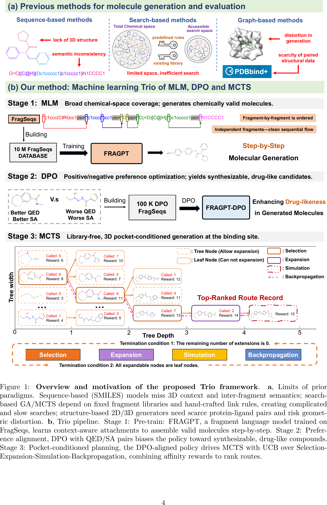
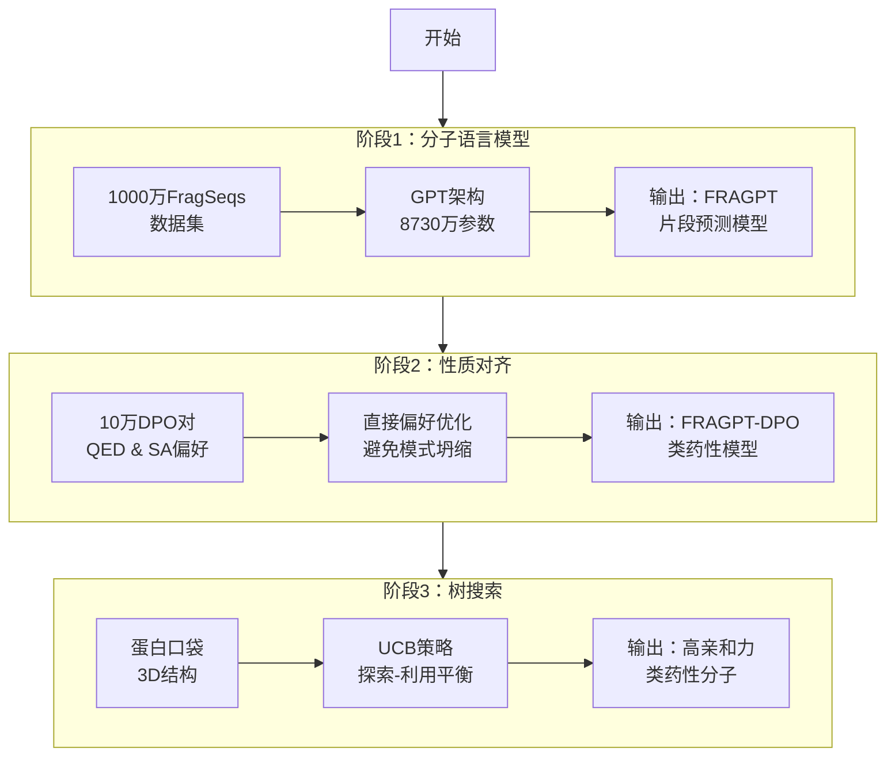
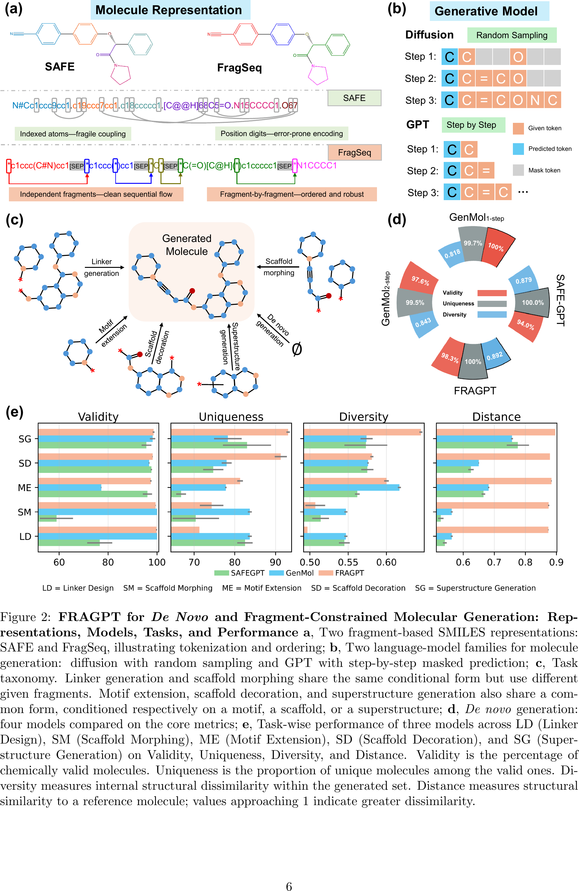
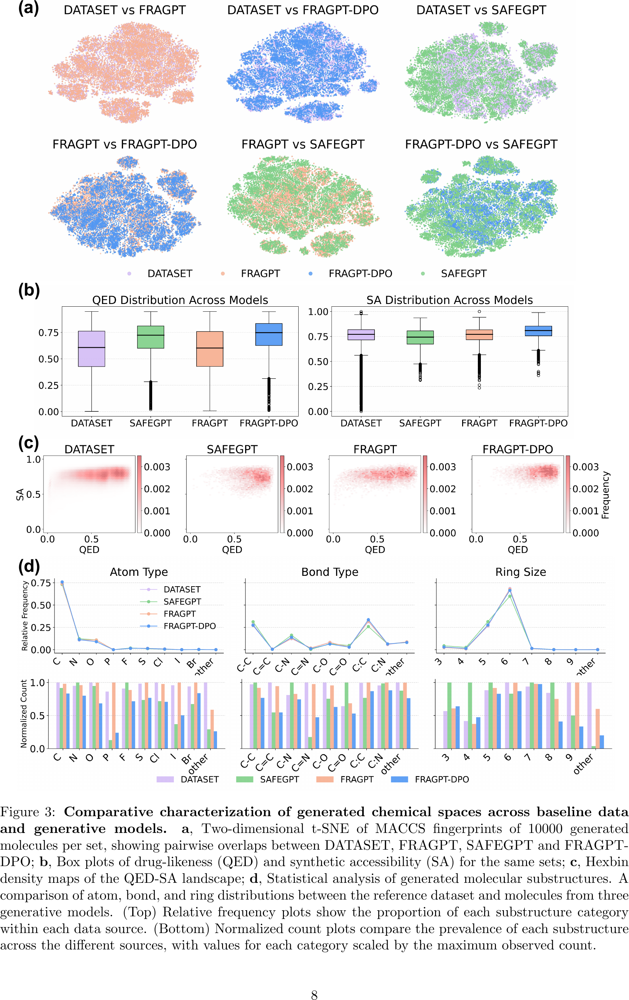
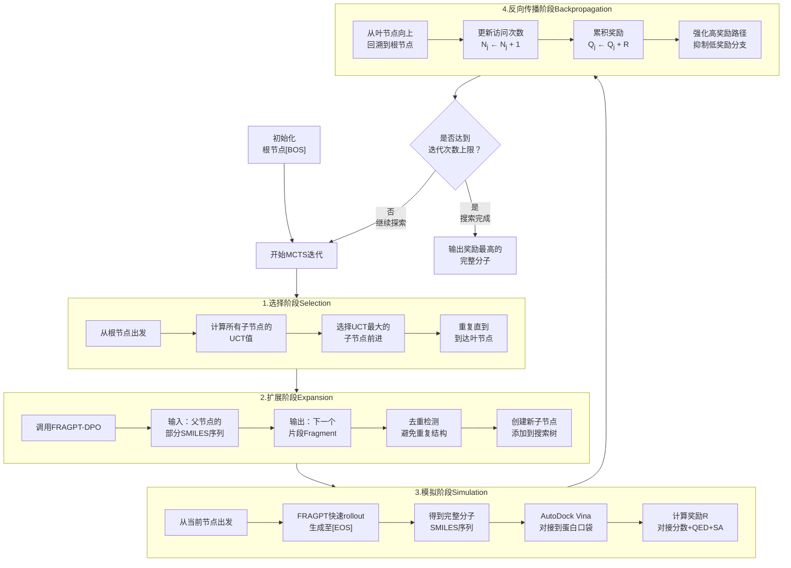
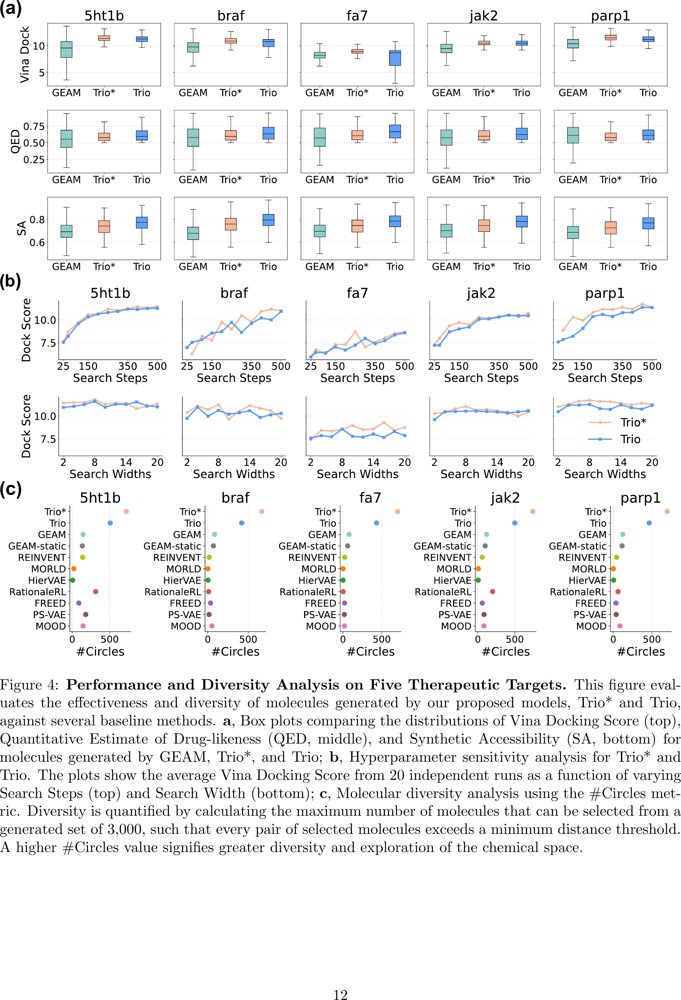
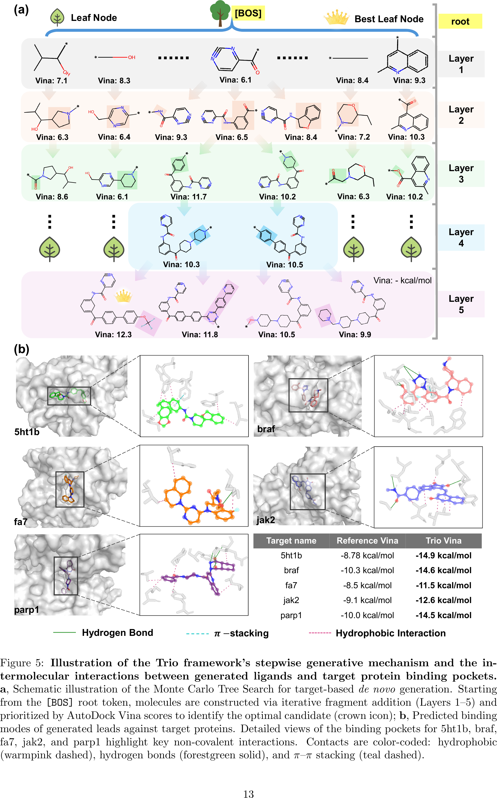

# 分子片段语言模型遇见蒙特卡洛树搜索：Trio框架的可解释靶向分子设计

## 本文信息

- **标题**: Toward Closed-loop Molecular Discovery via Language Model, Property Alignment and Strategic Search
- **作者**: Junkai Ji, Zhangfan Yang, Dong Xu, Ruibin Bai, Jianqiang Li, Tingjun Hou, Zexuan Zhu
- 发表时间: 2025年12月18日
- **单位**: 深圳大学人工智能学院（中国）、诺丁汉大学宁波分校计算机科学学院（中国）、浙江大学药学院（中国）
- **引用格式**: Ji, J., Yang, Z., Xu, D., Bai, R., Li, J., Hou, T., & Zhu, Z. (2025). Toward Closed-loop Molecular Discovery via Language Model, Property Alignment and Strategic Search. *arXiv preprint arXiv:2512.09566v2*.
- **源代码**: https://github.com/SZU-ADDG/Trio

## 摘要

> 药物发现是一个耗时且昂贵的过程，传统的高通量筛选和基于对接的虚拟筛选受限于低成功率和有限的可扩展性。尽管自回归、扩散和流模型等生成方法已经实现了超越枚举筛选的**全新配体设计**，但这些模型往往存在**泛化能力不足、可解释性有限**，以及**过度强调结合亲和力而牺牲关键药理学性质**的问题，从而限制了其转化应用。本文提出**Trio框架**，这是一个整合了**基于片段的分子语言模型、强化学习和蒙特卡洛树搜索**的分子生成框架，用于有效且可解释的闭环靶向分子设计。通过这三个关键组件，Trio实现了**上下文感知的片段组装**，确保**物理化学性质和合成可行性**，并在蛋白结合口袋内**平衡探索新颖化学类型和利用有希望的中间体**之间取得平衡。实验结果表明，Trio能够可靠地生成化学有效且药理学性质优越的配体，在**结合亲和力提升7.85**%、**类药性提升11.10**%和**合成可及性提升12.05**%的同时，将**分子多样性扩展了4倍以上**。

### 核心结论

- Trio框架整合了片段分子语言模型FRAGPT、直接偏好优化DPO和蒙特卡洛树搜索MCTS，实现了可解释的闭环靶向分子设计
- 在5个蛋白靶点上，Trio生成的分子在结合亲和力、类药性QED和合成可及性SA三个维度上全面超越现有方法
- 分子多样性相比基线方法提升4倍以上，有效拓展了可访问的化学空间
- 通过可视化的搜索树轨迹，Trio提供了前所未有的分子优化过程透明度，使药物化学家能够理解和信任设计结果

## 背景

药物发现是一项极其复杂、昂贵且耗时的工程，通常需要超过十年的持续努力和大量财务投资才能将单一治疗候选药物转化为临床批准的药物。传统的高通量筛选方法虽然做出了重要贡献，但常常受限于**低命中率、不断增加的实验成本以及对广阔化学空间的有限覆盖**。基于对接的虚拟筛选提供了一种有前景的计算替代方案，能够快速优先排序先导化合物并识别新的治疗机会。然而，这些方法仍然受到**高假阳性率和内在可扩展性瓶颈**的阻碍，特别是随着化学库在规模和结构复杂性上呈指数级增长。

近年来生成建模的进展代表了一种范式转变，提供了一种在特定任务优化约束下设计新型先导化合物的转型能力。自回归生成模型如Pocket2Mol、ResGen和FragGen能够直接从蛋白3D结构上下文中设计配体，但它们的**严格顺序性质偏离了物理现实**，累积的误差经常产生化学上不可信的结构。扩散和流模型如DiffBP、DiffSBDD和EquiFM通过同时生成所有原子来克服这些问题，但**实验解析的蛋白-配体复合物的有限可用性继续阻碍模型训练**，限制了其在实际药物发现应用中的泛化和鲁棒性。

为了克服蛋白条件生成模型的泛化限制，研究人员越来越多地从语言模型中汲取灵感。分子结构可以用SMILES、SELFIES和SAFE等文本格式表达，使得**超大规模化合物库能够作为分子语言模型的宝贵训练语料库**。代表性工作包括BindGPT、3DSMILES-GPT和TamGen，它们通过大规模预训练和强化学习改善了泛化能力。然而，当前的分子语言模型仍然不足以实现精确的蛋白口袋靶向，辅助优化程序常常**过度强调结合亲和力而牺牲类药性QED和合成可及性SA**，从而限制了其在药物发现中的转化效用。

### 关键科学问题

- **泛化能力不足**：现有的蛋白条件生成模型受限于蛋白-配体复合物数据的稀缺性，难以泛化到新的靶点和化学空间，限制了其在实际药物发现中的应用价值
- **多目标优化失衡**：当前方法往往过度关注结合亲和力的优化，而忽视了类药性、合成可及性等关键药理学性质，导致生成的分子难以进入后续的药物开发流程
- **可解释性缺失**：现有模型的黑箱特性使得药物化学家无法理解分子优化的路径，难以合理化或信任设计结果，从而制约了其在药物发现中的广泛应用
- **化学空间探索受限**：基于规则的搜索方法依赖于预定义的片段库和手工设计的连接规则，创造了复杂且低效的搜索过程，限制了可访问的化学空间

### 创新点

- 提出**FRAGPT片段分子语言模型**，使用基于BRICS算法的FragSeq表示，避免了SAFEGPT中数值连接标识符和环索引标记的句法复杂性，在1000万FragSeqs上预训练，实现了上下文感知的片段组装
- 采用**直接偏好优化DPO**而非传统的强化学习PPO，将分子语言模型与QED和SA等关键分子性质对齐，避免了模式坍缩问题，实现了平滑的性质偏好整合
- 将**蒙特卡洛树搜索MCTS与DPO对齐的分子语言模型结合**，利用上置信界UCB策略平衡探索和利用，通过亲和力、药代动力学和构效关系奖励引导片段组装轨迹，实现了可解释的闭环优化
- 提供**完整的搜索树可视化**，使研究人员能够系统追踪候选分子的演化谱系，揭示特定官能团和片段组合如何逐步增强预测结合亲和力，为药物化学家提供了可操作的见解

---

## 研究内容

### 方法概览：Trio的三阶段流程

Trio框架的整体生成流程可以分为三个阶段。第一阶段，使用自监督学习训练一个分子语言模型用于下一个片段预测任务。第二阶段，采用强化学习对分子语言模型进行微调，实现定制化的分子性质对齐。第三阶段，利用蒙特卡洛树搜索和对齐后的分子语言模型在三维蛋白口袋中逐步生成分子。

**图1：Trio框架概览与动机**

- **(a) 先前范式的局限性**：**基于序列的方法**（SMILES模型）缺乏3D上下文和片段间语义；**基于搜索的方法**（GA/MCTS）依赖固定的片段库和手工规则，创造了复杂且缓慢的搜索过程；**基于结构的生成器**（2D/3D）需要稀缺的蛋白-配体对数据，且存在几何扭曲风险
- **(b) Trio流程**：
  - **阶段1：预训练FRAGPT**：在FragSeqs上训练的片段语言模型，学习上下文感知的连接方式，逐步组装有效分子
  - **阶段2：偏好对齐**：使用QED/SA对进行DPO训练，使策略偏向可合成、类药性化合物
  - **阶段3：口袋条件规划**：DPO对齐的策略驱动MCTS，通过UCB在选择-扩展-模拟-反向传播过程中，结合亲和力奖励对路径进行排序

### 阶段1：FRAGPT片段分子语言模型

FRAGPT采用类GPT架构，专门用于预测分子片段的自回归模型。原始SMILES字符串需要被修改为基于片段的SMILES标记进行训练。**片段化方法不仅保留了片段内部的语义信息，还明确捕获了片段之间的化学相互作用**。具体而言，使用BRICS算法将分子从左到右分解为多个FragSeqs，定义了16种化学环境来灵活确定合适的键断裂位点和保留的官能团。

FRAGPT使用基于正则表达式模式的分词器，专门针对SMILES语法定制。生成的词汇表包含约600个唯一标记，不仅包括标准化学标记（如原子、键、分支和环符号），还包括所有必需的特殊标记，如[BOS]（序列开始）、[EOS]（序列结束）、[SEP]（片段标识符）和[PAD]（填充指示符）。模型架构包含**8730万参数**，采用标准的自注意力机制和前馈网络。训练目标是最小化模型预测的标记概率分布与目标标记真实分布之间的交叉熵损失。

在**1000万FragSeqs**数据集上，使用6块NVIDIA A6000 GPU训练8个epoch，采用AdamW优化器（$\beta_1=0.9$, $\beta_2=0.95$），学习率调度策略结合了初始预热阶段和后续线性衰减，批量大小为每GPU 32个样本。

**图2：FRAGPT的全新生成和片段约束生成性能**

- **(a) 两种基于片段的SMILES表示**：SAFE使用索引原子（脆弱耦合）和位置数字（易出错编码），FragSeq使用独立片段（清晰的顺序流）和逐片段排序（有序且鲁棒）
- **(b) 两种语言模型族**：扩散模型使用随机采样，GPT使用逐步掩码预测
- **(c) 任务分类**：Linker生成、Scaffold变形、Motif扩展、Scaffold装饰和Superstructure生成

**Linker设计与Scaffold变形的本质区别**：尽管两者在条件形式上相似（都需要同时满足起始和终止片段约束），但它们解决的化学问题截然不同。**Linker设计LD专注于连接两个给定片段，生成的连接部分不能引入新的环系统**，约束更为严格；而**Scaffold变形SM则允许并鼓励通过添加新环来修改核心骨架结构**，探索更广阔的化学空间。这种差异决定了LD适合优化已知骨架的连接方式，而SM适合探索新型骨架类型。
- **(d) 全新生成性能**：FRAGPT仅用**1**%的SAFE数据集训练即达到或超越在完整语料库上训练的基线模型性能，展示了卓越的数据效率。FRAGPT的有效性、唯一性和多样性均接近**100**%
- **(e) 片段约束生成的任务级性能**：在LD（Linker设计）、SM（Scaffold变形）、ME（Motif扩展）、SD（Scaffold装饰）和SG（Superstructure生成）五个任务上，FRAGPT在有效性、唯一性、多样性和距离指标上均表现优异。即使在结构受限的Linker设计和Scaffold变形任务中，FRAGPT也展示了**显著的生成多样性**

### 阶段2：DPO直接偏好优化

#### DPO是什么？

**DPO（Direct Preference Optimization，直接偏好优化）**是一种新型的模型对齐算法。传统的强化学习方法（如PPO）需要先训练一个独立的奖励模型来评价生成结果的好坏，然后再用这个奖励模型指导生成模型的优化。而**DPO的核心创新是将生成模型本身视为奖励模型**，直接从“好坏对比”数据中学习用户偏好，无需额外的奖励模型，既简化了训练流程，又避免了传统强化学习容易出现的模式坍塌问题（即输出过度集中到少数几个高分样本）。

**通俗理解**：想象你在教一个厨师改进菜品。传统方法（PPO）需要先培养一个专业美食评委，让评委给每道菜打分（比如85分、92分），然后厨师根据这些分数调整做法。这种方法的问题是：培养评委很费时间，而且评委的标准可能不稳定，导致厨师只会做几道“刷分菜”。DPO的做法更直接：每次给厨师看两道菜，告诉他“这道更好吃，那道差一些”，让厨师自己琢磨为什么。这种“品尝对比”的学习方式更自然，厨师不会被绝对分数束缚，而是逐渐理解“什么样的菜更好”，做出的菜品既符合标准又保持多样性。

在Trio框架中，DPO的作用是将FRAGPT从“能生成有效分子”提升到“生成类药性强、易合成的分子”。通过学习10万对“好分子vs坏分子”的对比数据，DPO让模型在保持生成多样性的同时，**平滑地将分布向高QED（类药性）、低SA（易合成）的理想区域迁移**。

#### 训练流程

为了鼓励FRAGPT生成更合理的分子，采用DPO算法将模型平滑地对齐到更高的QED和更低的SA，而不是使用增强似然强化学习（会导致输出分布坍缩到期望性质的尖峰模式）。与需要训练辅助奖励模型的PPO不同，**DPO将GPT策略本身视为奖励模型**，这种设计在策略logits和奖励信号之间产生了显式映射，允许语言模型在没有额外批评器的情况下满足用户定义的偏好。

**具体流程拆解（对照原文Page 18）**：

1. **生成候选分子池**：让初始的FRAGPT模型（称为参考策略$\pi_{\text{ref}}$）生成约10万个FragSeqs。这些分子从各种起始片段出发延伸而成，结构各异，性质参差不齐
2. **制作“好坏对照表”**：按照药物属性（QED类药性和SA合成难度）对每组分子排序，从排名的**顶部和底部**各抽取一个，组成“好分子-坏分子”配对。比如，同样从苯环片段出发，一个延伸成了QED高（类药性强）且SA低（易合成）的优质化合物，另一个延伸成了QED低且SA高的劣质结构，这就构成了一个训练样本对
3. **让模型学习偏好——“反复展示对比”的具体操作**：
   - **不是人工展示**：而是通过DPO损失函数$\mathcal{L}_{\text{DPO}}$自动优化模型参数
   - **具体机制**：对于每一对好坏分子$(y_g, y_l)$，模型计算生成它们的概率$\pi_\theta(y_g|x)$和$\pi_\theta(y_l|x)$。优化目标是让**生成好分子$y_g$的概率相对于初始模型上升**，同时让**生成坏分子$y_l$的概率相对于初始模型下降**
   - **通俗理解**：就像调整一个多选题答题策略——不需要知道正确答案得多少分，只需要知道“选A比选B好”，就能逐渐调整选择倾向。模型遍历10万对数据，每一对都贡献一个调整信号，最终学会在每个起始片段后**优先选择那些导向高质量分子的token（片段）**
   - **关键优势**：不直接告诉模型QED和SA的具体数值（避免对绝对分数的过拟合），只提供相对偏好信号（这个比那个好），让模型保持生成多样性的同时整体向高质量区域迁移

这样就构建了离线偏好数据集$\mathcal{D} = \{(x^{(i)}, y^{(i)}_g, y^{(i)}_l)\}_{i=1}^N$，其中$y^{(i)}_g$和$y^{(i)}_l$表示来自相同先验片段$x^{(i)}$但表现出更高和更低药物性质评分的FragSeqs。

然后，最大化强化MLM $\pi_\theta$相对于参考策略$\pi_{\text{ref}}$的似然，优化目标为：

$$
\mathcal{L}_{\text{DPO}} = -\mathbb{E}_{(x,y_g,y_l)\sim\mathcal{D}}\log \sigma\left(\beta \log \frac{\pi_\theta(y_g|x)}{\pi_{\text{ref}}(y_g|x)} - \beta \log \frac{\pi_\theta(y_l|x)}{\pi_{\text{ref}}(y_l|x)}\right)
$$

其中$\sigma$是sigmoid函数，$\beta$是缩放系数，调整训练期间增强偏好和保留原始分布之间的权衡。

**公式的通俗解释**：

这个损失函数看起来复杂，但核心思想很简单——**让模型在生成好分子时变得更自信，在生成坏分子时变得更犹豫**。

- **概率比值** $\frac{\pi_\theta(y_g|x)}{\pi_{\text{ref}}(y_g|x)}$：表示“新模型生成好分子$y_g$的概率”相对于“旧模型生成好分子的概率”提升了多少倍。比如这个比值是2，说明新模型生成这个好分子的概率是旧模型的2倍
- **好坏对比** $\beta \log \frac{\pi_\theta(y_g|x)}{\pi_{\text{ref}}(y_g|x)} - \beta \log \frac{\pi_\theta(y_l|x)}{\pi_{\text{ref}}(y_l|x)}$：前一项是“好分子概率提升”，后一项是“坏分子概率提升”，两者相减就是**好分子相对于坏分子的优势有多大**。我们希望这个差值越大越好，即好分子概率涨得快，坏分子概率涨得慢（甚至下降）
- **sigmoid转换** $\sigma(\cdot)$：把差值转换成0到1之间的概率，表示“模型是否正确地更偏好好分子”
- **负号和期望** $-\mathbb{E}[\log \sigma(\cdot)]$：负号表示最小化负对数似然，等价于最大化模型“做出正确偏好选择”的概率。期望符号表示对所有10万对数据求平均

**简单来说**：DPO通过这个损失函数，让模型在每次遇到选择时（比如从苯环出发，下一步加什么片段），**逐渐提高选择导向好分子路径的概率，降低选择导向坏分子路径的概率**，最终整体生成分布向高质量区域迁移。

**图3：跨基线数据和生成模型的化学空间比较表征**

- **(a) 二维t-SNE投影——DPO如何改变生成分布**
  - **vanilla FRAGPT（蓝色）几乎完全覆盖了训练集DATASET（灰色）的分布范围**，说明模型忠实地学习了训练数据的多样性，但也继承了训练集中的低质量分子
  - **FRAGPT-DPO（红色）将分布集中到数据密集核心**，像是给原来分散的点云“做了一次聚焦”，重点生成位于化学空间中心区域的高质量分子（对照图3b/c可知这些区域对应高QED、低SA）
  - **为什么“集中”是好事**：这说明DPO成功地将生成重心从“覆盖全部训练集（包括边缘低质量区域）”转移到“聚焦高质量核心区域”，在保持化学多样性的同时显著提升了生成分子的平均质量
  - SAFEGPT由于其更大更多样的训练语料库，产生了几个在原始数据集中稀疏表示的高密度聚类，探索了更广阔的化学空间
- **(b) QED和SA分布的箱线图**：vanilla FRAGPT紧密镜像训练集的联合QED-SA景观，SAFE在QED上有所改善但SA分布更广，**FRAGPT-DPO显示QED明显上移和SA适度增加**，伴随SA方差收缩
- **(c) QED-SA景观的六边形密度图**：揭示了样本密度向化学理想区域的显著转移，有效消除了原始数据中存在的低质量长尾
- **(d) 生成分子亚结构的统计分析**：顶部面板显示所有三个生成器紧密再现了原子类型、键类型和环大小分布的训练集统计。底部面板进一步揭示vanilla FRAGPT保留了所有三个描述符的相似频率，包括低频卤素（I, Br, Cl）和大环。**FRAGPT-DPO放弃了化学不利的基序，从而相对于数据集改善了类药性和合成可及性**

> 小编锐评：每次看到这些指标看起来都差不多，就觉得守着这么点数据卷AI模型实在没有意思……而且generation本身是个工程问题（不去挖底层物理化学规律就不是科学问题），没有用在制药公司的话实在是电子游戏……实践是检验真理的唯一标准，没有人知道新颖的化学空间是不是对的，拿这个来评价就很难评。侯老师工作里面的QED、SA这些真的是重要的指标啊，才是应该发扬光大的，但是吧，好像也没明显提升，本来就是符合一定标准就行了……

### 阶段3：MCTS蒙特卡洛树搜索

Trio将对齐后的FRAGPT-DPO与MCTS算法结合，用于复杂的靶向分子设计。这种混合方法利用MCTS在平衡探索和利用方面的优势，促进了具有增强结合亲和力的更多样化分子生成。该算法包括四个典型阶段：**选择、扩展、模拟和反向传播**。

**MCTS的通俗理解**：

想象你在一个巨大的化学迷宫中寻找最好的分子，每个岔路口代表“添加哪个片段”的选择。MCTS就像一个聪明的探险家，采用“**边探索边记录，择优深入**”的策略：

- **探索vs利用的困境**：是继续尝试新路线（探索），还是深挖已知的好路线（利用）？太保守会错过更好的分子，太冒险会浪费计算资源
- **MCTS的解决方案**：用一棵**搜索树**记录所有尝试过的路径和它们的奖励（对接分数、QED、SA），每次迭代都基于历史经验做出更明智的选择，逐渐将搜索重心转向最有希望的区域
- **四个阶段的循环**：选择（沿着最有潜力的路径向下走）→ 扩展（在叶节点添加新片段）→ 模拟（快速试探这条路能走多远）→ 反向传播（把结果反馈给路径上的所有节点）。这个循环重复数千次，树逐渐生长，好路径被反复加强，差路径被逐渐放弃

#### 选择阶段：在化学决策树中导航

采用修改的**上置信界UCT准则**来选择具有高潜在奖励的子节点，同时保持探索的多样性。子节点$j$的UCT值公式为：

$$
\text{UCT}_j = \alpha \times \text{average}(a_j) + (1-\alpha) \times \text{max}(a_j) + C\sqrt{\frac{\ln N_C}{N_j}}
$$

其中$\text{average}(a_j)$和$\text{max}(a_j)$分别表示动作$a_j$的平均和最大奖励，$\alpha$操纵历史性能$\text{average}(a_j)$和乐观潜力$\text{max}(a_j)$之间的权衡，$C$通过缩放来自UCT框架的第二项来表示探索-利用平衡，$N_C$是父节点的总访问计数，$N_j$是节点$j$的访问计数。

**通俗解释——如何选择下一步走哪条路**：

从根节点（[BOS]标记或初始片段）开始，算法需要决定往哪个子节点（添加哪个片段）前进。UCT公式就像一个“路径评分系统”，综合考虑三个因素：

- **第一项**：$\alpha \times \text{average}(a_j)$——**历史平均表现**。这条路之前走过多次，平均奖励如何？就像餐厅的平均评分，反映稳定性
- **第二项**：$(1-\alpha) \times \text{max}(a_j)$——**最佳潜力**。这条路曾经出现过的最高奖励是多少？反映乐观潜力，也许只是运气好，但值得再试试
- **第三项**：$C\sqrt{\frac{\ln N_C}{N_j}}$——**探索奖励**。这条路被访问的次数$N_j$越少，这一项越大，鼓励尝试冷门路线。$\ln N_C$确保总体探索随迭代次数对数增长，避免过度探索

**简单来说**：选择UCT值最高的子节点前进。一开始，未探索的路径因为探索奖励高而被优先尝试；随着迭代进行，高奖励的路径逐渐脱颖而出，搜索重心向它们倾斜，但仍保留一定概率探索新路径。

#### 扩展阶段：生成下一个分子片段

在选择叶节点后，FRAGPT作为代理生成SMILES序列的后续片段。扩展阶段包含**重复检测机制**，计算当前节点与其兄弟节点之间的分子相似性，扩展重复最多5次直到获得结构不同的分子，从而增强候选物的多样性和优化过程的整体效率。

**FRAGPT的输入输出机制**（对照原文Page 20）：

- **输入是什么**：父节点存储的**部分SMILES序列**（当前已构建的分子片段序列）。例如，父节点可能是`[BOS][SEP]c1ccccc1[SEP]`（从[BOS]开始，已添加苯环片段）
- **FRAGPT做什么**：作为自回归语言模型，FRAGPT根据这个“前文”（部分序列）预测“下一个token”（下一个片段应该是什么）。这正是GPT架构的核心能力——**给定前文，预测下一个词**（这里是片段）
- **输出是什么**：一个新的**片段**（Fragment），而不是完整分子。例如输出`CC(=O)[SEP]`（乙酰基片段）
- **如何使用**：将新片段**追加**到父节点的SMILES字符串后面，形成新的部分序列`[BOS][SEP]c1ccccc1[SEP]CC(=O)[SEP]`，作为新子节点存储在树中

**关键区别**：
- **扩展阶段**：只生成**一个片段**，在树上添加**一个子节点**，逐步构建分子
- **模拟阶段**（下一步）：从当前节点出发，一口气生成**到[EOS]结束**，得到完整分子用于评分

**通俗解释**：到达叶节点后，检查它是否已经是完整分子（包含[EOS]结束标记）。如果还没结束，就调用FRAGPT-DPO模型读取父节点的部分SMILES，预测并添加下一个片段，在树上创建新分支。为了避免生成重复的分子浪费计算，会检查新分子与兄弟节点的相似性，如果太相似就重新生成，最多尝试5次。这就像在迷宫的岔路口开辟一条新路，但要确保不是走回头路。

#### 模拟阶段：快速试探长期潜力

通过执行**蒙特卡洛rollout**直到到达终端状态（[EOS]）来评估新扩展节点的长期潜力。在rollout过程中，FRAGPT生成基于当前节点状态的**完整SMILES序列**并重建相应的分子，近似当前扩展节点的潜在分子状态以供后续评估。生成的分子使用领域特定的**奖励函数**$R(\cdot)$进行评分，量化期望的性质，如合成可及性SA、类药性定量估计QED和靶特异性生物活动（如对接分数）。

这里回答一个重要问题：**FRAGPT本身不需要蛋白结构信息作为输入**！蛋白信息通过**实时对接评估**间接使用：

1. **FRAGPT的角色**：只负责生成化学上合理的分子序列，基于预训练的SMILES语言模型，不涉及蛋白结构
2. **蛋白信息的引入**：在模拟阶段，生成完整分子后，使用**AutoDock Vina**将分子对接到目标蛋白口袋，得到对接分数
3. **奖励函数设计**：$R(\cdot)$综合多个评分：对接分数（结合亲和力）+ QED（类药性）+ SA（合成可及性）
4. **闭环优化**：奖励反馈给MCTS → 更新节点统计 → 指导后续片段选择 → 逐渐向高亲和力分子收敛

这种“**实时对接评估指导搜索**”的方式（原文称为“real-time docking evaluations”），使得MCTS能够在**不直接使用蛋白结构作为模型输入**的情况下，仍然实现靶向分子设计。图5b的结合模式（疏水、氢键、π-π堆积）是基于Vina对接得到的最优结合构象进行的相互作用分析。

**通俗解释**：扩展阶段只添加了一个片段，但我们想知道“如果沿着这条路一直走下去，最终能得到什么样的分子？”模拟阶段就是**快速试探**：让FRAGPT从当前片段出发，一口气生成到分子完成（[EOS]），然后用Vina对接到蛋白口袋，计算这个完整分子的奖励（对接分数、QED、SA的加权组合）。这就像下围棋时的“快速模拟对局”——不需要精确计算每一步，只需要快速跑到终局，看看大概能赢多少。这个奖励就是这条路径的“潜力评估”。

#### 反向传播阶段：更新路径统计信息

将模拟获得的最终奖励$R$向后传播通过树以更新所有遍历节点的统计信息。每个节点的访问计数$N_j$和累积奖励$Q_j$递增：$N_j \leftarrow N_j + 1$，$Q_j \leftarrow Q_j + R$。这种更新机制使算法能够随时间积累经验，强化一致导致高奖励结果的节点，同时逐渐阻止次优分支的探索。

**通俗解释**：模拟得到了奖励分数，现在要把这个信息**反馈给这条路径上的所有节点**。从叶节点一路向上回溯到根节点，每个经过的节点都更新两个统计量：访问次数$N_j$加1（记录这条路又走了一遍），累积奖励$Q_j$加上这次的奖励$R$（积累经验）。这样，下次再选择时，UCT公式就能利用这些更新后的统计信息做出更明智的决策。高奖励的路径会被标记为“有潜力”，低奖励的路径会被逐渐冷落，实现“强者愈强”的良性循环。

**四阶段循环总结**：这四个阶段构成一个完整的迭代循环，重复数千次（如5000次模拟）。每次循环都让搜索树变得更聪明一点，最终收敛到高质量分子集中的区域。图5a展示了一个实际的搜索树示例，从[BOS]开始，经过5层片段添加，最终找到对接分数最优的候选分子（标注皇冠图标）。

### 靶向分子生成的性能评估

在5个成熟的蛋白靶点（parp1, fa7, 5ht1b, braf, jak2）上进行了全面评估。主要评估指标是**top-hit 5**%分数，定义为前5%独特且新颖生成hits的平均对接分数DS。新颖hits的定义采用三个严格标准：DS < 活性分子的中位DS、QED > 0.5、SA < 5.0。

每个蛋白靶点生成3000个候选分子，与最先进的基线生成器进行基准测试。基线方法包括四个方法学家族：**基于片段的方法**（JT-VAE、HierVAE、MARS、RationaleRL、FREED、PSVAE、f-RAG和GEAM），**遗传算法变体**（Graph GA、GEGL和Genetic GFN），**强化学习基线**（REINVENT和MORLD），以及**扩散模型**（MOOD）。

| 靶点 | f-RAG | GEAM | Trio\* | Trio |
|------|-------|------|-------|------|
| parp1 | -12.945 | -12.891 | **-13.129** | -12.730 |
| fa7 | -9.899 | -9.890 | **-10.359** | **-10.132** |
| 5ht1b | **-12.670** | -12.374 | -12.954 | **-12.669** |
| braf | **-12.390** | -12.342 | -12.591 | **-12.389** |
| jak2 | **-11.842** | -11.816 | -11.855 | -11.806 |

**表1：5个蛋白靶点上的对接性能定量比较（展示最佳baseline方法）**

**表格说明**：
- **评价指标**：AutoDock Vina对接分数（单位：kcal/mol），数值**越负越好**（表示结合越紧密）
- **方法选择**：表中展示了近期SOTA方法f-RAG和GEAM（两者在原文完整表格的15个方法中表现最佳），以及本文的Trio*和完整Trio
- **完整对比**：原文Table 1包含15个baseline方法（涵盖基于片段、遗传算法、强化学习和扩散模型四大类），Trio*在**所有5个靶点上均实现最佳结合亲和力**，超越所有基线
- **加粗规则**：每个靶点的最优值用粗体标注。5ht1b、braf和jak2三个靶点上，完整Trio与f-RAG的差距在0.001-0.002 kcal/mol范围内，几乎持平

**核心发现**：

基础Trio\*模型（无DPO约束）在5个靶点上均实现了**最佳结合亲和力**，平均对接分数为-12.169 kcal/mol，超越所有基线方法。这证明了将**片段语言模型与引导树搜索**结合的有效性。完整的Trio框架将FRAGPT-DPO与MCTS集成，创建了类药分子搜索的整体解决方案。与仅关注探索的Trio\*不同，**完整Trio模型不仅优化结合亲和力，而是导航多目标景观以优先考虑类药性和合成可及性**。完整Trio在5个靶点上的平均对接分数为-12.389 kcal/mol，虽然略低于Trio\*，但在QED和SA上表现更优（见图4a），实现了**亲和力、类药性和合成可及性的三维平衡**。

**图4：5个治疗靶点上的性能和多样性分析**

- **(a) 箱线图比较**：对比GEAM、Trio\*和Trio生成分子的Vina对接分数（上）、QED（中）和SA（下）分布。虽然Trio\*表现出最极端的DS分布，**完整Trio模型在QED和SA上实现了优越且紧密聚类的值**，由偏好对齐驱动，为实际药物发现提供了最佳平衡
- **(b) 超参数敏感性分析**：显示搜索步数（上）和搜索宽度（下）对20次独立运行的平均Vina对接分数的影响。对接分数通常随着模拟计数的增加而改善，而扩展树宽度增强探索但对对接性能没有统计学显著增益
- **(c) 分子多样性分析**：使用#Circles指标量化多样性，计算从3000个生成集中可以选择的最大分子数，使得每对选定分子超过最小距离阈值（Morgan-Tanimoto相似性>0.75）。**Trio\*模型在所有5个蛋白靶点上展示了显著的多倍改进**，Trio模型相对于Trio\*有预期的适度减少，但其#Circles计数仍优于早期方法

为了减轻由近乎相同分子簇引起的夸大性能，对GEAM、Trio\*和Trio每个靶点生成的3000个分子进行了去冗余处理，计算Morgan-Tanimoto相似性系数以丢弃相似性大于0.4的任何对。由于GEAM在有限的ZINC250K数据库内优化，近一半的分子被移除。相比之下，即使在移除结构冗余对后，**Trio\*和Trio都保留了超过70%的生成候选物，突显了其生成广度**。

### 可解释性：搜索树可视化与结合模式分析

**为什么可解释性对药物发现至关重要**：

当前生成模型的**黑箱特性**是其在药物发现中广泛应用的根本障碍。传统的微调方法（fine-tuning）虽然能优化分子性质，但**可解释性受限于黑箱神经网络权重**——研究人员无法理解模型为什么生成某个分子，也无法追踪分子优化的路径，导致药物化学家难以合理化或信任设计结果。

**Trio的可解释性优势**（对照原文Page 5）：

相比传统微调方法，Trio通过**片段级搜索**显著增强了可解释性：

- **透明的优化轨迹**：MCTS的搜索树明确记录了每一步添加了什么片段、为什么选择这个片段（UCT值）、这个选择带来了多少奖励提升。分子优化的整个过程完全可追溯
- **战略决策过程可视化**：片段级的逐步组装透明地反映了算法的战略决策——哪些片段组合被优先探索、哪些路径被放弃、最终的优化分子经历了怎样的演化
- **灵活的目标调整**：可以通过简单地改变奖励函数来调整搜索目标（如增加ADMET性质权重），而无需重新微调模型，避免了微调方法的计算开销
- **人在环中的工作流程**：研究人员可以在搜索过程中介入，基于化学直觉修剪不合理的分支或引导探索方向，实现AI与专家知识的协同

**双重可解释性设计**：

Trio提供了两个层次的可解释性：（1）**搜索树可视化**——展示分子是如何一步步构建出来的；（2）**结合模式分析**——解释为什么这个分子能与靶蛋白紧密结合。

**图5：Trio框架逐步生成机制和生成配体与靶蛋白结合口袋之间分子间相互作用的示意**

- **(a) 基于靶标的全新生成的蒙特卡洛树搜索示意图**：从[BOS]根标记开始，通过迭代片段添加（第1-5层）构建分子，并由AutoDock Vina分数优先排序以识别最佳候选物（皇冠图标）。**完整搜索树的可视化提供了从头分子设计中罕见的可解释性水平**，使研究人员能够系统地追踪候选分子的演化谱系，揭示特定官能团和片段组合如何逐步增强预测结合亲和力。这种颗粒级透明度超越了仅呈现最终优化化合物，**提供了可操作的见解**，实现更理性的、人在环中的工作流程
- **(b) 生成的先导物对靶蛋白的预测结合模式**：5ht1b、braf、fa7、jak2和parp1结合口袋的详细视图突出了关键的非共价相互作用。接触用颜色编码：疏水（暖粉色虚线）、氢键（森林绿色实线）和$\pi-\pi$堆积（青色虚线）。相互作用分析揭示这些化合物实现了**异常有利的预测结合自由能**，并参与关键的非共价相互作用。表格展示Trio生成配体的Vina分数大幅超越参考化合物，**平均提升46.0**%

---

## Q&A

- **Q1**: 为什么Trio\*在结合亲和力上优于完整Trio，但在实际应用中推荐使用完整Trio？
- **A1**: Trio\*（无DPO约束）专注于最大化对接分数，采用无约束的探索策略实现了最佳结合亲和力。然而，这种单一目标优化常常以牺牲类药性QED和合成可及性SA为代价。完整Trio通过DPO将生成过程与多个药理学性质对齐，**在三个维度（结合亲和力、QED、SA）上实现了优越的平衡**。从药物开发的实际角度，一个具有略低对接分数但可合成且类药的分子，远比一个难以合成或具有不良ADMET性质的高亲和力分子更有价值。Trio的设计理念是在效力和可及性之间取得和谐，这对于转化研究至关重要。

- **Q2**: FRAGPT相比SAFEGPT的核心优势是什么？为什么FragSeq表示更优？
- **A2**: SAFEGPT依赖于**位置数值标记进行片段连接**，这些数字干扰了规范环闭合表示法，并随着片段数量的增加提升了句法歧义。具体而言：
  - **句法复杂性**：SAFE中的数值连接符（如“9”）会与SMILES中的环索引冲突，导致解析错误
  - **错误累积**：数字标记的误预测会级联传播，破坏整个分子的有效性
  - **语义分离性差**：片段之间的连接信息与片段内部化学语义混杂在一起

  相比之下，**FragSeq通过结构化片段语法将连接语义与环索引解耦**，每个片段用[SEP]标记分隔，保持了独立性和语义完整性。实验结果显示，FRAGPT仅用1%的数据即达到SAFEGPT的性能，且有效性接近100%，而SAFEGPT的有效性明显较低，证明了FragSeq表示的优越性。

- **Q3**: MCTS的children-adaptive策略如何动态调整搜索广度？为什么这对分子生成重要？
- **A3**: children-adaptive策略通过重要性度量$I(s_t) = \max_{o_i^t}|R(s_t, o_i^t) - \bar{R}(s_t)|$动态调整节点的分支因子，其中$R(s_t, o_i^t)$是第$i$个子节点的奖励，$\bar{R}(s_t)$是所有子节点的平均奖励。**高$I(s_t)$表示子节点间奖励偏差显著**，促使算法将子节点数扩展到$n(s_t) = \min(\beta\lfloor I(s_t)\rfloor, c_{\max})$，其中$\beta$控制扩展率，$c_{\max}$施加上限以防止计算过载。

  这种机制确保**奖励分布波动的节点需要更深入的探索**，增强发现高奖励分子候选物的可能性。在分子生成中，这意味着当某个片段添加后出现多种可能的优化方向（奖励分散）时，搜索树会自动增加分支，避免过早收敛到局部最优。相反，当奖励分布稳定时，树会减少分支以提高效率。这种自适应机制是Trio能够同时实现高质量和高多样性的关键因素之一。

## 关键结论与批判性总结

### 潜在影响

- Trio建立了一个可解释、可扩展的分子设计框架，**通过搜索树可视化提供了前所未有的透明度**，使药物化学家能够理解和信任AI生成的分子，促进了生成模型与专家驱动药物发现之间的人在环中工作流程
- 通过整合上下文感知片段建模、性质约束强化学习和原则性组合搜索，Trio实现了**泛化、可信性和可解释性的统一**，为自主闭环发现系统奠定了基础，代表了AI驱动药物发现范式的转变
- 在5个不同靶点上的一致性优势（无论受体类型或结构复杂性）表明，**MLM与树搜索的结合稳健地泛化到不同生物学上下文**，规避了纯数据驱动或规则约束方法中常见的靶点可转移性问题
- 分子多样性相比基线方法提升**4倍以上**，表明Trio克服了静态片段库的限制，能够探索远离训练分布的新颖化学空间，为发现新型骨架提供了可能

### 局限性

- **蛋白-配体数据的泛化挑战**：尽管Trio通过大规模化学语料库预训练在一定程度上克服了实验解析蛋白-配体复合物数据的稀缺问题，但特定靶点的结构数据仍然有限，可能影响模型在全新靶点家族上的泛化性能和鲁棒性
- **性质优化范围有限**：DPO当前仅对齐QED和SA两个性质，**未考虑更广泛的ADMET性质**（如溶解度、代谢稳定性、血脑屏障渗透性、hERG毒性等），这些是候选化合物从计算设计推进到临床试验的关键药代动力学瓶颈

### 未来研究方向

根据原文Conclusion部分（Page 16）提出的展望，Trio框架可以在以下三个方向进行扩展，以进一步提升其应对难治性生物学靶点的能力：

- **逆合成推理整合**：将逆合成分析嵌入到MCTS的奖励函数中，使生成的分子不仅满足合成可及性指标SA，而且具有**明确的、经济可行的逐步合成路线**，进一步缩小计算设计与实验验证之间的差距
- **更复杂的ADMET导向奖励函数**：扩展性质对齐框架以整合预测的溶解度、代谢稳定性、毒性等多维ADMET性质，实现更全面的药理学优化，提升候选分子的临床转化潜力和药物开发成功率
- **扩展片段词汇表**：整合RECAP、MMPA等其他片段化策略，或通过无监督学习自动发现新型片段类型，进一步拓展可访问的化学空间，增强对非传统靶点（如蛋白-蛋白相互作用、RNA靶点等）的适用性
