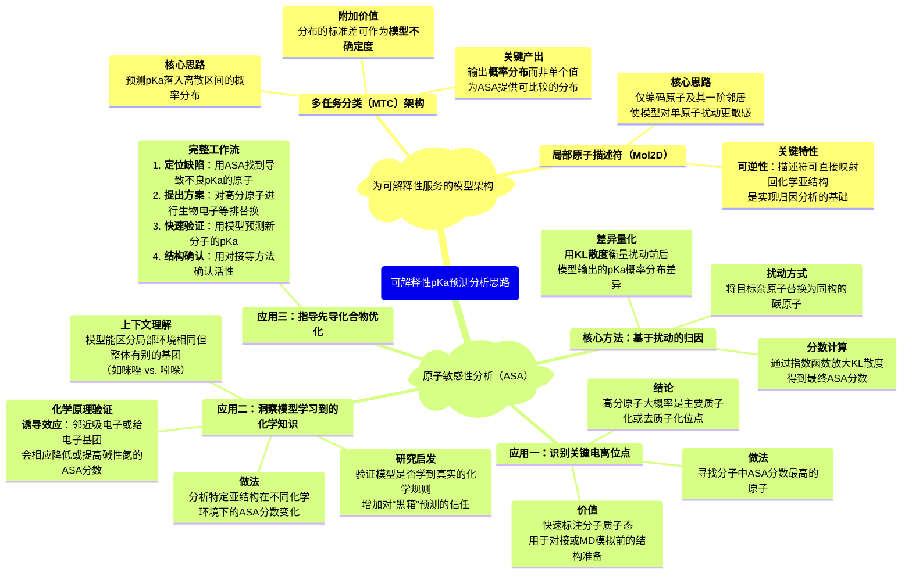
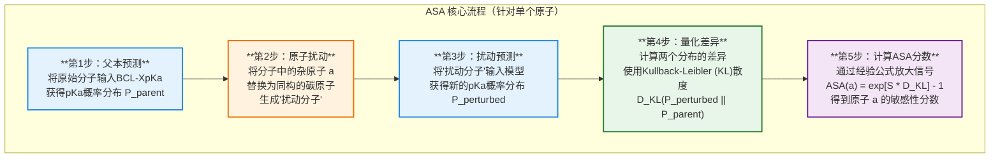

# **“黑箱”的透明化：BCL-XpKa通过原子敏感性分析实现可解释的pKa预测模型**

- Title: Interpretable Deep-Learning pKa Prediction for Small Molecule Drugs via Atomic Sensitivity Analysis
- Authors: Joseph DeCorte,* Benjamin Brown, Rathmell Jeffrey, and Jens Meiler
- https://doi.org/10.1021/acs.jcim.4c01472  
- Cite This: J. Chem. Inf. Model. 2025, 65, 101-113

## **一、 论文整体概览**

### **1. 摘要、背景与科学问题**

##### **摘要翻译**

机器学习（ML）模型如今在预测药物研发所必需的性质方面扮演着至关重要的角色，例如药物的对数尺度酸解离常数（pKa）。尽管近期在架构上取得了进展，但由于缺乏基准真实数据，这些模型在面对新化合物时常常泛化能力不佳。此外，这些模型也缺乏可解释性。为此，通过精心设计的分子嵌入，可以通过观察模型对输入分子进行原子扰动后的响应，来获取化学结构中的原子级分辨率信息。在此，我们提出了`BCL-XpKa`，一个基于深度神经网络（DNN）的多任务分类器，用于pKa预测，它通过`Mol2D`描述符来编码局部原子环境。`BCL-XpKa`为每个分子输出一个离散分布，该分布存储了pKa预测值以及模型对该分子的不确定性。`BCL-XpKa`能很好地泛化到新的小分子上，其性能与现代ML pKa预测器相当，在泛化任务中优于多个模型，并能准确模拟常见分子修饰对分子可电离性的影响。然后，我们通过**原子敏感性分析（ASA）**利用`BCL-XpKa`的精细描述符集和以分布为中心的输出，该分析无需重新训练模型即可将分子的预测pKa值分解为其各自的原子贡献。ASA揭示了`BCL-XpKa`已经隐式地学习到了关于分子亚结构的高分辨率信息。我们进一步通过在93.2%的复杂小分子酸和87.8%的碱中识别电离位点，展示了ASA在为蛋白质-配体对接准备结构方面的效用。最后，我们应用带有`BCL-XpKa`的ASA方法，识别并优化了一款最近发表的KRAS降解PROTAC的物理化学缺陷。

##### **背景**

在计算辅助药物研发领域，准确预测化合物在体内的行为（如生物利用度、溶解度等）对于节约研发时间和成本至关重要。其中，分子的**酸解离常数（pKa）**是一个决定其在生理pH下电离状态的关键物理化学性质，深刻影响着药物的吸收、分布、代谢、排泄和毒性（ADMET）。

传统的预测方法中，**量子力学（QM）**计算能够提供与实验相当的精度，但其巨大的计算成本使其无法应用于药物发现早期阶段对数以亿计化合物的虚拟高通量筛选（vHTS）。因此，**机器学习（ML）**方法，特别是定量结构-活性/性质关系（QSAR/QSPR）模型，因其极高的预测速度而成为主流。这些模型通过分子指纹或图神经网络（GNNs）等方式将化学结构转化为数学表示，并学习结构与性质之间的关系。

##### **本文解决的科学问题总结**

尽管ML方法取得了巨大成功，但仍面临两大核心挑战，这也是本文着力解决的科学问题：

1. **性能与泛化问题**：现有的ML模型大多依赖于数量有限的高质量实验数据进行训练，这常常导致模型在面对训练集中未见过的、新颖的化学骨架时**泛化能力差**，容易过拟合。
2. **可解释性问题**：大多数先进的ML模型（尤其是深度学习模型）如同一个**“黑箱”**，我们很难理解模型是基于分子的哪些具体结构特征做出某一特定预测的。这种可解释性的缺乏阻碍了我们对模型预测结果的信任，也使得我们难以从模型的“智慧”中获得化学洞见来指导后续的药物设计。

本文旨在通过**创新的模型架构（BCL-XpKa）**和**新颖的可解释性分析方法（ASA）**来同时应对这两个挑战。

### **2. BCL-XpKa 模型简介**

作者首先构建了一个名为 `BCL-XpKa` 的pKa预测模型，其核心是一个多层感知机（MLP）。该模型的设计巧妙，集成了几个关键特性：

- **分类而非回归（Multitask Classification, MTC）**：不同于传统模型直接预测一个连续的pKa值，BCL-XpKa将pKa范围划分为多个离散的“桶”（bins），并预测分子的pKa值落入每个“桶”的概率。最终的pKa值是这个概率分布的期望值。这种做法的好处是：
  - 可以直接从输出分布的标准差中读出**模型对预测的不确定度**。
  - 通过识别模型在哪些分子上表现出“高不确定性”或“高置信度但高错误率”，可以指导训练数据的优化。
  - 在性能上与回归模型相当，甚至略优。
- **双模型架构**：为了处理既有酸性基团又有碱性基团的复杂分子，作者分别训练了 `BCL-XpKaAcid` 和 `BCL-XpKaBase` 两个模型，用于分别预测一个分子中酸性最强和碱性最强的pKa值。

> **图1：BCL-XpKa的架构评估**
>
> **（A）** BCL-XpKa 使用独立的模型来预测分子的酸性和碱性pKa值。它使用 Mol2D 局部原子环境描述符来嵌入分子，然后使用一个多层感知机（MLP）来对pKa值所属的1-pKa单位区间进行分类。区间边缘交替包含和不包含端点。极值区间（pKa≤0, pKa>12）在其无界的一侧是开放的。 **（B）** 用于pKa预测的多任务分类误差随“桶”尺寸的增加而变化。小的“桶”允许更高的精度，但每个桶的数据更少；而大的“桶”精度较低，但每个桶的数据更多。 **（C）** BCL-XpKa与使用相同分子描述符和训练集训练的最佳性能回归架构在两个外部测试集上的性能对比。 **（D）** “留下一类” （leave-class-out, LCO） 方法，**其中一种分子亚结构被从模型训练中移除**，并在之后用作结构新颖的测试集。 **（E）** 模型误差由LCO亚结构和描述符类型决定。 **（F）** LCO亚结构的误差与包含该亚结构的TS-Acid或TS-Base分子数量的关系。  

### **3. Mol2D 描述符为何对 ASA 至关重要？**

BCL-XpKa模型选择使用 **Mol2D 描述符** 而非更复杂的GNN，这是实现原子级别可解释性（ASA）的基石。参考其原始论文 `BCL::Mol2D—a robust atom environment descriptor for QSAR modeling and lead optimization`，Mol2D 的核心优势在于其**设计上的简洁性与可逆性**。

- **核心定义**：Mol2D的核心是**原子环境（Atom Environment, AE）**。一个 AE 是以某个原子为中心，包含其周围一定化学键距离内的原子及其成键信息。BCL-XpKa使用的是 `height=1` 的AE，这意味着它只考虑中心原子和与它直接相连的邻居原子。

- **与传统指纹的关键区别**：
  1. **计数而非存在与否**：传统指纹（如 Molprint2D）通常是二进制的，只记录某种AE是否“存在”。而 BCL::Mol2D 是一个**计数向量**，它记录了分子中**每种特定AE出现的次数**。这提供了更丰富的信息，例如可以区分五元环和六元环。
  2. **细粒度的原子类型**：Mol2D 不仅考虑元素类型，还考虑了原子的**杂化状态/轨道构型**（'Atom type' 编码），这使得它能够区分同样是氮原子，但在不同化学环境下的细微差别。
  3. **通用 AE 库**：BCL::Mol2D 的描述符向量的每一个维度都对应一个从大型化合物库（超过90万个类药分子）中预先构建好的“通用AE库”中的特定AE。这意味着描述符的索引是固定的，**任何分子都可以被映射到这个统一的向量空间中**。
- **可逆性（Reversibility）——实现ASA的关键**：
  - 这是 Mol2D 最重要的特性。由于描述符向量的每个索引都唯一地、固定地对应着一个具体的化学亚结构（即一个AE），我们可以**从描述符向量反推回它所代表的化学结构**。
  - 这种清晰的“描述符-结构”对应关系，使得当我们扰动一个原子时，我们能精确知道是哪些维度的描述符发生了变化。这为衡量模型对特定原子变化的敏感度提供了直接、无歧义的途径。
  - 相比之下，许多复杂的GNN模型其内部表示（节点嵌入）是经过多轮信息传递后高度抽象化的向量，难以直接映射回具体的、独立的原子或化学键贡献，从而使原子级别的归因分析变得非常困难。

### **4. BCL-XpKa 模型性能与表现总结**

`BCL-XpKa`模型尽管采用了相对简单的多层感知机（MLP）架构，但在多个基准测试中展现了极具竞争力的性能。

* **与主流预测器的性能对比**：在多个外部标准测试集（如Novartis、SAMPL6-8）上，`BCL-XpKa`的**平均绝对误差（MAE）**与包括ChemAxon、QupKake以及基于GNN的`MolGpKa`和`Uni-pKa`等在内的多种现代pKa预测器不相上下。例如，在Novartis-Acid测试集上，其MAE为**0.79**。

* **优秀的泛化能力**：模型的核心优势在于其**对新化学骨架的泛化能力**。在“留下一类”（Leave-Class-Out, LCO）的交叉验证中，模型需要预测从未在训练集中见过的、特定化学亚结构分子的pKa。结果显示，使用`Mol2D`描述符的`BCL-XpKa`显著优于使用传统MACCS和Morgan指纹的同等模型，平均MAE分别为**1.1**（BCL-XpKa）、1.46（MACCS）和1.20（MFP2）。

* **准确捕捉化学趋势**：模型不仅能预测绝对pKa值，更能准确地**再现微小化学修饰所引起的pKa变化趋势**。例如，在包含71对仅有细微结构差异的分子测试中，`BCL-XpKa`能够正确预测pKa变化方向的比例高达**81.7%**。这对于指导药物化学中的先导化合物优化尤为重要。

* **数据策略的有效性**：该研究还表明，尽管模型主要在预测数据（来自ChEMBL）上进行训练，但其性能全面优于**仅使用少量实验数据训练**的同等模型（BCL-MLP-MTC-EO），证实了在大规模预测数据基础上进行训练策略的有效性。

## **二、 原子敏感性分析（ASA）方法细节与应用**

这部分是该研究的核心。**原子敏感性分析（Atomic Sensitivity Analysis, ASA）** 的设计初衷是：**在不重新训练模型的情况下，将模型对整个分子的pKa预测值“分解”到每个原子上，从而理解哪个原子或基团对最终的预测贡献最大。**

### **1. ASA的核心原理**

ASA的核心思想是**“基于扰动的敏感性分析”**。它通过系统性地、有物理意义地扰动分子中的每一个原子，并观察模型预测结果的变化剧烈程度，来判断该原子对原始预测的重要性。如果对某个原子的微小改动导致了模型预测结果的巨大变化，那么这个原子就被认为是“敏感的”或“重要的”。

### **2. ASA的具体实施步骤**

- **第1步：获取父本分子的预测分布**：将原始的、未经修改的“父本分子”（parent molecule）输入到BCL-XpKa模型中，获取模型输出的**pKa概率分布 Pparent**。

- **第2步：对单个原子进行扰动**：遍历分子中的每一个杂原子（非碳、氢原子），将其替换为一个**保持价态和杂化状态正确的碳原子**。

- **第3-4步：获取扰动分布并量化差异**：将这个新的“扰动分子”输入到同一个BCL-XpKa模型中，获取其**pKa概率分布 Pperturbed**，并使用**Kullback-Leibler（KL）散度**来衡量 Pparent 和 Pperturbed 这两个概率分布的差异。

- **第5步：计算最终的ASA分数**：原始的KL散度值需要经过一步**经验性的去噪和放大**，才能得到最终的ASA分数。其计算公式为： 
  $$
  \text{ASA}(\text{atom } a) = e^{[S \cdot D_{KL}(P_{\text{perturbed}} || P_{\text{parent}})]} - 1
  $$
  这个公式通过指数函数**非线性地放大差异**，使得影响显著的原子的分数远高于影响微弱的原子。

### **3. ASA的分析思路与应用**

#### **识别关键功能位点（Ionization Site Identification）** 

做法是直接找出分子中**ASA分数最高的原子**。这通常就是模型认为的、决定该分子pKa值的**主要电离/质子化位点**。论文在Novartis测试集上进行了验证，该测试集中的酸性分子平均有2.93个潜在电离亚结构，碱性分子平均有2.61个。ASA方法在识别最酸性原子时达到了**灵敏度96.6%**和**特异性82.9%**，在识别最碱性亚结构时也表现出色。这种方法的直接应用是在药物研发早期，可以快速、批量地为化合物库中的分子标注质子化状态，**为后续的对接、MD模拟等步骤提供更准确的输入结构**。

> **图3：用于分子分析的原子敏感性**
>
> **（A）** ASA协议示意图。“扰动pKa分布”和“父本pKa分布”指的是由BCL-XpKa输出的离散分布。 **（B）** 一个由BCL-XpKaAcid评分的酸的ASA分数示例。在这里，磺酰胺的氮原子被正确地选择为比其他潜在的酸性亚结构更具酸性。 **（C）** 一个由BCL-XpKaBase评分的碱的ASA分数示例。 **（D）** 一个碱，其中酰胺的氧原子在存在更具碱性的氮原子的情况下，主导了ASA分数。这种情况在61个含酰胺的碱性化合物中出现了4次。 **（E）** 用于BCL-XpKaBase分解的阳性（蓝色）和阴性（红色）对照亚结构的ASA分数。 **（F）** 通过添加一个胺基来调节吡啶氮的ASA分数，示例显示在x轴下方。ns = 不显著。*** = p < 0.001。

#### **洞察模型的“化学知识”与学习机制（Probing Model Learning）** 

做法是比较同一官能团在不同化学环境下的ASA分数，或比较局部环境相同但整体化学性质迥异的基团。论文发现，邻近的吸电子基团（EWG）会**显著降低**吡啶氮的ASA分数（即降低其碱性贡献），而给电子基团（EDG）则会**提高**其分数（见图4F）。例如，在图2D的分子系列中，将哌啶（pKa 11.2，预测10.45）芳构化为吡啶（pKa 5.20，预测5.45），其碱性显著下降，模型准确地捕捉了这一趋势。这证明了模型虽然只学习了局部原子环境，但**隐式地捕捉到了上下文依赖的化学规则**。这种分析可以用来**验证模型是否学到了正确的化学知识**，而不是仅仅记住了某些表观特征，从而增加我们对模型预测的信任度。

> **图4：亚结构的原子敏感性分析**
>
> **（A-D）** 常见亚结构在作为分子的主要电离位点时与存在更主要电离位点时的ASA分数小提琴图。 **（E）** 常见亚结构在作为主要电离位点时的ASA分数小提琴图。 **（F）** 相邻的吸电子基团（EWG）和给电子基团（EDG）对吡啶氮ASA分数的影响，通过ASA分数的变化（ΔASA）来衡量。 **（G）** 分子对称性对ASA分数的“掩蔽效应”。

#### 指导先导化合物的理性优化（Lead Optimization）

**这是一个非常实用的应用场景，也是可以借鉴的完整工作流。**论文以一个已知的KRAS降解剂PROTAC（P-1, PDB: 8QU8）为例，该分子与靶蛋白形成的复合物中，其连接臂上的一个叔胺与KRAS的Q62残基形成了关键的盐桥相互作用（图5A-B）。

流程：

1. **问题定位**：ASA分析显示，这个叔胺氮原子具有最高的ASA分数（12.1），确认了它就是导致PROTAC在生理条件下可能质子化的**主要碱性位点**（图5C）。而这种质子化状态不利于细胞膜通透性。
2. **提出优化方案**：针对这个高分子的叔胺，进行**生物电子等排替换**，例如将其替换为酰胺，设计出候选分子P-2（图5D）。
3. **快速虚拟验证**：BCL-XpKa模型预测P-2的pKa值显著降低至3.23，成功消除了碱性。
4. **结构验证**：通过对接模拟发现，新的P-2分子依然能够与KRAS的Q62残基形成一个关键的**氢键**，保持了必要的结合模式（图5F-H）。 
5. **结论**：这个流程展示了如何利用ASA**精确定位分子的物化性质缺陷来源**，并**指导进行高效、理性的化学修饰**，从而在保持活性的前提下优化类药性。

> **图5：用于药物设计的原子敏感性分析**
>
> **（A）** 泛KRAS降解PROTAC P-1与VHL和KRAS形成的三元复合物的晶体结构（PDB: 8QU8）。 **（B）** PROTAC P-1，其pKa由BCL-XpKaBase计算为6.51。 **（C）** P-1连接臂中氮原子的ASA分数。 **（D）** 提出的P-1连接臂生物电子等排替换修饰及其由BCL-XpKa预测的pKa值。 **（E）** P-1和P-2对接到8QU8中VHL-KRAS蛋白-蛋白相互作用界面的三元复合物模型全局视图。 **（F-H）** 8QU8晶体结构和P-2酰胺修饰的结合位点视图，显示它们支持相似的PROTAC构象，并保留了与KRAS Q62的氢键。

## **三、 ASA的局限性与未来方向**

作者在论文的讨论部分明确提到了当前框架的一些局限性，这对于我们借鉴和改进该方法至关重要。

- **仅限于原子级别**：ASA旨在识别单个原子对预测的贡献，但不能直接输出“官能团级别”的贡献。一个原子的影响往往与它所在的整个官能团或药效团紧密相关，而ASA目前无法直接解耦这种集体效应。
- **对非直接电离原子的影响处理不完美**：一些本身不电离但能显著影响pKa的原子（例如，通过强诱导效应或共振效应）偶尔会得到异常高的分数，从而干扰对真正电离位点的判断。例如，在一个含有酰胺的碱性分子中，有少数情况是酰胺的氧原子（本身不质子化）得到了最高的ASA分数，这可能是因为它被扰动后对分子整体电子云的改变过大，从而“掩盖”了真正的质子化位点。
- **扰动方式单一**：将杂原子替换为碳是一种有意义但简化的扰动方式。对于某些复杂的化学环境，这种替换可能无法完全反映该原子在真实化学修饰中的作用。
- **未来方向**：
  - **指导数据增强**：通过ASA识别出模型预测不佳或不确定的化学结构类型，可以指导性地扩充训练集，从而提升模型的性能和泛化能力。
  - **整合到药物发现工作流**：作者致力于将ASA整合到更大的药物发现工作流中，例如用于**超大规模虚拟筛选（vHTS）**的分子库预处理，以确保正确的分子质子化状态，提高筛选的命中率。
  - **拓展到其他性质预测**：论文提出，未来可以将ASA的思想应用于ADMET（吸收、分布、代谢、排泄、毒性）等更复杂性质的预测模型中，以理解和优化这些关键的药物属性。