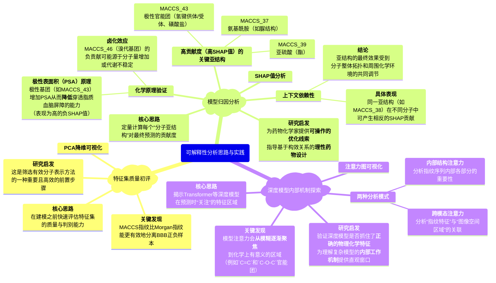

---
---
# **解构血脑屏障渗透性：一个可解释的多模态深度集成框架**

## **一、 论文整体概览**

### **1. 论文基本信息**

- **标题**：Interpretable Multimodal Deep Ensemble Framework Dissecting Blood–brain Barrier Permeability with Molecular Features
- **中文译名**：使用分子特征解构血脑屏障渗透性的可解释多模态深度集成框架
- **期刊**：The Journal of Physical Chemistry Letters
- **DOI**: 10.1021/acs.jpclett.5c01077
- **发表年份**：2025
- **Citation**: *J. Phys. Chem. Lett.* 2025, 16, 5806-5819

### **2. 摘要、背景与科学问题**

**摘要翻译**

血脑屏障渗透性（BBBP）预测在药物发现过程中扮演着关键角色，特别是对于靶向中枢神经系统（CNS）的化合物。尽管机器学习（ML）已显著推动了BBBP的预测，但目前仍迫切需要能够揭示调控BBB渗透性的物理化学原理的可解释性ML模型。在本研究中，我们提出了一个多模态ML框架，该框架整合了分子指纹（Morgan, MACCS, RDK）和图像特征以改进BBBP预测。分类任务（BBB可渗透 vs. 不可渗透）通过一个结合了多个基础分类器的堆叠集成模型来解决。在可比较的评估设置下，所提出的框架与近期的方法相比，展示了有竞争力的预测稳定性、泛化能力和特征可解释性。除了预测性能，我们的框架还结合了**主成分分析（PCA）**和**沙普利加性解释（SHAP）**分析，以突显对预测有贡献的关键指纹特征。回归任务（logBB值预测）则通过一个多输入深度学习框架来解决，该框架包含一个用于处理指纹的**Transformer编码器**，一个用于提取图像特征的**卷积神经网络（CNN）**，以及一个用于增强特征交互的**多头注意力融合机制**。从多模态特征中提取的**注意力图（Attention maps）**揭示了分子表示内部的令牌（token）级关系。这项工作提供了一个可解释的框架，用于以增强的透明度和机理洞察力来建模BBBP，并为未来结合透明描述符和物理信息特征的研究奠定了基础。

**背景与科学问题**

血脑屏障（BBB）是保护中枢神经系统（CNS）的关键生理屏障，但它也成为CNS药物研发的巨大障碍。准确预测一个候选药物能否穿透BBB，是其成药性的决定性因素之一。传统的实验方法成本高昂且耗时，因此开发快速、准确且**可靠的计算模型**至关重要。

近年来，机器学习（ML）和深度学习（DL）模型在BBBP预测上取得了很高的准确率。然而，这些高性能的模型往往像一个**“黑箱”**，研究人员难以理解其做出特定预测的具体依据。这种**可解释性的缺失**不仅阻碍了我们对模型预测的信任，更重要的是，我们无法从模型学到的知识中提炼出清晰的、指导性的化学规则来辅助新药的理性设计。

因此，本文的核心科学问题是：**如何在保证高预测精度的前提下，构建一个透明、可解释的BBBP预测框架，从而不仅“知其然”（预测结果），更能“知其所以然”（揭示分子结构与BBB渗透性之间的构效关系）？**

### **3. 模型框架总结**

为解决上述问题，作者提出了一个**多模态深度集成框架**，其核心是融合不同来源的分子信息来提供更丰富的表征。

- **多模态特征输入**：模型不依赖于单一的分子表示，而是同时整合了多种信息。其中**分子指纹**（`Morgan`、`MACCS` 和 `RDK`）和**2D分子图像特征**是两大核心输入模态。
- **指纹与模型的使用方式**：论文中的框架分别针对**分类**和**回归**两个任务设计了不同的模型。在评估时，`Morgan`、`MACCS`和`RDK`这三种指纹是**分开独立使用**的，即用每一种指纹分别训练和评估模型，以比较不同分子表示方法的效果。它们并未融合成一个单一的巨大特征向量。
- **双任务模型架构**：**图2**中展示的(a)和(b)是针对两个不同任务的**两种独立模型**。
  1. **分类模型（图2a，BBB+ vs. BBB-）**：该模型仅使用**分子指纹**作为输入。它采用一个**堆叠集成模型（Stacking Ensemble Model）**。该模型将多个基础分类器（如逻辑回归、随机森林、XGBoost等）的预测结果作为元特征（meta-features），再由一个最终的分类器进行综合决策，以提高模型的稳定性和泛化能力。
  2. **回归模型（图2b，logBB值预测）**：该模型采用了**多模态输入**，即同时使用**分子指纹**和**2D分子图像**。它是一个更复杂的**多输入深度学习网络**，使用`Transformer`处理序列化的指纹特征，用`CNN`处理图像特征，最后通过**多头注意力机制（Multi-Head Attention）**将这两种不同模态的特征进行深度融合。
- **图像特征的价值**：论文明确提出，通过多模态融合来**丰富分子表示**是其核心策略之一。在回归模型中，作者专门设计了CNN和注意力模块来处理和融合图像特征。结论部分也强调，多样化分子模态的融合（即指纹+图像）结合透明的归因技术，能够提供更准确和有意义的预测。**PCA分析（图8 e,f）显示，在与MACCS和RDK指纹融合后，特征空间的解释方差有所提升或保持高位，这表明图像特征确实为模型提供了有价值的互补信息**，特别是在通过跨模态注意力分析揭示两种特征的关联时，其价值更为凸显。

## **二、 核心可解释性方法与发现**

本文的亮点在于系统性地应用了多种前沿的可解释性技术来剖析其模型，从不同维度揭示了BBBP的分子层面的驱动因素。

### **1. 特征空间分析：PCA降维可视化**

在进行复杂的模型解释之前，作者首先使用了**主成分分析（PCA）**这一经典的无监督降维方法，来直观地评估不同分子指纹对BBB+/BBB-两类分子的区分能力。

- **做法与发现**：
  - 将所有分子的Morgan指纹和MACCS指纹分别通过PCA降到二维空间进行可视化。
  - **图6(a)**显示，在使用Morgan指纹时，BBB+（红色）和BBB-（蓝色）两类分子的数据点**严重重叠，难以区分**，且前两个主成分仅能解释总方差的极小部分（PC1: 1.36%, PC2: 1.16%）。这表明Morgan指纹生成的特征向量虽然信息量大，但可能过于稀疏或其线性组合难以捕捉到类别间的清晰界限。
  - 相比之下，**图6(b)**显示，在使用MACCS指纹时，两类分子的数据点形成了**相对清晰可分的簇**，且前两个主成分解释了更多的方差（PC1: 11.31%, PC2: 8.0%）。这说明**MACCS指纹定义的166个预设化学亚结构，能够更有效地捕捉与BBB渗透性相关的结构差异**。
- **应用与价值**：PCA分析虽然简单，但它是**在建模之前快速评估特征集质量和判别能力的有效手段**。通过这种方法，作者在早期就得出结论：MACCS指纹在这种二元分类任务中比Morgan指纹更具信息量，这为后续选择MACCS作为主要特征进行SHAP分析提供了依据。

### **2. SHAP分析：量化分子指纹的贡献**

**SHAP（Shapley Additive Explanations）**是一种源于合作博弈论的模型解释方法，它可以为单个样本的预测结果计算出每个输入特征的**贡献值（SHAP值）**。一个正的SHAP值表示该特征将预测推向正类（如BBB+），负值则推向负类（如BBB-）。

- 做法与发现：

  作者对表现最好的分类模型（基于MACCS指纹的堆叠模型）进行了SHAP分析。**图6(c)**的蜂群图（Beeswarm plot）直观地展示了所有测试样本中，对模型影响最大的前几个MACCS指紋特征。

  - **关键特征识别**：分析发现，`MACCS_43`（通常代表富含氢键供体/受体和磺酸盐的极性官能团）、`MACCS_39`（`O-S(=O)O`）、`MACCS_37`（`N-C(=O)N`）和`MACCS_38`（`N-C(-C)-N`）等特征具有最高的平均SHAP值，表明它们对模型的预测有**决定性影响**。
  - **化学意义的验证**：**图6(d)**展示了包含这些关键亚结构的具体分子示例。例如，`MACCS_43` 在一个分子中贡献了**+0.130**的正SHAP值，而在另一个分子中贡献了**-0.169**的负SHAP值。这与化学直觉相符：极性基团通常会增加分子的极性表面积（PSA），从而**降低其穿透富含脂质的血脑屏障的能力**（对应负的SHAP值，预测为BBB-）。`MACCS_46`（代表溴代亚结构）的SHAP值为负，这可能是因为过度卤化会增加分子量或引入代谢不稳定性，从而整体上降低了渗透性。
  - **上下文依赖性**：SHAP分析还揭示了亚结构贡献的**上下文依赖性**。例如，`MACCS_38`（对称的二胺结构）在某些分子中贡献为正（+0.108），而在另一些分子中为负（-0.057），这表明其最终效果受到分子整体拓扑结构和周围化学环境的调节。

- **应用与价值**：**SHAP提供了一种强大的、定量的手段，可以将抽象的模型预测归因于具体的、化学家可以理解的分子亚结构**。这使得模型的决策过程不再是“黑箱”，而是可以被验证和理解的。论文指出，这种由SHAP引导的分析**为以结构功能关系为基础的CNS靶向药物设计提供了可操作的见解**。虽然本文未直接展示用SHAP结果指导模型调优或新实验，但其揭示的关键特征无疑可以用于**指导特征工程**（例如，构建仅包含最重要特征的简化模型）或**提出需要通过实验验证的化学假说**（例如，系统性地修饰`MACCS_43`代表的基团来验证其对渗透性的影响）。

> **图6：特征分析与SHAP可解释性**
>
> **（a）** 使用Morgan特征的BBB+/BBB-样本的前两个主成分（PC）的PCA得分图。 **（b）** 使用MACCS特征的PCA得分图。 **（c）** 展示了使用MACCS指纹的模型中，样本级别的SHAP值分布的蜂群图。 **（d）** 包含关键亚结构的代表性分子的结构可视化，并标注了其对应的SHAP值（pos代表正贡献，neg代表负贡献）。

### **3. 注意力机制可视化：揭示模型内部焦点**

对于用于logBB值预测的**多输入深度学习模型**，作者利用其核心组件——**注意力机制（Attention Mechanism）**——来探索模型在进行预测时，其“注意力”集中在哪些特征上。

- **做法与发现**：
  - **内部结构注意力（Intra-Structure Attention）**：**图11(a)**展示了Transformer编码器内部的注意力热图。这张图揭示了模型在处理一个分子的指纹序列时，不同指纹“令牌”（tokens）之间的相互依赖关系。
  - **跨模态注意力（Cross-Modal Attention）**：**图11(b)**展示了从训练的第1个周期到第50个周期，**分子指纹特征**和**CNN提取的图像特征**之间的跨模态注意力图的演化。可以清晰地看到，随着训练的进行，模型逐渐学会将指纹中的特定信息（符号/化学特征）与图像中的特定空间区域（视觉特征）对应起来。模型的注意力从最初的模糊、分散状态，**逐渐锐化并聚焦于化学上有意义的区域**。
  - **具体案例分析**：以一个BBB+的分子`divinylether`为例，模型的高度注意力权重区域，无论是内部结构注意力还是跨模态注意力，都准确地**对应于其分子结构中的关键官能团**，如烯烃（`C=C`）和醚键（`C-O-C`）。
- **应用与价值**：**注意力可视化为理解深度学习模型（特别是基于Transformer的模型）的内部工作机制提供了一个直观的窗口**。它能告诉我们模型在做决策时“正在看哪里”，从而验证模型是否抓住了正确的物理化学特征，而不是依赖于数据中的某些伪影或噪声。这种方法为**以一种更具机理性的方式理解BBB渗透性提供了支持**。

> **图11：注意力权重的可视化**
>
> **（a）** 代表指纹内部结构的注意力热图。 **（B）** 从第1个训练周期到第50个训练周期，结合图像特征的跨模态注意力热图的演化过程。

## **三、 本文的局限性与未来展望**

作者在论文的结论部分坦诚地指出了当前工作的局限性，并对未来研究方向进行了展望。

- **需要更先进的特征选择技术**：尽管当前框架表现良好，但未来可以引入更先进的特征选择方法（如LASSO、SHAP-RFE）来进一步优化输入特征，可能会提升模型性能和可解释性。
- **需要更广泛的外部验证**：目前模型的验证主要基于B3DB数据集。为了证明其更广泛的适用性，未来需要在更多、更多样化的外部数据集上进行验证。
- **计算预测与实验验证的鸿沟**：模型最终需要与真实的实验结果相结合。未来的工作需要整合实验分析，以**弥合计算预测与药理学现实之间的差距**。
- **展望**：作者希望这个可解释的框架能够为药物发现早期阶段**CNS活性化合物的设计和优先级排序**做出贡献，并为未来融合更多透明化描述符和物理信息特征的研究铺平道路。